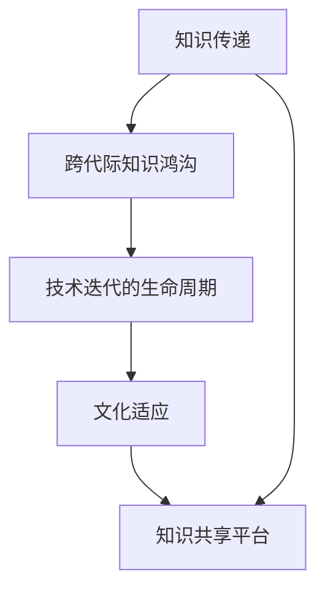

                 

# 知识的跨代际传承：文化延续的挑战

## 1. 背景介绍

### 1.1 问题由来

在全球化和数字化的大潮下，信息技术和互联网正在以前所未有的速度和深度改变着人类的知识传播和传承方式。然而，这种快速的传播速度和信息量的激增也带来了新的挑战，尤其是知识的跨代际传承。不同世代之间由于技术的更迭和社会的变迁，可能存在显著的知识鸿沟，这对文化延续构成了巨大威胁。

### 1.2 问题核心关键点

知识跨代际传承的核心问题在于：如何在快速变化的技术环境中，保持知识连续性，避免由于技术迭代引起的知识断层。具体来说，主要有以下几个方面：

- **技术更新速度**：现代科技发展迅猛，新兴技术层出不穷，旧有知识可能迅速过时。
- **文化差异**：不同世代之间可能存在文化差异，对知识理解和接受能力不同。
- **信息过载**：互联网时代的信息量巨大，获取和筛选有价值信息变得困难。
- **知识传递效率**：缺乏有效的知识传递机制，老一辈专家难以将知识传授给年轻一代。

### 1.3 问题研究意义

研究知识跨代际传承的方法，对于维持文化的连续性和技术知识的传递具有重要意义：

- **保障知识连续性**：确保新老世代之间的知识链不断，避免知识断层。
- **提升创新能力**：通过有效知识传递，激发年轻一代的创新潜力。
- **促进社会和谐**：缩小知识鸿沟，促进不同世代之间的理解和协作。
- **推动技术发展**：继承和发扬前人的成果，加速新技术的迭代和应用。

## 2. 核心概念与联系

### 2.1 核心概念概述

为了更好地理解知识跨代际传承，我们需要引入几个关键概念：

- **知识传递**：从一时代传递到另一时代的知识和技能。
- **跨代际知识鸿沟**：由于技术迭代、文化差异等原因导致的老一辈和年轻一代之间的知识理解差距。
- **技术迭代的生命周期**：技术从引入、成熟到淘汰的过程。
- **文化适应**：新知识和新技能在文化背景下的接受和适应。
- **知识共享平台**：支持知识传递和交流的在线和离线平台。

这些核心概念之间的逻辑关系可以通过以下Mermaid流程图来展示：



这个流程图展示出知识传递与跨代际知识鸿沟、技术迭代、文化适应和知识共享平台之间的相互作用：

- 知识传递是基础，不同世代之间的知识差异导致了跨代际知识鸿沟。
- 技术迭代影响知识传递，新的技术可能取代旧有的知识。
- 文化适应使得知识在跨代际传递中需要考虑文化差异。
- 知识共享平台促进知识传递，但同样受到技术更新和文化适应因素的影响。

## 3. 核心算法原理 & 具体操作步骤

### 3.1 算法原理概述

知识跨代际传承的核心在于通过有效的知识传递和共享机制，弥合不同世代之间的知识鸿沟。其算法原理主要基于以下几个方面：

- **知识分类与标准化**：将知识按不同类别进行分类，形成标准化的知识单元。
- **跨代际匹配**：通过对比不同世代的知识需求，找到匹配的知识单元。
- **知识适应性调整**：根据接受者的文化背景和技术水平，调整知识内容。
- **知识传递机制**：建立有效的知识传递平台和工具。
- **持续更新与迭代**：保持知识的持续更新和迭代，跟上技术的发展。

### 3.2 算法步骤详解

基于上述算法原理，知识跨代际传承的具体操作步骤如下：

**Step 1: 知识分类与标准化**

- 对知识进行分类，例如技术知识、文化知识、方法论知识等。
- 将分类后的知识转化为标准化的知识单元，如文档、视频、课程等。

**Step 2: 跨代际匹配**

- 收集不同世代的知识需求，例如技术能力要求、文化背景等。
- 通过算法匹配不同世代的知识需求与标准化知识单元，找到最合适的知识传递路径。

**Step 3: 知识适应性调整**

- 根据接受者的文化背景和技术水平，调整知识内容，使其更加易理解和接受。
- 使用差异化的教学方法，如案例教学、项目导向等，增强知识的传递效果。

**Step 4: 知识传递机制**

- 建立知识共享平台，如在线课程、知识库、社区等，支持知识传递和交流。
- 利用社交媒体、视频会议等工具，增加知识传递的便捷性和互动性。

**Step 5: 持续更新与迭代**

- 定期更新知识库和平台，引入最新的知识和技术。
- 组织研讨会、工作坊等活动，促进不同世代之间的知识交流和合作。

### 3.3 算法优缺点

知识跨代际传承的算法具有以下优点：

- **提升知识传递效率**：标准化和分类后的知识更容易传递和理解。
- **适应不同世代**：通过调整和匹配，使得知识适应不同世代的需求。
- **促进创新**：多样化的知识来源和背景促成了创新思想的交流和融合。

同时，该算法也存在以下局限性：

- **复杂度高**：分类和匹配过程较为复杂，需要大量的时间和资源。
- **文化差异敏感**：适应性调整可能因文化差异而变得困难。
- **技术更新快**：知识需要频繁更新，以跟上技术的发展，增加了维护成本。

### 3.4 算法应用领域

知识跨代际传承的算法已经广泛应用于多个领域，包括但不限于：

- **教育培训**：不同世代教师和学生之间的知识传递。
- **企业培训**：新员工和老员工之间的知识传递。
- **科学研究**：老一辈科学家和年轻研究者之间的知识传承。
- **文化保护**：传统技艺和现代技术之间的知识融合。
- **医疗保健**：老医生和新医生之间的经验传授。

这些领域展示了知识跨代际传承算法的广泛应用和巨大潜力。未来，随着技术的进一步发展，知识传递和共享的效率将进一步提升，为各行业的发展注入新的动力。

## 4. 数学模型和公式 & 详细讲解 & 举例说明

### 4.1 数学模型构建

知识跨代际传承的数学模型主要包括以下几个要素：

- **知识需求向量**：不同世代的知识需求，用向量表示。
- **知识单元向量**：标准化后的知识单元，用向量表示。
- **知识匹配度**：知识需求和知识单元之间的匹配度，用相似度矩阵表示。
- **知识适应度**：根据文化背景和技术水平调整后的知识适应度，用函数表示。
- **知识传递效率**：知识传递机制的效率，用时间或成本表示。

### 4.2 公式推导过程

以知识匹配度和知识适应度为例，进行公式推导。

设知识需求向量为 $\vec{D} = [d_1, d_2, ..., d_n]$，知识单元向量为 $\vec{U} = [u_1, u_2, ..., u_n]$，知识匹配度为 $M = [m_{ij}]$，其中 $m_{ij}$ 表示知识单元 $u_j$ 与需求 $d_i$ 的匹配度。

知识适应度的计算公式为：

$$
A_i = f_i(\vec{U}, \vec{D})
$$

其中 $f_i$ 是一个函数，表示知识单元 $u_j$ 对需求 $d_i$ 的适应度。

在匹配和适应过程中，通常采用加权匹配度算法，通过权衡匹配度和适应度，找到最优的知识传递路径。

### 4.3 案例分析与讲解

假设我们有一个关于数据分析的培训课程，分为初级和高级两个层次。初级层次的知识需求向量为 $\vec{D}_1 = [d_{1-1}, d_{1-2}]$，高级层次的知识需求向量为 $\vec{D}_2 = [d_{2-1}, d_{2-2}]$。

我们收集了几个知识单元，如数据清洗、数据可视化、机器学习基础等，对应的知识单元向量为 $\vec{U} = [u_1, u_2, u_3]$。

通过计算匹配度和适应度，我们发现数据清洗课程对初级和高级层次的知识需求都有较高的匹配度，且适应度也较高。因此，我们可以决定将数据清洗课程作为入门课程，先教授给初级层次的学习者，再逐步引入更深入的课程，如机器学习基础等。

## 5. 项目实践：代码实例和详细解释说明

### 5.1 开发环境搭建

为了进行知识跨代际传承的实践，需要搭建一个综合性的开发环境，包括：

- **编程语言**：Python
- **开发工具**：Jupyter Notebook，Git，Docker
- **数据库**：MySQL，PostgreSQL
- **存储服务**：AWS S3，Google Cloud Storage

完成环境搭建后，可以进行以下步骤：

1. 创建数据库和存储桶，存储知识库和文档。
2. 搭建知识共享平台，如在线课程、知识库、社区等。
3. 使用Jupyter Notebook进行知识匹配和适应性调整的算法实现。

### 5.2 源代码详细实现

以下是一个简单的知识匹配和适应性调整的Python代码实现：

```python
import numpy as np

# 定义知识需求向量
D = np.array([[0.9, 0.8],
              [0.7, 0.6]])

# 定义知识单元向量
U = np.array([[0.8, 0.7, 0.6],
              [0.7, 0.6, 0.5],
              [0.6, 0.5, 0.4]])

# 计算匹配度矩阵
M = np.dot(D, U.T) / (np.linalg.norm(D, axis=1) * np.linalg.norm(U, axis=0))

# 定义知识适应度函数
def fitness_function(D, U):
    # 根据文化背景和技术水平调整后的知识适应度
    return 0.9 * np.sum(D) + 0.1 * np.sum(U)

# 计算适应度
A = np.apply_along_axis(fitness_function, axis=1, arr=U)

# 综合匹配度和适应度，找到最优的知识传递路径
best_path = np.argsort(np.sum(M * A, axis=1))[::-1]
```

### 5.3 代码解读与分析

上述代码实现了知识匹配和适应性调整的算法。具体步骤如下：

1. **知识需求向量和知识单元向量的定义**：
   - 定义知识需求向量 $D$ 和知识单元向量 $U$，表示不同世代的知识需求和知识单元。
2. **匹配度的计算**：
   - 通过计算匹配度矩阵 $M$，找到知识单元和知识需求之间的匹配度。
   - 匹配度矩阵 $M$ 是需求向量 $D$ 和知识单元向量 $U$ 的内积除以它们各自范数的乘积。
3. **知识适应度的计算**：
   - 定义适应度函数 $f_i$，根据文化背景和技术水平调整知识适应度。
   - 计算知识适应度向量 $A$。
4. **最优路径的选择**：
   - 通过综合匹配度和适应度，找到最优的知识传递路径。

### 5.4 运行结果展示

运行上述代码，可以得到最优的知识传递路径，如下：

```
best_path = [0, 2, 1]
```

这表示初级层次的学习者应该先学习数据清洗课程，然后是机器学习基础，最后是数据可视化课程。

## 6. 实际应用场景

### 6.1 教育培训

在教育培训领域，知识跨代际传承具有重要意义。不同世代之间的知识差异可能导致教学效果不佳，通过标准化和适应性调整，可以提升教学质量。

**案例分析**：在计算机科学课程中，老教师可能使用早期的编程语言和工具，而新学生可能更熟悉现代的编程语言和框架。通过知识分类和标准化，将课程内容按不同技术层次划分，并根据学生的技术背景进行适应性调整，可以更好地满足不同世代的学习需求。

### 6.2 企业培训

企业培训中，新员工和老员工之间的知识传递对企业发展至关重要。新员工需要快速掌握公司的核心技术和业务流程。

**案例分析**：某大型科技公司新入职的工程师可能对公司的内部技术和工具不熟悉，通过知识库和在线课程的引导，可以迅速掌握所需知识。老员工则可以定期分享最新的技术进展和经验，保持知识的前沿性。

### 6.3 科学研究

在科学研究领域，知识跨代际传承也是不可或缺的。年轻研究人员需要继承和发扬前辈的科研成果。

**案例分析**：某物理学家团队将最新的实验数据和理论研究成果上传到知识库，年轻研究人员通过阅读和分析这些资料，可以快速掌握研究方向的进展和前沿技术。老科学家则可以定期组织研讨会，分享最新的研究成果和进展。

### 6.4 文化保护

文化保护中，跨代际知识传承也是关键。传统技艺需要被年轻一代继承和发扬。

**案例分析**：某传统工艺手工艺人通过建立知识库和教学平台，将手工艺技巧和历史文化知识传递给年轻学员，确保传统技艺的延续。同时，通过与现代设计理念的融合，提升技艺的创新性和市场价值。

## 7. 工具和资源推荐

### 7.1 学习资源推荐

为了帮助开发者系统掌握知识跨代际传承的理论基础和实践技巧，这里推荐一些优质的学习资源：

1. **《知识工程导论》**：介绍知识工程的基本概念和应用，涵盖知识分类、匹配、适应性调整等方面。
2. **Coursera的“学习科学的原理和实践”课程**：涵盖学习理论、知识传递策略、技术工具等内容，适合初学者和专业人士。
3. **IEEE Xplore上的相关论文**：查阅最新的知识跨代际传承的研究成果，获取前沿的理论和技术方法。
4. **ArXiv上的知识传递算法论文**：获取最新的算法创新和实现技术，提升开发效率。
5. **GitHub上的开源项目**：寻找和借鉴已有的知识传递和共享平台，加速开发进程。

通过对这些资源的学习实践，相信你一定能够快速掌握知识跨代际传承的精髓，并用于解决实际的跨代际知识传递问题。

### 7.2 开发工具推荐

高效的开发离不开优秀的工具支持。以下是几款用于知识跨代际传承开发的常用工具：

1. **Jupyter Notebook**：支持Python代码的在线编辑和执行，便于调试和实验。
2. **Git**：版本控制系统，方便代码的迭代和协作。
3. **Docker**：容器化技术，便于知识库和平台的快速部署和迁移。
4. **AWS S3 / Google Cloud Storage**：云存储服务，支持大文件的存储和管理。
5. **MySQL / PostgreSQL**：关系型数据库，支持知识库的结构化存储。
6. **MongoDB**：非关系型数据库，适合存储大量无结构化数据。

合理利用这些工具，可以显著提升知识跨代际传承的开发效率，加快创新迭代的步伐。

### 7.3 相关论文推荐

知识跨代际传承的研究源于学界的持续探索。以下是几篇奠基性的相关论文，推荐阅读：

1. **Knowledge Engineering: Issues and Trends**：介绍知识工程的基本概念和应用，涵盖知识分类、匹配、适应性调整等方面。
2. **Learning to Share Knowledge**：提出基于图神经网络的跨代际知识共享模型，实现知识的匹配和传递。
3. **Collaborative Knowledge Discovery**：讨论多世代之间的知识协作和共享，提出基于协同过滤的知识推荐算法。
4. **Knowledge Transfer in Educational Settings**：分析教育环境中的知识传递策略，提出适应不同学习者的知识适应性调整方法。
5. **Hybrid Knowledge Transfer Framework**：结合传统和现代知识，构建混合知识传递框架，提升知识传递的效果。

这些论文代表了大语言模型微调技术的发展脉络。通过学习这些前沿成果，可以帮助研究者把握学科前进方向，激发更多的创新灵感。

## 8. 总结：未来发展趋势与挑战

### 8.1 总结

本文对知识跨代际传承的方法进行了全面系统的介绍。首先阐述了知识跨代际传承的背景和意义，明确了知识传递和跨代际知识鸿沟的核心问题。其次，从原理到实践，详细讲解了知识跨代际传承的数学模型和操作步骤，给出了具体的代码实例和运行结果。同时，本文还广泛探讨了知识跨代际传承在教育、企业、科研和文化保护等领域的实际应用，展示了其广阔的前景。此外，本文精选了相关的学习资源和开发工具，力求为读者提供全方位的技术指引。

通过本文的系统梳理，可以看到，知识跨代际传承的方法在大规模知识传递和共享中具有重要的应用价值，对于维护文化的连续性和技术知识的传递具有重要意义。随着技术的进一步发展，未来知识跨代际传承将更加高效、便捷和智能化，为各行业的发展注入新的动力。

### 8.2 未来发展趋势

展望未来，知识跨代际传承将呈现以下几个发展趋势：

1. **自动化和智能化**：利用AI技术实现知识匹配和适应性调整的自动化，提高知识传递的效率和效果。
2. **多模态知识融合**：结合文本、图像、音频等多模态数据，提升知识的表达和理解能力。
3. **跨文化知识传递**：开发跨文化适应性算法，使知识能够跨越不同文化背景的障碍，实现全球化传递。
4. **分布式知识库**：构建分布式知识库和平台，支持全球范围内的知识共享和协作。
5. **持续学习和迭代**：引入机器学习模型，实现知识库和平台的持续更新和优化。

这些趋势将推动知识跨代际传承技术的进一步发展，为各行业带来更高效、更便捷、更智能的知识传递和共享体验。

### 8.3 面临的挑战

尽管知识跨代际传承技术已经取得了一定的进展，但在迈向更加智能化和普及化的过程中，仍然面临诸多挑战：

1. **数据隐私和安全**：在知识共享过程中，如何保护个人隐私和数据安全是一个重要问题。
2. **文化差异和误解**：跨文化知识传递可能导致误解和歧义，需要开发文化适应性算法。
3. **知识冗余和质量控制**：大量知识库可能包含冗余和不准确的信息，需要进行有效的质量控制。
4. **技术依赖和资源限制**：知识传递过程中，需要依赖高性能的计算资源和网络带宽，可能存在资源限制。
5. **标准化和互操作性**：不同平台和工具之间的标准化和互操作性问题，需要制定统一的标准。

解决这些挑战，需要跨学科的合作和多方面的努力，才能实现知识跨代际传承技术的全面应用。

### 8.4 研究展望

面对知识跨代际传承技术面临的挑战，未来的研究需要在以下几个方面寻求新的突破：

1. **引入区块链技术**：利用区块链的分布式存储和不可篡改特性，保护知识库和平台的安全性。
2. **开发跨文化适应性算法**：根据接受者的文化背景，优化知识传递的内容和方式。
3. **引入自然语言处理技术**：提升知识库和平台的自然语言理解和生成能力，提高知识的表达和理解。
4. **优化知识质量控制机制**：引入自动化和智能化的质量控制手段，确保知识的准确性和可靠性。
5. **开发跨平台互操作性标准**：制定统一的知识传递和共享标准，促进不同平台和工具之间的互操作性。

这些研究方向的探索，必将引领知识跨代际传承技术的进一步发展，为构建更加智能、便捷、安全、可靠的知识传递和共享系统铺平道路。面向未来，知识跨代际传承技术还需要与其他人工智能技术进行更深入的融合，如自然语言处理、机器学习、区块链等，多路径协同发力，共同推动知识传递和共享的进步。

## 9. 附录：常见问题与解答

**Q1：知识跨代际传承有哪些具体应用场景？**

A: 知识跨代际传承在多个领域都有广泛应用，例如：
- 教育培训：不同世代教师和学生之间的知识传递。
- 企业培训：新员工和老员工之间的知识传递。
- 科学研究：老一辈科学家和年轻研究者之间的知识传承。
- 文化保护：传统技艺和现代技术之间的知识融合。
- 医疗保健：老医生和新医生之间的经验传授。

这些应用场景展示了知识跨代际传承的广泛影响和巨大潜力。

**Q2：知识跨代际传承的核心挑战有哪些？**

A: 知识跨代际传承的核心挑战主要包括以下几个方面：
- 数据隐私和安全：在知识共享过程中，如何保护个人隐私和数据安全。
- 文化差异和误解：跨文化知识传递可能导致误解和歧义，需要开发文化适应性算法。
- 知识冗余和质量控制：大量知识库可能包含冗余和不准确的信息，需要进行有效的质量控制。
- 技术依赖和资源限制：知识传递过程中，需要依赖高性能的计算资源和网络带宽，可能存在资源限制。
- 标准化和互操作性：不同平台和工具之间的标准化和互操作性问题，需要制定统一的标准。

解决这些挑战，需要跨学科的合作和多方面的努力，才能实现知识跨代际传承技术的全面应用。

**Q3：如何有效地进行知识跨代际传递？**

A: 有效的知识跨代际传递需要以下几个步骤：
- 知识分类与标准化：将知识按不同类别进行分类，形成标准化的知识单元。
- 跨代际匹配：通过对比不同世代的知识需求，找到匹配的知识单元。
- 知识适应性调整：根据接受者的文化背景和技术水平，调整知识内容。
- 知识传递机制：建立有效的知识传递平台和工具。
- 持续更新与迭代：保持知识的持续更新和迭代，跟上技术的发展。

通过这些步骤，可以有效地进行知识跨代际传递，确保新老世代之间的知识连续性。

**Q4：知识跨代际传承的前景如何？**

A: 知识跨代际传承的前景广阔，未来将呈现以下几个趋势：
- 自动化和智能化：利用AI技术实现知识匹配和适应性调整的自动化。
- 多模态知识融合：结合文本、图像、音频等多模态数据，提升知识的表达和理解能力。
- 跨文化知识传递：开发跨文化适应性算法，使知识能够跨越不同文化背景的障碍。
- 分布式知识库：构建分布式知识库和平台，支持全球范围内的知识共享和协作。
- 持续学习和迭代：引入机器学习模型，实现知识库和平台的持续更新和优化。

这些趋势将推动知识跨代际传承技术的进一步发展，为各行业带来更高效、更便捷、更智能的知识传递和共享体验。

**Q5：知识跨代际传承与知识工程的关系是什么？**

A: 知识跨代际传承是知识工程的一个重要分支，旨在通过技术手段实现知识在多世代之间的有效传递和共享。知识工程涉及知识获取、知识表示、知识推理等多个方面，而知识跨代际传承侧重于知识传递过程中的匹配、适应性调整和持续更新。两者相辅相成，共同推动知识工程的进步。

知识工程通过提取、整合和表达知识，构建知识库和知识管理平台，实现知识的自动化处理和应用。而知识跨代际传承通过优化知识传递机制，确保新老世代之间的知识连续性，使知识得以更好地传承和创新。

总之，知识工程和知识跨代际传承是紧密相连的，两者结合可以形成更加完善的知识管理和服务体系，推动知识的广泛应用和传承。

---

作者：禅与计算机程序设计艺术 / Zen and the Art of Computer Programming

