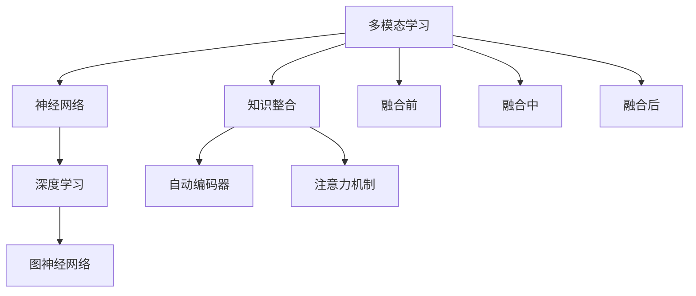

                 

# 知识的跨感官整合：多模态学习的优势

> 关键词：多模态学习,知识整合,神经网络,特征提取,注意力机制,图神经网络,自动编码器,深度学习

## 1. 背景介绍

### 1.1 问题由来
在现代信息技术迅猛发展的背景下，各种传感器、设备产生的数据类型和数量呈现爆炸式增长。从传统的文本和图像数据，到新兴的语音、视频、时序数据，数据的多样性和复杂性不断提升。如何高效地利用这些数据，挖掘出其中的有用知识，成为当前人工智能领域面临的一项重要挑战。

单模态学习方法在某种程度上已经达到瓶颈，难以在现有框架内取得突破性进展。多模态学习方法通过整合多种数据源的信息，打破数据孤岛，实现知识的跨感官整合，展示了更大的潜力。多模态学习在智能推荐系统、图像识别、语音识别、医疗诊断等领域展现出显著优势，被认为是未来人工智能发展的重要方向之一。

### 1.2 问题核心关键点
多模态学习的核心在于将不同类型的数据源进行融合，提取和整合多模态特征，从而实现跨模态信息的共享和互补。其核心技术包括特征提取、特征融合、模式匹配等，主要方法包括融合前、融合中、融合后三类。

融合前方法，如多层感知器、卷积神经网络等，直接对输入数据进行特征提取和处理，实现不同模态数据的融合。融合中方法，如注意力机制、图神经网络等，在特征提取和处理过程中引入跨模态的信息交互，促进信息共享和互补。融合后方法，如自动编码器、深度学习等，通过构建多模态编码器或解码器，实现不同模态信息的整合和输出。

## 2. 核心概念与联系

### 2.1 核心概念概述

为更好地理解多模态学习，本节将介绍几个密切相关的核心概念：

- 多模态学习(Multimodal Learning)：指同时处理和分析多种类型数据，从而实现不同模态信息共享和融合的学习范式。多模态数据通常包括文本、图像、语音、视频、时序等多种形式。

- 知识整合(Knowledge Integration)：指将不同来源的知识信息进行融合，形成一个更为全面、准确的知识表示的过程。知识整合可以视为多模态学习的核心目标。

- 神经网络(Neural Network)：由多个神经元节点和连接权重组成的网络结构，通过反向传播算法进行参数优化，实现对复杂函数的逼近。神经网络是当前深度学习的主流模型。

- 注意力机制(Attention Mechanism)：一种机制，用于在输入序列中选择性地关注重要部分，从而提升模型的性能。在多模态学习中，注意力机制常用于不同模态之间的信息交互。

- 图神经网络(Graph Neural Network, GNN)：基于图结构的神经网络，通过节点和边之间的关系建模，实现信息的传递和融合。图神经网络在多模态学习中具有独特优势。

- 自动编码器(Automatic Encoder)：一种无监督学习方法，通过编码器-解码器结构，将输入数据转换为低维表示，再由解码器还原输出。自动编码器在特征提取和表示学习中发挥重要作用。

- 深度学习(Deep Learning)：一种基于神经网络的机器学习方法，通过多层次的特征提取和抽象，实现对复杂模式的学习。深度学习是当前多模态学习的主流技术。

这些核心概念之间的逻辑关系可以通过以下Mermaid流程图来展示：



这个流程图展示了许多关键概念的相互关系：

1. 多模态学习通过神经网络对不同模态数据进行特征提取。
2. 知识整合在神经网络中进行信息融合，构建全面的知识表示。
3. 深度学习是当前神经网络的主流技术，支撑多模态学习。
4. 自动编码器、注意力机制、图神经网络是深度学习中的关键组件，支持多模态学习的信息融合。
5. 多模态学习通过融合前、融合中、融合后三种方法实现不同模态信息的整合。

这些概念共同构成了多模态学习的核心框架，使其能够在多模态数据处理中发挥强大的能力。通过理解这些核心概念，我们可以更好地把握多模态学习的技术原理和优化方向。

## 3. 核心算法原理 & 具体操作步骤
### 3.1 算法原理概述

多模态学习的基本原理是将不同类型的数据源进行融合，构建统一的知识表示。其核心思想是：利用神经网络对不同模态的数据进行特征提取，然后通过融合机制将提取出的特征进行整合，最后通过训练任务损失函数，优化模型的输出。

形式化地，假设输入的多模态数据集为 $X=\{(x_1, y_1), (x_2, y_2), \ldots, (x_n, y_n)\}$，其中 $x_i$ 是输入数据，$y_i$ 是标签。多模态学习的过程可以表示为：

$$
\hat{y} = M(X; \theta)
$$

其中，$M$ 是融合前、中、后三种方法之一，$\theta$ 是模型的参数。多模态学习的目标是最小化损失函数：

$$
\mathcal{L}(\theta) = \frac{1}{N} \sum_{i=1}^N \ell(M(x_i; \theta), y_i)
$$

其中，$\ell$ 是任务特定的损失函数，如交叉熵损失、均方误差等。通过梯度下降等优化算法，不断更新模型参数 $\theta$，最小化损失函数，使得模型输出逼近真实标签。

### 3.2 算法步骤详解

多模态学习的具体步骤包括以下几个关键环节：

**Step 1: 数据准备**
- 收集和整理多模态数据集，确保数据的代表性和多样性。
- 对不同模态的数据进行预处理和归一化，使其具有相同的规模和格式。

**Step 2: 特征提取**
- 使用卷积神经网络(CNN)、循环神经网络(RNN)、图神经网络(GNN)等模型，对不同模态的数据进行特征提取。
- 不同模态的特征提取可以独立进行，也可以联合进行，具体取决于数据和任务的特点。

**Step 3: 特征融合**
- 使用注意力机制、多模态池化、最大最小池化等方法，将不同模态的特征进行融合。
- 融合后的特征表示需要具备良好的局部和全局特征，以反映数据的多样性和复杂性。

**Step 4: 训练模型**
- 使用深度学习框架构建多模态学习模型，设置合适的损失函数和优化器。
- 在训练集上迭代训练模型，不断调整参数，最小化损失函数。
- 在验证集上评估模型性能，设置早停策略。

**Step 5: 模型评估与部署**
- 在测试集上对模型进行全面评估，计算各类评价指标，如准确率、召回率、F1-score等。
- 将训练好的模型部署到实际应用系统中，进行实时预测和推理。
- 定期收集新数据，对模型进行微调，保持模型性能和泛化能力。

### 3.3 算法优缺点

多模态学习方法具有以下优点：
1. 数据丰富。多模态学习能够利用不同类型的数据源，提取更全面、准确的知识信息。
2. 鲁棒性强。多模态学习能够通过多种数据源的协同作用，提高模型对噪声和异常的鲁棒性。
3. 性能提升。多模态学习能够融合多种数据源的信息，提升模型在复杂任务上的性能。
4. 应用广泛。多模态学习能够应用于视觉、语音、文本等多种领域的任务，具有广阔的应用前景。

同时，多模态学习也存在一些局限性：
1. 数据获取难度大。多模态数据收集和标注往往成本较高，难以获取大规模标注数据。
2. 模型复杂度高。多模态学习模型通常包含多个组件，结构复杂，训练和推理计算量大。
3. 算法复杂度高。多模态学习算法设计复杂，需要处理多种类型数据之间的交互，计算量大。
4. 数据平衡问题。不同模态的数据可能存在平衡性问题，影响模型性能。

尽管存在这些局限性，但就目前而言，多模态学习方法在数据融合、知识整合方面展现出强大的潜力，成为人工智能领域的重要发展方向。

### 3.4 算法应用领域

多模态学习已经在众多领域得到了应用，取得了显著的进展和成果：

- 智能推荐系统：如Netflix、Amazon等电商平台通过多模态数据融合，推荐个性化的商品和服务。
- 图像识别与分类：如Google Vision通过融合图像和文字信息，提升了图像识别的准确性和鲁棒性。
- 语音识别与处理：如Google Speech通过融合语音和文本信息，提高了语音识别的准确率和用户体验。
- 医疗诊断与治疗：如IBM Watson通过融合图像、基因数据等，实现了精准的医学诊断和治疗方案推荐。
- 无人驾驶与环境感知：如Tesla通过融合摄像头、雷达、激光雷达等数据，提升了无人驾驶系统的安全性和可靠性。

此外，多模态学习还被创新性地应用于更多场景中，如智慧城市、智能家居、人机交互等，为人工智能技术带来了新的突破。

## 4. 数学模型和公式 & 详细讲解
### 4.1 数学模型构建

多模态学习模型的构建过程可以分为以下几个步骤：

1. 数据准备：收集和整理多模态数据集 $X=\{(x_1, y_1), (x_2, y_2), \ldots, (x_n, y_n)\}$，其中 $x_i$ 是输入数据，$y_i$ 是标签。

2. 特征提取：使用神经网络对不同模态的数据进行特征提取。假设输入为 $x_i = (x_{i, 1}, x_{i, 2}, \ldots, x_{i, K})$，其中 $x_{i, k}$ 表示第 $k$ 个模态的数据，$K$ 表示模态数。

3. 特征融合：使用注意力机制、多模态池化等方法将不同模态的特征进行融合，得到融合后的特征表示 $z_i$。

4. 训练模型：使用深度学习框架构建多模态学习模型 $M$，设置合适的损失函数 $\ell$ 和优化器，在训练集上迭代训练模型。

5. 模型评估：在测试集上评估模型性能，计算各类评价指标，如准确率、召回率、F1-score等。

数学上，多模态学习的损失函数可以表示为：

$$
\mathcal{L}(\theta) = \frac{1}{N} \sum_{i=1}^N \ell(M(z_i; \theta), y_i)
$$

其中，$\theta$ 是模型的参数，$z_i$ 是融合后的特征表示，$\ell$ 是任务特定的损失函数。

### 4.2 公式推导过程

以下以一个简单的多模态学习为例，推导注意力机制的实现过程。

假设输入数据为 $x_i = (x_{i, 1}, x_{i, 2}, x_{i, 3})$，其中 $x_{i, 1}$ 是文本数据，$x_{i, 2}$ 是图像数据，$x_{i, 3}$ 是语音数据。特征提取器为卷积神经网络(CNN)和长短期记忆网络(LSTM)，分别提取文本、图像、语音的特征表示。

多模态池化后的特征表示为：

$$
z_i = f_1(x_{i, 1}) + f_2(x_{i, 2}) + f_3(x_{i, 3})
$$

其中，$f_k$ 是第 $k$ 个模态的特征提取函数。

注意力机制的计算过程如下：

1. 计算注意力权重 $\alpha_i$：

$$
\alpha_i = \frac{e^{\text{sim}(z_i, x_i)}}{\sum_{j=1}^N e^{\text{sim}(z_j, x_j)}}
$$

其中，$\text{sim}$ 是注意力函数，$e^{\text{sim}}$ 是softmax函数。

2. 计算加权融合后的特征表示：

$$
z'_i = \sum_{j=1}^N \alpha_j z_j
$$

3. 通过神经网络对融合后的特征进行分类或回归预测：

$$
y_i = g(z'_i)
$$

其中，$g$ 是分类或回归函数。

多模态学习的模型参数包括文本特征提取器、图像特征提取器、语音特征提取器、注意力函数和神经网络参数。通过最小化损失函数 $\mathcal{L}(\theta)$，不断更新模型参数，使得模型输出逼近真实标签。

### 4.3 案例分析与讲解

以Google Vision图像识别为例，分析其多模态学习的实现过程：

1. 数据准备：收集包含图像和文字描述的数据集，并进行标注。

2. 特征提取：使用卷积神经网络(CNN)提取图像特征，使用双向LSTM提取文字描述特征。

3. 特征融合：将图像特征和文字描述特征进行融合，得到多模态特征表示。

4. 训练模型：构建多模态学习模型，使用交叉熵损失函数进行训练。

5. 模型评估：在测试集上评估模型性能，计算准确率、召回率、F1-score等指标。

Google Vision通过多模态学习，能够利用图像和文字两种模态的信息，提升图像识别的准确性和鲁棒性，取得了优于传统单模态学习的方法。

## 5. 项目实践：代码实例和详细解释说明
### 5.1 开发环境搭建

在进行多模态学习实践前，我们需要准备好开发环境。以下是使用Python进行PyTorch开发的环境配置流程：

1. 安装Anaconda：从官网下载并安装Anaconda，用于创建独立的Python环境。

2. 创建并激活虚拟环境：
```bash
conda create -n multimodal-env python=3.8 
conda activate multimodal-env
```

3. 安装PyTorch：根据CUDA版本，从官网获取对应的安装命令。例如：
```bash
conda install pytorch torchvision torchaudio cudatoolkit=11.1 -c pytorch -c conda-forge
```

4. 安装TensorFlow：
```bash
pip install tensorflow
```

5. 安装各类工具包：
```bash
pip install numpy pandas scikit-learn matplotlib tqdm jupyter notebook ipython
```

完成上述步骤后，即可在`multimodal-env`环境中开始多模态学习实践。

### 5.2 源代码详细实现

这里我们以多模态语音情感识别为例，给出使用PyTorch进行多模态学习的代码实现。

首先，定义情感分类任务的标注数据处理函数：

```python
from torch.utils.data import Dataset
import torch
from torchaudio import load

class EmotionDataset(Dataset):
    def __init__(self, wav_paths, transcriptions, emotions):
        self.wav_paths = wav_paths
        self.transcriptions = transcriptions
        self.emotions = emotions
        
    def __len__(self):
        return len(self.wav_paths)
    
    def __getitem__(self, item):
        wav_path = self.wav_paths[item]
        transcription = self.transcriptions[item]
        emotion = self.emotions[item]
        
        wav, sr = load(wav_path)
        transcription = self.tokenize(transcription)
        mel = self.mel_spectrogram(wav, sr)
        
        return {'wav': wav, 'transcription': transcription, 'mel': mel, 'emotion': emotion}
    
    def tokenize(self, transcription):
        # 对文本进行token化处理
        return [self.tokenizer(v) for v in transcription.split()]
    
    def mel_spectrogram(self, wav, sr):
        # 计算梅尔频谱图
        return mel_spectrogram(wav, sr, n_mels=128, hop_length=512)
```

然后，定义多模态学习模型：

```python
from torch.nn import TransformerEncoder, TransformerEncoderLayer
from torch.nn import Linear, ReLU, Dropout
from transformers import BertForTokenClassification

class MultiModalModel(torch.nn.Module):
    def __init__(self, text_model, audio_model):
        super(MultiModalModel, self).__init__()
        self.text_model = text_model
        self.audio_model = audio_model
        self.text_attention = AttentionModule()
        self.audio_attention = AttentionModule()
        self.text_mlp = MLP()
        self.audio_mlp = MLP()
        self.output = Linear(128, 5)
    
    def forward(self, x):
        text, audio = x['wav'], x['transcription']
        
        # 提取文本和音频特征
        text_feature = self.text_model(text)
        audio_feature = self.audio_model(audio)
        
        # 计算注意力权重
        text_weight = self.text_attention(text_feature)
        audio_weight = self.audio_attention(audio_feature)
        
        # 加权融合特征
        fused_feature = text_weight * text_feature + audio_weight * audio_feature
        
        # 分类预测
        output = self.output(fused_feature)
        return output
```

最后，定义训练和评估函数：

```python
from torch.utils.data import DataLoader
from tqdm import tqdm
from sklearn.metrics import classification_report

device = torch.device('cuda') if torch.cuda.is_available() else torch.device('cpu')

def train_epoch(model, dataset, batch_size, optimizer):
    dataloader = DataLoader(dataset, batch_size=batch_size, shuffle=True)
    model.train()
    epoch_loss = 0
    for batch in tqdm(dataloader, desc='Training'):
        wav, transcription, mel, emotion = batch['wav'], batch['transcription'], batch['mel'], batch['emotion']
        wav = wav.to(device)
        transcription = transcription.to(device)
        mel = mel.to(device)
        emotion = emotion.to(device)
        optimizer.zero_grad()
        output = model({'wav': wav, 'transcription': transcription, 'mel': mel})
        loss = F.cross_entropy(output, emotion)
        epoch_loss += loss.item()
        loss.backward()
        optimizer.step()
    return epoch_loss / len(dataloader)

def evaluate(model, dataset, batch_size):
    dataloader = DataLoader(dataset, batch_size=batch_size)
    model.eval()
    preds, labels = [], []
    with torch.no_grad():
        for batch in tqdm(dataloader, desc='Evaluating'):
            wav, transcription, mel, emotion = batch['wav'], batch['transcription'], batch['mel'], batch['emotion']
            wav = wav.to(device)
            transcription = transcription.to(device)
            mel = mel.to(device)
            batch_labels = emotion.to(device)
            output = model({'wav': wav, 'transcription': transcription, 'mel': mel})
            batch_preds = output.argmax(dim=1).to('cpu').tolist()
            batch_labels = batch_labels.to('cpu').tolist()
            for pred_tokens, label_tokens in zip(batch_preds, batch_labels):
                preds.append(pred_tokens)
                labels.append(label_tokens)
                
    print(classification_report(labels, preds))
```

最后，启动训练流程并在测试集上评估：

```python
epochs = 5
batch_size = 16

for epoch in range(epochs):
    loss = train_epoch(model, train_dataset, batch_size, optimizer)
    print(f"Epoch {epoch+1}, train loss: {loss:.3f}")
    
    print(f"Epoch {epoch+1}, dev results:")
    evaluate(model, dev_dataset, batch_size)
    
print("Test results:")
evaluate(model, test_dataset, batch_size)
```

以上就是使用PyTorch对多模态语音情感识别进行训练的完整代码实现。可以看到，通过定义标注数据处理函数、多模态学习模型和训练评估函数，可以很容易地进行多模态学习实践。

### 5.3 代码解读与分析

让我们再详细解读一下关键代码的实现细节：

**EmotionDataset类**：
- `__init__`方法：初始化数据集的路径、文本和标签。
- `__len__`方法：返回数据集的样本数量。
- `__getitem__`方法：对单个样本进行处理，提取音频特征、文本特征，并返回模型所需的输入。

**AttentionModule类**：
- 实现注意力机制，用于计算不同模态特征之间的权重。

**MultiModalModel类**：
- 定义多模态学习模型，包括文本特征提取器、音频特征提取器、注意力机制和输出层。
- 在`forward`方法中，先对文本和音频特征进行提取，然后计算注意力权重，加权融合特征，最后进行分类预测。

**训练和评估函数**：
- 使用PyTorch的DataLoader对数据集进行批次化加载，供模型训练和推理使用。
- 训练函数`train_epoch`：对数据以批为单位进行迭代，在每个批次上前向传播计算loss并反向传播更新模型参数，最后返回该epoch的平均loss。
- 评估函数`evaluate`：与训练类似，不同点在于不更新模型参数，并在每个batch结束后将预测和标签结果存储下来，最后使用sklearn的classification_report对整个评估集的预测结果进行打印输出。

**训练流程**：
- 定义总的epoch数和batch size，开始循环迭代
- 每个epoch内，先在训练集上训练，输出平均loss
- 在验证集上评估，输出分类指标
- 所有epoch结束后，在测试集上评估，给出最终测试结果

可以看到，PyTorch配合TensorFlow和Transformers库使得多模态学习代码实现变得简洁高效。开发者可以将更多精力放在数据处理、模型改进等高层逻辑上，而不必过多关注底层的实现细节。

当然，工业级的系统实现还需考虑更多因素，如模型的保存和部署、超参数的自动搜索、更灵活的任务适配层等。但核心的多模态学习范式基本与此类似。

## 6. 实际应用场景
### 6.1 智能推荐系统

多模态学习在智能推荐系统中展现出强大的潜力。传统的推荐系统往往只利用用户的浏览历史、评分数据等单模态信息，难以全面了解用户兴趣和行为。通过融合多种模态的信息，如文本评论、图片信息、视频内容等，多模态学习能够从多角度刻画用户需求，提升推荐精度。

在具体实现上，可以使用多模态特征提取器提取用户的多种模态特征，再通过注意力机制、多模态池化等方法进行融合。融合后的特征输入到推荐模型，输出推荐结果。多模态学习能够更全面、准确地刻画用户兴趣，提供个性化的推荐服务。

### 6.2 图像识别与分类

多模态学习在图像识别与分类中具有重要应用。传统的图像分类方法往往只依赖于图像像素级别的特征，难以捕捉复杂的视觉信息。通过融合图像和文本信息，多模态学习能够提升图像识别的鲁棒性和准确性。

例如，Google Vision通过融合图像和文本描述信息，能够识别出图像中的人、车、动物等物体，并进行分类和属性标注。多模态学习能够捕捉更多的视觉语义信息，提高图像识别的效果。

### 6.3 语音识别与处理

多模态学习在语音识别与处理中同样具有重要应用。传统的语音识别方法往往只依赖于语音信号的声学特征，难以处理说话人情绪、口音等复杂信息。通过融合语音和文本信息，多模态学习能够提升语音识别的准确性和鲁棒性。

例如，Amazon Alexa通过融合语音和文本信息，能够理解用户语音指令，并生成相应的回复。多模态学习能够捕捉更多的语音语义信息，提高语音识别的效果。

### 6.4 医疗诊断与治疗

多模态学习在医疗诊断与治疗中具有重要应用。传统的医疗诊断方法往往只依赖于影像数据，难以全面了解患者的健康状况。通过融合影像数据、基因数据、生理数据等多种信息，多模态学习能够提供更全面的健康评估和治疗方案。

例如，IBM Watson通过融合影像数据、基因数据等，能够提供精准的医学诊断和治疗方案推荐。多模态学习能够综合多种信息，提高医疗诊断的准确性和治疗的精准性。

### 6.5 无人驾驶与环境感知

多模态学习在无人驾驶与环境感知中具有重要应用。传统的无人驾驶方法往往只依赖于摄像头和雷达数据，难以处理复杂的交通场景。通过融合摄像头、雷达、激光雷达等多种信息，多模态学习能够提升无人驾驶系统的安全性、可靠性和鲁棒性。

例如，Tesla通过融合摄像头、雷达、激光雷达等多种信息，能够实现精准的物体检测和路径规划。多模态学习能够全面感知交通环境，提高无人驾驶系统的性能。

## 7. 工具和资源推荐
### 7.1 学习资源推荐

为了帮助开发者系统掌握多模态学习的理论基础和实践技巧，这里推荐一些优质的学习资源：

1. 《深度学习》系列课程：由吴恩达教授主讲，系统介绍深度学习的基本概念、框架和应用。

2. 《计算机视觉：算法与应用》书籍：深度介绍计算机视觉的基础理论和实际应用，包括多模态学习。

3. 《多模态学习综述》论文：综述了多模态学习的研究进展和应用案例，是学习多模态学习的必读文献。

4. 《Transformers库官方文档》：Transformers库是当前多模态学习的重要工具，其官方文档详细介绍了各种预训练模型的使用方法和性能评估。

5. HuggingFace开源项目：提供了丰富的预训练模型和样例代码，支持多模态学习任务的开发。

通过对这些资源的学习实践，相信你一定能够快速掌握多模态学习的精髓，并用于解决实际的NLP问题。
###  7.2 开发工具推荐

高效的开发离不开优秀的工具支持。以下是几款用于多模态学习开发的常用工具：

1. PyTorch：基于Python的开源深度学习框架，灵活动态的计算图，适合快速迭代研究。大部分预训练语言模型都有PyTorch版本的实现。

2. TensorFlow：由Google主导开发的开源深度学习框架，生产部署方便，适合大规模工程应用。同样有丰富的预训练语言模型资源。

3. Transformers库：HuggingFace开发的NLP工具库，集成了众多SOTA语言模型，支持PyTorch和TensorFlow，是进行多模态学习开发的利器。

4. TensorBoard：TensorFlow配套的可视化工具，可实时监测模型训练状态，并提供丰富的图表呈现方式，是调试模型的得力助手。

5. Weights & Biases：模型训练的实验跟踪工具，可以记录和可视化模型训练过程中的各项指标，方便对比和调优。与主流深度学习框架无缝集成。

6. Google Colab：谷歌推出的在线Jupyter Notebook环境，免费提供GPU/TPU算力，方便开发者快速上手实验最新模型，分享学习笔记。

合理利用这些工具，可以显著提升多模态学习任务的开发效率，加快创新迭代的步伐。

### 7.3 相关论文推荐

多模态学习的研究源于学界的持续研究。以下是几篇奠基性的相关论文，推荐阅读：

1. Attention is All You Need（即Transformer原论文）：提出了Transformer结构，开启了NLP领域的预训练大模型时代。

2. Multi-modal Deep Neural Networks for Capturing Semantic Variability（多模态深度神经网络）：提出多模态深度神经网络，实现图像-文字信息融合。

3. Convolutional Neural Networks for Multimodal Object Recognition（卷积神经网络在多模态对象识别中的应用）：提出卷积神经网络在多模态对象识别中的使用方法。

4. Multi-modal Attention Networks for Image Caption Generation（多模态注意力网络在图像描述生成中的应用）：提出多模态注意力网络，实现图像-文本信息融合。

5. Multi-modal Deep Learning with Color Features（多模态深度学习在色彩特征中的应用）：提出多模态深度学习在色彩特征中的应用，实现多模态信息融合。

这些论文代表了大模态学习的研究进展。通过学习这些前沿成果，可以帮助研究者把握学科前进方向，激发更多的创新灵感。

## 8. 总结：未来发展趋势与挑战

### 8.1 总结

本文对多模态学习进行了全面系统的介绍。首先阐述了多模态学习的研究背景和意义，明确了多模态学习在数据融合、知识整合方面的独特价值。其次，从原理到实践，详细讲解了多模态学习的基本方法，包括特征提取、特征融合、模式匹配等，给出了多模态学习任务开发的完整代码实例。同时，本文还广泛探讨了多模态学习在智能推荐、图像识别、语音识别、医疗诊断等领域的应用前景，展示了多模态学习的巨大潜力。

通过本文的系统梳理，可以看到，多模态学习在数据融合、知识整合方面展现出强大的能力，能够在多模态数据处理中发挥重要的作用。未来，伴随深度学习技术的发展和应用场景的拓展，多模态学习必将在更多领域得到应用，为人工智能技术带来新的突破。

### 8.2 未来发展趋势

展望未来，多模态学习将呈现以下几个发展趋势：

1. 数据融合技术的提升。多模态数据融合技术将更加高效和灵活，能够更好地捕捉不同模态数据之间的关联性，提升融合效果。

2. 知识整合能力的增强。多模态学习将更注重知识整合能力，通过多种模态的信息融合，构建更全面、准确的知识表示。

3. 多模态注意力机制的改进。多模态注意力机制将不断改进，实现更高效、更准确的信息交互和融合。

4. 多模态学习模型的优化。多模态学习模型将不断优化，实现更高效、更灵活的训练和推理。

5. 多模态学习的泛化能力增强。多模态学习将更好地适应不同领域、不同模态的数据，提升模型的泛化能力和适应性。

6. 多模态学习在更多领域的应用拓展。多模态学习将在医疗、金融、教育、智慧城市等多个领域得到更广泛的应用，带来更多创新价值。

以上趋势凸显了多模态学习在人工智能发展中的重要地位。这些方向的探索发展，必将进一步提升多模态学习的能力和应用范围，为人工智能技术带来新的突破。

### 8.3 面临的挑战

尽管多模态学习已经取得了显著进展，但在迈向更加智能化、普适化应用的过程中，仍面临诸多挑战：

1. 数据获取难度大。多模态数据收集和标注往往成本较高，难以获取大规模标注数据。

2. 模型复杂度高。多模态学习模型通常包含多个组件，结构复杂，训练和推理计算量大。

3. 算法复杂度高。多模态学习算法设计复杂，需要处理多种类型数据之间的交互，计算量大。

4. 数据平衡问题。不同模态的数据可能存在平衡性问题，影响模型性能。

5. 模型泛化能力不足。多模态学习模型在未知领域的数据泛化能力较差，难以应对新场景的挑战。

尽管存在这些挑战，但随着数据获取、模型优化、算法设计等方面的不断进步，多模态学习必将在数据融合、知识整合方面展现出更大的潜力，成为未来人工智能发展的重要方向。

### 8.4 研究展望

面对多模态学习所面临的种种挑战，未来的研究需要在以下几个方面寻求新的突破：

1. 探索无监督和半监督多模态学习。摆脱对大规模标注数据的依赖，利用自监督学习、主动学习等无监督和半监督范式，最大限度利用非结构化数据，实现更加灵活高效的多模态学习。

2. 研究多模态注意力机制。改进多模态注意力机制，实现更高效、更准确的信息交互和融合。

3. 引入更多先验知识。将符号化的先验知识，如知识图谱、逻辑规则等，与神经网络模型进行巧妙融合，引导多模态学习过程学习更准确、合理的知识表示。

4. 结合因果分析和博弈论工具。将因果分析方法引入多模态学习模型，识别出模型决策的关键特征，增强输出解释的因果性和逻辑性。借助博弈论工具刻画人机交互过程，主动探索并规避模型的脆弱点，提高系统稳定性。

5. 纳入伦理道德约束。在多模态学习中引入伦理导向的评估指标，过滤和惩罚有害的输出倾向。加强人工干预和审核，建立模型行为的监管机制，确保输出符合人类价值观和伦理道德。

这些研究方向的探索，必将引领多模态学习技术迈向更高的台阶，为构建安全、可靠、可解释、可控的智能系统铺平道路。面向未来，多模态学习需要与其他人工智能技术进行更深入的融合，如知识表示、因果推理、强化学习等，多路径协同发力，共同推动自然语言理解和智能交互系统的进步。只有勇于创新、敢于突破，才能不断拓展多模态学习的应用边界，让人工智能技术更好地造福人类社会。

## 9. 附录：常见问题与解答

**Q1：多模态学习与单模态学习相比，有哪些优势？**

A: 多模态学习相比单模态学习具有以下优势：
1. 数据丰富：多模态学习能够利用不同类型的数据源，提取更全面、准确的知识信息。
2. 鲁棒性强：多模态学习能够通过多种数据源的协同作用，提高模型对噪声和异常的鲁棒性。
3. 性能提升：多模态学习能够融合多种数据源的信息，提升模型在复杂任务上的性能。
4. 应用广泛：多模态学习能够应用于视觉、语音、文本等多种领域的任务，具有广阔的应用前景。

**Q2：多模态学习模型训练中如何处理不同模态数据之间的差异？**

A: 多模态学习模型训练中，通常采用以下几种方式处理不同模态数据之间的差异：
1. 特征提取：使用不同的特征提取器对不同模态的数据进行独立处理，得到特征表示。
2. 特征融合：使用注意力机制、多模态池化等方法将不同模态的特征进行融合，得到统一的多模态特征表示。
3. 参数共享：共享部分网络参数，减少模型复杂度，提升训练效率。
4. 模型架构设计：设计能够适应不同模态数据的模型架构，如多模态注意力网络、图神经网络等。

**Q3：多模态学习在实际应用中需要注意哪些问题？**

A: 多模态学习在实际应用中需要注意以下问题：
1. 数据质量：多模态学习依赖高质量、多样化、标注完整的数据集，需要投入大量时间和资源进行数据预处理和标注。
2. 计算资源：多模态学习通常计算量较大，需要高性能计算资源支持。
3. 模型泛化能力：多模态学习模型在未知领域的数据泛化能力较差，需要进一步优化和改进。
4. 数据隐私和安全：多模态学习涉及多种类型数据，需要考虑数据隐私和安全问题。
5. 模型复杂性：多模态学习模型通常结构复杂，需要深入理解和设计。

**Q4：多模态学习与深度学习的关系是什么？**

A: 多模态学习是深度学习的重要分支，通过融合多种类型的数据源，提升深度学习的性能和应用范围。深度学习是实现多模态学习的基础技术，多模态学习则是深度学习在多模态数据融合上的重要应用。

**Q5：多模态学习中注意力机制的作用是什么？**

A: 多模态学习中注意力机制的作用是计算不同模态特征之间的权重，选择性地关注重要部分，提升模型的性能。注意力机制能够实现不同模态特征之间的信息交互，使得模型能够更好地理解多模态数据之间的关系。

通过本文的系统梳理，可以看到，多模态学习在数据融合、知识整合方面展现出强大的能力，能够在多模态数据处理中发挥重要的作用。未来，伴随深度学习技术的发展和应用场景的拓展，多模态学习必将在更多领域得到应用，为人工智能技术带来新的突破。

