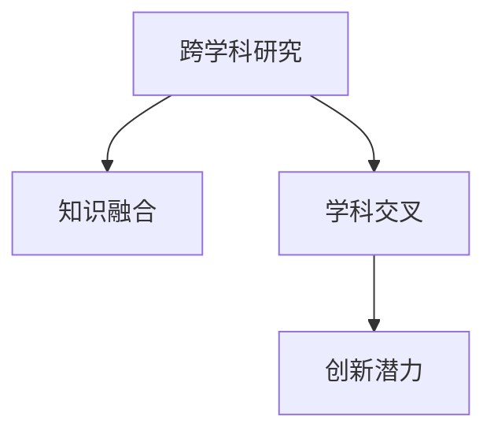

                 

# 知识的跨界融合：学科交叉的创新潜力

> 关键词：跨学科研究,知识融合,学科交叉,创新潜力,人工智能,机器学习,数据科学,工程实践

## 1. 背景介绍

### 1.1 问题由来
现代科学技术的进步离不开学科之间的紧密联系和相互渗透。在科技日新月异的今天，单一学科难以应对复杂多变的现实问题，跨学科研究成为推动科技发展的关键。特别是在信息时代，海量数据和复杂系统的出现，对跨学科研究提出了更高的要求。

人工智能（AI）、机器学习（ML）、数据科学（DS）等前沿技术的崛起，正深刻影响着各行各业的发展。这些技术不仅依托于数学和计算机科学的进步，还吸收了其他学科的知识，如神经科学、心理学、经济学、社会学等，形成了多元融合的跨学科研究范式。

通过跨学科研究，AI、ML和DS等前沿技术能够突破传统技术的局限，在解决实际问题上展现出了巨大的潜力和创新能力。本文旨在探讨跨学科研究的原理、方法和应用，以期为科技领域的创新提供新的视角和方法。

### 1.2 问题核心关键点
跨学科研究的核心在于将不同学科的知识、方法和视角整合起来，形成全新的理论和应用体系。这一过程中，学科之间的知识融合、交叉协作、协同创新是关键。跨学科研究不仅能拓宽问题的解决思路，还能激发新的研究方向和创新点。

具体而言，跨学科研究在以下几个方面具有显著优势：
- **问题解构**：将复杂问题分解为可操作的小问题，突破单一学科视角限制。
- **知识互补**：不同学科的知识和方法可以相互补充，提升解决复杂问题的能力。
- **协同创新**：跨学科团队的协作能促进思维的碰撞和创新，产生新颖的解决方案。
- **应用拓展**：跨学科研究可以开发出更广泛、更实用的应用场景，提升技术的社会价值。

## 2. 核心概念与联系

### 2.1 核心概念概述

为更好地理解跨学科研究的方法和应用，本节将介绍几个密切相关的核心概念：

- **跨学科研究**：指跨越两个或多个学科领域的研究，旨在整合不同学科的知识、方法和工具，解决单一学科难以应对的复杂问题。

- **知识融合**：指将不同学科的知识体系进行整合，形成新的知识体系或理论模型。

- **学科交叉**：指不同学科之间的交叉、融合，产生新的研究范式和理论体系。

- **创新潜力**：指跨学科研究带来的新思想、新方法和新应用，推动科学和技术进步的潜力。

这些概念之间的逻辑关系可以通过以下Mermaid流程图来展示：



这个流程图展示了几大核心概念之间的逻辑关系：

1. **跨学科研究**是整合不同学科知识的基础。
2. **知识融合**是将跨学科的知识体系整合成新的知识体系或理论模型。
3. **学科交叉**指不同学科之间的融合，产生新的研究范式。
4. **创新潜力**是跨学科研究带来的新思想、新方法和新应用。

这些概念共同构成了跨学科研究的基本框架，帮助科研人员系统地理解和实施跨学科研究。

## 3. 核心算法原理 & 具体操作步骤
### 3.1 算法原理概述

跨学科研究的核心在于将不同学科的知识、方法和视角整合起来，形成全新的理论和应用体系。其核心思想是：通过整合不同学科的知识和方法，针对特定的研究问题，设计出多维度的解决方案，从而提升研究质量和创新能力。

形式化地，假设我们有一个跨学科研究问题 $P$，涉及到学科 $D_1, D_2, \ldots, D_n$。跨学科研究的目的是：

1. 收集各学科的知识和数据 $K_1, K_2, \ldots, K_n$。
2. 设计跨学科的研究框架 $F$，将不同学科的知识和方法整合起来。
3. 应用 $F$ 解决研究问题 $P$，得到创新解决方案 $S$。

这一过程可以通过以下步骤来实现：

- **问题解构**：将复杂问题 $P$ 分解为若干子问题，每个子问题可以在特定学科范围内处理。
- **知识融合**：对各学科的知识 $K_1, K_2, \ldots, K_n$ 进行整合，形成新的知识体系 $K'$。
- **方法结合**：将各学科的方法 $M_1, M_2, \ldots, M_n$ 结合，形成新的研究方法 $M'$。
- **协同创新**：跨学科团队协同工作，利用 $K'$ 和 $M'$ 解决 $P$，得到创新解决方案 $S$。

### 3.2 算法步骤详解

跨学科研究的具体操作步骤可以概括为以下几个步骤：

**Step 1: 问题定义与分解**
- 明确研究问题的目标和范围，将问题分解为若干子问题。
- 确定每个子问题的特点和需求，选择合适的学科进行处理。

**Step 2: 数据收集与预处理**
- 从各个学科收集数据 $K_1, K_2, \ldots, K_n$。
- 对数据进行清洗、去重、归一化等预处理，保证数据的可用性和一致性。

**Step 3: 知识整合与融合**
- 将各学科的知识进行整合，形成新的知识体系 $K'$。
- 使用知识图谱、本体论等工具，构建知识间的联系和层次结构。

**Step 4: 方法设计与结合**
- 设计跨学科的研究方法 $M'$，融合不同学科的方法论和技术。
- 选择合适的算法和模型，进行建模和训练。

**Step 5: 协同创新与实验验证**
- 组建跨学科研究团队，协同工作，利用 $K'$ 和 $M'$ 进行研究。
- 通过实验和验证，不断迭代优化，得到创新解决方案 $S$。

### 3.3 算法优缺点

跨学科研究具有以下优点：
- **问题全面性**：通过整合不同学科的知识和方法，能够更全面地理解和解决复杂问题。
- **创新潜力大**：跨学科研究能够激发新的思维和创新，产生新颖的解决方案。
- **协同效应**：跨学科团队协作，能够充分利用每个成员的专业知识，提升研究效率。

同时，跨学科研究也存在一些局限性：
- **复杂性高**：跨学科研究需要协调多个学科的知识和方法，难度较大。
- **资源消耗大**：跨学科研究涉及多个学科，需要大量的人力、物力和财力投入。
- **沟通成本高**：跨学科团队成员之间需要频繁沟通，保证信息传递的准确性和及时性。

尽管存在这些局限性，但跨学科研究在解决复杂问题的过程中，仍具有无可替代的价值。

### 3.4 算法应用领域

跨学科研究在诸多领域都展现出其独特的优势和潜力，主要应用领域包括：

- **人工智能与数据科学**：将神经科学、心理学等学科的知识引入人工智能研究，提升AI的智能化水平。
- **生物医学**：结合分子生物学、生物信息学等学科，开发新型药物和治疗方案。
- **环境科学**：整合气候学、生态学、地理学等学科，研究气候变化和环境污染问题。
- **城市规划**：融合社会学、经济学、交通工程等学科，提升城市规划的科学性和可行性。
- **社会科学**：结合心理学、社会学、经济学等学科，研究社会现象和行为规律。

这些领域的研究展示了跨学科研究的多样性和广泛性，为科技发展和社会进步提供了强大的推动力。

## 4. 数学模型和公式 & 详细讲解  
### 4.1 数学模型构建

为了更好地理解跨学科研究的方法和应用，本节将使用数学语言对跨学科研究的过程进行更加严格的刻画。

假设我们有 $n$ 个学科的知识 $K_1, K_2, \ldots, K_n$，每个学科的知识可以用数学模型 $M_i$ 表示。跨学科研究的数学模型 $M$ 可以定义为：

$$
M = M_1 \times M_2 \times \ldots \times M_n
$$

其中 $\times$ 表示知识的融合，即对不同学科的知识进行整合，形成新的知识体系。

### 4.2 公式推导过程

以下我们以人工智能与数据科学的跨学科研究为例，推导跨学科研究模型的公式。

假设数据科学中的特征提取模型为 $M_1$，人工智能中的深度学习模型为 $M_2$，二者结合后的跨学科模型为 $M$。

对于某个数据样本 $x$，其特征提取后的表示为 $x_1$，深度学习模型输出的预测结果为 $y$。则跨学科模型的输出可以表示为：

$$
y = M(x_1)
$$

其中 $M$ 可以表示为：

$$
M(x) = M_1(x) \times M_2(x)
$$

具体地，假设数据科学中的特征提取模型为线性回归模型，人工智能中的深度学习模型为全连接神经网络。则 $M_1$ 和 $M_2$ 的具体形式为：

$$
M_1(x) = w_1^T x
$$

$$
M_2(x) = \text{softmax}(W_2x + b_2)
$$

其中 $w_1$ 和 $b_1$ 为线性回归模型的参数，$W_2$ 和 $b_2$ 为深度学习模型的参数。则跨学科模型的形式为：

$$
M(x) = \text{softmax}(w_1^T x \times W_2x + b_2)
$$

通过这种跨学科模型的构建，能够充分发挥数据科学和人工智能的优势，提升预测精度和模型泛化能力。

### 4.3 案例分析与讲解

**案例分析**：智能医疗系统

智能医疗系统需要综合考虑患者的生理数据、基因信息、病历记录等多方面的信息，以实现精准诊断和治疗。这其中，数据科学用于提取和处理生理数据，人工智能用于构建疾病诊断和预测模型。

具体地，数据科学中的特征提取模型可以使用支持向量机（SVM）、随机森林（RF）等算法，对患者的生理指标进行提取和降维。人工智能中的深度学习模型可以使用卷积神经网络（CNN）、循环神经网络（RNN）等算法，对患者的病历记录和基因信息进行建模和预测。

通过整合数据科学和人工智能的知识和方法，智能医疗系统可以更好地理解患者的健康状况，提供个性化的治疗方案，提升医疗服务的质量。

## 5. 项目实践：代码实例和详细解释说明
### 5.1 开发环境搭建

在进行跨学科研究实践前，我们需要准备好开发环境。以下是使用Python进行跨学科研究的开发环境配置流程：

1. 安装Anaconda：从官网下载并安装Anaconda，用于创建独立的Python环境。

2. 创建并激活虚拟环境：
```bash
conda create -n cross-discipline-env python=3.8 
conda activate cross-discipline-env
```

3. 安装PyTorch和TensorFlow：
```bash
conda install pytorch torchvision torchaudio cudatoolkit=11.1 -c pytorch -c conda-forge
conda install tensorflow
```

4. 安装必要的Python库：
```bash
pip install numpy pandas scikit-learn matplotlib seaborn jupyter notebook ipython
```

完成上述步骤后，即可在`cross-discipline-env`环境中开始跨学科研究实践。

### 5.2 源代码详细实现

下面我们以智能医疗系统的跨学科研究为例，给出使用Python和PyTorch进行数据科学和人工智能结合的代码实现。

**数据科学部分**：

```python
from sklearn.model_selection import train_test_split
from sklearn.ensemble import RandomForestClassifier
from sklearn.metrics import accuracy_score

def extract_features(X):
    # 使用随机森林提取特征
    features = RandomForestClassifier(n_estimators=100).fit(X).predict_proba(X)
    return features

# 假设X为生理数据，y为诊断结果
X_train, X_test, y_train, y_test = train_test_split(X, y, test_size=0.2, random_state=42)
features_train = extract_features(X_train)
features_test = extract_features(X_test)

# 训练数据科学模型
model = RandomForestClassifier(n_estimators=100)
model.fit(features_train, y_train)

# 评估数据科学模型
y_pred = model.predict(features_test)
accuracy = accuracy_score(y_test, y_pred)
print(f"数据科学模型准确率：{accuracy:.2f}")
```

**人工智能部分**：

```python
import torch
import torch.nn as nn
import torch.optim as optim

class DeepLearningModel(nn.Module):
    def __init__(self):
        super(DeepLearningModel, self).__init__()
        self.fc1 = nn.Linear(64, 128)
        self.fc2 = nn.Linear(128, 64)
        self.fc3 = nn.Linear(64, 2)
        self.softmax = nn.Softmax(dim=1)

    def forward(self, x):
        x = torch.relu(self.fc1(x))
        x = torch.relu(self.fc2(x))
        x = self.softmax(self.fc3(x))
        return x

# 假设X为病历记录，y为诊断结果
X_train, X_test, y_train, y_test = train_test_split(X, y, test_size=0.2, random_state=42)
X_train = torch.from_numpy(X_train).float()
X_test = torch.from_numpy(X_test).float()
y_train = torch.from_numpy(y_train).float()
y_test = torch.from_numpy(y_test).float()

# 训练深度学习模型
model = DeepLearningModel()
optimizer = optim.Adam(model.parameters(), lr=0.001)
criterion = nn.CrossEntropyLoss()
for epoch in range(10):
    for i, (inputs, labels) in enumerate(zip(X_train, y_train)):
        optimizer.zero_grad()
        outputs = model(inputs)
        loss = criterion(outputs, labels)
        loss.backward()
        optimizer.step()
    print(f"Epoch {epoch+1}, loss: {loss:.4f}")

# 评估深度学习模型
model.eval()
with torch.no_grad():
    y_pred = model(X_test).argmax(dim=1)
    accuracy = accuracy_score(y_test, y_pred)
print(f"深度学习模型准确率：{accuracy:.2f}")
```

通过将数据科学和人工智能的知识和方法进行结合，可以实现对患者健康状况的全面理解，提升智能医疗系统的诊断和治疗能力。

### 5.3 代码解读与分析

让我们再详细解读一下关键代码的实现细节：

**数据科学部分**：
- 使用`train_test_split`将数据划分为训练集和测试集。
- 定义`extract_features`函数，使用随机森林提取特征。
- 训练和评估数据科学模型，使用`accuracy_score`计算准确率。

**人工智能部分**：
- 定义`DeepLearningModel`类，构建深度学习模型。
- 使用`Adam`优化器，交叉熵损失函数进行模型训练。
- 评估深度学习模型，使用`accuracy_score`计算准确率。

可以看到，通过Python和PyTorch，我们可以轻松实现跨学科研究的代码，将数据科学和人工智能的知识和方法进行整合。

## 6. 实际应用场景
### 6.1 智能医疗系统

智能医疗系统需要综合考虑患者的生理数据、基因信息、病历记录等多方面的信息，以实现精准诊断和治疗。这其中，数据科学用于提取和处理生理数据，人工智能用于构建疾病诊断和预测模型。

具体地，数据科学中的特征提取模型可以使用支持向量机（SVM）、随机森林（RF）等算法，对患者的生理指标进行提取和降维。人工智能中的深度学习模型可以使用卷积神经网络（CNN）、循环神经网络（RNN）等算法，对患者的病历记录和基因信息进行建模和预测。

通过整合数据科学和人工智能的知识和方法，智能医疗系统可以更好地理解患者的健康状况，提供个性化的治疗方案，提升医疗服务的质量。

### 6.2 环境监测系统

环境监测系统需要整合气候学、生态学、地理学等多学科的知识，实时监测和预测环境变化。通过跨学科研究，可以构建更加全面、准确的环境监测模型。

具体地，可以使用机器学习算法对传感器数据进行分析和建模，预测环境污染、气候变化等现象。同时，结合地理信息系统（GIS）和遥感技术，对环境数据进行空间分析和可视化。

通过整合跨学科的知识和方法，环境监测系统可以更加准确地预测环境变化，为环境保护和气候治理提供科学依据。

### 6.3 智能制造系统

智能制造系统需要整合机械工程、电子工程、计算机科学等多学科的知识，实现智能生产和管理。通过跨学科研究，可以提高生产效率和产品质量，降低生产成本。

具体地，可以使用人工智能算法对生产数据进行分析和建模，预测设备故障、优化生产流程。同时，结合机器人技术和物联网技术，实现自动化生产和管理。

通过整合跨学科的知识和方法，智能制造系统可以实现高度自动化和智能化，提升生产效率和产品质量。

### 6.4 未来应用展望

随着跨学科研究的不断发展，未来在以下几个领域将展现出巨大的潜力：

- **智慧城市**：融合地理信息系统、城市规划、社会学等多学科的知识，构建智能城市基础设施，提升城市治理和居民生活质量。
- **智能农业**：整合农业科学、机械工程、计算机科学等多学科的知识，实现精准农业和智能农业，提高农业生产效率和产品质量。
- **智能交通**：融合交通工程、计算机科学、社会学等多学科的知识，实现智能交通管理和优化，提升交通效率和安全性。
- **智能金融**：整合经济学、统计学、计算机科学等多学科的知识，实现智能投融资和风险管理，提升金融服务水平和竞争力。

跨学科研究将在更多领域展现出其独特的价值和潜力，为科技和社会进步提供强大的推动力。

## 7. 工具和资源推荐
### 7.1 学习资源推荐

为了帮助开发者系统掌握跨学科研究的理论基础和实践技巧，这里推荐一些优质的学习资源：

1. 《跨学科研究方法与实践》系列博文：由跨学科研究专家撰写，深入浅出地介绍了跨学科研究的方法和案例。

2. 《跨学科研究中的数据科学与人工智能》课程：斯坦福大学开设的跨学科研究课程，涵盖数据科学、人工智能等多个领域的知识，适合初学者入门。

3. 《跨学科研究中的多学科整合》书籍：系统介绍了跨学科研究的基本概念和方法，涵盖多个学科的知识体系。

4. Coursera平台上的跨学科研究课程：提供多样化的跨学科研究课程，涵盖计算机科学、数据科学、物理学等多个领域。

5. IEEE Xplore数据库：收录了大量的跨学科研究论文和报告，是跨学科研究的权威资源。

通过对这些资源的学习实践，相信你一定能够快速掌握跨学科研究的精髓，并用于解决实际的复杂问题。

### 7.2 开发工具推荐

高效的开发离不开优秀的工具支持。以下是几款用于跨学科研究的常用工具：

1. Jupyter Notebook：开源的交互式笔记本，支持Python、R等多种编程语言，适合跨学科研究的代码实现和数据可视化。

2. MATLAB：强大的工程计算软件，支持跨学科的数学建模和仿真分析，适合跨学科研究中的复杂计算。

3. GIS（地理信息系统）软件：如ArcGIS、QGIS等，支持空间数据分析和可视化，适合环境科学、城市规划等领域的跨学科研究。

4. ANSYS：领先的仿真软件，支持机械工程、电子工程等领域的复杂建模和仿真分析，适合智能制造、环境监测等领域的跨学科研究。

5. IBM Watson Studio：一站式数据分析和机器学习平台，支持多种数据科学和人工智能工具的集成，适合跨学科研究的协作和共享。

合理利用这些工具，可以显著提升跨学科研究的开发效率，加快创新迭代的步伐。

### 7.3 相关论文推荐

跨学科研究的发展源于学界的持续研究。以下是几篇奠基性的相关论文，推荐阅读：

1. "The Science of Interdisciplinary Research" by Ann R. Nook：探讨跨学科研究的基本概念和方法，提出跨学科研究的框架。

2. "Towards a Science of Cross-Disciplinary Problem Solving" by H.F. Sterner and D. Pake：提出跨学科研究中的问题解构、知识整合、方法结合等关键概念。

3. "Multidisciplinary Research: Why, What, and How?" by R. Kipnis and J. Rothman：系统介绍跨学科研究的基本流程和方法，提供实际案例分析。

4. "Cross-Disciplinary Thinking: A Guide" by E. Morphew et al.：提供跨学科研究的实践指南，涵盖数据整合、团队协作、成果分享等多个方面。

5. "Multidisciplinary Approaches to Complex Adaptive Systems" by L. van der Maaten et al.：探讨跨学科方法在复杂适应系统研究中的应用，提供多学科整合的实例。

这些论文代表了大跨学科研究的最新进展，通过学习这些前沿成果，可以帮助研究者把握学科发展的趋势和方向。

## 8. 总结：未来发展趋势与挑战
### 8.1 总结

本文对跨学科研究的基本概念、方法和应用进行了全面系统的介绍。首先阐述了跨学科研究的背景和意义，明确了跨学科研究在整合不同学科知识、提升问题解决能力方面的独特价值。其次，从原理到实践，详细讲解了跨学科研究的步骤和关键技术，给出了跨学科研究任务开发的完整代码实例。同时，本文还广泛探讨了跨学科研究在智能医疗、环境监测、智能制造等多个领域的应用前景，展示了跨学科研究的广阔应用空间。此外，本文精选了跨学科研究的各类学习资源，力求为读者提供全方位的技术指引。

通过本文的系统梳理，可以看到，跨学科研究在整合不同学科知识、提升问题解决能力方面的独特优势和潜力。跨学科研究不仅能拓宽问题的解决思路，还能激发新的研究方向和创新点，推动科学和技术进步。未来，伴随跨学科研究的不断发展和深入，相信跨学科研究将在更多领域发挥重要作用，为科技和社会进步提供强大的推动力。

### 8.2 未来发展趋势

展望未来，跨学科研究将呈现以下几个发展趋势：

1. **问题综合化**：跨学科研究将进一步整合不同学科的知识和方法，解决更加复杂、综合性的问题。

2. **工具多样化**：随着技术的进步，跨学科研究将越来越多地采用先进工具和平台，提升研究效率和效果。

3. **协同合作化**：跨学科研究将更加依赖团队的协同合作，提高研究质量，加速创新过程。

4. **数据密集化**：大数据和复杂系统的出现，将推动跨学科研究对数据的依赖，增强研究的全面性和准确性。

5. **理论创新化**：跨学科研究将不断催生新的理论和方法，推动学科交叉和融合。

这些趋势展示了跨学科研究的前景和潜力，为科技和社会发展提供了新的动力。

### 8.3 面临的挑战

尽管跨学科研究在解决问题方面具有无可替代的优势，但在实施过程中，仍面临诸多挑战：

1. **沟通障碍**：不同学科的团队成员之间存在沟通和理解上的障碍，需要加强团队协作和沟通。

2. **资源消耗**：跨学科研究涉及多个学科，需要大量的人力、物力和财力投入，资源消耗大。

3. **数据整合**：不同学科的数据格式和标准不一致，数据整合难度大，需要开发标准化工具和方法。

4. **知识融合**：不同学科的知识体系和方法是不同的，知识融合难度大，需要创新性方法进行整合。

5. **方法冲突**：不同学科的方法和技术可能存在冲突，需要协调和优化。

尽管存在这些挑战，但跨学科研究在解决复杂问题的过程中，仍具有无可替代的价值。只有在持续改进和优化中，才能最大限度地发挥跨学科研究的优势。

### 8.4 研究展望

面向未来，跨学科研究需要在以下几个方面寻求新的突破：

1. **多学科融合**：推动更多学科的整合和交叉，形成更加全面和深入的研究体系。

2. **大数据应用**：充分利用大数据技术，提升跨学科研究的全面性和准确性。

3. **新方法开发**：开发新的跨学科研究方法，如因果推理、对比学习等，提升研究效率和效果。

4. **应用创新**：结合学科特点，开发新的跨学科应用，解决实际问题。

5. **跨学科教育**：推动跨学科教育的普及和培养，提升科研人员的多学科综合能力。

这些研究方向和突破点，将进一步推动跨学科研究的发展，为科技和社会进步提供新的动力。

## 9. 附录：常见问题与解答

**Q1：跨学科研究对问题解决有哪些优势？**

A: 跨学科研究对问题解决的优势主要体现在以下几个方面：
1. **多角度解构问题**：通过整合不同学科的知识和方法，能够更全面地理解问题的本质和细节，从而更有效地解构和分解问题。
2. **知识互补**：不同学科的知识和方法可以相互补充，提升问题解决的多样性和灵活性。
3. **协同创新**：跨学科团队协作，能够充分利用每个成员的专业知识，提高问题解决的效率和质量。
4. **创新潜力大**：跨学科研究能够激发新的思维和创新，产生新颖的解决方案。

**Q2：跨学科研究需要哪些关键步骤？**

A: 跨学科研究的主要步骤如下：
1. **问题定义与分解**：明确研究问题的目标和范围，将问题分解为若干子问题。
2. **数据收集与预处理**：从各个学科收集数据，并进行清洗、去重、归一化等预处理。
3. **知识整合与融合**：将各学科的知识进行整合，形成新的知识体系，构建知识间的联系和层次结构。
4. **方法设计与结合**：设计跨学科的研究方法，融合不同学科的方法论和技术。
5. **协同创新与实验验证**：组建跨学科研究团队，协同工作，利用新知识和新方法进行研究，并通过实验和验证不断迭代优化。

**Q3：跨学科研究在实际应用中需要注意哪些问题？**

A: 跨学科研究在实际应用中需要注意以下几个问题：
1. **资源整合**：跨学科研究需要整合多个学科的资源，包括数据、工具和方法，需要协调和管理。
2. **沟通协作**：跨学科团队成员之间需要频繁沟通，保证信息传递的准确性和及时性。
3. **知识整合**：不同学科的知识体系和方法是不同的，知识整合难度大，需要创新性方法进行整合。
4. **方法优化**：不同学科的方法和技术可能存在冲突，需要协调和优化。
5. **结果评估**：跨学科研究的评估需要结合多个学科的指标和方法，需要综合分析和评价。

**Q4：跨学科研究有哪些典型应用场景？**

A: 跨学科研究在多个领域都有广泛应用，典型应用场景包括：
1. **智能医疗**：结合医学、数据科学、人工智能等多学科的知识，实现精准诊断和治疗。
2. **环境监测**：整合气候学、生态学、地理学等多学科的知识，实现环境变化的监测和预测。
3. **智能制造**：整合机械工程、电子工程、计算机科学等多学科的知识，实现智能生产和管理。
4. **智慧城市**：融合地理信息系统、城市规划、社会学等多学科的知识，提升城市治理和居民生活质量。
5. **智能交通**：整合交通工程、计算机科学、社会学等多学科的知识，实现智能交通管理和优化。

**Q5：跨学科研究有哪些学习资源推荐？**

A: 跨学科研究的学习资源包括：
1. 《跨学科研究方法与实践》系列博文：系统介绍跨学科研究的方法和案例。
2. 《跨学科研究中的数据科学与人工智能》课程：涵盖数据科学、人工智能等多个领域的知识。
3. 《跨学科研究中的多学科整合》书籍：系统介绍跨学科研究的基本概念和方法。
4. Coursera平台上的跨学科研究课程：提供多样化的跨学科研究课程。
5. IEEE Xplore数据库：收录大量的跨学科研究论文和报告，是跨学科研究的权威资源。

这些资源可以帮助读者系统掌握跨学科研究的基本理论和实践技巧。

**Q6：跨学科研究有哪些开发工具推荐？**

A: 跨学科研究的开发工具包括：
1. Jupyter Notebook：支持Python、R等多种编程语言，适合跨学科研究的代码实现和数据可视化。
2. MATLAB：支持跨学科的数学建模和仿真分析。
3. GIS软件：支持空间数据分析和可视化，适合环境科学、城市规划等领域的跨学科研究。
4. ANSYS：支持机械工程、电子工程等领域的复杂建模和仿真分析。
5. IBM Watson Studio：支持多种数据科学和人工智能工具的集成，适合跨学科研究的协作和共享。

合理利用这些工具，可以显著提升跨学科研究的开发效率，加快创新迭代的步伐。

---

作者：禅与计算机程序设计艺术 / Zen and the Art of Computer Programming

