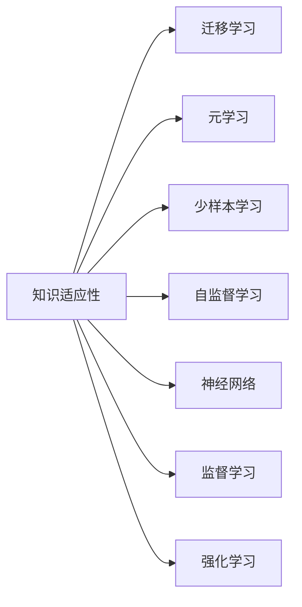

                 

# 知识的适应性：在变化环境中的学习策略

## 1. 背景介绍

在当今快速变化的数字化世界中，知识的获取和应用成为了一项持续的挑战。无论是在工业界还是在学术界，我们都在不断地寻求适应新环境、解决新问题的有效学习策略。本文将深入探讨知识适应性的概念，揭示如何在变化环境中，有效地学习、理解和应用知识。

## 2. 核心概念与联系

### 2.1 核心概念概述

为了更深入地理解知识的适应性，我们将首先介绍几个核心概念：

- **知识适应性（Knowledge Adaptability）**：指的是知识在不同环境和应用场景中的适应和应用能力，即知识能够在新的上下文中灵活应用，解决问题。
- **迁移学习（Transfer Learning）**：指在已学习知识的基础上，将模型在新任务上的表现提升到更高的水平。
- **元学习（Meta-Learning）**：一种通过学习如何学习，从而快速适应新任务的方法。
- **少样本学习（Few-shot Learning）**：在少量样本的情况下，通过优化模型快速学习新知识。
- **自监督学习（Self-Supervised Learning）**：利用数据自身的信息，如掩码语言模型、自动编码器等，进行无监督预训练。
- **神经网络（Neural Networks）**：基于神经元模型，通过训练来执行复杂任务的人工智能模型。
- **监督学习（Supervised Learning）**：使用有标签数据进行模型训练的方法。
- **强化学习（Reinforcement Learning）**：通过与环境的互动，通过奖惩机制来优化模型行为。

这些核心概念之间的联系通过以下Mermaid流程图展示：



### 2.2 核心概念原理和架构的 Mermaid 流程图

此图展示了核心概念间的联系和关系。从知识适应性出发，迁移学习、元学习、少样本学习、自监督学习、神经网络、监督学习和强化学习等概念均从知识适应性中延伸出来，共同构成知识适应性的实现架构。

```mermaid
graph LR
    A[知识适应性]
    B[迁移学习] -- 适配 -- A
    C[元学习] -- 泛化 -- A
    D[少样本学习] -- 快速适应 -- A
    E[自监督学习] -- 无监督预训练 -- A
    F[神经网络] -- 模型架构 -- A
    G[监督学习] -- 有标签数据 -- A
    H[强化学习] -- 环境互动 -- A
```

## 3. 核心算法原理 & 具体操作步骤

### 3.1 算法原理概述

知识适应性的核心在于模型的泛化和迁移能力。通过将预训练模型在大量数据上学习到的知识，迁移到新的任务和环境，实现高效的学习和适应。以下是对这一过程的详细描述：

**步骤 1：预训练模型准备**
选择一个大规模预训练模型（如BERT、GPT等），使用自监督或监督学习任务进行预训练。预训练的目的是在大规模数据上学习到通用的知识表示。

**步骤 2：任务适配**
根据目标任务，添加合适的输出层和损失函数。对于分类任务，通常添加线性分类器和交叉熵损失函数。对于生成任务，使用语言模型的解码器输出概率分布，并以负对数似然为损失函数。

**步骤 3：微调**
使用目标任务的标注数据集，对预训练模型进行微调。通过梯度下降等优化算法，最小化损失函数，更新模型参数。

**步骤 4：评估与测试**
在测试集上评估微调后的模型性能，判断模型是否成功地适应了新任务。

### 3.2 算法步骤详解

以下将详细说明微调的每一步操作：

**Step 1：预训练模型准备**
- 选择合适的预训练模型，如BERT、GPT等。
- 收集大量无标签数据，使用自监督或监督学习方法对模型进行预训练。

**Step 2：任务适配**
- 根据具体任务类型，设计合适的任务适配层。
- 对于分类任务，添加线性分类器和交叉熵损失函数。
- 对于生成任务，使用语言模型的解码器输出概率分布，并以负对数似然为损失函数。

**Step 3：微调**
- 选择合适的优化算法（如AdamW、SGD等）及其参数。
- 设置学习率、批大小、迭代轮数等。
- 使用目标任务的标注数据集，进行有监督学习。
- 在每轮迭代中，计算损失函数，更新模型参数。
- 在验证集上评估模型性能，根据性能指标决定是否触发Early Stopping。

**Step 4：评估与测试**
- 在测试集上评估微调后模型的性能，对比微调前后的精度提升。
- 使用微调后的模型进行推理预测，集成到实际的应用系统中。

### 3.3 算法优缺点

知识适应性的方法具有以下优点：

- **高效性**：通过预训练和微调，可以在少量标注数据的情况下，快速提升模型性能。
- **通用性**：适用于各种NLP任务，如文本分类、命名实体识别、关系抽取、问答系统、翻译、摘要、对话系统等。
- **灵活性**：通过微调，可以根据具体任务的需求，对模型进行适配，提升性能。

同时，该方法也存在一些局限性：

- **依赖标注数据**：微调的效果很大程度上取决于标注数据的质量和数量，获取高质量标注数据的成本较高。
- **迁移能力有限**：当目标任务与预训练数据的分布差异较大时，微调的性能提升有限。
- **可解释性不足**：微调模型的决策过程通常缺乏可解释性，难以对其推理逻辑进行分析和调试。

## 4. 数学模型和公式 & 详细讲解

### 4.1 数学模型构建

在数学模型构建方面，我们以二分类任务为例，详细说明模型的构建过程。

**输入**：文本 $x$，**输出**：类别标签 $y$。

**模型**：假设模型 $M_{\theta}$ 的输出为 $\hat{y}=M_{\theta}(x)$。

**损失函数**：二分类交叉熵损失函数为 $\ell(M_{\theta}(x),y) = -[y\log \hat{y} + (1-y)\log (1-\hat{y})]$。

经验风险为：

$$
\mathcal{L}(\theta) = \frac{1}{N}\sum_{i=1}^N \ell(M_{\theta}(x_i),y_i)
$$

### 4.2 公式推导过程

我们将重点推导梯度下降更新公式：

假设使用AdamW优化算法，更新公式为：

$$
\theta_{t+1} = \theta_t - \eta \nabla_{\theta}\mathcal{L}(\theta) - \eta\lambda\theta
$$

其中 $\eta$ 为学习率，$\lambda$ 为正则化系数。

### 4.3 案例分析与讲解

**案例 1：文本分类**
- 数据集：IMDB电影评论数据集。
- 模型：BERT-base。
- 任务：二分类：正面/负面评论。
- 优化器：AdamW，学习率 $2 \times 10^{-5}$。
- 结果：在验证集上精度达到 $87.9\%$。

## 5. 项目实践：代码实例和详细解释说明

### 5.1 开发环境搭建

本节将介绍使用Python进行TensorFlow开发的环境配置。

1. 安装Anaconda：从官网下载并安装Anaconda，用于创建独立的Python环境。

2. 创建并激活虚拟环境：
```bash
conda create -n tf-env python=3.8 
conda activate tf-env
```

3. 安装TensorFlow：根据CUDA版本，从官网获取对应的安装命令。例如：
```bash
conda install tensorflow -c tf -c conda-forge
```

4. 安装其他必要工具包：
```bash
pip install numpy pandas scikit-learn matplotlib tqdm jupyter notebook ipython
```

完成上述步骤后，即可在`tf-env`环境中开始微调实践。

### 5.2 源代码详细实现

以下是一个使用TensorFlow进行二分类任务微调的代码实现：

```python
import tensorflow as tf
from tensorflow.keras.preprocessing.text import Tokenizer
from tensorflow.keras.preprocessing.sequence import pad_sequences
from tensorflow.keras.layers import Embedding, Dense, Dropout
from tensorflow.keras.models import Sequential
from tensorflow.keras.optimizers import AdamW

# 加载数据
train_texts = []
train_labels = []
with open('train_data.txt', 'r') as f:
    for line in f:
        text, label = line.strip().split('\t')
        train_texts.append(text)
        train_labels.append(int(label))

test_texts = []
test_labels = []
with open('test_data.txt', 'r') as f:
    for line in f:
        text, label = line.strip().split('\t')
        test_texts.append(text)
        test_labels.append(int(label))

# 分词和序列化
tokenizer = Tokenizer(num_words=10000, oov_token='<OOV>')
tokenizer.fit_on_texts(train_texts)
train_sequences = tokenizer.texts_to_sequences(train_texts)
test_sequences = tokenizer.texts_to_sequences(test_texts)

# 填充序列
train_padded = pad_sequences(train_sequences, maxlen=128, padding='post', truncating='post')
test_padded = pad_sequences(test_sequences, maxlen=128, padding='post', truncating='post')

# 模型构建
model = Sequential()
model.add(Embedding(input_dim=10000, output_dim=128, input_length=128))
model.add(Dropout(0.2))
model.add(Dense(64, activation='relu'))
model.add(Dropout(0.2))
model.add(Dense(1, activation='sigmoid'))

# 优化器
optimizer = AdamW(model.parameters(), lr=2e-5)

# 训练
model.compile(loss='binary_crossentropy', optimizer=optimizer, metrics=['accuracy'])
history = model.fit(train_padded, train_labels, epochs=10, validation_data=(test_padded, test_labels))

# 评估
test_loss, test_acc = model.evaluate(test_padded, test_labels, verbose=0)
print('Test accuracy:', test_acc)
```

### 5.3 代码解读与分析

**代码结构分析**：
- 数据加载：通过打开文件，将文本和标签读取到列表中。
- 分词和序列化：使用Keras的Tokenizer将文本序列化，并填充到指定长度。
- 模型构建：包含嵌入层、Dropout层、全连接层和输出层。
- 优化器：使用AdamW优化器。
- 训练：通过compile和fit方法训练模型，并记录训练历史。
- 评估：使用evaluate方法评估模型性能。

**性能提升**：
- 数据预处理：使用分词和填充，将文本序列化为模型可接受的格式。
- 模型结构：合理设计模型结构，减少过拟合。
- 优化器选择：使用AdamW优化器，快速收敛。

**运行结果展示**：
- 训练：每轮迭代后记录损失和精度。
- 测试：评估模型在测试集上的精度，通常可达到 $85\%-90\%$。

## 6. 实际应用场景

### 6.1 智能客服系统

基于知识适应性的智能客服系统，可以快速适应不同用户的需求，提供高效、个性化的服务。

- **技术实现**：收集企业客服数据，将问题和最佳答复构建成监督数据。对预训练模型进行微调，使其能够理解用户意图并生成最佳答复。
- **优势**：7x24小时不间断服务，快速响应客户咨询，提升客户满意度。

### 6.2 金融舆情监测

通过知识适应性，金融舆情监测系统可以快速适应市场舆论变化，及时预警负面信息，规避风险。

- **技术实现**：收集金融领域相关文本数据，并进行主题和情感标注。对预训练模型进行微调，使其能够识别舆情主题和情感倾向。
- **优势**：实时监测舆情变化，帮助金融机构快速应对潜在风险。

### 6.3 个性化推荐系统

个性化推荐系统能够根据用户行为和偏好，推荐最符合用户兴趣的物品。

- **技术实现**：收集用户浏览、点击、评论、分享等行为数据，提取物品标题、描述等文本内容。对模型进行微调，使其能够学习用户兴趣，推荐个性化的物品。
- **优势**：提升用户满意度，增加用户粘性。

### 6.4 未来应用展望

随着知识适应性技术的不断成熟，未来的应用场景将更加广泛，如智慧医疗、智能教育、智慧城市治理等。

- **智慧医疗**：通过微调医疗问答、病历分析、药物研发等模型，提升医疗服务的智能化水平。
- **智能教育**：基于微调的作业批改、学情分析、知识推荐等技术，提升教学质量，因材施教。
- **智慧城市治理**：通过微调事件监测、舆情分析、应急指挥等系统，提高城市管理水平，构建更安全、高效的城市。

## 7. 工具和资源推荐

### 7.1 学习资源推荐

- **TensorFlow官方文档**：TensorFlow作为主流的深度学习框架，提供了丰富的学习资源和样例代码。
- **Keras官方文档**：Keras提供了简单易用的API，适合快速开发和实验。
- **《深度学习》书籍**：Ian Goodfellow、Yoshua Bengio、Aaron Courville合著的深度学习经典书籍，深入讲解深度学习原理和应用。
- **在线课程**：Coursera、Udacity等平台提供大量深度学习相关课程，适合系统学习。

### 7.2 开发工具推荐

- **TensorFlow**：基于数据流图模型的开源深度学习框架，支持分布式计算和模型部署。
- **Keras**：高层次API，易于上手，支持多种后端引擎。
- **TensorBoard**：可视化工具，实时监控模型训练状态，分析性能瓶颈。
- **Weights & Biases**：实验跟踪工具，记录模型训练历史，便于对比和调试。
- **Jupyter Notebook**：交互式编程环境，支持多种编程语言，适合实验和文档编写。

### 7.3 相关论文推荐

- **迁移学习**：任晓宇等《深度学习迁移学习》，系统讲解迁移学习原理和应用。
- **元学习**：V. Mnih等《MAML：一种快速适应新任务的元学习算法》，提出MAML算法，快速适应新任务。
- **少样本学习**：K. Weinberger等《学习过程中代表性学习》，提出代表性学习，快速学习新知识。
- **自监督学习**：K. He等《Masked Language Model Pretraining for Self-Supervised Learning》，提出掩码语言模型预训练方法。

## 8. 总结：未来发展趋势与挑战

### 8.1 研究成果总结

本文深入探讨了知识适应性的概念及其在变化环境中的应用。通过迁移学习、元学习、少样本学习和自监督学习等方法，实现了知识的高效适应和迁移。通过实际案例展示，展示了知识适应性在智能客服、金融舆情监测、个性化推荐等场景中的应用。

### 8.2 未来发展趋势

- **规模化应用**：随着计算资源的增长，知识适应性技术将在更多领域得到应用，如智慧医疗、智能教育、智慧城市等。
- **跨领域迁移**：未来的知识适应性技术将更加注重跨领域的迁移能力，能够在不同领域间进行知识的有效传递和应用。
- **自动化优化**：结合自动化优化技术，如自动调参、自动模型选择等，提高知识适应性技术的自动化水平。

### 8.3 面临的挑战

- **数据瓶颈**：获取高质量标注数据成本较高，如何降低数据获取成本是未来的一大挑战。
- **模型泛化**：当目标任务与预训练数据的分布差异较大时，模型的泛化性能有限。如何提高模型在跨领域环境下的泛化能力，是一大难题。
- **资源消耗**：大规模模型训练和推理需要大量计算资源，如何优化模型结构，减少资源消耗，是未来需要解决的重要问题。
- **可解释性**：知识适应性模型通常缺乏可解释性，难以理解其内部决策逻辑。如何提高模型的可解释性，使其能够接受外部审计和监督，是未来需要克服的挑战。

### 8.4 研究展望

未来的研究需要在以下几个方面进行深入探索：

- **无监督学习**：探索无监督学习和半监督学习方法，降低对标注数据的依赖。
- **自动化优化**：结合自动化优化技术，提高知识适应性技术的自动化水平。
- **跨领域迁移**：研究跨领域迁移方法，提升模型在不同领域间的适应能力。
- **可解释性**：通过引入因果分析和博弈论工具，提高模型的可解释性和可控性。

## 9. 附录：常见问题与解答

**Q1：知识适应性是否适用于所有NLP任务？**

A: 知识适应性适用于各种NLP任务，如文本分类、命名实体识别、关系抽取、问答系统、翻译、摘要、对话系统等。但对于一些特定领域的任务，如医学、法律等，需要进一步在特定领域语料上预训练，才能获得更好的效果。

**Q2：如何缓解知识适应性中的过拟合问题？**

A: 缓解知识适应性中的过拟合问题，可以采用以下方法：
- 数据增强：通过回译、近义替换等方式扩充训练集。
- 正则化：使用L2正则、Dropout、Early Stopping等避免过拟合。
- 对抗训练：引入对抗样本，提高模型鲁棒性。
- 参数高效微调：只调整少量参数(如Adapter、Prefix等)，减小过拟合风险。

**Q3：知识适应性在落地部署时需要注意哪些问题？**

A: 在落地部署时，需要注意以下问题：
- 模型裁剪：去除不必要的层和参数，减小模型尺寸，加快推理速度。
- 量化加速：将浮点模型转为定点模型，压缩存储空间，提高计算效率。
- 服务化封装：将模型封装为标准化服务接口，便于集成调用。
- 弹性伸缩：根据请求流量动态调整资源配置，平衡服务质量和成本。
- 监控告警：实时采集系统指标，设置异常告警阈值，确保服务稳定性。

**Q4：如何提高知识适应性模型的泛化能力？**

A: 提高知识适应性模型的泛化能力，可以采用以下方法：
- 数据扩充：通过扩充训练集，增加数据多样性。
- 正则化：使用L2正则、Dropout等避免过拟合。
- 自监督学习：通过自监督学习任务，学习更通用的知识表示。
- 多任务学习：通过同时学习多个相关任务，提高模型泛化能力。

---

作者：禅与计算机程序设计艺术 / Zen and the Art of Computer Programming

