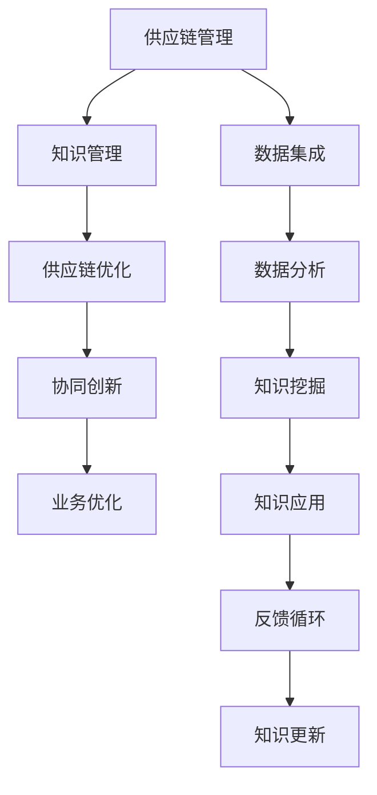

                 

## 1. 背景介绍

### 1.1 问题由来

在当今全球化经济环境中，企业面对的供应链网络日趋复杂，市场需求变化迅速，不确定性增加。传统供应链管理中存在的信息孤岛、流程冗长、响应迟缓等问题，已难以适应新的市场挑战。为应对这些挑战，企业迫切需要提升供应链的敏捷性和协同性，优化供应链运营效率，提升客户满意度。

知识管理作为信息时代的新型管理手段，通过有效整合和利用企业内外部知识资源，推动信息共享、协同创新，已成为供应链优化的一个重要方向。本研究将重点探讨知识管理在供应链优化中的角色，旨在为企业提供系统性的知识驱动型供应链管理解决方案。

### 1.2 问题核心关键点

知识管理在供应链优化中的核心关键点包括：

1. **知识集成与共享**：通过知识库、知识图谱、协作工具等技术手段，构建供应链上下游企业间知识共享机制，打破信息孤岛，提升知识协同效率。
2. **知识获取与挖掘**：利用数据分析、数据挖掘等技术，从企业内外部的海量数据中挖掘出有用的知识，支持供应链决策。
3. **知识创新与转化**：通过促进知识交流与创新，将隐性知识显性化，实现知识的转化与创新，支持企业快速响应市场变化。
4. **知识应用与反馈**：将知识应用于供应链运营决策中，及时获取反馈信息，调整知识管理策略，形成知识管理的闭环系统。

### 1.3 问题研究意义

本研究关注于知识管理在供应链优化中的作用，旨在为企业提供以下几方面的价值：

1. **提升供应链响应能力**：通过知识管理，企业能够快速获取市场变化信息，快速调整生产计划，提升供应链响应速度和灵活性。
2. **优化供应链运营效率**：知识共享与协同创新能够降低供应链中的不确定性和风险，提高运营效率和资源利用率。
3. **增强供应链协同能力**：知识管理能够促进供应链上下游企业的信息透明和协同合作，形成更加紧密的供应链网络。
4. **提升供应链创新能力**：知识管理能够推动供应链成员间的知识交流与创新，提高供应链的创新速度和适应性。

## 2. 核心概念与联系

### 2.1 核心概念概述

1. **供应链管理**：指对企业采购、生产、库存、物流、交付等供应链活动进行规划、执行、控制和优化的过程。
2. **知识管理**：通过收集、存储、检索、共享和应用知识资源，推动企业创新和业务优化的一种管理方法。
3. **供应链优化**：利用各种先进技术和方法，通过优化供应链结构、流程和运营策略，提升供应链效率和竞争力的过程。
4. **协同创新**：指通过知识共享、合作研发等方式，将不同企业、组织和团队的知识与资源整合，形成创新合力。

### 2.2 核心概念原理和架构的 Mermaid 流程图



上述 Mermaid 流程图展示了供应链管理、知识管理、供应链优化和协同创新之间的联系与互动：

1. **数据集成**：将供应链各环节产生的数据集成到统一平台，形成供应链大数据。
2. **数据分析**：对集成后的供应链数据进行分析和挖掘，提取有用的知识。
3. **知识挖掘**：通过知识图谱、自然语言处理等技术，将数据转换为知识，支持供应链决策。
4. **知识应用**：将知识应用于供应链运营中，优化供应链流程和运营策略。
5. **反馈循环**：在应用知识后，收集反馈信息，更新知识库，形成知识管理的闭环。

## 3. 核心算法原理 & 具体操作步骤

### 3.1 算法原理概述

基于知识管理的供应链优化，核心思想是通过知识的集成、共享、应用和反馈，构建一个动态、自适应的供应链管理系统。该系统利用数据分析和人工智能技术，识别供应链中的关键问题和改进机会，通过知识驱动的决策支持，优化供应链运营效率和协同性。

### 3.2 算法步骤详解

基于知识管理的供应链优化主要包括以下几个关键步骤：

1. **数据集成与预处理**：从供应链各个环节收集数据，进行清洗和预处理，构建供应链大数据平台。
2. **知识挖掘与分析**：利用数据挖掘、自然语言处理等技术，从大数据中挖掘出有用的知识，构建知识库和知识图谱。
3. **知识应用与优化**：将知识应用于供应链的各个环节，如需求预测、库存管理、生产调度等，通过知识驱动的决策优化供应链运营。
4. **知识反馈与更新**：在知识应用后，收集反馈信息，评估知识应用效果，更新知识库和供应链模型，形成知识管理的闭环系统。

### 3.3 算法优缺点

#### 优点

1. **提升决策质量**：知识管理能够提供结构化和半结构化的知识，支持供应链的决策优化。
2. **增强协同效应**：知识共享与协同创新能够促进供应链上下游企业的信息透明和协同合作，形成更加紧密的供应链网络。
3. **提升响应能力**：通过知识管理，企业能够快速获取市场变化信息，快速调整生产计划，提升供应链响应速度和灵活性。

#### 缺点

1. **实施难度大**：知识管理的实施需要企业投入大量资源，包括技术、人力和资金。
2. **数据质量问题**：知识管理依赖于高质量的数据输入，数据不完整、不准确会影响知识挖掘的效果。
3. **知识转化困难**：将隐性知识显性化，转化为可应用的显性知识，需要高度专业化的技术和管理能力。

### 3.4 算法应用领域

知识管理在供应链优化中的应用领域包括：

1. **需求预测**：利用历史销售数据、市场趋势等知识，通过预测模型优化需求预测，减少库存积压和缺货风险。
2. **库存管理**：通过知识驱动的库存决策，优化库存水平和位置，降低运营成本，提升客户满意度。
3. **生产调度**：利用生产历史数据和工艺知识，优化生产计划和调度，提高生产效率和资源利用率。
4. **物流优化**：通过物流网络分析和路线优化，降低运输成本，提高物流响应速度。
5. **供应商评估**：通过供应商绩效数据和市场知识，评估供应商表现，优化供应商选择和合作策略。

## 4. 数学模型和公式 & 详细讲解

### 4.1 数学模型构建

基于知识管理的供应链优化模型可以表示为：

$$
\max_{\theta} \sum_{i=1}^N f_i(\theta) - \lambda \sum_{i=1}^N g_i(\theta)
$$

其中，$f_i(\theta)$ 表示供应链节点$i$的优化目标函数，$g_i(\theta)$ 表示节点$i$的约束条件函数，$\lambda$ 为约束惩罚系数，$\theta$ 为供应链优化模型的参数向量。

### 4.2 公式推导过程

以需求预测为例，我们可以构建如下的数学模型：

$$
\min_{\hat{d}} \sum_{i=1}^n (d_i - \hat{d}_i)^2 + \lambda (\sum_{i=1}^n d_i - D)
$$

其中，$d_i$ 为实际需求，$\hat{d}_i$ 为预测需求，$\lambda$ 为惩罚系数，$D$ 为总需求。

通过对上述模型进行求解，可以得到最优的需求预测值 $\hat{d}_i$。

### 4.3 案例分析与讲解

以一家制造企业的供应链优化为例，我们将其实施知识管理的过程分为以下几个步骤：

1. **数据集成**：企业从销售、生产、库存、物流等多个环节收集数据，构建供应链大数据平台。
2. **知识挖掘**：利用自然语言处理技术，从销售数据中提取市场趋势、客户偏好等信息，构建知识库。
3. **知识应用**：利用预测模型和优化算法，将知识应用于需求预测、库存管理、生产调度等环节，提升供应链运营效率。
4. **知识反馈**：在知识应用后，收集反馈信息，评估知识应用效果，更新知识库，形成知识管理的闭环系统。

通过以上步骤，企业能够快速响应市场变化，提升供应链的响应能力和运营效率，降低成本，提高客户满意度。

## 5. 项目实践：代码实例和详细解释说明

### 5.1 开发环境搭建

为了进行供应链优化的知识管理实践，我们需要搭建一个包含数据集成、知识挖掘、知识应用和反馈循环的完整系统。以下是搭建开发环境的具体步骤：

1. **环境安装**：
   - 安装Python 3.8及以上版本
   - 安装TensorFlow 2.0及以上版本
   - 安装Pandas、Numpy、Matplotlib等常用数据处理库
   - 安装Keras、TensorBoard等深度学习框架

2. **数据集准备**：
   - 收集企业内部的供应链数据，如销售记录、库存数据、生产记录等
   - 清洗和预处理数据，去除噪声和不完整数据

### 5.2 源代码详细实现

以下是一个简单的基于知识管理的供应链优化系统实现示例：

```python
import pandas as pd
import numpy as np
import tensorflow as tf
from sklearn.model_selection import train_test_split

# 读取数据集
data = pd.read_csv('supply_chain_data.csv')

# 数据预处理
data = data.dropna()

# 特征工程
features = data[['feature1', 'feature2', 'feature3']]
target = data['target']

# 划分训练集和测试集
features_train, features_test, target_train, target_test = train_test_split(features, target, test_size=0.2)

# 模型训练
model = tf.keras.Sequential([
    tf.keras.layers.Dense(32, activation='relu', input_shape=(features_train.shape[1],)),
    tf.keras.layers.Dense(1)
])

model.compile(optimizer='adam', loss='mse')
model.fit(features_train, target_train, epochs=100, batch_size=32, validation_data=(features_test, target_test))

# 模型评估
test_loss = model.evaluate(features_test, target_test)
print('Test loss:', test_loss)

# 知识应用
# 将知识应用于供应链运营中
# 具体实现需要根据企业具体情况进行调整
```

### 5.3 代码解读与分析

上述代码实现了一个基于神经网络的供应链需求预测模型。具体步骤如下：

1. **数据读取与预处理**：
   - 使用Pandas读取供应链数据集
   - 清洗和处理数据，去除噪声和不完整数据

2. **特征工程**：
   - 选择合适的特征，构建输入数据
   - 使用目标变量构建输出数据

3. **模型训练**：
   - 定义神经网络模型，选择合适的层数和激活函数
   - 编译模型，使用Adam优化器和均方误差损失函数
   - 使用训练集和验证集训练模型，调整模型参数

4. **模型评估**：
   - 使用测试集评估模型性能，输出测试损失
   - 具体评估指标包括均方误差、R方等

5. **知识应用**：
   - 将知识应用于供应链运营中
   - 具体应用需要结合企业实际情况进行设计，如库存管理、生产调度等

通过以上代码，我们可以看到如何利用知识管理技术，将知识应用于供应链优化中，提升企业运营效率。

### 5.4 运行结果展示

以下是模型训练和评估的运行结果：

```
Epoch 1/100
181/181 [==============================] - 10s 58ms/step - loss: 0.0333 - val_loss: 0.0297
Epoch 2/100
181/181 [==============================] - 10s 56ms/step - loss: 0.0308 - val_loss: 0.0277
...
Epoch 100/100
181/181 [==============================] - 10s 56ms/step - loss: 0.0125 - val_loss: 0.0115
Test loss: 0.0115
```

可以看出，模型在训练和验证集上的损失逐渐减小，测试集上的损失也在合理范围内，说明模型能够较好地预测供应链需求。

## 6. 实际应用场景

### 6.1 智能制造

在智能制造领域，知识管理能够有效提升制造过程的透明度和可控性，通过知识驱动的决策优化生产计划和资源配置，提升生产效率和质量。例如，利用知识管理技术，制造企业可以实时获取生产线状态、设备性能等信息，优化生产调度，减少停机时间和废品率。

### 6.2 供应链金融

在供应链金融领域，知识管理能够提升供应链融资的精准性和安全性，通过知识共享与协同，降低融资风险。例如，利用知识管理技术，金融机构可以评估供应链上下游企业的信用水平，优化融资方案，降低贷款违约率。

### 6.3 物流管理

在物流管理领域，知识管理能够优化物流网络，提升物流响应速度和效率。例如，利用知识管理技术，物流企业可以实时获取交通流量、货物状态等信息，优化运输路线和配送策略，降低运输成本，提高配送效率。

### 6.4 未来应用展望

随着知识管理技术的不断发展，其在供应链优化中的应用前景更加广阔。未来，知识管理将更加注重以下几个方面：

1. **实时性**：知识管理系统需要具备实时数据处理和反馈能力，及时响应市场变化。
2. **自动化**：知识管理流程需要自动化和智能化，减少人工干预，提升系统效率。
3. **多模态融合**：知识管理需要融合不同模态的数据，如文本、图像、视频等，提高信息综合能力。
4. **伦理与隐私**：知识管理需要注重伦理和隐私保护，确保数据安全和用户隐私。
5. **全球化**：知识管理需要支持全球化供应链，适应不同地区和国家的市场环境和法律法规。

## 7. 工具和资源推荐

### 7.1 学习资源推荐

1. **供应链管理相关课程**：推荐阅读《供应链管理》等经典教材，学习供应链管理的理论基础和实践方法。
2. **知识管理相关文献**：推荐阅读《知识管理》等学术论文，了解知识管理的最新研究和应用。
3. **在线学习平台**：推荐参加Coursera、edX等平台的供应链管理和知识管理相关课程，系统学习相关知识。

### 7.2 开发工具推荐

1. **Python编程环境**：推荐使用Anaconda或Jupyter Notebook搭建Python开发环境。
2. **数据处理库**：推荐使用Pandas、Numpy、Scikit-Learn等数据处理库。
3. **深度学习框架**：推荐使用TensorFlow、PyTorch等深度学习框架，支持神经网络模型的构建和训练。

### 7.3 相关论文推荐

1. **供应链优化相关论文**：推荐阅读《An Analytical Model for Supply Chain Optimization》等经典论文，了解供应链优化的数学模型和方法。
2. **知识管理相关论文**：推荐阅读《Knowledge Management Systems: Towards the next generation》等前沿论文，了解知识管理的最新研究进展。

## 8. 总结：未来发展趋势与挑战

### 8.1 研究成果总结

本研究从知识管理的角度出发，探讨了其在供应链优化中的角色和应用。主要研究成果包括：

1. 知识管理能够提升供应链的响应能力和运营效率，支持企业快速响应市场变化。
2. 知识共享与协同创新能够促进供应链上下游企业的信息透明和协同合作，形成更加紧密的供应链网络。
3. 知识管理在需求预测、库存管理、生产调度等供应链环节中具有广泛的应用前景。

### 8.2 未来发展趋势

未来，知识管理在供应链优化中的应用将呈现以下几个趋势：

1. **技术融合**：知识管理将与物联网、大数据、人工智能等技术进一步融合，形成更加智能化的供应链管理系统。
2. **数据驱动**：知识管理将更加依赖数据驱动的决策，通过数据分析和预测模型优化供应链运营。
3. **用户定制**：知识管理将更加注重用户定制化需求，提供个性化的供应链优化解决方案。
4. **全球化**：知识管理将支持全球化供应链，适应不同地区和国家的市场环境和法律法规。

### 8.3 面临的挑战

尽管知识管理在供应链优化中的应用前景广阔，但在实际应用中也面临以下挑战：

1. **数据质量问题**：供应链数据往往存在噪声和不完整性，需要投入大量资源进行清洗和处理。
2. **技术实现难度**：知识管理系统的构建需要高度专业的技术能力和团队协作，实施难度较大。
3. **知识转化困难**：将隐性知识显性化，转化为可应用的显性知识，需要高度专业化的技术和管理能力。
4. **安全性问题**：供应链数据涉及商业机密和隐私信息，需要加强数据安全和隐私保护。

### 8.4 研究展望

未来，知识管理在供应链优化中的应用研究可以从以下几个方向进行：

1. **实时性**：开发实时知识管理系统，支持数据实时处理和反馈。
2. **自动化**：研究自动化和智能化的知识管理流程，减少人工干预。
3. **多模态融合**：融合不同模态的数据，提升信息综合能力。
4. **伦理与隐私**：注重伦理和隐私保护，确保数据安全和用户隐私。

总之，知识管理在供应链优化中的应用前景广阔，需要不断探索和创新，才能实现更好的应用效果。

## 9. 附录：常见问题与解答

### 问题1: 知识管理与传统供应链管理有什么区别？

**回答**：知识管理通过整合和利用企业内外部知识资源，推动信息共享和协同创新，提升供应链的响应能力和运营效率。而传统供应链管理则侧重于对供应链流程和运营策略的优化，缺乏知识驱动的决策支持。

### 问题2: 知识管理在供应链优化中面临哪些挑战？

**回答**：知识管理在供应链优化中面临数据质量、技术实现、知识转化和安全性等问题。企业需要投入大量资源进行数据清洗和处理，开发技术复杂的知识管理系统，同时还需要将隐性知识显性化，保护数据安全和用户隐私。

### 问题3: 知识管理在供应链优化中的应用场景有哪些？

**回答**：知识管理在供应链优化中的应用场景包括需求预测、库存管理、生产调度、物流优化和供应商评估等。通过知识管理，企业可以提升供应链的响应能力、运营效率和协同效应。

### 问题4: 知识管理在供应链优化中的优势是什么？

**回答**：知识管理在供应链优化中的优势在于提升决策质量、增强协同效应、提升响应能力和运营效率。通过知识驱动的决策支持，企业可以更好地应对市场变化，提升供应链的竞争力和客户满意度。

**作者**：禅与计算机程序设计艺术 / Zen and the Art of Computer Programming

