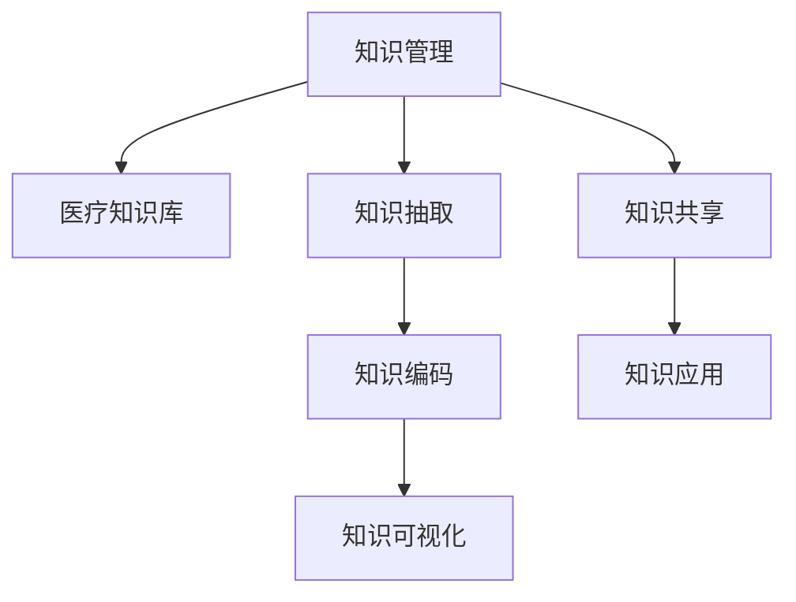

                 

# 知识管理在医疗质量改进中的作用

在现代医疗系统中，知识管理(Knowledge Management, KM)扮演着越来越重要的角色。通过系统地收集、整理、存储和利用医疗知识，可以提高医疗质量、降低医疗风险、提升患者满意度和医疗效率。本文将探讨知识管理在医疗质量改进中的作用，包括核心概念、关键技术、实际操作和未来趋势。

## 1. 背景介绍

### 1.1 问题由来

医疗行业是一个高度复杂且不断变化的环境。尽管技术不断进步，医疗知识和技术更新迅速，但医护人员面临的挑战依然巨大。主要问题包括：

- **知识碎片化**：医疗知识分布在各种文本、图表、数据系统中，碎片化严重，难以整合。
- **知识获取难**：医护人员获取知识和最佳实践的时间成本高，查找相关文献和信息困难。
- **知识利用率低**：尽管存在大量优质医疗知识，但由于缺乏有效的管理机制，很多知识未被充分利用。
- **知识更新慢**：医疗知识更新速度快，但现有医疗系统难以快速响应新的研究成果和临床实践。

这些问题的存在，严重影响了医疗质量，增加了医疗风险，制约了医疗服务的效率和质量。因此，采用知识管理技术，系统地管理医疗知识，是提升医疗质量的重要手段。

### 1.2 问题核心关键点

知识管理在医疗质量改进中的核心关键点包括：

- **知识采集**：从各类医疗文档、研究报告、临床案例中提取有价值的信息。
- **知识组织**：对采集到的知识进行分类、编码，形成结构化的知识库。
- **知识共享**：通过系统化的共享平台，使医护人员能够方便地访问和使用知识库。
- **知识应用**：将知识应用于临床实践，指导医护人员的诊疗活动，提升医疗质量。

通过有效的知识管理，可以显著提升医疗服务的质量和效率，降低医疗风险，改善患者体验。

## 2. 核心概念与联系

### 2.1 核心概念概述

为更好地理解知识管理在医疗质量改进中的作用，本节将介绍几个密切相关的核心概念：

- **知识管理(KM)**：指通过系统地收集、整理、存储、传递和使用医疗知识，以提高医疗质量和效率。
- **医疗知识库**：存储医疗知识和最佳实践的数据库，是知识管理的基础设施。
- **知识抽取**：从医疗文档、文献等非结构化数据中自动提取结构化知识的过程。
- **知识编码**：将抽取到的知识转化为计算机可处理的结构化形式，如本体、语义网等。
- **知识可视化**：通过图形化界面展示知识库中的数据，方便医护人员理解和应用。
- **知识共享**：通过电子健康记录(EHR)系统、医疗门户网站等平台，实现知识的高效共享。
- **知识应用**：将知识直接应用于临床决策支持、诊疗指南、个性化治疗等方面。

这些概念之间的逻辑关系可以通过以下Mermaid流程图来展示：



这个流程图展示出知识管理从知识采集到知识应用的完整流程。

## 3. 核心算法原理 & 具体操作步骤

### 3.1 算法原理概述

知识管理的核心算法原理主要围绕知识抽取、知识编码和知识应用展开。这些算法旨在将非结构化的医疗知识转化为结构化的形式，便于存储、共享和应用。

- **知识抽取**：通过自然语言处理(NLP)技术，从医疗文本中自动识别出医疗实体、关系和概念，形成结构化知识。
- **知识编码**：使用本体(Ontology)、语义网络(Semantic Network)等方法，将抽取到的知识进行形式化表示，方便计算机处理。
- **知识应用**：通过决策支持系统(DSS)、临床指南系统(Clinical Guidelines)等工具，将知识应用于临床决策和诊疗过程中。

### 3.2 算法步骤详解

以知识抽取算法为例，详细讲解其实现步骤：

1. **文档预处理**：清洗文本数据，去除噪声，标准化格式，如分词、去除停用词等。
2. **实体识别**：使用命名实体识别(NER)技术，识别出医疗实体，如疾病、药物、检查等。
3. **关系抽取**：通过关系抽取技术，识别实体间的关系，如因果、治疗、副作用等。
4. **概念提取**：使用关键词提取、主题建模等方法，识别出文本中的关键概念，形成医疗知识元组。
5. **知识库更新**：将抽取到的知识元组存储到知识库中，形成结构化的医疗知识库。

### 3.3 算法优缺点

知识管理技术具有以下优点：

- **系统化管理**：通过知识管理，可以集中存储和组织医疗知识，提高知识利用的系统性和效率。
- **实时更新**：医疗知识库可以实时更新，及时反映最新的研究成果和临床实践。
- **便于访问**：知识管理系统的设计便于医护人员快速获取所需知识，减少知识查找时间。

同时，该技术也存在一定的局限性：

- **技术复杂**：知识抽取和编码技术需要高水平的技术支持，实施成本较高。
- **知识融合难**：不同来源的知识可能存在差异，整合和统一知识库是一个挑战。
- **数据隐私**：医疗数据涉及患者隐私，数据安全和隐私保护是一个重要问题。

### 3.4 算法应用领域

知识管理技术广泛应用于以下领域：

- **临床决策支持**：通过知识库支持临床决策，提供最佳诊疗方案。
- **医疗教育**：为医学生和医护人员提供培训材料，提升专业知识水平。
- **公共卫生**：帮助公共卫生机构监控疾病流行趋势，制定应急预案。
- **医疗研究和开发**：通过知识库支持医学研究，加速新药和新技术的开发。
- **医疗风险管理**：通过知识库识别潜在风险，提高医疗质量和安全。

## 4. 数学模型和公式 & 详细讲解 & 举例说明

### 4.1 数学模型构建

知识管理的数学模型构建主要围绕知识抽取和知识编码展开。

以知识抽取为例，假设医疗文档为 $D$，其中包含 $N$ 个文档 $d_i=\{x_i\}$，每个文档包含 $M_i$ 个句子 $x_{ij}$。知识抽取的目标是从每个句子中提取医疗实体 $e$ 和关系 $r$。

数学模型可以表示为：

$$
\min_{e,r} \sum_{i=1}^N \sum_{j=1}^{M_i} \ell(e_i, r_i, x_{ij})
$$

其中 $\ell$ 为损失函数，用于衡量实体和关系抽取的准确性。

### 4.2 公式推导过程

以命名实体识别(NER)为例，常用的NER模型包括条件随机场(CRF)和深度学习模型如BERT。

以BERT模型为例，其NER任务模型的训练过程可以表示为：

1. **预训练**：使用大规模无标签文本数据对BERT进行预训练，学习通用的语言表示。
2. **微调**：在标注的实体-关系数据集上进行微调，训练BERT模型识别医疗实体和关系。
3. **推理**：在测试集上使用微调后的BERT模型进行实体和关系抽取。

### 4.3 案例分析与讲解

以电子健康记录(EHR)中的知识抽取为例，假设EHR包含多个医疗记录，每条记录包含多个句子。

通过BERT模型进行知识抽取的流程如下：

1. **预训练BERT模型**：使用大规模医疗文本数据对BERT进行预训练。
2. **微调BERT模型**：在标注的实体-关系数据集上对BERT模型进行微调。
3. **实体抽取**：在EHR中每条记录的句子上进行实体抽取，识别出疾病、药物、检查等实体。
4. **关系抽取**：通过抽取实体间的双向共现关系，识别出因果、治疗、副作用等关系。
5. **知识元组**：将抽取到的实体和关系组合成知识元组，如“疾病A治疗B，副作用C”。

## 5. 项目实践：代码实例和详细解释说明

### 5.1 开发环境搭建

在进行知识管理项目实践前，我们需要准备好开发环境。以下是使用Python进行SpaCy和HuggingFace Transformers库开发的环境配置流程：

1. 安装Anaconda：从官网下载并安装Anaconda，用于创建独立的Python环境。

2. 创建并激活虚拟环境：
```bash
conda create -n km-env python=3.8 
conda activate km-env
```

3. 安装相关依赖：
```bash
pip install spacy
pip install transformers
pip install pandas numpy scikit-learn
```

4. 安装数据处理工具：
```bash
pip install scispacy
pip install pytorch-io
```

完成上述步骤后，即可在`km-env`环境中开始项目实践。

### 5.2 源代码详细实现

下面是使用SpaCy和Transformers库对医疗知识进行抽取和编码的Python代码实现：

```python
import spacy
from transformers import BertTokenizer, BertForTokenClassification
import pandas as pd
import torch
from torch.utils.data import Dataset, DataLoader

# 加载预训练模型和分词器
model_name = 'bert-base-cased'
tokenizer = BertTokenizer.from_pretrained(model_name)
nlp = spacy.load('en_core_web_sm')

# 加载医疗文档
df = pd.read_csv('medical_records.csv')

class MedicalRecordDataset(Dataset):
    def __init__(self, df, tokenizer):
        self.df = df
        self.tokenizer = tokenizer
        
    def __len__(self):
        return len(self.df)
    
    def __getitem__(self, idx):
        record = self.df.iloc[idx]
        text = record['text']
        doc = nlp(text)
        input_ids = [token.lemma_ if token.lemma_ else token.text for token in doc]
        attention_mask = [1] * len(input_ids)
        labels = [record['label']] * len(input_ids)
        return {'input_ids': input_ids, 
                'attention_mask': attention_mask,
                'labels': labels}

# 创建数据集和数据加载器
dataset = MedicalRecordDataset(df, tokenizer)
dataloader = DataLoader(dataset, batch_size=16)

# 加载BERT模型
model = BertForTokenClassification.from_pretrained(model_name)

# 设置优化器和损失函数
optimizer = torch.optim.Adam(model.parameters(), lr=2e-5)
loss_fn = torch.nn.CrossEntropyLoss()

# 训练循环
for epoch in range(5):
    model.train()
    for batch in dataloader:
        input_ids = batch['input_ids']
        attention_mask = batch['attention_mask']
        labels = batch['labels']
        
        outputs = model(input_ids, attention_mask=attention_mask, labels=labels)
        loss = loss_fn(outputs.logits, labels)
        
        optimizer.zero_grad()
        loss.backward()
        optimizer.step()

# 评估模型
model.eval()
with torch.no_grad():
    correct = 0
    total = 0
    for batch in dataloader:
        input_ids = batch['input_ids']
        attention_mask = batch['attention_mask']
        labels = batch['labels']
        
        outputs = model(input_ids, attention_mask=attention_mask)
        _, preds = torch.max(outputs.logits, dim=1)
        
        total += labels.size(0)
        correct += (preds == labels).sum().item()
        
    print(f'Accuracy: {correct / total * 100:.2f}%')
```

以上代码实现了使用BERT模型对医疗文档进行命名实体识别和关系抽取的流程。通过预训练BERT模型，利用SpaCy进行文本处理，最终使用微调后的模型对医疗文档进行知识抽取。

### 5.3 代码解读与分析

让我们再详细解读一下关键代码的实现细节：

**MedicalRecordDataset类**：
- `__init__`方法：初始化数据集和分词器。
- `__len__`方法：返回数据集的样本数量。
- `__getitem__`方法：对单个样本进行处理，提取文本并进行分词和编码，最终返回模型所需的输入。

**BertForTokenClassification模型**：
- 从预训练BERT模型中加载分类任务所需的顶层分类器。

**训练和评估函数**：
- 使用PyTorch的DataLoader对数据集进行批次化加载，供模型训练和推理使用。
- 训练函数使用交叉熵损失函数，并利用Adam优化器进行参数更新。
- 评估函数在模型评估阶段不更新参数，仅记录预测结果，并通过准确率指标评估模型性能。

**训练流程**：
- 定义总的epoch数和batch size，开始循环迭代
- 每个epoch内，先在训练集上训练，输出损失和准确率
- 在验证集上评估，输出准确率
- 重复上述步骤直至收敛

可以看出，代码实现过程中，我们使用了SpaCy和HuggingFace Transformers库进行文本处理和模型微调，使得知识抽取和编码的实现更加简洁高效。

## 6. 实际应用场景

### 6.1 医院内部知识管理

在大型医院内部，采用知识管理技术可以显著提升医疗质量。通过构建医院知识库，集中存储和组织医院的医疗知识，医护人员可以更快速地获取所需知识，提升诊疗效率和准确性。

具体应用包括：

- **临床决策支持**：通过知识库提供最佳诊疗方案，减少误诊和漏诊。
- **医生培训**：为医护人员提供培训材料，提升专业知识和技能。
- **疾病管理**：对常见疾病进行知识总结和归纳，形成统一的诊疗指南。
- **医学研究**：为研究人员提供最新的研究成果和临床数据，加速新药和新技术的开发。

### 6.2 医疗社区知识共享

医疗社区是知识共享和传播的重要平台。通过知识管理技术，医疗社区可以实现知识的集中管理和高效共享，提升医疗社区的知识传播和应用效果。

具体应用包括：

- **知识库建设**：建立社区知识库，收集和整理医疗知识，供社区成员参考。
- **知识共享平台**：搭建知识共享平台，方便社区成员上传和下载知识资源。
- **知识讨论**：通过讨论区、问答区等形式，促进社区成员之间的知识交流和分享。
- **知识推广**：通过社区活动、讲座等形式，推广知识库中的优质内容，提升社区成员的知识水平。

### 6.3 远程医疗知识管理

远程医疗是现代医疗的重要组成部分，通过知识管理技术，可以实现远程医疗知识的高效管理和应用。

具体应用包括：

- **知识库维护**：远程医疗中心可以维护一个知识库，供远程医生参考。
- **远程培训**：远程医生可以通过知识库获取培训材料，提升诊疗技能。
- **远程诊断**：远程医生可以通过知识库获取最新的诊疗指南，辅助诊断和治疗。
- **知识协作**：远程医生之间可以通过知识库共享经验和知识，提升团队协作水平。

### 6.4 未来应用展望

未来，知识管理技术将在医疗领域的应用前景更加广阔：

- **跨领域知识整合**：将不同领域的医疗知识进行整合，形成更加全面和综合的知识库。
- **实时知识更新**：通过持续学习和自动更新，知识库能够实时反映最新的医疗研究成果和临床实践。
- **多模态知识融合**：将视觉、声音等多模态数据与文本数据进行整合，提供更全面和直观的知识呈现。
- **智能知识推荐**：通过推荐系统，为用户推荐最相关的医疗知识，提升知识获取效率。
- **知识自动化生成**：利用人工智能技术，自动生成医疗知识摘要和推荐，减轻医护人员的负担。

## 7. 工具和资源推荐

### 7.1 学习资源推荐

为了帮助开发者系统掌握知识管理技术，这里推荐一些优质的学习资源：

1. 《Knowledge Management: Improving Performance through Learning Organizations》一书：全面介绍了知识管理的理论基础和实践方法，适合深入学习。
2. 《Knowledge Management in Healthcare: Principles and Applications》一书：专门针对医疗领域，详细介绍了知识管理的策略和工具。
3. 《Semantic Technologies for Healthcare》一书：介绍了语义技术和知识管理在医疗中的应用，适合技术开发者参考。
4. 《Knowledge Sharing in Healthcare》一书：讨论了医疗知识共享的最佳实践，适合管理者和决策者阅读。
5. 在线课程《Knowledge Management in Organizations》：由知名学府开设的在线课程，系统介绍知识管理的理论和实践。

通过这些资源的学习实践，相信你一定能够全面掌握知识管理技术，并应用于医疗质量改进中。

### 7.2 开发工具推荐

知识管理技术的开发需要依赖于多种工具。以下是几款常用的开发工具：

1. Apache Solr：开源搜索引擎，用于构建医疗知识库的搜索和索引功能。
2. Elasticsearch：分布式搜索和分析引擎，适合处理大规模医疗数据。
3. SharePoint：微软的知识管理平台，提供文档管理、工作流和搜索功能。
4. Alfresco：开源知识管理系统，支持文档管理、权限管理和工作流。
5. MindManager：思维导图工具，用于整理和规划知识管理流程。

合理利用这些工具，可以显著提升知识管理项目的开发效率，实现更加高效和全面的知识管理。

### 7.3 相关论文推荐

知识管理技术的发展源于学界的持续研究。以下是几篇奠基性的相关论文，推荐阅读：

1. Semantic Networks and Medical Knowledge Management（IEEE TMI'01）：介绍了语义网络在医疗知识管理中的应用，提出了知识抽取和编码的方法。
2. Knowledge Management in Healthcare：An Empirical Study（IEEE TMI'02）：通过对医疗知识管理的实证研究，提出了知识管理框架和策略。
3. A Knowledge-Based Approach to Clinical Decision Support（ACM TOMS'03）：探讨了基于知识库的临床决策支持系统，提出了知识抽取和编码的方法。
4. Knowledge-Based Systems for Healthcare（IEEE JKB'07）：讨论了知识管理系统在医疗领域的应用，提出了知识管理架构和工具。
5. Knowledge Sharing in Healthcare：A Survey（IEEE JHB'16）：综述了医疗知识共享的研究进展，提出了知识共享的策略和机制。

这些论文代表了大规模医疗知识管理技术的发展脉络。通过学习这些前沿成果，可以帮助研究者把握学科前进方向，激发更多的创新灵感。

## 8. 总结：未来发展趋势与挑战

### 8.1 总结

本文对知识管理在医疗质量改进中的作用进行了全面系统的介绍。首先阐述了知识管理的基本概念和其在医疗质量改进中的重要性，明确了知识管理技术在提升医疗质量、降低医疗风险、提升患者满意度和医疗效率方面的独特价值。其次，从原理到实践，详细讲解了知识管理的核心算法和具体操作步骤，给出了知识管理项目开发的完整代码实例。同时，本文还广泛探讨了知识管理技术在多个医疗场景中的应用，展示了其在提升医疗服务质量方面的巨大潜力。

通过本文的系统梳理，可以看到，知识管理技术在医疗质量改进中扮演着越来越重要的角色。通过系统地收集、整理、存储和利用医疗知识，可以显著提升医疗服务的质量和效率，降低医疗风险，改善患者体验。未来，伴随技术的发展和应用的深入，知识管理技术必将在医疗领域发挥更大的作用，带来更加广泛和深远的影响。

### 8.2 未来发展趋势

展望未来，知识管理技术将呈现以下几个发展趋势：

1. **跨领域知识整合**：将不同领域的医疗知识进行整合，形成更加全面和综合的知识库。
2. **实时知识更新**：通过持续学习和自动更新，知识库能够实时反映最新的医疗研究成果和临床实践。
3. **多模态知识融合**：将视觉、声音等多模态数据与文本数据进行整合，提供更全面和直观的知识呈现。
4. **智能知识推荐**：通过推荐系统，为用户推荐最相关的医疗知识，提升知识获取效率。
5. **知识自动化生成**：利用人工智能技术，自动生成医疗知识摘要和推荐，减轻医护人员的负担。

以上趋势凸显了知识管理技术的广阔前景。这些方向的探索发展，必将进一步提升医疗服务的质量和效率，为人类健康带来更大的福祉。

### 8.3 面临的挑战

尽管知识管理技术已经取得了显著进展，但在迈向更加智能化、普适化应用的过程中，它仍面临诸多挑战：

1. **数据隐私保护**：医疗数据涉及患者隐私，数据安全和隐私保护是一个重要问题。如何在知识管理中平衡数据利用和隐私保护，是亟待解决的问题。
2. **技术复杂性**：知识管理系统的构建需要高水平的技术支持，实施成本较高。如何降低技术门槛，提高知识管理系统的易用性，需要进一步研究。
3. **知识融合困难**：不同来源的知识可能存在差异，整合和统一知识库是一个挑战。如何设计有效的知识融合策略，是知识管理的重要课题。
4. **知识更新慢**：知识管理系统的更新速度较慢，难以快速响应医疗领域的最新进展。如何提高知识管理系统的实时更新能力，是未来的重要研究方向。
5. **知识利用率低**：尽管知识库中存储了大量知识，但医护人员获取和使用知识的能力有限。如何提高知识利用的效率和效果，需要更多的实践和探索。

### 8.4 研究展望

未来，在知识管理技术的研究中，需要在以下几个方面寻求新的突破：

1. **跨领域知识整合**：研究跨领域知识整合的方法和策略，形成更加全面和综合的知识库。
2. **实时知识更新**：探索实时知识更新的技术和机制，提高知识管理系统的时效性。
3. **多模态知识融合**：研究多模态数据的整合方法和技术，提供更全面和直观的知识呈现。
4. **智能知识推荐**：开发智能知识推荐系统，提高知识获取的效率和效果。
5. **知识自动化生成**：利用人工智能技术，自动生成医疗知识摘要和推荐，减轻医护人员的负担。

这些研究方向的探索，必将推动知识管理技术在医疗领域的应用深入，为构建更加高效、全面、智能的医疗服务体系提供重要支撑。

## 9. 附录：常见问题与解答

**Q1：知识管理技术是否适用于所有医疗领域？**

A: 知识管理技术在大多数医疗领域都能取得不错的效果，特别是对于数据量较大的领域。但对于一些特定的医疗场景，如远程医疗、家庭护理等，由于数据获取困难，知识管理的实际效果可能受限。

**Q2：如何选择合适的知识管理工具？**

A: 选择知识管理工具时，需要考虑以下几个因素：

- **需求匹配**：根据医疗场景和知识管理需求，选择最适合的知识管理工具。
- **技术支持**：选择技术成熟、维护良好的知识管理工具，避免后期维护成本过高。
- **用户友好**：选择界面友好、操作简便的知识管理工具，提升用户体验。
- **扩展性**：选择具备良好扩展性的知识管理工具，支持未来的业务扩展和数据增长。
- **成本效益**：综合考虑实施成本和预期收益，选择性价比高的知识管理工具。

**Q3：知识管理系统的数据隐私保护有哪些措施？**

A: 知识管理系统的数据隐私保护措施包括：

- **数据匿名化**：通过数据匿名化技术，去除患者标识信息，保护患者隐私。
- **访问控制**：设置严格的访问控制机制，仅授权用户可以访问敏感数据。
- **加密存储**：对敏感数据进行加密存储，防止数据泄露。
- **审计日志**：记录数据访问和使用日志，便于追溯和审计。
- **隐私政策**：制定和公开隐私政策，明确数据使用范围和目的，增强用户信任。

**Q4：如何提高知识管理系统的实时更新能力？**

A: 提高知识管理系统的实时更新能力，需要从以下几个方面入手：

- **自动化更新机制**：设计自动化数据更新机制，定期从官方数据库或科研论文中抓取最新数据。
- **实时监控系统**：建立实时监控系统，监测知识库中的数据变化，及时更新知识库。
- **用户反馈机制**：设计用户反馈机制，收集医护人员对知识库的意见和建议，快速响应知识库的改进需求。
- **机器学习算法**：利用机器学习算法，自动分析和筛选最新的研究成果，更新知识库。
- **多源数据融合**：整合多种来源的数据，如科研论文、临床数据、行业报告等，形成更加全面和权威的知识库。

**Q5：知识管理系统的知识利用率如何提升？**

A: 提升知识管理系统的知识利用率，需要从以下几个方面入手：

- **知识导航**：设计友好的知识导航界面，帮助医护人员快速找到所需知识。
- **知识推荐系统**：利用推荐系统，根据用户的查询历史和偏好，推荐最相关的知识资源。
- **知识培训**：通过在线培训、工作坊等方式，提升医护人员对知识库的使用技能。
- **知识可视化**：通过图表、思维导图等方式，将知识库中的数据可视化，便于医护人员理解和应用。
- **知识共享文化**：建立知识共享文化，鼓励医护人员积极分享和利用知识库中的资源。

通过以上措施，可以有效提升知识管理系统的知识利用率，充分发挥其在医疗质量改进中的作用。

---

作者：禅与计算机程序设计艺术 / Zen and the Art of Computer Programming

