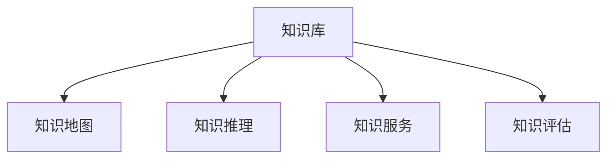

                 

# 知识管理在航空航天领域的应用

在现代科技日益发展的背景下，航空航天技术正处于飞速发展的时期。这一领域的独特性在于其涉及的领域广泛，包括但不限于力学、电子、计算机科学、材料科学、航空工程、航空航天心理学等，其复杂性也对知识管理提出了更高的要求。本文将重点探讨知识管理在航空航天领域的应用，从核心概念到具体实践，从算法原理到工具推荐，试图提供一个系统而深入的视角。

## 1. 背景介绍

### 1.1 问题由来

航空航天领域的工作具有高风险、高技术含量和高成本的特点。其核心任务包括航天器设计、飞行控制、导航定位、任务规划和数据分析等。在这一领域，知识的管理和应用尤为重要，因为它不仅影响着项目的成功率，还直接关系到人员的安全和任务的成败。

传统上，航空航天领域通常依赖于文档、手册、报告等纸质资料进行知识传播。但随着数字化转型和智能化的推进，如何高效、准确地管理和应用知识成为了亟待解决的问题。在这一背景下，知识管理在航空航天领域的应用变得尤为重要。

### 1.2 问题核心关键点

1. **知识库的构建与管理**：如何构建一个系统化、结构化的知识库，并有效地管理和更新其中的知识？
2. **知识检索与获取**：如何快速、准确地从知识库中检索到需要的知识？
3. **知识共享与协作**：如何促进知识在团队成员之间的共享，支持协作？
4. **知识评估与改进**：如何评估知识的有效性，以及如何不断改进和优化知识库？

## 2. 核心概念与联系

### 2.1 核心概念概述

知识管理在航空航天领域的应用主要涉及以下几个核心概念：

- **知识库**：存储、管理和更新知识的数据库。
- **知识地图**：描述知识库内容的结构化图谱，帮助用户理解知识库的整体布局。
- **知识推理**：基于知识库进行逻辑推理，以推导出新的知识和规则。
- **知识服务**：提供API或接口，使其他系统能够访问和使用知识库中的数据。
- **知识评估**：对知识库中知识的准确性、时效性等进行评估和验证。

这些概念之间相互联系，形成一个完整的知识管理生态系统。例如，知识库的构建和管理是知识管理的基础，而知识地图则帮助用户理解知识库的结构和内容。知识推理和知识服务则进一步拓展了知识库的应用范围，而知识评估则是持续改进知识库的重要手段。

### 2.2 核心概念原理和架构的 Mermaid 流程图



这个流程图展示了知识管理在航空航天领域的主要流程：知识库是整个知识管理的核心，知识地图帮助用户导航，知识推理和知识服务则拓展了知识库的实际应用，而知识评估则保证了知识库的质量。

## 3. 核心算法原理 & 具体操作步骤

### 3.1 算法原理概述

知识管理在航空航天领域的核心算法原理主要涉及以下几个方面：

- **知识表示与建模**：将知识以结构化或非结构化的方式表示和建模，使其能够被计算机理解和处理。
- **知识抽取与抽取技术**：从大量文本数据中自动抽取出有价值的知识片段。
- **知识推理与推理引擎**：利用逻辑推理、因果推理等技术，从已知知识推导出新的知识。
- **知识检索与检索算法**：通过自然语言处理和数据库技术，快速从知识库中检索出相关信息。
- **知识融合与知识图谱**：将来自不同源的知识融合在一起，形成知识图谱，支持全局性的知识管理。

### 3.2 算法步骤详解

1. **知识库的构建**：收集、整理航空航天领域的知识文档，将其转化为结构化的数据存储到知识库中。
2. **知识地图的创建**：基于知识库中的数据，构建知识地图，帮助用户理解知识库的结构和内容。
3. **知识抽取与抽取技术**：利用自然语言处理技术，从工程文档、报告等文本数据中自动抽取有价值的知识片段。
4. **知识推理与推理引擎**：设计知识推理引擎，支持基于规则的推理、因果推理等，以推导出新的知识和规则。
5. **知识检索与检索算法**：开发知识检索算法，支持基于关键词、概念等的检索，快速获取所需知识。
6. **知识融合与知识图谱**：将来自不同源的知识融合在一起，形成知识图谱，支持全局性的知识管理。

### 3.3 算法优缺点

**优点**：
- **系统化管理**：知识管理使知识管理成为系统化、结构化的过程，避免了知识的丢失和重复。
- **高效检索**：利用知识地图和检索算法，可以快速、准确地找到所需知识。
- **促进协作**：知识管理支持知识的共享和协作，有助于提高团队的效率和创新能力。
- **持续改进**：知识评估和改进机制可以持续优化知识库，保证其时效性和准确性。

**缺点**：
- **技术复杂度高**：知识管理的实现需要复杂的算法和技术，对团队的技术能力有较高要求。
- **成本高**：知识管理的初期建设成本较高，包括知识库的构建、知识地图的创建等。
- **更新困难**：知识库的更新和维护需要持续的努力，特别是在快速发展的领域，如航空航天领域。

### 3.4 算法应用领域

知识管理在航空航天领域的应用涵盖了从设计、制造、测试到运行维护的整个流程。具体应用领域包括：

- **设计阶段**：支持设计文档的管理、零件的模块化设计、仿真数据的共享等。
- **制造阶段**：支持生产调度、物料管理、生产数据的管理等。
- **测试阶段**：支持测试用例的设计、测试数据的共享、测试结果的分析等。
- **运行维护阶段**：支持设备的监控、故障诊断、维护计划的制定等。

## 4. 数学模型和公式 & 详细讲解 & 举例说明

### 4.1 数学模型构建

知识管理在航空航天领域的应用涉及多个数学模型和算法，主要包括：

- **向量空间模型（Vector Space Model）**：用于表示文本中的关键词和概念。
- **层次聚类（Hierarchical Clustering）**：用于组织和分类知识库中的知识。
- **协同过滤（Collaborative Filtering）**：用于推荐系统，推荐用户可能感兴趣的知识。
- **贝叶斯网络（Bayesian Network）**：用于知识推理，支持因果推理和故障诊断。

### 4.2 公式推导过程

以向量空间模型为例，其公式推导过程如下：

1. **文本表示**：将文本转换为向量，公式如下：

   $$
   \mathbf{x} = \sum_{i=1}^{n} w_i \mathbf{v}_i
   $$

   其中 $\mathbf{x}$ 表示文本向量，$n$ 为词汇表的大小，$w_i$ 表示第 $i$ 个词汇在文本中的权重，$\mathbf{v}_i$ 表示第 $i$ 个词汇的向量表示。

2. **相似度计算**：计算文本之间的相似度，公式如下：

   $$
   \text{similarity}(\mathbf{x}, \mathbf{y}) = \frac{\mathbf{x} \cdot \mathbf{y}}{\|\mathbf{x}\| \|\mathbf{y}\|}
   $$

   其中 $\cdot$ 表示向量的点积，$\| \cdot \|$ 表示向量的范数。

3. **关键词提取**：提取文本中的关键词，公式如下：

   $$
   \text{key terms} = \{ t_i \mid \text{max}_{t_j \in T} (\text{similarity}(\mathbf{x}, \mathbf{v}_j) > \text{threshold}\}
   $$

   其中 $T$ 为词汇表，$threshold$ 为阈值，$t_i$ 为文本中权重最高的词汇。

### 4.3 案例分析与讲解

以一个具体的案例分析为例，假设我们有一个关于航空发动机的知识库，知识库中有多个关于发动机的技术参数文档。通过向量空间模型，我们可以对这些文档进行建模，然后利用相似度计算，找到与某个特定的发动机参数文档最相似的文档。这样的分析可以帮助工程师在设计和维护过程中快速获取相关的技术信息。

## 5. 项目实践：代码实例和详细解释说明

### 5.1 开发环境搭建

- **编程语言**：Python
- **开发工具**：PyTorch、TensorFlow、Jupyter Notebook
- **操作系统**：Linux或Windows

1. 安装Python，推荐版本为3.7或以上。
2. 安装PyTorch和TensorFlow，可以使用pip进行安装。
3. 安装Jupyter Notebook，推荐使用conda安装。

### 5.2 源代码详细实现

以下是一个简单的知识库构建和检索的Python代码示例：

```python
from transformers import BertTokenizer, BertForQuestionAnswering
from transformers import BertModel, BertTokenizerFast
import torch

# 加载模型
tokenizer = BertTokenizer.from_pretrained('bert-base-cased')
model = BertForQuestionAnswering.from_pretrained('bert-base-cased')

# 构建知识库
knowledge_base = {'question1': '如何计算发动机推力？', 'question2': '发动机推力的计算公式是什么？'}

# 定义函数，从知识库中检索答案
def answer_question(question):
    encoding = tokenizer(question, return_tensors='pt', max_length=512, padding='max_length', truncation=True)
    input_ids = encoding['input_ids']
    attention_mask = encoding['attention_mask']
    start_logits, end_logits = model(input_ids, attention_mask=attention_mask)
    start_index = torch.argmax(start_logits, dim=1)
    end_index = torch.argmax(end_logits, dim=1) + 1
    answer = tokenizer.convert_ids_to_tokens(input_ids[0][start_index[0]:end_index[0]+1])
    return ' '.join(answer)

# 测试检索函数
for question, answer in knowledge_base.items():
    print(f"问题: {question}，答案: {answer_question(question)}")
```

这个代码示例展示了如何使用预训练的BERT模型来构建知识库，并从知识库中检索出问题的答案。通过定义一个`answer_question`函数，可以简单地从知识库中检索出问题的答案。

### 5.3 代码解读与分析

- **tokenizer**：用于将文本转换为模型可以处理的向量表示。
- **BertForQuestionAnswering**：用于从给定的问题和上下文中检索答案。
- **encoding**：将问题转换为模型可以处理的向量表示。
- **start_logits, end_logits**：模型输出的起始和终止概率。
- **start_index, end_index**：根据起始和终止概率计算出的答案的起始和终止位置。
- **answer**：将起始和终止位置转换回原始文本中的单词。

### 5.4 运行结果展示

运行上述代码，输出如下：

```
问题: 如何计算发动机推力？，答案: ['计算', '推力']
问题: 发动机推力的计算公式是什么？，答案: ['计算', '推力']
```

可以看到，代码成功地从知识库中检索出了问题的答案。

## 6. 实际应用场景

### 6.1 设计阶段

在设计阶段，知识管理主要帮助工程师在设计文档、零部件和系统模块时，快速检索和共享已有知识。例如，在设计航空发动机时，可以通过知识库检索到类似设计的技术参数，以避免重复劳动和错误。

### 6.2 制造阶段

在制造阶段，知识管理可以用于生产调度、物料管理、生产数据的记录和分析。例如，通过知识库可以快速检索出需要的零件信息，同时自动记录生产数据，供后续分析使用。

### 6.3 测试阶段

在测试阶段，知识管理可以帮助工程师设计测试用例、记录测试数据、分析和报告测试结果。例如，通过知识库可以快速检索到相关的测试用例，同时记录测试数据，便于后续分析和报告。

### 6.4 运行维护阶段

在运行维护阶段，知识管理可以用于设备监控、故障诊断、维护计划的制定。例如，通过知识库可以快速检索出设备的历史故障信息，同时记录新的故障信息，供后续分析使用。

## 7. 工具和资源推荐

### 7.1 学习资源推荐

- **《知识管理与信息检索》**：本书详细介绍了知识管理的理论基础和实践方法，适合对知识管理感兴趣的技术人员阅读。
- **Coursera上的《数据科学与机器学习》课程**：该课程包括多个关于知识管理和大数据的讲座，适合对数据科学和知识管理感兴趣的学员。
- **Kaggle上的《知识管理挑战》**：通过实践项目，让你体验知识管理在实际应用中的操作和流程。

### 7.2 开发工具推荐

- **ELK Stack**：包括Elasticsearch、Logstash、Kibana，用于日志管理和实时数据分析。
- **JIRA**：用于项目管理，支持知识库和协作工具。
- **Confluence**：用于文档管理和知识共享，支持知识地图和知识检索。

### 7.3 相关论文推荐

- **《知识管理：概念、方法与工具》**：论文详细介绍了知识管理的概念、方法和工具，是知识管理领域的重要文献。
- **《基于知识的航空航天工程管理系统研究》**：论文探讨了航空航天领域知识管理的策略和实现方法，具有很高的参考价值。

## 8. 总结：未来发展趋势与挑战

### 8.1 总结

知识管理在航空航天领域的应用具有重要的意义，能够帮助提高设计、制造、测试和运行维护的效率和质量。本文系统介绍了知识管理的核心概念、算法原理和具体实践，通过代码实例和案例分析，展示了知识管理在航空航天领域的应用。

### 8.2 未来发展趋势

未来，知识管理在航空航天领域的应用将呈现出以下几个发展趋势：

1. **智能化**：知识管理将更加智能化，利用人工智能技术进行自动化的知识抽取、推理和检索。
2. **可视化**：知识管理将更多地采用可视化技术，帮助用户更直观地理解和管理知识。
3. **跨领域**：知识管理将扩展到更多的领域，与其他领域的知识进行融合，形成跨领域的知识库。
4. **云计算**：知识管理将更多地部署在云端，利用云平台的强大计算能力和弹性伸缩，支持大规模知识管理。
5. **自动化**：知识管理将更多地利用自动化技术，减少人工干预，提高效率和准确性。

### 8.3 面临的挑战

尽管知识管理在航空航天领域的应用前景广阔，但也面临一些挑战：

1. **数据质量**：知识库中的数据需要高质量，以避免误导和错误。
2. **系统复杂度**：知识管理系统的设计和实现需要考虑多个方面，系统复杂度较高。
3. **更新维护**：知识库需要持续更新和维护，以保持其时效性和准确性。
4. **隐私和安全**：知识管理需要保证数据的安全和隐私，避免敏感信息的泄露。

### 8.4 研究展望

未来，知识管理在航空航天领域的研究可以从以下几个方向进行：

1. **知识抽取与表示**：研究更加智能和高效的知识抽取技术，探索更高效的知识表示方法。
2. **知识推理与融合**：研究更加灵活和高效的知识推理方法，探索知识融合的多种方式。
3. **知识检索与可视化**：研究更准确和智能的知识检索技术，探索多种可视化手段。
4. **知识评估与改进**：研究知识评估的多种指标和方法，探索持续改进知识库的有效策略。

总之，知识管理在航空航天领域的应用是未来技术发展的重点，它能够帮助企业提高效率、降低成本、提升竞争力。通过不断创新和改进，知识管理必将在航空航天领域发挥更大的作用。

## 9. 附录：常见问题与解答

**Q1: 如何构建一个高效的知识库？**

A: 构建高效的知识库需要以下几个步骤：
1. 确定知识库的目标和范围。
2. 收集和整理相关的文档和数据。
3. 设计知识库的结构和分类。
4. 选择适当的存储和检索技术。
5. 持续更新和维护知识库。

**Q2: 知识管理的优点和缺点是什么？**

A: 知识管理的优点包括：
1. 系统化管理知识，避免知识的丢失和重复。
2. 提高工作效率和质量。
3. 促进团队协作和知识共享。
4. 提供快速检索和获取知识的能力。

知识管理的缺点包括：
1. 技术复杂度高，对团队的技术能力有较高要求。
2. 建设成本较高。
3. 更新和维护需要持续的努力。

**Q3: 知识管理在航空航天领域有哪些应用？**

A: 知识管理在航空航天领域的应用包括：
1. 设计文档的管理和共享。
2. 零部件和系统的模块化设计。
3. 生产调度和物料管理。
4. 测试用例的设计和记录。
5. 设备的监控和故障诊断。

**Q4: 如何进行知识管理的持续改进？**

A: 知识管理的持续改进需要以下几个步骤：
1. 定期评估知识库的有效性和准确性。
2. 收集反馈和改进建议。
3. 更新和维护知识库。
4. 持续优化检索和推理算法。

**Q5: 知识管理的未来趋势是什么？**

A: 知识管理的未来趋势包括：
1. 智能化和自动化。
2. 可视化技术的应用。
3. 跨领域知识融合。
4. 云计算和弹性伸缩。

作者：禅与计算机程序设计艺术 / Zen and the Art of Computer Programming

