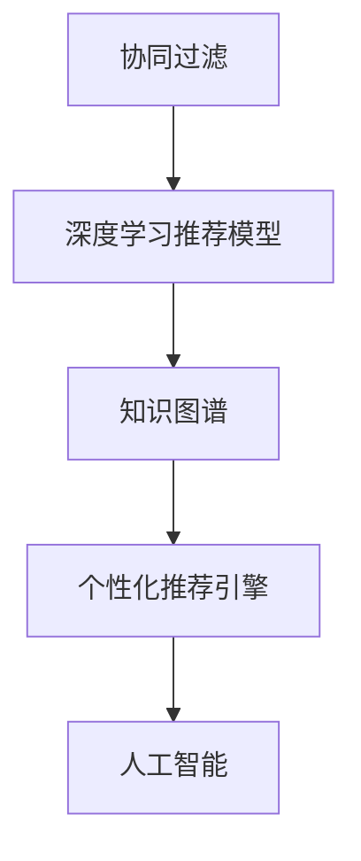

                 

# 知识经济下知识付费的人工智能个性化推荐引擎

在知识经济的浪潮中，知识付费逐渐成为现代人获取知识和信息的重要途径。而个性化推荐引擎作为知识付费平台的核心组件，承担着为用户推荐优质内容、提升平台收益和用户体验的关键任务。本文将系统介绍基于人工智能(AI)的个性化推荐引擎原理与实践，深入探讨其在知识付费中的应用，希望能为相关开发者提供有益的参考。

## 1. 背景介绍

### 1.1 问题由来
随着互联网信息量的爆炸式增长，用户面临信息过载的困境。如何帮助用户在海量信息中筛选出有价值的内容，成为了知识付费平台亟需解决的问题。基于推荐系统的个性化推荐引擎应运而生。

个性化推荐引擎通过分析用户的历史行为、偏好、社交网络等数据，预测用户对内容的潜在兴趣，从而实现精准推荐。随着深度学习和大数据技术的成熟，推荐系统从简单的协同过滤发展为更为复杂的深度学习推荐模型，极大地提升了推荐效果和用户满意度。

### 1.2 问题核心关键点
知识付费平台对个性化推荐引擎的要求主要包括：
- **精准性**：确保推荐内容与用户兴趣高度契合。
- **时效性**：推荐内容应紧跟用户兴趣变化，保持最新。
- **多样性**：推荐内容多样性，避免用户陷入单一兴趣的恶性循环。
- **安全性**：确保推荐内容的合法性、无害性，符合伦理标准。
- **可解释性**：对推荐结果进行解释，提高用户的信任感和满意度。

## 2. 核心概念与联系

### 2.1 核心概念概述

以下是本研究中涉及的关键概念及其概述：

- **个性化推荐引擎**：通过分析用户行为数据，预测用户对内容的潜在兴趣，从而实现精准推荐。
- **协同过滤**：基于用户之间的相似性，推荐用户过去喜欢的内容。
- **深度学习推荐模型**：如矩阵分解、神经网络等，通过深度学习算法从大量数据中提取用户兴趣和内容特征。
- **知识图谱**：将实体、属性、关系等知识结构化，辅助推荐系统从结构化数据中提取信息。
- **人工智能**：涵盖机器学习、深度学习、自然语言处理等技术，为推荐系统提供强有力的技术支撑。

这些概念之间通过以下Mermaid流程图进行联系：



这个流程图展示了从协同过滤到深度学习推荐模型，再到知识图谱和个性化推荐引擎的演变过程，以及这些技术如何相互配合，为知识付费平台提供精准、高效、安全的推荐服务。

## 3. 核心算法原理 & 具体操作步骤

### 3.1 算法原理概述

基于人工智能的个性化推荐引擎通常使用深度学习算法，通过分析用户行为数据和内容特征，构建用户-内容交互模型。具体来说，可以采用以下三种基本思路：

1. **协同过滤(Collaborative Filtering, CF)**：基于用户之间的相似性，推荐用户过去喜欢的内容。CF可以分为基于用户的CF(User-Based CF)和基于项的CF(Item-Based CF)。

2. **深度学习推荐模型**：利用神经网络模型对用户行为和内容特征进行建模，输出用户对不同内容的兴趣程度。常用的深度学习推荐模型包括基于矩阵分解的模型和基于神经网络的模型。

3. **知识图谱(Knowledge Graph)**：将实体、属性、关系等知识结构化，辅助推荐系统从结构化数据中提取信息，提高推荐效果和多样性。

### 3.2 算法步骤详解

以基于深度学习的推荐模型为例，其一般包括以下步骤：

**Step 1: 数据预处理**
- 收集用户行为数据，如浏览、点击、评分等行为，将其转化为数值型数据。
- 收集内容特征数据，如文章标题、摘要、关键词等，转化为嵌入向量。

**Step 2: 模型训练**
- 构建深度神经网络模型，如DNN、CNN、RNN、Transformer等。
- 将用户行为数据和内容特征数据输入模型进行训练，优化模型参数。
- 在验证集上评估模型效果，根据评估结果调整超参数。

**Step 3: 预测与推荐**
- 将新用户行为数据和内容特征数据输入训练好的模型，进行预测。
- 根据预测结果，推荐用户可能感兴趣的内容。

### 3.3 算法优缺点

基于深度学习的推荐模型的优点包括：
- 能够从大量数据中提取用户兴趣和内容特征，适应性强。
- 模型的非线性能力可以处理复杂的关系和交互。
- 可以进行实时推荐，满足用户对时效性的需求。

缺点包括：
- 需要大量的标注数据进行训练，且模型复杂度较高。
- 模型过度拟合用户过去的行为，可能忽视新的兴趣变化。
- 对新内容的冷启动问题较难解决。

### 3.4 算法应用领域

基于深度学习的推荐模型在知识付费平台中的应用非常广泛，具体包括：
- 推荐内容个性化：根据用户的历史行为和兴趣，推荐个性化的文章、课程、图书等。
- 热点内容发现：通过分析用户访问量、评论量等数据，发现平台上的热门内容。
- 用户行为预测：预测用户未来的浏览、点击、购买等行为，优化推荐策略。
- 内容质量监控：通过用户反馈和行为数据，监控内容的质量和用户满意度。

## 4. 数学模型和公式 & 详细讲解 & 举例说明

### 4.1 数学模型构建

以基于深度学习推荐模型为例，设用户集合为 $U$，内容集合为 $I$，用户对内容的评分矩阵为 $R \in \mathbb{R}^{N \times M}$，其中 $N$ 为用户的数量，$M$ 为内容的数量。模型的目标是最小化预测评分与真实评分的误差。

定义用户对内容的评分预测函数为 $f: U \times I \rightarrow \mathbb{R}$，其中 $f_u(i)$ 表示用户 $u$ 对内容 $i$ 的预测评分。模型的优化目标为：

$$
\min_{\theta} \frac{1}{2N} \sum_{u=1}^N \sum_{i=1}^M (r_{ui} - f_u(i))^2
$$

其中 $\theta$ 为模型参数，$r_{ui}$ 为真实评分。

### 4.2 公式推导过程

以基于矩阵分解的模型为例，假设 $R$ 可以分解为 $P$ 和 $Q$ 的乘积，即 $R \approx P \times Q$，其中 $P \in \mathbb{R}^{N \times F}$ 为用户特征矩阵，$Q \in \mathbb{R}^{M \times F}$ 为内容特征矩阵，$F$ 为特征维度。模型的预测评分函数可以表示为：

$$
f_u(i) = \sum_{f=1}^F p_{uf} \times q_{fi}
$$

其中 $p_{uf}$ 和 $q_{fi}$ 分别为 $P$ 和 $Q$ 的元素。

模型参数的更新公式为：

$$
\frac{\partial \mathcal{L}}{\partial P} = -\frac{1}{2}R^TQ - \frac{\lambda}{2}P, \quad \frac{\partial \mathcal{L}}{\partial Q} = -\frac{1}{2}P^TR^T - \frac{\lambda}{2}Q
$$

其中 $\lambda$ 为正则化系数，$\mathcal{L}$ 为损失函数。

通过上述推导，可以看到基于矩阵分解的模型通过分解评分矩阵 $R$，提取用户和内容的特征，从而进行评分预测。这一过程使得模型能够高效处理大规模数据，同时具备较好的可解释性。

### 4.3 案例分析与讲解

假设有一个知识付费平台，收集了用户对文章的浏览、点击、评分等行为数据，以及文章标题、摘要、关键词等特征。为了推荐用户可能感兴趣的文章，平台构建了一个基于深度学习推荐模型的推荐系统。

具体实现如下：
1. **数据预处理**：将用户行为数据和文章特征数据转化为数值型和向量型数据，构建用户-内容评分矩阵 $R$。
2. **模型训练**：使用深度学习框架（如TensorFlow、PyTorch）构建DNN模型，并将 $R$ 作为训练数据，优化模型参数。
3. **预测与推荐**：将新用户行为数据和文章特征数据输入训练好的模型，得到用户对不同文章的预测评分。
4. **推荐列表生成**：根据预测评分，生成推荐文章列表，并展示给用户。

## 5. 项目实践：代码实例和详细解释说明

### 5.1 开发环境搭建

在开发过程中，首先需要搭建一个适合深度学习开发的开发环境。以下是一个基于Python和PyTorch的搭建步骤：

1. 安装Anaconda：从官网下载并安装Anaconda，用于创建独立的Python环境。

2. 创建并激活虚拟环境：
```bash
conda create -n recommendation-env python=3.8 
conda activate recommendation-env
```

3. 安装PyTorch：根据CUDA版本，从官网获取对应的安装命令。例如：
```bash
conda install pytorch torchvision torchaudio cudatoolkit=11.1 -c pytorch -c conda-forge
```

4. 安装相关的库：
```bash
pip install numpy pandas sklearn joblib
```

5. 安装可视化工具：
```bash
pip install matplotlib seaborn
```

完成上述步骤后，即可在`recommendation-env`环境中开始开发。

### 5.2 源代码详细实现

以下是使用PyTorch构建基于深度学习推荐模型的代码实现：

```python
import torch
import torch.nn as nn
import torch.nn.functional as F
from torch import nn
from torch.utils.data import Dataset, DataLoader
from torchvision import datasets, transforms

class UserItemDataset(Dataset):
    def __init__(self, users, items, user_features, item_features, user_item_interactions):
        self.users = users
        self.items = items
        self.user_features = user_features
        self.item_features = item_features
        self.user_item_interactions = user_item_interactions

    def __len__(self):
        return len(self.user_item_interactions)

    def __getitem__(self, index):
        user_id = self.users[index]
        item_id = self.items[index]
        user_features = self.user_features[user_id]
        item_features = self.item_features[item_id]
        user_item_interactions = self.user_item_interactions[user_id][item_id]
        return user_id, item_id, user_features, item_features, user_item_interactions

class DeepRecModel(nn.Module):
    def __init__(self, user_dim, item_dim, embed_dim, num_epochs, learning_rate):
        super(DeepRecModel, self).__init__()
        self.user_embed = nn.Embedding(user_dim, embed_dim)
        self.item_embed = nn.Embedding(item_dim, embed_dim)
        self.fc1 = nn.Linear(2 * embed_dim, embed_dim)
        self.fc2 = nn.Linear(embed_dim, 1)

    def forward(self, user_id, item_id, user_features, item_features):
        user_embed = self.user_embed(user_id)
        item_embed = self.item_embed(item_id)
        x = torch.cat([user_embed, item_embed], dim=1)
        x = F.relu(self.fc1(x))
        x = self.fc2(x)
        return x

# 训练函数
def train_model(model, train_dataset, val_dataset, num_epochs, learning_rate, batch_size):
    criterion = nn.MSELoss()
    optimizer = torch.optim.Adam(model.parameters(), lr=learning_rate)
    for epoch in range(num_epochs):
        for user_id, item_id, user_features, item_features, user_item_interactions in DataLoader(train_dataset, batch_size=batch_size):
            optimizer.zero_grad()
            predictions = model(user_id, item_id, user_features, item_features)
            loss = criterion(predictions, user_item_interactions)
            loss.backward()
            optimizer.step()
            if (epoch + 1) % 10 == 0:
                print('Epoch [%d/%d], Loss: %.4f' % (epoch + 1, num_epochs, loss.item()))
```

### 5.3 代码解读与分析

**UserItemDataset类**：
- `__init__`方法：初始化数据集，包括用户、物品、用户特征、物品特征和用户-物品交互数据。
- `__len__`方法：返回数据集的样本数量。
- `__getitem__`方法：对单个样本进行处理，返回用户ID、物品ID、用户特征、物品特征和用户-物品交互数据。

**DeepRecModel类**：
- `__init__`方法：初始化深度推荐模型，包括用户嵌入层、物品嵌入层和全连接层。
- `forward`方法：定义模型的前向传播过程。

**训练函数**：
- 定义损失函数、优化器等，对模型进行迭代训练。

以上代码展示了使用PyTorch构建深度推荐模型的基本流程。开发者可以通过调整模型的结构、超参数等，优化模型性能。

### 5.4 运行结果展示

在完成模型训练后，可以在验证集上评估模型的预测效果。例如：

```python
# 评估函数
def evaluate_model(model, val_dataset, batch_size):
    criterion = nn.MSELoss()
    model.eval()
    val_loss = 0
    with torch.no_grad():
        for user_id, item_id, user_features, item_features, user_item_interactions in DataLoader(val_dataset, batch_size=batch_size):
            predictions = model(user_id, item_id, user_features, item_features)
            val_loss += criterion(predictions, user_item_interactions).item()
    return val_loss / len(val_dataset)

# 评估模型效果
model.eval()
val_loss = evaluate_model(model, val_dataset, batch_size)
print('Validation Loss:', val_loss)
```

通过以上步骤，可以实现基于深度学习的个性化推荐引擎的构建和评估。

## 6. 实际应用场景

### 6.1 智能课程推荐

在知识付费平台中，课程推荐是一个典型应用场景。通过个性化推荐引擎，平台可以根据用户的历史学习行为和兴趣，推荐匹配的课程。具体实现包括：
- 收集用户历史浏览、点击、评分等行为数据。
- 分析用户的行为数据，提取用户的学习偏好和兴趣。
- 根据用户兴趣，推荐匹配的课程，提高用户满意度和平台收益。

### 6.2 图书推荐

图书推荐也是知识付费平台的重要功能之一。通过个性化推荐引擎，平台可以推荐符合用户兴趣的图书，提升用户阅读体验。具体实现包括：
- 收集用户阅读、评分、评论等行为数据。
- 分析用户的行为数据，提取用户的阅读偏好和兴趣。
- 根据用户兴趣，推荐匹配的图书，提高用户满意度。

### 6.3 讲座推荐

讲座推荐是知识付费平台的一项新兴功能。通过个性化推荐引擎，平台可以推荐符合用户兴趣的讲座，提升用户参与度。具体实现包括：
- 收集用户历史观看、评分、评论等行为数据。
- 分析用户的行为数据，提取用户的讲座偏好和兴趣。
- 根据用户兴趣，推荐匹配的讲座，提高用户参与度。

## 7. 工具和资源推荐

### 7.1 学习资源推荐

为了帮助开发者掌握基于人工智能的个性化推荐引擎的原理与实践，这里推荐一些优质的学习资源：

1. **《推荐系统实践》书籍**：详细介绍了推荐系统的理论基础和经典算法，包括协同过滤、深度学习推荐模型等。

2. **CS229《机器学习》课程**：斯坦福大学开设的机器学习课程，涵盖深度学习推荐模型的理论和实践。

3. **《TensorFlow深度学习》书籍**：TensorFlow的官方指南，介绍了深度学习推荐模型的构建和优化。

4. **Kaggle竞赛**：参加Kaggle的推荐系统竞赛，可以实践和提升推荐算法能力。

5. **HuggingFace官方文档**：提供了丰富的预训练模型和代码样例，帮助开发者快速上手推荐系统开发。

### 7.2 开发工具推荐

以下是几款常用的工具，帮助开发者高效开发和优化个性化推荐引擎：

1. **PyTorch**：基于Python的深度学习框架，支持动态计算图，适合研究和实验。

2. **TensorFlow**：由Google开发的深度学习框架，适合大规模工程应用。

3. **TensorBoard**：TensorFlow的可视化工具，用于监测模型训练状态和调试。

4. **Kaggle平台**：数据科学竞赛平台，提供丰富的推荐系统竞赛数据集和代码。

### 7.3 相关论文推荐

个性化推荐引擎是一个活跃的研究领域，以下几篇经典论文代表了当前的研究进展：

1. **《A Comprehensive Survey on Recommender Systems》**：详细介绍了推荐系统的理论基础、算法和应用。

2. **《Factorization Machines》**：提出了一种矩阵分解方法，用于推荐系统中的用户-物品评分预测。

3. **《Deep Neural Networks for Recommender Systems》**：介绍深度学习在推荐系统中的应用。

4. **《Personalized PageRank Algorithm》**：提出了一种基于图神经网络的推荐算法，用于处理稀疏的用户-物品评分矩阵。

5. **《Knowledge Graph Embeddings》**：介绍知识图谱在推荐系统中的应用，用于提高推荐效果和多样性。

通过这些资源的学习和实践，开发者可以系统掌握基于人工智能的个性化推荐引擎的原理与实践，实现精准、高效、安全的推荐服务。

## 8. 总结：未来发展趋势与挑战

### 8.1 研究成果总结

本文系统介绍了基于人工智能的个性化推荐引擎的原理与实践，通过协同过滤、深度学习推荐模型和知识图谱等技术，实现精准、高效、安全的推荐服务。该技术在知识付费平台中的应用广泛，包括智能课程推荐、图书推荐、讲座推荐等。

### 8.2 未来发展趋势

未来，基于人工智能的个性化推荐引擎将呈现以下几个发展趋势：

1. **实时推荐**：随着流数据技术的成熟，实时推荐系统将成为标配，能够实时根据用户行为数据更新推荐结果，提高用户满意度。

2. **多模态推荐**：融合用户的多模态数据（如视频观看、音频听取、社交媒体等），提高推荐系统的全面性和准确性。

3. **深度学习与知识图谱的融合**：利用深度学习和知识图谱的互补优势，实现更为全面、多样和精准的推荐服务。

4. **可解释性**：提高推荐系统的可解释性，让用户了解推荐过程和依据，增强用户信任和满意度。

5. **安全性与隐私保护**：加强推荐系统的安全性，避免数据泄露和滥用，保护用户隐私。

### 8.3 面临的挑战

尽管基于人工智能的个性化推荐引擎在知识付费平台中得到了广泛应用，但在技术发展和应用推广过程中，仍面临诸多挑战：

1. **数据隐私与安全**：用户数据隐私和安全问题一直是推荐系统面临的重要挑战。平台需要严格保护用户隐私，防止数据泄露。

2. **模型复杂度与可解释性**：深度学习模型的复杂性和黑盒性质，使得推荐系统的可解释性不足。如何提高模型的可解释性，是未来的一个重要研究方向。

3. **冷启动问题**：新用户或新内容的冷启动问题较难解决。如何高效处理新用户或新内容的推荐，是推荐系统需要突破的难题。

4. **实时性与性能**：实时推荐系统对性能和计算资源有较高要求。如何在保障推荐效果的同时，提升系统的实时性和性能，是一个重要的研究方向。

### 8.4 研究展望

未来，基于人工智能的个性化推荐引擎的研究可以从以下几个方向进行突破：

1. **稀疏性处理**：解决大规模数据下的稀疏性问题，提高推荐系统的效率。

2. **跨领域推荐**：将推荐系统扩展到跨领域推荐，如从图书推荐到讲座推荐，提高推荐系统的适应性。

3. **深度学习与协同过滤的融合**：结合深度学习和协同过滤的优势，构建混合推荐系统，提升推荐效果。

4. **自动化推荐**：通过自动生成推荐策略，降低人工干预成本，提高推荐系统的效率。

5. **推荐系统的可解释性**：引入可解释性技术，如基于规则的推荐、因果推断等，提高推荐系统的透明度和用户信任。

这些研究方向的探索，将推动基于人工智能的个性化推荐引擎走向成熟，为知识付费平台和相关领域带来更强大的推荐能力。

## 9. 附录：常见问题与解答

**Q1：基于深度学习的推荐模型是否适用于所有推荐场景？**

A: 基于深度学习的推荐模型适用于大多数推荐场景，尤其是数据量较大、特征较复杂的情况。但对于一些简单、数据量较小的情况，协同过滤等传统的推荐算法可能更为合适。

**Q2：如何在推荐系统中处理冷启动问题？**

A: 处理冷启动问题的方法包括：
1. 利用用户多模态数据进行推荐。
2. 通过社交网络、用户画像等信息对新用户进行预估。
3. 利用新内容的相关推荐进行交叉推荐。

**Q3：如何提高推荐系统的可解释性？**

A: 提高推荐系统的可解释性可以采用以下方法：
1. 引入可解释性技术，如基于规则的推荐、因果推断等。
2. 增加推荐系统的透明度，让用户了解推荐过程和依据。
3. 提供推荐结果的可视化展示，增强用户信任。

**Q4：如何保障推荐系统的安全性？**

A: 保障推荐系统的安全性可以采用以下措施：
1. 加强用户数据隐私保护，防止数据泄露。
2. 对推荐内容进行审核，避免有害内容的推荐。
3. 引入推荐系统的鲁棒性设计，防止恶意攻击。

**Q5：如何优化推荐系统的实时性？**

A: 优化推荐系统的实时性可以采用以下方法：
1. 采用流数据处理技术，实时更新推荐结果。
2. 优化模型结构，提高计算效率。
3. 采用分布式计算和缓存技术，减少计算时间。

以上问题及其解答展示了基于人工智能的个性化推荐引擎在实际应用中可能遇到的问题和解决方案，希望能为开发者提供有益的参考。

---

作者：禅与计算机程序设计艺术 / Zen and the Art of Computer Programming

