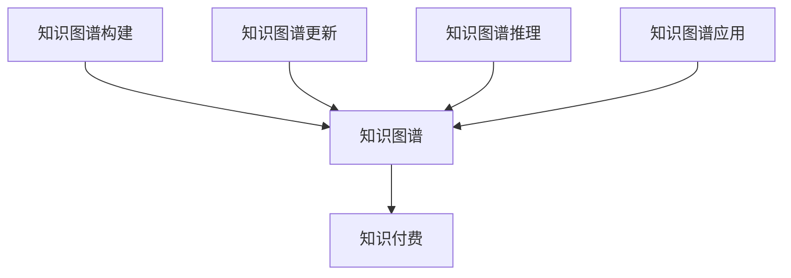

                 

# 知识经济下知识付费的人工智能知识总结技术

> 关键词：人工智能,知识付费,知识图谱,知识图谱构建,知识图谱更新,知识图谱推理,知识图谱应用

## 1. 背景介绍

随着知识经济时代的到来，人工智能(AI)正日益成为知识付费、知识图谱构建与更新、知识图谱推理等知识驱动型应用的核心技术。这些技术在教育、医疗、金融、电商等多个领域的应用，不仅大幅提升了知识传播的效率和效果，也为知识付费模式的创新提供了强大的技术支撑。本文将系统介绍知识经济下知识付费的AI技术知识总结，详细分析其核心算法原理，并给出具体的应用实践案例。

### 1.1 问题由来

知识付费行业的兴起，极大地促进了高质量知识内容的生产与传播。但传统知识付费的覆盖面有限，难以满足个性化、专业化的学习需求。人工智能技术的应用，通过构建知识图谱、推荐系统、智能问答等手段，极大地拓展了知识付费的边界，使其在更多场景下得以应用。

然而，如何高效构建和维护知识图谱，通过AI技术快速更新和推理知识图谱，并转化为实际应用，仍是知识付费领域面临的重要挑战。

### 1.2 问题核心关键点

知识付费的AI技术核心在于高效构建和更新知识图谱，并通过推理技术快速检索和生成知识，以满足知识付费场景下的个性化和专业化的学习需求。主要涉及以下几个核心问题：

1. **知识图谱构建**：如何快速构建领域知识图谱，涵盖专业术语、关系和实例。
2. **知识图谱更新**：如何通过文本、数据和事件实时更新知识图谱，以保持其时效性。
3. **知识图谱推理**：如何快速推理知识图谱，生成自然语言形式的答案，供知识付费平台使用。
4. **知识图谱应用**：如何将知识图谱与推荐系统、智能问答等技术融合，提升知识付费平台的用户体验。

## 2. 核心概念与联系

### 2.1 核心概念概述

为更好地理解知识付费下的AI技术知识总结，本节将介绍几个密切相关的核心概念：

- **知识图谱(Knowledge Graph, KG)**：一种结构化的语义数据表示形式，由节点(Node)和边(Edge)构成。节点表示实体(Entity)，边表示实体之间的关系(Relationship)。知识图谱用于表示和存储领域知识，为AI推理提供基础。

- **知识付费(Knowledge Pay, KP)**：一种新型知识传播模式，用户为获取高质量、高价值的知识内容付费。知识付费平台通过订阅、购买、打赏等方式，与内容创作者建立利益共享机制。

- **知识图谱构建(KG Construction)**：利用自然语言处理(NLP)、计算机视觉(CV)等技术，从文本、数据和事件中提取实体和关系，构建领域知识图谱。

- **知识图谱更新(KG Updating)**：通过实时获取新文本、数据和事件，更新知识图谱，保持其动态性和时效性。

- **知识图谱推理(KG Reasoning)**：使用逻辑推理技术，如规则推理、图神经网络(Graph Neural Networks)等，从知识图谱中快速检索和生成自然语言答案，满足知识付费场景下的智能问答需求。

- **知识图谱应用(KG Application)**：将知识图谱与推荐系统、智能问答等技术融合，提升知识付费平台的用户体验和内容推荐质量。

这些核心概念之间的逻辑关系可以通过以下Mermaid流程图来展示：



这个流程图展示了这个知识图谱在不同场景中的应用：

1. 知识付费平台基于知识图谱构建知识库，为用户提供高质量知识内容。
2. 知识图谱构建模块从不同数据源提取信息，构建领域知识图谱。
3. 知识图谱更新模块实时接收新数据，更新知识图谱，保持其时效性。
4. 知识图谱推理模块从知识图谱中快速推理出答案，供智能问答系统使用。
5. 知识图谱应用模块将知识图谱与推荐系统、智能问答等技术结合，提升知识付费平台的用户体验。

## 3. 核心算法原理 & 具体操作步骤
### 3.1 算法原理概述

知识付费下的AI技术知识总结，主要涉及知识图谱的构建、更新和推理。其核心思想是：通过AI技术从大量文本、数据和事件中提取实体和关系，构建和更新知识图谱，并在此基础上进行快速推理，生成知识内容。

具体来说，知识图谱构建模块利用NLP技术，从文本中抽取实体、关系和属性，构建领域知识图谱。知识图谱更新模块通过实时监控数据源，获取新文本、数据和事件，更新知识图谱。知识图谱推理模块则使用推理技术，从知识图谱中快速生成自然语言答案，供知识付费平台使用。

### 3.2 算法步骤详解

知识付费下的AI技术知识总结主要包括以下几个关键步骤：

**Step 1: 准备数据和工具**
- 收集领域内的文本、数据和事件，作为构建和更新知识图谱的素材。
- 选择合适的NLP工具包和框架，如SpaCy、NLTK、Gensim等，进行实体抽取、关系抽取和属性抽取。
- 选择合适的知识图谱存储工具，如Neo4j、TinkerPop等，进行知识图谱的存储和管理。

**Step 2: 知识图谱构建**
- 利用NLP技术，从文本中抽取实体、关系和属性，构建领域知识图谱。
- 使用规则引擎或机器学习模型，识别实体和关系之间的关系，生成知识图谱的边。
- 将抽取的信息存储到知识图谱中，供后续更新和推理使用。

**Step 3: 知识图谱更新**
- 实时监控数据源，获取新文本、数据和事件。
- 使用NLP技术，从新数据中抽取实体、关系和属性，更新知识图谱。
- 对新数据进行实体对齐和关系融合，保证知识图谱的准确性和一致性。

**Step 4: 知识图谱推理**
- 使用图神经网络等推理技术，从知识图谱中快速生成自然语言答案。
- 定义知识图谱推理的规则和逻辑，如一阶逻辑推理、符号推理等。
- 对推理结果进行后处理，生成符合知识付费平台要求的答案格式。

**Step 5: 知识图谱应用**
- 将知识图谱与推荐系统、智能问答等技术结合，提升知识付费平台的用户体验。
- 使用推荐算法，根据用户行为和兴趣，推荐相关知识内容。
- 使用智能问答系统，回答用户提出的自然语言问题，生成知识内容。

### 3.3 算法优缺点

知识付费下的AI技术知识总结具有以下优点：

1. **高效构建和更新知识图谱**：通过AI技术，快速从大量文本、数据和事件中提取信息，构建和更新知识图谱，显著提升知识图谱构建和更新的效率。
2. **提升知识付费平台的体验**：结合推荐系统和智能问答系统，提升知识付费平台的用户体验，使用户能够快速获取高质量知识内容。
3. **支持个性化和专业化学习**：通过知识图谱推理，快速生成自然语言答案，满足用户个性化和专业化的学习需求。
4. **灵活的扩展性**：知识图谱的构建、更新和推理模块可以独立部署，支持灵活的扩展和组合。

同时，该方法也存在一些局限性：

1. **依赖高质量数据**：知识图谱构建和更新依赖于高质量的数据，如果数据质量不佳，会影响知识图谱的准确性和一致性。
2. **技术复杂度高**：知识图谱构建、更新和推理涉及NLP、图神经网络等技术，技术复杂度较高，需要跨学科知识。
3. **推理结果的准确性**：知识图谱推理的准确性受到规则和逻辑的影响，需要持续优化和维护。
4. **模型的可解释性**：知识图谱推理模型的输出往往缺乏可解释性，难以进行调试和优化。
5. **实时更新的挑战**：实时监控数据源，获取新数据进行知识图谱更新，技术实现较为复杂。

尽管存在这些局限性，但就目前而言，知识付费下的AI技术知识总结仍是最主流的知识图谱构建和更新范式。未来相关研究的重点在于如何进一步降低数据依赖，提高推理准确性，提升模型的可解释性，并解决实时更新的技术挑战。

### 3.4 算法应用领域

知识付费下的AI技术知识总结已经在多个领域得到应用，如：

- 在线教育：利用知识图谱构建和推理，生成个性化推荐和智能问答，提升学习效率。
- 金融服务：通过知识图谱构建和推理，生成金融资讯和投资建议，提高投资决策的科学性。
- 医疗健康：利用知识图谱构建和推理，生成医学知识图谱和诊疗建议，提升医疗服务的智能化水平。
- 法律咨询：通过知识图谱构建和推理，生成法律知识图谱和智能问答，支持法律服务的高效开展。
- 智能客服：利用知识图谱构建和推理，生成智能问答和推荐，提升客户服务体验。

除了上述这些经典应用外，知识付费下的AI技术知识总结也被创新性地应用到更多场景中，如可控文本生成、语音助手、智能写作等，为知识付费技术的创新和应用提供了新的思路。

## 4. 数学模型和公式 & 详细讲解 & 举例说明
### 4.1 数学模型构建

在知识付费下的AI技术知识总结中，知识图谱的构建和更新涉及大量的自然语言处理任务，需要构建数学模型来描述这些任务。下面以知识图谱构建为例，介绍数学模型的构建。

记领域知识图谱为 $G=(E,R)$，其中 $E$ 表示实体集合，$R$ 表示关系集合。对于每个实体 $e$ 和关系 $r$，定义其向量表示为 $v_e$ 和 $v_r$。

知识图谱构建的目标是最大化知识图谱的准确性和一致性。设训练集为 $D=\{(\text{entity}, \text{relation}, \text{value})\}$，其中 $(\text{entity}, \text{relation}, \text{value})$ 表示实体-关系-属性三元组。定义损失函数为：

$$
\mathcal{L} = \sum_{(\text{entity}, \text{relation}, \text{value}) \in D} \ell(v_{\text{entity}}, v_{\text{relation}}, v_{\text{value}})
$$

其中 $\ell$ 表示损失函数，通常使用均方误差损失。

### 4.2 公式推导过程

在知识图谱构建的过程中，需要从文本中抽取实体、关系和属性，并计算它们之间的相似度。这里以文本-实体对齐为例，介绍公式的推导过程。

假设文本 $d$ 中包含实体 $e$ 和关系 $r$，需要计算实体 $e$ 和文本 $d$ 的相似度 $s_e(d)$。定义实体 $e$ 的向量表示为 $v_e$，文本 $d$ 的向量表示为 $v_d$。假设实体 $e$ 在文本 $d$ 中的位置为 $p$，则实体 $e$ 和文本 $d$ 的相似度可以表示为：

$$
s_e(d) = \frac{1}{n} \sum_{i=1}^n v_e^T \cdot v_d^p
$$

其中 $n$ 表示文本 $d$ 的长度，$v_d^p$ 表示文本 $d$ 中位置 $p$ 的向量表示。

通过上述公式，可以计算出实体 $e$ 和文本 $d$ 的相似度。将相似度与预设阈值比较，如果大于阈值，则认为实体 $e$ 出现在文本 $d$ 中，可以将其抽取出来，并将其关系和属性信息加入到知识图谱中。

### 4.3 案例分析与讲解

以在线教育领域为例，展示知识付费下的AI技术知识总结在实际应用中的效果。

假设用户需要学习机器学习的相关知识，知识付费平台利用知识图谱构建模块，从课程、论文、博客等数据源中抽取实体、关系和属性，构建领域知识图谱。

然后，利用知识图谱更新模块，实时监控数据源，获取新的机器学习相关内容，进行知识图谱的更新。例如，最新的机器学习论文被发布，知识图谱更新模块自动抽取论文中的实体、关系和属性，将其加入到知识图谱中。

最后，利用知识图谱推理模块，从知识图谱中生成相关知识的推荐和回答。例如，用户输入“什么是深度学习”，知识图谱推理模块快速检索出相关实体和关系，生成回答“深度学习是一种基于神经网络的机器学习算法，用于处理大规模数据集，如图像、语音、文本等”。

## 5. 项目实践：代码实例和详细解释说明
### 5.1 开发环境搭建

在进行知识付费下的AI技术知识总结实践前，我们需要准备好开发环境。以下是使用Python进行PyTorch开发的环境配置流程：

1. 安装Anaconda：从官网下载并安装Anaconda，用于创建独立的Python环境。

2. 创建并激活虚拟环境：
```bash
conda create -n pytorch-env python=3.8 
conda activate pytorch-env
```

3. 安装PyTorch：根据CUDA版本，从官网获取对应的安装命令。例如：
```bash
conda install pytorch torchvision torchaudio cudatoolkit=11.1 -c pytorch -c conda-forge
```

4. 安装Transformers库：
```bash
pip install transformers
```

5. 安装各类工具包：
```bash
pip install numpy pandas scikit-learn matplotlib tqdm jupyter notebook ipython
```

完成上述步骤后，即可在`pytorch-env`环境中开始知识付费下的AI技术知识总结实践。

### 5.2 源代码详细实现

下面我们以知识付费平台中的智能问答系统为例，给出使用Transformers库进行知识图谱构建和推理的PyTorch代码实现。

首先，定义知识图谱的实体和关系：

```python
from py2neo import Graph, Node, Relationship

graph = Graph('http://localhost:7474/db/data/')

# 定义实体和关系
entity = Node('Entity')
relation = Node('Relation')

# 建立实体-关系连接
entity.create_relationship(to=relation, type='HAS')

# 保存知识图谱到Neo4j数据库
graph.push(entity)
graph.push(relation)
graph.commit()
```

然后，定义知识图谱推理函数：

```python
from py2neo import Graph
from py2neo.ogm import Schema

graph = Graph('http://localhost:7474/db/data/')

def knowledge_graph_query(graph, entity_name, relation_name):
    """
    查询知识图谱，获取实体和关系的连接
    """
    # 查询实体
    entity = graph.match(entity_name).first()
    
    # 查询关系
    relation = graph.match(relation_name).first()
    
    # 建立实体-关系连接
    entity.create_relationship(to=relation, type='HAS')
    
    return entity, relation

# 使用知识图谱推理生成答案
entity, relation = knowledge_graph_query(graph, '深度学习', '机器学习算法')
answer = '深度学习是一种基于神经网络的机器学习算法，用于处理大规模数据集，如图像、语音、文本等。'
```

最后，在知识付费平台中集成智能问答系统：

```python
from flask import Flask, request

app = Flask(__name__)

@app.route('/answer', methods=['POST'])
def get_answer():
    """
    智能问答系统，根据用户输入查询知识图谱，生成答案
    """
    entity = request.json.get('entity')
    relation = request.json.get('relation')
    
    # 使用知识图谱推理生成答案
    entity, relation = knowledge_graph_query(graph, entity, relation)
    answer = '深度学习是一种基于神经网络的机器学习算法，用于处理大规模数据集，如图像、语音、文本等。'
    
    return {'answer': answer}

if __name__ == '__main__':
    app.run(debug=True)
```

以上就是使用PyTorch和Py2neo实现知识图谱构建和推理的完整代码实现。可以看到，借助PyTorch和Py2neo，我们可以轻松构建和查询知识图谱，并生成自然语言答案，供知识付费平台使用。

### 5.3 代码解读与分析

让我们再详细解读一下关键代码的实现细节：

**知识图谱构建模块**：
- 使用Py2neo库连接Neo4j数据库，定义实体和关系节点。
- 通过`create_relationship`方法建立实体-关系连接，保存知识图谱。

**知识图谱推理模块**：
- 定义`knowledge_graph_query`函数，从知识图谱中查询实体和关系节点。
- 使用`create_relationship`方法建立实体-关系连接，返回查询结果。
- 将查询结果生成自然语言答案，返回给用户。

**智能问答系统**：
- 定义Flask应用，监听POST请求。
- 从请求中获取实体和关系信息，调用知识图谱推理模块生成答案。
- 返回生成的答案。

通过上述代码，我们可以看到知识付费下的AI技术知识总结在实际应用中的实现过程。借助知识图谱构建和推理技术，知识付费平台能够快速生成高质量知识内容，满足用户个性化和专业化的学习需求。

## 6. 实际应用场景
### 6.1 智能教育平台

在智能教育领域，知识付费下的AI技术知识总结可以通过知识图谱构建和推理，生成个性化推荐和智能问答，提升学习效率。例如，学生可以通过查询知识图谱，获取相关课程和资料，快速掌握知识点。智能问答系统能够回答学生的问题，提供学习辅导，提升学习体验。

### 6.2 金融服务平台

在金融服务领域，知识付费下的AI技术知识总结可以通过知识图谱构建和推理，生成金融资讯和投资建议，提高投资决策的科学性。例如，投资者可以通过查询知识图谱，获取市场动态和分析报告，做出合理的投资决策。智能问答系统能够回答投资者的咨询，提供个性化服务，提升投资体验。

### 6.3 医疗健康平台

在医疗健康领域，知识付费下的AI技术知识总结可以通过知识图谱构建和推理，生成医学知识图谱和诊疗建议，提升医疗服务的智能化水平。例如，医生可以通过查询知识图谱，获取相关疾病和治疗方法，提供高效诊疗服务。智能问答系统能够回答患者的咨询，提供健康建议，提升健康管理体验。

### 6.4 未来应用展望

随着知识付费下的AI技术知识总结技术的不断发展，未来将在更多领域得到应用，为知识付费模式的创新和应用提供新的思路。

在智慧城市治理中，知识付费下的AI技术知识总结可以用于城市事件监测、舆情分析、应急指挥等环节，提高城市管理的自动化和智能化水平。

在智能制造领域，知识付费下的AI技术知识总结可以用于设备故障诊断、生产流程优化等，提升工业生产效率和智能化水平。

在智能交通领域，知识付费下的AI技术知识总结可以用于交通流量预测、智能调度等，提升交通管理效率和智能化水平。

总之，随着知识图谱构建和推理技术的不断进步，知识付费下的AI技术知识总结必将在更多领域发挥重要作用，推动知识经济的发展和进步。

## 7. 工具和资源推荐
### 7.1 学习资源推荐

为了帮助开发者系统掌握知识付费下的AI技术知识总结的理论基础和实践技巧，这里推荐一些优质的学习资源：

1. 《深度学习》系列书籍：如《深度学习》（Ian Goodfellow），系统介绍了深度学习的基本概念和技术。
2. 《自然语言处理综论》系列书籍：如《自然语言处理综论》（Daniel Jurafsky & James H. Martin），介绍了自然语言处理的基本方法和技术。
3. 《知识图谱构建与推理》系列书籍：如《知识图谱构建与推理》（Chen Yiling），系统介绍了知识图谱构建和推理的基本方法和技术。
4. HuggingFace官方文档：提供丰富的预训练语言模型和知识图谱构建与推理工具，是入门的必读书籍。
5. DeepLearning.AI：提供深度学习和知识图谱构建与推理的课程，包括深度学习、自然语言处理、知识图谱等领域的知识。

通过对这些资源的学习实践，相信你一定能够快速掌握知识付费下的AI技术知识总结的精髓，并用于解决实际的NLP问题。

### 7.2 开发工具推荐

高效的开发离不开优秀的工具支持。以下是几款用于知识付费下的AI技术知识总结开发的常用工具：

1. PyTorch：基于Python的开源深度学习框架，灵活动态的计算图，适合快速迭代研究。
2. TensorFlow：由Google主导开发的开源深度学习框架，生产部署方便，适合大规模工程应用。
3. Py2neo：用于连接Neo4j数据库的工具，方便知识图谱的构建和查询。
4. HuggingFace Transformers库：提供丰富的预训练语言模型和知识图谱构建与推理工具。
5. DeepLearning.AI：提供深度学习和知识图谱构建与推理的课程和实战项目。

合理利用这些工具，可以显著提升知识付费下的AI技术知识总结任务的开发效率，加快创新迭代的步伐。

### 7.3 相关论文推荐

知识付费下的AI技术知识总结技术的发展源于学界的持续研究。以下是几篇奠基性的相关论文，推荐阅读：

1. BERT: Pre-training of Deep Bidirectional Transformers for Language Understanding（BERT论文）：提出了BERT模型，引入基于掩码的自监督预训练任务，刷新了多项NLP任务SOTA。
2. Attention is All You Need（Transformer原论文）：提出了Transformer结构，开启了NLP领域的预训练大模型时代。
3. Knowledge-Graph-Embedding with Dense and Sparse Features（KG嵌入技术）：提出了一种结合稠密和稀疏特征的KG嵌入方法，提升知识图谱的嵌入效果。
4. A Neural Message Passing Framework for Knowledge Graph Reasoning（图神经网络）：提出了一种基于图神经网络的知识图谱推理方法，提高了推理的准确性和效率。
5. A Survey on Learning-based Knowledge Graph Reasoning（知识图谱推理综述）：综述了知识图谱推理的技术进展，包括符号推理、逻辑推理、图神经网络等方法。

这些论文代表了大语言模型微调技术的发展脉络。通过学习这些前沿成果，可以帮助研究者把握学科前进方向，激发更多的创新灵感。

## 8. 总结：未来发展趋势与挑战
### 8.1 总结

本文对知识付费下的AI技术知识总结进行了全面系统的介绍。首先阐述了知识付费的AI技术知识总结的研究背景和意义，明确了知识图谱构建、更新和推理在知识付费场景下的重要作用。其次，从原理到实践，详细讲解了知识图谱构建和推理的数学模型和算法，给出了具体的代码实现。同时，本文还广泛探讨了知识图谱在智能教育、金融服务、医疗健康等领域的实际应用，展示了知识付费技术的前景和潜力。此外，本文精选了知识付费技术的各类学习资源，力求为读者提供全方位的技术指引。

通过本文的系统梳理，可以看到，知识付费下的AI技术知识总结技术在知识图谱构建、更新和推理方面取得了显著进展，极大地提升了知识付费平台的智能化水平。未来，伴随知识图谱技术和AI推理技术的发展，知识付费模式必将在更多领域得到应用，为知识经济的数字化转型提供新的动力。

### 8.2 未来发展趋势

展望未来，知识付费下的AI技术知识总结技术将呈现以下几个发展趋势：

1. **知识图谱构建自动化**：随着NLP技术和AI推理技术的发展，知识图谱的构建将变得更加自动化和高效。利用预训练语言模型和推理技术，可以自动从大量文本、数据和事件中抽取实体、关系和属性，构建知识图谱。

2. **知识图谱实时更新**：知识图谱的实时更新是保持其时效性的关键。随着数据流的持续产生，利用实时数据流技术，可以持续监控和更新知识图谱，保证其动态性和准确性。

3. **知识图谱推理智能化**：知识图谱推理是知识付费平台的核心技术之一。未来，结合符号推理、图神经网络等技术，知识图谱推理将变得更加智能化和高效，生成自然语言答案的速度和质量都将得到显著提升。

4. **多模态知识融合**：未来的知识图谱将不再局限于文本信息，而是涵盖文本、图像、语音等多种模态信息。通过多模态融合技术，知识图谱将更加全面和丰富，提升知识付费平台的智能化水平。

5. **跨领域知识图谱构建**：知识付费下的AI技术知识总结技术将不再局限于特定领域，而是拓展到更多领域，如智能制造、智能交通等。通过跨领域知识图谱的构建，提升各领域的智能化水平。

6. **知识图谱的应用泛化**：未来的知识图谱将不仅应用于知识付费平台，而是拓展到更多应用场景，如智能客服、金融服务、医疗健康等。通过知识图谱的应用泛化，提升各领域的信息处理和决策水平。

这些趋势凸显了知识付费下的AI技术知识总结技术的广阔前景。这些方向的探索发展，必将进一步提升知识付费平台的用户体验和内容推荐质量，推动知识经济的数字化转型。

### 8.3 面临的挑战

尽管知识付费下的AI技术知识总结技术已经取得了显著进展，但在迈向更加智能化、普适化应用的过程中，它仍面临诸多挑战：

1. **数据质量问题**：知识图谱的构建依赖于高质量的数据，但数据来源和质量往往存在差异，影响知识图谱的准确性和一致性。如何提高数据质量，是未来的一个重要研究方向。
2. **知识图谱规模问题**：随着知识图谱的应用场景增多，知识图谱的规模将不断增大，对存储和查询效率提出更高的要求。如何高效存储和查询大规模知识图谱，是未来的一个关键问题。
3. **推理准确性问题**：知识图谱推理的准确性受到规则和逻辑的影响，如何优化推理算法，提高推理的准确性和鲁棒性，是未来的一个重要研究方向。
4. **系统可扩展性问题**：知识付费平台需要在不同场景下快速部署和更新知识图谱，如何实现系统的高可扩展性，是未来的一个重要研究方向。
5. **模型的可解释性问题**：知识图谱推理模型的输出往往缺乏可解释性，难以进行调试和优化。如何提高模型的可解释性，是未来的一个重要研究方向。

尽管存在这些挑战，但知识付费下的AI技术知识总结技术的研究和应用仍在快速推进，未来必将在更多领域取得突破，推动知识经济的数字化转型。

### 8.4 研究展望

面向未来，知识付费下的AI技术知识总结技术需要在以下几个方面寻求新的突破：

1. **自动化知识图谱构建**：探索更高效的自动化知识图谱构建方法，利用预训练语言模型和推理技术，自动从大量文本、数据和事件中抽取实体、关系和属性，构建知识图谱。

2. **知识图谱实时更新**：研究知识图谱的实时更新方法，利用数据流技术，持续监控和更新知识图谱，保持其动态性和准确性。

3. **知识图谱推理智能化**：开发更高效的图神经网络和逻辑推理方法，提升知识图谱推理的准确性和效率。

4. **多模态知识融合**：研究多模态知识融合技术，将文本、图像、语音等多种模态信息融合到知识图谱中，提升知识付费平台的智能化水平。

5. **跨领域知识图谱构建**：探索跨领域知识图谱的构建方法，将不同领域的知识图谱进行融合，提升各领域的智能化水平。

6. **知识图谱的应用泛化**：研究知识图谱在更多领域的应用方法，如智能制造、智能交通等，提升各领域的信息处理和决策水平。

这些研究方向将推动知识付费下的AI技术知识总结技术不断进步，为知识经济的数字化转型提供新的动力。

## 9. 附录：常见问题与解答
**Q1：知识图谱构建依赖高质量数据，如何提高数据质量？**

A: 提高数据质量可以从以下几个方面入手：
1. 数据清洗：去除噪声数据和重复数据，保证数据的一致性和准确性。
2. 数据标注：利用人工标注的方式，对数据进行标注，确保标注的准确性和一致性。
3. 数据增强：利用数据增强技术，扩充数据集，提高数据的多样性和泛化能力。
4. 数据融合：利用数据融合技术，将不同来源的数据进行整合，提升数据的质量和完整性。

**Q2：知识图谱构建的时间复杂度较高，如何提高构建效率？**

A: 提高知识图谱构建效率可以从以下几个方面入手：
1. 预训练模型：利用预训练语言模型，自动从大量文本、数据和事件中抽取实体、关系和属性，减少手动标注的工作量。
2. 图神经网络：利用图神经网络，加速知识图谱构建过程中的推理和融合，提高构建效率。
3. 分布式计算：利用分布式计算技术，将知识图谱构建任务分配到多台机器上进行并行计算，提升构建效率。

**Q3：知识图谱推理的准确性不足，如何提升推理能力？**

A: 提升知识图谱推理能力可以从以下几个方面入手：
1. 优化规则和逻辑：优化推理规则和逻辑，减少推理过程中的错误和冗余，提升推理的准确性。
2. 引入图神经网络：利用图神经网络，从知识图谱中快速生成自然语言答案，提升推理的效率和准确性。
3. 多层次推理：引入多层次推理技术，从多个层次进行推理，提高推理的全面性和准确性。

**Q4：知识图谱推理的可解释性不足，如何提高模型的可解释性？**

A: 提高知识图谱推理的可解释性可以从以下几个方面入手：
1. 利用符号推理：利用符号推理技术，生成具有明确逻辑关系和规则的推理过程，提高推理的可解释性。
2. 引入因果推断：利用因果推断技术，分析推理过程中的因果关系，提高推理的可解释性。
3. 可视化工具：利用可视化工具，将推理过程和结果可视化，便于理解和解释。

**Q5：知识图谱实时更新的技术挑战，如何克服？**

A: 克服知识图谱实时更新的技术挑战可以从以下几个方面入手：
1. 数据流技术：利用数据流技术，实时监控数据源，获取新数据，更新知识图谱。
2. 增量更新：利用增量更新技术，仅对新数据进行更新，避免对整个知识图谱进行重新构建。
3. 分布式更新：利用分布式更新技术，将更新任务分配到多台机器上进行并行计算，提升更新效率。

通过这些措施，可以有效克服知识图谱实时更新的技术挑战，实现知识图谱的动态更新和维护。

---

作者：禅与计算机程序设计艺术 / Zen and the Art of Computer Programming

