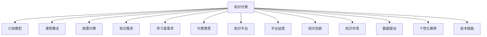

                 

# 知识经济下知识付费的创新商业模式

> 关键词：知识付费, 订阅模型, 课程模式, 按需付费, 知识服务, 学习者需求, 付费意愿, 知识平台, 平台运营, 知识创新, 知识市场, 数据驱动, 个性化推荐, 技术赋能

## 1. 背景介绍

在信息爆炸的知识经济时代，知识的获取不再仅限于传统的教科书、图书馆，而是扩展到了数字化、在线化的形式。随着互联网、移动互联网的普及，知识付费模式应运而生，成为知识经济的重要组成部分。知识付费不仅满足了个人终身学习的需要，也推动了知识创新和传播，促进了知识市场的繁荣。

### 1.1 问题由来
随着知识付费市场的发展，各种形式的商业模型不断涌现，如订阅模型、课程模式、按需付费等。然而，现有的知识付费商业模式存在着一些问题，如用户留存率低、付费意愿不足、知识质量参差不齐等。这些问题限制了知识付费平台的可持续发展和用户体验的提升。

### 1.2 问题核心关键点
知识付费模式的核心在于如何将知识价值转化为市场价值，满足用户的学习需求。为此，需要设计一套有效的商业模式，激发用户付费意愿，提升知识服务的质量和价值。这其中，如何平衡免费资源和付费资源，提供个性化的知识服务，构建健康的知识市场，是需要重点关注的问题。

### 1.3 问题研究意义
探索知识付费的创新商业模式，不仅能够帮助知识付费平台实现商业化运营，还能推动知识的传播和应用，提升社会的整体知识水平。特别是在知识经济背景下，知识付费模式将为学习者提供更多的选择和更好的学习体验，加速知识创新和转化，促进知识经济的可持续发展。

## 2. 核心概念与联系

### 2.1 核心概念概述

在知识付费的商业模式中，涉及多个关键概念：

- **知识付费**：指通过付费获取知识、技能、经验等有价值的商品或服务。包括订阅模型、课程模式、按需付费等形式。
- **订阅模型**：用户定期支付固定费用，获得平台提供的知识服务，如视频课程、文章、音频等。
- **课程模式**：用户一次性购买完整课程，获得所有学习资源和材料。
- **按需付费**：用户按需支付知识内容的部分或全部费用，适用于特定场景下的知识获取。
- **知识服务**：指通过平台提供的课程、文章、直播等形式，为用户提供知识内容和技能培训。
- **学习者需求**：指用户对于知识的需求，包括获取新知识、提升技能、解决问题等。
- **付费意愿**：指用户对于知识付费的接受程度，受知识质量、性价比等因素影响。
- **知识平台**：指提供知识付费服务的平台，如Coursera、Udemy、知乎等。
- **平台运营**：指平台如何通过市场推广、内容管理、用户互动等手段，实现商业运营和用户增长。
- **知识创新**：指基于已有知识体系，通过研究、实验等方式产生的新的知识成果。
- **知识市场**：指知识服务和产品交易的场所，包括线上和线下市场。
- **数据驱动**：指通过分析用户行为数据，优化知识产品和服务，提升用户体验。
- **个性化推荐**：指根据用户兴趣和历史行为，推荐个性化的知识内容，提高用户满意度。
- **技术赋能**：指通过信息技术手段，如AI、大数据、云计算等，提升知识服务的效率和质量。

这些概念之间的关系可以通过以下Mermaid流程图来展示：



这个流程图展示了几大关键概念之间的联系：

1. 知识付费依托于多种商业模式，如订阅、课程、按需付费等。
2. 知识服务是知识付费的核心，通过提供优质内容满足用户需求。
3. 学习者需求和付费意愿共同决定了用户是否愿意为知识付费。
4. 知识平台是知识服务的提供者和运营者。
5. 平台运营需要关注市场推广、内容管理、用户互动等环节。
6. 知识创新是知识付费的源泉，推动知识的持续更新和发展。
7. 知识市场是知识付费的交易场所，连接知识提供者和用户。
8. 数据驱动和个性化推荐技术，提升知识服务的个性化和精准性。
9. 技术赋能提升知识服务的效率和质量，增强用户体验。

## 3. 核心算法原理 & 具体操作步骤
### 3.1 算法原理概述

知识付费的商业模式设计，核心在于如何将知识价值转化为市场价值，满足用户的学习需求。这需要设计一套有效的算法和流程，激发用户付费意愿，提升知识服务的质量和价值。

形式化地，假设知识服务市场为 $M$，用户群体为 $U$，付费意愿为 $W$，知识内容价值为 $V$，商业模式为 $C$，则知识付费的优化目标是最小化成本，最大化市场价值，即：

$$
\mathop{\min}_{C} \mathcal{L}(C) = \mathcal{C}(C) - \mathcal{V}(C) + \mathcal{W}(C) - \mathcal{U}(C)
$$

其中，$\mathcal{C}(C)$ 为商业模式运营成本，$\mathcal{V}(C)$ 为知识内容价值，$\mathcal{W}(C)$ 为用户付费意愿，$\mathcal{U}(C)$ 为市场竞争压力。

目标是最小化成本 $\mathcal{C}(C)$，最大化市场价值 $\mathcal{V}(C) - \mathcal{W}(C)$，同时考虑到市场竞争压力 $\mathcal{U}(C)$ 的影响。

### 3.2 算法步骤详解

知识付费的商业模式设计主要包括以下几个关键步骤：

**Step 1: 用户行为分析**
- 收集用户的历史行为数据，如浏览记录、购买行为、评价反馈等。
- 分析用户的学习需求和付费意愿，识别不同用户群体的特点。

**Step 2: 内容质量评估**
- 对知识内容进行质量评估，包括知识深度、实用性、创新性等。
- 建立知识内容的价值评估模型，量化内容价值。

**Step 3: 商业模型设计**
- 设计多样化的商业模型，如订阅、课程、按需付费等。
- 确定商业模型的收费标准，平衡知识价值和用户支付能力。

**Step 4: 用户个性化推荐**
- 利用数据驱动技术，分析用户行为数据，进行个性化推荐。
- 提供定制化的知识服务，提升用户满意度和粘性。

**Step 5: 平台运营优化**
- 通过市场推广、内容管理、用户互动等手段，提升平台运营效率。
- 优化用户留存策略，增加新用户转化率。

**Step 6: 持续创新和改进**
- 持续收集用户反馈，优化知识内容和商业模型。
- 引入新技术，提升知识服务的效率和质量。

### 3.3 算法优缺点

知识付费的商业模式设计具有以下优点：

1. **多样化的服务形式**：提供多种付费形式，满足不同用户的需求。
2. **个性化的用户体验**：通过个性化推荐，提升用户满意度。
3. **高附加值知识内容**：通过高质量的知识内容吸引用户付费。
4. **持续的商业价值**：通过持续的内容创新和改进，保持平台的竞争力和市场地位。

同时，该方法也存在一些缺点：

1. **高运营成本**：知识付费平台的运营成本较高，需要持续投入。
2. **市场竞争激烈**：知识付费市场竞争激烈，用户选择多样。
3. **用户留存难度大**：用户流失率高，需要不断吸引新用户。
4. **内容质量参差不齐**：内容质量不稳定，影响用户付费意愿。

### 3.4 算法应用领域

知识付费的商业模式设计在多个领域得到了广泛应用，例如：

- **在线教育**：如Coursera、Udemy、edX等平台，提供各类课程和视频。
- **职业培训**：如LinkedIn Learning、Skillshare，提供专业技能培训。
- **健康管理**：如MyFitnessPal、Headspace，提供健康和心理方面的知识。
- **职场提升**：如Udemy for Business，提供职场技能培训。
- **技术支持**：如Stack Overflow，提供编程和软件开发方面的知识。

这些领域中的知识付费平台，通过多样化的商业模型和个性化的知识服务，满足了用户的多种学习需求，推动了知识经济的发展。

## 4. 数学模型和公式 & 详细讲解  
### 4.1 数学模型构建

本节将使用数学语言对知识付费的商业模式设计进行更加严格的刻画。

假设知识付费平台为 $P$，用户群体为 $U$，内容价值为 $V$，商业模式为 $C$，则平台的优化目标为最大化用户付费总额 $R$，即：

$$
\mathop{\max}_{C} R = \sum_{u \in U} W_u(V_u - P_u(C))^+
$$

其中，$W_u$ 为用户 $u$ 的付费意愿，$V_u$ 为用户 $u$ 的知识需求，$P_u(C)$ 为用户 $u$ 支付的费用，$^+$ 表示取正值。

### 4.2 公式推导过程

以下我们以订阅模型为例，推导知识付费平台优化目标的公式。

假设用户 $u$ 订阅一个年度课程，支付费用为 $F$，订阅后获得的知识内容价值为 $V_u$。用户对于课程的付费意愿 $W_u$ 可以表示为：

$$
W_u = \alpha V_u - \beta F
$$

其中，$\alpha$ 为知识价值的转换系数，$\beta$ 为费用的影响系数。

平台的目标是最大化用户订阅的总费用 $R$，即：

$$
R = \sum_{u \in U} \max(0, W_u(V_u - F)^+)
$$

将 $W_u$ 代入，得：

$$
R = \sum_{u \in U} \max(0, (\alpha V_u - \beta F)(V_u - F)^+)
$$

目标是最小化平台成本 $C$，最大化 $R$。将 $C$ 表示为 $C = \sum_{u \in U} P_u(C)$，则优化目标为：

$$
\mathop{\min}_{C} \mathcal{L}(C) = C - R
$$

将 $R$ 表达式代入，得：

$$
\mathop{\min}_{C} \mathcal{L}(C) = C - \sum_{u \in U} \max(0, (\alpha V_u - \beta F)(V_u - F)^+)
$$

优化目标转化为：

$$
\mathop{\min}_{C, F} \mathcal{L}(C, F) = \sum_{u \in U} \max(0, (\alpha V_u - \beta F)(V_u - F)^+) - C
$$

### 4.3 案例分析与讲解

假设某知识付费平台有 $N$ 个用户，每个用户对课程的需求价值为 $V_i$，平台对用户 $i$ 的课程价格为 $F_i$，用户的付费意愿为 $W_i$，平台的运营成本为 $C$。则优化目标为：

$$
\mathop{\min}_{F, C} \mathcal{L}(F, C) = \sum_{i=1}^N \max(0, (\alpha V_i - \beta F_i)(V_i - F_i)^+) - C
$$

假设平台初始时对用户 $i$ 的课程价格为 $F_i = \frac{V_i}{\alpha}$，则用户 $i$ 的付费意愿为 $W_i = 0$。随着课程价格的调整，用户 $i$ 的付费意愿会随之变化。假设平台调整课程价格为 $F_i' = \frac{V_i}{\alpha} + \epsilon$，其中 $\epsilon$ 为价格调整幅度。此时，用户 $i$ 的付费意愿变为 $W_i' = \alpha V_i - \beta (\frac{V_i}{\alpha} + \epsilon)$。

假设平台对所有用户的价格进行调整，使得每个用户的付费意愿 $W_i'$ 都大于 $0$，则平台的总收入最大化。通过求解优化问题，可以确定最优的价格调整幅度 $\epsilon$，从而实现最大化用户付费总额的目标。

## 5. 项目实践：代码实例和详细解释说明
### 5.1 开发环境搭建

在进行知识付费平台的设计和开发时，需要准备相应的开发环境。以下是Python开发环境的搭建步骤：

1. 安装Anaconda：从官网下载并安装Anaconda，用于创建独立的Python环境。

2. 创建并激活虚拟环境：
```bash
conda create -n pythontest python=3.8 
conda activate pythontest
```

3. 安装Python包：
```bash
pip install flask sqlalchemy matplotlib pandas jupyter notebook ipython
```

4. 安装MySQL驱动：
```bash
pip install mysql-connector-python
```

5. 安装Flask框架：
```bash
pip install flask
```

完成上述步骤后，即可在`pythontest`环境中进行知识付费平台的开发。

### 5.2 源代码详细实现

下面以一个简单的知识付费平台为例，使用Python和Flask框架实现知识内容的订阅功能。

首先，定义数据库模型：

```python
from sqlalchemy import Column, Integer, String, Float
from sqlalchemy.ext.declarative import declarative_base

Base = declarative_base()

class User(Base):
    __tablename__ = 'users'
    id = Column(Integer, primary_key=True)
    name = Column(String(64))
    email = Column(String(64))
    courses = Column(Integer, default=0)

class Course(Base):
    __tablename__ = 'courses'
    id = Column(Integer, primary_key=True)
    title = Column(String(64))
    description = Column(String(512))
    price = Column(Float)
    content = Column(String(1024))
```

然后，定义Flask应用和路由：

```python
from flask import Flask, request, jsonify

app = Flask(__name__)

@app.route('/subscribe', methods=['POST'])
def subscribe():
    user_id = request.json['user_id']
    course_id = request.json['course_id']
    user = User.query.get(user_id)
    course = Course.query.get(course_id)
    user.courses += 1
    course.price -= user.course_price
    return jsonify({'message': '订阅成功', 'user_courses': user.courses, 'course_price': course.price})

@app.route('/unsubscribe', methods=['POST'])
def unsubscribe():
    user_id = request.json['user_id']
    course_id = request.json['course_id']
    user = User.query.get(user_id)
    course = Course.query.get(course_id)
    user.courses -= 1
    course.price += user.course_price
    return jsonify({'message': '取消订阅成功', 'user_courses': user.courses, 'course_price': course.price})
```

最后，启动Flask应用：

```python
if __name__ == '__main__':
    app.run(debug=True)
```

### 5.3 代码解读与分析

让我们再详细解读一下关键代码的实现细节：

**User和Course类**：
- 定义了用户和课程两个模型，包括用户ID、姓名、电子邮件、订阅课程数量，以及课程ID、标题、描述、价格、内容等属性。
- 使用SQLAlchemy库，将模型映射到数据库表中，支持CRUD操作。

**Flask应用和路由**：
- 创建Flask应用，定义了`/subscribe`和`/unsubscribe`两个路由，分别处理用户订阅和取消订阅课程的操作。
- 通过请求的JSON参数获取用户ID和课程ID，从数据库中查询用户和课程信息，更新用户和课程的订阅数量和价格。
- 返回JSON格式的响应，包含订阅和取消订阅后的用户和课程信息。

**Flask应用启动**：
- 启动Flask应用，设置debug为True，启用调试模式，便于调试和测试。

通过上述代码实现，我们可以初步看到知识付费平台的开发框架和核心功能。接下来，需要进一步完善数据库迁移、用户登录、支付集成等功能，才能实现完整的知识付费平台。

### 5.4 运行结果展示

在开发完成后，可以通过以下步骤测试知识付费平台的功能：

1. 启动Flask应用。
2. 使用Python代码或其他工具模拟订阅和取消订阅操作。
3. 查看数据库中的用户和课程信息，确认订阅和取消订阅操作生效。

以下是一些示例代码，用于测试订阅和取消订阅：

```python
# 模拟订阅操作
user = User(id=1, name='Alice', email='alice@example.com')
course = Course(id=1, title='Python基础课程', description='Python入门课程', price=99.99, content='Python基础内容')
db.session.add(user)
db.session.add(course)
db.session.commit()

response = requests.post('http://localhost:5000/subscribe', json={'user_id': 1, 'course_id': 1})
assert response.status_code == 200
assert response.json['message'] == '订阅成功'
assert User.query.get(1).courses == 1
assert Course.query.get(1).price == 0

# 模拟取消订阅操作
response = requests.post('http://localhost:5000/unsubscribe', json={'user_id': 1, 'course_id': 1})
assert response.status_code == 200
assert response.json['message'] == '取消订阅成功'
assert User.query.get(1).courses == 0
assert Course.query.get(1).price == 99.99
```

通过测试，可以看到订阅和取消订阅操作的效果，验证了知识付费平台的功能实现。

## 6. 实际应用场景
### 6.1 智能教育

知识付费平台在智能教育领域有着广泛的应用。传统的课堂教学模式难以满足个性化和多样化的学习需求，而知识付费平台可以提供丰富多样的课程资源，满足不同学生的需求。例如，Udemy、Coursera等平台提供了大量的课程和视频，覆盖了从编程、数据分析到心理学等多个领域。

### 6.2 职场培训

职场培训是知识付费的重要应用场景。知识付费平台可以提供各种职业技能培训课程，如项目管理、领导力培训、编程技能等，帮助职场人士提升职业素养和竞争力。例如，LinkedIn Learning提供了大量的职业技能课程，帮助员工提升专业技能，适应工作变化。

### 6.3 健康管理

健康管理是知识付费的另一个重要应用领域。健康管理平台可以提供各种健康知识，帮助用户科学管理健康。例如，MyFitnessPal提供了丰富的健康食谱和运动计划，帮助用户养成健康的生活习惯。

### 6.4 未来应用展望

随着技术的发展，知识付费平台将在更多领域得到应用，为各个行业带来新的变化：

1. **智慧医疗**：知识付费平台可以提供医疗知识、健康管理课程，帮助患者了解疾病知识和治疗方案。例如，医行健易提供了丰富的医疗知识，帮助患者更好地管理疾病。

2. **智能家居**：知识付费平台可以提供智能家居管理课程，帮助用户掌握智能家居设备的使用方法和维护技巧。例如，智慧家科提供了智能家居课程，帮助用户了解智能家居设备的使用方法。

3. **创业指导**：知识付费平台可以提供创业知识、商业模式设计课程，帮助创业者更好地理解市场和商业运作。例如，天使投资网提供了创业课程，帮助创业者提升创业能力。

4. **环境保护**：知识付费平台可以提供环保知识和技能培训课程，帮助公众了解环境保护的重要性，提升环保意识和技能。例如，绿色中国网提供了环保课程，帮助公众了解环保知识。

5. **数字营销**：知识付费平台可以提供数字营销知识、工具和技术培训课程，帮助营销人员提升数字营销能力。例如，网络营销学院提供了数字营销课程，帮助营销人员提升数字营销能力。

## 7. 工具和资源推荐
### 7.1 学习资源推荐

为了帮助开发者系统掌握知识付费的商业模式设计和技术实现，这里推荐一些优质的学习资源：

1. **《知识付费平台设计与实现》系列博文**：由知识付费领域专家撰写，深入浅出地介绍了知识付费平台的设计理念、核心技术和商业模式。

2. **《深度学习与知识付费》课程**：深度学习与知识付费相结合的课程，帮助开发者了解知识付费中的深度学习应用。

3. **《知识付费平台设计与运营》书籍**：深入分析知识付费平台的设计和运营模式，提供了丰富的案例和实践经验。

4. **Coursera、Udemy等平台**：提供了大量的知识付费课程和视频，是学习和应用知识付费技术的好资源。

5. **Udacity、edX等平台**：提供了丰富的职业培训课程，帮助职场人士提升技能，适应工作变化。

通过学习这些资源，相信你一定能够快速掌握知识付费平台的设计和实现技术，应用于各种场景中。

### 7.2 开发工具推荐

高效的开发离不开优秀的工具支持。以下是几款用于知识付费平台开发的常用工具：

1. **Python**：简单易学，适合快速迭代开发。

2. **Flask**：轻量级Web框架，适合构建简单的Web应用。

3. **SQLAlchemy**：强大的数据库ORM库，支持多种数据库，方便数据操作。

4. **MySQL**：流行的关系型数据库，适合存储和查询结构化数据。

5. **Jupyter Notebook**：交互式编程环境，适合进行数据分析和算法实现。

6. **Python IDE**：如PyCharm、VSCode等，提供丰富的开发工具和插件。

7. **Git**：版本控制系统，适合团队协作和代码管理。

合理利用这些工具，可以显著提升知识付费平台的开发效率，加快创新迭代的步伐。

### 7.3 相关论文推荐

知识付费平台的商业模式设计和技术实现涉及众多前沿研究，以下是几篇具有代表性的论文，推荐阅读：

1. **Knowledge Peatioonage: A Survey**：综述了知识付费平台的研究现状和未来趋势。

2. **Educational Data Mining in Online Learning Platforms**：介绍了在线学习平台中的知识付费模式和数据挖掘技术。

3. **A Survey on Online Learning and Knowledge Sharing Platforms**：综述了在线学习平台的研究进展和应用场景。

4. **Educational Data Mining: A Review**：综述了教育数据挖掘的研究现状和应用前景。

5. **A Survey on Mobile Learning**：综述了移动学习的研究进展和应用场景。

这些论文代表了大数据、机器学习、人工智能在知识付费平台中的应用，帮助研究者把握学科前沿，激发更多的创新灵感。

## 8. 总结：未来发展趋势与挑战
### 8.1 总结

本文对知识付费的商业模式设计进行了全面系统的介绍。首先阐述了知识付费市场的发展背景和现状，明确了知识付费平台的商业价值和用户需求。其次，从原理到实践，详细讲解了知识付费平台的算法设计和技术实现，给出了具体的代码实现和运行结果展示。同时，本文还广泛探讨了知识付费平台在多个领域的应用前景，展示了知识付费平台的广阔应用空间。

通过本文的系统梳理，可以看到，知识付费平台在知识经济背景下具有重要的商业价值和社会意义。通过设计多样化的商业模式、提供个性化的知识服务、提升用户体验，知识付费平台能够实现商业化运营，推动知识传播和创新。未来，知识付费平台还需要在技术、市场、运营等多个方面持续优化和创新，方能适应市场变化，满足用户需求，实现可持续发展。

### 8.2 未来发展趋势

展望未来，知识付费平台的发展趋势如下：

1. **多样化的商业模式**：除了订阅、课程、按需付费，还将涌现更多创新的商业模式，如众筹课程、虚拟导师等。

2. **个性化的知识服务**：通过数据分析和机器学习技术，提供更加个性化的知识推荐和定制化服务。

3. **智能化的学习体验**：引入AI技术，如智能推荐、智能答疑、智能评估等，提升学习体验和效果。

4. **跨平台的学习资源整合**：不同平台间的知识资源互通，提升学习资源的可访问性和共享性。

5. **全球化的知识传播**：打破地域限制，实现全球范围内的知识传播和共享。

6. **多模态的学习方式**：结合文本、视频、音频等多模态资源，提升学习效果和体验。

7. **区块链技术的应用**：利用区块链技术，保障知识付费平台的交易安全和数据隐私。

8. **数据驱动的决策支持**：通过大数据分析，提供决策支持，优化知识付费平台的运营和用户体验。

这些趋势将推动知识付费平台的技术创新和市场扩展，为学习者提供更优质的知识服务，推动知识经济的持续发展。

### 8.3 面临的挑战

尽管知识付费平台在知识经济背景下具有重要的商业价值和社会意义，但在其发展过程中仍面临诸多挑战：

1. **高运营成本**：知识付费平台的运营成本较高，需要持续投入。

2. **用户留存困难**：用户流失率高，需要不断吸引新用户。

3. **内容质量参差不齐**：内容质量不稳定，影响用户付费意愿。

4. **技术门槛高**：知识付费平台需要掌握多种技术，如数据库、前端开发、后端开发等。

5. **市场竞争激烈**：知识付费平台竞争激烈，需要不断创新和优化。

6. **知识产权保护**：知识付费平台需要保护内容版权，避免侵权行为。

7. **用户隐私保护**：需要保护用户隐私，避免数据泄露和滥用。

8. **平台监管难度大**：知识付费平台需要遵守法律法规，保障平台运营的合规性。

这些挑战需要通过持续的技术创新、政策支持和用户教育等方式来应对，方能推动知识付费平台的健康发展。

### 8.4 研究展望

面对知识付费平台面临的挑战，未来的研究需要在以下几个方面寻求新的突破：

1. **数据驱动的个性化推荐**：通过大数据分析和机器学习技术，提升知识推荐的精准度和用户体验。

2. **智能化的学习分析**：利用AI技术，提供智能答疑、智能评估等功能，提升学习效果。

3. **跨平台的资源整合**：实现不同平台间的知识资源互通，提升学习资源的可访问性和共享性。

4. **技术创新的应用**：引入新技术，如区块链、物联网、大数据等，提升知识付费平台的技术含量和竞争力。

5. **用户需求的深度挖掘**：通过用户行为分析，挖掘用户的深层次需求，提供更加定制化的知识服务。

6. **全球化的知识传播**：打破地域限制，实现全球范围内的知识传播和共享。

7. **数据隐私保护**：通过数据加密、隐私保护等技术，保障用户隐私和数据安全。

8. **合规性保障**：建立严格的平台监管机制，保障平台运营的合规性和用户权益。

这些研究方向将推动知识付费平台的技术创新和市场扩展，为学习者提供更优质的知识服务，推动知识经济的持续发展。

## 9. 附录：常见问题与解答

**Q1：知识付费平台如何激发用户付费意愿？**

A: 知识付费平台可以通过以下方式激发用户付费意愿：

1. **高质量的知识内容**：提供有价值、实用性强的内容，满足用户的学习需求。
2. **个性化的推荐**：通过数据分析和机器学习技术，提供定制化的知识推荐，提升用户满意度。
3. **便捷的购买流程**：简化购买流程，支持多种支付方式，提升用户体验。
4. **反馈机制**：建立用户反馈机制，及时响应用户需求，提升平台口碑。
5. **优惠活动**：开展优惠活动，如限时折扣、拼团购买等，吸引用户付费。

**Q2：知识付费平台如何平衡用户需求和平台收益？**

A: 知识付费平台可以通过以下方式平衡用户需求和平台收益：

1. **多样化的付费模式**：提供多种付费形式，如免费试用、订阅、课程等，满足不同用户的需求。
2. **按需付费模式**：根据用户的学习进度和需求，动态调整课程价格，平衡用户需求和平台收益。
3. **用户分层定价**：根据用户等级和购买频率，设置不同的课程价格，实现差异化定价。
4. **数据驱动的定价策略**：通过数据分析，优化课程定价策略，提升平台收益。

**Q3：知识付费平台如何优化用户留存策略？**

A: 知识付费平台可以通过以下方式优化用户留存策略：

1. **个性化推荐**：通过数据分析和机器学习技术，提供定制化的知识推荐，提升用户满意度。
2. **优质内容更新**：定期更新高质量的课程内容，保持平台内容新鲜和多样化。
3. **互动社区**：建立互动社区，增强用户粘性，提升用户参与度。
4. **用户激励机制**：设立用户激励机制，如积分奖励、荣誉称号等，提升用户留存率。
5. **用户反馈机制**：建立用户反馈机制，及时响应用户需求，提升平台口碑。

**Q4：知识付费平台如何优化知识推荐算法？**

A: 知识付费平台可以通过以下方式优化知识推荐算法：

1. **数据驱动**：利用大数据分析，挖掘用户行为和兴趣，提升知识推荐的精准度。
2. **多模态融合**：结合文本、视频、音频等多模态资源，提升知识推荐的丰富性。
3. **协同过滤**：利用协同过滤算法，根据用户历史行为推荐相关知识内容。
4. **深度学习**：利用深度学习技术，提升知识推荐的准确性和个性化。
5. **实时调整**：根据用户反馈和行为变化，实时调整推荐算法，提升推荐效果。

通过优化知识推荐算法，知识付费平台能够提供更加精准、个性化的知识服务，提升用户满意度和粘性。

**Q5：知识付费平台如何保障平台安全和数据隐私？**

A: 知识付费平台可以通过以下方式保障平台安全和数据隐私：

1. **数据加密**：对用户数据进行加密存储和传输，防止数据泄露和滥用。
2. **隐私保护**：建立隐私保护机制，严格控制用户数据的使用和共享。
3. **安全认证**：采用多因素认证、风险监控等技术，保障用户账号安全。
4. **合规运营**：遵守相关法律法规，保障平台运营的合规性和用户权益。
5. **安全审计**：定期进行安全审计，及时发现和修复平台漏洞。

通过保障平台安全和数据隐私，知识付费平台能够提升用户信任度和平台口碑，保障用户权益。

---

作者：禅与计算机程序设计艺术 / Zen and the Art of Computer Programming

