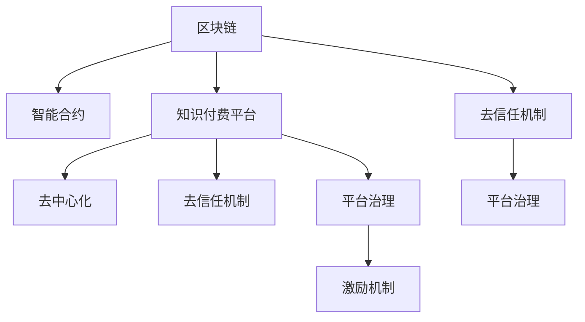

                 

# 知识经济下知识付费的区块链智能合约课程发布

> 关键词：知识经济, 知识付费, 区块链智能合约, 课程发布, 教育平台

## 1. 背景介绍

### 1.1 问题由来
随着知识经济的兴起，全球知识市场正在经历前所未有的变革。知识付费作为一种新兴的商业模式，正在引领一个全新的信息消费时代。如何在知识付费领域建立起透明、可信的交易平台，是一个亟待解决的问题。

随着区块链技术的发展，其去中心化、不可篡改的特性为知识付费平台的信任建设提供了新的解决方案。区块链智能合约可以自动化地管理和执行合同条款，确保交易的安全性和公正性。基于此，本文将深入探讨知识付费领域的区块链智能合约课程发布机制，为知识付费平台提供一种全新的技术解决方案。

### 1.2 问题核心关键点
本文聚焦于知识付费领域，通过区块链智能合约技术，探讨如何构建一个去中心化、透明、可信的知识付费平台。具体来说，以下几个关键点需要重点考虑：
1. **课程发布机制**：如何通过智能合约实现课程的发布、订阅和支付，确保交易的安全性和透明度。
2. **知识付费信任建设**：如何利用区块链的特性，增强用户对平台的信任感。
3. **智能合约自动化执行**：如何通过智能合约实现自动化的合同管理和执行，提升平台的效率。
4. **平台治理和激励机制**：如何设计平台治理和激励机制，吸引优质内容的创作和发布。

这些核心关键点将贯穿全文，通过详细的技术分析和实践案例，为知识付费平台提供建设思路和具体方案。

## 2. 核心概念与联系

### 2.1 核心概念概述

为更好地理解区块链智能合约在知识付费平台中的应用，本节将介绍几个密切相关的核心概念：

- **区块链**：一种分布式账本技术，通过去中心化、不可篡改的特性，保障数据的透明性和安全性。
- **智能合约**：一种在区块链上自动执行、不可篡改的合约，用于自动管理和执行合同条款。
- **知识付费平台**：基于订阅、付费模式，提供知识内容的在线平台。
- **去中心化**：平台不依赖单一中心，而是通过分布式节点共同维护平台运行，增强系统的透明性和安全性。
- **去信任机制**：利用区块链的特性，去除平台对用户和内容创作者的信任需求，提升平台的信任度。
- **平台治理**：通过智能合约和代码规则，实现平台的自动化治理，提升平台的效率和公平性。
- **激励机制**：通过设计合理的激励机制，吸引优质内容的创作和发布。

这些核心概念之间的逻辑关系可以通过以下Mermaid流程图来展示：



这个流程图展示了大语言模型的核心概念及其之间的关系：

1. 区块链通过去中心化特性为智能合约提供了基础设施。
2. 智能合约通过自动化管理执行合同，为知识付费平台提供了安全、透明的交易机制。
3. 去信任机制和平台治理通过智能合约规则，确保平台的公平和效率。
4. 激励机制通过智能合约的设计，吸引优质内容创作者和订阅者。

这些概念共同构成了知识付费平台的建设框架，使其能够构建起去中心化、透明、可信的交易体系。

## 3. 核心算法原理 & 具体操作步骤

### 3.1 算法原理概述

基于区块链智能合约的知识付费平台发布机制，核心在于通过智能合约自动化地管理和执行合同条款，确保交易的安全性和公正性。其主要包括以下几个关键步骤：

- **课程发布**：课程创作者通过智能合约向平台提交课程信息，包括课程标题、内容摘要、价格等。
- **订阅机制**：用户通过智能合约订阅课程，支付相应费用。
- **课程访问**：用户通过智能合约获得课程访问权限，下载或观看课程内容。
- **内容分发**：平台通过智能合约自动分发课程内容，确保用户按时获得课程资源。
- **费用结算**：智能合约自动结算费用，确保平台和创作者的合法权益。
- **激励和反馈**：通过智能合约设计激励机制，平台对优质内容进行奖励，同时收集用户反馈，优化平台生态。

### 3.2 算法步骤详解

**Step 1: 构建智能合约**

智能合约的构建是知识付费平台的基础。假设课程发布平台为 `CoursePlatform`，平台发布课程的智能合约为 `CourseContract`。合约包括课程信息、订阅机制、访问权限、费用结算和激励反馈等模块。

**Step 2: 课程发布**

课程创作者通过智能合约 `CourseContract` 提交课程信息，包括课程标题、内容摘要、价格、所属类别等。创作者需要提供课程资源，如视频、文档等，这些资源将存储在区块链上，确保数据的不可篡改性和透明性。

```solidity
pragma solidity ^0.8.0;

contract CourseContract {
    address public courseCreator;
    string public courseTitle;
    string public courseSummary;
    uint256 public coursePrice;
    uint256 public courseCategory;
    
    constructor(address _author, string memory _title, string memory _summary, uint256 _price, uint256 _category) {
        courseCreator = _author;
        courseTitle = _title;
        courseSummary = _summary;
        coursePrice = _price;
        courseCategory = _category;
    }
    
    function createCourse(bytes32 courseHash) public {
        // 发布课程资源到区块链
        storeCourseResource(courseHash);
        // 向平台发布课程信息
        emit CoursePublished(courseTitle, courseSummary, coursePrice, courseCategory);
    }
    
    function storeCourseResource(bytes32 courseHash) internal {
        // 将课程资源存储到区块链
    }
}
```

**Step 3: 订阅机制**

用户通过智能合约 `CourseContract` 订阅课程，支付相应费用。用户需要提供身份信息，如姓名、邮箱等，以便后续通知和奖励发放。

```solidity
pragma solidity ^0.8.0;

contract CourseContract {
    // 其他功能省略
    
    mapping(uint256 => bytes32) public courseIds;
    mapping(uint256 => address) public userIds;
    mapping(uint256 => address) public rewardAddresses;
    mapping(uint256 => bool) public isSubscribed;
    
    function subscribeCourse(uint256 _courseId) public payable {
        // 检查是否已订阅
        require(!isSubscribed[_courseId]);
        // 记录订阅信息
        courseIds[_courseId] = msg.sender;
        userIds[msg.sender] = _courseId;
        isSubscribed[_courseId] = true;
        // 向用户收取费用
        coursePrice * msg.value;
        // 记录奖励地址
        rewardAddresses[msg.sender] = msg.sender;
    }
}
```

**Step 4: 课程访问**

用户通过智能合约 `CourseContract` 获得课程访问权限，下载或观看课程内容。平台通过智能合约自动分发课程资源，确保用户按时获得课程资源。

```solidity
pragma solidity ^0.8.0;

contract CourseContract {
    // 其他功能省略
    
    function provideCourseResource(uint256 _courseId) public {
        // 检查用户是否已订阅
        require(isSubscribed[_courseId]);
        // 提供课程资源
        // ...
    }
}
```

**Step 5: 费用结算**

智能合约 `CourseContract` 自动结算费用，确保平台和创作者的合法权益。费用将在用户完成课程学习后自动结算，并通过智能合约分配给课程创作者。

```solidity
pragma solidity ^0.8.0;

contract CourseContract {
    // 其他功能省略
    
    function finishCourse(uint256 _courseId) public {
        // 检查用户是否已订阅
        require(isSubscribed[_courseId]);
        // 结算费用
        uint256 coursePrice = coursePrice;
        // 将费用分配给创作者
        uint256 creatorBalance = creatorBalance;
        creatorBalance = creatorBalance + coursePrice;
        CourseCreator.send(creatorBalance);
        // 记录用户学习状态
        isSubscribed[_courseId] = false;
    }
}
```

**Step 6: 激励和反馈**

通过智能合约设计激励机制，平台对优质内容进行奖励，同时收集用户反馈，优化平台生态。

```solidity
pragma solidity ^0.8.0;

contract CourseContract {
    // 其他功能省略
    
    function rewardQualityContent(uint256 _courseId) public {
        // 检查用户是否已订阅
        require(isSubscribed[_courseId]);
        // 将奖励分配给创作者
        uint256 qualityReward = 1 ether;
        CourseCreator.send(qualityReward);
    }
}
```

以上是基于区块链智能合约的知识付费平台发布机制的详细步骤。通过智能合约的自动化管理，平台能够确保交易的安全性和公正性，同时提高平台的效率和用户体验。

### 3.3 算法优缺点

基于区块链智能合约的知识付费平台发布机制，具有以下优点：

1. **透明性**：区块链智能合约的透明性确保了所有交易的公开和可追溯，用户和创作者对交易过程有充分的信任。
2. **不可篡改性**：智能合约的不可篡改性保障了数据的真实性和可靠性，避免了假冒和欺诈行为。
3. **自动化**：智能合约的自动化管理大大提升了平台的效率，减少了人工操作和错误。
4. **安全性**：智能合约的安全性保障了交易的安全性，防止了资金和内容被盗用。
5. **激励机制**：通过智能合约设计激励机制，平台能够有效吸引优质内容的创作和发布。

同时，这种机制也存在一些局限性：

1. **技术门槛**：智能合约的编写和部署需要一定的技术门槛，对开发者的要求较高。
2. **存储成本**：大规模课程内容的存储需要较高的区块链存储空间，可能带来较高的存储成本。
3. **扩展性**：智能合约的设计和部署需要考虑平台的扩展性和未来的需求变化。
4. **法律合规**：智能合约的设计需要考虑各地的法律合规要求，避免法律风险。

尽管存在这些局限性，但区块链智能合约为知识付费平台提供了新的解决方案，具备广阔的应用前景。

### 3.4 算法应用领域

基于区块链智能合约的知识付费平台发布机制，已经在多个领域得到了应用，例如：

1. **在线教育平台**：通过智能合约实现课程的发布、订阅和支付，保障交易的安全性和透明度。
2. **内容创作平台**：平台对优质内容进行奖励，激励创作者发布高质量内容。
3. **知识共享平台**：通过智能合约自动分发知识资源，确保用户按时获得课程资源。
4. **数字内容出版**：平台对作者的知识产权进行保护，确保版权归属和收益分配。
5. **社区学习平台**：通过智能合约记录用户的学习行为，提供个性化的学习建议和反馈。

这些领域的应用，展示了区块链智能合约的广泛潜力和实际价值。

## 4. 数学模型和公式 & 详细讲解

### 4.1 数学模型构建

基于区块链智能合约的知识付费平台发布机制，可以通过数学模型进行更加严格的刻画。

假设知识付费平台为 `CoursePlatform`，平台发布课程的智能合约为 `CourseContract`。合约包括课程信息、订阅机制、访问权限、费用结算和激励反馈等模块。

### 4.2 公式推导过程

以下我们以知识付费平台的订阅机制为例，推导智能合约的订阅函数及其参数。

假设订阅函数为 `subscribeCourse`，用户通过智能合约订阅课程，支付相应费用。合约需要记录用户是否已订阅、订阅课程的ID、用户的ID、奖励地址等信息。

根据上述描述，智能合约的订阅函数可以表示为：

$$
\text{subscribeCourse}(\text{_courseId}, \text{_userId}) = 
\begin{cases} 
1 & \text{用户已订阅} \\
0 & \text{用户未订阅} 
\end{cases}
$$

其中，$\text{_courseId}$ 为课程ID，$\text{_userId}$ 为用户ID。

### 4.3 案例分析与讲解

**案例分析**：假设一个用户 Alice 想要订阅课程 `CourseA`，价格为 $10 美元，课程ID为 $1000$。Alice 的ID为 $1001$，智能合约记录奖励地址为 $1001$。

**订阅过程**：

1. Alice 通过智能合约调用 `subscribeCourse` 函数，并支付 $10 美元。
2. 智能合约检查 Alice 是否已订阅课程 `CourseA`，未订阅则记录订阅信息，并向 Alice 收取 $10 美元。
3. 智能合约记录用户 ID 为 $1001$，课程 ID 为 $1000$，奖励地址为 $1001$。
4. Alice 可以访问课程内容，并在课程完成学习后，调用 `finishCourse` 函数结算费用，获得 $10 美元的奖励。

通过上述案例，我们可以看到智能合约如何通过自动化管理实现课程订阅、费用结算和奖励发放等关键功能。

## 5. 项目实践：代码实例和详细解释说明

### 5.1 开发环境搭建

在进行知识付费平台发布机制的实践前，我们需要准备好开发环境。以下是使用Solidity进行智能合约开发的环境配置流程：

1. 安装Truffle或Remix IDE：Truffle和Remix是两个常用的Solidity开发环境，提供代码编写、测试和部署等一站式开发体验。

2. 安装Node.js：智能合约开发依赖于Node.js环境，可以通过官网下载并安装最新版本的Node.js。

3. 安装Ganache或测试网络：Ganache是一个本地区块链测试工具，支持本地开发、测试和部署。

4. 安装Solidity编译器：通过npm安装Solidity编译器，用于智能合约的编译和部署。

完成上述步骤后，即可在Truffle或Remix环境中开始智能合约开发。

### 5.2 源代码详细实现

下面我们以知识付费平台的订阅机制为例，给出智能合约的Solidity代码实现。

首先，定义智能合约的结构：

```solidity
pragma solidity ^0.8.0;

contract CourseContract {
    address public courseCreator;
    string public courseTitle;
    string public courseSummary;
    uint256 public coursePrice;
    uint256 public courseCategory;
    
    constructor(address _author, string memory _title, string memory _summary, uint256 _price, uint256 _category) {
        courseCreator = _author;
        courseTitle = _title;
        courseSummary = _summary;
        coursePrice = _price;
        courseCategory = _category;
    }
    
    mapping(uint256 => bytes32) public courseIds;
    mapping(uint256 => address) public userIds;
    mapping(uint256 => address) public rewardAddresses;
    mapping(uint256 => bool) public isSubscribed;
    
    function subscribeCourse(uint256 _courseId) public payable {
        // 检查是否已订阅
        require(!isSubscribed[_courseId]);
        // 记录订阅信息
        courseIds[_courseId] = msg.sender;
        userIds[msg.sender] = _courseId;
        isSubscribed[_courseId] = true;
        // 向用户收取费用
        coursePrice * msg.value;
        // 记录奖励地址
        rewardAddresses[msg.sender] = msg.sender;
    }
    
    function provideCourseResource(uint256 _courseId) public {
        // 检查用户是否已订阅
        require(isSubscribed[_courseId]);
        // 提供课程资源
        // ...
    }
    
    function finishCourse(uint256 _courseId) public {
        // 检查用户是否已订阅
        require(isSubscribed[_courseId]);
        // 结算费用
        uint256 coursePrice = coursePrice;
        // 将费用分配给创作者
        uint256 creatorBalance = creatorBalance;
        creatorBalance = creatorBalance + coursePrice;
        CourseCreator.send(creatorBalance);
        // 记录用户学习状态
        isSubscribed[_courseId] = false;
    }
    
    function rewardQualityContent(uint256 _courseId) public {
        // 检查用户是否已订阅
        require(isSubscribed[_courseId]);
        // 将奖励分配给创作者
        uint256 qualityReward = 1 ether;
        CourseCreator.send(qualityReward);
    }
}
```

通过上述代码，我们可以看到智能合约的基本结构和关键功能。

### 5.3 代码解读与分析

让我们再详细解读一下关键代码的实现细节：

**CourseContract类**：
- `constructor`方法：初始化课程信息，包括课程标题、内容摘要、价格、所属类别等。
- `subscribeCourse`方法：用户通过智能合约订阅课程，支付相应费用。
- `provideCourseResource`方法：用户通过智能合约获得课程访问权限，下载或观看课程内容。
- `finishCourse`方法：用户完成课程学习后，调用该函数结算费用。
- `rewardQualityContent`方法：平台对优质内容进行奖励。

**订阅过程**：
1. 用户Alice调用`subscribeCourse`函数，并支付10美元，智能合约记录订阅信息，并向Alice收取费用。
2. Alice可以访问课程内容，并在课程完成学习后，调用`finishCourse`函数结算费用，获得10美元的奖励。

通过上述代码，我们可以看到智能合约如何通过自动化管理实现课程订阅、费用结算和奖励发放等关键功能。

### 5.4 运行结果展示

在部署和测试智能合约后，可以通过Ganache或测试网络进行模拟测试，展示智能合约的实际效果。

## 6. 实际应用场景

### 6.1 智能教育平台

基于区块链智能合约的知识付费平台发布机制，可以广泛应用于智能教育平台。平台通过智能合约自动管理课程发布、订阅和支付，确保交易的安全性和透明度。

在技术实现上，可以收集大量优质的教育资源，如视频课程、文档、讲座等，通过智能合约实现课程的自动发布和订阅。平台对优质内容进行奖励，激励教育资源的创作和发布，提升教育资源的丰富性和多样性。

### 6.2 知识共享社区

智能合约可以应用于知识共享社区，记录用户的订阅和奖励信息，保障知识的共享和传播。

在技术实现上，社区可以记录用户订阅的课程、论文、文章等知识资源，通过智能合约自动发放奖励，如积分、优惠券等，激励用户共享和传播知识。平台通过智能合约记录用户的学习行为，提供个性化的学习建议和反馈，提升社区的学习氛围和互动性。

### 6.3 学术研究和出版平台

智能合约可以应用于学术研究和出版平台，保障研究论文的版权和收益分配。

在技术实现上，平台可以记录论文的发布、订阅和支付信息，通过智能合约自动结算费用，确保作者的权益。平台对优质论文进行奖励，激励学术研究活动的开展，提升学术研究的活跃度和质量。

### 6.4 未来应用展望

随着区块链智能合约技术的发展，其在知识付费平台中的应用将更加广泛和深入。未来，智能合约可以应用于更多领域，如医疗、金融、法律等，为各个行业带来新的变革和发展。

在医疗领域，智能合约可以应用于医疗知识的分享和传播，保障医疗信息的透明性和安全性。在金融领域，智能合约可以应用于金融产品的交易和结算，提升金融交易的公平性和透明度。在法律领域，智能合约可以应用于法律文件的发布和执行，确保法律行为的公正性和合法性。

## 7. 工具和资源推荐

### 7.1 学习资源推荐

为了帮助开发者系统掌握智能合约的知识付费平台构建技术，这里推荐一些优质的学习资源：

1. Solidity官方文档：Solidity官方文档提供了完整的Solidity语言参考，包括语法、标准库、合约开发等。

2. Truffle和Remix官方文档：Truffle和Remix官方文档提供了智能合约开发的全流程指导，包括环境搭建、合约开发、测试和部署等。

3. 《区块链智能合约开发实战》书籍：该书详细介绍了Solidity智能合约开发的技术和实践，适合初学者和进阶开发者。

4. Ethereum官方开发社区：Ethereum官方开发社区提供了丰富的技术交流和学习资源，包括论坛、博客、教程等。

5. Solidity编写规范：Solidity编写规范提供了一系列的编程规范和最佳实践，帮助开发者编写安全和可维护的智能合约。

通过对这些资源的学习实践，相信你一定能够快速掌握智能合约技术，并将其应用于知识付费平台构建中。

### 7.2 开发工具推荐

高效的开发离不开优秀的工具支持。以下是几款用于智能合约开发的工具：

1. Truffle：Truffle是业界领先的Solidity智能合约开发环境，提供了智能合约开发的全流程支持，包括代码编写、测试和部署等。

2. Remix：Remix是另一个流行的Solidity开发环境，提供了直观的开发界面和丰富的调试功能，适合初学者和进阶开发者。

3. Ganache：Ganache是一个本地区块链测试工具，支持本地开发、测试和部署，适合智能合约的开发和测试。

4. MetaMask：MetaMask是一个以太坊钱包和浏览器插件，支持智能合约的交互和测试，适合智能合约的开发和部署。

5. Web3.js：Web3.js是一个JavaScript库，支持智能合约的交互和测试，适合在Web应用中进行智能合约开发。

合理利用这些工具，可以显著提升智能合约开发效率，加速创新迭代的步伐。

### 7.3 相关论文推荐

智能合约和区块链技术的发展源于学界的持续研究。以下是几篇奠基性的相关论文，推荐阅读：

1. "Smart Contracts - A survey"：该论文综述了智能合约的研究现状和未来趋势，为智能合约技术的发展提供了重要参考。

2. "Ethereum: A Secure Platform for Decentralized Applications"：该论文介绍了Ethereum区块链平台及其智能合约功能，为区块链智能合约的发展提供了理论基础。

3. "Towards a Decentralized Future"：该论文探讨了区块链技术在各个领域的潜在应用，为区块链智能合约的实际应用提供了思路。

4. "The Economics of Blockchain: Buy-Sell-Marketplaces for Smart Contracts"：该论文研究了区块链智能合约的经济模型，为智能合约的激励机制设计提供了理论支持。

5. "Blockchain-based Secure Academic Research"：该论文探讨了区块链技术在学术研究中的应用，为学术研究和出版平台的智能合约设计提供了参考。

这些论文代表了大语言模型微调技术的发展脉络。通过学习这些前沿成果，可以帮助研究者把握学科前进方向，激发更多的创新灵感。

## 8. 总结：未来发展趋势与挑战

### 8.1 总结

本文对基于区块链智能合约的知识付费平台发布机制进行了全面系统的介绍。首先阐述了知识付费领域对智能合约的需求和智能合约技术的重要性，明确了智能合约在知识付费平台构建中的核心地位。其次，从原理到实践，详细讲解了智能合约的数学模型和关键步骤，给出了智能合约开发的全流程代码实例。同时，本文还广泛探讨了智能合约在智能教育、知识共享、学术研究等多个领域的应用前景，展示了智能合约的广阔潜力和实际价值。此外，本文精选了智能合约技术的各类学习资源，力求为开发者提供全方位的技术指引。

通过本文的系统梳理，可以看到，基于智能合约的知识付费平台构建为知识付费平台提供了新的解决方案，具备广阔的应用前景。智能合约通过自动化管理，确保了交易的安全性和透明度，提升了平台的效率和用户信任度。未来，伴随智能合约技术的不断演进，基于智能合约的知识付费平台必将在教育、科研、社区等多个领域大放异彩，为知识经济的发展提供新的动力。

### 8.2 未来发展趋势

展望未来，区块链智能合约技术将在知识付费平台中的应用更加广泛和深入。以下是几个可能的发展趋势：

1. **智能合约的扩展性**：随着平台需求的不断增加，智能合约的设计将更加灵活和可扩展，以适应不同的应用场景。
2. **智能合约的互操作性**：不同平台和系统之间的智能合约将实现互操作，形成更加开放和互联的生态系统。
3. **智能合约的自动化治理**：智能合约将结合自动化治理和智能决策技术，提升平台的公平性和效率。
4. **智能合约的激励机制**：智能合约将设计更加合理和动态的激励机制，吸引更多优质内容创作者和订阅者。
5. **智能合约的跨链技术**：智能合约将结合跨链技术，实现不同区块链平台之间的数据互通和资源共享。
6. **智能合约的伦理和隐私保护**：智能合约将结合伦理和隐私保护技术，保障用户的数据安全和隐私权益。

这些趋势凸显了智能合约技术的广阔前景，预示着区块链智能合约将为知识付费平台带来新的变革和突破。

### 8.3 面临的挑战

尽管智能合约技术在知识付费平台中已经取得了显著进展，但在迈向更加智能化、普适化应用的过程中，仍面临诸多挑战：

1. **技术复杂性**：智能合约的设计和部署需要一定的技术门槛，对开发者的要求较高。
2. **可扩展性**：智能合约的设计需要考虑平台的扩展性和未来的需求变化，避免系统瓶颈。
3. **安全性和稳定性**：智能合约的安全性和稳定性是平台的核心要求，避免智能合约漏洞和攻击。
4. **法律合规性**：智能合约的设计需要考虑各地的法律合规要求，避免法律风险。
5. **社区参与度**：智能合约平台需要提升社区的参与度和互动性，吸引更多用户和创作者。

这些挑战需要开发者在技术、法规、社区等多个维度协同发力，才能实现智能合约平台的成功构建和持续运营。

### 8.4 研究展望

面对智能合约面临的挑战，未来的研究需要在以下几个方面寻求新的突破：

1. **智能合约的标准化**：制定智能合约的标准和规范，提升智能合约的可互操作性和扩展性。
2. **智能合约的安全性**：开发更加安全可靠的智能合约技术，提升智能合约的稳定性和安全性。
3. **智能合约的自动化治理**：结合自动化治理和智能决策技术，提升平台的公平性和效率。
4. **智能合约的激励机制**：设计更加合理和动态的激励机制，吸引更多优质内容创作者和订阅者。
5. **智能合约的跨链技术**：结合跨链技术，实现不同区块链平台之间的数据互通和资源共享。
6. **智能合约的伦理和隐私保护**：结合伦理和隐私保护技术，保障用户的数据安全和隐私权益。

这些研究方向的探索，必将引领智能合约技术迈向更高的台阶，为知识付费平台的建设提供新的解决方案和创新思路。

## 9. 附录：常见问题与解答

**Q1：智能合约如何保证交易的安全性和透明度？**

A: 智能合约通过区块链的不可篡改性和透明性，确保了交易的安全性和透明度。所有交易记录都被公开发布在区块链上，任何人都可以在区块链上查询和验证交易的真实性和完整性。

**Q2：智能合约如何避免安全漏洞和攻击？**

A: 智能合约的设计和部署需要考虑安全性，避免常见的安全漏洞如重入攻击、溢出攻击等。可以通过代码审计、自动化测试等方法，确保智能合约的安全性和稳定性。

**Q3：智能合约的扩展性和互操作性如何实现？**

A: 智能合约的设计需要考虑扩展性和互操作性，通过接口和标准协议，实现不同平台和系统之间的互操作。同时，智能合约可以结合跨链技术，实现不同区块链平台之间的数据互通和资源共享。

**Q4：智能合约的自动化治理和激励机制如何设计？**

A: 智能合约可以通过代码规则实现自动化治理，确保平台的公平性和效率。同时，智能合约可以设计合理的激励机制，如投票机制、奖励机制等，吸引更多优质内容创作者和订阅者。

**Q5：智能合约的法律合规性如何保障？**

A: 智能合约的设计需要考虑各地的法律合规要求，避免法律风险。可以结合法律专家和法律框架，制定智能合约的合规规范和标准。

通过上述问题的解答，我们可以看到智能合约技术在知识付费平台中的核心价值和面临的挑战。未来，伴随技术的不断演进和应用的深入，智能合约必将在知识经济中发挥更加重要的作用，为知识付费平台的建设提供新的动力。

---

作者：禅与计算机程序设计艺术 / Zen and the Art of Computer Programming

