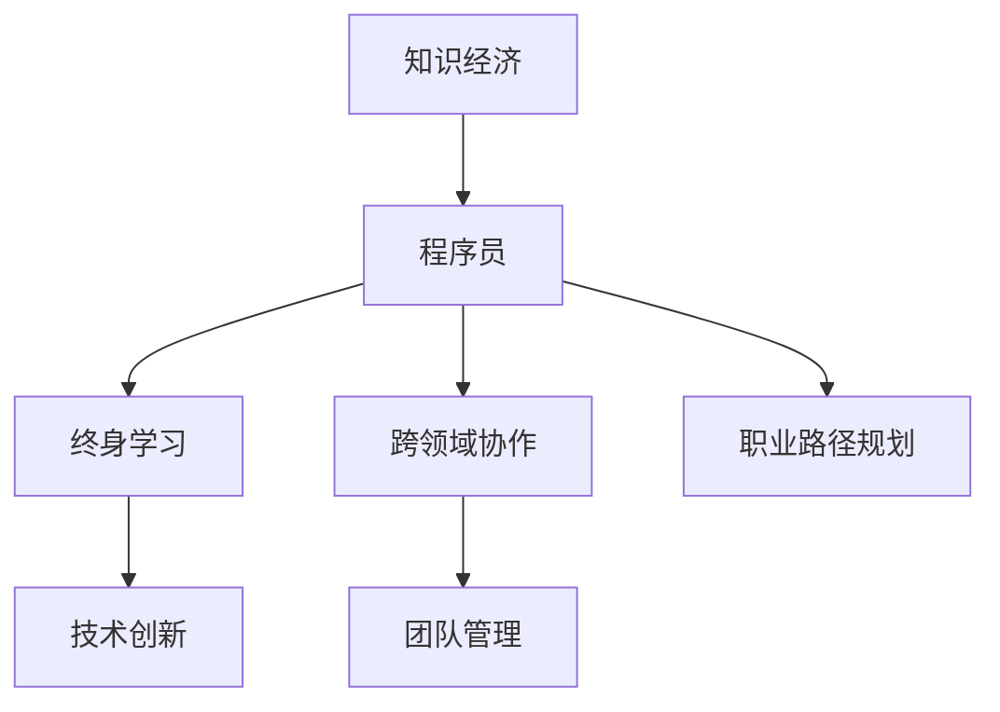

                 

# 知识经济下程序员的职业发展方向与路径

## 1. 背景介绍

### 1.1 问题由来

随着全球经济的数字化转型，知识经济逐渐成为新一轮的产业革命浪潮。各行各业对高素质人才的需求愈发旺盛，特别是具备深厚计算机科学基础、卓越技术创新能力和丰富项目管理经验的程序员。在知识经济的大背景下，程序员不仅需要掌握扎实的编程技能，更要具备终身学习和跨领域协作的能力，以适应快速变化的市场需求和技术环境。

### 1.2 问题核心关键点

知识经济时代的程序员职业发展，面临着众多挑战和机遇。本文将从技术进步、产业变革、职业能力三个角度，深入探讨程序员的职业路径规划，帮助开发者明确发展方向，获得更广阔的职业发展空间。

## 2. 核心概念与联系

### 2.1 核心概念概述

为更好地理解程序员在知识经济背景下的职业发展路径，本节将介绍几个关键概念：

- **知识经济**：以知识和信息的生产、分配、利用为核心资源，通过信息技术驱动的新型经济形态。
- **程序员**：指具备计算机科学基础，能够使用编程语言进行软件开发、系统维护、数据分析、人工智能等技术活动的专业人员。
- **终身学习**：指不断更新知识储备和技能，适应技术迭代和市场需求变化的学习态度和方法。
- **跨领域协作**：指不同背景、不同技能的人员在同一个项目中相互配合、共同解决问题的工作模式。
- **职业路径规划**：指根据个人兴趣、能力、市场需求，规划和选择职业发展方向和步骤。

这些核心概念之间的逻辑关系可以通过以下Mermaid流程图来展示：



这个流程图展示了知识经济、程序员、终身学习、跨领域协作、技术创新、团队管理以及职业路径规划这些概念之间的联系和相互作用。

## 3. 核心算法原理 & 具体操作步骤
### 3.1 算法原理概述

在知识经济时代，程序员的职业发展本质上是个人技能和知识与市场需求的动态匹配过程。这一过程涉及多个维度的技术和非技术技能。以下将以职业路径规划为主线，详细讲解每个维度的核心原理。

### 3.2 算法步骤详解

一个完整的职业路径规划通常包括如下几个关键步骤：

**Step 1: 自我评估**

- 确定兴趣领域和擅长技能：评估个人兴趣和特长，明确在哪些技术领域具有潜力和优势。
- 进行技能差距分析：对比目标职位的要求，找出自身技能和知识的差距。

**Step 2: 制定学习计划**

- 设定短期和长期目标：基于自我评估的结果，制定切实可行的职业发展目标。
- 确定学习资源和方式：选择适合的课程、项目、书籍、社区等学习资源，明确学习方法。

**Step 3: 实践和积累经验**

- 参与项目和竞赛：通过实践积累项目经验，提升解决问题的能力。
- 持续迭代反馈：在实践过程中进行自我反思和调整，不断改进技能和知识。

**Step 4: 提升跨领域协作能力**

- 加强沟通和协作技巧：在团队项目中主动沟通，提升团队协作能力。
- 参与跨学科项目：参与与自身技术相关的其他领域项目，拓宽知识面。

**Step 5: 追求技术创新**

- 跟踪前沿技术：定期阅读最新技术文献和开发文档，了解行业动态。
- 创新解决方案：在项目中积极尝试新技术和新方法，提升技术深度。

**Step 6: 担任团队管理角色**

- 培养领导力和决策能力：在项目中承担更高级别的角色，提升管理和决策能力。
- 完善项目管理技能：学习使用项目管理工具和技术，提高项目执行效率。

### 3.3 算法优缺点

职业路径规划的优点在于能够帮助程序员明确职业目标和方向，有针对性地进行技能提升和经验积累。但这一过程也存在一些挑战：

1. **市场变化不确定性**：技术快速迭代，市场需求难以预测，职业规划需要灵活调整。
2. **资源和时间限制**：高质量学习资源稀缺，且技术创新往往需要长期投入。
3. **技能和知识差距大**：不同技术领域间存在显著差异，跨领域技能迁移难度较大。

尽管如此，职业路径规划依然是程序员职业发展的核心驱动力。在知识经济背景下，个人主动规划职业路径，选择适合自己的职业方向和技能提升路径，对于获得职业成功至关重要。

### 3.4 算法应用领域

职业路径规划的核心原理同样适用于多个具体领域，如软件开发、数据科学、人工智能、网络安全等。不同领域在技能要求和技术栈上有所不同，但基本的职业发展逻辑是相通的。

## 4. 数学模型和公式 & 详细讲解 & 举例说明

### 4.1 数学模型构建

在职业路径规划中，可以使用线性规划模型来量化目标和资源的分配，以确定最优的路径。假设目标为技术深度 $d_i$、项目经验 $e_i$、跨领域协作能力 $c_i$ 等，可用向量 $\mathbf{d} = (d_1, d_2, ..., d_n)$ 表示。资源有学习时间 $t_j$、学习成本 $c_j$、项目投入资源 $r_j$ 等，可用向量 $\mathbf{t} = (t_1, t_2, ..., t_m)$ 表示。根据资源和目标的关系，可以构建如下线性规划模型：

$$
\max \mathbf{d}^T \mathbf{w}
$$

$$
\text{s.t.} \mathbf{A} \mathbf{w} = \mathbf{b}, \mathbf{w} \geq \mathbf{0}
$$

其中，$\mathbf{w}$ 为权向量，表示各目标的重要性权重；$\mathbf{A}$ 为资源限制矩阵，$\mathbf{b}$ 为资源限制条件，$\mathbf{w}$ 非负。

### 4.2 公式推导过程

该线性规划模型的最优解可以通过单纯形法或内点法求解。求解过程大致分为初始化阶段、迭代阶段和收敛阶段。在迭代阶段中，求解器通过不断调整权向量 $\mathbf{w}$，逐步优化目标函数，直至达到最优解。

### 4.3 案例分析与讲解

假设某程序员的目标是提升技术深度，增加项目经验，提高跨领域协作能力。其资源限制包括每周20小时的学习时间，每次项目投入200元，跨领域项目每月1次。优化目标为最大化技术深度、项目经验和协作能力，目标权重分别为0.5、0.3、0.2。线性规划模型的求解结果将给出每周和每月分配给不同目标的资源最优配置。

## 5. 项目实践：代码实例和详细解释说明
### 5.1 开发环境搭建

在进行职业路径规划的项目实践时，开发环境搭建尤为重要。以下是使用Python和Pandas进行线性规划优化的环境配置流程：

1. 安装Anaconda：从官网下载并安装Anaconda，用于创建独立的Python环境。

2. 创建并激活虚拟环境：
```bash
conda create -n career-env python=3.8 
conda activate career-env
```

3. 安装Pandas和Scipy：
```bash
pip install pandas scipy
```

4. 安装线性规划库：
```bash
pip install linprog
```

完成上述步骤后，即可在`career-env`环境中开始职业路径规划的实践。

### 5.2 源代码详细实现

以下是一个简单的Python脚本，用于求解职业路径规划的线性规划模型：

```python
import linprog
from scipy.optimize import linprog

# 设定目标和资源
d = [1, 1, 1]  # 技术深度、项目经验、协作能力
t = [20, 200, 1]  # 学习时间、学习成本、项目次数
A = [[0, 0, 0.5], [0, 1, 0.3], [1, 0, 0.2]]  # 资源限制
b = [10, 5, 4]  # 资源限制条件

# 构建线性规划模型
model = linprog.Linprog(c=d, A_ub=A, b_ub=b, bounds=(0, None), method='simplex')

# 求解线性规划模型
result = model.solve()

# 输出结果
print("Optimal objective:", result.fun)
print("Optimal values:", result.x)
```

### 5.3 代码解读与分析

让我们详细解读一下关键代码的实现细节：

- `linprog`库提供了求解线性规划问题的接口，使用起来非常方便。
- 目标函数 `c` 是一个列表，表示各目标的权重。
- 资源限制矩阵 `A` 和资源限制条件 `b` 定义了各资源的限制条件。
- `bounds` 参数用于指定各变量的取值范围，这里设为非负。
- `method` 参数指定求解算法，这里使用简单的单纯形法。

运行上述代码，可以得到最优的资源分配方案，为程序员提供职业路径规划的科学依据。

## 6. 实际应用场景
### 6.1 智能运维

在智能运维领域，程序员可以通过持续学习和跨领域协作，不断提升系统架构能力和问题解决能力。智能运维系统往往涉及大数据、云计算、机器学习等多项技术，程序员需要不断更新知识储备，掌握不同技术栈之间的协作方法。

### 6.2 企业数字化转型

企业数字化转型涉及业务流程优化、信息系统集成、数据分析等多个方面，程序员在转型过程中需要具备强大的技术创新能力和项目管理能力。通过参与跨领域项目，积累实践经验，程序员可以更好地理解业务需求，推动企业数字化转型。

### 6.3 技术创业

知识经济背景下，技术创业成为程序员的重要职业方向之一。创业者需要具备全面的技术视野、市场洞察能力和团队管理能力。通过不断学习和实践，积累项目经验和跨领域协作经验，程序员可以逐步打造自己的技术团队，实现商业价值和技术创新的双赢。

### 6.4 未来应用展望

伴随知识经济的不断演进，程序员的职业路径将变得更加多样化和个性化。未来，程序员不仅需要具备技术能力，更需要具备跨学科知识、创新思维和团队协作能力，才能在快速变化的市场环境中脱颖而出。

## 7. 工具和资源推荐
### 7.1 学习资源推荐

为帮助程序员系统掌握职业路径规划的知识和技能，推荐以下学习资源：

1. Coursera《职业发展》课程：由多所顶尖大学开设，涵盖职业规划、项目管理、创新思维等多个方面。

2. Udacity《领导力与管理》课程：由Google、Facebook等公司合作开发，帮助程序员提升领导力和团队管理能力。

3. Harvard Business Review《职业规划与发展》系列文章：提供丰富的职业发展案例和实战经验，适用于不同阶段的程序员。

4. LinkedIn Learning《技术转型》课程：通过真人案例和专家访谈，介绍如何成功实现技术转型和职业转换。

5. GitHub《程序员职业发展指南》：社区专家分享的职业发展心得和经验，涵盖技术栈、项目经验、软技能等多个方面。

通过对这些资源的学习实践，相信你一定能够系统掌握职业路径规划的方法和技巧，制定出适合自己的职业发展计划。

### 7.2 开发工具推荐

优秀的开发工具能够显著提升程序员的职业路径规划效率，以下是几款推荐的工具：

1. JIRA：项目管理工具，帮助团队协作和任务分配，提升项目执行效率。
2. GitHub：代码托管平台，提供丰富的版本控制、协作和项目管理功能。
3. Google Scholar：学术论文搜索工具，帮助程序员获取最新的技术论文和案例。
4. Trello：看板管理工具，适用于任务跟踪和进度管理，提升工作效率。
5. Notion：笔记应用，帮助程序员记录学习笔记、技术栈和职业规划。

合理利用这些工具，可以显著提升程序员的职业路径规划效率，加速技能提升和经验积累。

### 7.3 相关论文推荐

以下是几篇具有影响力的相关论文，推荐阅读：

1. "The Future of Work in the Age of Artificial Intelligence"（人工智能时代的工作未来）：探讨AI对职业结构的影响，帮助程序员提前做好准备。

2. "Career Planning and Development in the Digital Age"（数字时代下的职业规划与发展）：介绍数字时代职业路径规划的新方法和新工具。

3. "Cross-Industry Transfer of Skills: A Case Study"（跨行业技能迁移：案例研究）：分析程序员在不同行业间技能迁移的可行性和挑战。

4. "Lifelong Learning and the Future of Programming"（终身学习与编程的未来）：探讨终身学习在程序员职业发展中的重要性。

5. "Project Management for Programmers"（程序员的项目管理）：提供实用的项目管理技巧和工具，帮助程序员提升项目管理能力。

这些论文代表了大数据时代程序员职业发展的最新趋势，通过学习这些前沿成果，可以帮助程序员把握学科前进方向，激发更多的创新灵感。

## 8. 总结：未来发展趋势与挑战
### 8.1 研究成果总结

本文对知识经济下程序员的职业路径规划进行了全面系统的介绍。首先阐述了知识经济时代程序员面临的新挑战和机遇，明确了终身学习、跨领域协作、技术创新和团队管理的重要性。其次，从职业路径规划的原理和步骤出发，详细讲解了如何制定合理的学习计划、实践经验积累和技能提升策略。同时，本文还探讨了程序员在智能运维、企业数字化转型、技术创业等具体场景中的职业发展路径，展示了大语言模型微调技术在职业发展中的应用前景。最后，推荐了多款学习资源和工具，帮助程序员系统掌握职业路径规划的知识和技能。

通过本文的系统梳理，可以看到，知识经济时代的程序员职业发展需要在技术深度、跨领域协作、项目管理、技术创新等多个维度进行全面提升。只有不断学习新知识、技能，积极适应市场需求，才能在快速变化的技术环境中保持竞争力。

### 8.2 未来发展趋势

展望未来，知识经济下的程序员职业发展将呈现以下几个趋势：

1. **技术栈多样化**：技术发展迅速，跨栈技术需求增加，程序员需要掌握更多技术栈，提升多技术领域间的协同能力。

2. **职业路径灵活化**：市场需求多样，程序员可以通过跨领域协作，实现职业路径的灵活调整，适应不同岗位需求。

3. **团队协作网络化**：远程工作普及，程序员需要具备网络协作的能力，通过平台和工具进行高效沟通和项目管理。

4. **项目管理和领导力提升**：职业路径中项目管理角色比重增加，程序员需要提升领导力和决策能力，承担更多项目管理责任。

5. **跨行业技能融合**：知识经济时代，跨行业技能融合成为新常态，程序员需要掌握多行业知识，提升综合竞争力。

6. **创新与创业并重**：技术创业成为职业发展的另一条重要路径，程序员可以借助技术创新实现商业价值和技术影响力的双赢。

这些趋势凸显了知识经济背景下程序员职业发展的多样性和复杂性，程序员需要不断更新知识和技能，提升多维度的能力，以适应未来市场的需求。

### 8.3 面临的挑战

尽管知识经济为程序员提供了广阔的职业发展空间，但在职业路径规划的过程中，仍面临诸多挑战：

1. **技术迭代速度快**：技术发展迅速，程序员需要持续学习新技术和新工具，保持技能竞争力。
2. **市场需求多样性**：市场对程序员的技能要求多元化，跨领域协作能力尤为重要。
3. **团队管理和协作**：跨部门协作需要良好的沟通和项目管理能力，对团队协作的挑战较大。
4. **创新和创业风险**：技术创业充满不确定性，需要有坚定的决心和持续的创新能力。
5. **职业发展路径规划难度**：职业路径规划需要全面考虑个人兴趣、技能和市场需求，难度较大。

尽管存在这些挑战，但通过不断学习和实践，积极应对并寻求突破，程序员依然可以在知识经济背景下找到自己的职业方向和路径。

### 8.4 研究展望

未来，知识经济下的程序员职业发展研究需要在以下几个方面进行深入探索：

1. **终身学习体系构建**：建立系统化的终身学习体系，帮助程序员持续更新知识和技能。
2. **跨领域技能培训**：开发更多跨领域的技能培训课程，帮助程序员拓宽知识面，提升跨行业协作能力。
3. **创新创业环境优化**：优化技术创业环境，提供更多创业资源和政策支持，鼓励程序员进行技术创新和创业。
4. **团队协作平台优化**：优化团队协作平台和工具，提升远程工作环境的沟通和协作效率。
5. **职业路径规划工具开发**：开发更多职业路径规划工具和资源，帮助程序员制定科学合理的职业规划。

这些研究方向的探索，将有助于进一步推动知识经济下程序员的职业发展，促进技术的广泛应用和创新。

## 9. 附录：常见问题与解答

**Q1: 如何平衡学习新技术和现有项目的开发？**

A: 有效的时间管理是关键。可以利用业余时间学习新技术，制定学习计划，分阶段进行。同时，在工作中积极尝试新技术，将其应用到现有项目中，逐步提升技术能力。

**Q2: 跨行业技能迁移有哪些常见挑战？**

A: 跨行业技能迁移的挑战主要包括技术栈差异、业务流程不同、协作方式差异等。解决方案包括：
- 参加跨行业项目，积累实践经验。
- 学习行业基础知识，理解行业业务流程。
- 建立良好的沟通渠道，与行业内专家进行交流学习。

**Q3: 技术创新和创业过程中如何避免失败？**

A: 技术创新和创业需要深入的市场调研和商业规划，避免盲目跟风。制定科学的项目管理计划，合理分配资源，持续迭代和优化。建立良好的团队协作机制，利用专家建议和反馈，及时调整方向。

**Q4: 如何在职业发展中保持持续的学习动力？**

A: 设定明确的学习目标和职业发展计划，并定期评估进展。参加技术社区和行业论坛，与同行交流，获取新灵感。关注行业动态和新技术，保持对技术发展的敏感度。

通过解答这些问题，希望能帮助程序员在知识经济背景下，制定科学的职业规划，克服发展道路上的挑战，实现职业生涯的可持续发展。

---

作者：禅与计算机程序设计艺术 / Zen and the Art of Computer Programming

