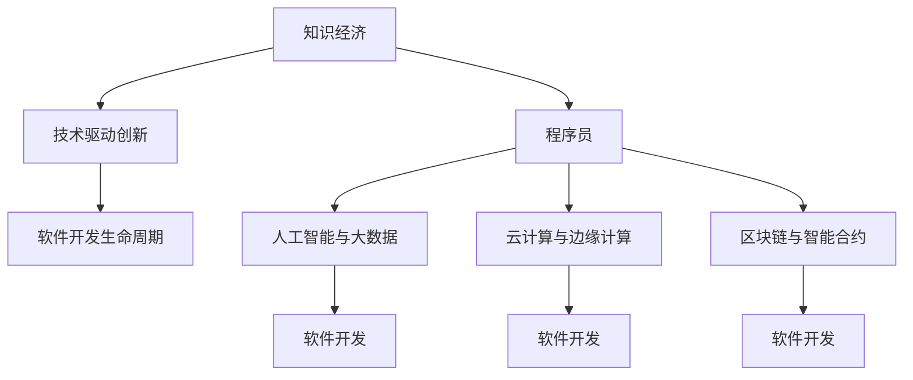

                 

## 1. 背景介绍

### 1.1 知识经济时代来临

随着信息技术的迅猛发展，全球已步入知识经济时代。在这个时代，人类社会的生产、生活方式发生了深刻变革。特别是计算机和互联网的普及，使得知识、信息得以快速传播和应用，加速了知识的经济价值实现。知识经济的到来，不仅对社会经济的增长模式、产业结构产生重大影响，也对人才培养和职业发展提出了新的要求。

### 1.2 程序员在知识经济中的角色

在知识经济时代，程序员作为信息技术的核心开发者和创新者，扮演着至关重要的角色。他们不仅需要掌握先进的编程技术和工具，还需具备创新思维和跨学科知识，以适应不断变化的市场需求和产业生态。程序员的职业发展，不再是简单的技术积累，而是成为复合型、高水平的人才。

### 1.3 知识经济对程序员职业发展的机遇

知识经济不仅带来了前所未有的机遇，也为程序员的职业发展提供了广阔的空间。下面将详细探讨知识经济下程序员的职业发展机遇，以及如何抓住这些机遇。

## 2. 核心概念与联系

### 2.1 核心概念概述

为了更好地理解知识经济对程序员职业发展的影响，本节将介绍几个核心概念及其联系：

- **知识经济（Knowledge Economy）**：以知识资源为核心，知识创造和应用成为经济增长主要动力的经济形态。
- **技术驱动创新（Technology-Driven Innovation）**：通过技术进步推动产品创新和市场竞争力的提升。
- **程序员（Software Developer）**：从事软件开发、编程和相关技术创新的专业技术人员。
- **软件开发生命周期（Software Development Life Cycle, SDLC）**：包括需求分析、设计、编码、测试、部署等阶段，程序员在此过程中扮演关键角色。
- **人工智能与大数据（Artificial Intelligence & Big Data）**：当前信息技术发展的前沿领域，与程序员职业发展紧密相关。
- **云计算与边缘计算（Cloud Computing & Edge Computing）**：为软件应用提供高效、灵活的基础设施，程序员需掌握相关技术。
- **区块链与智能合约（Blockchain & Smart Contracts）**：新兴的分布式计算技术，程序员需了解其应用场景和开发方法。

这些概念相互关联，共同构成了知识经济时代程序员职业发展的宏大背景。

### 2.2 核心概念原理和架构的 Mermaid 流程图



这个流程图展示了大环境与程序员职业发展的关联：知识经济为技术创新提供背景，程序员通过技术创新推动软件开发，而软件开发涉及多种新兴技术，需不断学习和适应。

## 3. 核心算法原理 & 具体操作步骤

### 3.1 算法原理概述

知识经济下，程序员的职业发展遵循以下核心算法原理：

1. **技术技能升级**：掌握最新的编程语言、框架、工具，提高开发效率和代码质量。
2. **跨领域知识融合**：结合计算机科学、数据科学、人工智能等领域知识，提升解决复杂问题的能力。
3. **敏捷开发与持续集成**：采用敏捷方法论和持续集成流程，提升团队协作和产品迭代速度。
4. **云原生架构**：熟悉云平台和服务架构，实现应用的灵活部署和扩展。
5. **区块链技术应用**：了解区块链原理及其在金融、供应链等领域的应用，探索创新型解决方案。

### 3.2 算法步骤详解

在具体实践这些算法原理时，程序员需遵循以下步骤：

1. **持续学习与自我更新**：保持对新技术的敏感度，通过在线课程、技术博客、社区交流等方式，不断补充新知识。
2. **参与开源项目**：加入开源社区，贡献代码，积累实战经验。
3. **项目实践**：通过真实项目锻炼技能，解决实际问题。
4. **经验分享**：在博客、技术分享会上分享项目经验和心得，建立个人品牌。
5. **职业规划**：明确职业目标，定期评估技能水平，制定提升计划。

### 3.3 算法优缺点

知识经济下程序员的职业发展算法，具备以下优点：

1. **提升技能竞争力**：持续学习和技术积累，使程序员在职业市场保持竞争力。
2. **促进跨学科协作**：掌握跨领域知识，有助于与不同背景的同事合作，推动项目成功。
3. **加速创新与创意**：结合新技术和新思维，推动产品和业务的创新。

同时，该算法也存在一些缺点：

1. **学习负担大**：新技术层出不穷，学习压力较大。
2. **技能迁移难度大**：不同技术领域间有较大鸿沟，迁移成本高。
3. **职业路径复杂**：新技术和新方法不断涌现，职业路径多样化，需进行战略规划。

### 3.4 算法应用领域

知识经济下，程序员的职业发展主要集中在以下几个领域：

1. **软件开发与维护**：从传统的Web、移动应用开发，到新兴的AI、IoT、区块链等技术应用，都是程序员的主战场。
2. **技术架构设计**：面向大规模、高性能的复杂系统，设计可扩展、可维护的架构。
3. **数据科学与大数据分析**：利用数据挖掘、机器学习等技术，提升业务洞察力和决策支持能力。
4. **人工智能与机器学习**：开发和优化AI模型，推动自动驾驶、智能客服、推荐系统等应用。
5. **云计算与边缘计算**：构建云原生应用，实现资源的弹性扩展和高效管理。
6. **区块链技术开发**：开发和部署区块链平台，探索智能合约、去中心化应用等创新应用。

## 4. 数学模型和公式 & 详细讲解 & 举例说明

### 4.1 数学模型构建

在知识经济下，程序员的职业发展模型可以抽象为一个动态演化的状态转移图，每个节点表示一个职业发展阶段，箭头表示可能的职业转型和提升路径。

模型中包含以下关键变量：

- **当前技能水平**：程序员在某一技术领域的掌握程度。
- **目标技能水平**：程序员希望达到的技能高度。
- **学习效率**：程序员学习新知识的速度和效率。
- **市场需求**：某一技能在当前市场的供需情况。

### 4.2 公式推导过程

基于上述模型变量，我们可以建立以下公式，推导程序员职业发展的动态演化：

$$
S_{t+1} = f(S_t, L_t, M_t)
$$

其中：

- $S_t$ 表示程序员在时间$t$的技能水平。
- $L_t$ 表示程序员在时间$t$的学习效率。
- $M_t$ 表示程序员在时间$t$的市场需求。
- $f$ 表示状态转移函数，表示技能水平在时间$t$向时间$t+1$的演化。

### 4.3 案例分析与讲解

以云计算平台为例，分析程序员如何在知识经济下通过职业发展模型提升自身竞争力。

1. **当前技能水平**：某程序员在传统Web开发领域有丰富经验。
2. **目标技能水平**：希望掌握云计算技术，成为云架构师。
3. **学习效率**：该程序员每周学习20小时，半年内掌握了AWS、Kubernetes等核心技术。
4. **市场需求**：云计算平台需求旺盛，薪资和职位空缺较高。

根据模型，该程序员的演化路径如下：

- **时间0**：掌握Web开发技能，市场需求高。
- **时间0.5**：开始学习云计算技术，学习效率高。
- **时间1**：掌握云计算核心技术，市场需求旺盛。
- **时间1.5**：晋升为云架构师，获得更高的薪资和职位。

## 5. 项目实践：代码实例和详细解释说明

### 5.1 开发环境搭建

在知识经济时代，程序员需掌握多种技术栈，以下是一个虚拟环境搭建示例：

1. **安装Python**：

```bash
sudo apt-get update
sudo apt-get install python3 python3-pip
```

2. **安装Docker**：

```bash
sudo apt-get install docker-ce docker-ce-cli containerd.io
sudo usermod -aG docker $USER
sudo reboot
```

3. **安装Git**：

```bash
sudo apt-get install git
```

4. **配置IDE**：

安装Visual Studio Code或PyCharm，并配置Git仓库。

### 5.2 源代码详细实现

以下是一个使用Django框架开发Web应用的基本代码示例：

```python
# 安装Django
pip install Django

# 创建Django项目
django-admin startproject myproject

# 创建Django应用
cd myproject
python manage.py startapp myapp

# 配置数据库
# settings.py
DATABASES = {
    'default': {
        'ENGINE': 'django.db.backends.sqlite3',
        'NAME': BASE_DIR / 'db.sqlite3',
    }
}

# 定义模型
# models.py
class MyModel(models.Model):
    name = models.CharField(max_length=200)
    description = models.TextField()

# 定义视图
# views.py
from django.shortcuts import render
from .models import MyModel

def index(request):
    models = MyModel.objects.all()
    return render(request, 'index.html', {'models': models})
```

### 5.3 代码解读与分析

代码示例展示了Django框架的基本使用方法。具体分析如下：

1. **项目初始化**：使用`django-admin`命令创建项目和应用。
2. **数据库配置**：在`settings.py`中配置数据库连接，使用SQLite数据库。
3. **模型定义**：在`models.py`中定义模型类，继承自`models.Model`。
4. **视图编写**：在`views.py`中定义视图函数，处理HTTP请求并返回渲染后的HTML页面。

通过这个示例，程序员可以了解如何使用Django框架快速构建Web应用，掌握前后端开发的基本技巧。

### 5.4 运行结果展示

运行代码后，可以在浏览器中访问`http://localhost:8000`，看到以下页面：

```html
<!DOCTYPE html>
<html>
<head>
    <meta charset="utf-8">
    <title>MyModel List</title>
</head>
<body>
    <h1>MyModel List</h1>
    <ul>
        
            <li>{{ model.name }} - {{ model.description }}</li>
        
    </ul>
</body>
</html>
```

结果展示了一组模型实例，用于数据展示和操作。

## 6. 实际应用场景

### 6.1 智能合约开发

智能合约是区块链技术的重要应用，程序员需掌握Solidity等智能合约语言，结合区块链开发框架，如Truffle或 Remix，构建和部署智能合约。

1. **项目准备**：安装Truffle或 Remix，创建智能合约项目。
2. **合约编写**：在solidity文件中编写智能合约，定义函数和事件。
3. **测试部署**：使用Truffle或 Remix编译合约，测试运行，部署到区块链网络。
4. **监控维护**：使用工具监控合约运行状态，及时进行故障处理。

### 6.2 数据科学与大数据分析

数据科学与大数据分析在知识经济中具有重要地位，程序员需掌握Python、R等数据科学工具，结合数据挖掘、机器学习等技术，实现数据驱动的决策支持。

1. **数据获取与清洗**：使用pandas、numpy等工具进行数据预处理。
2. **特征工程与模型训练**：使用scikit-learn等库进行特征选择、模型训练和评估。
3. **可视化与报告**：使用matplotlib、seaborn等工具进行数据可视化，编写分析报告。

### 6.3 边缘计算应用

边缘计算为传统计算架构带来新思路，程序员需掌握IoT设备和边缘计算框架，如AWS IoT、Azure IoT，实现设备互联和数据处理。

1. **设备接入**：使用MQTT等协议接入IoT设备，收集数据。
2. **数据处理**：在边缘计算设备上进行数据预处理和实时分析。
3. **云同步**：将边缘计算结果同步到云端，进行综合分析。

## 7. 工具和资源推荐

### 7.1 学习资源推荐

1. **Udacity**：提供大量编程课程，涵盖Python、Java、C++等主流编程语言。
2. **Coursera**：开设人工智能、数据科学等领域的高级课程。
3. **edX**：提供计算机科学、软件工程等领域的免费课程。
4. **Stack Overflow**：程序员社区，提供丰富的技术交流和问题解答资源。
5. **GitHub**：代码托管平台，大量开源项目和库可供参考。

### 7.2 开发工具推荐

1. **Visual Studio Code**：跨平台、功能强大的代码编辑器。
2. **PyCharm**：Python IDE，支持代码重构、调试等功能。
3. **Git**：版本控制工具，管理代码变更。
4. **JIRA**：项目管理工具，跟踪任务进度和问题解决。
5. **Docker**：容器化平台，简化应用部署和管理。

### 7.3 相关论文推荐

1. **深度学习在数据科学中的应用**：探讨深度学习如何提高数据科学的效率和准确性。
2. **区块链技术与智能合约**：介绍区块链原理和智能合约的开发方法。
3. **云计算与边缘计算**：分析云计算和边缘计算的区别与优势，探讨应用场景。

## 8. 总结：未来发展趋势与挑战

### 8.1 研究成果总结

知识经济下程序员的职业发展机遇，主要集中在技术技能升级、跨领域知识融合、敏捷开发与持续集成、云原生架构、区块链技术应用等方面。通过不断学习和实践，程序员可以在多个领域实现跨越式发展，成为复合型、高水平的技术人才。

### 8.2 未来发展趋势

知识经济下，程序员的职业发展将呈现以下趋势：

1. **持续学习与技术演进**：技术快速变化，程序员需不断学习新技术，适应新的技术框架。
2. **跨领域知识整合**：结合多种学科知识，提升问题解决能力。
3. **全球化协作**：互联网打破地域限制，程序员可以远程协作，参与全球项目。
4. **区块链与AI的融合**：区块链与人工智能的结合，将带来全新的应用场景。
5. **云原生架构的普及**：云平台和微服务架构的普及，将改变传统软件开发模式。

### 8.3 面临的挑战

知识经济下，程序员的职业发展面临以下挑战：

1. **技术更新速度**：新技术层出不穷，学习压力较大。
2. **跨领域知识迁移**：不同技术领域有较大鸿沟，迁移成本高。
3. **职业路径复杂**：新技术和新方法不断涌现，职业路径多样化，需进行战略规划。
4. **技能验证与认证**：新技术的引入，使得传统技能认证方式失效。
5. **创新与创业**：需具备创新思维和创业能力，才能在竞争激烈的市场中脱颖而出。

### 8.4 研究展望

未来的研究将集中在以下方向：

1. **智能与AI结合**：探讨人工智能在软件开发中的应用，提高开发效率和问题解决能力。
2. **跨领域协作**：加强与不同学科领域的协作，推动技术创新。
3. **开源生态建设**：推动开源社区的发展，实现技术共享和协同创新。
4. **区块链与分布式计算**：研究区块链与分布式计算技术的应用，提升系统可靠性和安全性。

总之，知识经济下程序员的职业发展机遇和挑战并存。通过不断学习、实践和创新，程序员可以在未来的技术浪潮中站稳脚跟，实现自身价值的最大化。

## 9. 附录：常见问题与解答

### Q1：知识经济对程序员有什么具体影响？

A: 知识经济对程序员有以下具体影响：
1. **技术要求提升**：技术快速迭代，程序员需不断学习新技术，提升自身技能。
2. **需求多样化**：跨领域知识融合，程序员需具备多种技能和思维方式。
3. **开发模式变革**：敏捷开发、持续集成等新开发模式，要求程序员高效协作。
4. **市场竞争激烈**：知识经济下，市场竞争加剧，程序员需具备创新能力和业务洞察力。

### Q2：程序员如何应对技术快速变化？

A: 程序员应对技术快速变化，需采取以下策略：
1. **持续学习**：通过在线课程、技术博客、社区交流等方式，不断补充新知识。
2. **项目实践**：通过参与实际项目，积累实战经验，掌握新技术。
3. **技术分享**：在博客、技术分享会上分享项目经验和心得，建立个人品牌。
4. **跨领域协作**：与不同领域的专业人士合作，拓宽知识面。

### Q3：程序员如何提升跨领域协作能力？

A: 程序员提升跨领域协作能力，需从以下方面入手：
1. **理解业务需求**：深入了解业务需求和行业背景，掌握业务术语。
2. **学习新知识**：学习其他领域的核心知识，如数据科学、人工智能等。
3. **沟通交流**：加强与业务团队和技术团队的沟通，形成共识。
4. **多学科协作**：组建多学科团队，共同解决复杂问题。

### Q4：程序员如何利用区块链技术提升业务价值？

A: 程序员利用区块链技术提升业务价值，需从以下方面入手：
1. **智能合约开发**：开发和部署智能合约，实现自动化、去中心化的业务流程。
2. **数据透明性**：利用区块链的透明性，提升数据管理和业务决策的透明度。
3. **去中心化应用**：探索去中心化应用，实现分布式计算和数据共享。
4. **安全与隐私**：保障数据安全和用户隐私，构建可信的业务环境。

### Q5：程序员如何实现云原生架构？

A: 程序员实现云原生架构，需从以下方面入手：
1. **容器化部署**：使用Docker等容器化技术，实现应用的可移植性和高可用性。
2. **微服务架构**：采用微服务架构，提升系统扩展性和灵活性。
3. **DevOps实践**：引入DevOps文化，实现持续集成和持续部署。
4. **云平台管理**：熟练掌握云平台工具，如Kubernetes、AWS等，进行资源管理和应用部署。

---

作者：禅与计算机程序设计艺术 / Zen and the Art of Computer Programming

