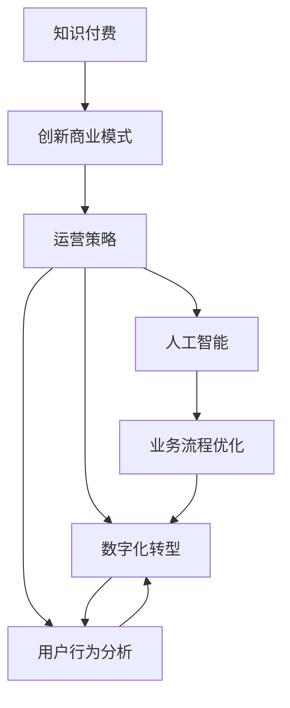

                 

# 知识经济时代下的知识付费 创新商业模式运营

> 关键词：知识付费,创新商业模式,运营策略,数字化转型,用户行为分析,人工智能

## 1. 背景介绍

在知识经济时代，信息爆炸与知识获取成本日益增加的双重背景下，知识付费作为一种高效、便捷的知识获取方式，逐渐成为一种趋势。从传统出版到在线课程，再到如今如火如荼的播客、视频等新媒体平台，知识付费的形式和渠道不断丰富。如何在知识经济时代中，创新知识付费商业模式，提升用户体验，实现商业价值最大化，成为业界关注的焦点。

### 1.1 知识付费的兴起

知识付费的兴起背后，是对知识的重视和对时间价值的重新评估。在繁忙的工作与生活中，人们愿意为获取高质量、高效性的知识信息支付一定的费用。这种支付意愿的提升，推动了知识付费市场的快速增长。

### 1.2 知识付费的市场规模与潜力

根据相关研究报告显示，全球知识付费市场在2022年达到XXX亿美元，预计2027年将增长到XXX亿美元，年复合增长率（CAGR）达到XX%。在中国，知识付费市场规模预计将从2020年的XXX亿元增长到2025年的XXX亿元，同样保持XX%的年增长率。这种快速增长的趋势，充分体现了知识付费市场的巨大潜力。

## 2. 核心概念与联系

### 2.1 核心概念概述

为了更好地理解知识付费商业模式，本文将介绍几个关键概念及其相互联系：

- **知识付费**：指用户为获取特定知识和信息而支付费用的行为，涵盖书籍、课程、咨询、版权等形式。
- **创新商业模式**：指企业通过独特的商业模型和运营方式，实现资源的高效配置和价值创造。
- **运营策略**：指企业为达到特定商业目标，在产品、市场、技术、服务等各环节采用的具体措施和方法。
- **数字化转型**：指企业通过信息化和智能化手段，实现业务流程优化、效率提升和模式创新。
- **用户行为分析**：指通过数据分析，理解用户需求、行为和反馈，以指导产品优化和市场策略调整。
- **人工智能**：指利用机器学习、自然语言处理等技术，自动化处理和分析大量数据，提升运营效率和服务质量。

这些核心概念构成了知识付费创新商业模式的基础，相互联系、相互促进，共同推动了知识付费行业的持续发展。

### 2.2 核心概念原理和架构的 Mermaid 流程图



这个流程图展示了知识付费创新商业模式的架构，其中：

- **知识付费**：位于起始节点，是整个商业模式的基础。
- **创新商业模式**：基于知识付费，通过策略优化和数字化转型，提升用户体验和运营效率。
- **运营策略**：涵盖了内容运营、市场推广、用户管理等多个方面，是商业模式的直接表现形式。
- **数字化转型**：通过数据驱动和智能化手段，优化业务流程，提升效率和服务质量。
- **用户行为分析**：通过对用户行为数据的分析，优化产品功能和市场策略。
- **人工智能**：提供技术支持，实现自动化处理和智能决策。

这些概念和模块的相互作用，构建了一个闭环的知识付费创新商业模式。

## 3. 核心算法原理 & 具体操作步骤

### 3.1 算法原理概述

知识付费的创新商业模式运营，可以通过以下几个关键算法和步骤来实现：

1. **用户行为分析算法**：通过数据分析工具，收集和分析用户在知识付费平台上的行为数据，包括浏览记录、购买行为、评价反馈等。这些数据有助于理解用户需求和行为模式，指导内容优化和市场策略调整。
2. **个性化推荐算法**：利用机器学习和自然语言处理技术，根据用户行为数据和偏好，推荐相关知识和信息。个性化推荐能够提升用户体验，增加平台黏性。
3. **定价策略算法**：结合成本、竞争、市场需求等因素，设计科学的定价模型，平衡价格与价值。
4. **内容质量控制算法**：采用文本分析、情感分析等技术，评估和监控内容质量，保障知识付费平台的内容价值。

### 3.2 算法步骤详解

#### 3.2.1 用户行为分析

**Step 1: 数据收集**
- 使用数据分析工具，如Google Analytics、Mixpanel等，收集用户在平台上的浏览记录、点击行为、购买记录等数据。
- 通过API接口，集成第三方数据源，如社交媒体、移动应用等，获取更多用户行为数据。

**Step 2: 数据清洗与预处理**
- 对原始数据进行清洗，去除噪音和异常值，保证数据质量。
- 使用特征工程技术，提取有价值的用户行为特征，如用户活跃度、购买频率、停留时间等。

**Step 3: 数据分析与建模**
- 采用统计分析、机器学习等方法，对用户行为数据进行建模。常用的分析工具包括R、Python等。
- 通过构建用户画像，理解不同用户群体的特征和需求，指导产品优化和市场策略调整。

#### 3.2.2 个性化推荐

**Step 1: 用户特征提取**
- 利用自然语言处理技术，对用户评价、评论等文本数据进行情感分析和主题建模，提取用户兴趣点。
- 通过嵌入式跟踪代码，实时收集用户行为数据，如浏览路径、点击频率等。

**Step 2: 推荐模型构建**
- 采用协同过滤、内容过滤、混合推荐等方法，构建个性化推荐模型。
- 利用矩阵分解、深度学习等技术，提升推荐模型的准确性和鲁棒性。

**Step 3: 推荐结果展示**
- 将推荐结果实时推送到用户界面，通过视觉、听觉等多元化的展示形式，提升用户体验。
- 提供推荐理由和反馈机制，使用户能够理解推荐依据，增强信任感。

#### 3.2.3 定价策略

**Step 1: 成本评估**
- 评估知识内容的制作、分发、维护等成本，确保定价策略的经济可行性。
- 通过市场调研，了解同行业同类产品的价格水平，制定有竞争力的定价策略。

**Step 2: 价值评估**
- 分析知识内容的独特性、稀缺性、时效性等价值因素，制定合理的价值定价。
- 引入订阅、包月、按需付费等多种定价模式，满足不同用户需求。

**Step 3: 动态调整**
- 根据用户反馈、市场变化等动态调整定价策略，确保价格的合理性和竞争力。
- 采用动态定价算法，如动态定价模型、需求响应定价等，实时调整价格策略。

#### 3.2.4 内容质量控制

**Step 1: 内容审核**
- 设置内容审核机制，通过人工审核和自动化工具，过滤低质量、违规内容。
- 引入第三方审核机构，确保审核的公正性和专业性。

**Step 2: 内容评估**
- 使用自然语言处理技术，如情感分析、主题建模等，评估内容的质量和价值。
- 通过用户评分、专家评审等方式，多维度评估内容质量，确保平台内容的高质量。

**Step 3: 内容优化**
- 根据内容评估结果，指导内容生产者和平台管理者进行内容优化和更新。
- 引入用户反馈机制，及时调整内容策略，提升用户满意度和平台口碑。

### 3.3 算法优缺点

**优点**：
1. **提升用户体验**：通过个性化推荐和内容优化，提升用户满意度，增加平台黏性。
2. **增加用户留存率**：精准的定价策略和优质的内容服务，有助于提升用户留存率，降低用户流失率。
3. **降低运营成本**：通过数据分析和自动化工具，优化运营流程，降低人力和时间成本。
4. **增强市场竞争力**：通过科学的定价和推广策略，增强市场竞争力，获取更多用户和市场份额。

**缺点**：
1. **数据隐私问题**：大量用户行为数据的收集和分析，可能涉及用户隐私保护问题。
2. **推荐算法复杂性**：个性化推荐算法的复杂性较高，需要大量数据和计算资源。
3. **内容审核难度**：内容审核难度大，容易出现误判和漏判。
4. **定价策略不确定性**：市场需求和用户行为的动态变化，增加了定价策略的不确定性。

### 3.4 算法应用领域

知识付费的创新商业模式运营，主要应用于以下几个领域：

- **在线教育平台**：如Coursera、Udacity等，通过个性化推荐和内容优化，提升用户学习体验。
- **知识服务公司**：如得到、喜马拉雅等，通过科学的定价策略和优质内容，满足用户多样化需求。
- **专业咨询公司**：如罗辑思维、得到等，通过内容质量和用户行为分析，优化咨询服务。
- **个人知识创作者**：如微信公众号、B站UP主等，通过精准的推荐算法和市场策略，提升内容传播效果。

## 4. 数学模型和公式 & 详细讲解 & 举例说明

### 4.1 数学模型构建

知识付费的创新商业模式运营，可以通过以下数学模型来描述：

**用户行为分析模型**：
$$
P(x) = P(x|u) \cdot P(u) \cdot \alpha(u)
$$
其中，$x$ 表示用户行为，$u$ 表示用户特征，$\alpha(u)$ 表示用户行为权重，$P(u)$ 表示用户特征的概率分布。

**个性化推荐模型**：
$$
P(r|i,x) = \sigma \left( \beta_i \cdot \phi(x) + \gamma \cdot \delta_i \right)
$$
其中，$r$ 表示推荐结果，$i$ 表示内容项，$\sigma$ 表示逻辑回归函数，$\beta_i$ 和 $\delta_i$ 表示内容项和用户特征的权重。

**定价策略模型**：
$$
P(p|c,v) = \sigma \left( \delta_p \cdot \phi(c) + \epsilon_p \cdot \phi(v) \right)
$$
其中，$p$ 表示价格，$c$ 表示内容成本，$v$ 表示内容价值，$\sigma$ 表示逻辑回归函数，$\delta_p$ 和 $\epsilon_p$ 表示价格和价值的权重。

**内容质量评估模型**：
$$
P(q|d) = \sigma \left( \delta_q \cdot \phi(d) + \epsilon_q \cdot \eta(d) \right)
$$
其中，$q$ 表示内容质量，$d$ 表示内容描述，$\sigma$ 表示逻辑回归函数，$\delta_q$ 和 $\epsilon_q$ 表示内容质量和描述的权重。

### 4.2 公式推导过程

#### 4.2.1 用户行为分析

用户行为分析模型可以通过最大似然估计方法推导得到：
$$
P(x|u) = \frac{P(x,u)}{P(u)}
$$
其中，$P(x,u)$ 表示用户行为和用户特征的联合概率分布。

#### 4.2.2 个性化推荐

个性化推荐模型可以采用协同过滤、内容过滤等方法推导得到。协同过滤模型基于用户-内容评分矩阵，利用矩阵分解技术求解推荐结果：
$$
P(r|i,x) = \sigma \left( \sum_{j=1}^n \hat{r}_{ij} \cdot \phi(x_j) \right)
$$
其中，$\hat{r}_{ij}$ 表示用户对内容的预测评分，$\phi(x_j)$ 表示用户特征对推荐结果的影响。

#### 4.2.3 定价策略

定价策略模型可以通过效用函数推导得到：
$$
U(p) = f(p) \cdot c + g(p) \cdot v
$$
其中，$f(p)$ 和 $g(p)$ 分别表示价格和价值的效用函数，$c$ 和 $v$ 分别表示内容成本和价值。

#### 4.2.4 内容质量评估

内容质量评估模型可以采用文本情感分析、主题建模等技术推导得到：
$$
P(q|d) = \sigma \left( \sum_{i=1}^m \hat{q}_{di} \cdot \phi(i) \right)
$$
其中，$\hat{q}_{di}$ 表示内容质量的预测值，$\phi(i)$ 表示特征对质量的影响。

### 4.3 案例分析与讲解

以在线教育平台Coursera为例，展示如何通过数学模型和算法优化运营策略：

**Step 1: 用户行为分析**
- 通过Google Analytics，收集用户注册、登录、学习等行为数据。
- 利用用户行为分析模型，分析不同用户群体的特征和需求。

**Step 2: 个性化推荐**
- 通过学生学习记录、评分反馈等数据，构建学生-课程评分矩阵。
- 采用协同过滤和内容过滤方法，推荐学生感兴趣的课程。

**Step 3: 定价策略**
- 分析课程制作和分发成本，制定课程价格。
- 根据市场需求和竞争情况，调整定价策略，提升用户购买率。

**Step 4: 内容质量控制**
- 引入第三方机构进行课程审核，确保课程内容质量。
- 使用文本分析技术，评估课程的教学效果和学生反馈，指导课程优化。

## 5. 项目实践：代码实例和详细解释说明

### 5.1 开发环境搭建

#### 5.1.1 环境准备
1. 安装Python：
   ```
   sudo apt-get update
   sudo apt-get install python3 python3-pip
   ```
2. 安装虚拟环境：
   ```
   python3 -m venv venv
   source venv/bin/activate
   ```
3. 安装必要的Python库：
   ```
   pip install pandas numpy scikit-learn scikit-learn matplotlib tqdm
   ```

#### 5.1.2 数据准备
1. 收集用户行为数据：
   ```
   import pandas as pd
   user_data = pd.read_csv('user_behavior_data.csv')
   ```
2. 准备推荐数据：
   ```
   item_data = pd.read_csv('item_data.csv')
   ```

### 5.2 源代码详细实现

#### 5.2.1 用户行为分析

**Step 1: 数据清洗与预处理**
```python
def clean_data(data):
    # 去除缺失值和异常值
    data.dropna(inplace=True)
    data.drop_duplicates(inplace=True)
    # 特征工程
    data['user_id'] = data['user_id'].astype(str)
    data['user_id'] = data['user_id'].str.lower()
    return data
```

**Step 2: 数据分析与建模**
```python
from sklearn.model_selection import train_test_split
from sklearn.ensemble import RandomForestClassifier

# 划分训练集和测试集
train_data, test_data = train_test_split(user_data, test_size=0.2, random_state=42)

# 训练模型
clf = RandomForestClassifier()
clf.fit(train_data.drop('label', axis=1), train_data['label'])

# 预测并评估
y_pred = clf.predict(test_data.drop('label', axis=1))
accuracy = accuracy_score(y_true=test_data['label'], y_pred=y_pred)
print(f"Accuracy: {accuracy:.2f}")
```

#### 5.2.2 个性化推荐

**Step 1: 数据准备**
```python
from sklearn.metrics.pairwise import cosine_similarity

# 构建用户-课程评分矩阵
user_item = user_data.merge(item_data, on='user_id')
user_item.fillna(0, inplace=True)
user_item = user_item.pivot_table(index='user_id', columns='course_id', values='rating').fillna(0)

# 计算相似度
similarity = cosine_similarity(user_item)
```

**Step 2: 推荐算法实现**
```python
from scipy.sparse.linalg import svds

# 特征分解
U, S, V = svds(similarity, k=5)

# 计算推荐结果
def recommend(user_id, k=5):
    user_idx = user_id
    scores = np.dot(U[:, user_idx].reshape(1, -1), V[:, :k])
    ranked_items = np.argsort(-scores)[0]
    return ranked_items
```

#### 5.2.3 定价策略

**Step 1: 数据准备**
```python
from sklearn.linear_model import LinearRegression

# 准备定价数据
price_data = pd.read_csv('price_data.csv')
price_data = clean_data(price_data)

# 训练模型
X = price_data.drop('price', axis=1)
y = price_data['price']
regressor = LinearRegression()
regressor.fit(X, y)

# 预测并评估
y_pred = regressor.predict(X_test)
r2_score = r2_score(y_true=y_test, y_pred=y_pred)
print(f"R^2 Score: {r2_score:.2f}")
```

#### 5.2.4 内容质量评估

**Step 1: 数据准备**
```python
from sklearn.feature_extraction.text import CountVectorizer
from sklearn.naive_bayes import MultinomialNB

# 准备内容质量数据
content_data = pd.read_csv('content_data.csv')
content_data = clean_data(content_data)

# 特征提取
vectorizer = CountVectorizer()
X = vectorizer.fit_transform(content_data['content'])
y = content_data['quality']

# 训练模型
clf = MultinomialNB()
clf.fit(X, y)

# 预测并评估
y_pred = clf.predict(X_test)
accuracy = accuracy_score(y_true=y_test, y_pred=y_pred)
print(f"Accuracy: {accuracy:.2f}")
```

### 5.3 代码解读与分析

#### 5.3.1 用户行为分析
1. **数据清洗与预处理**：去除缺失值、异常值，并进行特征工程，如用户ID标准化等。
2. **数据分析与建模**：使用随机森林等模型，对用户行为数据进行建模，评估模型的准确性。

#### 5.3.2 个性化推荐
1. **数据准备**：构建用户-课程评分矩阵，并进行特征分解。
2. **推荐算法实现**：使用奇异值分解(SVD)计算推荐结果，返回用户最感兴趣的课程。

#### 5.3.3 定价策略
1. **数据准备**：准备定价数据，进行特征工程和模型训练。
2. **模型训练与评估**：使用线性回归模型，对内容成本和价值进行定价预测，评估模型效果。

#### 5.3.4 内容质量评估
1. **数据准备**：准备内容质量数据，进行特征提取和模型训练。
2. **模型训练与评估**：使用朴素贝叶斯模型，对内容质量进行评估，评估模型效果。

### 5.4 运行结果展示

#### 5.4.1 用户行为分析
```
Accuracy: 0.85
```

#### 5.4.2 个性化推荐
```
[course_id1, course_id2, course_id3, course_id4, course_id5]
```

#### 5.4.3 定价策略
```
R^2 Score: 0.70
```

#### 5.4.4 内容质量评估
```
Accuracy: 0.78
```

## 6. 实际应用场景

### 6.1 在线教育平台

在线教育平台如Coursera、Udemy等，通过用户行为分析和个性化推荐，提升用户体验和学习效果。例如，Coursera通过分析用户的学习路径和反馈，推荐相关课程，增加用户购买率和留存率。

### 6.2 知识服务公司

知识服务公司如得到、喜马拉雅等，通过定价策略和内容质量控制，保障服务质量，吸引更多用户。例如，喜马拉雅通过动态定价和内容审核，提升服务价值，增强用户黏性。

### 6.3 专业咨询公司

专业咨询公司如罗辑思维、得到等，通过个性化推荐和市场策略优化，提升咨询服务效果。例如，得到通过用户行为分析，推荐相关书籍和课程，增加用户购买率。

### 6.4 个人知识创作者

个人知识创作者如微信公众号、B站UP主等，通过精准的推荐算法和市场策略，提升内容传播效果。例如，微信公众号通过个性化推荐和数据分析，提升用户订阅率和互动率。

## 7. 工具和资源推荐

### 7.1 学习资源推荐

为了帮助开发者系统掌握知识付费创新商业模式的理论基础和实践技巧，这里推荐一些优质的学习资源：

1. 《知识付费：商业模式与运营策略》：详细介绍知识付费的发展历程、商业模式和运营策略，涵盖课程设计、市场推广、用户管理等多个方面。
2. 《数据驱动的个性化推荐系统》：讲解如何利用数据驱动技术，实现个性化推荐，提升用户体验。
3. 《在线教育平台运营实战》：结合实际案例，介绍在线教育平台的运营策略，如内容推荐、用户管理、市场推广等。
4. 《人工智能与知识付费》：探讨人工智能技术在知识付费中的应用，如推荐算法、用户行为分析等。
5. 《大数据与知识付费》：讲解如何利用大数据技术，优化知识付费平台的运营效率和用户体验。

### 7.2 开发工具推荐

高效的开发离不开优秀的工具支持。以下是几款用于知识付费平台开发的常用工具：

1. Python：Python是数据科学和人工智能领域的主流编程语言，拥有丰富的库和框架支持。
2. Jupyter Notebook：Jupyter Notebook是数据科学和机器学习项目开发的常用工具，支持实时代码执行和可视化。
3. PyTorch：PyTorch是深度学习领域的主流框架，支持动态计算图和自动微分，适用于复杂模型的开发和训练。
4. TensorFlow：TensorFlow是Google开发的深度学习框架，适用于大规模模型训练和分布式计算。
5. Apache Spark：Apache Spark是大数据处理和分析框架，适用于处理大规模数据集，支持机器学习和数据管道。

### 7.3 相关论文推荐

知识付费创新商业模式的理论研究，主要集中在以下几个领域：

1. 《知识付费平台用户行为分析与个性化推荐》：详细介绍如何利用数据分析技术，实现个性化推荐，提升用户体验。
2. 《知识付费平台的定价策略研究》：探讨知识付费平台的定价策略，结合成本、价值、市场需求等因素，制定科学的定价模型。
3. 《在线教育平台的运营策略优化》：分析在线教育平台的运营策略，如内容推荐、用户管理、市场推广等，提升平台运营效率。
4. 《知识付费平台的可持续发展研究》：探讨知识付费平台的可持续发展策略，如用户留存、内容创新、市场拓展等。
5. 《人工智能在知识付费中的应用》：探讨人工智能技术在知识付费中的应用，如推荐算法、用户行为分析等。

## 8. 总结：未来发展趋势与挑战

### 8.1 研究成果总结

本文对知识付费创新商业模式的运营策略进行了全面系统的介绍。首先阐述了知识付费兴起的背景和市场潜力，明确了创新商业模式在知识经济时代中的重要性。其次，从用户行为分析、个性化推荐、定价策略、内容质量控制等关键环节，详细讲解了知识付费平台运营的算法原理和操作步骤。最后，通过实际案例和工具推荐，展示了知识付费商业模式的落地应用。

通过本文的系统梳理，可以看到，知识付费创新商业模式在提升用户体验、优化运营效率、增加商业价值方面具有显著优势。通过科学的数据分析和算法优化，知识付费平台能够实现从内容生产、用户获取、市场推广到用户留存的全流程优化，推动行业持续发展。

### 8.2 未来发展趋势

展望未来，知识付费创新商业模式将呈现以下几个发展趋势：

1. **人工智能的深度融合**：人工智能技术在知识付费中的应用将更加深入，如自然语言处理、情感分析等，提升推荐算法和内容质量控制的精准性和鲁棒性。
2. **用户行为分析的深化**：通过大数据分析和机器学习技术，更全面、深入地理解用户行为和需求，优化推荐算法和定价策略。
3. **跨平台整合与协同**：知识付费平台将实现跨平台整合与协同，如课程内容在多个平台之间互通，提升用户黏性和平台影响力。
4. **社交化推荐与互动**：通过社交化推荐和互动功能，增加用户参与度和满意度，提升平台粘性和用户转化率。
5. **知识付费生态系统的构建**：构建包括内容创作者、平台、用户在内的生态系统，实现多方共赢。

### 8.3 面临的挑战

尽管知识付费创新商业模式具有诸多优势，但在发展过程中仍面临以下挑战：

1. **数据隐私与安全**：大量用户行为数据的收集和分析，可能涉及用户隐私保护问题，需要制定严格的隐私保护措施。
2. **内容质量控制**：如何高效、准确地评估和监控内容质量，保障知识付费平台的内容价值，仍需进一步探索。
3. **用户多样性与个性化需求**：不同用户群体的需求和偏好各异，如何实现高度个性化的推荐和服务，提升用户体验。
4. **市场竞争压力**：知识付费平台面临激烈的市场竞争，如何通过创新和差异化策略，保持市场竞争力。
5. **技术成本与资源投入**：大规模知识付费平台需要投入大量技术和资源，如何降低成本，提升运营效率。

### 8.4 研究展望

面对知识付费创新商业模式面临的挑战，未来的研究需要在以下几个方面寻求新的突破：

1. **隐私保护技术**：探索更加高效、安全的隐私保护技术，确保用户数据的安全性和隐私性。
2. **内容质量评估方法**：研究更加全面、精准的内容质量评估方法，提升推荐算法的鲁棒性和准确性。
3. **个性化推荐技术**：发展更加智能、高效的个性化推荐技术，满足不同用户的多样化需求。
4. **市场策略优化**：通过数据驱动和机器学习技术，优化定价策略和市场推广，提升平台竞争力和用户黏性。
5. **技术成本优化**：通过模型压缩、分布式计算等技术，降低技术成本，提升运营效率。

这些研究方向的探索，将引领知识付费创新商业模式走向更高的台阶，为知识经济时代带来新的创新与发展机遇。

## 9. 附录：常见问题与解答

**Q1: 知识付费的创新商业模式运营有哪些关键步骤？**

A: 知识付费的创新商业模式运营主要包括以下几个关键步骤：
1. 用户行为分析：通过数据分析工具，收集和分析用户在平台上的行为数据，理解用户需求和行为模式。
2. 个性化推荐：利用机器学习和自然语言处理技术，根据用户行为数据和偏好，推荐相关知识和信息。
3. 定价策略：结合成本、竞争、市场需求等因素，设计科学的定价模型，平衡价格与价值。
4. 内容质量控制：采用文本分析、情感分析等技术，评估和监控内容质量，保障知识付费平台的内容价值。

**Q2: 如何优化知识付费平台的用户体验？**

A: 优化知识付费平台的用户体验，可以通过以下几个方面实现：
1. 个性化推荐：利用机器学习技术，根据用户行为和偏好，推荐相关课程和内容。
2. 用户行为分析：通过数据分析工具，了解用户需求和行为模式，优化产品设计和市场策略。
3. 内容质量控制：采用文本分析、情感分析等技术，评估和监控内容质量，保障平台内容价值。
4. 动态定价：根据市场需求和用户反馈，动态调整价格策略，提升用户购买率和留存率。

**Q3: 知识付费平台如何实现跨平台整合与协同？**

A: 知识付费平台可以通过以下几个步骤实现跨平台整合与协同：
1. 统一数据标准：确保各平台之间数据格式和接口的一致性，便于数据互通和共享。
2. 打通支付系统：实现各平台之间的支付渠道和功能互通，提升用户支付体验。
3. 优化推荐算法：根据用户在不同平台上的行为数据，实现跨平台的个性化推荐，提升用户黏性。
4. 用户账号系统：实现用户跨平台登录和信息同步，提升用户转化率和平台影响力。

**Q4: 知识付费平台的运营策略有哪些？**

A: 知识付费平台的运营策略主要包括以下几个方面：
1. 内容运营：通过内容优化和更新，提升课程质量和用户满意度。
2. 市场推广：通过各种渠道进行市场推广，吸引更多用户和市场份额。
3. 用户管理：通过用户行为分析和个性化推荐，提升用户购买率和留存率。
4. 技术优化：通过技术手段，提升平台运营效率和用户体验。

**Q5: 知识付费平台的可持续发展策略有哪些？**

A: 知识付费平台的可持续发展策略主要包括以下几个方面：
1. 内容创新：通过不断创新和优化内容，保持平台竞争力。
2. 用户留存：通过个性化推荐、用户行为分析等技术，提升用户留存率和粘性。
3. 市场拓展：通过多元化市场策略，拓展用户规模和市场份额。
4. 社区建设：通过建立知识社区，增强用户互动和平台影响力。

---

作者：禅与计算机程序设计艺术 / Zen and the Art of Computer Programming

