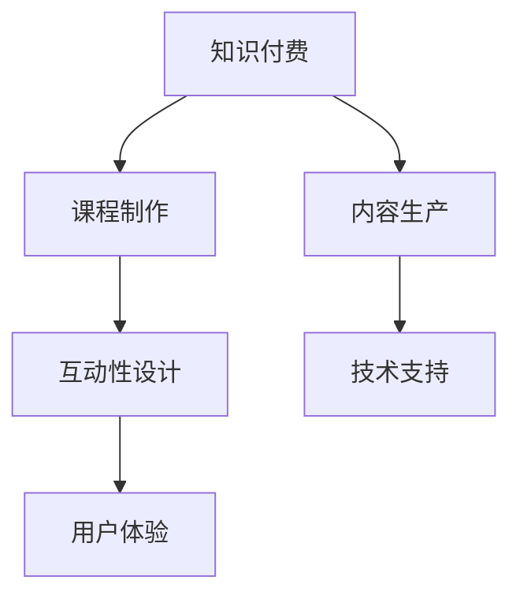

                 

# 知识经济时代下的知识付费创新课程制作与内容生产

## 1. 背景介绍

### 1.1 问题由来

随着知识经济时代的到来，知识付费正成为一种重要的学习和知识传播方式。传统的教育模式和知识获取方式正在被以在线教育、数字课程、短视频等新型形式所取代。知识付费不仅帮助人们高效获取知识，还能够促进知识的深度整合和应用，形成更具竞争力的个人和组织能力。

但传统知识付费产品的同质化和质量参差不齐问题也逐渐凸显，用户需求得不到满足，学习效果也不理想。如何通过创新课程制作与内容生产，提升知识付费产品的质量，成为当前知识付费市场亟待解决的关键问题。

### 1.2 问题核心关键点

知识付费课程的制作与内容生产主要围绕以下几个核心关键点：
- 课程内容的设计：如何设计系统性、互动性强且符合用户需求的知识内容。
- 课程形式的选择：如短视频、图文、音频、直播等多种形式，如何有效结合。
- 用户体验的优化：如课程界面设计、互动性、学习路径设计等，提升用户体验。
- 技术手段的应用：如自动化视频制作、智能推荐、AI辅助评估等，提高生产效率。
- 学习效果的量化评估：如何通过学习效果评估模型，指导内容优化和用户反馈。

本文将深入探讨如何通过创新课程制作与内容生产，实现知识付费产品的高质量发展，提升用户满意度和学习效果。

## 2. 核心概念与联系

### 2.1 核心概念概述

为更好地理解知识付费课程制作与内容生产的核心概念，本节将介绍几个密切相关的核心概念：

- 知识付费：指通过在线课程、电子书、咨询服务等形式，向用户提供专业知识或技能的付费服务。它是一种新的知识传播和获取方式，满足了用户对个性化、深入学习的需求。

- 课程制作：指根据学习目标和用户需求，设计、制作和呈现知识内容的过程。课程制作需要考虑课程内容的选择、结构安排、教学方法等。

- 内容生产：指创作、整合、优化课程内容的过程，包括素材收集、视频制作、音频编辑、图文排版等。

- 互动性设计：指课程中设计的各种互动环节，如提问、讨论、测验等，提升用户参与度和学习效果。

- 技术支持：指利用现代信息技术，如自动生成、智能推荐、AI分析等，提高课程生产效率和个性化推荐精准度。

- 用户体验：指课程界面设计、导航、学习路径、反馈机制等，提升用户使用体验和学习效率。

这些核心概念之间的逻辑关系可以通过以下Mermaid流程图来展示：



这个流程图展示出知识付费产品制作的基本流程：

1. 从知识付费整体出发，进行课程设计和内容生产。
2. 通过互动性设计增强课程参与度。
3. 应用技术手段提高生产效率和个性化推荐。
4. 最终形成符合用户需求和体验的学习产品。

## 3. 核心算法原理 & 具体操作步骤
### 3.1 算法原理概述

知识付费创新课程制作与内容生产，本质上是一种系统化的知识内容设计和优化过程。其核心思想是：根据学习目标和用户需求，设计系统化、结构化的课程内容，通过多种形式和技术的结合，提升学习效果和用户体验。

形式化地，假设知识付费产品的目标用户群体为 $U$，课程内容为 $C$，课程形式为 $F$，技术手段为 $T$。知识付费产品的优化目标是最小化用户满意度和学习效果损失，即找到最优组合 $(U, C, F, T)$：

$$
(U^*, C^*, F^*, T^*) = \mathop{\arg\min}_{U, C, F, T} \sum_{u \in U} L(u, C, F, T)
$$

其中 $L(u, C, F, T)$ 为基于用户 $u$ 的课程满意度和学习效果损失函数。通过最小化该函数，可以提升整体课程的质量和用户的满意度。

### 3.2 算法步骤详解

知识付费课程的制作与内容生产，一般包括以下几个关键步骤：

**Step 1: 确定目标用户群体**

首先，需要对知识付费产品的目标用户群体进行详细分析。了解用户的学习需求、兴趣、时间安排等，以便设计符合用户期望的课程内容。

**Step 2: 设计课程内容**

根据目标用户群体的需求和特点，设计系统化、结构化的课程内容。课程内容应涵盖学习目标、重点难点、实际应用等，尽可能提供丰富的学习资源和互动环节。

**Step 3: 选择课程形式**

课程形式应多样，如视频、图文、音频、直播等，根据用户偏好和学习习惯进行合理选择。可以通过调研和反馈，不断优化课程形式，提升学习效果。

**Step 4: 应用技术手段**

利用现代信息技术，如自动生成视频、智能推荐、AI辅助评估等，提升课程生产效率和个性化推荐精准度。技术手段的应用，有助于实现内容的个性化、智能化和互动性。

**Step 5: 提升用户体验**

通过优秀的界面设计、导航、互动环节、反馈机制等，提升用户的学习体验和满意度。用户体验的优化，是知识付费产品成功的关键。

**Step 6: 量化评估学习效果**

通过学习效果评估模型，对课程进行量化评估，指导内容优化和用户反馈。评估模型的设计，需要考虑用户的完成度、学习进度、答题正确率等指标。

**Step 7: 持续迭代改进**

根据学习效果评估和用户反馈，持续迭代和改进课程内容、形式和技术手段，提升整体课程的质量和用户的满意度。

以上是知识付费课程制作与内容生产的一般流程。在实际应用中，还需要根据具体任务的特点，对各个环节进行优化设计，如改进评估模型，引入更多的技术手段等，以进一步提升课程质量。

### 3.3 算法优缺点

知识付费创新课程制作与内容生产，具有以下优点：

1. 提升学习效果：通过系统化、结构化的课程设计和多种形式的结合，能够显著提升用户的知识获取和应用能力。
2. 提升用户体验：通过优化课程界面、互动性设计等，提升用户的学习体验和满意度。
3. 提升生产效率：通过应用技术手段，如自动生成视频、智能推荐等，提高课程生产效率和个性化推荐精准度。
4. 降低成本：技术手段的应用，可以降低人力和时间成本，提高课程生产的效率和效益。

同时，该方法也存在一定的局限性：

1. 依赖用户反馈：课程制作和优化需要大量用户反馈，获取高质量反馈的成本较高。
2. 课程形式多样：不同的课程形式需要不同的制作和编辑技术，增加制作难度。
3. 内容质量要求高：课程内容的质量和准确性直接影响用户的学习效果，制作难度较大。
4. 用户体验复杂：优秀的用户体验需要复杂的交互设计和多轮迭代，增加制作和优化成本。

尽管存在这些局限性，但就目前而言，知识付费创新课程制作与内容生产是知识付费产品高质量发展的核心路径。未来相关研究的重点在于如何进一步降低课程制作对用户反馈的依赖，提高课程形式的灵活性和个性化，同时兼顾内容质量和技术手段的有效应用。

### 3.4 算法应用领域

知识付费创新课程制作与内容生产，在知识经济时代的应用非常广泛，例如：

- 在线教育平台：如Coursera、Udemy、慕课网等，通过课程制作与内容生产，提供高质量的在线课程。
- 企业培训：企业内部培训课程的设计和制作，帮助员工提升技能和知识水平。
- 行业认证：如IT行业的技术认证课程，通过课程制作与内容生产，帮助考生准备认证考试。
- 个性化学习：通过用户行为数据的分析，设计个性化学习路径和课程内容，提高学习效果。
- 智能推荐系统：通过学习效果评估模型的反馈，不断优化课程推荐算法，提升用户的学习体验。

除了上述这些应用外，知识付费创新课程制作与内容生产还被创新性地应用到更多场景中，如智能问答、知识图谱、知识管理等，为知识传播和获取带来新的突破。

## 4. 数学模型和公式 & 详细讲解 & 举例说明

### 4.1 数学模型构建

本节将使用数学语言对知识付费课程制作与内容生产的数学模型进行更加严格的刻画。

假设知识付费产品的目标用户群体为 $U$，课程内容为 $C$，课程形式为 $F$，技术手段为 $T$。课程满意度和学习效果损失函数为：

$$
L(u, C, F, T) = \alpha uC + \beta F + \gamma T
$$

其中 $\alpha$、$\beta$、$\gamma$ 为权重系数。

### 4.2 公式推导过程

在得到损失函数后，我们需要设计优化算法，最小化该损失函数。一种常见的优化算法是梯度下降法，其更新公式为：

$$
\Delta u, C, F, T = -\eta \nabla_{u, C, F, T} L(u, C, F, T)
$$

其中 $\eta$ 为学习率，$\nabla_{u, C, F, T} L(u, C, F, T)$ 为损失函数对各个变量的梯度，可以通过求导计算得到。

### 4.3 案例分析与讲解

以下我们以一门在线编程课程为例，给出知识付费产品制作与内容生产的具体数学模型和优化过程。

**Step 1: 确定目标用户群体**

假设目标用户群体为计算机科学专业的本科生，他们对编程语言、算法设计和软件开发感兴趣。

**Step 2: 设计课程内容**

课程内容包括Python基础、数据结构与算法、Web开发、人工智能等。每个主题涵盖多个章节，每章节提供理论讲解和编程练习。

**Step 3: 选择课程形式**

选择视频、图文和在线编程练习作为课程形式，视频用于讲解理论，图文用于补充讲解内容，编程练习用于实践操作。

**Step 4: 应用技术手段**

利用自动生成视频技术，将讲解内容自动转化为高质量的视频。应用智能推荐系统，根据用户的学习进度和兴趣，推荐适合的课程内容。

**Step 5: 提升用户体验**

设计用户友好的界面，提供丰富的互动性设计，如实时问答、讨论板、编程练习提示等。通过用户反馈不断优化界面和互动环节。

**Step 6: 量化评估学习效果**

设计学习效果评估模型，包含编程练习正确率、学习进度、视频观看时间等指标。根据评估结果，指导内容优化和推荐算法改进。

**Step 7: 持续迭代改进**

通过学习效果评估和用户反馈，不断迭代和改进课程内容、形式和技术手段，提升整体课程的质量和用户的满意度。

通过上述步骤，可以设计出一门高质量的在线编程课程，满足目标用户的需求，提升学习效果和用户体验。

## 5. 项目实践：代码实例和详细解释说明

### 5.1 开发环境搭建

在进行知识付费课程制作与内容生产实践前，我们需要准备好开发环境。以下是使用Python进行课程制作与内容生产的开发环境配置流程：

1. 安装Anaconda：从官网下载并安装Anaconda，用于创建独立的Python环境。

2. 创建并激活虚拟环境：
```bash
conda create -n course-env python=3.8 
conda activate course-env
```

3. 安装Python所需的包：
```bash
conda install pandas numpy matplotlib scikit-learn jupyter notebook
```

4. 安装内容生产和互动工具：
```bash
pip install pytesseract OpenCV moviepy IPython
```

完成上述步骤后，即可在`course-env`环境中开始课程制作与内容生产实践。

### 5.2 源代码详细实现

这里我们以制作一门Python基础课程为例，给出Python代码实现。

首先，我们定义课程内容和用户数据：

```python
# 课程内容
课程内容 = {
    'Python基础': {
        '章节': [
            'Python入门', '变量和数据类型', '控制流', '函数和模块', '列表和字典',
            '文件操作', '异常处理', '面向对象编程'
        ],
        '练习': [
            '1. Python基础', '2. 列表和字典', '3. 函数和模块', '4. 文件操作', '5. 异常处理'
        ]
    },
    '数据结构与算法': {
        '章节': [
            '数据结构', '算法设计', '排序和搜索', '图和树', '动态规划'
        ],
        '练习': [
            '1. 数据结构', '2. 排序和搜索', '3. 图和树', '4. 动态规划'
        ]
    },
    'Web开发': {
        '章节': [
            'HTML和CSS', 'JavaScript基础', 'DOM操作', 'AJAX', '前端框架'
        ],
        '练习': [
            '1. HTML和CSS', '2. JavaScript基础', '3. DOM操作', '4. AJAX', '5. 前端框架'
        ]
    },
    '人工智能': {
        '章节': [
            '机器学习基础', '深度学习', '自然语言处理', '计算机视觉', '强化学习'
        ],
        '练习': [
            '1. 机器学习基础', '2. 深度学习', '3. 自然语言处理', '4. 计算机视觉', '5. 强化学习'
        ]
    }
}

# 用户数据
用户数据 = [
    {'name': 'Alice', 'age': 20, '专业': '计算机科学', '兴趣': ['Python', '数据结构', '算法']},
    {'name': 'Bob', 'age': 21, '专业': '电子工程', '兴趣': ['嵌入式系统', '信号处理', 'Python']},
    # ...
]
```

接着，我们定义课程制作的核心函数：

```python
def 制作课程(课程内容, 用户数据):
    # 根据用户兴趣推荐课程
    推荐课程 = []
    for user in 用户数据:
        for兴趣 in user['兴趣']:
            if 兴趣 in 课程内容:
                推荐课程.append(兴趣)
    
    # 制作课程内容
    课程制作 = []
    for 主题 in 课程内容:
        章节内容 = 课程内容[主题]['章节']
        练习内容 = 课程内容[主题]['练习']
        # 根据用户兴趣和推荐课程，制作课程内容
        for i in range(len(章节内容)):
            章节内容[i] += f' ({课程内容[主题]['练习'][i]})'
        课程制作.append(主题)
    
    # 返回课程制作结果
    return 课程制作

# 调用函数制作课程
课程内容 = 制作课程(课程内容, 用户数据)
print(课程内容)
```

在得到课程制作结果后，可以进行后续的视频制作和推荐系统的开发。

### 5.3 代码解读与分析

让我们再详细解读一下关键代码的实现细节：

**课程内容定义**：
- 课程内容是一个字典，包含每个主题的章节和练习。每个章节和练习都是列表。
- 用户数据是一个列表，包含用户的基本信息和兴趣。

**课程制作函数**：
- 根据用户兴趣推荐课程，将推荐课程存储在`推荐课程`列表中。
- 遍历所有课程内容，根据用户兴趣和推荐课程，制作课程内容。
- 制作完成后，返回课程制作结果。

在实际应用中，可以通过更复杂的模型和算法，如协同过滤、深度学习等，进一步提升推荐精准度。

## 6. 实际应用场景

### 6.1 企业培训

企业培训通过课程制作与内容生产，可以大幅提升员工的技能和知识水平。企业内部培训课程的设计和制作，需要考虑员工的工作需求和学习进度，提供系统化、结构化的学习资源和互动环节。

**应用场景**：
- 技术培训：企业内部对新技术的培训课程，如Python、机器学习、人工智能等。
- 管理培训：企业内部对管理知识和技能的培训课程，如项目管理、财务管理、领导力等。
- 安全培训：企业内部对安全知识和技能的培训课程，如网络安全、数据隐私、应急响应等。

**技术实现**：
- 课程内容设计：通过调研和访谈，确定培训目标和课程内容。
- 课程形式选择：选择适合企业的课程形式，如视频、图文、直播等。
- 技术手段应用：利用自动生成视频技术、智能推荐系统等提高课程生产效率和个性化推荐。
- 用户体验优化：通过优秀的界面设计、互动性设计、反馈机制等，提升员工的学习体验和满意度。

### 6.2 行业认证

行业认证通过课程制作与内容生产，可以提供高质量的认证培训课程，帮助考生准备认证考试，提升行业整体的技术水平和认证标准。

**应用场景**：
- 软件开发工程师认证：如Java、Python、C++等语言开发工程师的认证课程。
- 数据科学家认证：如数据分析、机器学习、大数据等数据科学家的认证课程。
- 系统管理员认证：如Linux系统管理员、网络管理员等系统管理员的认证课程。

**技术实现**：
- 课程内容设计：通过行业标准和专家知识，设计系统化、结构化的课程内容。
- 课程形式选择：选择适合考生的课程形式，如视频、图文、在线练习等。
- 技术手段应用：利用自动生成视频技术、智能推荐系统等提高课程生产效率和个性化推荐。
- 用户体验优化：通过优秀的界面设计、互动性设计、反馈机制等，提升考生的学习体验和满意度。

### 6.3 个性化学习

个性化学习通过课程制作与内容生产，可以提供定制化的学习路径和课程内容，帮助用户提升学习效果和体验。

**应用场景**：
- 在线教育平台：如Coursera、Udemy等，提供个性化的课程推荐和学习路径。
- 企业内部学习平台：如腾讯大学、阿里巴巴内部学习平台等，提供个性化的培训课程和推荐。
- 独立学习应用：如Duolingo、Khan Academy等，提供个性化的课程内容和学习路径。

**技术实现**：
- 用户行为数据分析：通过用户行为数据，分析用户的兴趣和学习进度。
- 个性化学习路径设计：根据用户兴趣和学习进度，设计个性化的学习路径。
- 课程内容优化：根据用户反馈和评估结果，优化课程内容和形式。
- 学习效果评估：通过学习效果评估模型，指导内容优化和推荐算法改进。

## 7. 工具和资源推荐

### 7.1 学习资源推荐

为了帮助开发者系统掌握知识付费课程制作与内容生产的理论基础和实践技巧，这里推荐一些优质的学习资源：

1. Coursera课程《Designing Effective Online Courses》：介绍了在线课程设计的关键要素和最佳实践，适合课程制作和设计者学习。

2. 慕课网《课程设计实战》课程：讲解了在线课程制作和内容生产的具体方法和技术，适合课程制作者学习。

3. 《课程设计：从零开始》一书：详细介绍了课程设计的基本原则和方法，适合课程制作者参考。

4. 《在线教育设计与开发》一书：介绍了在线教育产品的设计与开发，适合课程制作者和开发者学习。

5. 《课程设计手册》一书：提供了系统化的课程设计和内容生产方法，适合课程制作者参考。

通过对这些资源的学习实践，相信你一定能够快速掌握知识付费产品制作与内容生产的精髓，并用于解决实际的NLP问题。

### 7.2 开发工具推荐

高效的开发离不开优秀的工具支持。以下是几款用于知识付费课程制作与内容生产的常用工具：

1. Python：基于Python的开源深度学习框架，灵活动态的计算图，适合快速迭代研究。

2. Coursera平台：提供大规模的在线课程和培训课程，适合课程制作者学习和开发。

3. Udemy平台：提供大规模的在线课程和培训课程，适合课程制作者学习和开发。

4. Weights & Biases：模型训练的实验跟踪工具，可以记录和可视化模型训练过程中的各项指标，方便对比和调优。

5. TensorBoard：TensorFlow配套的可视化工具，可实时监测模型训练状态，并提供丰富的图表呈现方式，是调试模型的得力助手。

6. Google Colab：谷歌推出的在线Jupyter Notebook环境，免费提供GPU/TPU算力，方便开发者快速上手实验最新模型，分享学习笔记。

合理利用这些工具，可以显著提升知识付费课程制作与内容生产的开发效率，加快创新迭代的步伐。

### 7.3 相关论文推荐

知识付费课程制作与内容生产的发展源于学界的持续研究。以下是几篇奠基性的相关论文，推荐阅读：

1. "Designing Effective Online Courses"：介绍在线课程设计的关键要素和最佳实践。

2. "Educational Data Mining and Knowledge Discovery"：介绍教育数据挖掘和知识发现的方法，指导课程内容设计和优化。

3. "Machine Learning for Educational Data Mining"：介绍机器学习在教育数据分析中的应用，指导个性化学习路径设计。

4. "Evaluation of Online Learning Resources"：介绍在线学习资源的评价方法，指导学习效果评估模型的设计。

5. "Collaborative Filtering for Recommendation Systems"：介绍协同过滤在推荐系统中的应用，指导智能推荐系统的设计。

这些论文代表了大语言模型微调技术的发展脉络。通过学习这些前沿成果，可以帮助研究者把握学科前进方向，激发更多的创新灵感。

## 8. 总结：未来发展趋势与挑战

### 8.1 总结

本文对知识付费课程制作与内容生产的理论基础和实践技巧进行了全面系统的介绍。首先阐述了知识付费产品的设计目标和核心关键点，明确了课程制作与内容生产在知识付费产品发展中的重要性。其次，从原理到实践，详细讲解了课程制作与内容生产的数学模型和关键步骤，给出了知识付费产品制作与内容生产的完整代码实例。同时，本文还广泛探讨了知识付费产品在企业培训、行业认证、个性化学习等多个领域的应用前景，展示了课程制作与内容生产方法的广阔应用场景。

通过本文的系统梳理，可以看到，知识付费课程制作与内容生产是知识付费产品高质量发展的核心路径，将极大提升用户满意度和学习效果。未来相关研究的重点在于如何进一步降低课程制作对用户反馈的依赖，提高课程形式的灵活性和个性化，同时兼顾内容质量和技术手段的有效应用。

### 8.2 未来发展趋势

展望未来，知识付费课程制作与内容生产技术将呈现以下几个发展趋势：

1. 数据驱动的个性化学习：通过用户行为数据的分析，设计个性化的学习路径和课程内容，提升学习效果和体验。
2. 多模态内容的融合：通过整合视频、图文、音频、直播等多模态内容，提供更丰富的学习资源。
3. 交互性设计的提升：通过优秀的界面设计、互动性设计、反馈机制等，提升用户的学习体验和满意度。
4. 技术手段的丰富：利用自动生成视频、智能推荐、AI辅助评估等，提高课程生产效率和个性化推荐精准度。
5. 开源社区的崛起：开源社区和开源工具的兴起，将大大降低课程制作和内容生产的门槛，加速知识付费产品的发展。

以上趋势凸显了知识付费课程制作与内容生产技术的广阔前景。这些方向的探索发展，必将进一步提升知识付费产品的质量和用户的满意度。

### 8.3 面临的挑战

尽管知识付费课程制作与内容生产技术已经取得了瞩目成就，但在迈向更加智能化、普适化应用的过程中，它仍面临着诸多挑战：

1. 用户反馈的获取：课程制作和优化需要大量用户反馈，获取高质量反馈的成本较高。
2. 课程形式的灵活性：不同的课程形式需要不同的制作和编辑技术，增加制作难度。
3. 内容质量的保证：课程内容的质量和准确性直接影响用户的学习效果，制作难度较大。
4. 用户体验的优化：优秀的用户体验需要复杂的交互设计和多轮迭代，增加制作和优化成本。
5. 技术手段的应用：技术手段的应用，如自动生成视频、智能推荐等，需要更多的技术支持和开发资源。

尽管存在这些挑战，但通过不断的技术创新和优化，知识付费课程制作与内容生产技术将在知识付费产品发展中扮演越来越重要的角色。未来相关研究的重点在于如何进一步降低课程制作对用户反馈的依赖，提高课程形式的灵活性和个性化，同时兼顾内容质量和技术手段的有效应用。

### 8.4 研究展望

面对知识付费课程制作与内容生产所面临的挑战，未来的研究需要在以下几个方面寻求新的突破：

1. 探索无监督和半监督课程制作方法：摆脱对大规模标注数据的依赖，利用自监督学习、主动学习等无监督和半监督范式，最大限度利用非结构化数据，实现更加灵活高效的课程制作。
2. 研究多模态内容的融合方法：通过整合视频、图文、音频、直播等多模态内容，提供更丰富的学习资源。
3. 引入更多先验知识：将符号化的先验知识，如知识图谱、逻辑规则等，与神经网络模型进行巧妙融合，引导课程制作过程学习更准确、合理的课程内容。
4. 融合因果分析和博弈论工具：将因果分析方法引入课程制作，识别出课程制作的关键特征，增强输出解释的因果性和逻辑性。
5. 纳入伦理道德约束：在课程制作目标中引入伦理导向的评估指标，过滤和惩罚有偏见、有害的输出倾向，确保课程内容健康、合理。

这些研究方向的探索，必将引领知识付费课程制作与内容生产技术迈向更高的台阶，为构建安全、可靠、可解释、可控的知识付费产品铺平道路。面向未来，知识付费课程制作与内容生产技术还需要与其他人工智能技术进行更深入的融合，如知识表示、因果推理、强化学习等，多路径协同发力，共同推动知识付费产品的进步。只有勇于创新、敢于突破，才能不断拓展知识付费产品的边界，让知识传播和获取更加高效、普适。

## 9. 附录：常见问题与解答

**Q1：知识付费课程制作与内容生产的主要步骤是什么？**

A: 知识付费课程制作与内容生产的主要步骤包括：
1. 确定目标用户群体：了解用户的学习需求、兴趣、时间安排等。
2. 设计课程内容：系统化、结构化地设计课程内容，涵盖学习目标、重点难点、实际应用等。
3. 选择课程形式：根据用户偏好和学习习惯，选择视频、图文、音频、直播等多种形式。
4. 应用技术手段：利用自动生成视频、智能推荐、AI辅助评估等技术，提高课程生产效率和个性化推荐精准度。
5. 提升用户体验：通过优秀的界面设计、互动性设计、反馈机制等，提升用户的学习体验和满意度。
6. 量化评估学习效果：通过学习效果评估模型，对课程进行量化评估，指导内容优化和用户反馈。
7. 持续迭代改进：根据学习效果评估和用户反馈，不断迭代和改进课程内容、形式和技术手段，提升整体课程的质量和用户的满意度。

**Q2：知识付费课程制作与内容生产的主要难点是什么？**

A: 知识付费课程制作与内容生产的主要难点包括：
1. 用户反馈的获取：课程制作和优化需要大量用户反馈，获取高质量反馈的成本较高。
2. 课程形式的灵活性：不同的课程形式需要不同的制作和编辑技术，增加制作难度。
3. 内容质量的保证：课程内容的质量和准确性直接影响用户的学习效果，制作难度较大。
4. 用户体验的优化：优秀的用户体验需要复杂的交互设计和多轮迭代，增加制作和优化成本。
5. 技术手段的应用：技术手段的应用，如自动生成视频、智能推荐等，需要更多的技术支持和开发资源。

**Q3：知识付费课程制作与内容生产的未来趋势是什么？**

A: 知识付费课程制作与内容生产技术的未来趋势包括：
1. 数据驱动的个性化学习：通过用户行为数据的分析，设计个性化的学习路径和课程内容。
2. 多模态内容的融合：通过整合视频、图文、音频、直播等多模态内容，提供更丰富的学习资源。
3. 交互性设计的提升：通过优秀的界面设计、互动性设计、反馈机制等，提升用户的学习体验和满意度。
4. 技术手段的丰富：利用自动生成视频、智能推荐、AI辅助评估等，提高课程生产效率和个性化推荐精准度。
5. 开源社区的崛起：开源社区和开源工具的兴起，将大大降低课程制作和内容生产的门槛。

**Q4：知识付费课程制作与内容生产的主要挑战是什么？**

A: 知识付费课程制作与内容生产的主要挑战包括：
1. 用户反馈的获取：课程制作和优化需要大量用户反馈，获取高质量反馈的成本较高。
2. 课程形式的灵活性：不同的课程形式需要不同的制作和编辑技术，增加制作难度。
3. 内容质量的保证：课程内容的质量和准确性直接影响用户的学习效果，制作难度较大。
4. 用户体验的优化：优秀的用户体验需要复杂的交互设计和多轮迭代，增加制作和优化成本。
5. 技术手段的应用：技术手段的应用，如自动生成视频、智能推荐等，需要更多的技术支持和开发资源。

---

作者：禅与计算机程序设计艺术 / Zen and the Art of Computer Programming

