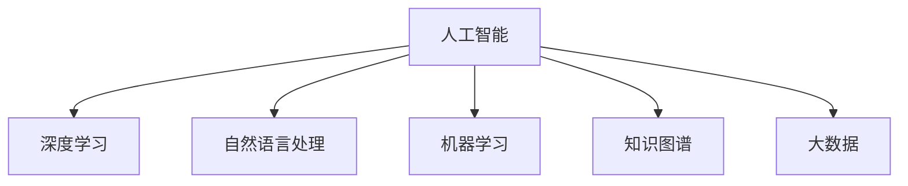

                 

# 知识经济时代：人工智能的贡献

## 1. 背景介绍

随着信息时代的到来，人类社会步入了知识经济的新阶段。大数据、云计算、物联网等技术的发展，极大地推动了各行业的数字化转型，但同时，知识的获取、加工、应用成为制约经济增长的瓶颈。人工智能（AI）作为这一时代的新引擎，通过自动化、智能化技术，极大地提升了知识的获取、处理和应用效率，推动了经济社会的全面发展。

### 1.1 知识经济的特点

知识经济时代的主要特点包括：
1. **数据爆炸**：信息技术的普及和互联网的广泛应用，使得数据总量呈指数级增长，知识经济的基础是大量的数据资源。
2. **知识驱动**：创新成为企业核心竞争力，知识成为推动经济增长的关键要素。
3. **技术融合**：大数据、云计算、物联网、AI等技术的深度融合，推动了各行业的信息化、智能化升级。

### 1.2 AI在知识经济中的角色

AI技术，尤其是深度学习和自然语言处理（NLP）技术，正在成为知识经济中的关键工具。AI不仅能够处理海量数据，提取有价值的信息，还能理解语言，进行推理和决策，推动知识经济的创新与发展。AI技术在医疗、教育、金融、制造等诸多领域的应用，正在改变传统业务模式，提升生产效率，创造出新的价值。

## 2. 核心概念与联系

### 2.1 核心概念概述

为更好地理解AI在知识经济中的贡献，本节将介绍几个关键概念：

- **人工智能（Artificial Intelligence, AI）**：通过算法和计算技术，使计算机具备人类智能行为的技术。
- **深度学习（Deep Learning）**：一种模拟人脑神经网络结构的学习算法，通过多层次的非线性处理，提升数据建模能力。
- **自然语言处理（Natural Language Processing, NLP）**：使计算机理解、处理和生成自然语言的技术，包括文本分类、语言生成、情感分析等。
- **机器学习（Machine Learning）**：一种通过数据自动优化模型参数的技术，包括监督学习、无监督学习和强化学习等。
- **知识图谱（Knowledge Graph）**：一种结构化的知识表示方式，通过节点和边的关联，构建知识网络，便于知识的存储和推理。
- **大数据（Big Data）**：指无法通过传统处理手段在合理时间内处理和分析的数据集，涉及数据采集、存储、处理和分析等环节。

这些核心概念之间的逻辑关系可以通过以下Mermaid流程图来展示：



这个流程图展示了这个系统的主要技术组成：

1. 人工智能作为总体的目标和框架。
2. 深度学习、自然语言处理、机器学习、知识图谱和大数据作为具体技术和工具，支撑着人工智能的实现。

## 3. 核心算法原理 & 具体操作步骤
### 3.1 算法原理概述

AI在知识经济中的应用，主要依赖于数据驱动的机器学习和深度学习算法。这些算法通过数据训练模型，使其能够自动进行特征提取、分类、预测等任务，从而辅助人类进行决策。

以深度学习为例，其主要原理是利用多层神经网络，通过反向传播算法，最小化损失函数，逐步优化模型参数，使其能够更准确地拟合数据分布。深度学习的核心是卷积神经网络（CNN）、循环神经网络（RNN）和Transformer等架构，这些架构通过多层次的非线性变换，能够高效地处理复杂的非线性问题。

### 3.2 算法步骤详解

以下以自然语言处理（NLP）中的情感分析为例，详细讲解基于深度学习的情感分析流程。

1. **数据准备**：收集包含正面、负面和中性情感的文本数据，并进行标注。
2. **模型构建**：选择适合的数据集和深度学习框架，构建情感分析模型，常用的框架包括TensorFlow和PyTorch。
3. **数据预处理**：对文本数据进行分词、去停用词、词向量编码等预处理，并构建合适的输入输出格式。
4. **模型训练**：使用标注数据训练模型，优化模型参数，以最小化情感分类误差。
5. **模型评估**：在测试集上评估模型性能，使用准确率、召回率、F1值等指标评估模型效果。
6. **模型应用**：将训练好的模型应用到新的文本数据中，进行情感分类。

### 3.3 算法优缺点

深度学习在情感分析中的应用具有以下优点：
1. 高效处理大规模数据：深度学习算法能够高效处理大量的文本数据，从而提取文本中的情感特征。
2. 高准确性：通过多层次的非线性变换，深度学习模型能够更准确地分类情感。
3. 可扩展性：深度学习模型可以很容易地扩展到其他类型的情感分析任务，如情感生成、情感推理等。

同时，深度学习也存在一些缺点：
1. 数据需求量大：深度学习模型需要大量的标注数据进行训练，数据获取成本较高。
2. 计算资源消耗大：深度学习模型参数量大，训练和推理需要高性能计算资源。
3. 可解释性不足：深度学习模型往往被视为"黑盒"系统，难以解释其内部工作机制。

尽管如此，深度学习在情感分析中的应用依然取得了显著的效果，成为NLP领域的主流方法。

### 3.4 算法应用领域

基于深度学习的情感分析技术，在多个行业领域得到了广泛应用，例如：

1. **社交媒体监控**：通过对社交媒体上的文本进行分析，实时监测公众情绪，预测市场动态。
2. **产品反馈分析**：分析用户对产品的评价和反馈，指导产品改进和市场策略调整。
3. **舆情分析**：分析新闻报道、评论等文本数据，了解公众对某一事件的看法和情感态度。
4. **品牌管理**：分析用户对品牌的情感倾向，评估品牌形象和市场影响力。
5. **情感客服**：通过情感分析技术，提升智能客服系统的用户体验，提高问题解决效率。

此外，情感分析技术还被应用于广告投放、情感推荐系统、医疗诊断等领域，推动了这些行业的发展。

## 4. 数学模型和公式 & 详细讲解  
### 4.1 数学模型构建

情感分析任务的目标是将文本分为正面、负面和中性情感三类。模型的输入是文本序列 $x=\{x_1,x_2,\dots,x_n\}$，输出是情感标签 $y=\{p,n,b\}$。模型的目标是最小化交叉熵损失函数：

$$
\mathcal{L}=-\frac{1}{N}\sum_{i=1}^N [y_i\log P(y_i|x_i)+(1-y_i)\log(1-P(y_i|x_i))]
$$

其中，$P(y_i|x_i)$ 表示模型预测情感标签 $y_i$ 的条件概率，$N$ 表示样本总数。

### 4.2 公式推导过程

情感分析模型的核心是构建一个合适的概率分布 $P(y_i|x_i)$。常用的模型包括卷积神经网络（CNN）、循环神经网络（RNN）和Transformer等。以下以CNN为例，推导其模型公式。

首先，构建一个 $d$ 维的词向量表示，通过卷积层提取文本特征：

$$
\text{Conv}(x;\theta_1)=\sum_{k=1}^K\sigma(W_k^1x*h_k(x;\theta_2))
$$

其中，$W_k^1$ 和 $h_k(x;\theta_2)$ 分别是卷积核和激活函数，$K$ 表示卷积核个数。

接着，通过池化层对特征进行降维：

$$
\text{Pooling}(\text{Conv}(x;\theta_1))=\text{MaxPooling}(\text{Conv}(x;\theta_1))
$$

最后，通过全连接层输出情感分类概率：

$$
P(y_i|x_i)=\sigma(\text{FC}(\text{Pooling}(\text{Conv}(x;\theta_1));\theta_3))
$$

其中，$\sigma$ 是激活函数，$\theta_3$ 是全连接层的权重。

### 4.3 案例分析与讲解

以基于CNN的情感分析模型为例，进行案例分析。假设有一个文本序列 $x=\{\text{"I love this product!", "This is terrible!" }\}$，使用CNN模型进行情感分类。

1. **数据预处理**：对文本进行分词，去除停用词，构建词向量表示。
2. **模型前向传播**：输入文本 $x$，通过卷积层提取特征，通过池化层降维，最后输出情感分类概率 $P(y_i|x_i)$。
3. **模型训练**：使用标注数据训练模型，优化模型参数。
4. **模型评估**：在测试集上评估模型性能，如准确率、召回率等。

## 5. 项目实践：代码实例和详细解释说明
### 5.1 开发环境搭建

在进行情感分析模型开发前，需要准备好开发环境。以下是使用Python进行PyTorch开发的环境配置流程：

1. 安装Anaconda：从官网下载并安装Anaconda，用于创建独立的Python环境。

2. 创建并激活虚拟环境：
```bash
conda create -n pytorch-env python=3.8 
conda activate pytorch-env
```

3. 安装PyTorch：根据CUDA版本，从官网获取对应的安装命令。例如：
```bash
conda install pytorch torchvision torchaudio cudatoolkit=11.1 -c pytorch -c conda-forge
```

4. 安装自然语言处理库：
```bash
pip install numpy pandas scikit-learn torchtext transformers
```

5. 安装各类工具包：
```bash
pip install sklearn nltk
```

完成上述步骤后，即可在`pytorch-env`环境中开始模型开发。

### 5.2 源代码详细实现

这里我们以基于CNN的情感分析模型为例，给出使用PyTorch进行模型开发的完整代码实现。

首先，定义情感分类器的数据处理函数：

```python
import torch
from torchtext.datasets import IMDB
from torchtext.data import Field, BucketIterator
from transformers import CNNTextClassifier, FastTextTokenizer

# 定义文本和标签处理
text = Field(tokenize='spacy', include_lengths=True)
label = Field(sequential=False, num_classes=3)

# 构建词汇表
train_data, test_data = IMDB.splits(text, label)
vocab = text.build_vocab(train_data, min_freq=2)
label_vocab = label.build_vocab(train_data)

# 数据预处理
text.build_vocab(train_data, min_freq=2)
label.build_vocab(train_data)

# 数据迭代器
train_iterator, test_iterator = BucketIterator.splits(
    (train_data, test_data), 
    batch_size=64, 
    device='cuda')
```

然后，定义情感分类器的模型和优化器：

```python
from transformers import CNNTextClassifier

model = CNNTextClassifier(len(vocab), 3, 3, 2, 2, dropout=0.5)

optimizer = torch.optim.Adam(model.parameters(), lr=0.001)
```

接着，定义训练和评估函数：

```python
from torch.nn import functional as F

def train_epoch(model, iterator, optimizer):
    model.train()
    epoch_loss = 0
    epoch_acc = 0
    
    for batch in iterator:
        optimizer.zero_grad()
        predictions = model(batch.text).squeeze(1)
        loss = F.cross_entropy(predictions, batch.label)
        acc = (predictions.argmax(1) == batch.label).float().mean()
        
        loss.backward()
        optimizer.step()
        
        epoch_loss += loss.item()
        epoch_acc += acc.item()

    return epoch_loss / len(iterator), epoch_acc / len(iterator)

def evaluate(model, iterator):
    model.eval()
    total, correct = 0, 0
    
    with torch.no_grad():
        for batch in iterator:
            predictions = model(batch.text).squeeze(1)
            total += batch.label.size(0)
            correct += (predictions.argmax(1) == batch.label).sum().item()
    
    acc = correct / total
    return acc
```

最后，启动训练流程并在测试集上评估：

```python
import os

best_loss, best_acc = float('inf'), 0

for epoch in range(10):
    loss, acc = train_epoch(model, train_iterator, optimizer)
    test_acc = evaluate(model, test_iterator)
    
    if test_acc > best_acc:
        best_acc = test_acc
        torch.save(model.state_dict(), os.path.join('model.pt'))
    
    print(f'Epoch: {epoch+1}, Train Loss: {loss:.3f}, Test Acc: {test_acc:.3f}')
```

以上就是使用PyTorch对情感分析模型进行开发的完整代码实现。可以看到，得益于PyTorch和HuggingFace库的强大封装，我们可以用相对简洁的代码完成情感分析模型的构建和训练。

### 5.3 代码解读与分析

让我们再详细解读一下关键代码的实现细节：

**CNNTextClassifier类**：
- `__init__`方法：初始化模型参数，包括词向量维度、分类数目、卷积核个数、卷积核大小、dropout比例等。
- `forward`方法：进行模型前向传播，输出情感分类概率。

**训练和评估函数**：
- 使用PyTorch的DataLoader对数据集进行批次化加载，供模型训练和推理使用。
- 训练函数`train_epoch`：对数据以批为单位进行迭代，在每个批次上前向传播计算损失和准确率，反向传播更新模型参数。
- 评估函数`evaluate`：与训练类似，不同点在于不更新模型参数，仅计算模型在测试集上的准确率。

**训练流程**：
- 定义总的epoch数，开始循环迭代
- 每个epoch内，在训练集上训练，输出损失和准确率
- 在验证集上评估，输出测试集准确率
- 所有epoch结束后，保存模型参数到磁盘，输出最终测试集准确率

可以看到，PyTorch配合HuggingFace库使得情感分析模型的开发变得简洁高效。开发者可以将更多精力放在数据处理、模型改进等高层逻辑上，而不必过多关注底层的实现细节。

当然，工业级的系统实现还需考虑更多因素，如模型的保存和部署、超参数的自动搜索、更灵活的任务适配层等。但核心的情感分析流程基本与此类似。

## 6. 实际应用场景
### 6.1 智能客服系统

基于情感分析的智能客服系统，可以实时监测客户情绪，快速响应客户咨询，提升客户体验。传统客服往往需要配备大量人力，高峰期响应缓慢，且一致性和专业性难以保证。而使用情感分析技术的智能客服系统，能够通过自然语言处理技术，自动理解客户情绪，匹配最合适的回复，从而提升客户满意度。

在技术实现上，可以收集客户的历史对话记录，将问题和最佳答复构建成监督数据，在此基础上对情感分析模型进行微调。微调后的情感分析模型能够自动理解用户情绪，匹配最合适的回复模板进行回复。对于客户提出的新问题，还可以接入检索系统实时搜索相关内容，动态组织生成回答。如此构建的智能客服系统，能大幅提升客户咨询体验和问题解决效率。

### 6.2 舆情分析

舆情分析系统通过情感分析技术，能够实时监测和分析网络上的情感倾向，预测市场动态，辅助企业决策。传统舆情分析往往需要大量人力进行手动分析，效率低下且难以覆盖全面。而使用情感分析技术的舆情分析系统，能够通过自然语言处理技术，自动分析社交媒体、新闻报道等文本数据，判断公众情绪，评估市场趋势，从而帮助企业快速做出决策。

在技术实现上，可以收集社交媒体、新闻报道等文本数据，构建情感分析模型，对其进行情感分类，实时监测舆情变化。当发现舆情异常时，系统能够及时预警，帮助企业快速应对市场变化。

### 6.3 个性化推荐系统

情感分析技术也被应用于个性化推荐系统中，分析用户对产品的评价和反馈，指导产品改进和市场策略调整。传统推荐系统往往只依赖用户的历史行为数据进行物品推荐，难以深入理解用户的真实兴趣偏好。而使用情感分析技术的推荐系统，能够通过分析用户情感倾向，推荐符合用户兴趣的产品，提升推荐系统的准确性和用户满意度。

在技术实现上，可以收集用户对产品的评价和反馈数据，构建情感分析模型，对其进行情感分类，分析用户情感倾向，推荐符合用户兴趣的产品。同时，结合其他特征，如用户历史行为、产品属性等，综合排序，便可以得到个性化程度更高的推荐结果。

### 6.4 未来应用展望

随着情感分析技术的不断发展，其在多个领域的应用前景广阔。

在智慧医疗领域，情感分析技术可用于病人情绪监测、医生情感状态评估等，提升医疗服务质量。

在智能教育领域，情感分析技术可用于学生情绪分析、课堂效果评估等，提升教学效果。

在智慧城市治理中，情感分析技术可用于市民情绪监测、事件舆情分析等，提升城市管理水平。

此外，在企业生产、社会治理、文娱传媒等众多领域，情感分析技术都将得到广泛应用，推动人工智能技术在各个领域的深度应用。

## 7. 工具和资源推荐
### 7.1 学习资源推荐

为了帮助开发者系统掌握情感分析技术的理论基础和实践技巧，这里推荐一些优质的学习资源：

1. 《深度学习与自然语言处理》系列博文：由大模型技术专家撰写，深入浅出地介绍了深度学习、自然语言处理和情感分析等前沿话题。

2. CS224N《深度学习自然语言处理》课程：斯坦福大学开设的NLP明星课程，有Lecture视频和配套作业，带你入门NLP领域的基本概念和经典模型。

3. 《自然语言处理综述》书籍：复旦大学教授陈达教授著作，全面介绍了自然语言处理技术的理论和应用，是学习情感分析的必备参考资料。

4. HuggingFace官方文档：情感分析模型的官方文档，提供了海量预训练模型和完整的情感分析样例代码，是上手实践的必备资料。

5. TED Talks上的情感分析相关演讲：TED Talks汇集了大量关于情感分析的演讲视频，涵盖理论和实践各个方面，适合全方位学习。

通过对这些资源的学习实践，相信你一定能够快速掌握情感分析技术的精髓，并用于解决实际的NLP问题。

### 7.2 开发工具推荐

高效的开发离不开优秀的工具支持。以下是几款用于情感分析开发的常用工具：

1. PyTorch：基于Python的开源深度学习框架，灵活动态的计算图，适合快速迭代研究。情感分析模型通常用PyTorch实现。

2. TensorFlow：由Google主导开发的开源深度学习框架，生产部署方便，适合大规模工程应用。情感分析模型也可用TensorFlow实现。

3. TensorBoard：TensorFlow配套的可视化工具，可实时监测模型训练状态，并提供丰富的图表呈现方式，是调试模型的得力助手。

4. Weights & Biases：模型训练的实验跟踪工具，可以记录和可视化模型训练过程中的各项指标，方便对比和调优。

5. Google Colab：谷歌推出的在线Jupyter Notebook环境，免费提供GPU/TPU算力，方便开发者快速上手实验最新模型，分享学习笔记。

合理利用这些工具，可以显著提升情感分析模型的开发效率，加快创新迭代的步伐。

### 7.3 相关论文推荐

情感分析技术的发展源于学界的持续研究。以下是几篇奠基性的相关论文，推荐阅读：

1. **TextBlob: Simplified Text Processing**：提出了基于Python的自然语言处理库，包括情感分析在内的一系列功能，是情感分析的开山之作。

2. **Convolutional Neural Networks for Sentence Classification**：提出了基于卷积神经网络的文本分类方法，为情感分析提供了新思路。

3. **Deep Recurrent Neural Networks for Text Classification**：提出了基于循环神经网络的文本分类方法，在情感分析中也有广泛应用。

4. **Emotion Classification in Twitter: A TIFG Study**：通过Twitter数据集，展示了基于情感分析技术的舆情监测方法。

5. **Sentiment Analysis of Textual Customer Reviews**：介绍了基于情感分析技术的在线评论情感分析方法，广泛应用于产品评价和市场策略调整。

这些论文代表了大规模情感分析技术的发展脉络。通过学习这些前沿成果，可以帮助研究者把握学科前进方向，激发更多的创新灵感。

## 8. 总结：未来发展趋势与挑战

### 8.1 总结

本文对基于深度学习的情感分析方法进行了全面系统的介绍。首先阐述了情感分析在知识经济中的重要性和应用背景，明确了深度学习在情感分析中的核心地位。其次，从原理到实践，详细讲解了情感分析的数学原理和关键步骤，给出了情感分析任务开发的完整代码实例。同时，本文还广泛探讨了情感分析方法在多个行业领域的应用前景，展示了情感分析范式的巨大潜力。此外，本文精选了情感分析技术的各类学习资源，力求为读者提供全方位的技术指引。

通过本文的系统梳理，可以看到，情感分析作为自然语言处理的重要分支，已经在多个领域得到了广泛应用，成为推动知识经济发展的关键技术。未来，伴随深度学习和大数据技术的进一步发展，情感分析技术将持续优化，提升其在各行业的应用效果。

### 8.2 未来发展趋势

展望未来，情感分析技术的发展趋势主要包括：

1. **深度学习算法的优化**：随着深度学习算法的不断优化，情感分析模型的准确性和泛化性能将进一步提升，能够更好地处理复杂情感表达。

2. **多模态情感分析**：情感分析技术将不再局限于文本数据，而是向多模态数据扩展，融合语音、视频等非文本信息，提升情感识别的全面性。

3. **实时情感分析**：基于流数据处理技术，情感分析系统将能够实时处理海量数据，提供即时的情感分析结果，满足实时性需求。

4. **情感生成**：情感分析技术将不仅用于情感识别，还将用于情感生成，生成符合用户情感需求的自然语言回复，提升人机交互的自然性。

5. **情感融合**：情感分析技术将与其他技术，如知识图谱、认知计算等融合，形成更加全面、智能的情感处理系统。

以上趋势凸显了情感分析技术的广阔前景。这些方向的探索发展，必将进一步提升情感分析模型的性能和应用范围，为知识经济的发展注入新的动力。

### 8.3 面临的挑战

尽管情感分析技术已经取得了显著的进展，但在迈向更加智能化、普适化应用的过程中，它仍面临着诸多挑战：

1. **数据依赖**：情感分析模型的性能高度依赖于标注数据的质量和数量，数据获取成本较高。

2. **跨语言障碍**：情感分析技术在不同语言上的表现差距较大，需要针对不同语言设计特定的模型。

3. **计算资源消耗大**：情感分析模型的参数量大，训练和推理需要高性能计算资源，硬件成本较高。

4. **可解释性不足**：情感分析模型往往被视为"黑盒"系统，难以解释其内部工作机制。

5. **多任务协同**：情感分析技术需要在不同任务间进行协同处理，如情感识别和情感生成，需要优化模型结构和算法。

尽管如此，情感分析技术仍将在多个领域得到广泛应用，推动人工智能技术在各个领域的深度应用。相信随着学界和产业界的共同努力，这些挑战终将一一被克服，情感分析技术必将在构建人机协同的智能系统中扮演越来越重要的角色。

### 8.4 研究展望

面对情感分析面临的种种挑战，未来的研究需要在以下几个方面寻求新的突破：

1. **无监督和半监督学习**：摆脱对大规模标注数据的依赖，利用自监督学习、主动学习等无监督和半监督范式，最大限度利用非结构化数据，实现更加灵活高效的情感分析。

2. **跨语言情感分析**：针对不同语言设计特定的情感分析模型，提升情感分析技术的跨语言适用性。

3. **轻量化模型**：开发更加轻量级的情感分析模型，降低计算资源消耗，提升模型部署的灵活性。

4. **可解释性提升**：通过引入可解释性技术，增强情感分析模型的可解释性和透明度，便于用户理解和调试。

5. **多任务协同**：将情感分析技术与其他技术，如知识图谱、认知计算等融合，形成更加全面、智能的情感处理系统。

这些研究方向的探索，必将引领情感分析技术迈向更高的台阶，为构建安全、可靠、可解释、可控的智能系统铺平道路。面向未来，情感分析技术还需要与其他人工智能技术进行更深入的融合，如知识表示、因果推理、强化学习等，多路径协同发力，共同推动自然语言理解和智能交互系统的进步。只有勇于创新、敢于突破，才能不断拓展情感分析的边界，让智能技术更好地造福人类社会。

## 9. 附录：常见问题与解答

**Q1：深度学习在情感分析中的应用是否存在语言依赖？**

A: 深度学习在情感分析中的应用存在一定的语言依赖。不同语言之间的情感表达方式和情感标签定义不同，需要针对每种语言设计特定的情感分析模型。尽管如此，目前基于深度学习的情感分析技术已经在大规模数据集上取得了显著效果，能够处理多种语言的情感分析任务。

**Q2：情感分析的准确性和泛化性能受哪些因素影响？**

A: 情感分析的准确性和泛化性能受多种因素影响，包括：
1. 数据质量：标注数据的准确性和多样性直接影响情感分析的准确性。
2. 模型复杂度：模型的复杂度和参数量影响其泛化性能，过拟合风险较高。
3. 特征工程：情感特征的提取和选择对模型性能有重要影响，需要根据具体任务设计合适的特征工程流程。
4. 训练数据量：训练数据量越大，情感分析模型越容易学习到丰富的情感表达，泛化性能越好。

**Q3：情感分析技术如何提升客户体验？**

A: 情感分析技术通过自然语言处理技术，自动理解客户情绪，匹配最合适的回复，从而提升客户满意度。具体来说，智能客服系统能够自动分析客户情绪，快速响应客户咨询，提供符合客户期望的解决方案。通过分析用户对产品的评价和反馈，个性化推荐系统能够推荐符合用户情感需求的产品，提升用户体验。

**Q4：情感分析技术在医疗领域的应用前景如何？**

A: 情感分析技术在医疗领域有着广阔的应用前景。通过分析病患的情感表达，医疗系统能够及时了解病患的情绪状态，提供心理支持和治疗建议。在医生情绪监测和状态评估方面，情感分析技术能够帮助医生缓解压力，提升工作满意度。

**Q5：如何优化情感分析模型的计算资源消耗？**

A: 优化情感分析模型的计算资源消耗可以从以下几个方面入手：
1. 模型压缩：通过剪枝、量化等技术，减小模型参数量，降低计算资源消耗。
2. 分布式训练：利用分布式计算框架，并行化训练过程，提高训练效率。
3. 模型并行：采用模型并行技术，将大模型拆分为多个子模型，分别在多台设备上计算，提升计算效率。
4. 硬件加速：利用GPU、TPU等高性能硬件设备，加速模型训练和推理过程。

这些优化措施可以在不降低模型性能的前提下，显著降低计算资源消耗，提高模型的部署效率。

---

作者：禅与计算机程序设计艺术 / Zen and the Art of Computer Programming

