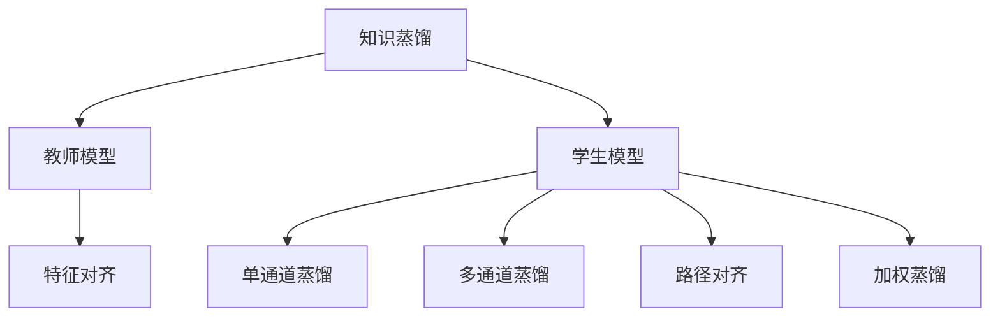

                 

## 1. 背景介绍

### 1.1 问题由来
在人工智能领域，随着深度学习技术的不断进步，神经网络模型的复杂度日益增加。这些模型不仅参数量巨大，而且训练成本高昂，通常需要大量的计算资源和数据。然而，模型复杂度与性能并不总是正相关的。在许多实际应用中，模型复杂度越高，性能提升的效果可能反而不如预期。

### 1.2 问题核心关键点
知识蒸馏(Knowledge Distillation)是一种通过将复杂模型的知识迁移到简单模型中，提升简单模型的性能的技术。其主要思想是利用已有复杂模型的表示能力，训练一个参数更少、计算成本更低的模型，使其在特定任务上表现不俗。知识蒸馏的核心在于如何有效提取复杂模型的知识，并传递给简单模型。

### 1.3 问题研究意义
研究知识蒸馏方法，对于提升模型性能、降低训练成本、加快模型部署等方面具有重要意义。具体来说，知识蒸馏可以实现以下几点：
1. **提升性能**：利用复杂模型的知识，提高简单模型的预测准确度。
2. **降低成本**：减少模型参数和计算资源消耗，提高模型训练和推理的效率。
3. **加快部署**：构建更加轻量级、易部署的模型，提升模型应用的可扩展性和灵活性。
4. **优化资源分配**：将复杂模型的高性能与简单模型的低成本结合，优化模型开发和应用的全生命周期。

## 2. 核心概念与联系

### 2.1 核心概念概述

为更好地理解知识蒸馏技术，本节将介绍几个密切相关的核心概念：

- 知识蒸馏(Knowledge Distillation)：通过将复杂模型的知识迁移到简单模型中，提升简单模型的性能。
- 教师模型(Teacher Model)：被视为知识源的复杂模型，提供需要被学习的知识。
- 学生模型(Student Model)：被训练以吸收教师模型知识，最终在特定任务上表现良好。
- 特征对齐(Feature Alignment)：将教师模型的输出特征映射到学生模型上，使得学生模型可以学习到教师模型的内在知识。
- 单通道蒸馏(Single-Teacher Distillation)：使用单一复杂模型作为教师，对学生模型进行训练。
- 多通道蒸馏(Multi-Teacher Distillation)：使用多个复杂模型作为教师，综合这些教师的知识进行学生模型的训练。
- 路径对齐(Path Alignment)：通过训练多级模型，逐步从教师模型学习到学生模型。
- 加权蒸馏(Weighted Distillation)：在单通道蒸馏基础上，为教师模型的不同部分分配不同的权重，进一步优化学生模型的性能。

这些核心概念之间的逻辑关系可以通过以下Mermaid流程图来展示：



这个流程图展示了两者的核心概念及其之间的关系：

1. 知识蒸馏是连接教师模型和学生模型的桥梁。
2. 教师模型是知识蒸馏的源头，其输出特征需要对齐到学生模型上。
3. 学生模型通过特征对齐和不同的蒸馏策略，吸收教师模型的知识。
4. 单通道和多通道蒸馏、路径对齐、加权蒸馏等策略，都是在特征对齐的基础上进行优化的。

## 3. 核心算法原理 & 具体操作步骤
### 3.1 算法原理概述

知识蒸馏的本质是通过将教师模型的知识迁移到学生模型中，提升学生模型在特定任务上的性能。其核心思想是：教师模型已经在大规模数据上进行了充分的训练，获得了丰富的表示能力，而学生模型通常参数量较少，计算成本较低。通过将教师模型的知识传递给学生模型，可以显著提升学生模型在特定任务上的表现，同时降低训练和推理的复杂度。

形式化地，假设教师模型为 $M_{teachers}$，学生模型为 $M_{students}$，两者在任务 $T$ 上的损失函数分别为 $\mathcal{L}_{teachers}(M_{teachers}, D_{teachers})$ 和 $\mathcal{L}_{students}(M_{students}, D_{students})$，其中 $D_{teachers}$ 和 $D_{students}$ 分别为教师模型和学生模型的训练集。知识蒸馏的目标是找到最优的学生模型参数 $\theta_{students}$，使得 $M_{students}$ 在 $T$ 上的性能接近 $M_{teachers}$，即：

$$
\theta_{students} = \mathop{\arg\min}_{\theta} \mathcal{L}_{students}(M_{students}, D_{students}) + \lambda \mathcal{L}_{distill}(M_{teachers}, M_{students})
$$

其中 $\mathcal{L}_{distill}(M_{teachers}, M_{students})$ 是蒸馏损失，用于衡量教师模型与学生模型输出的一致性。$\lambda$ 是蒸馏权重，用于平衡原始训练损失和蒸馏损失。

### 3.2 算法步骤详解

知识蒸馏的一般步骤包括：

**Step 1: 准备教师和学生模型**

- 选择合适的教师模型 $M_{teachers}$ 和学生模型 $M_{students}$。教师模型可以是任何复杂的神经网络，如BERT、ResNet等。学生模型可以是参数更少、计算成本更低的模型，如MLP、MobileNet等。
- 准备教师模型和学生模型的训练数据集 $D_{teachers}$ 和 $D_{students}$，保证教师和学生模型的数据分布一致。

**Step 2: 设计蒸馏损失**

- 确定蒸馏损失函数 $\mathcal{L}_{distill}(M_{teachers}, M_{students})$。常见的方法包括：
  - Softmax蒸馏：使用Softmax函数将教师模型的输出映射到学生模型上，最小化两者之间的交叉熵损失。
  - Mean Squared Error蒸馏：直接计算教师模型与学生模型输出的均方误差，作为蒸馏损失。
  - Noise-Based蒸馏：在教师模型的输出上添加噪声，然后作为学生模型的目标。
- 设计蒸馏权重 $\lambda$，确保蒸馏损失在学生模型训练中的重要性。

**Step 3: 训练学生模型**

- 使用教师模型 $M_{teachers}$ 对学生模型 $M_{students}$ 进行训练，同时最小化原始训练损失和蒸馏损失。
- 通常采用梯度下降等优化算法，逐步更新学生模型的参数，使其在教师模型的指导下优化。

**Step 4: 评估和优化**

- 在验证集上评估学生模型的性能，评估指标包括准确率、精确度、召回率等。
- 根据评估结果，调整蒸馏权重 $\lambda$ 和其他训练参数，进一步优化学生模型的性能。

### 3.3 算法优缺点

知识蒸馏技术具有以下优点：

1. **提升性能**：利用复杂模型的知识，可以显著提升简单模型的性能，尤其是在数据量不足的情况下。
2. **降低成本**：减少模型参数和计算资源消耗，提高模型训练和推理的效率。
3. **易部署**：构建更加轻量级、易部署的模型，提升模型应用的可扩展性和灵活性。

同时，该方法也存在一定的局限性：

1. **数据分布假设**：教师和学生模型的数据分布必须一致，否则蒸馏效果可能不理想。
2. **模型复杂度差异**：教师和学生模型之间的结构差异较大，可能会影响蒸馏效果。
3. **训练复杂度增加**：需要同时优化教师和学生模型的损失函数，增加了训练的复杂度。
4. **过拟合风险**：教师模型的复杂度较高，容易过拟合，需要谨慎选择蒸馏策略和超参数。

尽管存在这些局限性，但知识蒸馏仍然是一种有效的模型压缩和性能提升技术，广泛应用于图像分类、语音识别、自然语言处理等多个领域。

### 3.4 算法应用领域

知识蒸馏技术在多个领域都有广泛的应用，例如：

- 图像分类：将大规模的深度神经网络压缩成较小的模型，提高推理速度和减少计算成本。
- 语音识别：将复杂模型知识传递给轻量级模型，提高语音识别系统的准确度和鲁棒性。
- 自然语言处理：通过蒸馏BERT等大型语言模型，构建更加轻量级的语言模型，用于自然语言理解和生成。
- 医疗影像分析：利用复杂模型对大量医疗影像进行蒸馏，构建高性能且低成本的影像分析模型。
- 自动驾驶：将复杂的神经网络压缩，用于实时驾驶决策和环境感知。

除了这些经典应用，知识蒸馏还在动态系统、推荐系统、游戏AI等领域有广泛应用，为这些领域的技术进步提供了新思路。

## 4. 数学模型和公式 & 详细讲解  
### 4.1 数学模型构建

知识蒸馏的本质是利用教师模型 $M_{teachers}$ 的知识，训练学生模型 $M_{students}$。假设教师模型和学生模型在任务 $T$ 上的损失函数分别为 $\mathcal{L}_{teachers}(M_{teachers}, D_{teachers})$ 和 $\mathcal{L}_{students}(M_{students}, D_{students})$。知识蒸馏的目标是最小化学生模型的损失函数，同时最大化蒸馏损失。

定义蒸馏损失为：

$$
\mathcal{L}_{distill}(M_{teachers}, M_{students}) = \lambda \sum_{i=1}^N \left[ \sum_{k=1}^K ||f_k(\mathbf{x}_i) - g_k(\mathbf{x}_i)||^2 \right]
$$

其中 $f_k$ 和 $g_k$ 分别为教师模型和学生模型在第 $k$ 层上的特征表示，$K$ 为特征层数，$||\cdot||$ 为特征向量间的L2范数。$\lambda$ 为蒸馏权重，控制蒸馏损失的强度。

总损失函数为：

$$
\mathcal{L}(M_{students}, D_{students}) = \mathcal{L}_{students}(M_{students}, D_{students}) + \lambda \mathcal{L}_{distill}(M_{teachers}, M_{students})
$$

### 4.2 公式推导过程

以下是知识蒸馏的数学推导过程。

以Softmax蒸馏为例，假设教师模型 $M_{teachers}$ 和学生模型 $M_{students}$ 在任务 $T$ 上的输出分别为 $f(\mathbf{x})$ 和 $g(\mathbf{x})$，目标是对 $g(\mathbf{x})$ 进行训练，使其输出与 $f(\mathbf{x})$ 一致。

假设教师模型的输出为 $f(\mathbf{x}) = \{f_1(\mathbf{x}), f_2(\mathbf{x}), \ldots, f_K(\mathbf{x})\}$，学生模型的输出为 $g(\mathbf{x}) = \{g_1(\mathbf{x}), g_2(\mathbf{x}), \ldots, g_K(\mathbf{x})\}$。

蒸馏损失可以定义为：

$$
\mathcal{L}_{distill}(f, g) = -\frac{1}{N}\sum_{i=1}^N \left[ \sum_{k=1}^K \log \frac{e^{g_k(\mathbf{x}_i)}}{\sum_{k'=1}^K e^{g_{k'}(\mathbf{x}_i)}} \right]
$$

将其扩展到所有训练样本，得到蒸馏损失的均值：

$$
\mathcal{L}_{distill} = \frac{1}{N}\sum_{i=1}^N \mathcal{L}_{softmax}(f_i, g_i)
$$

其中 $\mathcal{L}_{softmax}(f_i, g_i)$ 为两个概率分布之间的交叉熵损失。

通过反向传播算法，计算学生模型 $M_{students}$ 的梯度，从而更新模型参数。

### 4.3 案例分析与讲解

以图像分类为例，知识蒸馏可以用于将大规模的ResNet模型压缩成MobileNet模型，提高推理速度和减少计算成本。

假设教师模型为ResNet50，学生模型为MobileNetV2。教师模型对大量图像数据进行训练，获得了丰富的特征表示能力。学生模型则需要通过蒸馏学习教师模型的知识。

首先，选择适当的蒸馏策略。在此例中，可以使用Softmax蒸馏。然后，将教师模型的输出 $f(\mathbf{x})$ 和学生模型的输出 $g(\mathbf{x})$ 进行蒸馏，最小化两者之间的交叉熵损失。

蒸馏损失公式为：

$$
\mathcal{L}_{distill} = \lambda \sum_{i=1}^N \left[ \sum_{k=1}^K \log \frac{e^{g_k(\mathbf{x}_i)}}{\sum_{k'=1}^K e^{g_{k'}(\mathbf{x}_i)}} \right]
$$

其中 $K$ 为特征层数，$\lambda$ 为蒸馏权重，$g_k(\mathbf{x})$ 为学生模型在每一层上的特征表示。

将蒸馏损失添加到学生模型的损失函数中，进行训练：

$$
\mathcal{L}(M_{students}, D_{students}) = \mathcal{L}_{students}(M_{students}, D_{students}) + \lambda \mathcal{L}_{distill}(M_{teachers}, M_{students})
$$

在训练过程中，学生模型不断优化，逐步学习教师模型的知识，最终在图像分类任务上表现出色。

## 5. 项目实践：代码实例和详细解释说明
### 5.1 开发环境搭建

在进行知识蒸馏实践前，我们需要准备好开发环境。以下是使用Python进行TensorFlow进行知识蒸馏的环境配置流程：

1. 安装Anaconda：从官网下载并安装Anaconda，用于创建独立的Python环境。

2. 创建并激活虚拟环境：
```bash
conda create -n tf-env python=3.8 
conda activate tf-env
```

3. 安装TensorFlow：根据CUDA版本，从官网获取对应的安装命令。例如：
```bash
conda install tensorflow==2.3.0
```

4. 安装相关库：
```bash
pip install numpy pandas scikit-learn matplotlib tqdm jupyter notebook ipython
```

完成上述步骤后，即可在`tf-env`环境中开始知识蒸馏实践。

### 5.2 源代码详细实现

下面我们以图像分类任务为例，给出使用TensorFlow进行知识蒸馏的代码实现。

首先，定义模型：

```python
import tensorflow as tf
from tensorflow.keras import layers, models

def make_model(input_shape, num_classes):
    model = models.Sequential([
        layers.Conv2D(32, (3, 3), activation='relu', input_shape=input_shape),
        layers.MaxPooling2D((2, 2)),
        layers.Conv2D(64, (3, 3), activation='relu'),
        layers.MaxPooling2D((2, 2)),
        layers.Conv2D(128, (3, 3), activation='relu'),
        layers.MaxPooling2D((2, 2)),
        layers.Flatten(),
        layers.Dense(64, activation='relu'),
        layers.Dense(num_classes, activation='softmax')
    ])
    return model

# 定义教师模型
input_shape = (224, 224, 3)
num_classes = 1000
teacher_model = make_model(input_shape, num_classes)
teacher_model.compile(optimizer='adam', loss='categorical_crossentropy', metrics=['accuracy'])

# 定义学生模型
student_model = make_model(input_shape, num_classes)
student_model.compile(optimizer='adam', loss='categorical_crossentropy', metrics=['accuracy'])

# 加载数据集
(x_train, y_train), (x_test, y_test) = tf.keras.datasets.cifar10.load_data()
x_train, x_test = x_train / 255.0, x_test / 255.0
```

然后，定义蒸馏损失和蒸馏权重：

```python
def distill_loss(y_true, y_pred):
    softmax_loss = tf.keras.losses.categorical_crossentropy(y_true, y_pred)
    return softmax_loss

# 设置蒸馏权重
lambda_distill = 0.5
```

接着，定义训练函数：

```python
def train_step(model, loss_fn):
    def step(inputs):
        targets = tf.reshape(targets, (targets.shape[0], 1, 1, 1))
        with tf.GradientTape() as tape:
            outputs = model(inputs)
            loss_value = loss_fn(targets, outputs)
        return loss_value
    return step

# 蒸馏训练函数
def distill_train(teacher_model, student_model, lambda_distill):
    for batch in tf.data.Dataset.from_tensor_slices((x_train, y_train)):
        with tf.GradientTape() as tape:
            targets = tf.reshape(targets, (targets.shape[0], 1, 1, 1))
            outputs = teacher_model(batch[0])
            distill_loss_value = distill_loss(targets, outputs)
            loss_value = student_model.loss(batch[0], batch[1])
        gradients = tape.gradient([loss_value, distill_loss_value], student_model.trainable_variables)
        optimizer.apply_gradients(zip(gradients, student_model.trainable_variables))

# 开始训练
for epoch in range(epochs):
    for batch in train_dataset:
        distill_train(teacher_model, student_model, lambda_distill)
```

最后，测试并评估学生模型：

```python
def test_step(model, loss_fn):
    def step(inputs):
        targets = tf.reshape(targets, (targets.shape[0], 1, 1, 1))
        with tf.GradientTape() as tape:
            outputs = model(inputs)
            loss_value = loss_fn(targets, outputs)
        return loss_value
    return step

# 测试学生模型
test_loss = test_step(student_model, distill_loss)
```

以上就是使用TensorFlow进行图像分类任务知识蒸馏的完整代码实现。可以看到，利用TensorFlow强大的深度学习框架，知识蒸馏的实现非常简单。

### 5.3 代码解读与分析

让我们再详细解读一下关键代码的实现细节：

**模型定义**：
- `make_model`函数：定义了一个简单的卷积神经网络模型，用于教师和学生模型的构建。
- `teacher_model`和`student_model`：分别构建了教师模型和学生模型，两者结构一致。
- `compile`方法：配置了模型的优化器和损失函数。

**蒸馏损失定义**：
- `distill_loss`函数：定义了蒸馏损失，使用交叉熵损失函数。
- `lambda_distill`：设置了蒸馏权重，控制蒸馏损失的强度。

**训练函数定义**：
- `train_step`函数：定义了一个训练步骤，将教师模型的输出和学生模型的输出进行蒸馏。
- `distill_train`函数：对学生模型进行蒸馏训练，同时更新教师和学生模型的损失函数。

**训练流程**：
- `for epoch in range(epochs)`：外层循环迭代epoch数。
- `for batch in train_dataset`：内层循环遍历训练数据集中的每个batch。
- `distill_train(teacher_model, student_model, lambda_distill)`：对学生模型进行蒸馏训练，更新学生模型的参数。

可以看到，知识蒸馏的代码实现相对简洁，TensorFlow提供了丰富的API和工具，可以轻松完成复杂的蒸馏任务。

当然，工业级的系统实现还需考虑更多因素，如模型的保存和部署、超参数的自动搜索、更灵活的蒸馏策略等。但核心的蒸馏范式基本与此类似。

## 6. 实际应用场景
### 6.1 医疗影像分析

知识蒸馏在医疗影像分析领域具有广泛的应用。大型医疗影像分析模型通常参数量庞大，训练成本高昂，推理速度较慢。通过知识蒸馏，可以将大型模型压缩成更轻量级的模型，提高医疗影像分析的实时性和可扩展性。

例如，使用ResNet50作为教师模型，MobileNetV2作为学生模型，对医疗影像数据进行蒸馏。蒸馏后的学生模型可以在资源有限的设备上快速推理，同时保持较高的准确度。

### 6.2 自动驾驶

自动驾驶系统需要实时处理大量传感器数据，计算复杂度高，推理速度慢。利用知识蒸馏，可以将复杂的深度神经网络压缩成轻量级模型，提高实时推理速度。

以图像分类为例，使用ResNet50作为教师模型，MobileNetV2作为学生模型，对传感器数据进行蒸馏。蒸馏后的学生模型可以在自动驾驶系统中高效运行，同时保持较高的分类精度。

### 6.3 智能客服

智能客服系统需要处理大量的用户对话数据，计算复杂度高，推理速度慢。通过知识蒸馏，可以将复杂的对话模型压缩成轻量级模型，提高实时响应速度和推理效率。

例如，使用LSTM作为教师模型，GRU作为学生模型，对用户对话数据进行蒸馏。蒸馏后的学生模型可以在智能客服系统中高效运行，同时保持较高的回复准确度。

### 6.4 未来应用展望

随着知识蒸馏技术的不断进步，其在各个领域的应用将更加广泛。以下是几个未来应用展望：

1. **多模态蒸馏**：结合视觉、语音、文本等多种模态数据，构建更加全面的知识蒸馏模型，提升系统的综合理解能力。
2. **联邦蒸馏**：在分布式环境中，通过知识蒸馏提升模型的泛化能力，避免数据泄露和隐私风险。
3. **动态蒸馏**：在模型运行过程中动态蒸馏，不断更新模型参数，提升模型的实时性和适应性。
4. **跨领域蒸馏**：将不同领域的知识进行蒸馏，构建跨领域通用的知识蒸馏模型，提升系统的通用性。
5. **超轻量蒸馏**：将知识蒸馏与模型压缩、模型量化等技术结合，构建超轻量级的知识蒸馏模型，提高系统的资源利用效率。

## 7. 工具和资源推荐
### 7.1 学习资源推荐

为了帮助开发者系统掌握知识蒸馏的理论基础和实践技巧，这里推荐一些优质的学习资源：

1. 《Knowledge Distillation》系列博文：由大模型技术专家撰写，深入浅出地介绍了知识蒸馏原理、实现方法等前沿话题。

2. 《TensorFlow Distillation》教程：TensorFlow官方文档，提供了详尽的知识蒸馏教程，包括代码实现和案例分析。

3. 《Distillation: The Hacker's Guide》书籍：由知识蒸馏领域专家撰写，全面介绍了知识蒸馏的技术细节和应用场景。

4. HuggingFace官方文档：Transformers库的官方文档，提供了丰富的蒸馏样例代码，是上手实践的必备资料。

5. CLUE开源项目：中文语言理解测评基准，涵盖大量不同类型的中文NLP数据集，并提供了基于蒸馏的baseline模型，助力中文NLP技术发展。

通过对这些资源的学习实践，相信你一定能够快速掌握知识蒸馏的精髓，并用于解决实际的NLP问题。

### 7.2 开发工具推荐

高效的开发离不开优秀的工具支持。以下是几款用于知识蒸馏开发的常用工具：

1. TensorFlow：基于Python的开源深度学习框架，灵活动态的计算图，适合快速迭代研究。大型深度学习模型的蒸馏通常使用TensorFlow进行实现。

2. PyTorch：基于Python的开源深度学习框架，动态计算图，适合灵活的模型设计。TensorFlow和PyTorch在知识蒸馏中都得到了广泛应用。

3. Weights & Biases：模型训练的实验跟踪工具，可以记录和可视化模型训练过程中的各项指标，方便对比和调优。与主流深度学习框架无缝集成。

4. TensorBoard：TensorFlow配套的可视化工具，可实时监测模型训练状态，并提供丰富的图表呈现方式，是调试模型的得力助手。

5. Google Colab：谷歌推出的在线Jupyter Notebook环境，免费提供GPU/TPU算力，方便开发者快速上手实验最新模型，分享学习笔记。

合理利用这些工具，可以显著提升知识蒸馏任务的开发效率，加快创新迭代的步伐。

### 7.3 相关论文推荐

知识蒸馏技术的发展源于学界的持续研究。以下是几篇奠基性的相关论文，推荐阅读：

1. Distilling the Knowledge in a Neural Network：首次提出知识蒸馏的概念，通过教师模型对学生模型进行指导，提升模型性能。

2. Towards Transferable Adaptive Neural Models：提出多通道蒸馏方法，通过多个教师模型对学生模型进行训练，提升模型泛化能力。

3. A Survey on Knowledge Distillation：综述了知识蒸馏的各类方法和应用，帮助读者全面理解该技术的发展现状和未来趋势。

4. Feature Distillation for Small Model Learning with Large Models：提出特征蒸馏方法，通过蒸馏教师模型的特征表示，提升学生模型的性能。

5. HAT: Hierarchical Attentive Transformer for Knowledge Distillation：提出层次化注意力蒸馏方法，提升知识蒸馏的效果和效率。

这些论文代表了大模型知识蒸馏技术的发展脉络。通过学习这些前沿成果，可以帮助研究者把握学科前进方向，激发更多的创新灵感。

## 8. 总结：未来发展趋势与挑战
### 8.1 研究成果总结

本文对知识蒸馏技术进行了全面系统的介绍。首先阐述了知识蒸馏的原理和意义，明确了知识蒸馏在提升模型性能、降低训练成本、加快模型部署等方面的独特价值。其次，从原理到实践，详细讲解了知识蒸馏的数学原理和关键步骤，给出了知识蒸馏任务开发的完整代码实例。同时，本文还广泛探讨了知识蒸馏方法在医疗影像分析、自动驾驶、智能客服等多个行业领域的应用前景，展示了知识蒸馏的广泛应用潜力。此外，本文精选了知识蒸馏技术的各类学习资源，力求为读者提供全方位的技术指引。

通过本文的系统梳理，可以看到，知识蒸馏技术正在成为深度学习模型压缩和性能提升的重要手段，极大地拓展了模型开发和应用的全生命周期。随着知识蒸馏技术的不断进步，知识蒸馏将为更多领域带来变革性影响。

### 8.2 未来发展趋势

展望未来，知识蒸馏技术将呈现以下几个发展趋势：

1. **多模态蒸馏**：结合视觉、语音、文本等多种模态数据，构建更加全面的知识蒸馏模型，提升系统的综合理解能力。

2. **联邦蒸馏**：在分布式环境中，通过知识蒸馏提升模型的泛化能力，避免数据泄露和隐私风险。

3. **动态蒸馏**：在模型运行过程中动态蒸馏，不断更新模型参数，提升模型的实时性和适应性。

4. **跨领域蒸馏**：将不同领域的知识进行蒸馏，构建跨领域通用的知识蒸馏模型，提升系统的通用性。

5. **超轻量蒸馏**：将知识蒸馏与模型压缩、模型量化等技术结合，构建超轻量级的知识蒸馏模型，提高系统的资源利用效率。

以上趋势凸显了知识蒸馏技术的广阔前景。这些方向的探索发展，必将进一步提升知识蒸馏技术的应用效果，为模型开发和应用的全生命周期提供更强大的技术支持。

### 8.3 面临的挑战

尽管知识蒸馏技术已经取得了瞩目成就，但在迈向更加智能化、普适化应用的过程中，它仍面临着诸多挑战：

1. **数据分布假设**：教师和学生模型的数据分布必须一致，否则蒸馏效果可能不理想。

2. **模型复杂度差异**：教师和学生模型之间的结构差异较大，可能会影响蒸馏效果。

3. **训练复杂度增加**：需要同时优化教师和学生模型的损失函数，增加了训练的复杂度。

4. **过拟合风险**：教师模型的复杂度较高，容易过拟合，需要谨慎选择蒸馏策略和超参数。

5. **实时性要求**：在实时应用场景中，需要快速推理，降低计算成本。

6. **模型可解释性**：知识蒸馏模型通常被认为是"黑盒"系统，难以解释其内部工作机制和决策逻辑。

尽管存在这些挑战，但知识蒸馏仍然是一种有效的模型压缩和性能提升技术，广泛应用于图像分类、语音识别、自然语言处理等多个领域。

### 8.4 研究展望

面向未来，知识蒸馏技术需要在以下几个方面寻求新的突破：

1. **无监督和半监督蒸馏**：摆脱对大规模标注数据的依赖，利用自监督学习、主动学习等无监督和半监督范式，最大限度利用非结构化数据，实现更加灵活高效的蒸馏。

2. **模型融合与协同**：将知识蒸馏与其他技术进行融合，如模型融合、模型量化等，提升模型的综合性能。

3. **跨领域知识蒸馏**：将不同领域的知识进行蒸馏，构建跨领域通用的知识蒸馏模型，提升模型的通用性。

4. **知识蒸馏与迁移学习**：将知识蒸馏与迁移学习相结合，提升模型的跨领域泛化能力。

5. **可解释的知识蒸馏**：引入可解释性技术，如知识蒸馏可视化、模型结构可解释性等，提升知识蒸馏模型的可解释性。

这些研究方向的探索，必将引领知识蒸馏技术迈向更高的台阶，为构建安全、可靠、可解释、可控的智能系统铺平道路。面向未来，知识蒸馏技术还需要与其他人工智能技术进行更深入的融合，如知识表示、因果推理、强化学习等，多路径协同发力，共同推动人工智能技术的发展。

## 9. 附录：常见问题与解答

**Q1：知识蒸馏是否适用于所有深度学习模型？**

A: 知识蒸馏可以适用于任何深度学习模型，只要这些模型具有可提取的知识，并且可以训练学生模型来继承这些知识。知识蒸馏特别适合于具有复杂结构和大规模参数的模型，因为它们在压缩后可以显著减少计算资源消耗。

**Q2：知识蒸馏过程中如何选择合适的蒸馏策略？**

A: 蒸馏策略的选择取决于任务的具体需求和数据的特点。常见的蒸馏策略包括Softmax蒸馏、Mean Squared Error蒸馏、Noise-Based蒸馏等。Softmax蒸馏适用于分类任务，Mean Squared Error蒸馏适用于回归任务，Noise-Based蒸馏适用于复杂模型的知识抽取。

**Q3：知识蒸馏过程中如何平衡原始训练和蒸馏损失？**

A: 蒸馏权重 $\lambda$ 是平衡原始训练和蒸馏损失的重要参数。通常，蒸馏权重的选择需要根据任务的具体需求进行调整。在蒸馏早期，可以增大蒸馏权重，快速提升蒸馏效果；在蒸馏后期，可以适当减小蒸馏权重，以避免过拟合。

**Q4：知识蒸馏过程中如何避免过拟合？**

A: 过拟合是知识蒸馏面临的主要挑战之一。为了避免过拟合，可以采用以下策略：
- 使用较小的学生模型结构，减少过拟合风险。
- 在蒸馏过程中加入正则化技术，如L2正则、Dropout等。
- 引入噪声或对抗样本，增加模型鲁棒性。
- 逐步减小蒸馏权重，避免在蒸馏早期过拟合教师模型。

**Q5：知识蒸馏过程中如何提高模型性能？**

A: 提高知识蒸馏模型的性能，可以从以下几个方面入手：
- 选择适当的蒸馏策略，最大化蒸馏效果。
- 合理设计蒸馏权重，平衡原始训练和蒸馏损失。
- 使用多通道蒸馏和层次化蒸馏，提升模型的泛化能力。
- 引入先验知识，如知识图谱、逻辑规则等，提升模型的知识表示能力。

这些策略需要根据具体任务和数据特点进行灵活组合，以达到最佳的蒸馏效果。

---

作者：禅与计算机程序设计艺术 / Zen and the Art of Computer Programming

