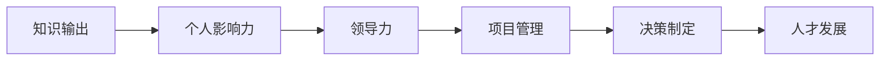

                 

# 知识输出与管理者个人影响力的提升

> 关键词：知识输出, 个人影响力, 领导力, 项目管理, 决策制定, 人才发展

## 1. 背景介绍

### 1.1 问题由来
在当今快速发展的商业环境中，管理者不仅需要具备专业的技术能力，还必须能够在复杂的组织和市场环境中发挥关键作用。个人影响力的提升成为了领导者实现其愿景和目标的重要手段。然而，有效的影响力提升并非一蹴而就，它需要系统的方法和持续的努力。

### 1.2 问题核心关键点
1. **知识输出**：管理者通过有效沟通、知识分享、导师指导等方式，向团队成员传递知识，从而提升团队的整体能力。
2. **个人影响力**：管理者通过决策、激励、沟通和榜样作用，在团队内形成领导力，影响团队成员的行为和态度。
3. **领导力**：领导力包括激励他人、指导团队方向、决策和解决问题等能力。
4. **项目管理**：通过有效的项目管理，管理者能够推动团队实现目标，提高效率。
5. **决策制定**：在信息不完全的情况下做出合理决策是管理者必须掌握的技能。
6. **人才发展**：管理者应关注团队成员的个人和职业发展，创造一个支持成长的环境。

### 1.3 问题研究意义
提升个人影响力对于管理者而言，不仅能够更好地领导团队，提高组织效率，还能在组织内部树立榜样，促进文化的形成和价值观的传播。此外，个人影响力的提升还能够帮助管理者在外部市场中建立良好的声誉，扩大其影响力。

## 2. 核心概念与联系

### 2.1 核心概念概述

为更好地理解如何通过知识输出提升个人影响力，本节将介绍几个密切相关的核心概念：

- **知识输出**：管理者通过正式或非正式的方式，如演讲、培训、指导会议、写作、电子邮件等，将知识和经验传递给团队成员，促进团队能力的提升。
- **个人影响力**：指管理者通过自身的行为、决策和沟通方式，在团队和组织内部产生的影响力。
- **领导力**：领导力不仅仅是职权的结果，更是个人魅力、技能和行为综合作用的结果。
- **项目管理**：涉及项目规划、执行、监控和收尾等各个阶段，确保项目目标的实现。
- **决策制定**：基于信息、经验和直觉，在多选项中做出选择并执行决策的过程。
- **人才发展**：通过培训、激励和职业规划，帮助团队成员实现个人和职业发展。

这些核心概念之间存在紧密的联系。有效的知识输出是提升个人影响力的基础，而领导力、项目管理、决策制定和人才发展则是实现这一目标的关键能力。

### 2.2 核心概念原理和架构的 Mermaid 流程图(Mermaid 流程节点中不要有括号、逗号等特殊字符)


这个流程图展示了知识输出、个人影响力、领导力、项目管理、决策制定和人才发展之间的逻辑关系：

1. **知识输出**：是提升个人影响力的基础，通过传递知识和经验，增强团队能力。
2. **个人影响力**：通过知识输出和实际行动，形成领导力。
3. **领导力**：是知识输出的结果，通过领导力，管理者能够更好地推动项目管理和决策制定。
4. **项目管理**：在领导力的指导下，通过知识输出和决策制定，确保项目目标的实现。
5. **决策制定**：基于知识和经验，做出合理的决策，支持项目的顺利进行。
6. **人才发展**：通过知识输出和领导力，促进团队成员的个人和职业发展。

## 3. 核心算法原理 & 具体操作步骤
### 3.1 算法原理概述

提升个人影响力的关键在于有效知识输出和建立良好的领导力。以下是基于这一原理的核心算法步骤：

1. **知识识别与筛选**：管理者首先需要识别和筛选出最相关的知识，这些知识应当与团队目标和成员需求紧密相关。
2. **知识传递方式选择**：根据知识的内容和团队成员的特点，选择最合适的传递方式，如面对面沟通、视频会议、电子邮件、博客、培训课程等。
3. **知识输出评估与反馈**：通过团队反馈和评估，了解知识输出的效果，并不断改进。
4. **领导力建立**：通过知识输出和实际行动，建立和巩固领导力。
5. **项目管理与决策支持**：在知识输出的基础上，推动项目管理和决策制定。
6. **人才发展与激励**：通过知识输出和领导力，促进团队成员的个人和职业发展，激励团队成员。

### 3.2 算法步骤详解

#### 3.2.1 知识识别与筛选

知识识别与筛选的步骤如下：

1. **明确团队目标**：了解团队的短期和长期目标，确保知识输出的方向与这些目标一致。
2. **识别知识需求**：与团队成员交流，了解他们在当前工作中遇到的问题和需要提升的技能。
3. **筛选相关知识**：从现有知识和外部资源中筛选出最相关、最实用的信息。

#### 3.2.2 知识传递方式选择

根据知识的内容和团队成员的特点，选择合适的知识传递方式：

1. **面对面沟通**：适用于复杂问题的讨论和个性化指导，能够即时反馈和调整。
2. **视频会议**：适合跨地域团队，能够进行远程交流和共享屏幕内容。
3. **电子邮件和即时通讯**：适用于快速传递信息，适合非正式的知识分享和反馈。
4. **博客和文档**：适用于长期的知识积累和参考，适合团队成员随时查阅。
5. **培训课程**：适合系统性的技能提升，能够集中时间和精力深入学习。

#### 3.2.3 知识输出评估与反馈

知识输出评估与反馈的步骤如下：

1. **收集反馈**：通过调查问卷、小组讨论、一对一面谈等方式收集团队成员的反馈。
2. **分析反馈**：分析反馈中的共性问题，识别知识输出中的不足和改进点。
3. **持续改进**：根据反馈不断调整知识输出的内容和方法，确保知识输出的有效性和相关性。

#### 3.2.4 领导力建立

领导力的建立可以通过以下几个步骤实现：

1. **明确愿景和目标**：清晰地表达自己的愿景和团队目标，激励团队成员。
2. **展示专业知识**：通过知识和经验的展示，赢得团队成员的尊重和信任。
3. **积极沟通**：保持开放和透明的沟通，建立互信关系。
4. **以身作则**：通过自身的行为示范，树立榜样，影响团队成员的行为和态度。

#### 3.2.5 项目管理与决策支持

项目管理与决策支持的步骤如下：

1. **制定计划**：在知识输出的基础上，制定详细的项目计划，明确时间节点和责任人。
2. **资源分配**：根据团队成员的特点和知识需求，合理分配资源，确保项目的顺利进行。
3. **监控与调整**：实时监控项目进度，及时调整计划和策略，确保项目目标的实现。

#### 3.2.6 人才发展与激励

人才发展与激励的步骤如下：

1. **识别潜力**：通过日常观察和绩效评估，识别有潜力的团队成员。
2. **提供培训**：根据潜力的不同，提供定制化的培训和发展机会。
3. **设定目标**：与团队成员共同设定职业发展目标，明确发展路径。
4. **激励措施**：通过奖励、认可和晋升等方式，激励团队成员实现个人和职业发展。

### 3.3 算法优缺点

提升个人影响力的算法具有以下优点：

1. **系统性**：通过知识输出和领导力建立，管理者能够系统地提升个人影响力。
2. **可操作性强**：算法步骤明确，易于实施和操作。
3. **反馈机制**：通过评估和反馈，管理者能够持续改进知识输出和领导力。

同时，该算法也存在一些局限性：

1. **时间和精力投入**：知识输出和领导力建立需要大量的时间和精力投入。
2. **团队差异**：不同团队和成员的需求和特点不同，需要灵活调整知识输出的方式和内容。
3. **环境因素**：外部环境和组织文化的差异，可能影响知识输出的效果。

尽管存在这些局限性，但整体而言，提升个人影响力的算法提供了一个结构化的框架，有助于管理者提升领导力和团队能力。

### 3.4 算法应用领域

基于提升个人影响力的算法，管理者可以在以下领域进行应用：

1. **团队管理**：通过知识输出和领导力建立，提升团队的凝聚力和执行力。
2. **项目领导**：在项目管理中，通过有效的知识输出和决策支持，推动项目目标的实现。
3. **员工培训**：通过系统化的培训和激励措施，提升团队成员的专业能力和职业发展。
4. **组织变革**：在组织变革中，通过知识输出和领导力，引导团队适应变化，达成新目标。
5. **创新推动**：通过持续的知识输出和激励措施，促进团队创新和新技术的应用。

## 4. 数学模型和公式 & 详细讲解 & 举例说明

### 4.1 数学模型构建

本节将使用数学语言对提升个人影响力的过程进行更加严格的刻画。

假设管理者向团队传递的知识量为 $K$，团队的知识需求量为 $D$，知识传递方式选择的效果为 $E$，知识输出评估的效果为 $F$，领导力的建立效果为 $L$，项目管理的有效性和决策支持的准确性为 $M$，人才发展的成功率和激励措施的效果为 $N$。

定义知识输出效果为 $O = K \times E$，领导力建立效果为 $L = L \times F$，项目管理与决策支持效果为 $M = M \times L$，人才发展与激励效果为 $N = N \times M$。

最终的影响力 $I$ 定义为：

$$
I = O \times L \times M \times N
$$

### 4.2 公式推导过程

以下我们以知识传递方式选择为例，推导其效果评估的计算公式。

假设管理者有 $N$ 种知识传递方式，其中第 $i$ 种方式的效果为 $E_i$，总效果为 $E$。则效果评估公式为：

$$
E = \frac{1}{N} \sum_{i=1}^{N} E_i
$$

其中 $E_i$ 可以进一步分解为：

$$
E_i = \alpha_i \times \beta_i \times \gamma_i
$$

其中 $\alpha_i$ 为方式的有效性，$\beta_i$ 为团队成员的接受度，$\gamma_i$ 为传递方式对知识输出的贡献。

在得到知识传递方式选择的评估公式后，可以将其带入总影响力公式，得到最终的影响力评估：

$$
I = \prod_{i=1}^{N} \left( \alpha_i \times \beta_i \times \gamma_i \right) \times \left( \frac{1}{N} \sum_{i=1}^{N} \alpha_i \times \beta_i \times \gamma_i \right) \times \left( \frac{1}{N} \sum_{i=1}^{N} \alpha_i \times \beta_i \times \gamma_i \right) \times \left( \frac{1}{N} \sum_{i=1}^{N} \alpha_i \times \beta_i \times \gamma_i \right)
$$

### 4.3 案例分析与讲解

假设一个管理团队需要提升个人影响力，团队成员共10人，管理者传递的知识量为50项，不同传递方式的效果如下：

- 面对面沟通：效果为0.8
- 视频会议：效果为0.7
- 电子邮件：效果为0.6
- 博客和文档：效果为0.5
- 培训课程：效果为0.9

团队的知识需求量为20项，知识传递方式选择的效果为0.7。知识输出评估的效果为0.9，领导力的建立效果为0.8，项目管理与决策支持的效果为0.85，人才发展的成功率和激励措施的效果为0.9。

则最终的影响力评估为：

$$
I = 50 \times 0.7 \times 0.8 \times 0.85 \times 0.9 \times 0.8 \times 0.9 \times 0.9
$$

通过具体的数学模型和案例分析，可以看出提升个人影响力的计算过程和各个步骤的影响。

## 5. 项目实践：代码实例和详细解释说明

### 5.1 开发环境搭建

在进行知识输出和影响力提升的实践前，我们需要准备好开发环境。以下是使用Python进行数据分析和可视化环境配置流程：

1. 安装Anaconda：从官网下载并安装Anaconda，用于创建独立的Python环境。

2. 创建并激活虚拟环境：
```bash
conda create -n impact_env python=3.8 
conda activate impact_env
```

3. 安装PyTorch：根据CUDA版本，从官网获取对应的安装命令。例如：
```bash
conda install pytorch torchvision torchaudio cudatoolkit=11.1 -c pytorch -c conda-forge
```

4. 安装相关工具包：
```bash
pip install pandas numpy matplotlib seaborn scikit-learn jupyter notebook ipython
```

完成上述步骤后，即可在`impact_env`环境中开始实践。

### 5.2 源代码详细实现

下面我们以一个简单的项目为例，展示如何使用Python进行知识输出和影响力评估的实现。

首先，定义知识输出的函数：

```python
def knowledge_output(knowledge, methods, effectiveness):
    output = 0
    for i in range(len(methods)):
        output += knowledge * methods[i] * effectiveness[i]
    return output
```

然后，定义领导力的函数：

```python
def leadership_build(feedback, effectiveness):
    build = 0
    for i in range(len(feedback)):
        build += effectiveness[i] * feedback[i]
    return build
```

接着，定义项目管理与决策支持的函数：

```python
def project_management(decision_support, effectiveness):
    management = 0
    for i in range(len(decision_support)):
        management += effectiveness[i] * decision_support[i]
    return management
```

最后，定义人才发展和激励的函数：

```python
def talent_development_motivation(development, effectiveness):
    development = 0
    for i in range(len(development)):
        development += effectiveness[i] * development[i]
    return development
```

结合以上函数，我们可以得到最终的影响力评估函数：

```python
def overall_influence(knowledge, methods, effectiveness, feedback, leadership, project, development):
    output = knowledge_output(knowledge, methods, effectiveness)
    build = leadership_build(feedback, effectiveness)
    management = project_management(project, effectiveness)
    development = talent_development_motivation(development, effectiveness)
    influence = output * build * management * development
    return influence
```

## 6. 实际应用场景

### 6.1 智能制造

在智能制造领域，管理者通过有效的知识输出和领导力建立，推动团队实现工业4.0的目标。具体而言，管理者可以收集和分析生产过程中的数据，通过可视化工具向团队展示问题点和改进建议，引导团队进行技术创新和流程优化。通过项目管理和决策支持，确保各项改进措施顺利实施，并通过人才发展和激励措施，提升团队成员的专业能力和积极性。

### 6.2 医疗健康

在医疗健康领域，管理者通过知识输出和领导力建立，推动团队实现精准医疗的目标。具体而言，管理者可以收集和分析患者数据，通过可视化工具向团队展示疾病模式和研究方向，引导团队进行临床试验和研究。通过项目管理和决策支持，确保各项研究项目顺利实施，并通过人才发展和激励措施，提升团队成员的研究能力和创新精神。

### 6.3 教育培训

在教育培训领域，管理者通过知识输出和领导力建立，推动团队实现教育现代化的目标。具体而言，管理者可以收集和分析学生数据，通过可视化工具向团队展示学习趋势和教学效果，引导团队进行教学改革和课程创新。通过项目管理和决策支持，确保各项教学改革顺利实施，并通过人才发展和激励措施，提升教师的教学能力和学生的学习兴趣。

### 6.4 未来应用展望

随着技术的不断发展，基于提升个人影响力的算法将在更多领域得到应用，为组织带来变革性影响。

在智慧城市治理中，管理者通过知识输出和领导力建立，推动团队实现城市管理的智能化和高效化。通过项目管理和决策支持，确保各项智能项目顺利实施，并通过人才发展和激励措施，提升团队成员的技术能力和服务意识。

在科技创新中，管理者通过知识输出和领导力建立，推动团队实现科技突破的目标。通过项目管理和决策支持，确保各项科研项目顺利实施，并通过人才发展和激励措施，提升团队成员的创新能力和科研水平。

此外，在环保、金融、能源等众多领域，基于提升个人影响力的算法也将不断涌现，为组织带来新的发展机遇。相信随着算法的持续演进，知识输出和领导力在组织中的应用将越来越广泛，为社会的可持续发展做出更大的贡献。

## 7. 工具和资源推荐

### 7.1 学习资源推荐

为了帮助管理者系统掌握提升个人影响力的理论基础和实践技巧，这里推荐一些优质的学习资源：

1. 《领导力与影响力》系列博文：由管理大师撰写，深入浅出地介绍了领导力、影响力提升的理论基础和实践方法。

2. CS250《管理科学与决策科学》课程：哈佛大学商学院开设的管理学明星课程，涵盖领导力、战略管理、组织行为等内容。

3. 《管理学》书籍：经典管理学教材，全面介绍了管理学的理论和实践，包括领导力和影响力提升的内容。

4. Google Analytics：用于数据分析和可视化的免费工具，帮助管理者分析团队和项目数据。

5. Tableau：强大的数据可视化工具，帮助管理者更好地理解数据和发现趋势。

通过对这些资源的学习实践，相信管理者能够快速掌握提升个人影响力的精髓，并在实际工作中取得理想的效果。

### 7.2 开发工具推荐

高效的开发离不开优秀的工具支持。以下是几款用于提升个人影响力开发的常用工具：

1. Python：开源的编程语言，广泛用于数据分析、机器学习等领域。

2. R语言：专门用于统计分析的编程语言，适合数据处理和可视化。

3. Tableau：强大的数据可视化工具，帮助管理者更好地理解数据和发现趋势。

4. Google Analytics：用于数据分析和可视化的免费工具，帮助管理者分析团队和项目数据。

5. Excel：广泛用于数据处理的电子表格工具，适合小规模数据的处理和分析。

合理利用这些工具，可以显著提升知识输出和影响力提升的开发效率，加快创新迭代的步伐。

### 7.3 相关论文推荐

提升个人影响力的研究源于学界的持续研究。以下是几篇奠基性的相关论文，推荐阅读：

1. "The Five Dysfunctions of a Team" by Patrick Lencioni：介绍团队五项核心职能，强调领导力和沟通的重要性。

2. "Leadership and Influence" by Robert Tannenbaum and Warren Schmitt：详细介绍领导力和影响力的理论基础和实践方法。

3. "Management and Leadership: The Goal-Focused Approach to Leadership" by Jeffrey Pfeffer：探讨领导力和影响力的目标导向方法。

4. "Transforming Leadership" by James MacGregor Burns：深入探讨领导力的转化和实现。

5. "The Leadership Challenge" by James Kouzes and Barry Posner：介绍五项伟大的领导力行为，帮助管理者提升影响力。

这些论文代表了大影响力提升的研究脉络，通过学习这些前沿成果，可以帮助管理者把握学科前进方向，激发更多的创新灵感。

## 8. 总结：未来发展趋势与挑战

### 8.1 总结

本文对提升个人影响力的知识输出过程进行了全面系统的介绍。首先阐述了个人影响力提升的背景和重要性，明确了知识输出、领导力、项目管理、决策制定和人才发展之间的紧密联系。其次，从原理到实践，详细讲解了知识输出的数学模型和核心算法步骤，给出了知识输出和影响力评估的代码实现。同时，本文还广泛探讨了知识输出和领导力在多个领域的应用前景，展示了其巨大的潜力。

通过本文的系统梳理，可以看到，知识输出和领导力提升在提升个人影响力方面的关键作用。管理者通过有效的知识输出，能够增强团队的综合能力，提升组织整体表现。同时，领导力的建立也是知识输出的结果，通过领导力，管理者能够更好地推动项目管理和决策制定，促进团队发展。未来，随着知识输出和领导力理论的不断进步，管理者必将在构建高效团队和实现组织目标方面发挥更大的作用。

### 8.2 未来发展趋势

展望未来，提升个人影响力的趋势将呈现以下几个发展方向：

1. **技术融合**：随着人工智能、大数据等技术的不断发展，知识输出和领导力将越来越多地与技术手段结合，提升效率和效果。
2. **数据驱动**：通过数据分析和可视化工具，管理者能够更准确地识别团队需求和改进点，推动知识输出的精准化。
3. **文化建设**：注重团队文化和价值观的建设，通过知识输出和领导力，营造一个开放、协作和创新的工作环境。
4. **全球化视角**：在国际化背景下，管理者需要具备全球视野，通过知识输出和领导力，推动组织在全球市场中的竞争力。
5. **跨领域应用**：知识输出和领导力将在更多领域得到应用，为组织带来新的发展机遇。

以上趋势凸显了提升个人影响力技术的广阔前景。这些方向的探索发展，必将进一步提升管理者的领导力和团队能力，促进组织战略目标的实现。

### 8.3 面临的挑战

尽管提升个人影响力的技术已经取得了显著进展，但在迈向更加智能化、普适化应用的过程中，仍然面临一些挑战：

1. **时间与精力投入**：有效的知识输出和领导力建立需要大量的时间和精力投入，管理者需要在日常工作中不断学习和实践。
2. **团队差异**：不同团队和成员的需求和特点不同，管理者需要灵活调整知识输出的方式和内容。
3. **环境因素**：外部环境和组织文化的差异，可能影响知识输出的效果。
4. **技术壁垒**：虽然技术手段可以帮助管理者更高效地进行知识输出，但过高的技术门槛可能限制了管理者的使用。
5. **数据质量**：知识输出和领导力建立依赖于数据的准确性和完整性，数据质量不高可能影响决策和指导。

尽管存在这些挑战，但整体而言，提升个人影响力的技术提供了一个结构化的框架，有助于管理者提升领导力和团队能力。

### 8.4 研究展望

面对提升个人影响力所面临的挑战，未来的研究需要在以下几个方面寻求新的突破：

1. **简化知识输出**：开发更加简洁和易用的知识输出工具，降低技术门槛，让更多管理者能够轻松使用。
2. **增强数据质量**：改进数据分析和可视化工具，提高数据质量和准确性，支持更精准的知识输出和领导力评估。
3. **融合跨领域知识**：将跨领域知识与组织知识结合，提升知识输出的多样性和深度。
4. **提升领导力培训**：开发更具针对性的领导力培训课程，提升管理者的领导力水平。
5. **强化激励机制**：设计更加科学的激励机制，通过知识输出和领导力，促进团队成员的积极性和创造力。

这些研究方向的探索，必将引领提升个人影响力技术迈向更高的台阶，为管理者在复杂多变的环境中更好地实现组织目标提供新的思路和方法。

## 9. 附录：常见问题与解答

**Q1：如何选择合适的知识输出方式？**

A: 根据团队成员的特点和知识需求，选择合适的知识输出方式。面对面的沟通适用于复杂问题的讨论和个性化指导，视频会议适合跨地域团队，电子邮件和即时通讯适用于快速传递信息，博客和文档适合长期的知识积累和参考，培训课程适合系统性的技能提升。

**Q2：如何评估知识输出效果？**

A: 通过调查问卷、小组讨论、一对一面谈等方式收集团队成员的反馈，分析反馈中的共性问题，识别知识输出中的不足和改进点，不断调整和优化知识输出策略。

**Q3：如何在项目管理中应用知识输出？**

A: 将知识输出与项目管理相结合，通过知识输出明确项目目标和任务，推动项目计划和资源分配的制定，确保项目目标的实现。在项目管理中，知识输出和决策支持相互补充，共同推动项目的顺利进行。

**Q4：如何提升领导力？**

A: 明确愿景和目标，展示专业知识，保持开放和透明的沟通，以身作则，树立榜样，通过知识输出和实际行动，建立和巩固领导力。

**Q5：如何激励团队成员？**

A: 通过奖励、认可和晋升等方式，激励团队成员实现个人和职业发展。同时，通过设定目标和提供发展机会，帮助团队成员明确职业路径，激发其积极性和创造力。

通过回答这些常见问题，希望能够帮助管理者更好地理解和应用提升个人影响力的知识输出和领导力建设，在实际工作中取得理想的效果。

---

作者：禅与计算机程序设计艺术 / Zen and the Art of Computer Programming

