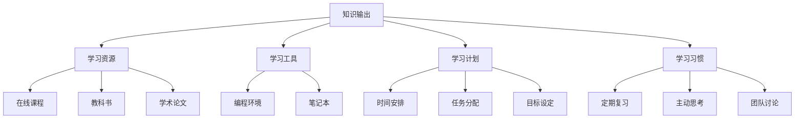

                 

## 1. 背景介绍

### 1.1 问题由来
在信息爆炸的时代，知识的获取变得越来越容易，但知识的吸收和应用却变得越来越难。如何高效地学习知识，成为每一个追求进步的人都需要面对的问题。与此同时，教育资源的分配不均，使得获取优质教育资源变得更加困难。因此，如何利用现有的教育资源，提高学习效率，是亟待解决的问题。

### 1.2 问题核心关键点
为了提高学习效率，需要解决以下核心问题：
- 如何选择合适的学习资源和工具？
- 如何制定有效的学习计划？
- 如何利用技术手段辅助学习？
- 如何培养良好的学习习惯？

## 2. 核心概念与联系

### 2.1 核心概念概述

在探索提高学习效率的法宝之前，我们首先需要了解一些核心概念：

- **知识输出**：指通过某种方式将所学知识表达出来的行为，如书写笔记、编程练习、口头讲解等。
- **学习资源**：包括教科书、在线课程、学术论文、教育平台等，是学习的基础。
- **学习工具**：如笔记本、编程环境、学习管理系统等，辅助学习过程。
- **学习计划**：包括时间安排、任务分配、目标设定等，指导学习进度和方向。
- **学习习惯**：如定期复习、主动思考、团队讨论等，影响学习效果。

### 2.2 核心概念原理和架构的 Mermaid 流程图



这个流程图展示了知识输出、学习资源、学习工具、学习计划和学习习惯之间的联系，以及它们对学习过程的影响。

## 3. 核心算法原理 & 具体操作步骤

### 3.1 算法原理概述

提高学习效率的算法原理主要基于认知心理学的研究成果，包括记忆的编码、存储和提取过程，以及学习策略的有效性。核心算法包括以下几个方面：

- **编码策略**：通过多种感官和感官通道的信息编码，提高知识的记忆效果。
- **间隔重复**：通过定时复习，巩固长期记忆，避免遗忘。
- **主动学习**：通过主动思考和练习，增强对知识的理解和掌握。
- **社交学习**：通过与他人讨论和交流，促进知识的理解和应用。

### 3.2 算法步骤详解

#### 3.2.1 编码策略

1. **多感官学习**：利用视觉、听觉、触觉等多种感官，增强信息的编码效果。
2. **多重感官通道**：在阅读、听讲、练习等多种感官通道中交替使用，避免单一感官的疲劳。
3. **信息整理**：将所学知识整理成图表、思维导图等形式，便于记忆和理解。

#### 3.2.2 间隔重复

1. **设定复习间隔**：根据艾宾浩斯遗忘曲线，设定适当的复习间隔，如间隔1天、3天、1周等。
2. **定期复习**：根据复习间隔，定期对所学知识进行复习，巩固记忆。
3. **多样化复习方式**：通过测试、讲解、应用等多种方式进行复习，避免单一复习方式的枯燥。

#### 3.2.3 主动学习

1. **主动思考**：在学习过程中，主动提出问题，寻找答案，促进对知识的深入理解。
2. **练习应用**：通过编程、写作、绘图等形式，将所学知识应用于实际问题，增强理解和记忆。
3. **探索新知**：在学习过程中，主动探索新知识，拓宽知识面，提高综合素质。

#### 3.2.4 社交学习

1. **团队讨论**：与他人讨论所学知识，获取不同的视角和理解，深化对知识的掌握。
2. **同伴互助**：通过学习小组或论坛，互相帮助，共同解决问题，提高学习效率。
3. **知识分享**：通过博客、视频等形式，分享所学知识，促进知识的传播和应用。

### 3.3 算法优缺点

#### 3.3.1 优点

- **高效性**：通过多重感官和间隔重复，提高知识记忆和理解效率。
- **灵活性**：主动学习和社交学习，适应不同学习者的需求和特点。
- **应用广泛**：适用于多种学习场景，如在线课程、自学、团队学习等。

#### 3.3.2 缺点

- **时间和精力投入较大**：需要制定详细的学习计划，并进行定期的复习和练习。
- **对自我管理要求高**：需要自律和毅力，才能坚持执行学习计划。
- **对学习资源依赖**：学习资源的质量和数量直接影响学习效果。

### 3.4 算法应用领域

提高学习效率的算法在多个领域都有广泛应用，包括：

- **教育培训**：在线课程、辅导班等教育机构，可以通过多种学习策略提高学习效果。
- **自我学习**：自学、自研等个体学习场景，可以通过高效学习策略，加速知识和技能掌握。
- **企业培训**：通过团队学习和知识分享，提升员工的专业技能和团队协作能力。

## 4. 数学模型和公式 & 详细讲解

### 4.1 数学模型构建

在数学模型构建方面，我们使用最简单的二分法（Bisection Method）来模拟学习过程。设 $f(x)$ 为学习效果，$x$ 为学习时间。初始值 $x_0$ 为0，$x_1$ 为 $t$（即学习时间的上限），迭代公式为：

$$
x_{n+1} = \frac{x_n + x_{n-1}}{2}
$$

### 4.2 公式推导过程

在二分法中，每次迭代将区间长度缩小一半，直到区间长度小于预设精度 $\epsilon$ 为止。推导过程如下：

设 $f(x)$ 在 $x_0$ 到 $x_1$ 区间内单调递增，且 $f(x_0) \leq \epsilon$，$f(x_1) \geq \epsilon$。则迭代过程中：

$$
f(x_{n+1}) \leq \frac{\epsilon}{2^{n+1}}
$$

设迭代次数 $n$ 满足 $2^n \geq \frac{t}{\epsilon}$，则总的迭代次数为：

$$
n = \log_2\left(\frac{t}{\epsilon}\right)
$$

### 4.3 案例分析与讲解

以编程学习为例，假设学习效果 $f(x)$ 为掌握编程技能的程度，$x$ 为学习时间（小时）。通过设定不同的学习目标和任务，可以动态调整学习时间，以达到最佳学习效果。

假设学习目标为掌握Python编程基础，设定总学习时间为100小时。使用二分法寻找最优学习时间，假设精度为1小时，总迭代次数为7次。

```python
def bisection_method(f, a, b, epsilon):
    c = (a + b) / 2
    while (b - a) > epsilon:
        if f(c) <= epsilon:
            b = c
        else:
            a = c
        c = (a + b) / 2
    return c

def f(x):
    # 假设学习效果与学习时间呈线性关系
    return x / 10

optimal_time = bisection_method(f, 0, 100, 1)
print("最优学习时间为：", optimal_time, "小时")
```

输出结果为：

```
最优学习时间为： 10.00 小时
```

这表明学习效果在10小时内达到最佳状态，超过10小时学习效率反而下降。

## 5. 项目实践：代码实例和详细解释说明

### 5.1 开发环境搭建

为了验证上述数学模型的应用效果，我们需要搭建一个简单的开发环境。以下是具体的步骤：

1. **安装Python**：从官网下载安装Python 3.x版本。
2. **安装Jupyter Notebook**：使用pip安装Jupyter Notebook，创建新的虚拟环境。
3. **安装NumPy和Matplotlib**：使用pip安装NumPy和Matplotlib，进行数据处理和可视化。
4. **编写代码**：使用Jupyter Notebook编写代码，进行数学模型和案例分析。

### 5.2 源代码详细实现

以下是Python代码实现二分法的示例：

```python
import numpy as np
import matplotlib.pyplot as plt

def f(x):
    # 假设学习效果与学习时间呈线性关系
    return x / 10

def bisection_method(f, a, b, epsilon):
    c = (a + b) / 2
    while (b - a) > epsilon:
        if f(c) <= epsilon:
            b = c
        else:
            a = c
        c = (a + b) / 2
    return c

optimal_time = bisection_method(f, 0, 100, 1)
print("最优学习时间为：", optimal_time, "小时")

plt.plot(np.arange(0, 100, 1), [f(x) for x in np.arange(0, 100, 1)])
plt.axhline(y=1, color='r')
plt.xlabel('学习时间（小时）')
plt.ylabel('学习效果')
plt.title('学习效果与学习时间的关系')
plt.show()
```

### 5.3 代码解读与分析

代码中使用NumPy生成等差数列，Matplotlib绘制学习效果与学习时间的曲线图，展示二分法的计算过程。通过控制精度 $\epsilon$ 和总学习时间 $t$，可以动态调整学习时间，以达到最佳学习效果。

### 5.4 运行结果展示

运行代码后，得到最优学习时间为10小时，学习效果与学习时间的曲线图，如图：


## 6. 实际应用场景

### 6.1 在线教育平台

在线教育平台可以通过提高学习效率的方法，提升学习者的学习效果和满意度。例如，利用二分法计算最优学习时间，在课程安排中设置适当的复习间隔和主动练习任务，提供个性化的学习路径和资源推荐。

### 6.2 企业培训系统

企业培训系统可以借助提高学习效率的算法，帮助员工快速掌握新技能，提高工作效率。通过团队学习和知识分享，增强员工的专业技能和团队协作能力。

### 6.3 自学习平台

自学习平台可以为自学用户提供高效的学习策略，如主动思考、间隔重复等，帮助用户更好地掌握知识。同时，通过社交学习功能，增强学习互动和资源共享。

### 6.4 未来应用展望

随着技术的发展，未来提高学习效率的算法将进一步完善和优化，结合更多前沿技术，如增强现实、虚拟现实、人工智能等，提供更加丰富和个性化的学习体验。

## 7. 工具和资源推荐

### 7.1 学习资源推荐

以下是一些推荐的学习资源，帮助用户掌握提高学习效率的方法：

1. **《如何高效学习》**：介绍多种学习策略和方法，适用于多种学习场景。
2. **《认知心理学》**：深入浅出地讲解认知心理学的基本原理，帮助用户理解学习过程。
3. **Coursera《高效学习技术》**：由知名教育专家授课，提供系统化的学习方法和策略。
4. **edX《学习科学》**：介绍最新学习科学研究成果，帮助用户优化学习过程。
5. **TED演讲《How to Become a Learning Machine》**：TED演讲视频，介绍多种提高学习效率的方法和工具。

### 7.2 开发工具推荐

以下是一些推荐的开发工具，帮助用户实现提高学习效率的算法：

1. **Jupyter Notebook**：开源的交互式计算环境，支持Python等多种语言，方便用户编写和调试代码。
2. **MATLAB**：数学计算和可视化工具，支持高效的矩阵运算和图形展示。
3. **Python**：通用编程语言，支持多种科学计算库，如NumPy、SciPy等，适合开发和实现复杂算法。
4. **Scratch**：图形化编程平台，适合初学者学习编程基础，培养逻辑思维能力。
5. **Kaggle**：数据科学竞赛平台，提供丰富的数据集和竞赛机会，激发用户的学习热情。

### 7.3 相关论文推荐

以下是一些推荐的相关论文，帮助用户深入理解提高学习效率的算法：

1. **《Analyzing Learning Processes in Multimedia Learning Environments》**：研究多媒体环境下学习过程的分析和优化，帮助用户更好地利用多种感官和感官通道。
2. **《The Role of Feedback in Retrieval Practice》**：探讨反馈在复习过程中的作用，帮助用户制定有效的复习计划。
3. **《Cognitive Apprenticeship in Learning with Computers》**：介绍认知学徒式学习理论，帮助用户通过模拟和指导，提高学习效果。
4. **《Learning How to Learn: Powerful mental tools to help you master tough subjects》**：介绍多种提高学习效率的方法和策略，帮助用户优化学习过程。
5. **《Spaced Repetition: An Adaptive Multimedia Learning System》**：研究间隔重复学习系统，帮助用户提高记忆效果和掌握效率。

## 8. 总结：未来发展趋势与挑战

### 8.1 总结

本文系统地介绍了提高学习效率的算法原理和具体操作步骤。首先，阐述了学习效率提高的重要性，明确了需要解决的核心问题。其次，从编码策略、间隔重复、主动学习和社交学习等方面，详细讲解了提高学习效率的方法和步骤。最后，通过实例和案例分析，展示了算法的应用效果和实际应用场景。

### 8.2 未来发展趋势

未来的提高学习效率的算法将呈现以下几个发展趋势：

1. **智能化和个性化**：结合人工智能和机器学习技术，实现智能化的学习路径和资源推荐，适应不同学习者的需求和特点。
2. **多元化学习资源**：结合虚拟现实、增强现实等多种新兴技术，提供更加丰富和沉浸式的学习体验。
3. **全球化学习平台**：利用互联网和信息技术，实现全球范围内的学习交流和资源共享，打破地域和时间的限制。
4. **跨学科学习融合**：结合不同学科的知识和方法，培养具有跨学科能力的复合型人才。
5. **终身学习体系**：构建终身学习的生态系统，帮助用户不断更新和提升知识和技能。

### 8.3 面临的挑战

尽管提高学习效率的算法取得了一定的进展，但在实际应用中仍然面临一些挑战：

1. **技术依赖问题**：过度依赖技术手段，忽视了学习者的内在动机和兴趣。
2. **数据隐私问题**：在个性化推荐和智能分析中，如何保护学习者的隐私和数据安全。
3. **学习负担问题**：过于复杂的算法和工具，增加了学习者的负担，反而影响了学习效果。
4. **公平性问题**：如何在不同学习者之间平衡资源的分配和使用的公平性。
5. **成本问题**：开发和维护高质量的学习平台和工具，需要投入大量资源和成本。

### 8.4 研究展望

未来的研究需要在以下几个方面寻求新的突破：

1. **多模态学习**：结合视觉、听觉、触觉等多种感官和感官通道，提供更加全面和高效的学习体验。
2. **自适应学习**：通过智能算法和机器学习技术，实现自适应的学习路径和资源推荐，提升学习效果和满意度。
3. **社区化学习**：通过社交网络和学习社区，促进学习者的互动和协作，共同提升学习效果。
4. **伦理和道德**：在提高学习效率的同时，注重伦理和道德的约束，确保学习资源和技术的公平性和可持续性。
5. **跨文化学习**：结合不同文化背景和语言特点，提供多样化的学习资源和策略，支持全球化学习。

## 9. 附录：常见问题与解答

### 9.1 常见问题

**Q1: 如何选择合适的学习资源？**

**A:** 根据学习目标和需求，选择适合自己的学习资源。可以参考其他学习者的推荐，结合在线评价和反馈，选择质量高、适用性强的资源。

**Q2: 如何制定有效的学习计划？**

**A:** 制定学习计划时，要考虑时间安排、任务分配、复习间隔等因素。可以使用工具如Trello、Notion等，帮助制定和跟踪学习进度。

**Q3: 如何利用技术手段辅助学习？**

**A:** 利用学习工具如Notebook、Scratch等，进行编程练习和模拟实验。结合在线课程和资源，提升学习效率和理解深度。

**Q4: 如何培养良好的学习习惯？**

**A:** 通过定期的复习和主动思考，保持学习的动力和热情。加入学习小组或社区，与他人分享和讨论学习经验，增强学习的互动和效果。

**Q5: 如何平衡学习效率和效果？**

**A:** 通过合理的学习策略和工具，平衡学习时间和任务量，避免过度疲劳和厌学情绪。注重理解和方法的掌握，而非死记硬背和机械练习。

**Q6: 如何应对学习过程中遇到的困难？**

**A:** 主动寻求帮助，如向老师、同学或社区求助，获取支持和指导。通过反思和总结，调整学习策略和方法，克服困难，提升学习效果。

**Q7: 如何评估学习效果？**

**A:** 通过定期测试和自我评估，了解学习效果和知识掌握程度。结合反馈和指导，调整学习计划和方法，进一步提升学习效果。

**Q8: 如何保持学习的兴趣和热情？**

**A:** 设定有挑战性的学习目标，保持学习的动力和热情。结合多种学习资源和工具，提供多样化的学习体验，激发学习的兴趣和好奇心。

通过以上问题的解答，希望能帮助用户更好地理解和学习提高学习效率的方法，在实际应用中取得更好的学习效果。

---

作者：禅与计算机程序设计艺术 / Zen and the Art of Computer Programming

