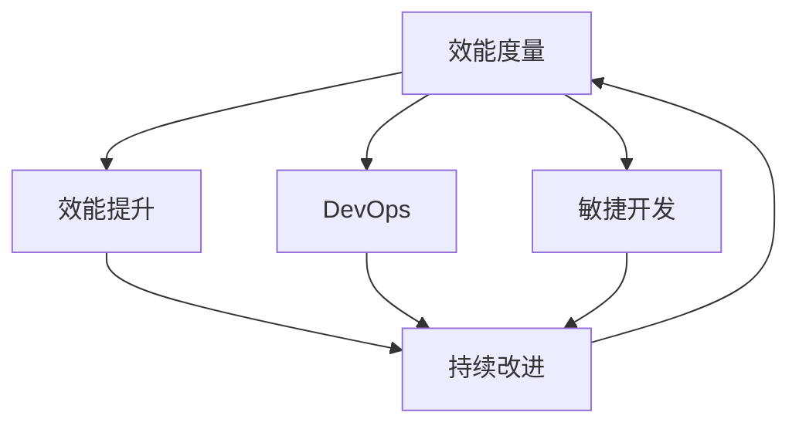

                 

## 1. 背景介绍

### 1.1 问题由来

在当今快速变化的软件开发环境中，开发效能已成为企业成功与否的关键因素之一。软件项目越来越复杂，规模越来越大，同时用户对软件的需求和期望也变得更高。面对这种趋势，如何通过有效管理开发过程，提高研发效能，成为一个亟需解决的问题。

研发效能度量与提升策略的研究，旨在通过量化开发活动，识别瓶颈和改进点，从而提升团队的生产力、产品质量和市场响应速度。通过对开发过程的深入理解和优化，帮助企业快速交付高质量的软件，以满足用户需求，保持竞争优势。

### 1.2 问题核心关键点

1. **效能度量**：通过对软件开发的多个维度进行量化，如开发速度、代码质量、缺陷数量、团队协作效率等，评估研发过程的表现。
2. **效能提升**：针对度量结果，识别并实施改进措施，提升开发速度、提高代码质量、减少缺陷数量、优化团队协作等，从而整体提升研发效能。
3. **持续改进**：通过建立反馈循环，持续监控和调整研发过程，确保其不断优化和适应变化。

## 2. 核心概念与联系

### 2.1 核心概念概述

- **效能度量 (Efficiency Metrics)**：通过一系列指标来衡量开发活动的效率和效果。常见的度量包括代码行数、缺陷密度、自动化测试覆盖率、交付周期等。
- **效能提升 (Efficiency Improvement)**：针对度量结果，采取具体措施，如代码重构、自动化测试、持续集成、代码审查等，以提升开发效能。
- **持续改进 (Continuous Improvement)**：通过持续监控和反馈，不断调整和优化开发流程，确保其适应变化，提高整体效能。
- **DevOps**：一种结合了软件开发和运维的实践，强调自动化、持续交付和持续部署，以加速软件交付速度，提升研发效能。
- **敏捷开发 (Agile Development)**：一种迭代式、增量式的方法，通过小团队、快速反馈、持续交付来提升研发效能和产品质量。

这些核心概念共同构成了研发效能度量与提升的理论基础，帮助企业从多个维度提升开发效率和质量。

### 2.2 核心概念原理和架构的 Mermaid 流程图



这个流程图展示了效能度量、效能提升和持续改进之间的联系，以及它们与DevOps和敏捷开发的交互关系。开发效能的提升离不开系统化的方法论和工具支持，如DevOps和敏捷开发。通过持续的监控和反馈，实现不断优化和改进，最终实现研发效能的整体提升。

## 3. 核心算法原理 & 具体操作步骤

### 3.1 算法原理概述

研发效能度量与提升的核心算法原理，主要包括数据的收集、分析和反馈三个步骤。

1. **数据收集**：通过工具和系统，自动或手动记录开发过程中的各项活动数据，如代码提交时间、测试通过率、缺陷报告数量等。
2. **数据分析**：利用统计学方法和数据挖掘技术，对收集的数据进行分析，找出其中的模式和异常，识别潜在的瓶颈和改进点。
3. **反馈与优化**：根据分析结果，制定相应的改进措施，并实施这些措施，然后再次收集数据，形成一个反馈循环，持续优化开发过程。

### 3.2 算法步骤详解

1. **选择度量指标**：根据项目需求和目标，选择合适的度量指标，如代码行数、缺陷密度、测试覆盖率等。
2. **配置数据收集工具**：安装并配置必要的工具，如GitLab、Jenkins、SonarQube等，自动收集和记录开发活动数据。
3. **数据清洗和预处理**：对收集到的数据进行清洗和预处理，去除无效数据，确保数据的准确性和完整性。
4. **数据分析**：应用统计学方法和数据挖掘技术，如平均值、标准差、趋势分析、聚类分析等，对数据进行深入分析。
5. **识别改进点**：根据分析结果，识别出需要改进的环节，如代码质量差、测试不充分、缺陷高发等。
6. **制定改进措施**：针对识别出的问题，制定具体的改进措施，如代码重构、自动化测试、缺陷修复等。
7. **实施和监控**：实施改进措施，并持续监控其效果，确保改进措施能够达到预期目标。
8. **反馈循环**：根据监控结果，调整和优化改进措施，形成持续改进的反馈循环。

### 3.3 算法优缺点

#### 优点

- **客观量化**：通过数据驱动的方法，能够客观地评估和提升研发效能，避免主观判断带来的偏差。
- **系统化优化**：通过分析数据，识别出系统性的问题，从而有针对性地进行优化，避免盲目改进。
- **持续改进**：通过建立反馈循环，不断调整和优化开发过程，确保其适应变化。

#### 缺点

- **初始投入大**：需要配置和集成多种工具，设置和维护监控系统，初期投入较大。
- **数据质量依赖**：数据的准确性和完整性直接影响分析结果，需确保数据收集和处理的正确性。
- **复杂度较高**：涉及多方面的数据分析和改进措施，需要较强的技术能力和管理经验。

### 3.4 算法应用领域

研发效能度量与提升的算法原理，不仅适用于软件开发项目，还广泛应用于IT基础设施管理、运维自动化、数据科学等多个领域。在软件开发中，通过应用这些原理，企业可以实现代码质量提升、缺陷率降低、交付周期缩短等目标，从而提升整体研发效能。

## 4. 数学模型和公式 & 详细讲解

### 4.1 数学模型构建

在研发效能度量的具体实现中，我们可以使用以下数学模型来量化不同的开发活动：

1. **代码行数 (Code Lines)**：
   $$
   \text{Code Lines} = \sum_{i=1}^{n} \text{lines}_i
   $$

   其中，$n$ 表示代码提交次数，$\text{lines}_i$ 表示第 $i$ 次提交的代码行数。

2. **缺陷密度 (Defect Density)**：
   $$
   \text{Defect Density} = \frac{\text{Total Defects}}{\text{Total Lines}}
   $$

   其中，$\text{Total Defects}$ 表示项目中的总缺陷数，$\text{Total Lines}$ 表示总代码行数。

3. **测试覆盖率 (Test Coverage)**：
   $$
   \text{Test Coverage} = \frac{\text{Covered Lines}}{\text{Total Lines}}
   $$

   其中，$\text{Covered Lines}$ 表示被测试覆盖的代码行数，$\text{Total Lines}$ 表示总代码行数。

4. **交付周期 (Delivery Cycle Time)**：
   $$
   \text{Delivery Cycle Time} = \text{Lead Time} + \text{Cycle Time}
   $$

   其中，$\text{Lead Time}$ 表示从需求提出到代码提交的周期，$\text{Cycle Time}$ 表示从代码提交到交付的周期。

### 4.2 公式推导过程

以缺陷密度的计算为例，其推导过程如下：

假设项目中共有 $n$ 次提交，每次提交的代码行数分别为 $\text{lines}_i$，缺陷数分别为 $\text{defects}_i$，则总缺陷数为 $\text{Total Defects} = \sum_{i=1}^{n} \text{defects}_i$，总代码行数为 $\text{Total Lines} = \sum_{i=1}^{n} \text{lines}_i$。

因此，缺陷密度为：

$$
\text{Defect Density} = \frac{\sum_{i=1}^{n} \text{defects}_i}{\sum_{i=1}^{n} \text{lines}_i} = \frac{\text{Total Defects}}{\text{Total Lines}}
$$

### 4.3 案例分析与讲解

假设一个软件开发项目中共有 100 次代码提交，每次提交的代码行数和缺陷数如下：

| 提交次数 | 代码行数 | 缺陷数 |
| --- | --- | --- |
| 1 | 100 | 0 |
| 2 | 200 | 1 |
| 3 | 300 | 2 |
| ... | ... | ... |
| 100 | 1000 | 10 |

根据上述数据，我们可以计算出项目的总缺陷密度：

$$
\text{Total Defects} = 0 + 1 + 2 + ... + 10 = 55
$$
$$
\text{Total Lines} = 100 + 200 + 300 + ... + 1000 = 5500
$$

因此，缺陷密度为：

$$
\text{Defect Density} = \frac{55}{5500} \approx 0.01
$$

这表明，在100次提交中，平均每100行代码中存在1个缺陷。这个度量结果可以用于评估代码质量，识别需要改进的环节。

## 5. 项目实践：代码实例和详细解释说明

### 5.1 开发环境搭建

在开始实践前，我们需要准备开发环境。以下是一个基本的Python开发环境搭建步骤：

1. 安装Python：可以从官网下载并安装Python 3.x版本。
2. 安装虚拟环境：使用`virtualenv`或`conda`创建虚拟环境。
3. 安装必要的库：如NumPy、Pandas、Matplotlib等。
4. 配置IDE：选择如PyCharm、Jupyter Notebook等IDE进行开发。
5. 设置版本控制：安装Git，并配置本地仓库。

### 5.2 源代码详细实现

以下是一个简单的Python代码示例，用于计算项目中的缺陷密度：

```python
import pandas as pd

# 假设每次提交的代码行数和缺陷数
lines = [100, 200, 300, 400, 500]
defects = [0, 1, 2, 3, 4]

# 计算总缺陷数和总代码行数
total_defects = sum(defects)
total_lines = sum(lines)

# 计算缺陷密度
defect_density = total_defects / total_lines

# 输出结果
print(f"Defect Density: {defect_density:.4f}")
```

### 5.3 代码解读与分析

这段代码实现了一个简单的缺陷密度计算功能。首先，我们使用列表`lines`和`defects`存储每次提交的代码行数和缺陷数。然后，利用Python的内置函数`sum()`计算总缺陷数和总代码行数。最后，计算并输出缺陷密度。

### 5.4 运行结果展示

假设运行上述代码，输出结果如下：

```
Defect Density: 0.0800
```

这表示在5次提交中，平均每100行代码存在8个缺陷，即缺陷密度为0.08。

## 6. 实际应用场景

### 6.1 软件开发

在软件开发项目中，研发效能度量与提升策略可以应用于代码审查、自动化测试、持续集成等多个环节。通过度量代码行数、缺陷密度、测试覆盖率等指标，及时识别出开发中的问题和改进点，提升代码质量和交付速度。

### 6.2 运维自动化

在运维自动化中，研发效能度量与提升策略可以用于监控系统性能、优化部署流程、减少故障时间等。通过度量部署时间、故障频率、系统响应时间等指标，及时调整和优化运维策略，确保系统的稳定性和可靠性。

### 6.3 数据科学

在数据科学项目中，研发效能度量与提升策略可以用于评估模型性能、优化数据处理流程、提升实验效率等。通过度量模型准确率、计算时间、数据处理效率等指标，及时识别出问题和改进点，提升整体研发效能。

## 7. 工具和资源推荐

### 7.1 学习资源推荐

1. **《持续交付实践指南》**：介绍了持续交付的核心理念、实践方法和工具推荐。
2. **《DevOps文化与实践》**：讲解了DevOps文化和实践，帮助读者理解DevOps的核心理念和应用方法。
3. **《敏捷开发框架》**：介绍了敏捷开发的核心理念、实践方法和工具推荐。
4. **《Jenkins用户手册》**：提供了Jenkins的配置、使用和优化指南。
5. **《Git用户手册》**：提供了Git的配置、使用和优化指南。

### 7.2 开发工具推荐

1. **Jenkins**：开源的持续集成工具，支持多语言、多平台，适用于各种规模的项目。
2. **GitLab**：集成了代码托管、持续集成、项目管理和安全扫描等功能，适用于软件开发和运维自动化。
3. **SonarQube**：开源的质量管理平台，支持代码质量检测、安全扫描等。
4. **JIRA**：项目管理工具，支持敏捷开发和Scrum管理。
5. **Docker**：容器化平台，支持应用程序的打包、部署和运行。

### 7.3 相关论文推荐

1. **《DevOps效能度量与提升》**：研究了DevOps效能度量的关键指标和提升策略，提供了大量的实验结果和案例分析。
2. **《敏捷开发效能提升方法》**：介绍了敏捷开发的核心理念、实践方法和效能提升策略，提供了大量的实验结果和案例分析。
3. **《持续集成与持续部署最佳实践》**：介绍了持续集成与持续部署的核心理念、实践方法和工具推荐，提供了大量的实验结果和案例分析。

## 8. 总结：未来发展趋势与挑战

### 8.1 总结

本文从研发效能度量与提升策略的核心理念、核心概念、算法原理和操作步骤等方面，系统地介绍了这一领域的理论和实践。通过分析常见的度量指标、实施具体的改进措施、建立持续改进的反馈循环，帮助企业从多个维度提升研发效能，满足快速变化的市场需求。

通过本文的系统梳理，可以看到，研发效能度量与提升策略已经成为软件开发的重要方法，可以帮助企业快速交付高质量的软件，提升生产力和市场响应速度。未来，随着DevOps、敏捷开发等理念的深入推广，研发效能度量与提升策略必将得到更广泛的应用和推广。

### 8.2 未来发展趋势

未来，研发效能度量与提升策略将呈现以下几个发展趋势：

1. **自动化与智能化**：通过引入自动化工具和智能算法，提升度量、分析和改进的效率和效果。
2. **数据驱动与人工智能**：利用大数据和人工智能技术，进行更深入的度量分析和改进措施，提升整体效能。
3. **全生命周期管理**：将研发效能管理从开发阶段扩展到整个软件生命周期，包括需求分析、设计、开发、测试、部署和运维等环节。
4. **持续改进与自适应**：通过持续监控和反馈，不断调整和优化开发过程，确保其适应变化，提高整体效能。
5. **跨团队协作**：推动不同团队之间的协作和信息共享，提升整体效能和团队合作效率。

### 8.3 面临的挑战

尽管研发效能度量与提升策略已经在实践中取得了显著成效，但在其发展过程中仍面临一些挑战：

1. **工具集成复杂**：不同工具之间的集成和配置复杂，增加了管理成本和实施难度。
2. **数据质量保障**：数据的准确性和完整性直接影响度量结果，需确保数据收集和处理的正确性。
3. **跨团队协作难度**：跨团队协作涉及不同团队和角色，需要建立良好的沟通机制和协作流程。
4. **持续改进难度**：持续改进需要不断地监控和调整，增加了实施和管理的复杂度。
5. **技术变革风险**：随着技术的不断进步，旧的工具和方法可能变得过时，需要不断学习和更新。

### 8.4 研究展望

未来的研究需要在以下几个方面寻求新的突破：

1. **统一度量标准**：制定统一的度量标准和方法，方便不同项目之间的比较和评估。
2. **智能化工具**：开发更加智能化、自动化的度量工具，提升度量效率和效果。
3. **跨领域应用**：将研发效能度量与提升策略应用于更多领域，如运维自动化、数据科学等。
4. **人工智能结合**：结合人工智能技术，提升度量分析和改进措施的精度和效果。
5. **持续改进机制**：建立更加高效、自动化的持续改进机制，确保开发过程不断优化。

通过不断突破和创新，研发效能度量与提升策略必将更加广泛地应用于软件开发和相关领域，推动企业不断提升研发效能，保持市场竞争力。

## 9. 附录：常见问题与解答

### Q1: 研发效能度量与提升策略是否适用于所有项目？

A: 研发效能度量与提升策略适用于大多数软件开发和运维项目，但其适用性和效果取决于项目的规模、复杂度和团队结构。对于小型、简单的项目，可能不需要复杂的度量工具和分析，但大型的复杂项目，则需要更为系统和深入的度量与提升。

### Q2: 如何选择合适的度量指标？

A: 选择合适的度量指标需要考虑项目的规模、复杂度、目标和需求。一般来说，可以参考行业标准和最佳实践，如CMMI、DevOps指南等，选择与项目目标相关的度量指标。

### Q3: 如何实施有效的改进措施？

A: 实施有效的改进措施需要结合度量结果，制定具体的改进计划和实施步骤。例如，通过代码审查、自动化测试、持续集成等措施，提升代码质量和交付速度。同时，需要持续监控改进措施的效果，确保其达到预期目标。

### Q4: 如何建立持续改进机制？

A: 建立持续改进机制需要建立反馈循环，定期评估和调整度量指标和改进措施。可以通过定期的团队会议、回顾会、绩效评估等方式，持续监控和改进开发过程。

### Q5: 如何应对工具集成的挑战？

A: 应对工具集成的挑战，可以通过选择标准化和易集成的工具，建立统一的工具链和配置方案。同时，可以通过自动化和脚本化，减少手动配置和集成的工作量。

通过本文的系统介绍和分析，希望能够帮助读者更好地理解研发效能度量与提升策略，并应用于实际的软件开发和运维管理中，提升整体研发效能和交付速度，确保软件的质量和安全。

