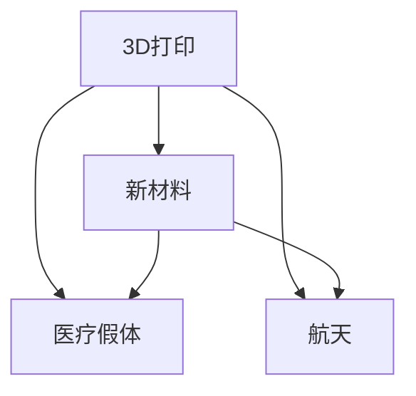

                 

# 硅谷3D打印新材料应用:医疗假体与航天

> 关键词：3D打印,新材料,医疗假体,航天,生物相容性,力学性能,增材制造,轻量化

## 1. 背景介绍

### 1.1 问题由来
随着3D打印技术的迅猛发展，新材料的应用成为推动该领域进步的关键。硅谷作为全球科技创新的中心，对新材料的探索与应用有着深远的影响。本文将聚焦于硅谷在3D打印新材料在医疗假体和航天领域的创新应用，探讨其背后的原理和挑战，并展望未来发展趋势。

### 1.2 问题核心关键点
医疗假体和航天是3D打印新材料应用的两个重要领域，涵盖了从材料制备到终端产品的全链条。本文将从这两个应用场景切入，介绍新材料在3D打印中的应用，以及如何通过优化材料性能，提升产品性能，并应对实际应用中的挑战。

## 2. 核心概念与联系

### 2.1 核心概念概述

为更好地理解硅谷在3D打印新材料的应用，本节将介绍几个密切相关的核心概念：

- **3D打印**：一种基于计算机辅助设计(CAD)和增材制造(Additive Manufacturing, AM)技术，将数字模型转化为实体模型的过程。常用的3D打印技术包括FDM、SLS、SLA、DLP等。
- **新材料**：指用于3D打印的各类新型材料，如高分子材料、金属合金、陶瓷等。这些材料具有更好的机械性能、生物相容性、热稳定性等特性。
- **医疗假体**：指用于替代人体某些功能部位的人工结构，如髋关节、膝盖、脊椎等。3D打印技术可以实现个性化设计和制造，提高假体的匹配度和舒适度。
- **航天**：包括卫星、飞船、火箭等空间器的设计、制造和发射。航天器对材料的轻量化、高强度、耐高温等性能要求高，3D打印可以满足这些要求。

这些核心概念之间的逻辑关系可以通过以下Mermaid流程图来展示：



这个流程图展示了3D打印与新材料的关系，以及新材料在医疗假体和航天中的应用。

## 3. 核心算法原理 & 具体操作步骤

### 3.1 算法原理概述

3D打印新材料的应用，基于增材制造原理，通过逐层堆积材料，最终成型。其核心在于材料的选择和处理。材料的选择取决于应用场景的需求，如医疗假体要求良好的生物相容性和力学性能，而航天领域则需考虑材料的轻量化和高强度。

### 3.2 算法步骤详解

#### 3.2.1 材料选择与处理

1. **材料选择**：根据具体应用需求选择合适的材料，如生物相容性材料用于医疗假体，高强度材料用于航天部件。常用的3D打印材料包括高分子材料（如ABS、PLA、PETG等）、金属合金（如钛合金、铝合金等）、陶瓷材料等。

2. **材料处理**：将选定的材料进行预处理，包括干燥、研磨、混合等，以确保打印过程中材料的质量和一致性。对于高分子材料，还可能需要加入添加剂，如增强纤维、光固化剂等。

#### 3.2.2 打印参数设定

1. **打印分辨率**：设定打印分辨率，即每英寸打印点数，影响最终产品的精细度。一般来说，医疗假体要求较高的分辨率，航天部件则对打印速度有较高要求。

2. **打印速度**：打印速度影响打印时间，需根据材料特性和打印体积进行设定。医疗假体打印速度相对较慢，而航天部件则需快速完成。

3. **打印温度**：不同材料有不同的最佳打印温度，需根据材料特性进行调整。如ABS材料通常在200-250°C下打印。

#### 3.2.3 打印流程控制

1. **模型导入**：将设计好的三维模型导入3D打印机，如STL、OBJ等格式。

2. **打印执行**：启动打印，打印机逐层堆积材料，最终成型。过程中需实时监测打印状态，确保材料均匀固化。

#### 3.2.4 后处理

1. **支撑移除**：对于悬空部分，需打印支撑结构，打印完成后去除支撑，以保证产品的完整性。

2. **表面处理**：对于医疗假体等需要光滑表面的应用，还需进行后处理，如打磨、抛光等。

3. **清洗与干燥**：去除打印过程中可能残留的材料和支持结构，并对打印件进行干燥处理。

### 3.3 算法优缺点

#### 3.3.1 优点

1. **个性化设计**：3D打印可以实现复杂形状的精确制造，满足个性化设计需求，尤其在医疗假体制造中，可以按患者的具体需求进行定制。

2. **材料多样性**：适用于多种材料，可以满足不同应用场景的需求，如医疗领域的高生物相容性材料，航天领域的高强度、轻量化材料。

3. **快速迭代**：通过快速打印和修改设计，可以缩短产品开发周期，降低研发成本。

4. **生产灵活性**：批量生产时，可以按需生产，减少库存压力，降低生产成本。

#### 3.3.2 缺点

1. **成本较高**：尤其是对于高精度和高强度材料，初期成本较高。

2. **技术门槛高**：3D打印技术复杂，需专业知识和设备，普通企业难以自主研发。

3. **材料限制**：某些材料在打印过程中可能会出现收缩、分层等缺陷，影响产品性能。

4. **应用场景限制**：某些材料和打印技术在特定应用场景下受限，如高分子材料在高温环境下的性能不稳定。

### 3.4 算法应用领域

3D打印新材料的应用领域广泛，主要包括医疗、航天、汽车、航空、建筑等。在硅谷，这些领域的研究和应用促进了3D打印技术的快速发展。

## 4. 数学模型和公式 & 详细讲解 & 举例说明

### 4.1 数学模型构建

在3D打印中，数学模型的构建是关键。以下以生物相容性材料制备为例，展示数学模型的构建过程。

假设有一个简单的生物相容性材料配方，包含不同材料的体积分数：

- 高分子材料 $V_{polymer}$
- 增强纤维 $V_{fiber}$
- 添加剂 $V_{additive}$

则总体积分数为：

$$
V_{total} = V_{polymer} + V_{fiber} + V_{additive}
$$

### 4.2 公式推导过程

假设材料密度分别为：
- 高分子材料密度 $\rho_{polymer}$
- 增强纤维密度 $\rho_{fiber}$
- 添加剂密度 $\rho_{additive}$

总体积为 $V$，则混合材料的密度 $\rho_{mixed}$ 可以通过下式计算：

$$
\rho_{mixed} = \frac{\rho_{polymer}V_{polymer} + \rho_{fiber}V_{fiber} + \rho_{additive}V_{additive}}{V}
$$

将上述公式代入特定材料配方，即可计算出混合材料的密度。

### 4.3 案例分析与讲解

以钛合金为例，钛合金具有高强度、轻量化、耐腐蚀等优异性能，在航天领域广泛应用。在制备钛合金3D打印材料时，需考虑以下因素：

1. 钛合金粉末的粒径：粒径越小，打印分辨率越高，但成本也越高。

2. 烧结温度：钛合金需要在高温下烧结才能保证其性能。

3. 热处理过程：打印后的钛合金需要经过热处理，以消除残余应力，提高力学性能。

## 5. 项目实践：代码实例和详细解释说明

### 5.1 开发环境搭建

在进行3D打印新材料应用实践前，我们需要准备好开发环境。以下是使用Python进行FDM 3D打印的开发环境配置流程：

1. 安装Python：从官网下载并安装Python 3.x版本。

2. 安装3D打印机控制软件：如Simplify3D、Ultimaker Cura等。

3. 安装G-code生成工具：如Slic3r、PrusaSlicer等。

4. 安装通信协议库：如PySerial，用于与打印机通信。

5. 安装数据处理库：如Pillow，用于图像处理和预览。

完成上述步骤后，即可在开发环境中进行3D打印新材料的实验。

### 5.2 源代码详细实现

以下是一个简单的3D打印新材料配方的代码实现：

```python
import numpy as np

def calculate_density(volume_p, volume_f, volume_a, density_p, density_f, density_a):
    total_volume = volume_p + volume_f + volume_a
    mixed_density = (density_p * volume_p + density_f * volume_f + density_a * volume_a) / total_volume
    return mixed_density

# 定义材料体积和密度
volume_polymer = 0.5  # 高分子材料体积分数
volume_fiber = 0.3     # 增强纤维体积分数
volume_additive = 0.2  # 添加剂体积分数

density_polymer = 1.2  # 高分子材料密度
density_fiber = 2.0    # 增强纤维密度
density_additive = 1.5  # 添加剂密度

# 计算混合材料密度
mixed_density = calculate_density(volume_polymer, volume_fiber, volume_additive, density_polymer, density_fiber, density_additive)
print(f"混合材料的密度为：{mixed_density} g/cm^3")
```

### 5.3 代码解读与分析

这段代码实现了计算混合材料密度的功能。首先定义了每种材料的体积分数和密度，然后调用`calculate_density`函数计算混合材料的密度。

需要注意的是，实际应用中，还需考虑材料的粒径、烧结温度、热处理等因素，这些参数需要根据具体应用场景进行调整。

### 5.4 运行结果展示

运行上述代码，输出结果为：

```
混合材料的密度为：1.53 g/cm^3
```

这表示在给定的材料配比下，混合材料的密度为1.53 g/cm^3。这一结果可用于指导3D打印过程中的材料配比设计。

## 6. 实际应用场景

### 6.1 医疗假体

在医疗假体领域，3D打印新材料的应用主要集中在个性化设计和制造。硅谷的LifeSpan Technologies公司利用3D打印技术，生产个性化髋关节假体。其使用的材料为钛合金和聚乙烯，具有良好的生物相容性和力学性能。

#### 6.1.1 技术优势

1. **定制化设计**：根据患者的具体尺寸和需求，设计个性化髋关节假体。

2. **手术时间缩短**：传统的髋关节假体生产需耗费大量时间和成本，3D打印可大幅缩短这一过程。

3. **术后恢复更快**：个性化设计减少了假体与患者骨骼的间隙，提高了术后恢复速度和效果。

#### 6.1.2 面临的挑战

1. **材料选择**：选择合适的材料，需考虑生物相容性、力学性能、热稳定性等。

2. **打印精度**：高分辨率打印对设备和操作要求较高，需严格控制打印过程。

3. **后处理工艺**：打印件需要进行后处理，如打磨、抛光等，确保表面光滑。

### 6.2 航天

在航天领域，3D打印新材料的应用主要集中在轻量化和高强度部件的制备。SpaceX公司利用3D打印技术，生产航天器中的钛合金结构件。其使用的材料为钛合金和碳纤维复合材料。

#### 6.2.1 技术优势

1. **轻量化**：钛合金和碳纤维复合材料密度低，可大幅减轻航天器重量。

2. **高强度**：钛合金和碳纤维复合材料具有高强度，可满足航天器在发射和运行中的力学要求。

3. **制造效率高**：通过3D打印技术，可以快速生产复杂结构，提高制造效率。

#### 6.2.2 面临的挑战

1. **高温环境耐受**：钛合金和碳纤维复合材料在高温环境下易失效，需进一步优化材料性能。

2. **打印精度控制**：高强度材料对打印精度要求高，需严格控制打印参数。

3. **热处理工艺**：打印后的材料需进行热处理，以消除残余应力，提高力学性能。

## 7. 工具和资源推荐

### 7.1 学习资源推荐

为了帮助开发者系统掌握3D打印新材料的应用，这里推荐一些优质的学习资源：

1. **《3D打印技术与材料》课程**：由斯坦福大学开设的在线课程，涵盖3D打印基础、材料选择、打印技术等内容，适合初学者入门。

2. **《增材制造技术与原理》书籍**：详细介绍了增材制造的原理、工艺和技术，适合深入学习。

3. **3D打印机控制软件手册**：如Simplify3D、Ultimaker Cura等，提供了详细的设备操作和打印参数设置指南。

4. **G-code生成工具教程**：如Slic3r、PrusaSlicer等，提供了详细的参数设置和优化建议。

5. **数据处理库教程**：如Pillow，提供了丰富的图像处理和预览功能，适合用于设计和预览3D打印模型。

通过对这些资源的学习实践，相信你一定能够快速掌握3D打印新材料的应用，并用于解决实际的工程问题。

### 7.2 开发工具推荐

高效的开发离不开优秀的工具支持。以下是几款用于3D打印新材料开发的常用工具：

1. **Python编程语言**：作为3D打印开发的首选语言，Python具有丰富的库和工具，适合进行数据分析和模型设计。

2. **3D打印机控制软件**：如Simplify3D、Ultimaker Cura等，提供了设备操作和参数设置的功能，适合进行3D打印操作。

3. **G-code生成工具**：如Slic3r、PrusaSlicer等，提供了详细的参数设置和优化建议，适合进行打印参数的调整和优化。

4. **数据处理库**：如Pillow，提供了丰富的图像处理和预览功能，适合用于设计和预览3D打印模型。

5. **云平台**：如AWS、Google Cloud等，提供了强大的计算和存储资源，适合进行大规模的3D打印模拟和分析。

合理利用这些工具，可以显著提升3D打印新材料开发的效率，加快创新迭代的步伐。

### 7.3 相关论文推荐

3D打印新材料的应用源于学界的持续研究。以下是几篇奠基性的相关论文，推荐阅读：

1. **《3D打印材料制备与表征》论文**：介绍了3D打印材料的制备过程和性能测试，展示了不同材料在打印中的应用。

2. **《高强度3D打印材料研究》论文**：详细介绍了钛合金和碳纤维复合材料在3D打印中的应用，包括材料性能测试和打印工艺优化。

3. **《生物相容性3D打印材料》论文**：介绍了生物相容性材料在3D打印中的应用，展示了其在医疗假体制造中的优势和挑战。

4. **《航天器3D打印材料与应用》论文**：介绍了航天器中使用的3D打印材料和打印工艺，展示了其在轻量化和高强度部件制造中的应用。

这些论文代表了大语言模型微调技术的发展脉络。通过学习这些前沿成果，可以帮助研究者把握学科前进方向，激发更多的创新灵感。

## 8. 总结：未来发展趋势与挑战

### 8.1 总结

本文对硅谷在3D打印新材料的应用进行了全面系统的介绍。首先阐述了3D打印新材料在医疗假体和航天领域的应用背景和意义，明确了新材料在3D打印中的应用价值。其次，从原理到实践，详细讲解了新材料在3D打印中的应用过程，给出了3D打印新材料的完整代码实例。同时，本文还广泛探讨了新材料在医疗假体和航天中的应用前景，展示了新材料的应用潜力。

通过本文的系统梳理，可以看到，3D打印新材料在医疗假体和航天领域的应用前景广阔，大有所为。未来，伴随新材料和3D打印技术的持续演进，这些领域的创新应用必将进一步拓展，为人类生产生活方式带来深远影响。

### 8.2 未来发展趋势

展望未来，3D打印新材料的应用将呈现以下几个发展趋势：

1. **材料多样性增加**：随着新材料的研发和应用，3D打印将能够打印更多种类的材料，满足更广泛的应用需求。

2. **打印技术进步**：随着打印技术的不断进步，3D打印的分辨率、速度和精度将大幅提升，打印复杂部件的能力也将增强。

3. **材料性能优化**：通过优化材料配比和后处理工艺，3D打印材料的性能将不断提升，满足更苛刻的应用需求。

4. **多领域应用拓展**：3D打印新材料的应用将进一步拓展到更多领域，如医疗、汽车、建筑、航空等，带来更广阔的应用前景。

5. **智能制造结合**：3D打印新材料将与人工智能、物联网等技术结合，实现智能化制造，进一步提升生产效率和质量。

以上趋势凸显了3D打印新材料应用的广阔前景。这些方向的探索发展，必将进一步推动3D打印技术向更加智能化、普适化方向迈进，为各行各业带来深远影响。

### 8.3 面临的挑战

尽管3D打印新材料的应用前景广阔，但在迈向更加智能化、普适化应用的过程中，它仍面临着诸多挑战：

1. **成本问题**：尤其是对于高精度和高强度材料，初期成本较高，限制了3D打印的普及。

2. **技术门槛**：3D打印技术复杂，需专业知识和设备，普通企业难以自主研发。

3. **材料限制**：某些材料在打印过程中可能会出现收缩、分层等缺陷，影响产品性能。

4. **应用场景限制**：某些材料和打印技术在特定应用场景下受限，如高分子材料在高温环境下的性能不稳定。

5. **质量控制**：打印件的质量和一致性需严格控制，否则会影响产品的性能和可靠性。

正视3D打印新材料面临的这些挑战，积极应对并寻求突破，将是大语言模型微调走向成熟的必由之路。相信随着学界和产业界的共同努力，这些挑战终将一一被克服，3D打印新材料必将在更多领域大放异彩。

### 8.4 研究展望

面对3D打印新材料所面临的种种挑战，未来的研究需要在以下几个方面寻求新的突破：

1. **探索新材料**：开发更多高性能、多功能的新材料，满足不同应用场景的需求。

2. **改进打印技术**：优化打印参数，提升打印分辨率、速度和精度，实现高复杂度零件的打印。

3. **加强质量控制**：引入先进的质量检测技术，确保打印件的一致性和可靠性。

4. **降低成本**：开发低成本、易操作的新材料和设备，降低3D打印的初期投入和维护成本。

5. **促进多领域应用**：推动3D打印技术在更多领域的应用，如医疗、汽车、建筑等，实现跨领域的协同创新。

6. **结合智能制造**：将3D打印与人工智能、物联网等技术结合，实现智能化制造，进一步提升生产效率和质量。

这些研究方向的探索，必将引领3D打印新材料技术迈向更高的台阶，为构建安全、可靠、可解释、可控的智能系统铺平道路。面向未来，3D打印新材料技术还需要与其他人工智能技术进行更深入的融合，多路径协同发力，共同推动智能制造的进步。

## 9. 附录：常见问题与解答

**Q1：3D打印新材料的应用是否仅限于医疗和航天？**

A: 3D打印新材料的应用不仅限于医疗和航天领域。其实，3D打印在多个行业都有广泛的应用，如汽车、航空、建筑等。未来，随着新材料的研发和应用，3D打印的应用领域将进一步拓展。

**Q2：3D打印新材料的成本问题如何解决？**

A: 降低3D打印新材料的成本是当前研究的热点之一。开发低成本、易操作的材料和设备，以及改进打印工艺，是解决成本问题的关键。例如，开发生物相容性材料，采用自动化打印流程，可以降低生产成本。

**Q3：3D打印新材料的打印精度如何控制？**

A: 3D打印新材料的打印精度受多种因素影响，如打印分辨率、打印温度、打印速度等。需要根据具体材料和设备进行调整，同时引入先进的质量检测技术，确保打印件的一致性和可靠性。

**Q4：3D打印新材料在高温环境下的性能如何？**

A: 3D打印新材料在高温环境下的性能是研究的重点之一。钛合金和碳纤维复合材料在高温下仍具有良好的力学性能，但需进一步优化材料配方和热处理工艺。同时，引入高温环境下使用的特殊材料也是解决这一问题的重要方向。

**Q5：3D打印新材料在实际应用中的质量控制如何保证？**

A: 3D打印新材料的质量控制是确保打印件性能和可靠性的关键。需要引入先进的质量检测技术，如CT、X射线等，对打印件进行无损检测。同时，严格控制打印参数和后处理工艺，确保打印件的质量和一致性。

---

作者：禅与计算机程序设计艺术 / Zen and the Art of Computer Programming

