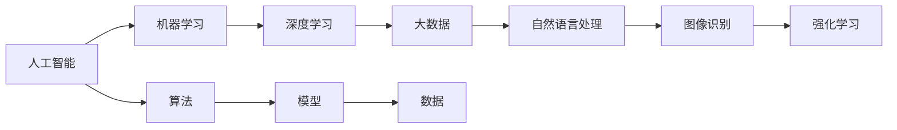

                 

# 硅谷人工智能:机器学习与大数据

> 关键词：人工智能, 机器学习, 深度学习, 大数据, 自然语言处理, 图像识别, 强化学习, 硅谷

## 1. 背景介绍

在硅谷这片创新与技术融合的沃土上，人工智能(AI)、机器学习(ML)和大数据(大数据)技术正以前所未有的速度迅猛发展，成为推动全球科技革命的重要引擎。硅谷不仅是互联网的摇篮，也是AI和机器学习技术发展的先锋地。本文旨在探讨硅谷在AI、机器学习与大数据领域的进展与趋势，揭示其对现代科技产业的影响与未来潜力。

## 2. 核心概念与联系

### 2.1 核心概念概述

硅谷作为全球科技创新中心，在人工智能、机器学习和数据科学领域内涌现出众多创新企业和研究机构。以下是几个关键概念及其相互关联：

- **人工智能（AI）**：涉及计算机科学、认知科学、神经科学等多个学科，旨在使计算机能够模拟人类智能行为。
- **机器学习（ML）**：基于数据训练算法，使计算机从数据中学习规律，并利用这些规律进行预测和决策。
- **深度学习（DL）**：一种特殊的机器学习方法，通过多层神经网络模拟人类大脑的神经元工作机制，实现高度复杂的学习任务。
- **大数据**：规模庞大、速度快速、种类繁杂的数据集合，为AI和ML提供分析和洞察的基础。
- **自然语言处理（NLP）**：使计算机能够理解和生成人类语言，实现机器与人的自然交互。
- **图像识别（CV）**：通过算法让计算机识别和理解图像，广泛用于自动驾驶、医疗诊断等领域。
- **强化学习（RL）**：通过奖励和惩罚机制训练算法，使其在不断试错中优化决策。

这些概念通过数据、模型和算法等纽带紧密联系在一起，共同构成了硅谷AI和ML技术的基石。

### 2.2 核心概念原理和架构的 Mermaid 流程图



这个流程图展示了AI、ML、DL、大数据、NLP、CV和RL之间的相互关系，以及算法、模型和数据在这些领域中的核心作用。

## 3. 核心算法原理 & 具体操作步骤

### 3.1 算法原理概述

硅谷在AI和ML领域的成就离不开对核心算法原理的深刻理解和不断创新。机器学习算法主要分为监督学习、无监督学习和强化学习三类。监督学习通过标注数据训练模型，用于分类、回归等任务；无监督学习从无标注数据中学习规律，用于聚类、降维等任务；强化学习通过试错优化策略，用于游戏、控制等任务。

深度学习作为ML的一个分支，其核心算法包括前馈神经网络、卷积神经网络（CNN）、循环神经网络（RNN）、自编码器等。其中，CNN常用于图像识别和处理，RNN用于序列数据（如语音、文本）处理，自编码器则用于特征提取和降维。

### 3.2 算法步骤详解

机器学习算法的训练过程通常包括以下几个关键步骤：

- **数据预处理**：清洗、转换和归一化数据，使其适合输入模型。
- **模型选择**：根据任务需求选择合适的模型架构和算法。
- **模型训练**：使用训练数据对模型进行迭代优化，最小化损失函数。
- **模型评估**：在验证集上评估模型性能，选择合适的超参数。
- **模型部署**：将训练好的模型应用于实际任务，进行推理预测。

深度学习的训练过程更为复杂，包括反向传播、梯度下降等操作。一般步骤如下：

- **前向传播**：将输入数据输入网络，通过多层神经元计算得到输出。
- **计算损失**：将输出结果与真实标签比较，计算损失函数。
- **反向传播**：通过链式法则计算每个神经元的梯度，更新权重。
- **参数优化**：使用梯度下降等优化算法，更新模型参数，最小化损失。

### 3.3 算法优缺点

硅谷在AI和ML领域的技术优势，使得机器学习算法在应用中具有以下优缺点：

**优点**：
- **高效准确**：通过数据驱动的训练，机器学习模型在特定任务上往往能够达到或超过人类专家的表现。
- **泛化能力强**：训练好的模型可以用于多种相关任务，提升模型应用范围。
- **自动化程度高**：模型训练和预测过程自动完成，减少人为干预。

**缺点**：
- **数据依赖**：模型性能高度依赖于数据质量和数量，数据偏差可能导致模型性能不佳。
- **解释性不足**：模型通常视为"黑箱"，难以解释其决策过程。
- **过拟合风险**：模型在训练集上表现优秀，但在新数据上可能泛化效果不佳。
- **计算资源需求高**：深度学习模型的计算复杂度高，需要高性能硬件支持。

### 3.4 算法应用领域

机器学习算法在硅谷广泛应用，涵盖医疗、金融、自动驾驶、推荐系统等多个领域。以下列举几个典型应用：

- **医疗**：通过图像识别和自然语言处理技术，实现疾病诊断、治疗方案推荐等。
- **金融**：利用大数据和深度学习，实现风险评估、股票预测等。
- **自动驾驶**：结合图像识别和强化学习，实现车辆路径规划、避障等。
- **推荐系统**：通过协同过滤和深度学习，提升个性化推荐效果，如电商、视频流媒体等。
- **语音识别**：结合深度学习和自然语言处理，实现智能语音助手、实时字幕等。

## 4. 数学模型和公式 & 详细讲解 & 举例说明

### 4.1 数学模型构建

机器学习算法通常使用数学模型来表示和训练。以线性回归为例，其模型为：

$$y = \theta_0 + \theta_1 x_1 + \theta_2 x_2 + \ldots + \theta_n x_n + \epsilon$$

其中，$y$为输出，$\theta$为模型参数，$x$为输入特征，$\epsilon$为误差项。

### 4.2 公式推导过程

以线性回归的梯度下降算法为例，公式推导如下：

$$\theta_j = \theta_j - \alpha \frac{\partial \mathcal{L}}{\partial \theta_j}$$

其中，$\mathcal{L}$为损失函数，$\alpha$为学习率，$\frac{\partial \mathcal{L}}{\partial \theta_j}$为损失函数对参数$\theta_j$的偏导数。

### 4.3 案例分析与讲解

假设有一个房价预测问题，已知数据集$(x, y)$，其中$x$为房屋面积、位置等特征，$y$为房价。使用线性回归模型进行预测，首先定义损失函数：

$$\mathcal{L}(\theta) = \frac{1}{2N} \sum_{i=1}^N (y_i - \hat{y_i})^2$$

其中，$\hat{y_i} = \theta_0 + \theta_1 x_{i1} + \ldots + \theta_n x_{in}$。

然后使用梯度下降算法，通过迭代更新参数$\theta$，最小化损失函数。

## 5. 项目实践：代码实例和详细解释说明

### 5.1 开发环境搭建

硅谷的AI和ML技术发展离不开强大的开发环境支持。以下是一个基本的Python环境搭建步骤：

1. 安装Anaconda，从官网下载并安装。
2. 创建虚拟环境，例如：`conda create -n my_env python=3.8`
3. 激活环境：`conda activate my_env`
4. 安装相关库，例如：`pip install numpy pandas scikit-learn matplotlib`。

### 5.2 源代码详细实现

以下是一个简单的线性回归模型实现示例，使用scikit-learn库：

```python
from sklearn.linear_model import LinearRegression
from sklearn.metrics import mean_squared_error

# 数据准备
X = [[1], [2], [3], [4], [5]]
y = [2, 4, 5, 4, 5]

# 建立模型
model = LinearRegression()

# 训练模型
model.fit(X, y)

# 预测新数据
new_X = [[6]]
pred_y = model.predict(new_X)

# 计算误差
mse = mean_squared_error(y, pred_y)
print(f"Mean Squared Error: {mse}")
```

### 5.3 代码解读与分析

代码实现中，首先导入线性回归模型和评估指标。然后，准备训练数据和真实标签。接着，建立线性回归模型，并使用`fit`方法进行训练。最后，预测新数据并计算均方误差。

## 6. 实际应用场景

### 6.1 医疗

硅谷的AI和ML技术在医疗领域的应用非常广泛。例如，通过深度学习技术，硅谷的医疗企业开发了智能诊断系统，可以快速识别疾病图像中的异常情况，辅助医生进行诊断。

### 6.2 金融

在金融领域，硅谷的AI和ML技术用于风险评估、股票预测等。通过大数据和深度学习模型，可以实时分析市场趋势，预测股票价格，为投资者提供决策支持。

### 6.3 自动驾驶

自动驾驶是硅谷AI和ML技术的另一大应用领域。通过图像识别和强化学习技术，硅谷的自动驾驶公司开发了高度自主的驾驶系统，能够应对复杂的道路环境，实现安全高效的自动驾驶。

### 6.4 未来应用展望

硅谷的AI和ML技术将进一步拓展其应用领域，涉及更多新兴领域，如智能家居、智慧城市、个性化推荐等。未来，硅谷的AI和ML技术将更加注重跨领域融合，推动更多产业数字化转型升级。

## 7. 工具和资源推荐

### 7.1 学习资源推荐

为了掌握硅谷的AI和ML技术，以下是一些推荐的资源：

1. **《Python机器学习》**：由著名的数据科学家Sebastian Raschka所著，详细介绍了机器学习的基本概念和实践技巧。
2. **Coursera《机器学习》课程**：斯坦福大学的Andrew Ng教授主讲，涵盖机器学习的基础和进阶内容。
3. **Kaggle**：数据科学竞赛平台，提供了大量的数据集和比赛项目，有助于实践和学习。
4. **Google AI Blog**：谷歌AI博客，涵盖最新的AI和ML研究成果和技术进展。
5. **Deep Learning Specialization**：由Andrew Ng教授领导的Coursera专项课程，介绍了深度学习的各个方面。

### 7.2 开发工具推荐

为了提高AI和ML开发的效率，以下是一些推荐的开发工具：

1. **PyTorch**：由Facebook开发的深度学习框架，支持动态图和静态图，适合研究和原型开发。
2. **TensorFlow**：由Google开发的深度学习框架，支持大规模分布式训练，适合生产部署。
3. **Jupyter Notebook**：Python交互式开发环境，支持代码编辑、执行和可视化展示。
4. **Keras**：高级神经网络API，提供了简单易用的接口，适合快速原型开发。
5. **TensorBoard**：可视化工具，用于监控模型训练过程和评估模型性能。

### 7.3 相关论文推荐

为了深入理解硅谷的AI和ML技术，以下是一些推荐的论文：

1. **《深度学习》**：Ian Goodfellow等著，深度学习的经典教材，介绍了深度学习的原理和实践。
2. **《强化学习：一种现代方法》**：Richard Sutton和Andrew Barto著，强化学习的经典教材，介绍了强化学习的基本理论和算法。
3. **《自然语言处理综论》**：Daniel Jurafsky和James H. Martin著，自然语言处理的经典教材，介绍了自然语言处理的基本方法和技术。
4. **《计算机视觉：模型、学习和推理》**：Simon J. D. Prince等著，计算机视觉的教材，介绍了计算机视觉的基本方法和技术。
5. **《大数据分析与知识发现》**：Peter J. Kliber和Jeffrey T. Taves著，大数据分析的教材，介绍了大数据分析和知识发现的方法和技术。

## 8. 总结：未来发展趋势与挑战

### 8.1 研究成果总结

硅谷的AI和ML技术在过去几十年里取得了巨大进展，应用于各个领域，提升了生产效率和生活质量。机器学习算法通过数据驱动的方式，实现了复杂问题的自动化解决。深度学习模型通过多层次神经网络，实现了对数据的深度理解和生成。

### 8.2 未来发展趋势

硅谷的AI和ML技术将继续推动各个领域的数字化转型。未来的趋势包括：

1. **跨领域融合**：AI和ML技术将与物联网、区块链等新兴技术深度融合，推动更多领域智能化升级。
2. **模型可解释性**：模型透明性和可解释性将成为未来AI和ML技术发展的重要方向。
3. **伦理和安全**：AI和ML技术的伦理和安全问题将受到更多关注，制定相关法律法规。
4. **普惠AI**：AI和ML技术将更加注重普惠性，降低应用门槛，使更多人受益。
5. **自动学习**：未来AI和ML技术将更加注重自主学习和持续改进，提高模型适应性和实用性。

### 8.3 面临的挑战

硅谷的AI和ML技术在发展过程中也面临着诸多挑战：

1. **数据隐私和安全**：AI和ML技术的应用涉及大量个人数据，数据隐私和安全问题亟待解决。
2. **算法偏见**：AI和ML模型的偏见问题需要通过算法改进和数据处理来解决。
3. **计算资源**：深度学习模型的高计算需求对硬件设施提出了更高的要求。
4. **模型可解释性**：AI和ML模型的"黑箱"特性需要解决，以增强用户信任。
5. **伦理和法律问题**：AI和ML技术的伦理和法律问题需要制定相关法规，确保技术应用合法合规。

### 8.4 研究展望

未来，硅谷的AI和ML技术需要在以下几个方面进行深入研究：

1. **跨领域应用**：推动AI和ML技术在更多新兴领域的应用，如智能家居、智慧城市等。
2. **模型优化**：研究高效算法和模型，减少计算资源消耗，提高模型效率。
3. **算法透明性**：增强AI和ML模型的透明性和可解释性，提高用户信任。
4. **伦理和法律**：制定AI和ML技术的伦理和法律框架，保障技术应用的合法合规。
5. **自主学习**：研究自主学习算法，提升模型的适应性和自适应能力。

## 9. 附录：常见问题与解答

**Q1: AI和ML技术在医疗领域有哪些应用？**

A: AI和ML技术在医疗领域的应用包括疾病诊断、治疗方案推荐、影像分析、药物研发等。例如，使用深度学习技术，可以快速识别和分析医疗影像中的异常情况，辅助医生进行诊断。

**Q2: 什么是强化学习？它在硅谷有哪些应用？**

A: 强化学习是一种通过试错优化策略的机器学习方法，主要用于游戏、机器人控制等。在硅谷，强化学习技术被广泛应用于自动驾驶、机器人操作等场景，通过奖励和惩罚机制，训练模型实现自主决策和操作。

**Q3: 如何使用机器学习进行预测？**

A: 机器学习预测通常包括数据准备、模型选择、训练、评估和预测等步骤。首先，需要准备训练数据和真实标签。然后，选择适当的模型进行训练，在验证集上评估模型性能。最后，使用训练好的模型进行预测，得到预测结果。

**Q4: 如何处理过拟合问题？**

A: 过拟合是机器学习中常见的问题，可以通过以下方法解决：
1. 数据增强：通过增加数据多样性，减少过拟合。
2. 正则化：使用L1、L2正则化等方法，限制模型复杂度。
3. 早期停止：在验证集上监控模型性能，防止模型过拟合。
4. 模型集成：通过集成多个模型，提高泛化能力。

**Q5: 什么是TensorBoard？**

A: TensorBoard是Google开发的可视化工具，用于监控模型训练过程和评估模型性能。它可以可视化模型的损失函数、梯度、参数变化等，帮助开发者更好地理解和优化模型。

---

作者：禅与计算机程序设计艺术 / Zen and the Art of Computer Programming

