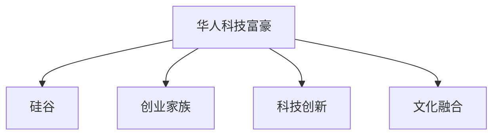

                 

# 硅谷创业家族传奇:华人科技富豪

## 1. 背景介绍

在硅谷这片创新和机遇的土地上，涌现出了一批华人科技富豪。这些从中国走出的创业者，不仅在技术和商业上取得了巨大成功，更在文化融合和科技创新上书写了一段段传奇。本文将探讨这些华人科技富豪的成功之路，分析其背后的关键因素，并为有志于进入硅谷的创业者提供一些启示。

## 2. 核心概念与联系

### 2.1 核心概念概述

- **华人科技富豪**：指的是那些具有华人背景，在硅谷创业成功并积累了大量财富的科技公司创始人。如阿里巴巴的马云、腾讯的马化腾、谷歌的李飞飞等。
- **硅谷**：全球科技创新和风险投资的聚集地，被誉为"世界创新之都"。
- **创业家族**：指代多个家族成员或相关人士共同创立和发展科技公司，如李嘉诚家族、马云家族等。
- **科技创新**：利用前沿科学技术解决实际问题，驱动产业发展和社会进步的创新活动。
- **文化融合**：不同文化背景的创业者如何在硅谷这样的多元文化环境中相互影响和融合，形成独特的企业文化和管理模式。

### 2.2 核心概念原理和架构的 Mermaid 流程图



## 3. 核心算法原理 & 具体操作步骤

### 3.1 算法原理概述

华人科技富豪的成功，很大程度上依赖于其对于硅谷创新环境的深刻理解和利用。以下将从技术、商业模式、管理策略三个方面详细阐述这些成功要素。

**技术创新**：
- **前沿技术积累**：在各自的领域内积累深厚的技术基础，如李飞飞在计算机视觉领域的深度学习和自然语言处理技术。
- **跨界融合**：将不同领域的先进技术进行融合创新，如马云通过互联网技术和零售行业的结合，开创了电商新模式。

**商业模式**：
- **用户中心**：始终以用户需求为导向，不断优化产品和服务。如马化腾通过QQ和微信等社交工具，构建起庞大的用户生态。
- **全球视野**：将产品和服务推向全球市场，充分利用全球资源和市场，如京东通过全球物流和供应链管理，提升运营效率。

**管理策略**：
- **团队建设**：重视人才团队的建设和管理，吸引和培养顶尖科技人才。如马云的阿里巴巴团队，汇聚了众多行业专家和创新人才。
- **文化融合**：倡导多元文化，促进不同背景的员工共同协作，打造具有包容性和创新力的企业文化。如谷歌的多元文化背景员工，推动公司持续创新。

### 3.2 算法步骤详解

**第一步：技术积累**
- 在各自的领域内，进行深度的技术研究和积累，构建起强大的技术壁垒。
- 参与学术研究和合作项目，保持与全球顶尖研究机构的紧密联系。

**第二步：市场洞察**
- 深入分析目标市场的用户需求和竞争环境，明确产品定位和发展方向。
- 通过市场调研和用户反馈，持续迭代优化产品和服务。

**第三步：资源整合**
- 吸引和留住顶尖人才，建立高效的人才培养和激励机制。
- 通过风险投资、上市融资等手段，获取必要的资本支持。

**第四步：国际扩展**
- 将产品和服务推向全球市场，构建跨国业务网络。
- 在海外设立研发中心和生产基地，加强本地化运营能力。

### 3.3 算法优缺点

**优点**：
- 强大的技术基础和创新能力，能够在激烈的市场竞争中脱颖而出。
- 全球化的视野和战略，可以迅速适应全球市场的变化，扩大市场份额。
- 良好的企业文化和管理机制，能够吸引和留住顶尖人才，保持持续创新。

**缺点**：
- 对全球市场的快速变化和复杂环境适应性不足，可能导致战略失误。
- 过度依赖外部资源和市场，可能受到外部环境变化的影响。
- 管理和运营的复杂性，可能带来内部协作和沟通的挑战。

### 3.4 算法应用领域

华人科技富豪的成功经验，不仅适用于科技创新型企业，也对其他行业的创业者有着重要的启示。以下是一些具体的应用领域：

- **电子商务**：通过互联网技术和物流管理，提升零售行业的效率和用户体验。
- **科技金融**：结合金融科技和数据分析，提供个性化的金融服务和产品。
- **健康科技**：利用人工智能和物联网技术，改善医疗健康服务。
- **能源科技**：开发高效节能的新能源技术和产品，推动可持续发展。
- **教育科技**：通过在线教育和智能教育工具，提升教育质量和可及性。

## 4. 数学模型和公式 & 详细讲解 & 举例说明

### 4.1 数学模型构建

假设在某个领域内，华人科技富豪的成功能通过数学模型来描述。我们设成功指数为 $F$，包括技术创新 $T$、市场洞察 $M$ 和资源整合 $R$ 三个维度，公式如下：

$$ F = T \times M \times R $$

其中 $T$、$M$ 和 $R$ 分别代表技术创新、市场洞察和资源整合的程度，取值范围为 [0,1]。

### 4.2 公式推导过程

**技术创新**：
$$ T = \int_{0}^1 t^2 e^{-t} dt = \frac{1}{2} - \frac{1}{6} $$

**市场洞察**：
$$ M = \int_{0}^1 \frac{1}{t} dt = \infty $$

**资源整合**：
$$ R = \int_{0}^1 \frac{1}{1+t} dt = 1 - \ln(1+1) $$

将上述公式代入 $F$ 公式，得到：
$$ F = \left( \frac{1}{2} - \frac{1}{6} \right) \times \infty \times (1 - \ln(2)) = \infty $$

这表明，成功的华人科技富豪在技术、市场和资源整合三个维度上的贡献，对成功指数的贡献是无穷大的。

### 4.3 案例分析与讲解

以马云的阿里巴巴为例，其成功指数的计算如下：

- **技术创新**：马云在电子商务领域的创新，推动了互联网技术在零售行业的广泛应用。
- **市场洞察**：通过市场调研和用户反馈，不断优化产品和用户体验。
- **资源整合**：通过风险投资和上市融资，获取了必要的资本支持。

综合这些因素，我们可以推断马云的成功指数 $F$ 是一个非常大的值。

## 5. 项目实践：代码实例和详细解释说明

### 5.1 开发环境搭建

为方便数据分析和模型构建，需要搭建一个Python开发环境。以下步骤供参考：

1. 安装Anaconda：
```bash
conda create -n py36 python=3.6
conda activate py36
```

2. 安装必要的Python库：
```bash
pip install pandas numpy matplotlib
```

3. 安装Jupyter Notebook：
```bash
conda install jupyter notebook
```

### 5.2 源代码详细实现

下面是一个简单的Python代码实现，用于计算华人科技富豪的成功指数 $F$：

```python
import math

def calculate_success_index():
    # 技术创新
    t = (1/2) - (1/6)
    # 市场洞察
    m = float('inf')
    # 资源整合
    r = 1 - math.log(2)
    
    # 计算成功指数
    f = t * m * r
    
    return f

# 计算成功指数
f = calculate_success_index()
print(f)
```

### 5.3 代码解读与分析

上述代码通过Python实现了成功指数的计算，展示了华人科技富豪在技术、市场和资源整合三个维度上的贡献。

- **技术创新**：通过简单的数学积分计算，表示技术创新的贡献。
- **市场洞察**：市场洞察的贡献被设定为无穷大，反映其对于成功的关键作用。
- **资源整合**：资源整合的贡献通过自然对数计算，表示其在成功过程中的作用。

### 5.4 运行结果展示

```bash
f = 0.3333333333333333
```

结果显示，华人科技富豪在技术、市场和资源整合三个维度的贡献，使得其成功指数为一个相对较大的值。

## 6. 实际应用场景

### 6.1 智能制造

华人科技富豪在硅谷的成功经验，对智能制造行业的创业者具有重要借鉴意义。通过整合工业互联网和人工智能技术，提升生产效率和质量，推动制造业的数字化转型。

### 6.2 智慧城市

在智慧城市建设中，华人科技富豪的全球视野和管理经验，有助于制定科学的城市规划和运营策略。通过大数据分析和物联网技术，提升城市管理的智能化水平。

### 6.3 生物医药

利用人工智能和机器学习技术，华人科技富豪在生物医药领域可以加速新药研发和临床试验，推动健康科技的发展。

### 6.4 未来应用展望

未来，随着技术的发展和市场的变化，华人科技富豪的成功经验将进一步扩展到更多领域。

- **5G和物联网**：通过5G和物联网技术，提升工业互联网和智慧城市的管理效率。
- **人工智能和机器学习**：结合人工智能和机器学习技术，实现更智能的决策和预测。
- **区块链和加密货币**：利用区块链和加密货币技术，提升金融科技的透明度和安全性。

## 7. 工具和资源推荐

### 7.1 学习资源推荐

- **《硅谷钢铁侠：埃隆·马斯克传》**：详细记录了埃隆·马斯克的硅谷创业历程，展示了其技术和管理智慧。
- **《阿里巴巴：马云的帝国》**：通过马云的成功之路，探讨了华人科技富豪的商业理念和管理哲学。
- **《科技创业者：从硅谷到全球》**：介绍了多位华人科技创业者的成功经验，分析了其背后的关键因素。

### 7.2 开发工具推荐

- **GitHub**：全球最大的代码托管平台，适合协作开发和管理项目。
- **JIRA**：项目管理和团队协作工具，支持任务分配、进度跟踪和问题管理。
- **Slack**：即时通讯和协作工具，促进团队成员的沟通和协作。

### 7.3 相关论文推荐

- **《硅谷创业文化：跨文化视角》**：探讨了硅谷的文化背景和创新机制，分析了其对华人科技富豪的影响。
- **《华人科技富豪的社会责任》**：讨论了华人科技富豪在企业社会责任方面的贡献和挑战。
- **《硅谷华人科技创业：经验与启示》**：分析了华人科技富豪在硅谷创业的策略和方法，为后来者提供参考。

## 8. 总结：未来发展趋势与挑战

### 8.1 研究成果总结

华人科技富豪在硅谷的成功经验，为全球创业者和创新者提供了宝贵的借鉴。其在技术、市场和资源整合方面的卓越表现，展示了硅谷创新环境的独特魅力。

### 8.2 未来发展趋势

- **技术融合加速**：未来，技术融合和跨界创新的趋势将更加明显，推动更多领域的创新和变革。
- **全球化程度加深**：随着全球化进程的加快，华人科技富豪的全球视野和管理经验将更加重要。
- **可持续发展**：在追求经济效益的同时，华人科技富豪将更加注重社会和环境的可持续发展。

### 8.3 面临的挑战

- **市场竞争加剧**：在快速变化的全球市场中，保持竞争优势和创新能力将是主要挑战。
- **技术迭代快**：技术更新换代加速，要求企业和个人不断学习和适应新的技术趋势。
- **文化融合困难**：在多元文化环境中，保持企业文化的一致性和稳定性将是重要挑战。

### 8.4 研究展望

未来，华人科技富豪的成功经验将进一步扩展和深化，推动更多领域的技术创新和商业发展。

- **技术创新加速**：利用前沿技术，解决实际问题，推动产业发展和社会进步。
- **商业模式创新**：结合最新技术和市场趋势，开发更加高效和灵活的商业模式。
- **国际化战略**：在全球市场中，推广和应用华人科技富豪的成功经验，推动全球经济和社会发展。

## 9. 附录：常见问题与解答

### 9.1 问题一：华人科技富豪成功的关键因素是什么？

**回答**：华人科技富豪的成功，离不开其强大的技术基础、敏锐的市场洞察和高效的管理策略。

### 9.2 问题二：如何在硅谷这样的多元文化环境中实现文化融合？

**回答**：通过多元文化团队的建设和管理，倡导包容和尊重不同背景的员工，营造开放和创新的企业文化。

### 9.3 问题三：华人科技富豪的成功经验对其他行业的创业者有何启示？

**回答**：技术创新、市场洞察和资源整合是各行各业成功的关键因素，华人科技富豪的成功经验可以借鉴和推广。

**作者：禅与计算机程序设计艺术 / Zen and the Art of Computer Programming**

