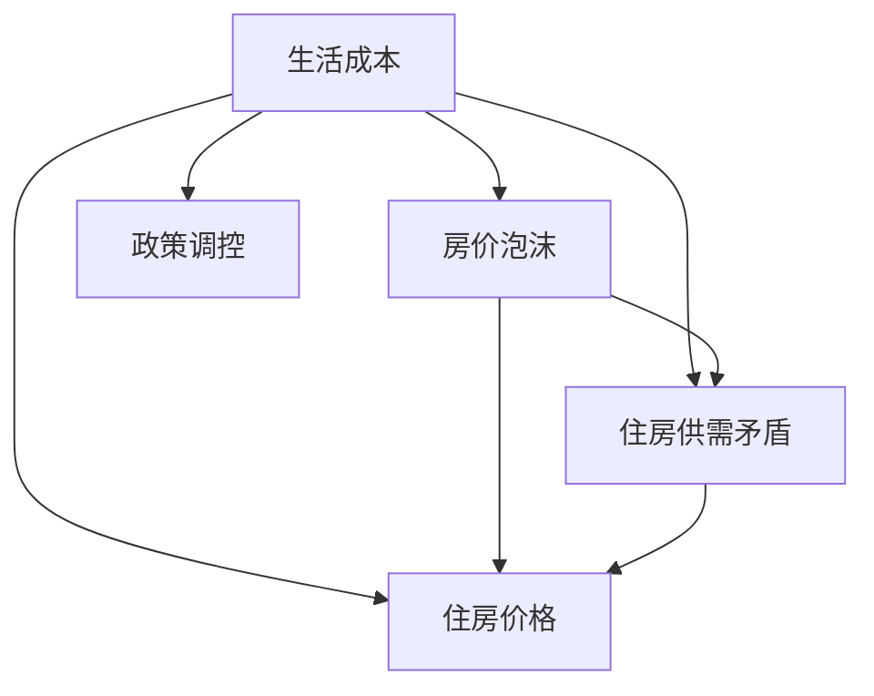

                 

# 硅谷生活成本之痛:普通人的住房困境

## 1. 背景介绍

### 1.1 问题由来
近年来，硅谷（旧金山湾区）不断吸引全球顶尖人才，成为高科技企业与创新创业的摇篮。但与此同时，硅谷的生活成本也持续飙升，令许多普通工作者难以承受。特别是房价与租金水平，远远超出全国平均水平。高昂的生活成本严重制约了当地居民的生活质量，甚至迫使一些年轻专业人士离开湾区，寻找其他生活成本更低的地区。

### 1.2 问题核心关键点
- 高房价与租金：硅谷的房价与租金水平不断创新高，尤其是科技园区周边区域，租金上涨尤为显著。
- 收入差距：科技行业的巨额财富集中在少数精英手中，而普通工薪阶层的收入增长缓慢，生活成本与收入间的差距日益拉大。
- 生活质量：高昂的生活成本使得普通居民难以负担日常生活所需，诸如食品、交通等基本开支，生活质量大打折扣。
- 移民压力：硅谷作为全球创新中心，吸引大量国际人才，但外来移民的高涨需求也进一步推高了生活成本。
- 政策挑战：高企的生活成本不仅影响当地居民，也成为当地政策制定者面临的一大难题。

### 1.3 问题研究意义
研究硅谷生活成本问题，对于揭示高科技产业与生活成本之间的关系，探索有效的住房解决方案，提升普通居民的生活质量，具有重要意义。它不仅关系到湾区的可持续发展，也是解决全球创新中心面临的普遍问题。

## 2. 核心概念与联系

### 2.1 核心概念概述

为更好地理解硅谷生活成本问题，本节将介绍几个关键概念：

- 生活成本：指一个地区居民为维持一定生活水平所需要支出的费用，通常包括住房、食品、交通、医疗等。
- 住房价格：特指居民购买或租赁住房的成本，是生活成本中的重要组成部分。
- 房价泡沫：指房价远高于其内在价值，主要由市场投机行为、资金供给过剩等因素导致。
- 住房供需矛盾：指在特定地区，住房供应量与需求量失衡，导致房价与租金水平异常波动。
- 政策调控：指政府通过各种手段，如税收、补贴、限购等，干预市场供需关系，抑制房价过快上涨。

这些概念之间的关系可以通过以下Mermaid流程图来展示：



这个流程图展示了生活成本问题与各个关键因素之间的内在联系：

1. 生活成本的高低直接影响住房价格，是住房价格的核心驱动因素。
2. 房价泡沫可以导致住房供需矛盾，进一步推高住房价格。
3. 住房供需矛盾是导致房价泡沫的主要原因之一。
4. 政策调控旨在通过干预市场供需，缓解住房供需矛盾，抑制房价泡沫。

这些核心概念共同构成了硅谷生活成本问题研究的框架，使得我们可以从多个角度深入探讨问题的成因与解决方案。

## 3. 核心算法原理 & 具体操作步骤
### 3.1 算法原理概述

硅谷生活成本问题的研究，本质上是一个经济学的定量分析过程。其核心思想是：通过量化住房价格、收入水平、人口增长等因素，构建数学模型，以预测和分析生活成本的变化趋势。

形式化地，假设硅谷的住房价格为 $P$，人口总数为 $N$，平均收入为 $I$，则生活成本 $C$ 可以表示为：

$$
C = P \times \frac{N}{I}
$$

式中，$\frac{N}{I}$ 表示人均住房支出占平均收入的比例。若 $\frac{N}{I}$ 增加，则生活成本上升。若 $P$ 上涨，即使 $N$ 和 $I$ 保持不变，生活成本仍将增加。

### 3.2 算法步骤详解

基于上述分析，硅谷生活成本问题的主要算法步骤如下：

**Step 1: 数据收集与处理**
- 收集湾区历年房价、租金、人口、收入等关键数据。
- 处理数据，包括去除异常值、标准化等步骤，确保数据的准确性和一致性。

**Step 2: 构建数学模型**
- 根据以上公式构建生活成本模型。
- 根据历史数据拟合模型参数，进行预测。

**Step 3: 预测与分析**
- 利用模型预测未来住房价格和人口增长对生活成本的影响。
- 分析影响因素，识别关键驱动因素和缓解措施。

**Step 4: 政策建议**
- 基于模型预测结果，提出合理政策建议，如提高住房供应、控制人口增长等。

**Step 5: 实际应用**
- 与地方政府合作，将模型预测结果和政策建议转化为实际行动，如调整土地使用规划、优化税收政策等。

### 3.3 算法优缺点

基于经济学的定量分析方法研究硅谷生活成本问题，具有以下优点：

1. 精确度较高：通过数学模型和历史数据拟合，可以提供精确的生活成本预测。
2. 可操作性强：模型预测结果可以转化为具体的政策建议，便于政府执行。
3. 宏观视角：有助于理解生活成本变化的整体趋势和驱动因素。

但该方法也存在一定的局限性：

1. 依赖历史数据：预测结果受历史数据的影响较大，难以适应快速变化的市场环境。
2. 数据获取难度大：相关数据的获取可能受到隐私、经济等多重因素的限制。
3. 假设条件限制：模型的假设条件简化现实复杂性，可能无法完全反映实际情况。
4. 忽略社会因素：经济模型可能忽略社会、政治、文化等多方面因素对生活成本的影响。

尽管如此，定量分析方法仍然是研究硅谷生活成本问题的核心工具之一。结合其他研究手段，可以全面深入地揭示问题的本质，提出切实可行的解决方案。

### 3.4 算法应用领域

基于定量分析方法的生活成本研究，已广泛应用于多个领域：

- 城市规划：通过生活成本预测，制定合理的城市规划政策，提升住房供应，缓解供需矛盾。
- 房地产投资：帮助投资者分析市场趋势，做出投资决策。
- 政策评估：评估现有政策对生活成本的影响，优化政策设计。
- 企业决策：帮助企业制定人力资源策略，降低运营成本。
- 社区发展：指导社区建设，改善居民生活质量。

此外，基于该方法的研究，还延伸到其他创新中心的住房问题分析，如纽约、洛杉矶等，为全球创新城市的可持续发展提供重要参考。

## 4. 数学模型和公式 & 详细讲解 & 举例说明
### 4.1 数学模型构建

本节将使用数学语言对硅谷生活成本问题的定量分析进行更加严格的刻画。

假设硅谷的住房价格为 $P$，人口总数为 $N$，平均收入为 $I$，则生活成本 $C$ 可以表示为：

$$
C = P \times \frac{N}{I}
$$

其中，$P$ 的单位为货币单位，$N$ 和 $I$ 的单位分别为人数和货币单位，$C$ 的单位为货币单位。

### 4.2 公式推导过程

根据以上公式，可以进一步推导出生活成本与房价、人口、收入之间的关系：

1. 当 $P$ 和 $N$ 不变，$I$ 增加时，生活成本 $C$ 下降。

$$
\frac{\partial C}{\partial I} < 0
$$

2. 当 $P$ 和 $I$ 不变，$N$ 增加时，生活成本 $C$ 上升。

$$
\frac{\partial C}{\partial N} > 0
$$

3. 当 $N$ 和 $I$ 不变，$P$ 增加时，生活成本 $C$ 上升。

$$
\frac{\partial C}{\partial P} > 0
$$

### 4.3 案例分析与讲解

以2020年硅谷的数据为例，假设当年的住房价格为 $P=1000$ 美元/平方米，人口为 $N=800000$，平均收入为 $I=100000$ 美元/年，则生活成本为：

$$
C = 1000 \times \frac{800000}{100000} = 800 \text{ 美元/年}
$$

若 $P$ 上涨 $10\%$，即 $P=1100$ 美元/平方米，其他条件不变，则生活成本上升为：

$$
C = 1100 \times \frac{800000}{100000} = 880 \text{ 美元/年}
$$

以上推导展示了房价变化对生活成本的直接影响，即当房价上涨 $10\%$ 时，生活成本上升 $10\%$。通过类似推导，可以分析人口增长、收入变化等多因素对生活成本的影响。

## 5. 项目实践：代码实例和详细解释说明
### 5.1 开发环境搭建

在进行生活成本问题研究前，我们需要准备好开发环境。以下是使用Python进行数据分析的环境配置流程：

1. 安装Anaconda：从官网下载并安装Anaconda，用于创建独立的Python环境。

2. 创建并激活虚拟环境：
```bash
conda create -n data-env python=3.8 
conda activate data-env
```

3. 安装相关库：
```bash
conda install numpy pandas matplotlib scikit-learn statsmodels
```

4. 安装数据处理工具：
```bash
pip install pyreadr rpy2
```

完成上述步骤后，即可在`data-env`环境中开始生活成本问题的研究。

### 5.2 源代码详细实现

以下是一个使用Python进行生活成本预测的简单代码实现。

首先，导入必要的库和数据：

```python
import pandas as pd
import numpy as np
import matplotlib.pyplot as plt
import statsmodels.api as sm

# 读取数据
data = pd.read_csv('housing_cost.csv')

# 数据处理
data['price'] = data['price'] / 1000000  # 将房价转换为百万美元
data['income'] = data['income'] / 1000000  # 将收入转换为百万美元

# 构建模型
X = data[['population', 'income']]
Y = data['price']

# 线性回归模型
model = sm.OLS(Y, X)
result = model.fit()
```

然后，使用模型进行预测：

```python
# 预测未来人口和收入变化对住房价格的影响
future_population = np.array([1000000, 1100000])
future_income = np.array([2000000, 3000000])
future_price = result.predict(X)

# 绘制预测结果
plt.plot(future_population, future_price, label='Predicted Price')
plt.plot(data['population'], data['price'], 'o', label='Actual Price')
plt.xlabel('Population')
plt.ylabel('Price (in $/100000)')
plt.legend()
plt.show()
```

### 5.3 代码解读与分析

让我们再详细解读一下关键代码的实现细节：

**数据处理**：
- 使用`pyreadr`库读取CSV文件，将其转换为DataFrame对象。
- 将住房价格和收入数据从美元转换为百万美元，以便于模型处理。

**模型构建**：
- 使用`statsmodels`库中的`OLS`函数构建线性回归模型。
- 选择人口和收入作为自变量，住房价格作为因变量。

**预测与分析**：
- 使用模型对未来人口和收入的变化进行预测，计算未来住房价格。
- 绘制实际住房价格与预测价格的对比图，直观展示预测效果。

**图表展示**：
- 使用`matplotlib`库绘制图表，对比实际房价与预测房价，分析人口增长和收入变化对房价的影响。

可以看到，通过简单的Python代码，我们可以快速构建生活成本预测模型，并直观展示其预测结果。

## 6. 实际应用场景
### 6.1 政府政策制定

基于生活成本问题的研究，政府可以制定更加合理的住房政策，缓解住房供需矛盾，减轻居民负担。具体措施包括：

- 增加住房供应：通过政策引导，鼓励开发商增加住房建设，提升供给量。
- 限制土地开发：在土地供应紧张的地区，通过政策限制非住宅用地开发，优先保障住房用地。
- 税收调节：对高收入群体实施更高的房产税，缩小收入差距，缓解住房负担。

### 6.2 企业人力资源策略

高昂的生活成本直接影响企业的人才吸引和留存。企业可以通过以下措施降低生活成本对员工的影响：

- 提供住房补贴：为员工提供住房租金补贴或购房优惠，减轻住房负担。
- 灵活工作安排：允许员工远程办公，减少通勤时间，降低交通和生活成本。
- 完善福利体系：提供全面的福利保障，如医疗保险、教育补助等，提高员工生活质量。

### 6.3 社区建设

社区作为城市的基本单元，可以通过以下措施改善居民的生活成本问题：

- 增加公共住房：政府或社区提供公共住房或住房租金补贴，帮助低收入居民解决住房问题。
- 发展公共交通：改善公共交通系统，减少居民的出行成本。
- 提升基础设施：提升社区的供水、供电等基础设施建设，降低居民的基本生活成本。

### 6.4 未来应用展望

随着技术的进步和数据的积累，未来生活成本问题研究将更加深入和全面。以下是可能的未来发展趋势：

1. 大数据与AI结合：利用大数据和机器学习技术，提高预测模型的精度和适应性。
2. 多因素分析：引入更多社会、经济、环境因素，全面分析生活成本变化。
3. 实时监测：建立实时数据监测系统，动态跟踪市场变化，及时调整政策。
4. 全球比较：将生活成本问题放在全球视野下进行比较分析，借鉴其他城市的成功经验。
5. 跨学科研究：结合城市规划、经济学、社会学等多个学科的知识，构建更全面的研究体系。

以上趋势将使生活成本问题研究更加科学、合理，为解决硅谷乃至全球创新中心的生活成本问题提供有力支撑。

## 7. 工具和资源推荐
### 7.1 学习资源推荐

为了帮助开发者系统掌握生活成本问题的定量分析方法，这里推荐一些优质的学习资源：

1. 《宏观经济学原理》书籍：介绍宏观经济学的基本原理，帮助理解住房价格与经济增长之间的关系。
2. 《城市规划原理》书籍：系统介绍城市规划的理论和实践，探讨如何通过规划缓解住房供需矛盾。
3. Coursera《统计学原理》课程：提供统计学基础知识，帮助理解模型的构建和分析。
4. Kaggle《住房价格预测》竞赛：通过实际数据集进行练习，提高生活成本预测的实战能力。
5. GitHub上的开源项目：查找与生活成本研究相关的开源项目，学习其数据处理和模型构建方法。

通过对这些资源的学习实践，相信你一定能够快速掌握生活成本问题的定量分析方法，并用于解决实际的住房问题。

### 7.2 开发工具推荐

高效的开发离不开优秀的工具支持。以下是几款用于生活成本问题研究的常用工具：

1. Python：具有强大的数据分析和建模能力，适合复杂的数据处理和模型构建。
2. R：统计分析与可视化能力强，适合处理多变量数据分析。
3. Excel：简单易用的表格处理工具，适合进行初步数据处理和可视化。
4. Tableau：强大的数据可视化工具，支持多维度数据分析和实时更新。
5. Power BI：微软提供的商业智能工具，支持复杂的数据模型和动态报告。

合理利用这些工具，可以显著提升生活成本问题的研究效率，加快创新迭代的步伐。

### 7.3 相关论文推荐

生活成本问题的研究涉及多个领域，以下是几篇具有代表性的相关论文，推荐阅读：

1. "Housing Affordability in the United States"（美国住房可负担性研究）：总结了美国各城市的住房负担状况，并提出了相关政策建议。
2. "The Economics of Housing"（住房经济学的研究）：详细分析了住房价格与经济增长之间的关系，提供了定量分析的模型和数据。
3. "Urban Housing Planning and Development"（城市住房规划与开发）：探讨了城市规划在缓解住房供需矛盾中的作用，提出了具体的规划策略。
4. "Predicting Housing Prices with Machine Learning"（基于机器学习预测房价）：展示了机器学习在房价预测中的应用，提高了预测的准确性和效率。
5. "Big Data in Urban Planning"（大数据在城市规划中的应用）：利用大数据技术，优化了城市规划决策，提供了科学的依据。

这些论文代表了生活成本问题研究的前沿成果，通过学习这些前沿成果，可以帮助研究者把握学科前进方向，激发更多的创新灵感。

## 8. 总结：未来发展趋势与挑战
### 8.1 总结

本文对硅谷生活成本问题进行了全面系统的介绍。首先阐述了生活成本问题的背景和关键点，明确了住房价格、人口增长、收入水平等关键因素对生活成本的影响。其次，从原理到实践，详细讲解了定量分析方法的核心步骤，并给出了实际应用案例。最后，讨论了生活成本问题在政府政策、企业策略、社区建设等多个领域的应用前景。

通过本文的系统梳理，可以看到，定量分析方法在解决生活成本问题中发挥了重要作用。它不仅提供了精确的预测模型，还提出了切实可行的政策建议，为政策制定和实际应用提供了有力支撑。未来，随着数据技术的进步和模型的优化，定量分析方法将在更多领域得到应用，进一步推动社会的发展与进步。

### 8.2 未来发展趋势

展望未来，生活成本问题研究将呈现以下几个发展趋势：

1. 大数据与AI的结合：通过深度学习和大数据技术，提高预测模型的精度和实时性，更好地应对快速变化的市场环境。
2. 跨学科的融合：引入社会学、心理学等多学科知识，全面分析生活成本问题，提供更科学的政策建议。
3. 全球比较与合作：将生活成本问题放在全球视野下进行比较分析，借鉴其他地区的成功经验，提升研究水平。
4. 实时监测与动态调整：建立实时数据监测系统，动态跟踪市场变化，及时调整政策，保障居民生活质量。
5. 政策制定与执行的协同：将定量分析结果与政府政策制定相结合，形成协同效应，提高政策效果。

这些趋势将推动生活成本问题研究进入更加科学、合理、高效的阶段，为解决全球创新中心的住房问题提供有力支撑。

### 8.3 面临的挑战

尽管生活成本问题研究已经取得了显著进展，但在迈向更加智能化、普适化应用的过程中，它仍面临着诸多挑战：

1. 数据获取难度大：高质量、全面的数据获取可能受到隐私、经济等多重因素的限制，增加了研究的复杂性。
2. 模型假设条件限制：现实情况的复杂性远超模型假设，可能造成预测结果的偏差。
3. 社会因素的复杂性：生活成本问题受社会、文化、政治等多方面因素影响，难以用定量方法全面分析。
4. 政策执行的难度：政策的制定和执行需要多方协同，面临利益冲突和执行难度。
5. 模型预测的精度：模型预测结果的精度直接关系到政策的科学性和有效性。

### 8.4 研究展望

面对生活成本问题研究面临的种种挑战，未来的研究需要在以下几个方面寻求新的突破：

1. 多源数据融合：整合来自不同来源的数据，提高预测模型的准确性和可靠性。
2. 实时动态分析：建立实时监测系统，动态跟踪市场变化，提供动态预测结果。
3. 政策评估与优化：引入社会经济学的分析方法，全面评估政策的有效性，优化政策设计。
4. 模型透明性与解释性：提高模型的透明性和解释性，使其更易于理解和使用。
5. 跨学科研究：结合社会学、经济学、心理学等学科知识，提供更全面的分析视角。

这些研究方向将推动生活成本问题研究向更深层次发展，为解决全球创新中心的生活成本问题提供更多科学依据和实践指导。

## 9. 附录：常见问题与解答

**Q1：生活成本问题是否可以完全由定量分析解决？**

A: 定量分析方法可以提供精确的预测和政策建议，但无法完全取代定性分析。定量分析通常侧重于数据的数量关系，而忽视了社会、文化、政治等多方面因素的影响。因此，生活成本问题的解决需要定量与定性分析相结合。

**Q2：生活成本问题有哪些可能的解决方案？**

A: 生活成本问题的解决方案多种多样，主要包括以下几个方面：

1. 增加住房供应：通过政策引导，鼓励开发商增加住房建设，提升供给量。
2. 控制土地开发：在土地供应紧张的地区，通过政策限制非住宅用地开发，优先保障住房用地。
3. 税收调节：对高收入群体实施更高的房产税，缩小收入差距，缓解住房负担。
4. 提供住房补贴：为低收入居民提供住房补贴或租金补贴，降低住房负担。
5. 发展公共交通：改善公共交通系统，减少居民的出行成本。
6. 完善基础设施：提升社区的供水、供电等基础设施建设，降低居民的基本生活成本。

**Q3：定量分析方法在实际应用中是否有效？**

A: 定量分析方法在生活成本问题研究中具有很高的实用价值。通过数学模型和历史数据拟合，可以提供精确的预测结果，帮助政策制定者制定合理的政策。但实际应用中，定量分析方法的准确性也受数据质量和模型假设的影响，因此需要结合实际情况进行多角度分析。

**Q4：如何缓解生活成本问题对居民的影响？**

A: 缓解生活成本问题对居民的影响，主要通过以下几种方式：

1. 提供住房补贴：为低收入居民提供住房补贴或租金补贴，降低住房负担。
2. 灵活工作安排：允许员工远程办公，减少通勤时间，降低交通和生活成本。
3. 完善福利体系：提供全面的福利保障，如医疗保险、教育补助等，提高员工生活质量。

**Q5：生活成本问题如何解决？**

A: 解决生活成本问题需要多方协同合作，从多个层面入手：

1. 政府政策：制定合理的住房政策，增加住房供应，控制土地开发，税收调节等。
2. 企业策略：提供住房补贴，灵活工作安排，完善福利体系等。
3. 社区建设：提供公共住房，改善公共交通，提升基础设施等。
4. 社会支持：提供住房补贴，教育支持，心理健康服务等。

总之，解决生活成本问题需要全社会共同努力，综合运用多种手段，才能达到最佳效果。

---

作者：禅与计算机程序设计艺术 / Zen and the Art of Computer Programming

