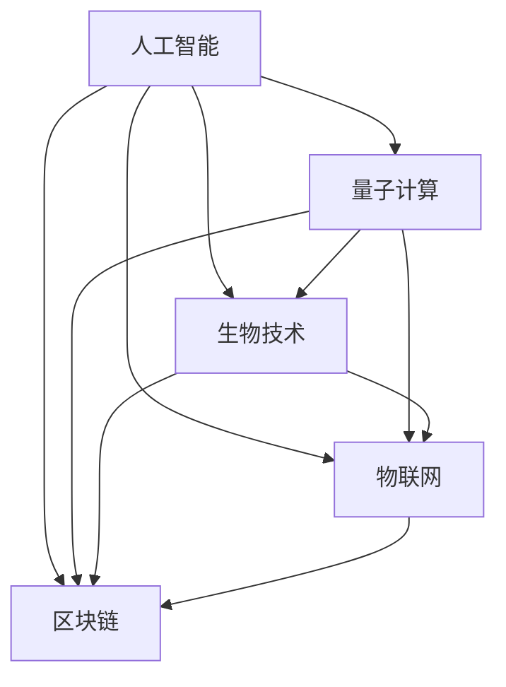

                 

## 1. 背景介绍

随着人工智能、大数据、物联网、区块链等新兴技术不断涌现，硅谷作为全球科技创新中心，正面临前所未有的机遇与挑战。本文将深入探讨这些技术如何塑造硅谷的未来，并分析其带来的机遇与挑战。

### 1.1 技术变革加速

过去几十年，硅谷一直在引领全球技术创新。从个人电脑的普及，到互联网的诞生，再到移动互联网的兴起，硅谷始终站在技术变革的前沿。如今，人工智能、量子计算、生物技术等前沿科技的发展，将进一步推动硅谷的创新发展。

### 1.2 企业与产业生态

硅谷汇聚了全球顶尖的科技企业，如苹果、谷歌、Facebook、特斯拉等，以及大量的初创公司、风险投资机构、创新实验室。这些企业、机构和个人形成了复杂的生态系统，推动着技术创新和应用。

### 1.3 人才与教育

硅谷的人才储备和教育资源丰富，斯坦福、加州大学伯克利分校等高校每年培养大量的科技人才。同时，硅谷的创业文化吸引了全球顶尖的科技人才，进一步增强了其创新能力。

## 2. 核心概念与联系

### 2.1 核心概念概述

为更好地理解硅谷的未来，本节将介绍几个关键概念：

- **人工智能（AI）**：通过机器学习、深度学习等技术，使计算机系统能够模拟和延伸人类智能。
- **量子计算**：利用量子力学原理，实现信息处理能力的大幅提升，可能突破经典计算机的局限。
- **生物技术**：结合生物学、化学和工程学，开发新型药物、诊断工具和治疗手段。
- **物联网（IoT）**：通过传感器、互联网和嵌入式系统，将物理世界与数字世界深度融合。
- **区块链**：利用分布式账本技术，实现去中心化、安全透明的数据记录和交易。

这些概念之间具有紧密的联系，通过创新技术的融合，将推动硅谷在多个领域取得突破。

### 2.2 核心概念原理和架构的 Mermaid 流程图



## 3. 核心算法原理 & 具体操作步骤

### 3.1 算法原理概述

硅谷的科技发展，离不开算法的创新和优化。算法不仅推动了技术的进步，还为新兴技术的应用提供了基础。以下是几个核心算法的概述：

- **机器学习算法**：通过训练模型，使其能够从数据中学习并预测未来的结果，广泛应用于数据挖掘、图像识别、自然语言处理等领域。
- **深度学习算法**：通过多层神经网络，模拟人脑的层次化处理方式，解决了传统机器学习无法处理的复杂问题。
- **分布式算法**：通过并行计算和协同工作，提高数据处理和模型训练的效率，适用于大数据和分布式系统。

### 3.2 算法步骤详解

1. **数据收集和预处理**：收集相关的数据集，并进行清洗、标注等预处理，为模型训练提供基础。
2. **模型选择和训练**：根据任务需求选择合适的模型，并使用数据集对其进行训练，优化参数。
3. **模型评估和优化**：在验证集上评估模型性能，根据结果进行模型调整，提高模型泛化能力。
4. **模型部署和应用**：将训练好的模型部署到实际应用中，解决具体问题。

### 3.3 算法优缺点

#### 优点：
- **高效性**：自动化数据处理和模型训练，提高了工作效率。
- **灵活性**：适用于各种数据类型和任务，具有广泛的应用场景。
- **可扩展性**：通过分布式计算，能够处理大规模数据集。

#### 缺点：
- **数据依赖**：模型的性能高度依赖于数据的质量和数量。
- **过拟合风险**：模型容易过拟合，导致泛化能力不足。
- **复杂度**：算法实现复杂，需要专业的知识和技能。

### 3.4 算法应用领域

这些算法已在多个领域得到广泛应用：

- **医疗**：通过深度学习算法，提高疾病诊断的准确性和效率。
- **金融**：利用机器学习算法，进行风险评估和投资策略优化。
- **自动驾驶**：结合计算机视觉和深度学习算法，实现无人驾驶汽车的自主导航。
- **智能家居**：利用物联网和分布式算法，实现家庭设备的互联互通。
- **供应链管理**：通过大数据和机器学习算法，优化供应链的各个环节，提高效率。

## 4. 数学模型和公式 & 详细讲解 & 举例说明

### 4.1 数学模型构建

以深度学习模型为例，数学模型通常由输入层、隐藏层和输出层组成。输入层接收原始数据，隐藏层进行特征提取和转换，输出层生成预测结果。

- **输入层**：接收原始数据，如图片、文本等。
- **隐藏层**：通过神经网络，提取特征和规律。
- **输出层**：生成预测结果，如分类标签、回归值等。

### 4.2 公式推导过程

以线性回归为例，公式推导如下：

$$ y = \theta_0 + \theta_1 x_1 + \theta_2 x_2 + ... + \theta_n x_n $$

其中 $y$ 为预测结果，$x_i$ 为输入变量，$\theta_i$ 为模型参数。通过最小化误差平方和，求解最优的 $\theta_i$。

### 4.3 案例分析与讲解

以图像识别为例，卷积神经网络（CNN）模型通过卷积层、池化层、全连接层等，提取图像特征并进行分类。

- **卷积层**：通过卷积运算提取局部特征。
- **池化层**：通过降采样减少计算量，保留重要特征。
- **全连接层**：将特征向量映射到分类结果。

通过多层卷积和池化，CNN能够有效处理复杂的图像数据，识别出物体、场景等。

## 5. 项目实践：代码实例和详细解释说明

### 5.1 开发环境搭建

开发深度学习模型需要以下环境：

1. 安装Python：选择版本为3.7或以上，安装Miniconda或Anaconda，用于创建虚拟环境。
2. 安装TensorFlow：在conda中安装TensorFlow，支持GPU加速。
3. 安装Keras：用于模型构建和训练，兼容TensorFlow和Python 3.6以上版本。

### 5.2 源代码详细实现

以下是一个简单的线性回归模型示例：

```python
import numpy as np
from tensorflow.keras.models import Sequential
from tensorflow.keras.layers import Dense

# 构建模型
model = Sequential([
    Dense(64, activation='relu', input_shape=(10,)),
    Dense(1)
])

# 编译模型
model.compile(optimizer='adam', loss='mse', metrics=['mae'])

# 训练模型
model.fit(X_train, y_train, epochs=50, batch_size=32, validation_data=(X_test, y_test))

# 评估模型
test_loss, test_mae = model.evaluate(X_test, y_test)
print('Test MAE:', test_mae)
```

### 5.3 代码解读与分析

1. **模型构建**：使用Keras的Sequential模型，依次添加输入层和输出层。
2. **模型编译**：选择Adam优化器和均方误差（MSE）损失函数。
3. **模型训练**：在训练集上进行多轮迭代，逐步优化模型参数。
4. **模型评估**：在测试集上评估模型性能，输出均方误差（MAE）。

## 6. 实际应用场景

### 6.1 自动驾驶

自动驾驶是人工智能技术的重要应用领域。通过传感器、摄像头、激光雷达等设备收集数据，使用深度学习算法进行路径规划和决策。

- **传感器数据处理**：使用图像处理和特征提取算法，识别道路、交通标志、行人等。
- **目标检测**：使用YOLO、SSD等目标检测算法，实时检测并跟踪物体。
- **路径规划**：通过深度学习算法，优化路径选择，避免障碍物。

### 6.2 医疗诊断

深度学习在医疗诊断中也有广泛应用，通过图像识别、自然语言处理等技术，辅助医生进行疾病诊断和治疗。

- **图像识别**：使用卷积神经网络，识别X光片、CT扫描等医学影像中的病灶。
- **自然语言处理**：通过文本分析，提取病历信息，辅助医生制定诊断方案。
- **知识图谱**：结合知识图谱，推荐相关的治疗方案和药物。

### 6.3 智能家居

智能家居利用物联网技术，实现家庭设备的互联互通和自动化控制。

- **传感器网络**：通过传感器采集家庭环境数据，如温度、湿度、光照等。
- **数据分析**：使用机器学习算法，优化家庭设备的使用，提高能源利用效率。
- **人机交互**：通过语音识别和自然语言处理，实现语音控制和指令下达。

### 6.4 未来应用展望

未来，硅谷将继续引领新兴技术的发展，推动更多领域的应用。

- **量子计算**：量子计算机可能解决经典计算机难以处理的复杂问题，如大数分解、模拟量子系统等。
- **生物技术**：基因编辑技术、合成生物技术等，将改变医疗、农业等行业。
- **物联网**：5G技术的普及，将推动物联网设备的大规模部署，实现更高效的数据传输和处理。
- **区块链**：去中心化的金融系统、供应链管理等应用，将提高数据的透明性和安全性。

## 7. 工具和资源推荐

### 7.1 学习资源推荐

1. **深度学习框架**：TensorFlow、Keras、PyTorch等。
2. **机器学习库**：Scikit-Learn、SciPy、NumPy等。
3. **在线课程**：Coursera、edX、Udacity等平台提供的深度学习课程。

### 7.2 开发工具推荐

1. **开发环境**：Anaconda、Jupyter Notebook等。
2. **版本控制**：Git、GitHub等。
3. **测试框架**：pytest、unittest等。

### 7.3 相关论文推荐

1. **深度学习**：《Deep Learning》（Ian Goodfellow、Yoshua Bengio、Aaron Courville著）。
2. **量子计算**：《Quantum Computation and Quantum Information》（Michael A. Nielsen、Michael J. Moore著）。
3. **生物技术**：《生物技术概论》（陈望富、郭晓欧著）。
4. **物联网**：《物联网技术与应用》（张诚、王峰著）。
5. **区块链**：《区块链技术及应用》（刘理栋、邹大朋著）。

## 8. 总结：未来发展趋势与挑战

### 8.1 研究成果总结

硅谷在新兴技术领域的持续创新，使其成为全球技术创新的中心。深度学习、量子计算、生物技术、物联网和区块链等技术，正在改变各个行业，推动社会进步。

### 8.2 未来发展趋势

1. **技术融合**：新兴技术之间的融合将带来更多的创新和应用。
2. **应用场景拓展**：更多行业将受益于新技术的推广应用，实现数字化转型。
3. **社会影响**：新技术将改变人们的生活和工作方式，带来更高的生活质量和效率。

### 8.3 面临的挑战

1. **技术瓶颈**：现有技术的局限性，如数据质量、计算能力等。
2. **伦理问题**：新兴技术带来的隐私、安全等伦理问题，需要进一步研究和规范。
3. **市场竞争**：全球科技巨头在技术创新和市场布局上的激烈竞争，将影响硅谷的领先地位。
4. **人才竞争**：全球对科技人才的需求增加，硅谷面临其他高科技中心的人才竞争。

### 8.4 研究展望

未来的研究应集中在以下几个方面：

1. **技术突破**：推动前沿技术的研究和应用，解决现有技术的瓶颈。
2. **应用创新**：探索更多领域的创新应用，推动新技术在实际场景中的应用。
3. **伦理规范**：制定和完善新兴技术的伦理规范，确保技术的安全和公平。
4. **合作共赢**：加强国际合作，推动全球技术创新的协同发展。

## 9. 附录：常见问题与解答

**Q1：为什么硅谷能引领全球技术创新？**

A: 硅谷具有丰富的创新资源，如顶尖大学、科研机构、风险投资等，吸引了全球顶尖的科技人才。同时，硅谷的企业文化和创业生态，为新技术的孕育和成长提供了良好的土壤。

**Q2：新兴技术的发展有哪些趋势？**

A: 未来技术发展的趋势包括技术融合、应用拓展、社会影响等方面。新兴技术将改变各个行业，推动社会进步，同时也带来新的挑战和机遇。

**Q3：如何应对技术发展的挑战？**

A: 应对技术发展的挑战，需要从技术突破、应用创新、伦理规范、合作共赢等多个方面入手。加强基础研究，推动技术的持续创新；探索更多应用场景，实现技术的广泛应用；制定伦理规范，确保技术的安全和公平；加强国际合作，推动全球技术协同发展。

作者：禅与计算机程序设计艺术 / Zen and the Art of Computer Programming

