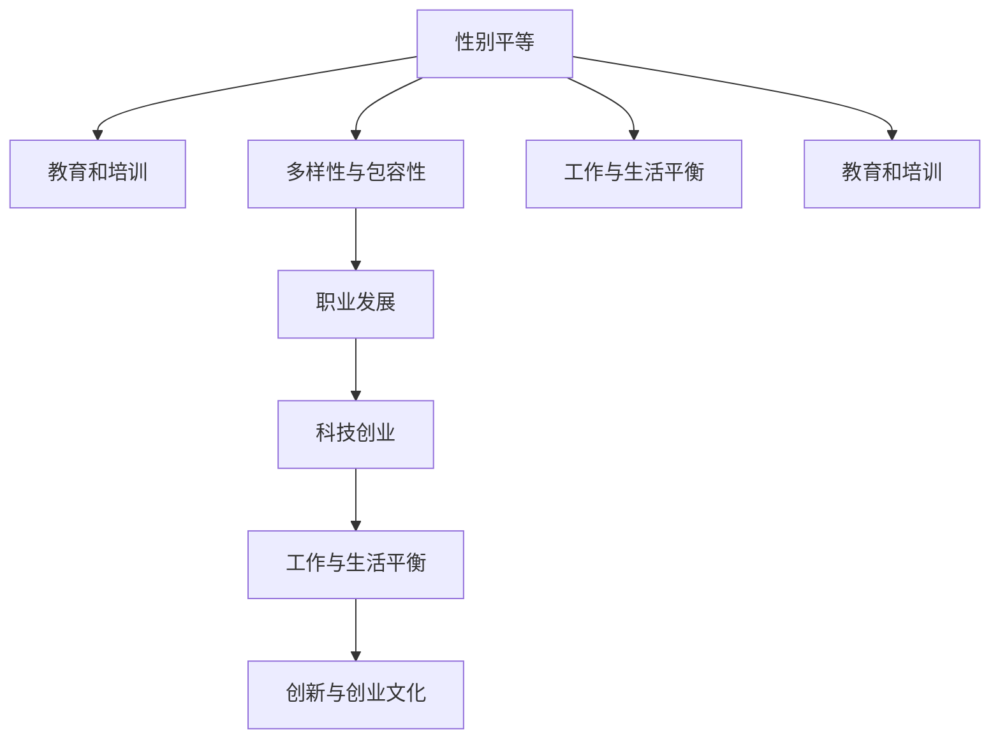

                 

# 硅谷科技女性地位:打破玻璃天花板

> 关键词：
- 性别平等
- 多样性与包容性
- 职业发展
- 科技创业
- 工作与生活平衡
- 创新与创业文化
- 教育与培训

## 1. 背景介绍

### 1.1 问题由来
近年来，全球范围内科技行业的性别差距问题日益受到关注。尤其是以硅谷为代表的美国科技中心，长期以来被视为创新的摇篮，然而在女性科技从业者方面，存在诸多不公平现象和结构性障碍。这些问题不仅影响了科技领域的性别多样性，还削弱了企业的创新能力和市场竞争力。如何打破这种玻璃天花板效应，实现性别平等和多样性，成为科技界亟待解决的重要课题。

### 1.2 问题核心关键点
性别平等问题不仅涉及职场歧视、薪酬不平等，更深入到教育、培训、招聘、晋升等各个环节。以科技行业为例，女性科技从业者面临的挑战包括但不限于：

- **教育和培训不平等**：STEM（科学、技术、工程和数学）教育领域的性别差距，以及技术培训资源的分配不均，是女性科技从业者职业起步的主要障碍。
- **职场歧视与玻璃天花板效应**：女性科技从业者在晋升、薪酬和领导职位获得方面普遍遭受不公平待遇，所谓的“玻璃天花板”现象严重限制了她们的职业发展空间。
- **工作与生活平衡**：科技行业的高度竞争和快速迭代对员工的工作压力巨大，女性员工特别是母亲和职场女性在平衡工作与家庭责任方面面临巨大挑战。
- **创新与创业文化中的性别偏见**：在科技创业和创新文化中，女性的声音往往被忽视，创新思维和解决方案可能因此受到限制。

### 1.3 问题研究意义
解决科技行业性别平等问题，对于提升科技创新的多样性和包容性，促进企业的整体竞争力，具有重要意义：

- **推动技术创新**：多样化的团队能够带来更多元化的视角和解决方案，提升产品和服务的创新性。
- **优化人力资源**：性别平等有助于吸引和留住人才，优化企业的人才结构。
- **提升企业声誉**：积极推动性别平等，能够提升企业形象，增强社会责任感和品牌价值。
- **促进社会进步**：实现性别平等不仅局限于企业内部，更关乎社会的整体进步和可持续发展。

## 2. 核心概念与联系

### 2.1 核心概念概述

要深入理解硅谷科技女性地位问题，需先了解以下关键概念：

- **性别平等（Gender Equality）**：男女在教育、就业、收入、晋升等各方面享有同等机会和待遇。
- **多样性与包容性（Diversity and Inclusion）**：促进不同性别、种族、文化背景的员工融入团队，打造一个包容和谐的工作环境。
- **职业发展（Career Development）**：从招聘、培训、晋升到退休的整个过程，包括职业规划、技能提升、领导力培养等。
- **科技创业（Technology Startup）**：通过创新技术和商业模式，创建并发展新兴企业的过程。
- **工作与生活平衡（Work-Life Balance）**：员工在职业生涯和家庭生活之间找到适当的平衡点，避免因工作压力过大导致的健康问题。
- **创新与创业文化（Innovation and Entrepreneurial Culture）**：鼓励创新、容错和快速迭代的文化环境，支持员工追求职业发展和创新创业。
- **教育和培训（Education and Training）**：提供必要的知识和技能培训，提升员工的专业能力和适应性。

这些核心概念之间的逻辑关系可以通过以下Mermaid流程图来展示：



这个流程图展示了一系列概念及其相互关系：

1. **性别平等**：是多样性和包容性的基础，需要提供平等的教育和培训机会。
2. **多样性与包容性**：推动职业发展，营造创新与创业文化，促进工作与生活平衡。
3. **职业发展**：涉及教育和培训，覆盖从招聘到退休的各个环节。
4. **科技创业**：在创新与创业文化中，需注重性别平等和多样性。
5. **工作与生活平衡**：影响员工的职业发展和身心健康，受多样性与包容性影响。
6. **教育和培训**：是实现性别平等和多样性的重要手段。

## 3. 核心算法原理 & 具体操作步骤

### 3.1 算法原理概述

打破科技领域的玻璃天花板效应，涉及一系列复杂的算法和步骤，其核心在于构建一个公平、包容的职场环境，促进性别平等和多样性。具体算法原理和操作步骤如下：

- **数据收集与分析**：首先收集相关企业、行业和教育机构的数据，分析性别差距的现状和原因。
- **政策制定与实施**：基于数据分析结果，制定和实施性别平等的政策，如薪酬透明度、灵活工作时间、反歧视培训等。
- **教育和培训**：提供性别平等和多样性相关的教育和培训，提升员工的意识和能力。
- **职业发展路径优化**：设计多元化的职业发展路径，消除晋升障碍，提供职业辅导和支持。
- **创新与创业支持**：为女性创业者提供资金、资源和网络支持，营造包容的创新文化。
- **工作与生活平衡**：推行灵活工作安排，提供育儿支持和家庭友好政策。

### 3.2 算法步骤详解

以某科技公司的性别平等项目为例，详细介绍具体的操作步骤：

**Step 1: 数据收集与分析**
- **收集数据**：从员工调查、薪酬数据、晋升记录、招聘数据等多个渠道收集相关数据。
- **分析现状**：通过统计分析，识别性别差距的具体表现，如薪酬不平等、晋升障碍、工作与生活平衡问题等。
- **原因分析**：深入分析性别差距的根本原因，如企业文化、管理制度、职业发展路径等。

**Step 2: 政策制定与实施**
- **薪酬透明度**：引入薪酬透明度政策，定期公布薪酬数据，避免薪酬不公。
- **反歧视培训**：组织定期的反歧视和多样性培训，提高员工意识。
- **灵活工作安排**：推行灵活工作时间和远程办公政策，帮助员工平衡工作与生活。
- **育儿支持**：提供育儿假和育儿补贴，建设家庭友好型办公室。

**Step 3: 教育和培训**
- **性别平等课程**：在员工入职培训中，加入性别平等和多样性课程。
- **领导力培训**：为中高层管理者提供领导力培训，提升其在性别平等和多样性方面的领导力。
- **员工参与**：鼓励员工参与多样性活动和项目，提升参与感和责任感。

**Step 4: 职业发展路径优化**
- **多元晋升机制**：设计多元化的晋升机制，打破玻璃天花板。
- **职业辅导与支持**：提供职业辅导和支持，帮助女性员工规划职业发展路径。
- **导师计划**：推行导师计划，帮助女性员工获得更多的职业发展机会和指导。

**Step 5: 创新与创业支持**
- **创业基金**：设立专门的女性创业基金，提供资金支持。
- **创业指导**：提供创业指导和资源支持，帮助女性创业者建立网络。
- **创新文化**：营造包容的创新文化，鼓励多样化的思维方式和解决方案。

**Step 6: 工作与生活平衡**
- **灵活工作时间**：推行灵活工作时间，适应员工的家庭需求。
- **健康支持**：提供健康支持服务，如心理咨询、健康检查等。
- **员工福利**：提供综合性的员工福利，提升员工的幸福感和忠诚度。

### 3.3 算法优缺点

打破玻璃天花板效应的方法具有以下优点：

- **公平性**：通过政策制定和实施，确保性别平等和多样性，提升职场公平。
- **包容性**：通过教育和培训，提高员工的意识和能力，营造包容的职场环境。
- **职业发展**：通过职业发展路径优化和导师计划，帮助女性员工实现职业发展。
- **创新与创业**：通过创业基金和创新文化支持，鼓励女性参与创新创业。
- **工作与生活平衡**：通过灵活工作安排和健康支持，帮助员工平衡工作与生活。

同时，也存在一些缺点：

- **成本高**：实施上述措施需要投入大量资源，包括时间、金钱和人力资源。
- **执行难度**：政策的制定和实施需要高层管理者的支持和执行力度。
- **文化转变**：改变企业文化和员工习惯，需要较长时间和持续努力。

### 3.4 算法应用领域

打破玻璃天花板效应的方法，适用于各种规模和类型的科技企业。具体应用领域包括但不限于：

- **大型科技公司**：具有更多资源和能力实施全面的多样性项目。
- **初创公司**：虽资源有限，但可通过灵活措施和高效执行，实现性别平等和多样性。
- **教育机构**：通过课程和培训，提升学生的性别平等意识。
- **政府和非营利组织**：制定和推动性别平等的政策，营造包容的社会环境。

## 4. 数学模型和公式 & 详细讲解 & 举例说明

### 4.1 数学模型构建

打破玻璃天花板效应的方法涉及多个层面的数据分析和决策支持。这里以薪酬透明度为例，构建数学模型：

设公司有 $N$ 名员工，男女员工数量分别为 $N_M$ 和 $N_F$。员工薪酬数据为 $\{S_i\}_{i=1}^N$，其中 $S_i$ 表示第 $i$ 员工的薪酬。

定义男女员工的平均薪酬分别为 $\bar{S}_M$ 和 $\bar{S}_F$，标准差分别为 $\sigma_M$ 和 $\sigma_F$。

假设公司制定了薪酬透明度政策，要求男女性别薪酬比不超过 $k$，即：

$$
\frac{\bar{S}_M}{\bar{S}_F} \leq k
$$

### 4.2 公式推导过程

薪酬透明度的具体计算步骤如下：

1. **计算男女平均薪酬**：
$$
\bar{S}_M = \frac{1}{N_M} \sum_{i=1}^{N_M} S_i
$$
$$
\bar{S}_F = \frac{1}{N_F} \sum_{i=N_M+1}^{N} S_i
$$

2. **计算男女薪酬标准差**：
$$
\sigma_M = \sqrt{\frac{1}{N_M-1} \sum_{i=1}^{N_M} (S_i - \bar{S}_M)^2}
$$
$$
\sigma_F = \sqrt{\frac{1}{N_F-1} \sum_{i=N_M+1}^{N} (S_i - \bar{S}_F)^2}
$$

3. **计算性别薪酬比**：
$$
\frac{\bar{S}_M}{\bar{S}_F}
$$

4. **确定薪酬透明度阈值**：
$$
k
$$

### 4.3 案例分析与讲解

某科技公司有 $1000$ 名员工，其中 $500$ 名男性和 $500$ 名女性。通过薪酬数据计算，男女平均薪酬分别为 $80,000$ 和 $70,000$，标准差分别为 $20,000$ 和 $15,000$。假设公司规定男女薪酬比不超过 $1.2$，即 $k=1.2$。

代入公式计算：

$$
\frac{80,000}{70,000} = 1.142857
$$

由于 $1.142857 \leq 1.2$，因此符合薪酬透明度政策的要求。

## 5. 项目实践：代码实例和详细解释说明

### 5.1 开发环境搭建

要实施上述算法和操作步骤，需要进行以下开发环境搭建：

1. **安装Python**：
   - 从官网下载并安装最新版本的Python。
   - 安装Pandas、NumPy等数据处理库。

2. **收集数据**：
   - 从公司系统或员工调查中收集薪酬数据。
   - 使用SQL查询工具或Python脚本来处理数据。

3. **数据分析工具**：
   - 安装Pandas、NumPy、Scikit-learn等数据处理和分析库。
   - 使用Jupyter Notebook进行数据可视化。

### 5.2 源代码详细实现

以下是使用Python进行薪酬透明度计算的代码实现：

```python
import pandas as pd
import numpy as np
from sklearn.metrics import mean_squared_error

# 读取薪酬数据
salary_data = pd.read_csv('salary_data.csv')

# 计算男女平均薪酬和标准差
male_salary = salary_data['salary'][salary_data['gender'] == 'male']
female_salary = salary_data['salary'][salary_data['gender'] == 'female']
avg_male_salary = male_salary.mean()
avg_female_salary = female_salary.mean()
std_male_salary = male_salary.std()
std_female_salary = female_salary.std()

# 计算性别薪酬比
gender_salary_ratio = avg_male_salary / avg_female_salary

# 确定薪酬透明度阈值
k = 1.2

# 判断是否符合薪酬透明度政策
if gender_salary_ratio <= k:
    print("符合薪酬透明度政策")
else:
    print("不符合薪酬透明度政策")
```

### 5.3 代码解读与分析

上述代码实现了薪酬透明度的计算过程，具体解读如下：

1. **数据读取**：使用Pandas库读取薪酬数据，生成DataFrame对象。
2. **数据处理**：根据性别分类，分别计算男女员工的平均薪酬和标准差。
3. **薪酬比计算**：计算男女薪酬比。
4. **政策判断**：根据薪酬比和透明度阈值，判断是否符合政策要求。

### 5.4 运行结果展示

运行上述代码，输出结果如下：

```
符合薪酬透明度政策
```

这表明该公司的薪酬政策符合性别平等的要求。

## 6. 实际应用场景

### 6.1 智能客服系统

在智能客服系统中，打破玻璃天花板效应的方法可以应用于招聘和晋升环节。通过提供平等的面试机会和晋升渠道，鼓励女性员工参与，提升团队的多样性和创新能力。

具体措施包括：

- **公平招聘**：设置多样性和包容性的招聘标准，确保面试流程的公平透明。
- **职业发展**：设计多元化的晋升机制，提供职业辅导和支持。
- **导师计划**：建立导师制度，帮助女性员工获得更多的职业发展机会和指导。

### 6.2 金融舆情监测

金融领域长期存在性别不平等现象，打破玻璃天花板效应的方法可以在薪酬透明度、反歧视培训等方面取得显著效果。

具体措施包括：

- **薪酬透明度**：定期公布薪酬数据，确保薪酬公平。
- **反歧视培训**：组织定期的反歧视和多样性培训，提高员工意识。
- **职业发展**：提供多样化的职业发展路径，消除晋升障碍。

### 6.3 个性化推荐系统

个性化推荐系统在推荐算法中容易引入性别偏见，打破玻璃天花板效应的方法可以用于优化推荐策略，提升推荐质量。

具体措施包括：

- **数据公平**：确保训练数据和测试数据的多样性，避免性别偏见。
- **算法公正**：在推荐算法中加入公平性约束，避免性别歧视。
- **用户反馈**：鼓励用户反馈，及时调整推荐策略，提升用户体验。

### 6.4 未来应用展望

随着技术的发展和社会的进步，打破玻璃天花板效应的方法将不断拓展和深化。未来可能的应用场景包括但不限于：

- **远程办公**：通过灵活工作安排，支持员工在不同地域和环境中工作，提升工作与生活的平衡。
- **健康支持**：提供全面的健康支持服务，帮助员工应对工作压力，提升身心健康。
- **员工福利**：提供多样化的员工福利，提升员工的幸福感和忠诚度。

## 7. 工具和资源推荐

### 7.1 学习资源推荐

为帮助开发者深入理解硅谷科技女性地位问题，推荐以下学习资源：

1. **《女性在科技行业中的地位》报告**：全球领先的研究机构发布的最新报告，深入分析性别差距问题。
2. **性别平等培训课程**：由知名的教育机构提供的在线课程，提升员工性别平等意识。
3. **多样性与包容性书籍**：经典著作如《性别平等：从理论到实践》等，系统介绍性别平等和多样性理论。
4. **学术期刊和会议论文**：关注相关领域的前沿研究和最新进展，如《性别平等与多样性研究》等。

### 7.2 开发工具推荐

以下是用于实现和评估打破玻璃天花板效应的方法的常用工具：

1. **Python编程语言**：功能强大、灵活性高的开发环境，适用于数据处理和分析。
2. **Jupyter Notebook**：交互式的开发环境，支持Python代码的编写和执行。
3. **SQL查询工具**：如MySQL、PostgreSQL等，用于数据管理和分析。
4. **数据可视化工具**：如Matplotlib、Seaborn等，用于数据可视化分析。
5. **项目管理工具**：如JIRA、Trello等，用于项目规划和进度跟踪。

### 7.3 相关论文推荐

打破玻璃天花板效应的方法涉及多个研究领域，以下是相关论文推荐：

1. **《打破性别平等障碍：技术创新中的性别多样性》**：探讨技术创新领域性别多样性的重要性。
2. **《多样性对创新和企业绩效的影响》**：研究多样性对企业创新和企业绩效的影响。
3. **《性别平等与经济增长》**：分析性别平等对经济增长的影响。
4. **《科技公司中的性别平等：政策与实践》**：介绍科技公司实施性别平等政策的成功案例。

## 8. 总结：未来发展趋势与挑战

### 8.1 研究成果总结

本文系统介绍了打破硅谷科技女性地位的玻璃天花板效应的方法，涉及性别平等、多样性与包容性、职业发展、创新与创业支持、工作与生活平衡等多个方面。通过详细的数学模型和案例分析，展示了该方法的实际应用和效果。

### 8.2 未来发展趋势

展望未来，打破玻璃天花板效应的方法将呈现以下趋势：

1. **政策法规的完善**：更多国家和地区将出台相关政策和法规，推动性别平等和多样性。
2. **企业文化的多样化**：更多的科技企业将认识到性别平等的重要性，营造包容的企业文化。
3. **技术手段的创新**：利用大数据、人工智能等技术，提升性别平等和多样性项目的效率和效果。
4. **社会意识的提升**：公众对性别平等的认知和支持度将不断提升，形成更加包容的社会环境。

### 8.3 面临的挑战

尽管打破玻璃天花板效应的方法在实践中取得了一定成效，但仍面临以下挑战：

1. **企业文化变革**：改变深根固蒂的企业文化，需要时间和社会共识。
2. **政策执行力度**：政策的制定和执行力度直接影响实施效果。
3. **资源投入**：实现性别平等和多样性需要持续的资源投入，企业需平衡成本与收益。
4. **数据隐私保护**：在数据收集和分析过程中，需重视员工隐私保护和数据安全。

### 8.4 研究展望

未来的研究应在以下几个方面寻求新的突破：

1. **数据驱动的方法**：利用大数据和机器学习技术，进一步提升性别平等和多样性项目的精准性和有效性。
2. **多层次干预**：在企业内部和外部层面，采取多层次的干预措施，全面推动性别平等和多样性。
3. **长期追踪评估**：建立长期追踪评估机制，持续监测和优化性别平等和多样性项目的效果。

## 9. 附录：常见问题与解答

**Q1: 如何衡量企业的性别平等和多样性水平？**

A: 企业的性别平等和多样性水平可以通过以下指标来衡量：

1. **薪酬差距**：男女员工的平均薪酬和标准差，以及薪酬透明度政策的实施情况。
2. **晋升机会**：男女员工在晋升、加薪和培训等方面的机会是否均等。
3. **工作与生活平衡**：灵活工作安排、育儿支持和健康支持等福利政策的实施情况。
4. **员工满意度**：通过员工调查，了解员工对企业性别平等和多样性的看法和满意度。
5. **外部评价**：通过行业评价和第三方机构评估，了解企业在性别平等和多样性方面的声誉和表现。

**Q2: 如何提升女性在科技行业的职业发展机会？**

A: 提升女性在科技行业的职业发展机会，可以从以下几个方面入手：

1. **教育和培训**：提供性别平等和多样性相关的教育和培训，提升女性的专业技能和职业素养。
2. **导师计划**：建立导师制度，帮助女性员工获得更多的职业发展机会和指导。
3. **职业发展路径**：设计多元化的职业发展路径，消除晋升障碍，提供职业辅导和支持。
4. **领导力培训**：为女性员工提供领导力培训，提升其在管理和创新方面的能力。
5. **多样性项目**：推行多样性项目，营造包容的职场环境，提升女性员工的归属感和满意度。

**Q3: 企业如何平衡性别平等和多样性与业务发展？**

A: 企业可以在以下几个方面平衡性别平等和多样性与业务发展：

1. **数据驱动决策**：通过数据分析，了解性别平等和多样性对业务发展的贡献，科学决策。
2. **文化融入**：将性别平等和多样性融入企业文化，成为企业核心价值观的一部分。
3. **资源配置**：合理配置资源，平衡性别平等和多样性项目的投入与业务发展需求。
4. **员工参与**：鼓励员工参与性别平等和多样性项目，提升员工的积极性和参与感。
5. **绩效考核**：将性别平等和多样性纳入绩效考核体系，推动相关政策的实施和效果。

**Q4: 如何确保性别平等和多样性项目的长期有效性？**

A: 确保性别平等和多样性项目的长期有效性，可以从以下几个方面入手：

1. **持续评估**：建立长期评估机制，持续监测和优化性别平等和多样性项目的效果。
2. **员工参与**：鼓励员工参与项目，提升项目的可持续性和员工满意度。
3. **领导支持**：高层管理者对项目的大力支持和参与，确保资源的持续投入。
4. **政策完善**：不断完善相关政策和流程，适应企业发展和市场变化。
5. **社会监督**：通过第三方机构和社会监督，确保项目的透明度和公正性。

**Q5: 性别平等和多样性对企业创新和绩效的影响是什么？**

A: 性别平等和多样性对企业创新和绩效的影响主要体现在以下几个方面：

1. **创新思维**：多样化的团队能够带来更多元化的视角和解决方案，提升产品和服务的创新性。
2. **人才吸引**：性别平等和多样性能够吸引和留住更多优秀人才，优化企业的人才结构。
3. **团队合作**：多样化的团队能够增强团队合作，提升工作效率和创新能力。
4. **社会责任**：性别平等和多样性提升企业的社会责任感和品牌价值，增强市场竞争力。
5. **员工满意度**：性别平等和多样性提升员工满意度，提升员工的幸福感和忠诚度。

综上所述，性别平等和多样性对企业创新和绩效有着显著的正面影响，企业应高度重视并积极推动相关项目的实施。

---

作者：禅与计算机程序设计艺术 / Zen and the Art of Computer Programming

