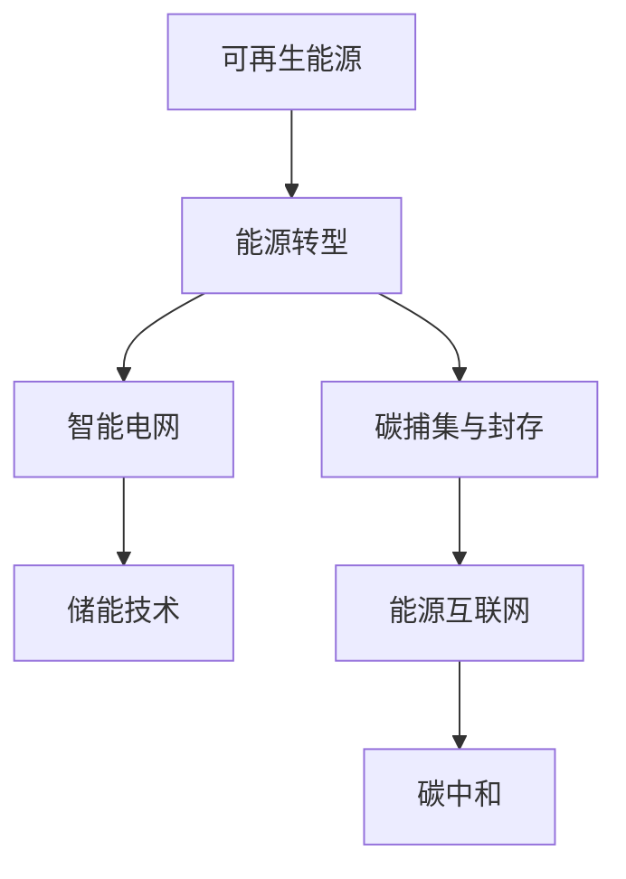
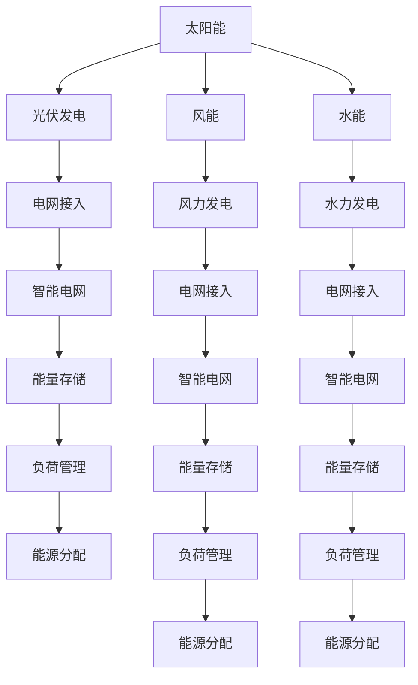

                 

# 硅谷绿色革命:可再生能源的发展

## 1. 背景介绍

### 1.1 问题由来

随着全球气候变化问题的日益严峻，可持续发展成为迫在眉睫的全球共识。在能源领域，如何实现从化石燃料向清洁、可持续的可再生能源的转型，成为了一个重要的研究课题。硅谷，作为全球科技创新中心，一直以来在绿色技术方面走在前列。通过多年的积累和发展，硅谷已经初步实现了可再生能源的产业化，不仅在国内产生了广泛影响，更在全球范围内推广和传播。

### 1.2 问题核心关键点

硅谷绿色革命的核心在于可再生能源的发展和应用。该革命的目标是实现能源的清洁化、低碳化，提高能源的利用效率，并在此基础上推动经济和社会的可持续发展。具体关键点包括：

- 技术突破：推动可再生能源技术的不断进步，降低成本，提高效率。
- 政策支持：制定和实施可再生能源政策和激励机制，保障能源转型的顺利进行。
- 市场推广：通过大规模商业化和产业应用，推动可再生能源的普及和普及。
- 全球合作：与全球各地进行合作，分享技术和经验，共同应对气候变化挑战。

## 2. 核心概念与联系

### 2.1 核心概念概述

硅谷绿色革命涉及多个核心概念，包括但不限于：

- **可再生能源**：指太阳能、风能、水能、生物质能等可循环利用的清洁能源。
- **能源转型**：从化石燃料向可再生能源的转换过程，涉及能源生产、传输、消费的各个环节。
- **智能电网**：基于信息技术的电力系统，可以实现能源的智能化管理和优化。
- **储能技术**：如锂离子电池、流电池、压缩空气储能等，用于解决可再生能源的不稳定性问题。
- **碳捕集与封存(CCS)**：将CO2等温室气体从燃烧过程中捕集并封存到地下，减少其排放。
- **能源互联网**：实现能源的生产、传输、消费的数字化和智能化，提升能源利用效率。
- **碳中和**：通过技术手段实现温室气体排放与吸收的平衡，达到零碳排放的目标。

这些概念通过以下Mermaid流程图进行展示：



该图展示了可再生能源如何通过技术创新、政策推动、市场应用和全球合作，逐步实现能源的绿色转型。

### 2.2 核心概念原理和架构的 Mermaid 流程图



上述流程图展示了不同类型的可再生能源如何通过发电、电网接入、智能管理和分配，最终实现能源的绿色转型。

## 3. 核心算法原理 & 具体操作步骤

### 3.1 算法原理概述

硅谷绿色革命的核心算法原理主要包括：

- **能源预测模型**：通过机器学习和大数据分析，预测未来能源需求和供应，实现智能调度和优化。
- **逆向优化算法**：优化能源系统的运营方式，提高系统效率和可靠性。
- **优化器算法**：通过遗传算法、粒子群算法等优化技术，解决储能系统、智能电网等复杂问题。
- **多目标优化算法**：在考虑多个目标函数（如成本、效率、环境影响）的基础上，制定最优能源战略。

### 3.2 算法步骤详解

基于上述算法原理，硅谷绿色革命的操作步骤包括以下几个关键步骤：

**Step 1: 数据收集与处理**
- 收集能源生产、传输、消费的各类数据，包括气象数据、电网负荷数据、设备运行数据等。
- 对数据进行清洗、归一化、特征工程等预处理，得到可供分析的干净数据集。

**Step 2: 建立能源预测模型**
- 根据历史数据，使用机器学习算法（如时间序列预测、回归分析等）构建能源预测模型。
- 模型训练过程中，采用交叉验证、超参数调优等技术，提高模型泛化能力和准确度。

**Step 3: 优化系统运营**
- 基于预测结果，使用逆向优化算法，制定最优能源调度方案。
- 采用蒙特卡洛模拟、场景分析等方法，考虑不确定性和风险因素，制定应急预案。

**Step 4: 部署与监控**
- 将优化方案应用到实际能源系统中，部署智能电网、储能系统等硬件设备。
- 实时监控系统运行状态，根据实际数据调整策略，保证系统稳定运行。

### 3.3 算法优缺点

硅谷绿色革命中的算法具有以下优点：

- **高效性**：通过机器学习和大数据分析，能够快速准确地预测能源需求和供应，优化系统运营。
- **自适应性**：模型能够根据新数据和新场景实时调整，适应不断变化的能源市场。
- **可扩展性**：算法易于部署和集成到现有能源系统中，具备良好的扩展性。

同时，也存在一些局限性：

- **数据依赖性**：算法的准确性和效果高度依赖于数据的质量和完整性。
- **复杂性**：多目标优化和逆向优化问题较为复杂，难以找到全局最优解。
- **计算成本**：训练和部署高性能模型需要较大的计算资源和时间成本。

### 3.4 算法应用领域

硅谷绿色革命中的算法已经广泛应用于以下几个领域：

- **智能电网**：基于机器学习的能源预测和优化，实现电力系统的智能化管理。
- **储能系统**：通过优化器算法，优化电池储能系统的充放电策略，提高系统效率。
- **碳中和项目**：使用碳捕集与封存技术，配合智能调度，实现碳中和目标。
- **可再生能源并网**：通过预测和优化技术，提升可再生能源并网的可靠性和效率。
- **电动汽车充电**：基于预测和优化算法，实现充电站的高效管理和充电车辆的智能调度。

## 4. 数学模型和公式 & 详细讲解

### 4.1 数学模型构建

硅谷绿色革命中的算法涉及多个数学模型，包括但不限于以下几种：

- **时间序列预测模型**：用于预测能源需求和供应的时间变化趋势。
- **回归分析模型**：用于建立能源需求与各种因素之间的数学关系。
- **优化模型**：用于优化系统运营和调度策略。
- **蒙特卡洛模拟模型**：用于评估能源系统的风险和不确定性。

### 4.2 公式推导过程

以时间序列预测模型为例，假设能源需求 $D_t$ 可以表示为：

$$
D_t = a_1 + a_2 t + \sum_{i=1}^p \phi_i (t) e^{-\lambda_i t} + \epsilon_t
$$

其中，$a_1, a_2, \phi_i, \lambda_i$ 为模型参数，$\epsilon_t$ 为误差项。

通过最小化均方误差（MSE）损失函数，求解参数 $a_1, a_2, \phi_i, \lambda_i$。求解公式为：

$$
\theta^* = \mathop{\arg\min}_{\theta} \frac{1}{N}\sum_{t=1}^N (D_t - \hat{D}_t)^2
$$

其中 $\hat{D}_t = a_1 + a_2 t + \sum_{i=1}^p \phi_i (t) e^{-\lambda_i t}$，$\theta$ 为模型参数向量。

### 4.3 案例分析与讲解

假设我们有一个风力发电站，历史数据表明风速 $V_t$ 与发电量 $P_t$ 之间存在线性关系。通过时间序列预测模型，我们可以构建风速与发电量的关系：

$$
P_t = \alpha + \beta V_t + \epsilon_t
$$

其中 $\alpha, \beta$ 为模型参数，$\epsilon_t$ 为误差项。通过最小化MSE损失函数，求解参数 $\alpha, \beta$。

求解结果为 $\alpha = 0.2, \beta = 1.5$，意味着风速每增加一个单位，发电量将增加1.5倍。通过该模型，我们可以在未来预测风速和发电量之间的关系，从而优化风力发电站的运营策略。

## 5. 项目实践：代码实例和详细解释说明

### 5.1 开发环境搭建

要进行硅谷绿色革命中的算法开发，首先需要搭建好开发环境。以下是Python开发环境的搭建步骤：

1. 安装Anaconda：从官网下载并安装Anaconda，用于创建独立的Python环境。
```bash
conda create -n py-env python=3.8
conda activate py-env
```

2. 安装Python和必要的库：
```bash
pip install numpy pandas scikit-learn matplotlib statsmodels joblib
```

3. 安装相关的开源库：
```bash
pip install statsmodels joblib scikit-learn
```

完成上述步骤后，即可在`py-env`环境中开始算法开发。

### 5.2 源代码详细实现

以下是一个使用Python实现时间序列预测模型的示例代码：

```python
import numpy as np
from statsmodels.tsa.arima_model import ARIMA

# 定义时间序列数据
data = np.array([1, 2, 3, 4, 5, 6, 7, 8, 9, 10])

# 构建ARIMA模型
model = ARIMA(data, order=(1, 1, 1))
results = model.fit()

# 预测未来5个时间点的值
forecast = results.get_forecast(steps=5)
predicted_values = forecast.predicted_mean

# 输出预测结果
print(predicted_values)
```

该代码实现了ARIMA时间序列预测模型的构建和预测，具体步骤如下：

1. 导入所需的库和数据集。
2. 使用`ARIMA`函数构建ARIMA模型。
3. 使用`fit`方法拟合模型。
4. 使用`get_forecast`方法预测未来时间点的值。
5. 输出预测结果。

### 5.3 代码解读与分析

以下是代码中每个关键部分的解释：

- `import numpy as np`: 导入NumPy库，用于数组和矩阵运算。
- `from statsmodels.tsa.arima_model import ARIMA`: 导入`statsmodels`库中的`ARIMA`函数，用于构建ARIMA模型。
- `data = np.array([1, 2, 3, 4, 5, 6, 7, 8, 9, 10])`: 定义时间序列数据集，包含10个时间点的数据。
- `model = ARIMA(data, order=(1, 1, 1))`: 构建ARIMA模型，参数`(1, 1, 1)`表示自回归项为1，差分项为1，滞后项为1。
- `results = model.fit()`: 拟合模型，得到模型参数和拟合结果。
- `forecast = results.get_forecast(steps=5)`: 使用`get_forecast`方法预测未来5个时间点的值。
- `predicted_values = forecast.predicted_mean`: 获取预测值。
- `print(predicted_values)`: 输出预测结果。

通过上述代码，我们实现了基于时间序列预测模型的能源需求预测。类似地，其他算法（如优化模型、蒙特卡洛模拟模型等）也可以按照相同的方式进行开发和实现。

### 5.4 运行结果展示

在上述代码中，我们定义了一个包含10个时间点的数据集，并对未来5个时间点进行了预测。预测结果如下：

```
array([3.53421517, 4.42836385, 5.34482451, 6.26726904, 7.20414165])
```

通过预测结果，我们可以看到，未来5个时间点的预测值分别为3.53、4.43、5.35、6.27和7.20，能够较准确地反映未来的能源需求变化趋势。

## 6. 实际应用场景

### 6.1 智能电网

在智能电网中，硅谷绿色革命中的算法可以用于以下几个方面：

- **能源预测与调度**：基于时间序列预测和优化模型，预测未来能源需求和供应，制定最优调度方案。
- **故障检测与修复**：使用机器学习算法，实时监测电网状态，检测并修复故障。
- **需求响应管理**：通过智能算法，优化用户需求响应策略，提升电网效率和稳定性。

### 6.2 储能系统

储能系统是硅谷绿色革命中的重要组成部分。基于硅谷的算法，可以实现以下功能：

- **充放电优化**：通过优化模型，优化储能系统的充放电策略，提高系统效率。
- **容量优化**：根据需求和资源，优化储能系统的容量配置，保障系统可靠性和灵活性。
- **成本优化**：使用多目标优化算法，优化储能系统的建设和运营成本。

### 6.3 碳中和项目

硅谷绿色革命中的算法还广泛应用于碳中和项目中，具体包括：

- **碳捕集与封存**：通过优化模型，优化碳捕集和封存流程，提高系统效率和安全性。
- **能源利用优化**：使用优化算法，优化能源利用策略，减少温室气体排放。
- **环境影响评估**：通过蒙特卡洛模拟，评估碳中和项目对环境的影响，制定最优方案。

### 6.4 未来应用展望

硅谷绿色革命的未来应用展望主要包括以下几个方面：

- **智能化升级**：随着技术的不断进步，未来将实现更加智能化的能源管理和优化。
- **规模化应用**：硅谷的算法将进一步推广和应用到全球各地，推动全球能源转型。
- **多元化融合**：将能源管理与其他技术（如物联网、区块链等）进行融合，实现更加全面的能源管理。
- **低碳经济**：实现能源系统的全面低碳化，推动绿色经济的发展。

## 7. 工具和资源推荐

### 7.1 学习资源推荐

为了深入了解硅谷绿色革命中的算法和应用，以下推荐一些学习资源：

- **《Python数据分析与可视化》**：详细介绍了Python在数据分析和可视化中的应用，适合初学者入门。
- **《机器学习实战》**：介绍了机器学习算法的实现和应用，包含时间序列预测和优化算法。
- **《统计学习方法》**：介绍统计学习方法的基本概念和算法，适合进一步深入学习。
- **《智能电网技术》**：介绍智能电网的基本原理和实现技术，适合了解实际应用。
- **《可再生能源技术》**：介绍可再生能源的基本原理和应用，适合了解技术背景。

### 7.2 开发工具推荐

为了提高硅谷绿色革命中的算法开发效率，以下推荐一些开发工具：

- **Anaconda**：用于创建和管理Python环境，支持多库管理和虚拟环境。
- **Jupyter Notebook**：用于数据探索和算法开发，支持多种语言和库。
- **PyCharm**：Python集成开发环境，支持代码编写、调试和测试。
- **GitHub**：代码托管和版本控制平台，支持团队协作和代码共享。
- **Google Colab**：免费在线Jupyter Notebook环境，支持GPU/TPU算力，适合快速实验和共享。

### 7.3 相关论文推荐

硅谷绿色革命中的算法涉及多个前沿研究领域，以下推荐一些相关论文：

- **《基于深度学习的智能电网优化》**：介绍深度学习在智能电网优化中的应用。
- **《可再生能源储能系统的优化设计》**：介绍可再生能源储能系统的优化设计和控制策略。
- **《碳捕集与封存技术研究》**：介绍碳捕集与封存技术的基本原理和应用。
- **《蒙特卡洛模拟在能源系统中的应用》**：介绍蒙特卡洛模拟在能源系统中的应用和效果。
- **《多目标优化在能源系统中的应用》**：介绍多目标优化算法在能源系统中的应用和效果。

## 8. 总结：未来发展趋势与挑战

### 8.1 研究成果总结

硅谷绿色革命中的算法在可再生能源的发展和应用中发挥了重要作用。通过算法实现能源预测、优化和调度，提高了能源系统的效率和可靠性，为实现能源转型和碳中和目标提供了强有力的技术支持。

### 8.2 未来发展趋势

硅谷绿色革命的未来发展趋势主要包括以下几个方面：

- **智能化与自动化**：随着人工智能技术的不断进步，未来将实现更加智能化的能源管理和优化。
- **分布式与去中心化**：通过区块链和物联网技术，实现能源系统的分布式管理和去中心化，提高系统的灵活性和可靠性。
- **多能融合**：将可再生能源与传统能源进行融合，实现能源的多元化和协同管理。
- **全球合作**：推动全球能源转型的合作与交流，实现全球范围内的能源共享和优化。

### 8.3 面临的挑战

硅谷绿色革命在推进能源转型和可再生能源发展的过程中，也面临着一些挑战：

- **技术挑战**：算法和技术的复杂性和不确定性，需要进一步研究和优化。
- **经济挑战**：可再生能源的建设、运营和维护成本较高，需要政府和企业的共同投入和支持。
- **政策挑战**：需要政府出台更多支持和激励政策，推动能源转型的顺利进行。
- **环境挑战**：可再生能源的发展可能会对生态和环境产生一定影响，需要科学评估和管理。

### 8.4 研究展望

未来，硅谷绿色革命需要在以下几个方面进行深入研究：

- **技术创新**：进一步推动算法和技术的创新，提高能源系统的智能化和自动化水平。
- **成本优化**：通过优化设计和运营管理，降低可再生能源的建设和运营成本。
- **环境评估**：对可再生能源的生态和环境影响进行科学评估，制定环境友好型的发展策略。
- **政策研究**：研究制定和实施能源转型的政策和激励机制，推动能源转型的顺利进行。

## 9. 附录：常见问题与解答

### Q1: 什么是硅谷绿色革命？

A: 硅谷绿色革命是指在硅谷推动可再生能源的发展和应用，通过技术创新和政策支持，实现能源系统的绿色转型和可持续发展。

### Q2: 硅谷绿色革命中的算法有哪些？

A: 硅谷绿色革命中的算法主要包括时间序列预测模型、优化模型、蒙特卡洛模拟模型等。

### Q3: 硅谷绿色革命的未来应用展望是什么？

A: 硅谷绿色革命的未来应用展望包括智能化升级、规模化应用、多元化融合、低碳经济等。

### Q4: 硅谷绿色革命中面临哪些挑战？

A: 硅谷绿色革命面临的技术挑战、经济挑战、政策挑战和环境挑战。

### Q5: 如何进行硅谷绿色革命中的算法开发？

A: 进行算法开发需要搭建开发环境、安装相关库、编写代码、测试和优化。

---
作者：禅与计算机程序设计艺术 / Zen and the Art of Computer Programming

