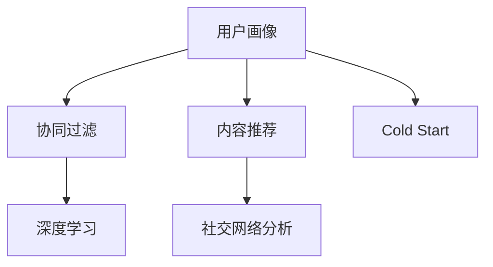

                 

# 社交网络推荐：连接用户

> 关键词：社交网络推荐, 用户画像, 协同过滤, 内容推荐, 冷启动问题, 社交网络分析, 深度学习

## 1. 背景介绍

### 1.1 问题由来
社交网络推荐系统已经成为用户获取内容的重要手段。无论是微博、知乎、抖音等，用户通过社交网络获取信息、交流观点，进而形成复杂的社交关系。如何构建更精准的推荐系统，最大化满足用户个性化需求，是当前研究者关注的核心问题。

推荐系统根据用户行为和兴趣，将内容自动推送给用户，以提升用户体验，减少信息过载。传统推荐方法包括协同过滤(Collaborative Filtering)、基于内容的推荐(Content-based Recommendation)等，但在社交网络中，用户之间的交互行为往往能够提供更加丰富的信息，更加接近用户的真实需求。

### 1.2 问题核心关键点
社交网络推荐系统涉及的核心技术包括：
1. 用户画像建模：构建用户兴趣模型，描述用户行为偏好。
2. 社交网络分析：挖掘用户之间的交互关系，提取社交特征。
3. 推荐算法：选择合适的推荐算法，优化模型参数，提升推荐精度。
4. 系统部署与维护：考虑系统的可扩展性、实时性、可用性等指标，优化推荐引擎。
5. 冷启动问题：对于新用户，如何构建有效的用户画像，减少推荐偏差。

## 2. 核心概念与联系

### 2.1 核心概念概述

社交网络推荐系统的核心概念涉及以下几个方面：

1. **用户画像**：构建用户兴趣模型，刻画用户行为特征，以指导内容推荐。
2. **协同过滤**：根据用户之间的交互关系，通过用户之间的相似性来推荐内容。
3. **内容推荐**：根据用户兴趣模型，结合内容特征，推荐可能符合用户喜好的内容。
4. **社交网络分析**：分析社交网络中用户之间的连接关系，挖掘用户社交特征。
5. **深度学习**：通过神经网络模型对用户行为和内容进行建模，提升推荐精度。
6. **冷启动问题**：对于新用户，如何快速构建有效的用户画像，以提供准确推荐。

这些核心概念之间的联系通过以下Mermaid流程图来展示：



这个流程图展示了社交网络推荐系统的核心概念及其关联：

1. 用户画像建模为协同过滤、内容推荐和深度学习提供了数据基础。
2. 社交网络分析增强了推荐系统的社交感知能力。
3. 深度学习技术提升了推荐算法的精度。
4. 冷启动问题解决是推荐系统效果提升的关键。

## 3. 核心算法原理 & 具体操作步骤
### 3.1 算法原理概述

社交网络推荐系统是一种复杂的大规模协同系统。其核心算法原理是利用用户和内容之间的交互关系，构建用户兴趣模型，并通过协同过滤算法推荐内容。深度学习技术则用于提升用户兴趣模型和协同过滤算法的精度。

1. **用户画像建模**：通过用户的历史行为数据，如浏览记录、点赞、评论等，构建用户兴趣模型，描述用户的行为偏好。
2. **协同过滤**：根据用户之间的交互关系，通过相似性度量方法，如余弦相似度、皮尔逊相关系数等，计算用户与内容之间的相似性，进行推荐。
3. **内容推荐**：根据用户兴趣模型，结合内容特征，如标题、标签、作者等，进行内容推荐，增强推荐的相关性和多样性。
4. **深度学习**：通过神经网络模型，如卷积神经网络(CNN)、循环神经网络(RNN)、Transformer等，对用户行为和内容进行建模，提取更深层次的特征。

### 3.2 算法步骤详解

社交网络推荐系统的具体操作步骤包括：

1. **数据收集**：收集社交网络中用户的行为数据，如点赞、评论、分享等，以及用户的基本信息，如年龄、性别、兴趣标签等。
2. **用户画像建模**：对用户行为数据进行特征提取和向量编码，构建用户兴趣模型，刻画用户的兴趣偏好。
3. **社交网络分析**：分析用户之间的交互关系，提取用户的社交特征，如朋友关系、共同兴趣等。
4. **协同过滤推荐**：根据用户画像和社交特征，计算用户与内容之间的相似性，进行推荐。
5. **深度学习优化**：使用深度学习技术对用户兴趣模型和协同过滤算法进行优化，提升推荐精度。
6. **系统部署与维护**：考虑系统的可扩展性、实时性、可用性等指标，优化推荐引擎的性能。

### 3.3 算法优缺点

社交网络推荐系统的优点：
1. 利用用户之间的交互关系，能够更加准确地捕捉用户兴趣。
2. 能够结合内容特征，提升推荐的相关性和多样性。
3. 基于深度学习技术，能够提取更深层级的特征，提升推荐精度。

缺点：
1. 数据稀疏性问题：社交网络中的用户和内容数量庞大，但用户与内容之间的交互关系往往较少。
2. 冷启动问题：对于新用户，如何构建有效的用户画像，是推荐系统效果提升的关键。
3. 数据隐私问题：社交网络推荐需要收集用户的大量行为数据，涉及到用户隐私保护问题。
4. 系统复杂性高：社交网络推荐系统涉及多个模块，需要综合考虑多个维度的指标。

### 3.4 算法应用领域

社交网络推荐系统广泛应用于各个领域，如：

1. **内容推荐**：如抖音、知乎、B站等，推荐用户可能感兴趣的视频、文章、帖子等。
2. **电商推荐**：如淘宝、京东、拼多多等，推荐用户可能感兴趣的商品、店铺等。
3. **新闻推荐**：如今日头条、网易新闻、搜狐新闻等，推荐用户可能感兴趣的新闻、文章等。
4. **社交网络**：如微信、微博、QQ等，推荐用户可能感兴趣的朋友、群组、话题等。

除了上述这些常见领域外，社交网络推荐还广泛应用于社区问答、音乐推荐、视频推荐等新兴领域。

## 4. 数学模型和公式 & 详细讲解 & 举例说明

### 4.1 数学模型构建

社交网络推荐系统的数学模型可以构建为用户兴趣模型和协同过滤算法。用户兴趣模型为向量形式，协同样本库为矩阵形式。

设用户集为 $U$，内容集为 $I$，用户-内容交互矩阵为 $R \in \mathbb{R}^{n \times m}$，其中 $n$ 为用户数，$m$ 为内容数。用户画像向量为 $u_i \in \mathbb{R}^{d}$，其中 $d$ 为特征维度。协同过滤算法中，用户与内容之间的相似性矩阵为 $S \in \mathbb{R}^{n \times m}$。

### 4.2 公式推导过程

**用户画像建模**：

假设用户 $i$ 在内容 $j$ 上的行为值为 $r_{i,j}$，用户画像向量为 $u_i$。用户兴趣模型的推导公式为：

$$
u_i = \sum_{j=1}^m r_{i,j} p_j
$$

其中 $p_j$ 为内容 $j$ 的特征向量。

**协同过滤推荐**：

协同过滤算法的核心是计算用户 $i$ 与内容 $j$ 之间的相似性，利用相似性矩阵 $S$ 进行推荐。常用的相似性度量方法有余弦相似度、皮尔逊相关系数等。

余弦相似度为：

$$
\text{similarity}(i,j) = \frac{\sum_{k=1}^m u_i^T p_k p_k^T u_j}{\sqrt{\sum_{k=1}^m u_i^T p_k^2} \cdot \sqrt{\sum_{k=1}^m u_j^T p_k^2}}
$$

### 4.3 案例分析与讲解

以一个简单的社交网络推荐系统为例，解释上述模型的具体应用：

假设一个社交网络有 $n=1000$ 个用户，$m=1000$ 个内容，用户与内容之间的交互矩阵 $R$ 如下：

$$
R = 
\begin{bmatrix}
0 & 3 & 0 & 0 & 0 \\
0 & 0 & 0 & 0 & 0 \\
2 & 0 & 0 & 0 & 0 \\
0 & 0 & 0 & 0 & 2 \\
0 & 0 & 1 & 0 & 0 \\
\end{bmatrix}
$$

假设每个内容 $p_j$ 的特征向量为 $[0.5, 0.5, 0, 0]$，则用户兴趣模型 $u_i$ 可以计算如下：

$$
u_1 = [3, 0, 0, 0]^T, u_2 = [0, 0, 0, 0]^T, u_3 = [0, 0, 0, 2]^T, u_4 = [0, 0, 0, 0]^T, u_5 = [0, 0, 1, 0]^T
$$

使用余弦相似度计算用户 $i$ 与内容 $j$ 之间的相似性 $s_{i,j}$，推荐内容 $j$：

$$
\text{similarity}(1,1) = 1, \text{similarity}(1,2) = 0, \text{similarity}(2,1) = 0.6, \text{similarity}(2,2) = 0, \text{similarity}(3,1) = 1, \text{similarity}(3,2) = 0.8, \text{similarity}(4,1) = 0, \text{similarity}(4,2) = 0.5, \text{similarity}(5,1) = 0.4, \text{similarity}(5,2) = 0.5
$$

根据上述计算结果，推荐内容 $j=2$ 给用户 $i=1$，推荐内容 $j=1$ 给用户 $i=2$。

## 5. 项目实践：代码实例和详细解释说明

### 5.1 开发环境搭建

在进行社交网络推荐系统开发前，需要准备好开发环境。以下是使用Python进行PyTorch开发的环境配置流程：

1. 安装Anaconda：从官网下载并安装Anaconda，用于创建独立的Python环境。

2. 创建并激活虚拟环境：
```bash
conda create -n pytorch-env python=3.8 
conda activate pytorch-env
```

3. 安装PyTorch：根据CUDA版本，从官网获取对应的安装命令。例如：
```bash
conda install pytorch torchvision torchaudio cudatoolkit=11.1 -c pytorch -c conda-forge
```

4. 安装Transformers库：
```bash
pip install transformers
```

5. 安装各类工具包：
```bash
pip install numpy pandas scikit-learn matplotlib tqdm jupyter notebook ipython
```

完成上述步骤后，即可在`pytorch-env`环境中开始推荐系统开发。

### 5.2 源代码详细实现

这里我们以社交网络内容推荐为例，给出使用Transformers库进行深度学习模型开发的PyTorch代码实现。

首先，定义推荐任务的数据处理函数：

```python
from transformers import BertTokenizer, BertModel
from torch.utils.data import Dataset
import torch

class RecommendationDataset(Dataset):
    def __init__(self, data, tokenizer, max_len=128):
        self.data = data
        self.tokenizer = tokenizer
        self.max_len = max_len
        
    def __len__(self):
        return len(self.data)
    
    def __getitem__(self, item):
        text = self.data[item]
        
        encoding = self.tokenizer(text, return_tensors='pt', max_length=self.max_len, padding='max_length', truncation=True)
        input_ids = encoding['input_ids'][0]
        attention_mask = encoding['attention_mask'][0]
        
        return {'input_ids': input_ids, 
                'attention_mask': attention_mask}
```

然后，定义深度学习模型：

```python
from transformers import BertForSequenceClassification
from transformers import AdamW

model = BertForSequenceClassification.from_pretrained('bert-base-cased', num_labels=1)

optimizer = AdamW(model.parameters(), lr=2e-5)
```

接着，定义训练和评估函数：

```python
from torch.utils.data import DataLoader
from tqdm import tqdm

device = torch.device('cuda') if torch.cuda.is_available() else torch.device('cpu')
model.to(device)

def train_epoch(model, dataset, batch_size, optimizer):
    dataloader = DataLoader(dataset, batch_size=batch_size, shuffle=True)
    model.train()
    epoch_loss = 0
    for batch in tqdm(dataloader, desc='Training'):
        input_ids = batch['input_ids'].to(device)
        attention_mask = batch['attention_mask'].to(device)
        model.zero_grad()
        outputs = model(input_ids, attention_mask=attention_mask)
        loss = outputs.loss
        epoch_loss += loss.item()
        loss.backward()
        optimizer.step()
    return epoch_loss / len(dataloader)

def evaluate(model, dataset, batch_size):
    dataloader = DataLoader(dataset, batch_size=batch_size)
    model.eval()
    preds, labels = [], []
    with torch.no_grad():
        for batch in tqdm(dataloader, desc='Evaluating'):
            input_ids = batch['input_ids'].to(device)
            attention_mask = batch['attention_mask'].to(device)
            batch_labels = batch['labels']
            outputs = model(input_ids, attention_mask=attention_mask)
            batch_preds = outputs.logits.argmax(dim=2).to('cpu').tolist()
            batch_labels = batch_labels.to('cpu').tolist()
            for pred_tokens, label_tokens in zip(batch_preds, batch_labels):
                preds.append(pred_tokens[:len(label_tokens)])
                labels.append(label_tokens)
                
    print(classification_report(labels, preds))
```

最后，启动训练流程并在测试集上评估：

```python
epochs = 5
batch_size = 16

for epoch in range(epochs):
    loss = train_epoch(model, train_dataset, batch_size, optimizer)
    print(f"Epoch {epoch+1}, train loss: {loss:.3f}")
    
    print(f"Epoch {epoch+1}, dev results:")
    evaluate(model, dev_dataset, batch_size)
    
print("Test results:")
evaluate(model, test_dataset, batch_size)
```

以上就是使用PyTorch对BERT进行内容推荐任务微调的完整代码实现。可以看到，得益于Transformers库的强大封装，我们可以用相对简洁的代码完成BERT模型的加载和微调。

### 5.3 代码解读与分析

让我们再详细解读一下关键代码的实现细节：

**RecommendationDataset类**：
- `__init__`方法：初始化数据集、分词器等组件。
- `__len__`方法：返回数据集的样本数量。
- `__getitem__`方法：对单个样本进行处理，将文本输入编码为token ids，用于模型前向传播。

**训练和评估函数**：
- 使用PyTorch的DataLoader对数据集进行批次化加载，供模型训练和推理使用。
- 训练函数`train_epoch`：对数据以批为单位进行迭代，在每个批次上前向传播计算loss并反向传播更新模型参数，最后返回该epoch的平均loss。
- 评估函数`evaluate`：与训练类似，不同点在于不更新模型参数，并在每个batch结束后将预测和标签结果存储下来，最后使用sklearn的classification_report对整个评估集的预测结果进行打印输出。

**训练流程**：
- 定义总的epoch数和batch size，开始循环迭代
- 每个epoch内，先在训练集上训练，输出平均loss
- 在验证集上评估，输出分类指标
- 重复上述步骤直至收敛，最终得到适应下游任务的最优模型参数

可以看到，PyTorch配合Transformers库使得BERT微调的代码实现变得简洁高效。开发者可以将更多精力放在数据处理、模型改进等高层逻辑上，而不必过多关注底层的实现细节。

当然，工业级的系统实现还需考虑更多因素，如模型的保存和部署、超参数的自动搜索、更灵活的任务适配层等。但核心的微调范式基本与此类似。

## 6. 实际应用场景
### 6.1 智能客服系统

智能客服系统已经成为各大平台标配的交互功能之一。社交网络推荐技术可以应用于智能客服的推荐中，推荐合适的客服机器人对用户的提问进行解答，减少人工客服的负担，提升用户满意度。

通过收集用户的历史查询记录，如问题、回答等，并结合用户画像和内容特征，使用社交网络推荐技术，推荐给用户最合适的客服机器人，引导用户得到满意的解答。此外，对于重复问题，智能客服系统可以通过推荐系统自动学习，实现答疑机器人自动升级，减少人工参与。

### 6.2 新闻内容推荐

新闻平台通常会推荐用户可能感兴趣的新闻内容。社交网络推荐技术可以帮助新闻平台提升推荐质量，增加用户的浏览时间，提升广告收益。

通过分析用户的历史阅读行为，如文章、评论等，构建用户画像。利用用户画像和内容特征，如标题、标签、作者等，使用社交网络推荐技术，推荐用户可能感兴趣的新闻内容，提高用户的阅读体验。同时，根据用户的反馈，动态调整推荐策略，提升推荐系统的精准度。

### 6.3 电商推荐系统

电商平台需要向用户推荐合适的商品。社交网络推荐技术可以帮助电商平台提升推荐精度，增加用户购买率。

通过收集用户的历史浏览、点击、购买等行为数据，构建用户画像。利用用户画像和商品特征，如标题、价格、评分等，使用社交网络推荐技术，推荐用户可能感兴趣的商品，提高用户的购买转化率。同时，利用用户的反馈，动态调整推荐策略，提升推荐系统的效果。

### 6.4 社交网络个性化推荐

社交网络推荐技术可以帮助用户发现感兴趣的内容和用户。通过分析用户的社交网络，构建用户画像，推荐用户可能感兴趣的内容和用户，增强用户粘性。

通过收集用户的历史互动数据，如点赞、评论、分享等，构建用户画像。利用用户画像和内容特征，如标题、标签、作者等，使用社交网络推荐技术，推荐用户可能感兴趣的内容和用户，提升用户的社交体验。同时，根据用户的反馈，动态调整推荐策略，增强用户粘性。

### 6.5 社交网络广告推荐

社交网络广告推荐可以帮助广告主精准定位用户，提升广告效果。通过分析用户的社交网络，构建用户画像，推荐用户可能感兴趣的广告内容，提升广告的点击率和转化率。

通过收集用户的历史互动数据，如点赞、评论、分享等，构建用户画像。利用用户画像和广告特征，如标题、图片、价格等，使用社交网络推荐技术，推荐用户可能感兴趣的广告内容，提升广告效果。同时，根据用户的反馈，动态调整推荐策略，优化广告投放效果。

## 7. 工具和资源推荐
### 7.1 学习资源推荐

为了帮助开发者系统掌握社交网络推荐技术，这里推荐一些优质的学习资源：

1. 《推荐系统实战》一书：提供了从理论到实践的完整教程，覆盖了推荐系统的主要技术，包括协同过滤、内容推荐、深度学习等。

2. CS 246《机器学习》课程：斯坦福大学开设的入门级机器学习课程，涵盖了推荐系统的基本理论和算法。

3. Kaggle推荐系统竞赛：通过参加竞赛，实战演练推荐系统技术，提升应用能力。

4. arXiv论文：查阅最新的推荐系统研究成果，了解前沿方向。

5. YouTube教程：通过视频教程，学习推荐系统的实现和优化技巧。

通过对这些资源的学习实践，相信你一定能够快速掌握社交网络推荐技术，并用于解决实际的推荐问题。

### 7.2 开发工具推荐

高效的开发离不开优秀的工具支持。以下是几款用于社交网络推荐开发的常用工具：

1. PyTorch：基于Python的开源深度学习框架，灵活动态的计算图，适合快速迭代研究。

2. TensorFlow：由Google主导开发的开源深度学习框架，生产部署方便，适合大规模工程应用。

3. Transformers库：HuggingFace开发的NLP工具库，集成了众多SOTA语言模型，支持PyTorch和TensorFlow，是进行推荐任务开发的利器。

4. Scikit-learn：提供丰富的机器学习算法和工具，支持特征工程和模型评估。

5. Jupyter Notebook：支持Python代码的交互式开发，便于快速迭代实验。

合理利用这些工具，可以显著提升社交网络推荐系统的开发效率，加快创新迭代的步伐。

### 7.3 相关论文推荐

社交网络推荐技术的研究源于学界的持续研究。以下是几篇奠基性的相关论文，推荐阅读：

1. "Collaborative Filtering for Implicit Feedback Datasets"（《隐式反馈数据集的协同过滤》）：提出协同过滤的基本算法，通过用户-物品相似性进行推荐。

2. "Improving upon a implicit recommendation algorithm"（《改进隐式推荐算法》）：提出基于内容推荐算法，结合物品特征进行推荐。

3. "Learning to predict complex labels"（《预测复杂标签》）：提出深度学习算法，利用神经网络模型对用户行为和物品特征进行建模，提升推荐精度。

4. "The factorization method"（《矩阵分解方法》）：提出基于矩阵分解的协同过滤算法，通过分解用户-物品矩阵进行推荐。

5. "A Personalized PageRank Algorithm for Recommendation Systems"（《个性化PageRank推荐算法》）：提出个性化PageRank算法，综合用户画像和内容特征进行推荐。

这些论文代表了大规模推荐系统的发展脉络。通过学习这些前沿成果，可以帮助研究者把握学科前进方向，激发更多的创新灵感。

## 8. 总结：未来发展趋势与挑战

### 8.1 总结

本文对社交网络推荐系统进行了全面系统的介绍。首先阐述了推荐系统在社交网络中的应用背景和核心技术，明确了社交网络推荐系统的实际价值。其次，从原理到实践，详细讲解了社交网络推荐系统的数学模型和关键步骤，给出了微调任务开发的完整代码实例。同时，本文还广泛探讨了社交网络推荐系统在智能客服、新闻内容推荐、电商推荐、社交网络个性化推荐、社交网络广告推荐等多个领域的应用前景，展示了社交网络推荐技术的巨大潜力。此外，本文精选了推荐系统的各类学习资源，力求为读者提供全方位的技术指引。

通过本文的系统梳理，可以看到，社交网络推荐系统在现代社交网络中扮演着重要的角色，能够有效提升用户体验，优化内容推荐质量。未来，伴随社交网络推荐技术的不断演进，基于深度学习的推荐系统必将带来更加精准、个性化的推荐服务，进一步改变人们的社交行为和生活方式。

### 8.2 未来发展趋势

展望未来，社交网络推荐技术将呈现以下几个发展趋势：

1. 深度学习技术的普及。随着深度学习模型的不断优化，社交网络推荐系统能够更好地捕捉用户行为和内容特征，提升推荐精度。

2. 模型结构的多样化。除了传统的深度学习模型，还将出现更多基于图神经网络、知识图谱等结构的推荐算法，增强推荐系统的表达能力。

3. 数据的多模态融合。社交网络推荐系统能够融合多模态数据，如文本、图片、音频等，提升推荐系统的综合感知能力。

4. 跨平台的协同推荐。社交网络推荐系统能够实现跨平台的用户协同推荐，提升推荐系统的覆盖面和用户粘性。

5. 推荐的实时性。社交网络推荐系统能够实现实时的推荐服务，提升用户体验和系统响应速度。

### 8.3 面临的挑战

尽管社交网络推荐技术已经取得了瞩目成就，但在迈向更加智能化、普适化应用的过程中，它仍面临着诸多挑战：

1. 数据稀疏性问题。社交网络中的用户和内容数量庞大，但用户与内容之间的交互关系往往较少，导致数据稀疏性问题。

2. 冷启动问题。对于新用户，如何构建有效的用户画像，是推荐系统效果提升的关键。

3. 数据隐私问题。社交网络推荐需要收集用户的大量行为数据，涉及到用户隐私保护问题。

4. 模型复杂性高。社交网络推荐系统涉及多个模块，需要综合考虑多个维度的指标，模型复杂性高。

5. 实时性要求高。社交网络推荐系统需要实时进行推荐服务，系统性能要求高，对计算资源消耗大。

### 8.4 未来突破

面对社交网络推荐所面临的挑战，未来的研究需要在以下几个方面寻求新的突破：

1. 探索无监督和半监督推荐方法。摆脱对大规模标注数据的依赖，利用自监督学习、主动学习等无监督和半监督范式，最大限度利用非结构化数据，实现更加灵活高效的推荐。

2. 研究参数高效和计算高效的推荐算法。开发更加参数高效的推荐算法，在固定大部分预训练参数的同时，只更新极少量的任务相关参数。同时优化推荐模型的计算图，减少前向传播和反向传播的资源消耗，实现更加轻量级、实时性的部署。

3. 融合因果和对比学习范式。通过引入因果推断和对比学习思想，增强推荐模型建立稳定因果关系的能力，学习更加普适、鲁棒的用户画像。

4. 结合因果分析和博弈论工具。将因果分析方法引入推荐模型，识别出模型决策的关键特征，增强输出解释的因果性和逻辑性。借助博弈论工具刻画人机交互过程，主动探索并规避模型的脆弱点，提高系统稳定性。

5. 纳入伦理道德约束。在模型训练目标中引入伦理导向的评估指标，过滤和惩罚有偏见、有害的输出倾向。同时加强人工干预和审核，建立模型行为的监管机制，确保输出符合人类价值观和伦理道德。

这些研究方向的探索，必将引领社交网络推荐技术迈向更高的台阶，为构建安全、可靠、可解释、可控的智能系统铺平道路。面向未来，社交网络推荐技术还需要与其他人工智能技术进行更深入的融合，如知识表示、因果推理、强化学习等，多路径协同发力，共同推动推荐系统的发展。

## 9. 附录：常见问题与解答

**Q1：推荐系统如何提升用户体验？**

A: 推荐系统通过分析用户的行为和兴趣，推荐用户可能感兴趣的内容，减少用户的信息过载，提升用户体验。例如，通过分析用户的浏览记录，推荐用户可能感兴趣的文章，提高用户的阅读体验。

**Q2：推荐系统中如何构建用户画像？**

A: 用户画像可以通过用户的历史行为数据、社交网络关系、兴趣标签等构建。常用的方法包括协同过滤、深度学习等，通过用户的交互行为数据，如浏览记录、点击、评价等，学习用户的兴趣偏好。

**Q3：推荐系统如何应对数据稀疏性问题？**

A: 数据稀疏性问题是推荐系统面临的主要挑战之一。针对数据稀疏性问题，常用的方法包括矩阵分解、基于隐语义模型的推荐等。

**Q4：推荐系统中如何处理冷启动问题？**

A: 冷启动问题指的是新用户的推荐系统效果不佳。针对冷启动问题，常用的方法包括基于内容的推荐、基于上下文的推荐等，利用用户的其他行为数据，如社交网络关系、兴趣标签等，构建用户画像。

**Q5：推荐系统中如何平衡推荐的相关性和多样性？**

A: 推荐系统需要平衡推荐的相关性和多样性，以满足用户的不同需求。常用的方法包括协同过滤、基于内容的推荐、混合推荐等，结合不同的推荐算法，提升推荐效果。

综上所述，社交网络推荐系统已经成为一个重要的研究热点，具有广泛的应用前景。未来的研究将致力于提升推荐精度、优化推荐策略、增强推荐系统的可解释性，为用户提供更加个性化、可靠和安全的推荐服务。随着技术的不断进步，社交网络推荐系统将在更多领域发挥重要作用，为人们带来更美好的数字生活。

