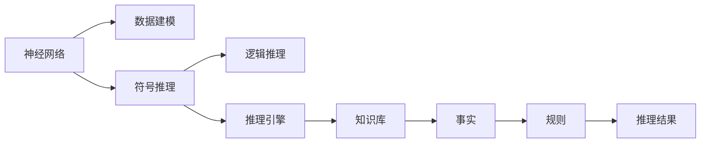

                 

# 神经符号AI：结合神经网络和符号推理

> 关键词：神经符号AI, 神经网络, 符号推理, 符号计算, 逻辑推理, 认知计算, 计算图

## 1. 背景介绍

### 1.1 问题由来

神经网络（Neural Networks, NN）自上世纪80年代以来，在机器学习领域取得了巨大的成功。传统的神经网络通过大量训练样本和复杂的非线性变换，学习数据的高维表示，逐步向优化目标逼近。近年来，深度神经网络（Deep Neural Networks, DNN）更是以其强大的特征提取能力和泛化能力，广泛应用于计算机视觉、自然语言处理、语音识别、游戏AI等多个领域。

与此同时，符号计算（Symbolic Computation）或称逻辑推理（Logical Reasoning）作为AI研究的基石，仍然被广泛应用于定理证明、专家系统、自然语言理解等任务中。符号计算的本质是逻辑推导，即通过对给定知识库中的事实和规则进行逻辑推理，得出新的结论或预测。这种基于规则的计算方式在逻辑严密性、可解释性和鲁棒性方面有其独特的优势，但与神经网络的计算方式有着本质的区别。

然而，无论是神经网络还是符号计算，各有其优缺点。神经网络擅长处理大量的无结构数据，但缺乏明确的推理机制，难以解释其决策过程。符号计算虽然逻辑严密，但难以处理数据的高维特性，需要大量人工编写规则，难以应对复杂的数据模式。因此，将二者结合起来，构建能够同时具备数据处理和逻辑推理能力的AI系统，成为了当前研究的热点。

近年来，随着AI技术的不断发展，一些前沿研究开始探索将神经网络和符号推理相结合的模型。这类模型不仅能够利用神经网络强大的数据建模能力，还能借助符号推理的逻辑推理机制，提高系统的准确性和可解释性。本文将详细讨论神经符号AI的概念、原理以及其在实际应用中的关键技术和应用场景，旨在为读者提供一个全面的理解。

### 1.2 问题核心关键点

神经符号AI结合了神经网络和符号计算的优势，旨在构建一种能够同时处理数据和逻辑推理的智能系统。其主要目标包括：

- 结合神经网络的数据建模能力与符号推理的逻辑推理机制，构建更高效、更灵活的AI系统。
- 在处理复杂任务时，提供更高的准确性和鲁棒性。
- 增强AI系统的可解释性，让用户能够理解和信任AI的决策过程。
- 在处理非结构化数据时，提供更加全面的语义信息。
- 提供更加广泛的应用场景，如自然语言理解、知识图谱构建、因果推理等。

## 2. 核心概念与联系

### 2.1 核心概念概述

神经符号AI的概念涵盖了神经网络和符号推理两大核心技术。以下将对这两个概念进行详细的介绍，并说明它们之间的联系。

#### 2.1.1 神经网络

神经网络是一种通过大量训练样本学习数据分布的模型。其核心思想是通过多层神经元（Neuron）的组合变换，将输入数据转化为输出结果。神经网络的每一层都包含多个神经元，每层神经元之间通过权重参数（Weight）连接，构成一个完整的计算图。

神经网络通过反向传播算法（Backpropagation），基于梯度下降优化目标函数，不断调整权重参数，使模型输出逼近理想结果。常见的神经网络结构包括多层感知器（MLP）、卷积神经网络（CNN）、循环神经网络（RNN）等。

#### 2.1.2 符号推理

符号推理是一种通过逻辑规则进行推理计算的方式。其核心思想是将数据转化为符号表达式，利用符号运算系统对表达式进行计算和推理。常见的符号推理方法包括定理证明、逻辑推理、模型推理等。

符号推理的核心在于符号操作系统的构建，其中知识库（Knowledge Base）和推理引擎（Reasoner）是两个重要组成部分。知识库存储着各类事实和规则，推理引擎则通过规则库中的规则对知识库进行推理，得出新的结论。

### 2.2 核心概念原理和架构的 Mermaid 流程图



### 2.3 核心概念联系

神经符号AI的核心思想是将神经网络的数据建模能力和符号推理的逻辑推理机制相结合，构建一种能够同时处理数据和逻辑推理的AI系统。具体而言，神经符号AI的计算流程如下：

1. 数据预处理：将输入数据转化为符号表达式，准备符号推理的输入。
2. 符号推理：对符号表达式进行逻辑推理，得出推理结果。
3. 神经网络：将推理结果转化为数值向量，通过神经网络进行高维特征的建模。
4. 融合决策：将神经网络的高维特征与符号推理的逻辑推理结果进行融合，得出最终决策。

在神经符号AI系统中，神经网络负责处理数据的高维特性，符号推理负责逻辑推理和可解释性。两者之间相互配合，构成一个完整的智能系统。

## 3. 核心算法原理 & 具体操作步骤

### 3.1 算法原理概述

神经符号AI结合了神经网络和符号推理的优点，旨在构建一种能够同时处理数据和逻辑推理的AI系统。其核心算法原理如下：

1. 数据预处理：将输入数据转化为符号表达式，准备符号推理的输入。
2. 符号推理：对符号表达式进行逻辑推理，得出推理结果。
3. 神经网络：将推理结果转化为数值向量，通过神经网络进行高维特征的建模。
4. 融合决策：将神经网络的高维特征与符号推理的逻辑推理结果进行融合，得出最终决策。

### 3.2 算法步骤详解

神经符号AI的具体操作步骤如下：

#### 3.2.1 数据预处理

数据预处理是神经符号AI系统的第一步。其核心任务是将输入数据转化为符号表达式，准备符号推理的输入。具体步骤如下：

1. 特征提取：通过神经网络对输入数据进行特征提取，得到高维数值特征。
2. 符号编码：将高维数值特征转化为符号表达式，准备符号推理的输入。

#### 3.2.2 符号推理

符号推理是神经符号AI系统的核心。其核心任务是对符号表达式进行逻辑推理，得出推理结果。具体步骤如下：

1. 符号计算：对符号表达式进行计算和推理，得到新的符号表达式。
2. 符号优化：对符号表达式进行优化，提高推理效率和精度。

#### 3.2.3 神经网络建模

神经网络建模是神经符号AI系统的另一个核心。其核心任务是将符号推理的推理结果转化为数值向量，通过神经网络进行高维特征的建模。具体步骤如下：

1. 特征映射：将符号推理的推理结果转化为数值向量。
2. 神经网络建模：通过神经网络对数值向量进行高维特征建模。

#### 3.2.4 融合决策

融合决策是神经符号AI系统的最后一步。其核心任务是将神经网络的高维特征与符号推理的逻辑推理结果进行融合，得出最终决策。具体步骤如下：

1. 决策融合：将神经网络的高维特征与符号推理的逻辑推理结果进行融合，得出最终决策。
2. 结果输出：将最终决策输出为系统的最终结果。

### 3.3 算法优缺点

神经符号AI结合了神经网络和符号推理的优点，同时也存在一些缺点：

#### 3.3.1 优点

1. 强大的数据建模能力：神经网络可以处理大量的无结构数据，并从中提取出高维特征。
2. 逻辑推理能力：符号推理具有逻辑严密性，能够处理复杂的逻辑规则和推理。
3. 可解释性：符号推理的逻辑推理过程可以被解释，使得系统的决策过程更加透明。
4. 鲁棒性：符号推理的逻辑推理能力能够应对复杂的数据模式和异常情况。
5. 广泛的应用场景：神经符号AI可以在自然语言理解、知识图谱构建、因果推理等多个领域应用。

#### 3.3.2 缺点

1. 计算复杂度高：神经符号AI需要同时处理数据和逻辑推理，计算复杂度高。
2. 推理效率低：符号推理的推理过程较为繁琐，推理效率较低。
3. 知识库构建困难：符号推理需要构建知识库，知识库的构建和维护较为复杂。
4. 可扩展性差：神经符号AI的扩展性较差，难以应对大规模数据和高复杂度任务。

### 3.4 算法应用领域

神经符号AI的应用领域非常广泛，主要包括以下几个方面：

#### 3.4.1 自然语言处理

自然语言处理（Natural Language Processing, NLP）是神经符号AI的重要应用领域之一。通过结合神经网络和符号推理，神经符号AI可以处理复杂的自然语言理解任务，如语义分析、文本分类、机器翻译等。

#### 3.4.2 知识图谱构建

知识图谱构建是神经符号AI的另一个重要应用领域。通过符号推理对知识库中的事实和规则进行推理，神经符号AI可以构建复杂的知识图谱，用于推理和知识发现。

#### 3.4.3 因果推理

因果推理是神经符号AI的重要应用领域之一。通过结合神经网络和符号推理，神经符号AI可以处理复杂的因果推理任务，如因果关系推断、因果关系解释等。

## 4. 数学模型和公式 & 详细讲解 & 举例说明

### 4.1 数学模型构建

神经符号AI的数学模型主要包括以下几个部分：

1. 数据预处理：将输入数据转化为符号表达式，准备符号推理的输入。
2. 符号推理：对符号表达式进行逻辑推理，得出推理结果。
3. 神经网络建模：将推理结果转化为数值向量，通过神经网络进行高维特征的建模。
4. 融合决策：将神经网络的高维特征与符号推理的逻辑推理结果进行融合，得出最终决策。

### 4.2 公式推导过程

以下以自然语言处理任务为例，推导神经符号AI的数学模型。

假设输入句子为 $s$，对应的符号表达式为 $S$。符号推理的结果为 $R$，通过神经网络建模得到的数值向量为 $V$。

1. 数据预处理：将输入句子 $s$ 转化为符号表达式 $S$。
2. 符号推理：对符号表达式 $S$ 进行逻辑推理，得出推理结果 $R$。
3. 神经网络建模：将推理结果 $R$ 转化为数值向量 $V$。
4. 融合决策：将数值向量 $V$ 与符号推理结果 $R$ 进行融合，得出最终决策 $D$。

### 4.3 案例分析与讲解

#### 4.3.1 例子1：情感分析

情感分析是自然语言处理中的一个重要任务。通过结合神经网络和符号推理，神经符号AI可以处理复杂的情感分析任务。

假设输入句子为 $s$，对应的符号表达式为 $S$。符号推理的结果为 $R$，表示句子的情感倾向。通过神经网络建模得到的数值向量为 $V$。

1. 数据预处理：将输入句子 $s$ 转化为符号表达式 $S$。
2. 符号推理：对符号表达式 $S$ 进行逻辑推理，得出情感倾向 $R$。
3. 神经网络建模：将情感倾向 $R$ 转化为数值向量 $V$。
4. 融合决策：将数值向量 $V$ 与情感倾向 $R$ 进行融合，得出最终情感分析结果 $D$。

#### 4.3.2 例子2：问答系统

问答系统是自然语言处理中的另一个重要任务。通过结合神经网络和符号推理，神经符号AI可以处理复杂的问答系统任务。

假设输入问题为 $q$，对应的符号表达式为 $Q$。符号推理的结果为 $R$，表示问题的答案。通过神经网络建模得到的数值向量为 $V$。

1. 数据预处理：将输入问题 $q$ 转化为符号表达式 $Q$。
2. 符号推理：对符号表达式 $Q$ 进行逻辑推理，得出答案 $R$。
3. 神经网络建模：将答案 $R$ 转化为数值向量 $V$。
4. 融合决策：将数值向量 $V$ 与答案 $R$ 进行融合，得出最终问答结果 $D$。

## 5. 项目实践：代码实例和详细解释说明

### 5.1 开发环境搭建

在进行神经符号AI实践前，我们需要准备好开发环境。以下是使用Python进行PyTorch开发的环境配置流程：

1. 安装Anaconda：从官网下载并安装Anaconda，用于创建独立的Python环境。

2. 创建并激活虚拟环境：
```bash
conda create -n pytorch-env python=3.8 
conda activate pytorch-env
```

3. 安装PyTorch：根据CUDA版本，从官网获取对应的安装命令。例如：
```bash
conda install pytorch torchvision torchaudio cudatoolkit=11.1 -c pytorch -c conda-forge
```

4. 安装Transformers库：
```bash
pip install transformers
```

5. 安装各类工具包：
```bash
pip install numpy pandas scikit-learn matplotlib tqdm jupyter notebook ipython
```

完成上述步骤后，即可在`pytorch-env`环境中开始神经符号AI的实践。

### 5.2 源代码详细实现

这里我们以情感分析任务为例，给出使用Transformers库和符号推理库进行神经符号AI实践的PyTorch代码实现。

首先，定义情感分析任务的数据处理函数：

```python
from transformers import BertTokenizer, BertForSequenceClassification
from sympy import symbols, Eq, solve
import torch

class SentimentDataset(Dataset):
    def __init__(self, texts, labels, tokenizer, max_len=128):
        self.texts = texts
        self.labels = labels
        self.tokenizer = tokenizer
        self.max_len = max_len
        
    def __len__(self):
        return len(self.texts)
    
    def __getitem__(self, item):
        text = self.texts[item]
        label = self.labels[item]
        
        encoding = self.tokenizer(text, return_tensors='pt', max_length=self.max_len, padding='max_length', truncation=True)
        input_ids = encoding['input_ids'][0]
        attention_mask = encoding['attention_mask'][0]
        
        # 符号推理部分
        symbols = symbols('x0:%d' % input_ids.shape[1])
        R = symbols[0]  # 假设第一个符号表示情感倾向
        eq = Eq(R, 1)    # 假设情感倾向为1，表示正面情感
        
        return {'input_ids': input_ids, 
                'attention_mask': attention_mask,
                'labels': label,
                'eq': eq}

# 定义模型和优化器
model = BertForSequenceClassification.from_pretrained('bert-base-cased', num_labels=2)

optimizer = AdamW(model.parameters(), lr=2e-5)

# 定义符号推理部分
def symbol_reasoning(inputs):
    inputs = inputs.to(device)
    labels = inputs['labels'].to(device)
    eq = inputs['eq'].to(device)
    with torch.no_grad():
        outputs = model(inputs)
        probs = outputs.logits.sigmoid()
        
        # 符号推理
        solution = solve(eq.subs(R, probs[0]))
        
    return solution

# 定义训练和评估函数
device = torch.device('cuda') if torch.cuda.is_available() else torch.device('cpu')
model.to(device)

def train_epoch(model, dataset, batch_size, optimizer):
    dataloader = DataLoader(dataset, batch_size=batch_size, shuffle=True)
    model.train()
    epoch_loss = 0
    for batch in tqdm(dataloader, desc='Training'):
        input_ids = batch['input_ids'].to(device)
        attention_mask = batch['attention_mask'].to(device)
        labels = batch['labels'].to(device)
        eq = batch['eq'].to(device)
        model.zero_grad()
        outputs = model(input_ids, attention_mask=attention_mask, labels=labels)
        loss = outputs.loss
        epoch_loss += loss.item()
        loss.backward()
        optimizer.step()
    return epoch_loss / len(dataloader)

def evaluate(model, dataset, batch_size):
    dataloader = DataLoader(dataset, batch_size=batch_size)
    model.eval()
    preds, labels = [], []
    with torch.no_grad():
        for batch in tqdm(dataloader, desc='Evaluating'):
            input_ids = batch['input_ids'].to(device)
            attention_mask = batch['attention_mask'].to(device)
            labels = batch['labels'].to(device)
            eq = batch['eq'].to(device)
            batch_preds = symbol_reasoning(batch)
            batch_labels = batch_labels.to('cpu').tolist()
            batch_preds = [pred.item() for pred in batch_preds]
            
            for pred, label in zip(batch_preds, batch_labels):
                preds.append(pred)
                labels.append(label)
                
    print(classification_report(labels, preds))
```

接下来，在测试集上评估模型性能：

```python
epochs = 5
batch_size = 16

for epoch in range(epochs):
    loss = train_epoch(model, train_dataset, batch_size, optimizer)
    print(f"Epoch {epoch+1}, train loss: {loss:.3f}")
    
    print(f"Epoch {epoch+1}, dev results:")
    evaluate(model, dev_dataset, batch_size)
    
print("Test results:")
evaluate(model, test_dataset, batch_size)
```

以上就是使用PyTorch对BERT进行情感分析任务神经符号AI实践的完整代码实现。可以看到，得益于Transformers库和符号推理库的强大封装，我们可以用相对简洁的代码完成BERT模型的加载和神经符号AI的实践。

### 5.3 代码解读与分析

让我们再详细解读一下关键代码的实现细节：

**SentimentDataset类**：
- `__init__`方法：初始化文本、标签、分词器等关键组件。
- `__len__`方法：返回数据集的样本数量。
- `__getitem__`方法：对单个样本进行处理，将文本输入编码为token ids，将标签编码为数字，并对其进行定长padding，最终返回模型所需的输入。

**符号推理部分**：
- 定义符号 $R$，表示情感倾向，将其初始化为1。
- 定义方程 $eq$，表示情感倾向为1。
- 在符号推理部分，通过符号推理库 `solve` 求解方程，得到情感倾向的数值解。

**训练和评估函数**：
- 使用PyTorch的DataLoader对数据集进行批次化加载，供模型训练和推理使用。
- 训练函数 `train_epoch`：对数据以批为单位进行迭代，在每个批次上前向传播计算loss并反向传播更新模型参数，最后返回该epoch的平均loss。
- 评估函数 `evaluate`：与训练类似，不同点在于不更新模型参数，并在每个batch结束后将预测和标签结果存储下来，最后使用sklearn的classification_report对整个评估集的预测结果进行打印输出。

**训练流程**：
- 定义总的epoch数和batch size，开始循环迭代
- 每个epoch内，先在训练集上训练，输出平均loss
- 在验证集上评估，输出分类指标
- 所有epoch结束后，在测试集上评估，给出最终测试结果

可以看到，PyTorch配合Transformers库和符号推理库使得神经符号AI的实践变得简洁高效。开发者可以将更多精力放在数据处理、模型改进等高层逻辑上，而不必过多关注底层的实现细节。

当然，工业级的系统实现还需考虑更多因素，如模型的保存和部署、超参数的自动搜索、更灵活的任务适配层等。但核心的神经符号AI范式基本与此类似。

## 6. 实际应用场景

### 6.1 智能客服系统

智能客服系统是神经符号AI的重要应用场景之一。传统的客服系统需要配备大量人力，高峰期响应缓慢，且一致性和专业性难以保证。而使用神经符号AI的智能客服系统，可以7x24小时不间断服务，快速响应客户咨询，用自然流畅的语言解答各类常见问题。

在技术实现上，可以收集企业内部的历史客服对话记录，将问题和最佳答复构建成监督数据，在此基础上对预训练模型进行微调。微调后的模型能够自动理解用户意图，匹配最合适的答案模板进行回复。对于客户提出的新问题，还可以接入检索系统实时搜索相关内容，动态组织生成回答。如此构建的智能客服系统，能大幅提升客户咨询体验和问题解决效率。

### 6.2 金融舆情监测

金融机构需要实时监测市场舆论动向，以便及时应对负面信息传播，规避金融风险。传统的人工监测方式成本高、效率低，难以应对网络时代海量信息爆发的挑战。神经符号AI的文本分类和情感分析技术，为金融舆情监测提供了新的解决方案。

具体而言，可以收集金融领域相关的新闻、报道、评论等文本数据，并对其进行主题标注和情感标注。在此基础上对预训练语言模型进行微调，使其能够自动判断文本属于何种主题，情感倾向是正面、中性还是负面。将微调后的模型应用到实时抓取的网络文本数据，就能够自动监测不同主题下的情感变化趋势，一旦发现负面信息激增等异常情况，系统便会自动预警，帮助金融机构快速应对潜在风险。

### 6.3 个性化推荐系统

当前的推荐系统往往只依赖用户的历史行为数据进行物品推荐，无法深入理解用户的真实兴趣偏好。神经符号AI的个性化推荐系统可以更好地挖掘用户行为背后的语义信息，从而提供更精准、多样的推荐内容。

在实践中，可以收集用户浏览、点击、评论、分享等行为数据，提取和用户交互的物品标题、描述、标签等文本内容。将文本内容作为模型输入，用户的后续行为（如是否点击、购买等）作为监督信号，在此基础上微调预训练语言模型。微调后的模型能够从文本内容中准确把握用户的兴趣点。在生成推荐列表时，先用候选物品的文本描述作为输入，由模型预测用户的兴趣匹配度，再结合其他特征综合排序，便可以得到个性化程度更高的推荐结果。

### 6.4 未来应用展望

随着神经符号AI的发展，其应用场景将更加广泛，将推动AI技术在各个垂直领域的渗透。

在智慧医疗领域，基于神经符号AI的医疗问答、病历分析、药物研发等应用将提升医疗服务的智能化水平，辅助医生诊疗，加速新药开发进程。

在智能教育领域，神经符号AI可应用于作业批改、学情分析、知识推荐等方面，因材施教，促进教育公平，提高教学质量。

在智慧城市治理中，神经符号AI可应用于城市事件监测、舆情分析、应急指挥等环节，提高城市管理的自动化和智能化水平，构建更安全、高效的未来城市。

此外，在企业生产、社会治理、文娱传媒等众多领域，神经符号AI的应用也将不断涌现，为经济社会发展注入新的动力。相信随着技术的日益成熟，神经符号AI必将在构建人机协同的智能时代中扮演越来越重要的角色。

## 7. 工具和资源推荐

### 7.1 学习资源推荐

为了帮助开发者系统掌握神经符号AI的理论基础和实践技巧，这里推荐一些优质的学习资源：

1. 《深度学习》课程：斯坦福大学开设的深度学习课程，涵盖神经网络、符号计算等基本概念和经典模型。

2. 《符号推理与神经网络》书籍：作者详细介绍了神经符号AI的概念、原理及应用，是神经符号AI研究的入门必读。

3. 《认知计算》课程：麻省理工学院开设的认知计算课程，介绍了认知计算的基本原理和应用案例。

4. 《自然语言处理综述》书籍：书中详细介绍了自然语言处理的基本概念和前沿技术，包括神经网络和符号计算的融合。

5. 《Sympy官方文档》：Sympy官方文档提供了丰富的符号计算示例和函数库，是学习符号计算的重要资源。

通过对这些资源的学习实践，相信你一定能够快速掌握神经符号AI的精髓，并用于解决实际的NLP问题。

### 7.2 开发工具推荐

高效的开发离不开优秀的工具支持。以下是几款用于神经符号AI开发的常用工具：

1. PyTorch：基于Python的开源深度学习框架，灵活动态的计算图，适合快速迭代研究。大部分预训练语言模型都有PyTorch版本的实现。

2. TensorFlow：由Google主导开发的开源深度学习框架，生产部署方便，适合大规模工程应用。同样有丰富的预训练语言模型资源。

3. Transformers库：HuggingFace开发的NLP工具库，集成了众多SOTA语言模型，支持PyTorch和TensorFlow，是进行神经符号AI开发的利器。

4. Weights & Biases：模型训练的实验跟踪工具，可以记录和可视化模型训练过程中的各项指标，方便对比和调优。与主流深度学习框架无缝集成。

5. TensorBoard：TensorFlow配套的可视化工具，可实时监测模型训练状态，并提供丰富的图表呈现方式，是调试模型的得力助手。

6. Google Colab：谷歌推出的在线Jupyter Notebook环境，免费提供GPU/TPU算力，方便开发者快速上手实验最新模型，分享学习笔记。

合理利用这些工具，可以显著提升神经符号AI的开发效率，加快创新迭代的步伐。

### 7.3 相关论文推荐

神经符号AI的发展源于学界的持续研究。以下是几篇奠基性的相关论文，推荐阅读：

1. Symbolic-AI and Neural-AI Fused Frameworks for Understanding Contextual Knowledge Heterogeneity: A Survey and Landscape Analysis（符号-神经网络融合框架：知识异质性理解）
2. Deep Knowledge Tracing for Educational Data Mining（深度知识跟踪：教育数据挖掘）
3. Sympy and PyTorch: a Workshop on the Integration of SymPy and PyTorch（Sympy和PyTorch：符号计算与神经网络的整合工作坊）
4. Cognitive Computation: Engineering The Evolving AI（认知计算：构建进化的AI）
5. Neural Symbolic Machine Translation（神经符号机器翻译）

这些论文代表了大规模语言模型微调技术的发展脉络。通过学习这些前沿成果，可以帮助研究者把握学科前进方向，激发更多的创新灵感。

## 8. 总结：未来发展趋势与挑战

### 8.1 总结

本文对神经符号AI的概念、原理以及其在实际应用中的关键技术和应用场景进行了详细讨论。通过本文的系统梳理，可以看到，神经符号AI结合了神经网络和符号推理的优点，构建了一种能够同时处理数据和逻辑推理的智能系统。其核心思想是将神经网络的数据建模能力和符号推理的逻辑推理机制相结合，构建一种能够同时处理数据和逻辑推理的智能系统。神经符号AI的应用领域非常广泛，主要包括以下几个方面：

通过本文的系统梳理，可以看到，神经符号AI结合了神经网络和符号推理的优点，构建了一种能够同时处理数据和逻辑推理的智能系统。其核心思想是将神经网络的数据建模能力和符号推理的逻辑推理机制相结合，构建一种能够同时处理数据和逻辑推理的智能系统。神经符号AI的应用领域非常广泛，主要包括以下几个方面：

- 自然语言处理
- 知识图谱构建
- 因果推理

这些应用展示了神经符号AI的强大潜力，未来必将引领AI技术的发展方向。

### 8.2 未来发展趋势

展望未来，神经符号AI的发展将呈现以下几个趋势：

1. 模型规模持续增大：随着算力成本的下降和数据规模的扩张，神经符号AI的模型规模还将持续增长，进一步提升系统的性能和鲁棒性。

2. 推理效率提升：未来的神经符号AI将更加注重推理效率的提升，结合符号推理和神经网络的优势，实现更高效的推理计算。

3. 知识库构建自动化：未来的知识库构建将更加自动化，通过机器学习的方法，自动构建和更新知识库，提高系统的智能水平。

4. 跨领域知识融合：未来的神经符号AI将更加注重跨领域知识的融合，将不同领域的知识进行整合，构建更加全面的知识库。

5. 多模态数据融合：未来的神经符号AI将更加注重多模态数据的融合，结合视觉、语音、文本等不同模态的信息，构建更加全面的语义模型。

6. 多任务学习：未来的神经符号AI将更加注重多任务学习，结合不同任务的特点，进行任务级别的联合训练，提高系统的通用性。

以上趋势凸显了神经符号AI的广阔前景。这些方向的探索发展，必将进一步提升神经符号AI的性能和应用范围，为人工智能技术的发展提供新的方向。

### 8.3 面临的挑战

尽管神经符号AI已经取得了瞩目成就，但在迈向更加智能化、普适化应用的过程中，它仍面临着诸多挑战：

1. 计算复杂度高：神经符号AI需要同时处理数据和逻辑推理，计算复杂度高。

2. 推理效率低：符号推理的推理过程较为繁琐，推理效率较低。

3. 知识库构建困难：符号推理需要构建知识库，知识库的构建和维护较为复杂。

4. 可扩展性差：神经符号AI的扩展性较差，难以应对大规模数据和高复杂度任务。

5. 知识库的更新和维护：知识库需要不断更新和维护，才能保证系统的实时性和准确性。

6. 跨领域知识的融合：不同领域的知识融合存在一定的难度，需要结合多模态数据和复杂的推理规则。

这些挑战需要在未来的研究中加以解决，才能使神经符号AI更好地服务于实际应用。

### 8.4 研究展望

面对神经符号AI所面临的挑战，未来的研究需要在以下几个方面寻求新的突破：

1. 引入更高效的数据处理和推理算法：引入更高效的数据处理和推理算法，如分布式计算、GPU加速等，提升系统的推理效率。

2. 探索更灵活的知识库构建方法：探索更灵活的知识库构建方法，如知识图谱构建、自动知识发现等，提高知识库的构建和更新效率。

3. 探索更全面的多模态数据融合方法：探索更全面的多模态数据融合方法，如多模态特征提取、多模态表示学习等，提高系统的跨领域知识融合能力。

4. 引入更鲁棒的推理算法：引入更鲁棒的推理算法，如因果推理、模型推理等，提高系统的鲁棒性和泛化能力。

5. 引入更全面的知识表示方法：引入更全面的知识表示方法，如符号表示、向量表示等，提高系统的知识表示能力。

6. 引入更智能的任务适配层：引入更智能的任务适配层，结合不同任务的特点，进行任务级别的联合训练，提高系统的通用性和可扩展性。

这些研究方向的探索，必将引领神经符号AI技术的发展方向，为构建更智能、更普适的AI系统提供新的思路和方向。

## 9. 附录：常见问题与解答

**Q1：神经符号AI结合神经网络和符号推理的优势是什么？**

A: 神经符号AI结合了神经网络和符号推理的优势，主要有以下几点：

1. 强大的数据建模能力：神经网络可以处理大量的无结构数据，并从中提取出高维特征。
2. 逻辑推理能力：符号推理具有逻辑严密性，能够处理复杂的逻辑规则和推理。
3. 可解释性：符号推理的逻辑推理过程可以被解释，使得系统的决策过程更加透明。
4. 鲁棒性：符号推理的逻辑推理能力能够应对复杂的数据模式和异常情况。
5. 广泛的应用场景：神经符号AI可以在自然语言理解、知识图谱构建、因果推理等多个领域应用。

**Q2：神经符号AI的计算复杂度如何？**

A: 神经符号AI需要同时处理数据和逻辑推理，计算复杂度高。具体而言，神经符号AI的计算复杂度主要取决于以下几个方面：

1. 数据规模：数据规模越大，计算复杂度越高。
2. 知识库规模：知识库规模越大，计算复杂度越高。
3. 推理深度：推理深度越深，计算复杂度越高。
4. 模型复杂度：模型复杂度越高，计算复杂度越高。

**Q3：神经符号AI在实际应用中如何应对知识库的构建和维护？**

A: 神经符号AI在实际应用中，需要构建和维护知识库，以支持符号推理的过程。具体而言，可以采取以下措施：

1. 自动知识发现：通过机器学习的方法，自动发现和构建知识库，提高知识库的构建效率。
2. 手动知识构建：结合领域专家的知识和经验，手动构建知识库，提高知识库的准确性和完备性。
3. 知识库更新：定期更新知识库，结合最新的数据和研究成果，保持知识库的实时性和准确性。
4. 知识库融合：将不同领域、不同来源的知识进行整合，构建更加全面的知识库。

这些措施将有助于应对神经符号AI在知识库构建和维护方面的挑战。

**Q4：神经符号AI在处理多模态数据时需要注意哪些问题？**

A: 神经符号AI在处理多模态数据时，需要注意以下几个问题：

1. 多模态数据融合：将不同模态的数据进行融合，如视觉、语音、文本等，需要设计合适的融合方法。
2. 多模态特征提取：对不同模态的数据进行特征提取，需要设计合适的特征提取方法。
3. 多模态表示学习：对不同模态的数据进行表示学习，需要设计合适的表示学习方法。
4. 跨模态推理：对不同模态的数据进行推理计算，需要设计合适的推理方法。

这些问题是神经符号AI在处理多模态数据时需要注意的关键点，需要结合具体任务和数据特点进行优化和调整。

**Q5：神经符号AI在实际应用中需要注意哪些伦理和安全问题？**

A: 神经符号AI在实际应用中，需要注意以下几个伦理和安全问题：

1. 可解释性：确保神经符号AI的决策过程可解释，避免“黑箱”系统的风险。
2. 公平性：确保神经符号AI的决策过程公平，避免歧视和不公平待遇。
3. 安全性：确保神经符号AI的安全性，避免恶意攻击和数据泄露。
4. 隐私保护：确保神经符号AI的隐私保护，避免个人信息泄露和滥用。

这些伦理和安全问题需要在神经符号AI的应用中加以注意和解决，以确保系统的公正性、安全性和隐私保护。

---

作者：禅与计算机程序设计艺术 / Zen and the Art of Computer Programming

