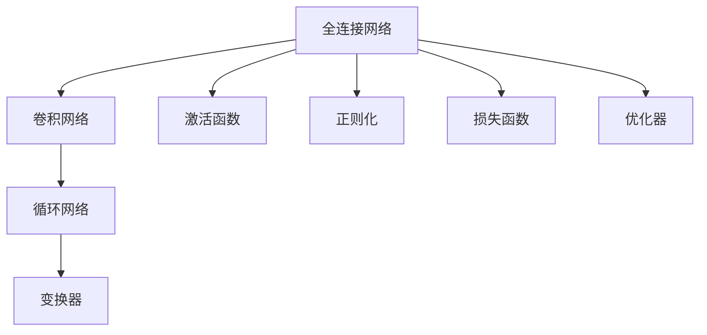
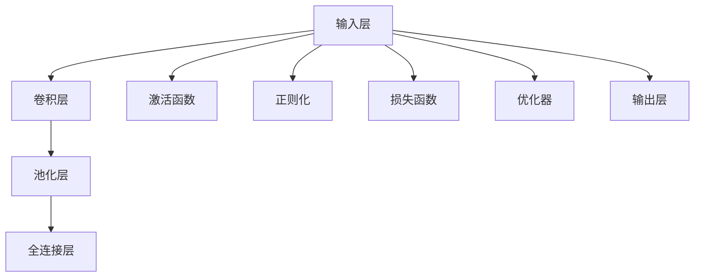

                 

## 1. 背景介绍

### 1.1 问题由来
神经网络架构设计是深度学习领域的核心问题之一，直接关系到模型的性能、效率、可解释性和应用范围。一个优秀的神经网络架构可以显著提升模型的效果，降低计算成本，增强模型的可解释性，拓展应用领域。在过去十年中，深度学习迅猛发展，各类架构层出不穷，但如何选择合适的架构，仍是一个复杂且关键的问题。

### 1.2 问题核心关键点
本节将阐述神经网络架构设计的关键点，并以此为切入点，引入后续章节的主要内容：

1. **简单到复杂**：从简单的全连接网络开始，逐步介绍卷积网络、循环网络和变换器等典型架构。
2. **组件组合**：详细讨论神经网络的各个组件（如层、激活函数、正则化等）及其组合方式。
3. **结构优化**：探讨如何通过网络结构优化提高模型的性能和泛化能力。
4. **应用实践**：分析神经网络架构在不同应用场景中的适用性和优化方法。
5. **未来趋势**：展望神经网络架构设计的未来发展方向。

通过本节的概述，将为读者提供一个清晰的架构设计思路，帮助其在后续内容中更好地理解和应用。

## 2. 核心概念与联系

### 2.1 核心概念概述

神经网络架构设计涉及到多个关键概念，包括但不限于：

- **全连接网络**：最基础的神经网络架构，包含多个全连接层。
- **卷积网络**：通过卷积层提取特征，常用于图像处理任务。
- **循环网络**：通过循环层处理序列数据，常用于自然语言处理和时序数据。
- **变换器**：通过多头自注意力机制，能够高效处理长序列数据。
- **层**：神经网络的基本组成部分，执行特定功能的子网络。
- **激活函数**：引入非线性映射，增加模型的表达能力。
- **正则化**：通过各种手段减少过拟合，提高模型泛化能力。
- **损失函数**：衡量模型预测输出与真实标签之间差异的函数。
- **优化器**：通过各种优化算法更新模型参数，最小化损失函数。

这些概念之间相互关联，共同构成了神经网络的基本框架和功能。为了更好地理解这些概念及其联系，本节将给出核心概念的Mermaid流程图，展示了神经网络的基本结构：



### 2.2 核心概念原理和架构的 Mermaid 流程图



## 3. 核心算法原理 & 具体操作步骤

### 3.1 算法原理概述

神经网络架构设计主要关注于如何构建高效、灵活、可解释的神经网络。通过选择合适的组件和设计合理的结构，可以使模型在特定任务上表现优异。

### 3.2 算法步骤详解

一个完整的神经网络架构设计过程通常包括以下几个步骤：

1. **数据准备**：收集和预处理数据集，确保数据质量和标注一致性。
2. **模型选择**：根据任务特点选择合适的模型架构，如全连接、卷积、循环或变换器网络。
3. **组件设计**：确定各层的激活函数、正则化方法、损失函数等组件。
4. **结构优化**：通过调整网络结构、参数初始化等手段优化模型性能。
5. **训练与验证**：使用训练集训练模型，并利用验证集评估模型性能，进行超参数调优。
6. **测试与部署**：在测试集上评估模型性能，并将模型部署到实际应用中。

### 3.3 算法优缺点

神经网络架构设计的优点在于其高度的灵活性和适应性。不同的任务和数据特点可以通过不同的架构设计得到最优解决方案，提升模型性能。然而，架构设计也存在一些缺点：

- **复杂度高**：神经网络架构设计需要深入理解模型组件及其组合方式，对初学者来说有一定难度。
- **超参数调优**：架构设计需要调整大量超参数，找到最优组合可能耗时较长。
- **资源需求高**：复杂模型往往需要更多的计算资源和存储空间。

### 3.4 算法应用领域

神经网络架构设计广泛应用于多个领域，包括但不限于：

- **计算机视觉**：用于图像分类、目标检测、图像分割等任务。
- **自然语言处理**：用于文本分类、情感分析、机器翻译等任务。
- **语音处理**：用于语音识别、语音合成等任务。
- **推荐系统**：用于用户行为预测、商品推荐等任务。
- **时间序列分析**：用于股票预测、天气预测等任务。

## 4. 数学模型和公式 & 详细讲解 & 举例说明

### 4.1 数学模型构建

神经网络的数学模型构建通常包括以下几个部分：

- **输入层**：接收输入数据，维度为 $d_0$。
- **隐藏层**：包含 $n$ 个神经元，维度为 $d_1$。
- **输出层**：输出模型的预测结果，维度为 $d_2$。

### 4.2 公式推导过程

以一个简单的全连接网络为例，其数学模型可以表示为：

$$
y = W_2 \sigma(W_1 x + b_1) + b_2
$$

其中，$x$ 为输入向量，$y$ 为输出向量，$W_1$ 和 $W_2$ 分别为隐藏层和输出层的权重矩阵，$b_1$ 和 $b_2$ 分别为偏置向量，$\sigma$ 为激活函数。

### 4.3 案例分析与讲解

以图像分类任务为例，使用卷积神经网络（CNN）进行架构设计：

1. **输入层**：输入图像 $x \in \mathbb{R}^{m \times n \times c}$，其中 $m$ 和 $n$ 分别为图像的高和宽，$c$ 为颜色通道数。
2. **卷积层**：使用多个卷积核提取图像特征，输出特征图 $h \in \mathbb{R}^{k \times k \times c'}$，其中 $k$ 为卷积核大小，$c'$ 为输出通道数。
3. **池化层**：对特征图进行下采样，减少计算量并保留重要信息，输出 $p \in \mathbb{R}^{k' \times k' \times c'}$。
4. **全连接层**：将特征图展开为一维向量，输入到全连接层进行分类，输出 $y \in \mathbb{R}^{c''}$，其中 $c''$ 为类别数。

## 5. 项目实践：代码实例和详细解释说明

### 5.1 开发环境搭建

在进行神经网络架构设计时，需要搭建一个Python开发环境，包括必要的库和工具。以下是在PyTorch框架下搭建开发环境的步骤：

1. 安装Anaconda：从官网下载并安装Anaconda，创建独立的Python环境。
2. 创建虚拟环境：
```bash
conda create -n torch-env python=3.8
conda activate torch-env
```
3. 安装PyTorch和其他库：
```bash
pip install torch torchvision torchaudio cudatoolkit=11.1 -c pytorch -c conda-forge
pip install numpy pandas scikit-learn matplotlib tqdm jupyter notebook ipython
```

### 5.2 源代码详细实现

以下是一个简单的全连接网络在PyTorch中的实现：

```python
import torch
import torch.nn as nn
import torch.optim as optim

# 定义网络结构
class Net(nn.Module):
    def __init__(self, input_dim, hidden_dim, output_dim):
        super(Net, self).__init__()
        self.fc1 = nn.Linear(input_dim, hidden_dim)
        self.fc2 = nn.Linear(hidden_dim, output_dim)
        self.relu = nn.ReLU()
        
    def forward(self, x):
        x = self.fc1(x)
        x = self.relu(x)
        x = self.fc2(x)
        return x

# 创建网络实例
net = Net(input_dim=784, hidden_dim=128, output_dim=10)

# 定义优化器和损失函数
optimizer = optim.SGD(net.parameters(), lr=0.01, momentum=0.9)
criterion = nn.CrossEntropyLoss()

# 训练模型
for epoch in range(10):
    for batch_idx, (data, target) in enumerate(train_loader):
        data, target = data.to(device), target.to(device)
        optimizer.zero_grad()
        output = net(data)
        loss = criterion(output, target)
        loss.backward()
        optimizer.step()
```

### 5.3 代码解读与分析

本节将详细解释上述代码的各个部分：

- **网络定义**：定义一个简单的全连接网络，包含两个线性层和一个ReLU激活函数。
- **网络实例化**：创建一个网络实例，并指定输入维度、隐藏层维度和输出维度。
- **优化器和损失函数**：定义优化器（Stochastic Gradient Descent）和损失函数（Cross Entropy Loss）。
- **训练过程**：通过训练集数据，对模型进行前向传播和反向传播，更新模型参数。

### 5.4 运行结果展示

运行上述代码，训练完成后，可以在测试集上评估模型的性能：

```python
# 评估模型性能
for batch_idx, (data, target) in enumerate(test_loader):
    data, target = data.to(device), target.to(device)
    output = net(data)
    _, predicted = torch.max(output.data, 1)
    accuracy = (predicted == target).sum().item() / len(predicted)
    print(f'Accuracy: {accuracy:.2f}')
```

## 6. 实际应用场景

### 6.1 计算机视觉

在计算机视觉领域，卷积神经网络（CNN）是主流架构，适用于图像分类、目标检测、图像分割等任务。以图像分类为例，CNN通过卷积层和池化层提取图像特征，全连接层进行分类预测。

### 6.2 自然语言处理

在自然语言处理领域，循环神经网络（RNN）和变换器（Transformer）是主要架构。RNN适用于序列数据处理，如文本分类、机器翻译等；Transformer则通过自注意力机制处理长序列数据，适用于语言模型、文本生成等任务。

### 6.3 语音处理

在语音处理领域，卷积神经网络和递归神经网络（RNN）是常用架构。CNN适用于语音识别任务，RNN适用于语音合成任务。

### 6.4 推荐系统

在推荐系统领域，深度神经网络是主要架构，用于用户行为预测和商品推荐。通过全连接层和卷积层提取用户和商品的特征，使用多层感知器（MLP）进行预测。

### 6.5 时间序列分析

在时间序列分析领域，循环神经网络（RNN）和长短时记忆网络（LSTM）是常用架构。RNN适用于简单的时间序列预测，LSTM适用于复杂的长期依赖关系处理。

## 7. 工具和资源推荐

### 7.1 学习资源推荐

- **Deep Learning Specialization by Andrew Ng**：斯坦福大学开设的深度学习系列课程，涵盖从基础到高级的深度学习知识。
- **PyTorch官方文档**：PyTorch的详细官方文档，提供丰富的教程和样例代码。
- **TensorFlow官方文档**：TensorFlow的详细官方文档，提供丰富的教程和样例代码。
- **Deep Learning with Python by François Chollet**：François Chollet的深度学习入门书籍，涵盖TensorFlow和Keras的使用。

### 7.2 开发工具推荐

- **PyTorch**：灵活的深度学习框架，支持动态计算图，易于调试和优化。
- **TensorFlow**：生产级别的深度学习框架，支持分布式训练和模型部署。
- **Keras**：高级神经网络API，易于使用，适合快速原型开发。
- **Jupyter Notebook**：强大的交互式编程环境，支持Python和其他语言的混合编程。

### 7.3 相关论文推荐

- **ImageNet Classification with Deep Convolutional Neural Networks**：AlexNet论文，介绍卷积神经网络在图像分类任务中的应用。
- **Playing Atari with Deep Reinforcement Learning**：DQN论文，介绍深度强化学习在视频游戏中的应用。
- **Attention is All You Need**：Transformer论文，介绍变换器在自然语言处理中的应用。

## 8. 总结：未来发展趋势与挑战

### 8.1 研究成果总结

神经网络架构设计在深度学习中具有重要地位，通过合理的架构设计，可以在不同的应用场景中取得优异的性能。全连接网络、卷积网络、循环网络和变换器是当前主流的神经网络架构，分别适用于图像处理、语音处理、序列数据处理和长序列处理任务。

### 8.2 未来发展趋势

未来神经网络架构设计将呈现以下几个发展趋势：

1. **多模态融合**：将视觉、听觉、文本等多种模态数据融合，提升模型的泛化能力和应用范围。
2. **自适应网络**：根据数据特点和任务需求，动态调整网络结构，提高模型的灵活性。
3. **无监督学习**：利用无监督学习技术，减少对标注数据的依赖，提高模型的自适应能力。
4. **可解释性增强**：通过模型解释技术和知识图谱，提升模型的可解释性和透明性。

### 8.3 面临的挑战

尽管神经网络架构设计在深度学习中取得了巨大成功，但仍然面临以下挑战：

1. **复杂度高**：神经网络架构设计需要深入理解模型组件及其组合方式，对初学者来说有一定难度。
2. **超参数调优**：架构设计需要调整大量超参数，找到最优组合可能耗时较长。
3. **资源需求高**：复杂模型往往需要更多的计算资源和存储空间。
4. **模型解释性不足**：神经网络模型通常是"黑盒"系统，难以解释其内部工作机制和决策逻辑。
5. **模型鲁棒性不足**：神经网络模型对输入数据的微小扰动往往十分敏感，鲁棒性有待提升。

### 8.4 研究展望

未来神经网络架构设计需要在以下几个方面进行深入研究：

1. **自适应架构设计**：研究如何根据数据和任务特点，自动调整网络结构和组件，提升模型的灵活性和鲁棒性。
2. **模型解释性**：研究如何增强模型的可解释性，提供模型决策的因果性和逻辑性，提升用户信任和模型应用的安全性。
3. **多模态融合**：研究如何将视觉、听觉、文本等多种模态数据融合，提升模型的泛化能力和应用范围。
4. **无监督学习**：研究如何利用无监督学习技术，减少对标注数据的依赖，提高模型的自适应能力。

## 9. 附录：常见问题与解答

### Q1: 如何选择神经网络架构？

A: 选择神经网络架构应考虑任务特点和数据类型。例如，图像处理任务适合使用卷积神经网络，自然语言处理任务适合使用循环神经网络或变换器。同时，需要根据数据量和计算资源，选择合适的网络规模和复杂度。

### Q2: 如何避免过拟合？

A: 避免过拟合的方法包括：数据增强、正则化、dropout、early stopping等。数据增强可以通过旋转、缩放等手段扩充训练集，正则化可以通过L1/L2正则化减少模型复杂度，dropout可以在训练过程中随机失活神经元，early stopping可以在验证集性能不再提升时停止训练。

### Q3: 如何选择激活函数？

A: 激活函数的选择应考虑网络的表达能力和计算效率。常用的激活函数包括ReLU、sigmoid、tanh等。ReLU在深度学习中表现优异，sigmoid和tanh适用于二分类任务，Leaky ReLU、ELU等变体也可以提升模型性能。

### Q4: 如何优化模型的计算效率？

A: 计算效率的优化可以通过以下方法实现：数据并行、模型并行、模型剪枝、量化等。数据并行可以在多个GPU或TPU上并行计算，模型并行可以将模型划分为多个部分在多个设备上并行计算，模型剪枝可以移除不必要的权重，量化可以将浮点数模型转换为定点模型。

### Q5: 如何选择优化器和超参数？

A: 优化器的选择应考虑网络的特点和数据分布。常用的优化器包括SGD、Adam、Adagrad等。超参数的选择应通过网格搜索、随机搜索等方法进行调优，也可以通过贝叶斯优化等高级方法提升效率。

---

作者：禅与计算机程序设计艺术 / Zen and the Art of Computer Programming

