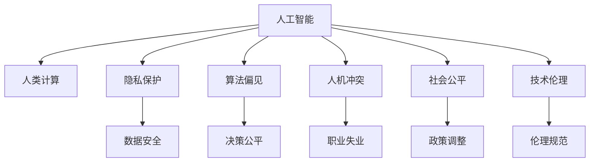

                 

## 1. 背景介绍

### 1.1 问题由来

21世纪以来，人工智能技术的迅猛发展，特别是深度学习、自然语言处理、计算机视觉等领域的突破，使得人类计算能力实现了前所未有的提升。在医疗、教育、金融、交通等多个行业，AI驱动的系统已经在逐渐取代传统方式，推动各行各业的数字化转型。

然而，科技的进步也引发了新的社会问题。从隐私泄露、算法偏见，到人机冲突、职业失业，这些问题不断引发公众的关注和讨论。人类计算的双重影响，在科技的推动和挑战下，正深刻地改变着社会的方方面面。

### 1.2 问题核心关键点

科技与社会的关系，是当今时代最重要的课题之一。科技的进步为人类带来了巨大的福祉，但同时也带来了新的挑战和风险。人类计算的双重影响，指的是科技在推动社会发展的同时，也伴随着潜在的负面效应。以下是其中几个核心问题：

1. **隐私保护与数据安全**：大规模数据收集和分析，极大地提升了AI系统的性能，但也带来了数据隐私和安全的隐患。如何平衡数据使用与隐私保护，是一个亟待解决的问题。
2. **算法偏见与公平性**：机器学习模型在训练过程中可能会学习到数据中的偏见，导致决策不公平。如何构建公平、透明的AI模型，是一个重要的研究课题。
3. **人机冲突与伦理问题**：自动化系统的广泛应用，带来了人机关系的变化，可能导致部分岗位的失业和人类价值的迷失。如何协调人机关系，推动社会公平和伦理进步，是一个复杂的社会问题。
4. **技术发展与教育**：科技的快速发展要求教育体系进行相应的变革，以培养适应未来社会的人才。如何在新技术背景下，实现教育创新和人才培养，是一个重要的教育问题。

这些问题构成了人类计算的双重影响的核心，需要从技术、社会、伦理等多个层面进行深入探讨和解决。

### 1.3 问题研究意义

研究人类计算的双重影响，对于理解科技对社会的影响，推动技术伦理和社会进步，具有重要的意义：

1. **推动科技向善**：在技术开发和应用中，注重社会责任，促进科技的正面作用，避免其负面影响。
2. **提升社会公平性**：通过技术手段，缩小社会不平等，提高社会公平性，让更多人受益于科技的进步。
3. **促进教育创新**：结合最新科技趋势，调整教育内容和方法，培养具备创新能力和批判性思维的人才。
4. **构建伦理框架**：在技术发展的同时，构建相应的伦理规范和监管机制，确保技术的应用符合人类价值观和社会道德。

本文将从技术原理和应用实践两方面，深入探讨人类计算的双重影响，并提出一些解决方案，以期对相关领域的深入研究和社会实践提供参考。

## 2. 核心概念与联系

### 2.1 核心概念概述

为更好地理解人类计算的双重影响，本节将介绍几个密切相关的核心概念：

- **人工智能**：通过机器学习、深度学习等技术，实现计算机系统具有类人的智能。
- **人类计算**：指利用计算机技术处理和分析人类活动数据，实现决策支持、自动化服务等。
- **隐私保护**：指在数据收集和处理过程中，保护用户个人信息和数据安全，防止隐私泄露。
- **算法偏见**：指在机器学习模型训练过程中，学习到数据中的偏见，导致决策不公平。
- **人机冲突**：指在自动化系统广泛应用下，人类与机器之间的角色冲突和关系变化。
- **社会公平**：指在技术应用中，确保不同社会群体获得平等的机会和待遇，避免技术加剧社会不平等。
- **技术伦理**：指在技术发展过程中，遵循的伦理规范和道德准则，确保技术的应用符合人类价值观。

这些核心概念之间的逻辑关系可以通过以下Mermaid流程图来展示：



这个流程图展示了一系列核心概念及其之间的关联：

1. 人工智能是基础技术，通过人类计算实现各种应用。
2. 在数据处理和模型训练过程中，涉及隐私保护和算法偏见问题。
3. 自动化系统可能导致人机冲突，引发职业失业等社会问题。
4. 社会公平和技术伦理是评价技术应用的重要指标。
5. 数据安全、决策公平、职业失业、政策调整和伦理规范是这些核心概念的具体体现。

## 3. 核心算法原理 & 具体操作步骤

### 3.1 算法原理概述

人类计算的双重影响，主要涉及以下几个方面的核心算法原理：

- **数据隐私保护算法**：包括差分隐私、联邦学习、匿名化等技术，用于保护用户隐私。
- **公平性算法**：如重新加权、公平性约束、对抗训练等，用于减少算法偏见，提高决策公平性。
- **人机交互算法**：如自然语言处理、智能推荐系统等，用于优化人机交互体验，减少人机冲突。
- **伦理计算算法**：如隐私计算、透明算法等，用于确保技术应用符合伦理规范。

这些算法原理构成了人类计算双重影响的技术基础，通过合理应用这些技术，可以有效地平衡技术进步与社会福祉。

### 3.2 算法步骤详解

下面以隐私保护算法为例，详细讲解其具体操作步骤：

1. **差分隐私**：在数据收集和处理过程中，通过添加噪声或限制数据披露范围，使得任何单个数据点的披露，对总体数据分布的影响极小，从而保护用户隐私。
2. **联邦学习**：在多个数据源上分布式训练模型，模型参数在本地更新后发送到中心服务器，中心服务器将参数更新分发到各个节点，从而保护数据隐私。
3. **匿名化**：对数据进行预处理，如去标识化、数据扰动等，使得数据无法直接追溯到个人，从而保护用户隐私。

以差分隐私为例，其具体操作步骤如下：

- **噪声添加**：对数据集中的每个属性值添加噪声，使得任何单个数据点的披露，对总体数据分布的影响极小。
- **参数更新**：通过差分隐私算法，计算新的参数值。
- **模型训练**：使用更新后的参数，进行模型训练。

### 3.3 算法优缺点

差分隐私算法具有以下优点：

- 可有效地保护用户隐私。
- 能够适应多种数据分布和统计任务。

但同时也存在一些缺点：

- 需要添加噪声，可能影响数据精度。
- 噪声添加过程复杂，实施难度较大。

公平性算法的优点包括：

- 减少算法偏见，提高决策公平性。
- 能够适应多种数据分布和模型结构。

其缺点包括：

- 实施难度较大，需要较多的计算资源。
- 难以完全消除偏见，可能仍存在细微的偏差。

人机交互算法的优点包括：

- 提升用户体验，减少人机冲突。
- 能够自适应用户需求，提高系统智能化水平。

其缺点包括：

- 算法复杂度高，实现难度较大。
- 需要大量用户数据，可能存在隐私泄露风险。

伦理计算算法的优点包括：

- 确保技术应用符合伦理规范。
- 能够提升技术透明度，增强用户信任。

其缺点包括：

- 算法复杂度高，实施难度较大。
- 需要与法规政策相结合，可能存在法律风险。

### 3.4 算法应用领域

隐私保护算法主要应用于金融、医疗、政府等领域，涉及敏感数据的保护和隐私保护。

公平性算法主要应用于招聘、信用评分、医疗等领域，用于减少算法偏见，提升决策公平性。

人机交互算法主要应用于智能推荐系统、客服机器人、智能家居等领域，提升用户体验和智能化水平。

伦理计算算法主要应用于金融、医疗、政府等领域，用于确保技术应用符合伦理规范。

## 4. 数学模型和公式 & 详细讲解 & 举例说明

### 4.1 数学模型构建

本节将使用数学语言对隐私保护、公平性、人机交互和伦理计算的算法进行更加严格的刻画。

#### 4.1.1 差分隐私

差分隐私的核心思想是在数据披露时，添加噪声使得任何单个数据点的披露，对总体数据分布的影响极小。其数学模型可以表示为：

$$
\Pr[M_{\epsilon}(X_i) \in S] \leq e^{-\epsilon} + \frac{|S|}{2\epsilon}
$$

其中 $M_{\epsilon}(X_i)$ 表示在添加噪声后的数据披露结果，$X_i$ 表示原始数据，$\epsilon$ 表示隐私保护参数，$S$ 表示披露结果集合。

差分隐私的具体实现过程包括以下步骤：

1. **噪声生成**：对每个属性值添加噪声，使得任何单个数据点的披露，对总体数据分布的影响极小。
2. **参数更新**：计算新的参数值，确保披露结果符合差分隐私的要求。
3. **模型训练**：使用更新后的参数，进行模型训练。

#### 4.1.2 公平性约束

公平性约束的核心思想是在模型训练过程中，加入公平性约束条件，确保不同群体获得相同的机会和待遇。其数学模型可以表示为：

$$
\mathcal{L}(\theta) = \sum_{i=1}^{n} w_i \ell_i(\theta)
$$

其中 $\theta$ 表示模型参数，$\ell_i(\theta)$ 表示第 $i$ 个群体的损失函数，$w_i$ 表示第 $i$ 个群体的权重。

公平性约束的具体实现过程包括以下步骤：

1. **重新加权**：对不同群体进行重新加权，使得每个群体的样本权重相等。
2. **公平性约束**：在模型训练过程中，加入公平性约束条件，确保不同群体的损失函数相等。
3. **模型训练**：使用更新后的参数，进行模型训练。

#### 4.1.3 对抗训练

对抗训练的核心思想是在模型训练过程中，引入对抗样本，提高模型鲁棒性。其数学模型可以表示为：

$$
\min_{\theta} \mathcal{L}(\theta) = \mathbb{E}_{x, \delta} [\mathcal{L}(\theta, x + \delta)]
$$

其中 $\theta$ 表示模型参数，$x$ 表示输入数据，$\delta$ 表示对抗样本。

对抗训练的具体实现过程包括以下步骤：

1. **生成对抗样本**：使用对抗生成网络，生成对抗样本。
2. **模型训练**：在原始数据和对抗样本上，进行模型训练。
3. **鲁棒性测试**：测试模型的鲁棒性，确保其能够抵抗对抗样本攻击。

#### 4.1.4 隐私计算

隐私计算的核心思想是在不泄露原始数据的情况下，进行数据计算和分析。其数学模型可以表示为：

$$
\min_{z} \mathcal{L}(z) = \sum_{i=1}^{n} w_i \ell_i(z)
$$

其中 $z$ 表示计算结果，$\ell_i(z)$ 表示第 $i$ 个群体的损失函数，$w_i$ 表示第 $i$ 个群体的权重。

隐私计算的具体实现过程包括以下步骤：

1. **数据拆分**：将数据拆分为多个子集，每个子集分别计算。
2. **聚合结果**：在所有子集上，进行结果聚合。
3. **保护隐私**：使用差分隐私等技术，保护计算结果的隐私。

## 5. 项目实践：代码实例和详细解释说明

### 5.1 开发环境搭建

在进行隐私保护算法实践前，我们需要准备好开发环境。以下是使用Python进行差分隐私实践的环境配置流程：

1. 安装Anaconda：从官网下载并安装Anaconda，用于创建独立的Python环境。

2. 创建并激活虚拟环境：
```bash
conda create -n privacy-env python=3.8 
conda activate privacy-env
```

3. 安装必要的库：
```bash
pip install numpy pandas scikit-learn differential-privacy cryptography
```

完成上述步骤后，即可在`privacy-env`环境中开始差分隐私实践。

### 5.2 源代码详细实现

下面以差分隐私算法为例，给出使用Scikit-learn库实现差分隐私的Python代码实现。

```python
import numpy as np
from sklearn.datasets import make_classification
from differential_privacy import DifferentialPrivacy
from differential_privacy.boundaries import BasicLaplaceNoise
from differential_privacy.analytical import PrivacyBudget

# 生成数据集
n = 1000
X, y = make_classification(n_samples=n, n_features=10, random_state=0)

# 构建差分隐私对象
privacy_budget = PrivacyBudget(epsilon=0.1, delta=0.01)
privacy = DifferentialPrivacy(boundaries=BasicLaplaceNoise, epsilon=privacy_budget.epsilon, delta=privacy_budget.delta)

# 对数据集进行差分隐私处理
X_privacy = privacy.fit_transform(X)

# 输出隐私预算
print(f"Epsilon: {privacy_budget.epsilon}, Delta: {privacy_budget.delta}")
```

### 5.3 代码解读与分析

让我们再详细解读一下关键代码的实现细节：

**隐私预算对象创建**：

- 创建隐私预算对象，设置隐私保护参数 $\epsilon$ 和 $\delta$。

**差分隐私对象创建**：

- 创建差分隐私对象，指定边界噪声函数，设置隐私保护参数 $\epsilon$ 和 $\delta$。

**数据差分隐私处理**：

- 使用差分隐私对象，对数据集进行隐私处理，返回隐私保护后的数据集。

**隐私预算输出**：

- 输出隐私预算对象，展示隐私保护参数 $\epsilon$ 和 $\delta$。

## 6. 实际应用场景

### 6.1 金融行业

金融行业涉及大量敏感数据，如客户交易记录、信用评分等。差分隐私算法可以在保护客户隐私的前提下，进行数据分析和风险评估。

具体而言，金融机构可以收集客户的交易数据，进行隐私处理后，进行风险评估和信用评分。差分隐私算法可以确保每个客户的隐私数据不会被单独披露，同时对总体数据分析结果的影响很小。

### 6.2 医疗行业

医疗行业涉及大量敏感数据，如患者病历、基因数据等。差分隐私算法可以在保护患者隐私的前提下，进行数据分析和疾病预测。

具体而言，医疗机构可以收集患者的病历数据，进行隐私处理后，进行疾病预测和个性化治疗。差分隐私算法可以确保每个患者的隐私数据不会被单独披露，同时对总体数据分析结果的影响很小。

### 6.3 政府机构

政府机构涉及大量敏感数据，如人口普查数据、人口普查数据等。差分隐私算法可以在保护公民隐私的前提下，进行数据分析和政策制定。

具体而言，政府机构可以收集人口普查数据，进行隐私处理后，进行数据分析和政策制定。差分隐私算法可以确保每个公民的隐私数据不会被单独披露，同时对总体数据分析结果的影响很小。

## 7. 工具和资源推荐

### 7.1 学习资源推荐

为了帮助开发者系统掌握隐私保护、公平性、人机交互和伦理计算的算法，这里推荐一些优质的学习资源：

1. 《数据隐私与公平性》系列博文：由数据隐私和公平性专家撰写，深入浅出地介绍了隐私保护、公平性、对抗训练等前沿话题。

2. CS5246《隐私与公平性》课程：斯坦福大学开设的隐私与公平性明星课程，有Lecture视频和配套作业，带你入门隐私保护和公平性领域的基本概念和经典模型。

3. 《机器学习与隐私保护》书籍：隐私保护领域的经典著作，全面介绍了隐私保护、公平性、对抗训练等技术。

4. Differential Privacy官方文档：差分隐私算法的官方文档，提供了详细的算法实现和应用样例，是入门差分隐私算法的必备资料。

5. FairML开源项目：机器学习公平性开源项目，提供了丰富的公平性算法和数据集，助力公平性研究的深入发展。

通过对这些资源的学习实践，相信你一定能够快速掌握隐私保护、公平性、人机交互和伦理计算的精髓，并用于解决实际的隐私保护、公平性、人机交互和伦理计算问题。

### 7.2 开发工具推荐

高效的开发离不开优秀的工具支持。以下是几款用于隐私保护、公平性、人机交互和伦理计算开发的工具：

1. PyTorch：基于Python的开源深度学习框架，灵活动态的计算图，适合快速迭代研究。大部分隐私保护算法都有PyTorch版本的实现。

2. TensorFlow：由Google主导开发的开源深度学习框架，生产部署方便，适合大规模工程应用。同样有丰富的隐私保护算法资源。

3. Scikit-learn：Python的机器学习库，提供了多种隐私保护算法和公平性算法。

4. Weights & Biases：模型训练的实验跟踪工具，可以记录和可视化模型训练过程中的各项指标，方便对比和调优。与主流深度学习框架无缝集成。

5. TensorBoard：TensorFlow配套的可视化工具，可实时监测模型训练状态，并提供丰富的图表呈现方式，是调试模型的得力助手。

6. Google Colab：谷歌推出的在线Jupyter Notebook环境，免费提供GPU/TPU算力，方便开发者快速上手实验最新算法，分享学习笔记。

合理利用这些工具，可以显著提升隐私保护、公平性、人机交互和伦理计算任务的开发效率，加快创新迭代的步伐。

### 7.3 相关论文推荐

隐私保护、公平性、人机交互和伦理计算的发展源于学界的持续研究。以下是几篇奠基性的相关论文，推荐阅读：

1. Differential Privacy：提出差分隐私算法，保护用户隐私。

2. Fairness Through Awareness：提出公平性约束算法，减少算法偏见。

3. Generative Adversarial Nets：提出对抗训练算法，提高模型鲁棒性。

4. Privacy-aware Data Mining：提出隐私计算算法，保护数据隐私。

5. Anonymization techniques for privacy-preserving data publishing：提出数据匿名化算法，保护用户隐私。

6. A theoretical framework for privacy-aware recommender systems：提出隐私保护推荐算法，保护用户隐私。

这些论文代表了大规模数据隐私保护、公平性、人机交互和伦理计算的发展脉络。通过学习这些前沿成果，可以帮助研究者把握学科前进方向，激发更多的创新灵感。

## 8. 总结：未来发展趋势与挑战

### 8.1 总结

本文对隐私保护、公平性、人机交互和伦理计算的算法进行了全面系统的介绍。首先阐述了这些算法的研究背景和意义，明确了隐私保护、公平性、人机交互和伦理计算对人类计算的双重影响。其次，从原理到实践，详细讲解了差分隐私、公平性约束、对抗训练和隐私计算的数学原理和关键步骤，给出了隐私保护算法的完整代码实例。同时，本文还广泛探讨了隐私保护、公平性、人机交互和伦理计算算法在金融、医疗、政府等多个行业领域的应用前景，展示了这些算法的大规模应用潜力。

通过本文的系统梳理，可以看到，隐私保护、公平性、人机交互和伦理计算算法正在成为人类计算双重影响的重要范式，极大地保护了数据隐私和用户权益，提升了决策公平性，优化了人机交互体验，确保了技术应用的伦理规范。未来，伴随这些算法的持续演进，人类计算的双重影响将更加显著，为科技与社会的和谐发展提供了新的方向。

### 8.2 未来发展趋势

展望未来，隐私保护、公平性、人机交互和伦理计算算法将呈现以下几个发展趋势：

1. 技术不断成熟。随着算法的优化和优化算法的出现，这些算法将更加高效、稳定、可靠。
2. 应用领域不断扩展。这些算法将在更多领域得到应用，如金融、医疗、政府等，为各行各业带来新的变化。
3. 法律和政策不断完善。随着这些算法的应用，相关法律法规和政策也将不断完善，确保技术应用的合法合规。
4. 用户需求不断变化。随着用户对隐私保护和公平性需求的提升，这些算法需要不断优化以满足用户需求。
5. 跨学科交叉研究不断涌现。隐私保护、公平性、人机交互和伦理计算将与其他学科如法律、社会学等进行交叉研究，推动技术和社会进步。

这些趋势将使得隐私保护、公平性、人机交互和伦理计算算法更加广泛地应用于人类计算中，为社会带来更多福祉，减少技术风险。

### 8.3 面临的挑战

尽管隐私保护、公平性、人机交互和伦理计算算法已经取得了瞩目成就，但在迈向更加智能化、普适化应用的过程中，它们仍面临着诸多挑战：

1. 隐私泄露风险。尽管差分隐私等算法可以在一定程度上保护数据隐私，但在某些场景下仍可能存在隐私泄露风险。
2. 技术复杂度高。隐私保护、公平性、人机交互和伦理计算算法实施难度较大，需要高水平的专家团队。
3. 法律和政策滞后。随着这些算法的应用，相关法律法规和政策尚未完全跟上，可能存在法律风险。
4. 用户接受度低。用户对隐私保护和公平性等算法的认知不足，可能影响其应用效果。
5. 资源消耗高。隐私保护、公平性、人机交互和伦理计算算法需要大量计算资源，可能带来计算成本的增加。

这些挑战需要通过技术创新、政策完善和公众教育等多方面努力，才能得到有效解决。只有技术与社会、法律等多方面协同发力，才能真正实现隐私保护、公平性、人机交互和伦理计算算法在人类计算中的应用。

### 8.4 研究展望

面对隐私保护、公平性、人机交互和伦理计算算法所面临的挑战，未来的研究需要在以下几个方面寻求新的突破：

1. 数据保护技术创新。开发更加高效、安全、灵活的数据保护技术，如多方安全计算、零知识证明等，进一步提升隐私保护效果。
2. 公平性算法优化。开发更加高效、普适、公平的公平性算法，如联邦公平性算法、自适应公平性算法等，进一步提升决策公平性。
3. 人机交互算法优化。开发更加高效、自然、智能的人机交互算法，如智能推荐系统、对话系统等，进一步提升人机交互体验。
4. 伦理计算算法优化。开发更加透明、公正、可解释的伦理计算算法，如透明算法、隐私计算等，进一步提升技术应用的社会价值。

这些研究方向的探索，必将引领隐私保护、公平性、人机交互和伦理计算算法迈向更高的台阶，为构建安全、可靠、可解释、可控的智能系统铺平道路。面向未来，隐私保护、公平性、人机交互和伦理计算算法需要与其他人工智能技术进行更深入的融合，多路径协同发力，共同推动人类计算的双重影响迈向新的高度。

## 9. 附录：常见问题与解答

**Q1：人类计算的双重影响主要包括哪些方面？**

A: 人类计算的双重影响主要包括隐私保护、公平性、人机交互和伦理计算等方面。隐私保护关注数据隐私和数据安全，公平性关注算法偏见和决策公平性，人机交互关注用户体验和系统智能化，伦理计算关注技术应用的伦理规范和社会价值。

**Q2：差分隐私算法的具体实施步骤有哪些？**

A: 差分隐私算法的具体实施步骤如下：
1. 生成噪声，对数据集中的每个属性值添加噪声。
2. 计算新的参数值，确保披露结果符合差分隐私的要求。
3. 进行模型训练，使用更新后的参数进行训练。

**Q3：公平性约束算法的具体实施步骤有哪些？**

A: 公平性约束算法的具体实施步骤如下：
1. 重新加权，对不同群体进行重新加权，使得每个群体的样本权重相等。
2. 加入公平性约束条件，在模型训练过程中，确保不同群体的损失函数相等。
3. 进行模型训练，使用更新后的参数进行训练。

**Q4：对抗训练算法的具体实施步骤有哪些？**

A: 对抗训练算法的具体实施步骤如下：
1. 生成对抗样本，使用对抗生成网络生成对抗样本。
2. 在原始数据和对抗样本上，进行模型训练。
3. 进行鲁棒性测试，测试模型的鲁棒性，确保其能够抵抗对抗样本攻击。

**Q5：隐私计算算法的具体实施步骤有哪些？**

A: 隐私计算算法的具体实施步骤如下：
1. 数据拆分，将数据拆分为多个子集，每个子集分别计算。
2. 聚合结果，在所有子集上，进行结果聚合。
3. 保护隐私，使用差分隐私等技术，保护计算结果的隐私。

---

作者：禅与计算机程序设计艺术 / Zen and the Art of Computer Programming

