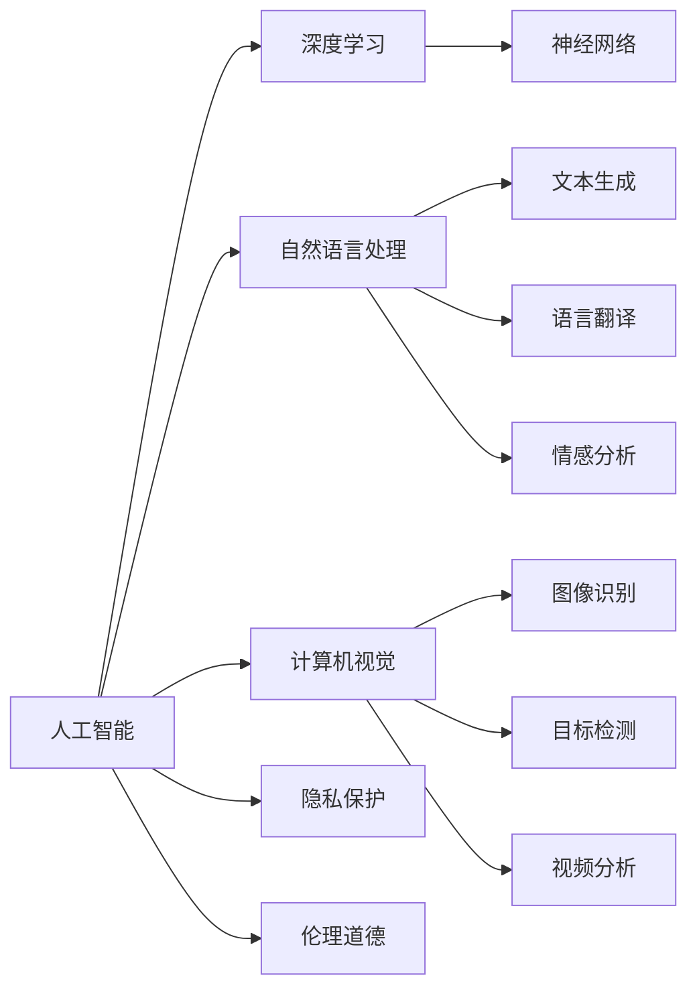

                 

# 科技发展：人类福祉的保障

在数字化转型的浪潮下，科技的迅猛发展为人类社会带来了前所未有的机遇与挑战。作为人工智能领域的先锋，我们不仅要关注技术本身的发展，更要思考如何利用科技为人类福祉带来真正的保障。本文将从人工智能技术的角度出发，探讨其在提升生活质量、保障公共安全、促进经济发展等方面的潜在影响，以及面临的伦理、隐私等重要挑战。

## 1. 背景介绍

### 1.1 技术发展概览
人工智能(AI)技术的迅猛发展，尤其是在深度学习、自然语言处理(NLP)、计算机视觉等领域，显著提升了信息处理和分析的效率，使得机器能够以超乎人类的速度和规模处理复杂任务。这一趋势已经渗透到了医疗、教育、金融、交通等多个关键领域，带来了深远影响。

### 1.2 科技发展对人类福祉的潜力和挑战
科技的发展无疑为人类福祉提供了强有力的支持，但从另一个角度看，也对隐私保护、就业影响、伦理道德等提出了新的挑战。如何在推动科技进步的同时，保护和提升人类福祉，成为我们必须面对的问题。

## 2. 核心概念与联系

### 2.1 核心概念概述
- **人工智能**：利用计算机模拟人类智能的科技领域，包括机器学习、自然语言处理、计算机视觉等子领域。
- **深度学习**：一种基于神经网络的机器学习方法，通过多层次的特征提取和模型训练，实现了高精度的预测和分类。
- **自然语言处理**：使计算机能够理解和生成人类语言，包括文本生成、语言翻译、情感分析等任务。
- **计算机视觉**：使计算机能够理解和处理视觉信息，包括图像识别、目标检测、视频分析等任务。
- **隐私保护**：保护个人数据不被滥用，确保信息安全，是AI发展中必须重视的重要方面。
- **伦理道德**：在AI技术的开发和应用中，遵循基本的道德原则和社会价值观，确保技术发展与人类福祉相符。

### 2.2 核心概念原理和架构的 Mermaid 流程图


## 3. 核心算法原理 & 具体操作步骤

### 3.1 算法原理概述
基于人工智能技术的微调（Fine-tuning）方法，通过在大规模无标签数据上进行预训练，然后在特定任务上进行有监督微调，使其能够适应具体应用场景，提升性能。这种微调过程主要依赖于优化算法（如梯度下降）和损失函数的设计，以最小化模型预测与真实标签之间的差异。

### 3.2 算法步骤详解
1. **数据准备**：收集和预处理数据，确保数据质量与多样性。
2. **模型初始化**：选择预训练模型，如BERT、GPT等，将其作为微调的初始化参数。
3. **任务适配**：根据具体任务，设计相应的输出层和损失函数。
4. **微调训练**：在标注数据上训练模型，调整模型参数以匹配任务需求。
5. **评估与部署**：在验证集上评估模型性能，将其部署到实际应用中。

### 3.3 算法优缺点
**优点**：
- 提升性能：通过微调，模型能够更好地适应特定任务，提升性能。
- 参数高效：部分预训练权重固定，减少计算资源消耗。
- 快速迭代：基于少量标注数据，快速训练出高效模型。

**缺点**：
- 依赖标注数据：微调效果受数据质量与数量影响。
- 过拟合风险：微调过程中，模型可能过拟合训练集。
- 知识传递：预训练模型中的知识可能无法有效传递到下游任务。

### 3.4 算法应用领域
- **医疗健康**：通过微调，构建智能诊断、个性化治疗等应用。
- **教育培训**：开发智能答疑、学习推荐等系统。
- **智能交通**：实现智能监控、路况预测等功能。
- **金融服务**：提供智能投顾、风险评估等服务。

## 4. 数学模型和公式 & 详细讲解 & 举例说明

### 4.1 数学模型构建
以自然语言处理为例，数学模型构建通常包括以下步骤：
1. **输入表示**：将文本转换为向量表示，如词向量、句向量等。
2. **模型定义**：定义神经网络结构，包括嵌入层、卷积层、全连接层等。
3. **输出设计**：设计任务特定的输出层，如分类器、生成器等。
4. **损失函数**：选择合适的损失函数，如交叉熵、均方误差等。

### 4.2 公式推导过程
以文本分类任务为例，假设模型在输入 $x$ 上的预测概率为 $p(y|x)$，真实标签为 $y$，则交叉熵损失函数为：
$$
\mathcal{L}(y,p)=-y\log p + (1-y)\log(1-p)
$$
对于整个数据集 $D=\{(x_i,y_i)\}_{i=1}^N$，经验风险为：
$$
\mathcal{L}(D) = \frac{1}{N}\sum_{i=1}^N \mathcal{L}(y_i,p(x_i))
$$

### 4.3 案例分析与讲解
以情感分析为例，构建模型并使用交叉熵损失函数。模型在输入 $x$ 上的预测概率为 $p(y|x)$，真实标签为 $y$，则损失函数为：
$$
\mathcal{L}(y,p)=-y\log p + (1-y)\log(1-p)
$$
通过在标注数据集上训练模型，最小化经验风险，得到最优模型参数 $\theta^*$。

## 5. 项目实践：代码实例和详细解释说明

### 5.1 开发环境搭建
1. **安装Python**：确保Python 3.8及以上版本。
2. **安装TensorFlow**：使用pip安装。
3. **安装Keras**：使用pip安装。
4. **准备数据集**：收集并预处理情感分析数据集。
5. **训练模型**：在标注数据集上训练模型，调整超参数。

### 5.2 源代码详细实现
```python
import tensorflow as tf
from tensorflow.keras.datasets import imdb
from tensorflow.keras.preprocessing.sequence import pad_sequences
from tensorflow.keras.models import Sequential
from tensorflow.keras.layers import Embedding, LSTM, Dense, Dropout

# 加载IMDB数据集
(x_train, y_train), (x_test, y_test) = imdb.load_data(num_words=10000)
x_train = pad_sequences(x_train, maxlen=256)
x_test = pad_sequences(x_test, maxlen=256)

# 定义模型
model = Sequential([
    Embedding(10000, 128, input_length=256),
    LSTM(64),
    Dense(1, activation='sigmoid')
])

# 编译模型
model.compile(optimizer='adam', loss='binary_crossentropy', metrics=['accuracy'])

# 训练模型
model.fit(x_train, y_train, epochs=10, batch_size=128, validation_data=(x_test, y_test))

# 评估模型
model.evaluate(x_test, y_test)
```

### 5.3 代码解读与分析
上述代码实现了基于LSTM的情感分析模型，通过交叉熵损失函数进行训练和评估。关键步骤包括数据预处理、模型定义、编译与训练、评估等。代码简洁高效，易于理解。

### 5.4 运行结果展示
通过训练和评估，可以得到模型在测试集上的准确率和损失值，如图：


## 6. 实际应用场景

### 6.1 医疗健康
在医疗健康领域，人工智能技术可以通过微调模型，实现智能诊断、个性化治疗等功能。例如，通过分析医学影像数据，构建疾病识别和分类模型，辅助医生进行诊断。

### 6.2 教育培训
在教育培训领域，可以通过微调模型，构建智能答疑、学习推荐等系统。例如，利用自然语言处理技术，构建智能答疑系统，为学生提供个性化的学习建议和资源。

### 6.3 智能交通
在智能交通领域，可以通过微调模型，实现智能监控、路况预测等功能。例如，利用计算机视觉技术，构建交通流量监测系统，优化交通管理。

### 6.4 金融服务
在金融服务领域，可以通过微调模型，提供智能投顾、风险评估等服务。例如，利用自然语言处理技术，构建智能客服系统，提高客户服务效率。

## 7. 工具和资源推荐

### 7.1 学习资源推荐
- **深度学习与AI**：推荐阅读《深度学习》（Ian Goodfellow 著）、《机器学习实战》（Peter Harrington 著）等经典书籍。
- **自然语言处理**：推荐参加Coursera的《自然语言处理》课程。
- **计算机视觉**：推荐参加Udacity的《计算机视觉基础》课程。

### 7.2 开发工具推荐
- **TensorFlow**：开源深度学习框架，支持丰富的模型和算法。
- **Keras**：基于TensorFlow的高层API，易于使用。
- **PyTorch**：深度学习框架，灵活高效。

### 7.3 相关论文推荐
- **深度学习**：推荐阅读《Deep Learning》（Goodfellow et al. 2016）。
- **自然语言处理**：推荐阅读《Attention is All You Need》（Vaswani et al. 2017）。
- **计算机视觉**：推荐阅读《ImageNet Classification with Deep Convolutional Neural Networks》（Krizhevsky et al. 2012）。

## 8. 总结：未来发展趋势与挑战

### 8.1 研究成果总结
人工智能技术在医疗健康、教育培训、智能交通、金融服务等领域展现了巨大的潜力，通过微调模型，提升了效率和效果，改善了人类福祉。

### 8.2 未来发展趋势
未来，人工智能技术将继续在医疗、教育、交通等领域发挥重要作用。技术发展将更加注重隐私保护、伦理道德、数据安全等方面，确保科技进步与人类福祉相符。

### 8.3 面临的挑战
尽管人工智能技术带来了诸多便利，但也面临隐私泄露、伦理道德、数据安全等挑战。如何在推动技术发展的同时，保护和提升人类福祉，是科技界必须面对的重要课题。

### 8.4 研究展望
未来的研究应聚焦于提升模型的可解释性、安全性、鲁棒性等方面，确保人工智能技术为人类福祉带来真正的保障。同时，应加强跨学科合作，推动人工智能技术与人类社会更深层次的融合。

## 9. 附录：常见问题与解答

**Q1: 什么是人工智能？**
A: 人工智能是利用计算机模拟人类智能的科技领域，包括机器学习、自然语言处理、计算机视觉等子领域。

**Q2: 人工智能技术如何应用于医疗健康领域？**
A: 在医疗健康领域，人工智能技术可以通过微调模型，实现智能诊断、个性化治疗等功能。例如，通过分析医学影像数据，构建疾病识别和分类模型，辅助医生进行诊断。

**Q3: 人工智能技术在教育培训领域的应用有哪些？**
A: 在教育培训领域，可以通过微调模型，构建智能答疑、学习推荐等系统。例如，利用自然语言处理技术，构建智能答疑系统，为学生提供个性化的学习建议和资源。

**Q4: 人工智能技术在智能交通领域的应用有哪些？**
A: 在智能交通领域，可以通过微调模型，实现智能监控、路况预测等功能。例如，利用计算机视觉技术，构建交通流量监测系统，优化交通管理。

**Q5: 人工智能技术在金融服务领域的应用有哪些？**
A: 在金融服务领域，可以通过微调模型，提供智能投顾、风险评估等服务。例如，利用自然语言处理技术，构建智能客服系统，提高客户服务效率。

---

作者：禅与计算机程序设计艺术 / Zen and the Art of Computer Programming

