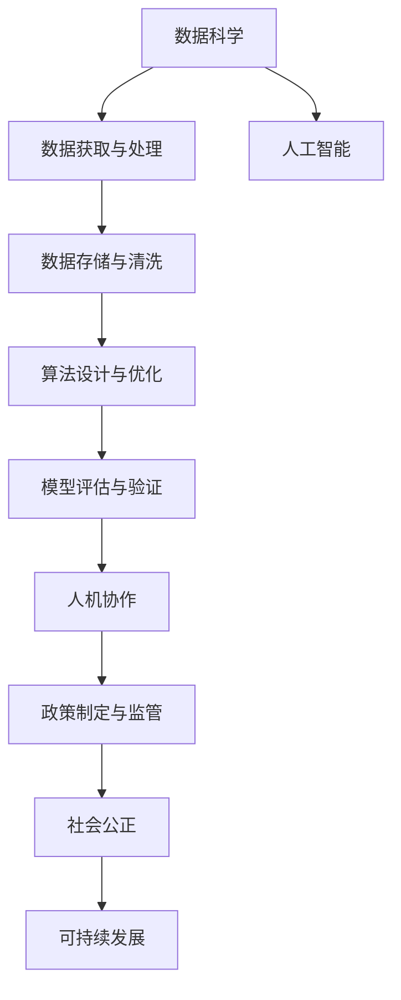

                 

# 科技向善：用科技的力量解决社会难题

> 关键词：科技向善, 社会难题, 人工智能, 数据科学, 社会影响, 可持续发展, 公正性

## 1. 背景介绍

### 1.1 问题由来

随着科技的迅猛发展，人工智能、大数据、物联网等新兴技术正深刻改变着我们的生活和工作方式。但随之而来的，是诸多社会问题的浮现，如就业结构变革、隐私保护、信息过载、社会不平等、环境污染等。这些问题不仅影响个体的生活质量，更关乎社会的长期稳定和发展。

在这样的背景下，如何利用科技的力量，不仅解决当前的难题，还助力构建更加公正、和谐、可持续的未来，成为了当下科技发展的重要课题。本文将从科技向善的角度，探讨如何通过数据科学、人工智能等前沿技术，有效解决社会中的若干重大问题。

### 1.2 问题核心关键点

要通过科技向善，首先需要解决如下核心问题：

1. **数据获取与处理**：数据是科技向善的基石。如何高效、公正、透明地获取数据，并将其转化为可用信息，是首要挑战。
2. **算法设计与优化**：算法是科技向善的工具。如何设计鲁棒、公正、可解释的算法，以准确解决社会问题，是关键任务。
3. **模型评估与验证**：模型是科技向善的体现。如何科学、客观、公平地评估模型效果，验证其社会影响，是必须环节。
4. **用户教育与参与**：人是科技向善的主体。如何通过教育和参与机制，让更多人了解、接受和使用科技手段，是重要途径。
5. **政策制定与监管**：政策是科技向善的保障。如何制定科学合理的政策，进行有效监管，是关键保障。

本文将围绕这些核心问题，系统探讨如何用科技向善来解决社会难题。

## 2. 核心概念与联系

### 2.1 核心概念概述

为了更好地理解科技向善的实现路径，本节将介绍几个关键概念：

- **数据科学（Data Science）**：使用数据和算法来解决现实问题的学科。数据科学不仅包括数据处理、建模，还包括数据可视化、数据故事讲述等。
- **人工智能（AI）**：通过机器学习、深度学习等技术，模拟人类智能活动。AI在图像识别、自然语言处理、智能推荐等方面已取得显著成果。
- **社会公正（Social Justice）**：确保所有人享有平等的权利和机会，消除社会不平等现象。科技向善的目标之一，就是通过技术手段促进社会公正。
- **可持续发展（Sustainable Development）**：确保经济社会发展与环境保护、资源利用相协调，实现长期利益的最大化。
- **人机协作（Human-Machine Collaboration）**：在处理复杂社会问题时，人机协作可以充分发挥各自优势，形成互补，提高问题解决的效率和效果。

这些概念之间的联系紧密，共同构成了科技向善的理论基础和实践框架。

### 2.2 核心概念原理和架构的 Mermaid 流程图



这个流程图展示了数据科学和人工智能如何通过数据获取、处理、建模、评估等步骤，结合人机协作和政策监管，实现对社会问题的科技向善解决。

## 3. 核心算法原理 & 具体操作步骤

### 3.1 算法原理概述

科技向善的实现，离不开数据科学和人工智能的支持。通过数据获取、处理、建模、评估等步骤，可以高效、公正、透明地解决社会问题。

### 3.2 算法步骤详解

#### 3.2.1 数据获取与处理

数据是科技向善的基石。高效、公正、透明地获取数据，并转化为可用信息，是科技向善的首要任务。

**数据获取**：
- **公开数据集**：利用政府、非政府组织（NGOs）、学术机构等公开的数据集，是获取数据的常用方式。例如，Kaggle平台提供了大量公开数据集，涵盖了经济、环境、社会等众多领域。
- **爬虫技术**：通过爬虫技术，可以从互联网获取实时数据。但需注意法律合规和隐私保护。
- **传感器数据**：利用物联网设备，如智能家居、智能城市等，获取环境、交通、健康等实时数据。

**数据处理**：
- **数据清洗**：去除噪声、处理缺失值、规范化数据格式，是数据预处理的必要步骤。Python中的Pandas库提供了丰富的数据处理工具。
- **特征工程**：选择合适的特征，进行特征提取、特征转换、特征选择等操作，以提升模型性能。

#### 3.2.2 算法设计与优化

算法是科技向善的工具。设计鲁棒、公正、可解释的算法，是解决社会问题的关键。

**算法设计**：
- **分类算法**：如逻辑回归、决策树、随机森林等，适用于解决分类问题，如信用评分、欺诈检测等。
- **回归算法**：如线性回归、支持向量机（SVM）等，适用于解决数值预测问题，如房价预测、股市预测等。
- **聚类算法**：如K-means、DBSCAN等，适用于解决群体划分问题，如客户细分、社交网络分析等。
- **深度学习算法**：如卷积神经网络（CNN）、循环神经网络（RNN）等，适用于处理复杂结构化数据，如图像识别、自然语言处理等。

**算法优化**：
- **超参数调优**：通过网格搜索、贝叶斯优化等方法，调整算法超参数，以提升模型性能。
- **模型集成**：通过集成多个模型，如Bagging、Boosting、Stacking等，提升模型的鲁棒性和泛化能力。
- **模型压缩**：通过剪枝、量化等技术，减小模型规模，提升模型推理速度。

#### 3.2.3 模型评估与验证

模型是科技向善的体现。科学、客观、公平地评估模型效果，验证其社会影响，是必须环节。

**模型评估**：
- **准确率（Accuracy）**：模型预测的正确率，适用于二分类或多分类问题。
- **召回率（Recall）和精确率（Precision）**：用于评估模型的预测效果，特别是在不平衡数据集上的表现。
- **F1分数（F1 Score）**：综合了召回率和精确率，适用于不平衡数据集上的评估。
- **AUC-ROC曲线（AUC-ROC Curve）**：评估二分类模型的性能，AUC越大，模型性能越好。

**模型验证**：
- **交叉验证（Cross Validation）**：通过将数据集划分为训练集和验证集，评估模型泛化能力。
- **留出法（Holdout Method）**：将数据集分为训练集和测试集，评估模型在新数据上的表现。

#### 3.2.4 人机协作

人机协作是科技向善的重要方式。在处理复杂社会问题时，人机协作可以充分发挥各自优势，形成互补，提高问题解决的效率和效果。

**人机协作模型**：
- **强化学习（Reinforcement Learning, RL）**：通过奖励机制，优化智能体的决策过程，如自动驾驶、机器人控制等。
- **协同过滤（Collaborative Filtering）**：通过用户行为数据，推荐个性化内容，如电商推荐、新闻推荐等。
- **群体智能（Swarm Intelligence）**：利用分布式计算和优化算法，解决大规模优化问题，如交通流量控制、电网优化等。

**人机协作应用**：
- **智能客服**：利用自然语言处理技术，提高客户服务质量，提升用户满意度。
- **智能诊断**：结合医学影像数据和专家知识，辅助医生进行疾病诊断，提高诊断准确率。
- **智能推荐**：通过分析用户行为数据，推荐个性化的商品、服务，提升用户体验。

#### 3.2.5 政策制定与监管

政策是科技向善的保障。制定科学合理的政策，进行有效监管，是实现科技向善的关键保障。

**政策制定**：
- **数据隐私保护**：制定数据保护法规，确保数据隐私和安全，如GDPR、CCPA等。
- **算法公平性**：制定算法公平性标准，防止算法歧视，如FAIR原则。
- **模型可解释性**：制定模型可解释性标准，提升模型透明度，如LIME、SHAP等。

**政策监管**：
- **透明性**：确保算法和数据处理过程透明，便于公众监督和审查。
- **责任归属**：明确算法和模型责任归属，防止技术滥用和误用。
- **法律保障**：制定相关法律法规，规范科技向善行为，如《数据安全法》《人工智能法》等。

### 3.3 算法优缺点

**优点**：
1. **高效性**：通过数据科学和人工智能技术，可以快速处理和分析大量数据，提升问题解决的效率。
2. **公正性**：通过科学、客观、公平的算法设计，减少人为偏见和歧视，提升社会公正。
3. **透明性**：通过模型可解释性技术，提升模型透明度，便于公众理解和监督。
4. **可扩展性**：通过云计算和分布式计算技术，支持大规模问题处理，实现规模化应用。

**缺点**：
1. **数据质量**：数据质量对模型效果有重大影响，数据偏差可能导致模型偏见。
2. **算法复杂性**：复杂算法需要较高的计算资源和时间成本，对数据科学和人工智能的要求较高。
3. **隐私风险**：数据隐私和用户权益保护是重要挑战，需注意合规性和伦理性。
4. **技术滥用**：技术滥用可能导致社会问题加剧，需加强监管和伦理约束。

### 3.4 算法应用领域

科技向善在多个领域都有广泛应用，以下是几个典型应用案例：

**医疗健康**：
- **智能诊断**：利用医学影像、基因数据，辅助医生进行疾病诊断和治疗，提升医疗服务质量。
- **健康监测**：通过可穿戴设备，实时监测用户健康状况，提供个性化健康管理建议。

**教育**：
- **智能教育**：利用人工智能技术，提供个性化学习建议、智能作业批改、学习效果评估等服务。
- **教育公平**：通过教育数据分析，优化教育资源配置，缩小教育差距。

**环境保护**：
- **智能监测**：利用传感器、卫星数据，实时监测环境污染和气候变化，提升环境保护效果。
- **资源管理**：通过数据分析，优化自然资源管理，实现可持续发展。

**公共安全**：
- **智能预警**：利用数据科学和人工智能技术，提升公共安全预警能力，保障人民生命财产安全。
- **智能管理**：通过数据分析，优化公共资源管理，提高公共服务效率。

## 4. 数学模型和公式 & 详细讲解 & 举例说明

### 4.1 数学模型构建

科技向善涉及多种数学模型，本文将以分类任务为例，系统讲解其数学模型构建过程。

**模型表示**：
- **输入**：特征向量 $x \in \mathbb{R}^d$。
- **输出**：标签 $y \in \{0, 1\}$。
- **模型参数**：权重 $w \in \mathbb{R}^d$ 和偏置 $b \in \mathbb{R}$。

**损失函数**：
- **二分类交叉熵损失**：
  $$
  L(w, b) = -\frac{1}{N} \sum_{i=1}^N [y_i \log \sigma(w^T x_i + b) + (1 - y_i) \log (1 - \sigma(w^T x_i + b))]
  $$

**优化算法**：
- **梯度下降**：
  $$
  w, b \leftarrow w - \eta \nabla_w L(w, b)
  $$

### 4.2 公式推导过程

以二分类任务为例，推导二分类交叉熵损失函数的梯度计算过程。

**梯度计算**：
- **前向传播**：
  $$
  z = w^T x + b
  $$
  $$
  \hat{y} = \sigma(z) = \frac{1}{1 + e^{-z}}
  $$
- **损失函数**：
  $$
  L(w, b) = -\frac{1}{N} \sum_{i=1}^N [y_i \log \hat{y}_i + (1 - y_i) \log (1 - \hat{y}_i)]
  $$
- **梯度**：
  $$
  \nabla_w L(w, b) = -\frac{1}{N} \sum_{i=1}^N \nabla_w (\hat{y}_i \log \hat{y}_i + (1 - \hat{y}_i) \log (1 - \hat{y}_i))
  $$
  $$
  = -\frac{1}{N} \sum_{i=1}^N (\hat{y}_i - y_i) x_i
  $$

### 4.3 案例分析与讲解

**案例**：信用评分预测
- **数据集**：包含用户基本信息、信用记录、消费行为等数据。
- **目标**：预测用户的信用评分，评估其偿还能力。
- **模型**：逻辑回归模型。
- **评估**：使用AUC-ROC曲线评估模型效果。

**过程**：
1. **数据获取**：收集用户基本信息、信用记录、消费行为等数据。
2. **数据处理**：进行数据清洗、特征选择、特征工程等预处理操作。
3. **模型训练**：使用逻辑回归模型进行训练，调整超参数以提升模型性能。
4. **模型评估**：使用交叉验证和留出法进行模型验证，评估模型效果。
5. **结果应用**：利用训练好的模型对新用户进行信用评分预测，辅助银行决策。

## 5. 项目实践：代码实例和详细解释说明

### 5.1 开发环境搭建

科技向善项目的开发需要一定的环境支持。以下是在Python环境下搭建开发环境的步骤：

1. **安装Python和相关库**：
   ```bash
   pip install numpy pandas scikit-learn matplotlib seaborn jupyter notebook
   ```

2. **配置Jupyter Notebook**：
   ```bash
   jupyter notebook --allow-root
   ```

3. **环境管理**：
   ```bash
   conda create --name env python=3.8
   conda activate env
   ```

### 5.2 源代码详细实现

以下是一个基于Python的信用评分预测项目的代码实现，以供参考：

```python
import pandas as pd
from sklearn.model_selection import train_test_split
from sklearn.linear_model import LogisticRegression
from sklearn.metrics import roc_auc_score
from sklearn.metrics import roc_curve

# 加载数据
data = pd.read_csv('credit_data.csv')

# 特征选择
features = ['age', 'income', 'loan_status', 'days逾期', '违约次数']
X = data[features]
y = data['违约标记']

# 划分训练集和测试集
X_train, X_test, y_train, y_test = train_test_split(X, y, test_size=0.2, random_state=42)

# 模型训练
model = LogisticRegression()
model.fit(X_train, y_train)

# 模型评估
y_pred = model.predict_proba(X_test)[:, 1]
auc = roc_auc_score(y_test, y_pred)
fpr, tpr, thresholds = roc_curve(y_test, y_pred)

# 结果输出
print(f'AUC: {auc:.3f}')
print(f'ROC曲线: {fpr:.4f}, {tpr:.4f}')
```

### 5.3 代码解读与分析

**代码解读**：
- **数据加载**：使用pandas库加载信用评分数据集。
- **特征选择**：选择与信用评分相关的特征，进行特征工程。
- **模型训练**：使用逻辑回归模型进行训练，调整超参数以提升模型性能。
- **模型评估**：使用ROC曲线评估模型效果，输出AUC值。

**代码分析**：
- **数据预处理**：数据清洗、特征选择、特征工程是模型训练的重要预处理步骤。
- **模型选择**：根据任务类型选择合适的模型，如逻辑回归、支持向量机、决策树等。
- **模型训练**：通过训练集数据，调整模型参数，提升模型性能。
- **模型评估**：使用交叉验证、留出法等方法，评估模型在新数据上的表现。

**结果应用**：
- **信用评分预测**：利用训练好的模型对新用户进行信用评分预测，辅助银行决策。
- **模型优化**：通过超参数调优、模型集成等方法，进一步提升模型效果。

## 6. 实际应用场景

### 6.1 医疗健康

在医疗健康领域，科技向善的应用场景广泛。以下列举几个典型应用：

**智能诊断**：
- **案例**：利用医学影像数据和专家知识，辅助医生进行疾病诊断。
- **过程**：
  1. **数据获取**：收集医学影像数据、病历记录等。
  2. **模型训练**：使用深度学习模型进行训练，优化模型参数。
  3. **模型评估**：使用交叉验证、留出法等方法，评估模型效果。
  4. **结果应用**：辅助医生进行疾病诊断，提高诊断准确率。

**健康监测**：
- **案例**：通过可穿戴设备，实时监测用户健康状况，提供个性化健康管理建议。
- **过程**：
  1. **数据获取**：收集可穿戴设备生成的生理数据、行为数据等。
  2. **模型训练**：使用时间序列分析、异常检测等技术，训练模型。
  3. **模型评估**：使用均方误差、MAE等指标，评估模型效果。
  4. **结果应用**：提供个性化健康管理建议，提升用户健康水平。

### 6.2 教育

在教育领域，科技向善的应用场景同样多样。以下列举几个典型应用：

**智能教育**：
- **案例**：利用人工智能技术，提供个性化学习建议、智能作业批改、学习效果评估等服务。
- **过程**：
  1. **数据获取**：收集学生学习数据、教师教学数据等。
  2. **模型训练**：使用机器学习、深度学习技术，训练模型。
  3. **模型评估**：使用准确率、召回率、F1分数等指标，评估模型效果。
  4. **结果应用**：提供个性化学习建议、智能作业批改、学习效果评估等服务。

**教育公平**：
- **案例**：通过教育数据分析，优化教育资源配置，缩小教育差距。
- **过程**：
  1. **数据获取**：收集教育资源数据、学生成绩数据等。
  2. **模型训练**：使用回归分析、聚类分析等技术，训练模型。
  3. **模型评估**：使用均方误差、R2分数等指标，评估模型效果。
  4. **结果应用**：优化教育资源配置，提升教育公平性。

### 6.3 环境保护

在环境保护领域，科技向善的应用场景同样广泛。以下列举几个典型应用：

**智能监测**：
- **案例**：利用传感器、卫星数据，实时监测环境污染和气候变化，提升环境保护效果。
- **过程**：
  1. **数据获取**：收集传感器数据、卫星遥感数据等。
  2. **模型训练**：使用时间序列分析、异常检测等技术，训练模型。
  3. **模型评估**：使用均方误差、MAE等指标，评估模型效果。
  4. **结果应用**：提供实时环境监测报告，提升环境保护效果。

**资源管理**：
- **案例**：通过数据分析，优化自然资源管理，实现可持续发展。
- **过程**：
  1. **数据获取**：收集自然资源数据、环境数据等。
  2. **模型训练**：使用回归分析、聚类分析等技术，训练模型。
  3. **模型评估**：使用均方误差、R2分数等指标，评估模型效果。
  4. **结果应用**：优化自然资源管理，实现可持续发展。

## 7. 工具和资源推荐

### 7.1 学习资源推荐

为了帮助开发者系统掌握科技向善的理论基础和实践技巧，这里推荐一些优质的学习资源：

1. **《数据科学导论》**：由斯坦福大学教授撰写，全面介绍了数据科学的基本概念和实践方法。
2. **《Python数据科学手册》**：由Jake VanderPlas撰写，详细介绍了Python在数据科学中的应用。
3. **《机器学习实战》**：由Peter Harrington撰写，通过实践案例，介绍机器学习算法和应用。
4. **Kaggle平台**：提供大量公开数据集和竞赛，是数据科学和机器学习学习者的重要平台。
5. **Coursera平台**：提供多门数据科学和机器学习课程，由世界顶级大学开设，系统介绍相关知识。

### 7.2 开发工具推荐

高效的工具支持是科技向善项目开发的重要保障。以下是几款用于科技向善开发的常用工具：

1. **Jupyter Notebook**：开源的交互式笔记本环境，支持Python、R等语言，适合数据科学和机器学习开发。
2. **Scikit-learn**：Python的机器学习库，提供了丰富的算法和工具，适合快速原型开发。
3. **TensorFlow**：Google开发的深度学习框架，支持分布式计算和模型优化，适合大规模模型训练。
4. **PyTorch**：Facebook开发的深度学习框架，支持动态计算图和GPU加速，适合灵活的模型设计。
5. **RapidMiner**：数据科学平台，提供丰富的可视化工具和算法，适合非技术人员使用。

### 7.3 相关论文推荐

科技向善的研究涉及多学科交叉，以下是几篇奠基性的相关论文，推荐阅读：

1. **《机器学习》**：Tom Mitchell撰写，系统介绍了机器学习的理论基础和应用。
2. **《数据科学导论》**：Jake VanderPlas撰写，全面介绍了数据科学的基本概念和实践方法。
3. **《深度学习》**：Ian Goodfellow撰写，详细介绍了深度学习的理论基础和算法。
4. **《可持续发展的科学基础》**：Wangari Maathai撰写，讨论了环境保护与科技向善的关系。

这些论文代表了大规模数据科学和机器学习的最新进展，对理解科技向善的理论基础和实践方法具有重要参考价值。

## 8. 总结：未来发展趋势与挑战

### 8.1 研究成果总结

本文从科技向善的角度，系统探讨了如何使用数据科学和人工智能技术，高效、公正、透明地解决社会难题。主要研究成果包括：

1. **数据获取与处理**：通过爬虫、传感器等技术，高效获取数据，并进行数据清洗和特征工程。
2. **算法设计与优化**：设计鲁棒、公正、可解释的算法，并使用超参数调优、模型集成等技术，提升模型性能。
3. **模型评估与验证**：使用交叉验证、留出法等方法，科学评估模型效果，验证其社会影响。
4. **人机协作**：通过强化学习、协同过滤等技术，实现人机协作，提高问题解决的效率和效果。
5. **政策制定与监管**：制定科学合理的政策，进行有效监管，确保科技向善的公正性和伦理性。

### 8.2 未来发展趋势

展望未来，科技向善将呈现以下几个发展趋势：

1. **自动化和智能化**：自动化技术将进一步提升问题解决的效率，智能化技术将增强模型的决策能力和透明度。
2. **多模态融合**：多模态数据融合技术将提升模型的综合能力，实现更全面的问题解决。
3. **联邦学习**：联邦学习将使模型在不泄露隐私的前提下，进行分布式学习和优化。
4. **可持续发展**：环境和社会可持续发展的目标将进一步推动科技向善的实践。
5. **社会公平和正义**：科技向善将更加注重社会公平和正义，减少数据偏见和算法歧视。

### 8.3 面临的挑战

尽管科技向善的研究取得了显著进展，但仍面临诸多挑战：

1. **数据质量和隐私**：数据质量和隐私是科技向善的重要挑战，需确保数据的质量和隐私安全。
2. **算法复杂性和成本**：复杂算法需要较高的计算资源和时间成本，需进一步优化模型和算法。
3. **技术滥用和伦理**：技术滥用可能导致社会问题加剧，需加强技术伦理约束。
4. **社会接受度**：科技向善需注重社会接受度，通过教育和参与机制，增强公众理解和信任。

### 8.4 研究展望

面向未来，科技向善的研究需要在以下几个方面寻求新的突破：

1. **自动化和智能化**：通过自动化和智能化技术，提升问题解决的效率和效果。
2. **多模态融合**：实现多模态数据的融合，提升模型的综合能力。
3. **联邦学习**：通过联邦学习，实现分布式学习和优化，确保数据隐私和模型安全。
4. **社会公平和正义**：注重社会公平和正义，减少数据偏见和算法歧视，提升模型的社会价值。
5. **技术伦理**：加强技术伦理约束，确保技术应用的安全性和伦理性。

这些研究方向的探索，将推动科技向善技术的不断进步，为构建更加公正、和谐、可持续的社会做出更大贡献。

## 9. 附录：常见问题与解答

**Q1：科技向善是否适用于所有社会问题？**

A: 科技向善在解决社会问题方面具有广泛适用性，但并非所有社会问题都能通过科技手段解决。需根据具体情况，选择合适的方法和技术。

**Q2：如何确保数据的质量和隐私？**

A: 数据质量是科技向善的基础，需通过数据清洗、特征工程等方法，确保数据准确性和完整性。数据隐私保护是重要保障，需制定科学合理的数据隐私政策，确保数据安全和合规性。

**Q3：如何确保算法的公正性和伦理性？**

A: 算法的公正性和伦理性是科技向善的重要目标，需制定科学合理的算法评估标准，确保算法透明、可解释、无歧视。通过多轮测试和验证，发现并纠正算法中的偏见和错误。

**Q4：如何实现多模态数据的融合？**

A: 多模态数据的融合需要选择合适的特征提取和融合方法，如特征融合、集成学习等。通过多模态数据的综合分析，提升模型的综合能力，实现更全面的问题解决。

**Q5：如何应对技术滥用和伦理问题？**

A: 技术滥用和伦理问题需通过技术规范和政策约束加以解决。制定科学合理的技术规范和政策，确保技术应用的安全性和伦理性。加强公众教育和参与机制，提升社会对科技向善的理解和信任。

本文从科技向善的角度，探讨了如何使用数据科学和人工智能技术，高效、公正、透明地解决社会难题。通过系统介绍科技向善的理论基础和实践方法，希望能为科技工作者和业界同仁提供参考和启发，共同推动科技向善的实践和应用。

作者：禅与计算机程序设计艺术 / Zen and the Art of Computer Programming

