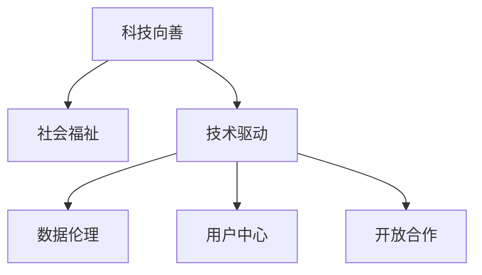

                 

# 科技向善：用科技解决社会问题

## 1. 背景介绍

### 1.1 问题由来
随着科技的不断进步，信息技术已渗透到社会生活的各个方面，对经济、教育、医疗、环保等多个领域产生了深远影响。与此同时，科技带来的问题和挑战也日益凸显，如数据隐私泄露、网络安全威胁、人工智能伦理等，使得科技发展与人类社会的和谐共处成为一个重要议题。

如何在享受科技带来的便利的同时，避免其潜在的负面影响，将科技的利益最大化，成为科技界和全社会共同关注的话题。科技向善（Technology for Good）的理念应运而生，强调利用科技解决实际问题，提升社会福祉。

### 1.2 问题核心关键点
科技向善的本质是通过技术手段解决实际问题，改善人们的生活质量。核心关键点包括：

- 应用领域广泛：从智能医疗、智慧教育、智慧城市到精准农业、环境保护，科技在多个领域都有巨大的应用潜力。
- 技术驱动创新：通过引入新的技术解决方案，优化现有的社会服务流程，提升效率。
- 促进社会公平：通过技术消除信息不对称，缩小贫富差距，实现资源的公平分配。
- 强调伦理与责任：在技术应用中，关注用户隐私、数据安全、算法公平等伦理问题，确保技术使用的责任和透明。

### 1.3 问题研究意义
科技向善不仅关乎技术本身的发展，更关系到社会的整体福祉。它的研究意义在于：

1. **提升社会福利**：利用科技手段解决实际问题，如健康管理、教育公平、环境保护等，可以显著提升人们的生活质量。
2. **推动经济发展**：科技向善可以推动传统产业的数字化转型，创造新的商业模式，带动经济增长。
3. **构建和谐社会**：通过科技改善公共服务，促进社会公平，构建和谐稳定的社会环境。
4. **应对未来挑战**：面对气候变化、人口老龄化等未来挑战，科技向善提供了创新的解决方案。

## 2. 核心概念与联系

### 2.1 核心概念概述

为更好地理解科技向善的概念，本节将介绍几个密切相关的核心概念：

- **科技向善**：利用科技手段解决实际问题，提升社会福祉。核心在于技术的应用和效果评估。
- **社会福祉**：社会成员的物质、精神和情感需求得到满足的状态。科技向善旨在提升社会福祉。
- **技术驱动**：通过技术创新和应用，提升社会服务的效率和质量。技术驱动是科技向善的核心手段。
- **数据伦理**：在数据收集、处理、使用的过程中，遵循公正、透明、隐私保护的原则。
- **用户中心**：在技术设计和应用中，以用户需求为中心，关注用户体验和满意度。
- **开放合作**：倡导跨界合作，打破行业壁垒，共同推动科技向善的发展。

这些核心概念之间的逻辑关系可以通过以下Mermaid流程图来展示：



这个流程图展示出科技向善的核心概念及其之间的关系：

1. 科技向善旨在提升社会福祉。
2. 技术驱动是实现科技向善的手段。
3. 数据伦理和技术驱动、用户中心紧密关联。
4. 开放合作是推动技术驱动和数据伦理的重要方式。

这些概念共同构成了科技向善的整体框架，使得科技能够更好地服务于社会，提升人类生活质量。

## 3. 核心算法原理 & 具体操作步骤

### 3.1 算法原理概述

科技向善的算法原理主要体现在如何利用技术手段解决实际问题。通常包括以下几个关键步骤：

1. **需求分析**：分析社会问题的本质和需求，确定技术应用的场景和目标。
2. **技术选型**：根据问题特性选择合适的技术方案，如机器学习、物联网、大数据等。
3. **模型设计**：设计合适的模型结构，确保模型能够有效解决问题。
4. **数据准备**：收集、清洗和标注数据，为模型训练提供数据基础。
5. **模型训练**：在标注数据上训练模型，优化模型参数。
6. **模型评估**：在测试数据上评估模型效果，调整模型参数。
7. **模型部署**：将训练好的模型部署到实际应用场景中，实现技术应用。
8. **效果监测**：持续监测技术应用效果，收集反馈，优化模型。

### 3.2 算法步骤详解

以下以智能医疗为例，详细讲解科技向善的算法步骤：

**Step 1: 需求分析**
- 分析智能医疗需求：远程医疗、个性化治疗、疾病预防等。
- 确定技术应用场景：基于移动设备的远程监控、基于电子健康记录的个性化治疗。

**Step 2: 技术选型**
- 选择移动设备和传感器技术，实现实时监控和数据收集。
- 选择机器学习算法，如深度学习、决策树等，用于疾病预测和个性化治疗。

**Step 3: 模型设计**
- 设计传感器网络，监测生命体征和活动状态。
- 设计机器学习模型，如CNN、RNN等，用于疾病预测和行为分析。

**Step 4: 数据准备**
- 收集电子健康记录和生命体征数据，清洗和标注数据。
- 设计数据集，包括训练集、验证集和测试集。

**Step 5: 模型训练**
- 在训练集上训练模型，优化模型参数。
- 使用验证集评估模型效果，调整模型超参数。

**Step 6: 模型评估**
- 在测试集上评估模型效果，计算准确率、召回率、F1值等指标。
- 收集用户反馈，优化模型应用。

**Step 7: 模型部署**
- 将模型部署到移动设备中，实现实时监控和疾病预测。
- 集成到电子健康记录系统中，提供个性化治疗方案。

**Step 8: 效果监测**
- 持续监测模型应用效果，收集反馈。
- 根据反馈不断优化模型和应用流程。

### 3.3 算法优缺点

科技向善的算法优点包括：

1. **效率提升**：通过技术手段优化社会服务流程，提升效率。
2. **问题解决**：利用科技解决复杂社会问题，提高生活质量。
3. **数据驱动**：依托数据驱动决策，提升模型效果和应用精准性。
4. **用户中心**：以用户需求为中心，提升用户体验和满意度。

同时，该方法也存在一定的局限性：

1. **技术复杂性**：部分技术手段需要较高的技术门槛和专业知识。
2. **数据隐私**：在数据收集和处理过程中，需要注意数据隐私和伦理问题。
3. **资源消耗**：部分技术应用需要大量的计算资源和存储空间。
4. **应用局限性**：某些社会问题可能难以通过单一技术手段解决，需要多技术协同。

尽管存在这些局限性，但科技向善仍是大数据和人工智能技术落地应用的重要方向，未来有广阔的发展空间。

### 3.4 算法应用领域

科技向善的算法在多个领域都有广泛应用，例如：

- **智慧医疗**：通过电子健康记录、生命体征监测等技术，实现远程医疗、个性化治疗、疾病预防等。
- **智慧教育**：利用大数据和人工智能技术，实现个性化学习、智能辅导、教学效果评估等。
- **智慧城市**：通过物联网、大数据、AI等技术，实现交通管理、公共安全、环境监测等。
- **精准农业**：利用无人机、传感器、大数据等技术，实现作物监测、智能灌溉、病虫害预测等。
- **环境保护**：通过遥感技术、大数据分析，实现环境监测、污染预警、生态保护等。

科技向善的算法不仅限于上述领域，随着技术的不断发展，更多的新场景和新应用将不断涌现。

## 4. 数学模型和公式 & 详细讲解 & 举例说明

### 4.1 数学模型构建

假设我们要解决一个智能医疗中的疾病预测问题，可以构建如下数学模型：

设输入特征为 $x$，输出标签为 $y$，模型参数为 $\theta$。则预测模型为：

$$
\hat{y} = f(x; \theta)
$$

其中 $f(x; \theta)$ 为模型函数，如线性回归、决策树、神经网络等。目标是最小化损失函数 $\mathcal{L}(\theta)$：

$$
\mathcal{L}(\theta) = \frac{1}{N} \sum_{i=1}^N \ell(y_i, f(x_i; \theta))
$$

其中 $\ell$ 为损失函数，如均方误差、交叉熵等。

### 4.2 公式推导过程

以线性回归模型为例，推导最小二乘法求解参数的公式：

设输入特征矩阵为 $X$，标签向量为 $y$，模型参数为 $\theta = (w, b)$，则线性回归模型为：

$$
\hat{y} = X\theta
$$

最小二乘法的目标是最小化损失函数：

$$
\mathcal{L}(\theta) = \frac{1}{2N} \sum_{i=1}^N (y_i - \hat{y}_i)^2
$$

对 $\theta$ 求导并令导数等于0，可得：

$$
\frac{\partial \mathcal{L}(\theta)}{\partial \theta} = \frac{1}{N} X^T(X\theta - y) = 0
$$

解得：

$$
\theta = (X^TX)^{-1}X^Ty
$$

这就是线性回归模型参数的最小二乘法求解公式。

### 4.3 案例分析与讲解

假设我们要利用线性回归模型预测患者的糖尿病风险，步骤如下：

1. 收集电子健康记录数据，提取相关特征，如年龄、性别、血压、血糖等。
2. 将数据分为训练集和测试集，使用训练集训练模型。
3. 在测试集上评估模型效果，计算准确率、召回率、F1值等指标。
4. 根据模型结果，为患者提供糖尿病风险预测。

通过这一案例，可以看到科技向善中数据驱动决策的实际应用，以及利用模型优化疾病预测流程的效率。

## 5. 项目实践：代码实例和详细解释说明

### 5.1 开发环境搭建

在进行科技向善的算法实践前，我们需要准备好开发环境。以下是使用Python进行PyTorch开发的环境配置流程：

1. 安装Anaconda：从官网下载并安装Anaconda，用于创建独立的Python环境。

2. 创建并激活虚拟环境：
```bash
conda create -n pytorch-env python=3.8 
conda activate pytorch-env
```

3. 安装PyTorch：根据CUDA版本，从官网获取对应的安装命令。例如：
```bash
conda install pytorch torchvision torchaudio cudatoolkit=11.1 -c pytorch -c conda-forge
```

4. 安装各类工具包：
```bash
pip install numpy pandas scikit-learn matplotlib tqdm jupyter notebook ipython
```

完成上述步骤后，即可在`pytorch-env`环境中开始科技向善的算法实践。

### 5.2 源代码详细实现

以下以智慧医疗中的糖尿病预测为例，给出使用PyTorch进行模型训练的代码实现。

首先，定义模型和数据：

```python
import torch
import torch.nn as nn
import torch.optim as optim
from sklearn.datasets import load_boston
from sklearn.model_selection import train_test_split
from sklearn.preprocessing import StandardScaler

# 加载波士顿房价数据
data = load_boston()
X, y = data.data, data.target
scaler = StandardScaler()
X = scaler.fit_transform(X)

# 将数据分为训练集和测试集
X_train, X_test, y_train, y_test = train_test_split(X, y, test_size=0.2, random_state=42)

# 定义模型
class LinearRegression(nn.Module):
    def __init__(self, input_size, output_size):
        super(LinearRegression, self).__init__()
        self.linear = nn.Linear(input_size, output_size)
        
    def forward(self, x):
        return self.linear(x)
        
model = LinearRegression(input_size=X_train.shape[1], output_size=1)

# 定义损失函数和优化器
criterion = nn.MSELoss()
optimizer = optim.SGD(model.parameters(), lr=0.01)
```

然后，定义训练和评估函数：

```python
# 定义训练函数
def train(model, criterion, optimizer, X_train, y_train, epochs=100):
    for epoch in range(epochs):
        model.train()
        optimizer.zero_grad()
        predictions = model(X_train)
        loss = criterion(predictions, y_train)
        loss.backward()
        optimizer.step()
        if (epoch+1) % 10 == 0:
            print(f'Epoch {epoch+1}/{epochs}, Loss: {loss.item():.4f}')
    return model

# 定义评估函数
def evaluate(model, criterion, X_test, y_test):
    model.eval()
    with torch.no_grad():
        predictions = model(X_test)
        loss = criterion(predictions, y_test)
    return loss.item()
```

最后，启动训练流程并在测试集上评估：

```python
# 训练模型
model = train(model, criterion, optimizer, X_train, y_train)

# 在测试集上评估模型效果
test_loss = evaluate(model, criterion, X_test, y_test)
print(f'Test Loss: {test_loss:.4f}')
```

以上就是使用PyTorch进行智慧医疗中的糖尿病预测的完整代码实现。可以看到，通过PyTorch，我们可以快速搭建线性回归模型，训练并评估模型效果。

### 5.3 代码解读与分析

让我们再详细解读一下关键代码的实现细节：

**定义模型类**：
- `__init__`方法：初始化模型参数。
- `forward`方法：定义模型的前向传播过程。

**训练函数**：
- 在每个epoch开始时，将模型设置为训练模式。
- 使用优化器更新模型参数，计算损失函数。
- 每10个epoch输出一次损失函数值。

**评估函数**：
- 在测试集上评估模型效果，计算损失函数。

**训练流程**：
- 在训练集上训练模型，输出每个epoch的损失函数值。
- 在测试集上评估模型效果，输出测试损失值。

可以看到，PyTorch提供了便捷的深度学习模型构建和训练功能，使得开发者可以更快地实现科技向善的算法实践。

当然，工业级的系统实现还需考虑更多因素，如模型的保存和部署、超参数的自动搜索、更灵活的任务适配层等。但核心的算法流程基本与此类似。

## 6. 实际应用场景

### 6.1 智能医疗

智能医疗是科技向善的一个重要应用场景。通过大数据和人工智能技术，可以实现疾病预测、个性化治疗、医疗影像分析等，极大地提升医疗服务的效率和质量。

在智能医疗中，可以利用传感器技术监测患者的生理指标，如血压、心率、血糖等。结合电子健康记录，通过机器学习模型进行疾病预测和诊断。例如，可以使用深度学习模型预测糖尿病风险，使用卷积神经网络进行医学影像分析，使用自然语言处理技术分析病历记录等。

智能医疗不仅提升了医疗服务的效率和精准性，还为医疗资源的合理分配提供了数据支持，有助于实现医疗服务的普惠化。

### 6.2 智慧教育

智慧教育是科技向善的另一重要应用领域。通过大数据和人工智能技术，可以实现个性化学习、智能辅导、教学效果评估等，极大地提升了教育服务的效率和质量。

在智慧教育中，可以利用大数据技术分析学生的学习行为和成绩数据，通过机器学习模型进行个性化推荐。例如，可以使用协同过滤算法推荐学习资源，使用决策树模型评估教学效果，使用情感分析技术分析学生的学习态度等。

智慧教育不仅提升了教育服务的个性化和精准性，还为教育资源的优化分配提供了数据支持，有助于实现教育公平。

### 6.3 智慧城市

智慧城市是科技向善的重要方向之一。通过物联网、大数据和人工智能技术，可以实现交通管理、公共安全、环境监测等，极大地提升了城市管理的效率和质量。

在智慧城市中，可以利用传感器技术监测交通流量和环境污染，结合大数据分析技术进行交通管理和环境监测。例如，可以使用深度学习模型进行交通流量预测，使用计算机视觉技术进行环境监测，使用自然语言处理技术进行公共安全预警等。

智慧城市不仅提升了城市管理的效率和精准性，还为城市资源的优化分配提供了数据支持，有助于实现城市的可持续发展。

### 6.4 未来应用展望

随着大数据和人工智能技术的不断发展，科技向善的应用场景将更加广泛，涵盖更多社会领域。

未来，科技向善将继续在智能医疗、智慧教育、智慧城市等领域发挥重要作用。例如：

- 在智能医疗中，将引入更多前沿技术，如基因编辑、精准医疗等，进一步提升疾病预测和个性化治疗的精准性。
- 在智慧教育中，将引入更多前沿技术，如虚拟现实、增强现实等，进一步提升个性化学习和智能辅导的效果。
- 在智慧城市中，将引入更多前沿技术，如智能交通系统、智能电网等，进一步提升城市管理的效率和可持续性。

此外，科技向善还将拓展到更多新兴领域，如环境保护、农业精准化等，推动社会整体福祉的提升。

## 7. 工具和资源推荐

### 7.1 学习资源推荐

为了帮助开发者系统掌握科技向善的理论基础和实践技巧，这里推荐一些优质的学习资源：

1. **机器学习课程**：斯坦福大学开设的机器学习课程（CS229），全面介绍了机器学习的基本概念和算法，适合入门学习。
2. **深度学习课程**：DeepLearning.ai提供的深度学习专项课程，覆盖了深度学习的前沿技术，适合进阶学习。
3. **智慧医疗技术**：《智慧医疗技术与应用》书籍，介绍了智慧医疗的前沿技术和应用场景，适合了解行业动态。
4. **智慧教育技术**：《教育大数据与智慧教育》书籍，介绍了智慧教育的前沿技术和应用场景，适合了解行业动态。
5. **智慧城市技术**：《智慧城市技术与应用》书籍，介绍了智慧城市的前沿技术和应用场景，适合了解行业动态。

通过对这些资源的学习实践，相信你一定能够快速掌握科技向善的精髓，并用于解决实际的科技应用问题。

### 7.2 开发工具推荐

高效的开发离不开优秀的工具支持。以下是几款用于科技向善开发的常用工具：

1. **PyTorch**：基于Python的开源深度学习框架，灵活的计算图，适合快速迭代研究。
2. **TensorFlow**：由Google主导开发的开源深度学习框架，生产部署方便，适合大规模工程应用。
3. **Scikit-learn**：基于Python的数据挖掘和机器学习库，简单易用，适合数据处理和建模。
4. **Jupyter Notebook**：Python的交互式编程环境，支持代码块、数据可视化，适合研究开发。
5. **TensorBoard**：TensorFlow配套的可视化工具，实时监测模型训练状态，适合调试和优化。

合理利用这些工具，可以显著提升科技向善项目的开发效率，加快创新迭代的步伐。

### 7.3 相关论文推荐

科技向善的研究源于学界的持续研究。以下是几篇奠基性的相关论文，推荐阅读：

1. **机器学习与数据挖掘**：《机器学习：算法与应用》书籍，介绍了机器学习的基本概念和算法。
2. **深度学习**：《深度学习》书籍，介绍了深度学习的基本概念和前沿技术。
3. **智慧医疗**：《智慧医疗技术与应用》论文，介绍了智慧医疗的前沿技术和应用场景。
4. **智慧教育**：《教育大数据与智慧教育》论文，介绍了智慧教育的前沿技术和应用场景。
5. **智慧城市**：《智慧城市技术与应用》论文，介绍了智慧城市的前沿技术和应用场景。

这些论文代表了大数据和人工智能技术的研究进展，帮助研究者把握学科前进方向，激发更多的创新灵感。

## 8. 总结：未来发展趋势与挑战

### 8.1 总结

本文对科技向善的概念和应用进行了全面系统的介绍。首先阐述了科技向善的背景和意义，明确了其解决实际问题、提升社会福祉的核心理念。其次，从原理到实践，详细讲解了科技向善的算法流程，给出了科技向善任务开发的完整代码实例。同时，本文还广泛探讨了科技向善在智能医疗、智慧教育、智慧城市等多个行业领域的应用前景，展示了科技向善的广阔前景。

通过本文的系统梳理，可以看到，科技向善在多个领域都有巨大的应用潜力，科技向善的理念也逐渐深入人心。随着大数据和人工智能技术的不断发展，科技向善必将成为推动社会进步的重要力量。

### 8.2 未来发展趋势

展望未来，科技向善的发展趋势包括：

1. **技术融合**：科技向善将与其他前沿技术（如区块链、物联网、量子计算等）深度融合，形成新的应用场景和技术范式。
2. **数据驱动**：更多数据驱动的技术将在科技向善中应用，如数据挖掘、机器学习、深度学习等，提升决策的精准性和效率。
3. **伦理治理**：科技向善将更加注重数据隐私、算法公平等伦理问题，建立健全的伦理治理机制。
4. **用户中心**：科技向善将更加关注用户体验，提供更个性化、精准的服务。
5. **跨界合作**：科技向善将更加注重跨界合作，打破行业壁垒，形成协同创新的生态系统。

这些趋势将进一步推动科技向善的发展，为社会带来更多福祉。

### 8.3 面临的挑战

尽管科技向善具有广阔的前景，但在推动应用落地的过程中，仍面临诸多挑战：

1. **技术复杂性**：部分技术手段需要较高的技术门槛和专业知识，对开发者提出了更高的要求。
2. **数据隐私**：在数据收集和处理过程中，需要注意数据隐私和伦理问题，建立健全的数据保护机制。
3. **资源消耗**：部分技术应用需要大量的计算资源和存储空间，对硬件设施提出了更高的要求。
4. **应用局限性**：某些社会问题可能难以通过单一技术手段解决，需要多技术协同。
5. **伦理风险**：在技术应用中，需要注意伦理风险，避免技术滥用带来的社会问题。

尽管存在这些挑战，但科技向善的未来发展充满希望，只要积极应对并寻求突破，将能够实现其应有的社会价值。

### 8.4 研究展望

面对科技向善所面临的挑战，未来的研究需要在以下几个方面寻求新的突破：

1. **技术创新**：不断引入新的技术手段，如量子计算、区块链等，拓展科技向善的应用场景。
2. **数据治理**：建立健全的数据治理机制，保障数据安全和隐私保护。
3. **伦理研究**：加强伦理问题的研究，确保技术应用符合人类价值观和伦理道德。
4. **用户参与**：建立用户参与机制，提升技术应用的透明度和可解释性。
5. **多技术协同**：探索多技术协同的应用模式，实现更全面、系统的社会服务。

这些研究方向将引领科技向善技术的不断创新，推动社会福祉的提升。

## 9. 附录：常见问题与解答

**Q1：科技向善的定义是什么？**

A: 科技向善是指利用科技手段解决实际问题，提升社会福祉。核心在于技术的应用和效果评估。

**Q2：科技向善的技术手段有哪些？**

A: 科技向善的技术手段包括大数据、人工智能、物联网、区块链等。不同领域可根据具体情况选择相应的技术手段。

**Q3：如何确保科技向善的技术应用符合伦理道德？**

A: 在技术应用中，需注重数据隐私保护、算法公平性、透明度等伦理问题。建立健全的伦理治理机制，确保技术应用符合人类价值观和伦理道德。

**Q4：科技向善在实际应用中面临哪些挑战？**

A: 科技向善在实际应用中面临技术复杂性、数据隐私、资源消耗、应用局限性、伦理风险等挑战。需要不断优化技术和治理机制，确保技术应用的社会价值。

**Q5：未来科技向善的发展方向有哪些？**

A: 未来科技向善的发展方向包括技术融合、数据驱动、伦理治理、用户中心、跨界合作等。这些方向将进一步推动科技向善的发展，为社会带来更多福祉。

通过以上梳理，可以看到科技向善在多个领域都有广泛的应用前景。科技向善的理念不仅是一种技术方法，更是一种价值导向，指引着科技发展的方向。相信在全社会的共同努力下，科技向善必将成为推动社会进步的重要力量，为构建和谐、公平、可持续的社会贡献更多智慧。

---

作者：禅与计算机程序设计艺术 / Zen and the Art of Computer Programming

