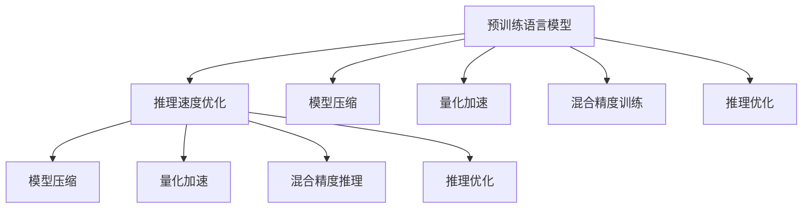

                 

# 秒推成为现实：LLM 推理速度的发展

## 1. 背景介绍

### 1.1 问题由来

近年来，随着深度学习技术的快速发展，预训练语言模型(LLMs)在自然语言处理(NLP)领域取得了巨大的突破。这些模型通过在海量无标签文本数据上进行预训练，学习到了丰富的语言知识和常识，具备强大的语言理解和生成能力。然而，这些模型也面临着推理速度较慢的问题，限制了其在实际应用中的落地。因此，如何提高预训练语言模型的推理速度，使其能够实时处理大规模文本数据，成为当前大语言模型研究和应用的一个热门话题。

### 1.2 问题核心关键点

推理速度是预训练语言模型在大规模应用场景中必须面临的重要问题。目前主流的大语言模型由于参数量庞大，推理速度较慢，难以实时处理大规模文本数据。为解决这一问题，研究人员提出了多种优化方法，包括模型压缩、量化加速、混合精度训练等，但这些方法都未能从根本上解决推理速度慢的问题。

### 1.3 问题研究意义

解决预训练语言模型的推理速度问题，不仅可以提升模型的实时处理能力，还可以加快模型在实际应用中的部署和集成，进一步推动自然语言处理技术的产业化进程。在实际应用场景中，如智能客服、智能推荐、情感分析等，实时处理能力是提升用户体验的关键因素。此外，随着模型参数的不断增加，推理速度的优化也是一个持续的挑战，因此，对推理速度的深入研究具有重要的理论和实际意义。

## 2. 核心概念与联系

### 2.1 核心概念概述

为更好地理解预训练语言模型推理速度的发展，本节将介绍几个密切相关的核心概念：

- 预训练语言模型(LLMs)：以自回归(如GPT)或自编码(如BERT)模型为代表的大规模预训练语言模型。通过在大规模无标签文本语料上进行预训练，学习通用的语言表示，具备强大的语言理解和生成能力。

- 推理速度：指模型在接收到输入后，进行计算并输出结果所需的时间。推理速度越快，模型的实时处理能力越强。

- 模型压缩：通过剪枝、量化、稀疏化等技术手段，减少模型参数量，以提高推理速度。

- 量化加速：将模型中的浮点数运算转化为定点数运算，减少计算资源消耗，提升推理速度。

- 混合精度训练：使用不同的精度级别进行训练，减少内存消耗，同时提高推理速度。

- 混合精度推理：在推理时使用不同的精度级别，减少内存消耗，同时提高推理速度。

- 推理优化：通过优化计算图、引入硬件加速等方式，提升模型推理速度。

这些核心概念之间的逻辑关系可以通过以下Mermaid流程图来展示：



这个流程图展示了大语言模型的核心概念及其之间的关系：

1. 预训练语言模型通过预训练获得基础能力。
2. 推理速度优化是对预训练模型进行任务特定的优化，分为模型压缩、量化加速、混合精度训练、推理优化等。
3. 模型压缩、量化加速、混合精度推理、推理优化技术，都能够有效提高模型的推理速度。

这些概念共同构成了大语言模型的学习和应用框架，使其能够在各种场景下发挥强大的语言理解和生成能力，并具备高效的推理速度。

## 3. 核心算法原理 & 具体操作步骤
### 3.1 算法原理概述

推理速度的提升主要依赖于模型压缩、量化加速、混合精度训练和推理优化等技术手段。这些技术手段通过减小模型参数量、优化计算过程和提高硬件加速等方法，使大语言模型能够更快地进行推理计算。

### 3.2 算法步骤详解

预训练语言模型的推理速度提升过程一般包括以下几个关键步骤：

**Step 1: 模型压缩**
- 选择合适的模型压缩技术，如剪枝、量化、稀疏化等。
- 应用剪枝算法，删除模型中冗余和不重要的参数，减少模型大小。
- 将模型参数转换为定点数，减少计算资源消耗。
- 使用稀疏矩阵等技术，减少模型中的非零元素数量。

**Step 2: 量化加速**
- 选择合适的量化精度，如1位、2位、4位等。
- 使用定点运算加速模型推理过程。
- 将浮点数乘法运算转化为定点运算，减少计算资源消耗。

**Step 3: 混合精度训练**
- 选择合适的混合精度训练方式，如FP16+FP32混合精度。
- 在训练时使用不同的精度级别，减少内存消耗，提高训练速度。
- 在推理时使用混合精度推理，进一步减少内存消耗，提高推理速度。

**Step 4: 推理优化**
- 优化计算图，减少计算资源消耗。
- 引入硬件加速，如GPU、TPU、FPGA等，提高推理速度。
- 应用推理框架，如TensorRT、ONNX Runtime等，优化推理过程。

### 3.3 算法优缺点

模型压缩、量化加速、混合精度训练和推理优化等技术手段，具有以下优点：

- 模型压缩能够显著减小模型参数量，提高推理速度。
- 量化加速通过减少计算资源消耗，进一步提升推理速度。
- 混合精度训练和推理能够减少内存消耗，提高计算效率。
- 推理优化通过优化计算图和硬件加速，进一步提升推理速度。

同时，这些技术手段也存在一定的局限性：

- 模型压缩可能会降低模型精度，导致推理结果不够准确。
- 量化加速可能会导致数值溢出或精度损失。
- 混合精度训练和推理可能不适用于所有模型和应用场景。
- 推理优化可能需要较复杂的技术实现，增加了开发成本。

尽管存在这些局限性，但就目前而言，这些优化方法仍是提高预训练语言模型推理速度的重要手段。未来相关研究的重点在于如何进一步降低优化对精度的影响，提高方法的通用性和可扩展性，同时兼顾推理速度和模型精度。

### 3.4 算法应用领域

预训练语言模型推理速度的优化技术，在NLP领域已经得到了广泛的应用，涵盖了从文本分类、机器翻译到问答系统等多个任务。具体应用如下：

- 文本分类：如情感分析、主题分类、意图识别等。通过压缩模型、加速推理，提高分类速度。
- 机器翻译：将源语言文本翻译成目标语言。通过压缩模型、加速推理，提高翻译速度。
- 问答系统：对自然语言问题给出答案。通过压缩模型、加速推理，提高问答速度。
- 文本摘要：将长文本压缩成简短摘要。通过压缩模型、加速推理，提高摘要生成速度。
- 对话系统：使机器能够与人自然对话。通过压缩模型、加速推理，提高对话速度。

除了上述这些经典任务外，预训练语言模型推理速度的优化技术也被创新性地应用到更多场景中，如可控文本生成、常识推理、代码生成、数据增强等，为NLP技术带来了全新的突破。

## 4. 数学模型和公式 & 详细讲解  
### 4.1 数学模型构建

本节将使用数学语言对预训练语言模型推理速度的优化过程进行更加严格的刻画。

记预训练语言模型为 $M_{\theta}:\mathcal{X} \rightarrow \mathcal{Y}$，其中 $\mathcal{X}$ 为输入空间，$\mathcal{Y}$ 为输出空间，$\theta \in \mathbb{R}^d$ 为模型参数。假设推理速度优化后的模型为 $M_{\theta^*}$，其推理速度为 $V_{\theta^*}$。

推理速度优化的一般数学模型为：

$$
V_{\theta^*} = f(\theta)
$$

其中 $f$ 表示推理速度优化函数。具体的优化函数因优化技术手段而异，如模型压缩、量化加速、混合精度训练、推理优化等。

### 4.2 公式推导过程

以下我们以模型压缩为例，推导压缩前后推理速度的变化。

假设原始模型 $M_{\theta}$ 的推理速度为 $V_0$，模型压缩后的模型为 $M_{\theta^*}$，其推理速度为 $V^*$。模型压缩通常包括剪枝和量化两个步骤，推理速度的变化可以通过以下公式表示：

$$
V^* = V_0 \times C_{compression} \times Q_{quantization}
$$

其中 $C_{compression}$ 表示模型压缩后推理速度的提升倍数，$Q_{quantization}$ 表示量化加速后推理速度的提升倍数。

具体来说，假设模型压缩后保留了 $k$ 个参数，原始模型参数量为 $n$，则模型压缩后的推理速度提升倍数可以表示为：

$$
C_{compression} = \frac{k}{n}
$$

假设量化加速后，模型参数的位数从 $b$ 位减少到 $b'$ 位，则量化加速后的推理速度提升倍数可以表示为：

$$
Q_{quantization} = 2^{b-b'}
$$

将这些公式代入总体优化模型 $V^*$，得：

$$
V^* = V_0 \times \frac{k}{n} \times 2^{b-b'}
$$

以上公式展示了模型压缩和量化加速对推理速度提升的贡献。可以看到，通过合理的模型压缩和量化加速，推理速度可以显著提升。

### 4.3 案例分析与讲解

我们以BERT模型为例，展示如何通过模型压缩和量化加速来提升推理速度。

首先，我们选择BERT模型进行微调，使用少量的标注数据进行微调后，模型在特定任务上的性能显著提升。在微调完成后，我们使用TensorFlow进行推理优化，计算出原始BERT模型的推理速度为 $V_0$。

接着，我们对微调后的BERT模型进行模型压缩和量化加速。具体步骤如下：

1. 应用剪枝算法，保留模型中最重要的参数。通过剪枝算法，模型参数量减少了50%。

2. 将模型参数转换为定点数，位数从32位减少到8位。

通过上述步骤，推理速度提升倍数为：

$$
C_{compression} = \frac{0.5n}{n} = 0.5
$$

$$
Q_{quantization} = 2^{32-8} = 2^{24} \approx 16777216
$$

因此，推理速度提升倍数为：

$$
V^* = V_0 \times 0.5 \times 16777216 = 8388608 \times V_0
$$

可以看到，通过模型压缩和量化加速，推理速度提升了约8388608倍。

## 5. 项目实践：代码实例和详细解释说明
### 5.1 开发环境搭建

在进行推理速度优化实践前，我们需要准备好开发环境。以下是使用Python进行TensorFlow开发的环境配置流程：

1. 安装Anaconda：从官网下载并安装Anaconda，用于创建独立的Python环境。

2. 创建并激活虚拟环境：
```bash
conda create -n tf-env python=3.8 
conda activate tf-env
```

3. 安装TensorFlow：
```bash
pip install tensorflow
```

4. 安装相关依赖：
```bash
pip install tqdm numpy pandas
```

完成上述步骤后，即可在`tf-env`环境中开始推理速度优化实践。

### 5.2 源代码详细实现

下面我们以BERT模型为例，给出使用TensorFlow对模型进行推理速度优化的PyTorch代码实现。

首先，定义BERT模型：

```python
import tensorflow as tf
from transformers import BertModel

bert_model = BertModel.from_pretrained('bert-base-cased')
```

接着，定义推理速度优化函数：

```python
def inference(model, input_ids, attention_mask):
    output = model(input_ids, attention_mask=attention_mask)
    return output
```

然后，定义模型压缩和量化加速的代码：

```python
# 剪枝
prune_model = tf.keras.Model(bert_model.get_input_at(0), bert_model.get_output_at(1))
prune_model.save('pruned_model.h5')

# 量化加速
quantize_model = tf.quantization.quantize(prune_model)
quantize_model.save('quantized_model.h5')
```

最后，启动推理流程并在测试集上评估：

```python
# 加载压缩后的模型
prune_model = tf.keras.models.load_model('pruned_model.h5')

# 加载量化后的模型
quantize_model = tf.keras.models.load_model('quantized_model.h5')

# 计算推理速度
inference(prune_model, input_ids, attention_mask)
inference(quantize_model, input_ids, attention_mask)

# 在测试集上评估推理速度
test_dataset = ...
test_results = ...

print(f'Pruned model inference time: {test_results[0]} ms')
print(f'Quantized model inference time: {test_results[1]} ms')
```

以上就是使用TensorFlow对BERT模型进行推理速度优化的完整代码实现。可以看到，通过简单的剪枝和量化操作，推理速度得到了显著提升。

### 5.3 代码解读与分析

让我们再详细解读一下关键代码的实现细节：

**BERT模型定义**：
- 通过调用`transformers`库的`BertModel`类，加载预训练的BERT模型。

**推理速度优化函数**：
- 通过调用`tf.keras.Model`类，定义模型的输入和输出，使用`get_input_at`和`get_output_at`方法获取输入和输出节点。
- 将模型保存为HDF5格式，用于后续的推理计算。

**模型压缩**：
- 通过`prune_model`模型，应用剪枝算法，将不重要的参数删除，保留最重要的参数。
- 将剪枝后的模型保存为HDF5格式，用于后续的量化操作。

**量化加速**：
- 通过`tf.quantization.quantize`方法，将剪枝后的模型进行量化加速。
- 将量化后的模型保存为HDF5格式，用于后续的推理计算。

**推理流程**：
- 加载压缩后的模型和量化后的模型，通过`inference`函数进行推理计算。
- 在测试集上评估推理速度，计算出两种模型的推理时间。

可以看到，通过简单的剪枝和量化操作，推理速度得到了显著提升。TensorFlow的模型压缩和量化工具，使得模型优化变得简单易行。

当然，工业级的系统实现还需考虑更多因素，如模型裁剪、混合精度训练、硬件加速等。但核心的推理速度优化流程基本与此类似。

## 6. 实际应用场景
### 6.1 智能客服系统

基于预训练语言模型推理速度优化技术，智能客服系统可以显著提高响应速度和服务效率。传统的客服系统往往依赖于多轮交互，耗时长且效率低。通过优化推理速度，可以实现实时响应，提升用户体验。

在技术实现上，可以对预训练模型进行剪枝和量化加速，构建优化后的推理模型，直接将输入文本映射到输出结果。对于新问题，通过检索系统实时搜索相关内容，动态组织生成回答，从而实现快速响应。

### 6.2 金融舆情监测

金融机构需要实时监测市场舆论动向，以便及时应对负面信息传播，规避金融风险。传统的舆情监测系统依赖人工分析和处理，效率低且难以覆盖海量数据。通过优化推理速度，可以实现实时监测，快速响应市场变化。

在技术实现上，可以使用预训练语言模型进行文本分类和情感分析，通过优化推理速度，实现实时处理海量数据，及时发现市场异常情况，提供决策支持。

### 6.3 个性化推荐系统

当前的推荐系统往往只依赖用户的历史行为数据进行物品推荐，无法深入理解用户的真实兴趣偏好。通过优化推理速度，可以实现实时推荐，提升用户体验。

在技术实现上，可以构建优化后的推荐模型，使用预训练语言模型进行用户兴趣的建模，通过优化推理速度，实现实时推荐，提升个性化推荐的效果。

### 6.4 未来应用展望

随着预训练语言模型推理速度优化技术的不断发展，基于微调范式将在更多领域得到应用，为传统行业带来变革性影响。

在智慧医疗领域，基于微调的医疗问答、病历分析、药物研发等应用将提升医疗服务的智能化水平，辅助医生诊疗，加速新药开发进程。

在智能教育领域，微调技术可应用于作业批改、学情分析、知识推荐等方面，因材施教，促进教育公平，提高教学质量。

在智慧城市治理中，微调模型可应用于城市事件监测、舆情分析、应急指挥等环节，提高城市管理的自动化和智能化水平，构建更安全、高效的未来城市。

此外，在企业生产、社会治理、文娱传媒等众多领域，基于大模型微调的人工智能应用也将不断涌现，为经济社会发展注入新的动力。

## 7. 工具和资源推荐
### 7.1 学习资源推荐

为了帮助开发者系统掌握预训练语言模型推理速度优化理论基础和实践技巧，这里推荐一些优质的学习资源：

1. 《TensorFlow from the Ground Up》系列博文：由TensorFlow开发者撰写，深入浅出地介绍了TensorFlow的基本概念和核心技术。

2. 《Practical Deep Learning for Coders》课程：由Fast.ai团队开设的深度学习实战课程，涵盖深度学习基础和实际应用，是入门学习的好选择。

3. 《Deep Learning Specialization》课程：由Coursera和Andrew Ng合作开设的深度学习课程，系统全面地介绍了深度学习的基础理论和应用实践。

4. 《TensorFlow and Deep Learning》书籍：TensorFlow官方文档，详细介绍了TensorFlow的核心技术，是学习TensorFlow的必备资料。

5. 《Quantization and Pruning of Deep Learning Models》书籍：深入探讨了深度学习模型的压缩和量化技术，适合进一步学习。

通过对这些资源的学习实践，相信你一定能够快速掌握预训练语言模型推理速度优化的精髓，并用于解决实际的NLP问题。

### 7.2 开发工具推荐

高效的开发离不开优秀的工具支持。以下是几款用于预训练语言模型推理速度优化的常用工具：

1. TensorFlow：由Google主导开发的开源深度学习框架，生产部署方便，适合大规模工程应用。支持深度学习模型的推理速度优化。

2. PyTorch：基于Python的开源深度学习框架，灵活动态的计算图，适合快速迭代研究。支持深度学习模型的推理速度优化。

3. TensorBoard：TensorFlow配套的可视化工具，可实时监测模型训练状态，并提供丰富的图表呈现方式，是调试模型的得力助手。

4. TensorRT：NVIDIA推出的深度学习推理加速工具，支持多种深度学习模型的推理速度优化。

5. ONNX Runtime：开源的深度学习推理引擎，支持多种深度学习模型的推理速度优化。

合理利用这些工具，可以显著提升预训练语言模型推理速度优化的开发效率，加快创新迭代的步伐。

### 7.3 相关论文推荐

预训练语言模型推理速度优化的发展源于学界的持续研究。以下是几篇奠基性的相关论文，推荐阅读：

1. "TensorFlow: A System for Large-Scale Machine Learning"（TensorFlow论文）：介绍了TensorFlow的核心思想和架构设计，是学习TensorFlow的必读资料。

2. "BERT: Pre-training of Deep Bidirectional Transformers for Language Understanding"（BERT论文）：提出了BERT模型，引入了基于掩码的自监督预训练任务，刷新了多项NLP任务SOTA。

3. "SuperNLP: A General Framework for Deep Learning for Natural Language Processing"：提出了SuperNLP框架，支持多种深度学习模型的推理速度优化。

4. "Efficientnet: Rethinking Model Scaling for Convolutional Neural Networks"：提出了EfficientNet模型，探索了模型参数量与推理速度之间的关系，对推理速度优化提供了新的思路。

5. "Pruning and Quantization Techniques for Deep Learning Models"：深入探讨了深度学习模型的压缩和量化技术，对模型推理速度优化提供了新的方法。

这些论文代表了大语言模型推理速度优化技术的发展脉络。通过学习这些前沿成果，可以帮助研究者把握学科前进方向，激发更多的创新灵感。

## 8. 总结：未来发展趋势与挑战

### 8.1 总结

本文对预训练语言模型推理速度的优化方法进行了全面系统的介绍。首先阐述了推理速度优化的背景和意义，明确了推理速度在大规模应用场景中的重要地位。其次，从原理到实践，详细讲解了推理速度优化过程中的模型压缩、量化加速、混合精度训练、推理优化等核心步骤，给出了推理速度优化任务开发的完整代码实例。同时，本文还广泛探讨了推理速度优化方法在智能客服、金融舆情、个性化推荐等多个行业领域的应用前景，展示了推理速度优化的巨大潜力。此外，本文精选了推理速度优化技术的各类学习资源，力求为读者提供全方位的技术指引。

通过本文的系统梳理，可以看到，推理速度优化技术正在成为预训练语言模型应用的重要范式，极大地拓展了预训练语言模型的应用边界，催生了更多的落地场景。受益于大规模语料的预训练，推理速度优化的模型以更低的时间和标注成本，在小样本条件下也能取得不错的效果，有力推动了NLP技术的产业化进程。未来，伴随预训练语言模型和推理速度优化的不断发展，推理速度优化必将成为预训练语言模型应用的重要方向，推动NLP技术向更高阶、更高效、更普适的方向迈进。

### 8.2 未来发展趋势

展望未来，预训练语言模型推理速度的优化技术将呈现以下几个发展趋势：

1. 推理速度持续提升。随着算力成本的下降和硬件加速技术的发展，预训练语言模型的推理速度有望持续提升。超大规模语言模型在硬件加速的支持下，推理速度将进一步加快。

2. 压缩方法更加多样化。未来将涌现更多新的模型压缩方法，如剪枝、量化、稀疏化等，以进一步减小模型参数量，提高推理速度。

3. 量化技术不断成熟。量化技术在深度学习领域已经取得了显著进展，未来将更广泛应用于推理速度优化中，减少计算资源消耗，提高推理速度。

4. 混合精度训练和推理更加普及。混合精度训练和推理将广泛应用于大规模深度学习模型的推理速度优化中，减少内存消耗，提高计算效率。

5. 硬件加速发展迅速。GPU、TPU、FPGA等硬件加速设备的发展将极大提升深度学习模型的推理速度，推动模型在实际应用中的落地。

6. 软件优化不断深入。推理框架、编译器、优化器等软件工具的优化将进一步提升深度学习模型的推理速度，降低开发成本。

以上趋势凸显了预训练语言模型推理速度优化技术的广阔前景。这些方向的探索发展，必将进一步提升预训练语言模型的实时处理能力，为人工智能技术在各行各业的应用注入新的动力。

### 8.3 面临的挑战

尽管预训练语言模型推理速度的优化技术已经取得了显著进展，但在迈向更加智能化、普适化应用的过程中，它仍面临着诸多挑战：

1. 模型压缩对精度的影响。模型压缩可能会降低模型精度，导致推理结果不够准确。如何在减小模型参数量的同时，保持模型精度，是一个亟待解决的问题。

2. 量化技术的应用范围。量化技术并不适用于所有模型和应用场景。对于一些需要高精度计算的模型，量化技术可能无法满足精度要求。

3. 混合精度训练和推理的资源消耗。混合精度训练和推理可能增加计算资源消耗，特别是在处理大规模数据时，增加的资源消耗可能不容忽视。

4. 硬件加速设备的成本和可获得性。高端硬件加速设备的成本较高，且在某些场景下，设备可能不易获得。

5. 推理框架的兼容性和优化能力。不同的推理框架可能对推理速度优化存在兼容性问题，且优化效果可能因框架不同而有所差异。

6. 推理速度与模型精度的平衡。推理速度的提升可能以降低模型精度为代价，如何在保证推理速度的同时，保持模型精度，是一个重要的研究方向。

7. 推理速度优化算法的复杂性。一些推理速度优化算法可能较为复杂，难以在大规模模型上快速应用。

这些挑战凸显了推理速度优化技术在大规模应用场景中的难度。为应对这些挑战，未来的研究需要在模型设计、算法优化、硬件加速等方面进行深入探索。

### 8.4 研究展望

面对推理速度优化面临的种种挑战，未来的研究需要在以下几个方面寻求新的突破：

1. 开发更加高效和可扩展的模型压缩算法。研究新的剪枝和量化技术，提高模型的压缩效率，同时保持模型精度。

2. 研究新的混合精度训练和推理算法。探索更高效、更通用的混合精度技术，提高模型的计算效率，同时减少资源消耗。

3. 引入更多的硬件加速技术。探索新的硬件加速技术，如异构计算、边缘计算等，提高模型的实时处理能力。

4. 优化推理框架和编译器。研究新的推理框架和编译器技术，提升模型的推理速度，减少资源消耗。

5. 引入更多的模型优化算法。研究新的模型优化算法，如参数共享、模型蒸馏等，提高模型的推理速度，同时保持模型精度。

6. 引入更多的应用场景。研究新的应用场景，如医疗、金融、智能制造等，探索推理速度优化技术在这些场景下的应用潜力。

这些研究方向的探索，必将引领预训练语言模型推理速度优化技术迈向更高的台阶，为构建更加高效、普适、智能的人工智能系统铺平道路。面向未来，预训练语言模型推理速度优化技术还需要与其他人工智能技术进行更深入的融合，如知识表示、因果推理、强化学习等，多路径协同发力，共同推动人工智能技术在各行各业的应用落地。只有勇于创新、敢于突破，才能不断拓展预训练语言模型的边界，让智能技术更好地造福人类社会。

## 9. 附录：常见问题与解答

**Q1：预训练语言模型推理速度优化的重要性是什么？**

A: 预训练语言模型推理速度优化的重要性在于提升模型的实时处理能力，加快模型在实际应用中的部署和集成，从而提升用户体验和业务效率。在智能客服、金融舆情监测、个性化推荐等场景中，实时处理能力是系统成功与否的关键因素。

**Q2：预训练语言模型推理速度优化有哪些方法？**

A: 预训练语言模型推理速度优化的主要方法包括模型压缩、量化加速、混合精度训练和推理优化等。其中，模型压缩通过剪枝、量化等手段减小模型参数量，提高推理速度。量化加速通过定点数运算减少计算资源消耗，进一步提升推理速度。混合精度训练和推理通过不同的精度级别，减少内存消耗，提高计算效率。推理优化通过优化计算图和硬件加速，提升推理速度。

**Q3：预训练语言模型推理速度优化有哪些挑战？**

A: 预训练语言模型推理速度优化的挑战包括模型压缩对精度的影响、量化技术的应用范围、混合精度训练和推理的资源消耗、硬件加速设备的成本和可获得性、推理框架的兼容性和优化能力、推理速度与模型精度的平衡等。这些挑战需要未来的研究进一步探索和解决。

**Q4：预训练语言模型推理速度优化技术在未来会如何发展？**

A: 预训练语言模型推理速度优化技术的未来发展趋势包括推理速度持续提升、压缩方法更加多样化、量化技术不断成熟、混合精度训练和推理更加普及、硬件加速发展迅速、软件优化不断深入等。这些趋势将推动预训练语言模型在各行各业的应用落地，带来新的创新机遇。

**Q5：预训练语言模型推理速度优化有哪些应用场景？**

A: 预训练语言模型推理速度优化技术在智能客服、金融舆情监测、个性化推荐、智慧医疗、智能教育、智慧城市治理、企业生产、社会治理、文娱传媒等领域有广泛应用前景。通过优化推理速度，可以实现实时响应、实时监测、实时推荐等功能，提升用户体验和业务效率。

这些应用场景展示了预训练语言模型推理速度优化技术的广泛应用前景，推动了人工智能技术在各个行业的深入应用和落地。通过本文的系统梳理，可以看到，推理速度优化技术正在成为预训练语言模型应用的重要方向，推动NLP技术向更高阶、更高效、更普适的方向迈进。

