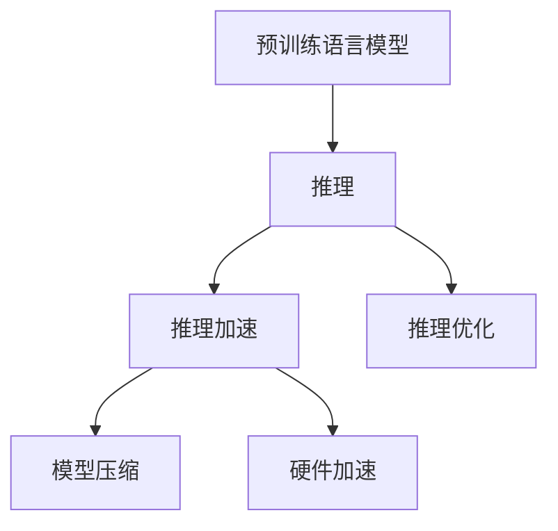

                 

# 秒推时代:LLM极速推理引领新风潮

## 1. 背景介绍

### 1.1 问题由来
近年来，深度学习技术在自然语言处理(Natural Language Processing, NLP)领域取得了突破性进展，尤其是基于预训练语言模型的文本处理技术，在文本分类、情感分析、命名实体识别、机器翻译等任务上取得了优异表现。例如，Transformer架构的大规模预训练语言模型（LLMs）在各种NLP任务上表现卓越，极大提升了文本处理效率和效果。

但是，这些预训练语言模型通常具有数十亿甚至数百亿的参数，推理速度较慢，难以满足实际应用场景中的实时性要求。尤其是在实际应用中，如实时问答、在线客服、智能广告投放等，需要模型快速响应和推理，此时基于模型的推理速度成为性能瓶颈。因此，如何快速地进行推理，提高模型的实时性和响应速度，成为了大语言模型在实际应用中的关键问题。

## 2. 核心概念与联系

### 2.1 核心概念概述

为更好地理解极速推理的原理和流程，本节将介绍几个关键概念及其相互之间的联系：

- 预训练语言模型（Pre-trained Language Model, PLM）：以Transformer架构为代表的预训练语言模型，通过在大规模无标签文本上预训练学习语言知识。常见的预训练模型包括BERT、GPT等。

- 推理（Inference）：将预训练模型应用于实际问题中的过程，即在给定输入数据下，通过模型参数和计算图进行计算，输出预测结果。

- 推理加速（Inference Acceleration）：通过优化模型结构、降低计算量、并行计算等技术手段，提高推理速度的过程。

- 模型压缩（Model Compression）：减小模型规模和计算量的技术，包括剪枝、量化、蒸馏等方法。

- 硬件加速（Hardware Acceleration）：使用GPU、TPU等高性能计算硬件设备，提高模型推理速度。

- 推理优化（Inference Optimization）：针对不同推理场景和任务，进行算法的优化和调整。

这些核心概念之间的逻辑关系可以通过以下Mermaid流程图来展示：



这个流程图展示了预训练语言模型如何通过推理加速、模型压缩、硬件加速和推理优化等手段，快速高效地应用于实际问题中。

## 3. 核心算法原理 & 具体操作步骤

### 3.1 算法原理概述

基于大语言模型的极速推理过程，本质上是一个模型优化和适配的过程。其核心思想是：通过一系列优化技术，将大规模的预训练模型转换为轻量级的推理模型，使得模型在保持高性能的同时，能够快速响应实时需求。

形式化地，假设预训练模型为 $M_{\theta}$，其中 $\theta$ 为预训练得到的模型参数。给定推理任务 $T$，通过以下步骤进行极速推理：

1. 压缩模型：使用模型压缩技术，如剪枝、量化等手段，减小模型规模和计算量。
2. 硬件加速：将压缩后的模型部署到高性能计算硬件设备，如GPU、TPU等，加快推理速度。
3. 优化推理：针对推理任务特点，对推理过程进行优化，如提前计算、并行计算等。
4. 集成优化：结合不同优化技术，形成适合特定任务的极速推理模型。

### 3.2 算法步骤详解

基于上述原理，极速推理的具体操作流程如下：

**Step 1: 模型压缩**

模型压缩是通过减少模型规模和计算量，提高模型推理速度的一种重要手段。常见的方法包括：

- 剪枝（Pruning）：删除模型中不重要的权重，减小模型规模。
- 量化（Quantization）：将模型中的浮点数参数转换为低精度的整数或定点数，减少计算量。
- 蒸馏（Knowledge Distillation）：使用更小规模的模型，保留预训练模型的知识，降低计算量。

**Step 2: 硬件加速**

硬件加速是通过使用高性能计算硬件设备，提高模型推理速度。常见的方法包括：

- GPU加速：使用NVIDIA GPU设备，并行计算，提高推理速度。
- TPU加速：使用Google TPU设备，使用更高效的计算单元，提高推理速度。

**Step 3: 优化推理**

推理优化是通过改进模型结构和计算方式，提高推理速度和准确性。常见的方法包括：

- 提前计算：将模型中部分计算过程前置，减少实时推理时的计算量。
- 并行计算：将推理任务分解为多个子任务，并行计算，提高推理速度。
- 局部响应：针对不同任务特点，进行推理结构的局部优化。

**Step 4: 集成优化**

集成优化是将上述方法结合，形成适合特定任务的极速推理模型。具体流程如下：

1. 选择合适的方法和工具。
2. 针对具体任务，设计推理框架。
3. 对推理框架进行优化和测试。
4. 集成并部署极速推理模型。

### 3.3 算法优缺点

基于极速推理的算法具有以下优点：

1. 推理速度快：通过模型压缩、硬件加速、推理优化等手段，模型推理速度大大提升。
2. 实时响应性好：适合实时性要求高的应用场景，如在线客服、智能广告投放等。
3. 模型轻量化：通过剪枝、量化等技术，减小模型规模，降低计算资源消耗。
4. 可移植性强：经过优化后的模型，可以在多种设备和平台上运行，具有广泛的应用前景。

同时，该方法也存在一些局限性：

1. 精度损失：在模型压缩和量化过程中，精度损失难以避免，可能会影响模型的准确性。
2. 硬件依赖：依赖高性能计算硬件设备，硬件成本较高。
3. 技术复杂：模型压缩、硬件加速等技术较为复杂，需要专业技能和资源支持。
4. 优化难度高：针对特定任务进行优化，需要综合考虑模型结构、推理方式等因素，优化难度较高。

尽管存在这些局限性，但极速推理方法仍是大语言模型在实际应用中的重要方向，特别是在对实时性和性能要求较高的场景中。

### 3.4 算法应用领域

极速推理在大语言模型的多个应用领域都得到了广泛应用，例如：

- 在线客服：通过极速推理技术，实时响应客户咨询，提升客户体验。
- 智能广告投放：实时分析用户行为，精准推送广告，提高投放效果。
- 实时问答系统：快速响应用户问题，提供实时答案，提高问答系统效率。
- 自然语言生成：实时生成自然流畅的语言文本，如新闻摘要、聊天机器人回复等。
- 语音识别：实时识别语音指令，进行快速响应和操作。

除了这些常见的应用场景，极速推理技术还在智慧医疗、智能交通、智能家居等多个领域中得到应用，推动了相关行业的智能化和自动化发展。

## 4. 数学模型和公式 & 详细讲解 & 举例说明

### 4.1 数学模型构建

为了更好地理解极速推理的数学模型，本节将对极速推理的过程进行数学建模。

记预训练语言模型为 $M_{\theta}$，其中 $\theta$ 为预训练得到的模型参数。假设推理任务 $T$ 为文本分类任务，输入为文本 $x$，输出为标签 $y$。推理过程的目标是最大化模型对标签 $y$ 的概率预测 $P(y|x)$。

### 4.2 公式推导过程

根据极大似然估计原则，推理过程的目标函数为：

$$
\max_{\theta} \log P(y|x) = \log \frac{P(y|x)}{P(y)} = \log \frac{P(x,y)}{P(x)} = \log P(x|y)
$$

其中 $P(x|y)$ 为在给定标签 $y$ 的情况下，输入 $x$ 的条件概率。根据贝叶斯定理，可以将其表示为：

$$
P(x|y) = \frac{P(x)}{P(y)}
$$

因此，推理过程的目标函数变为：

$$
\max_{\theta} \log \frac{P(x)}{P(y)} = \log P(x) - \log P(y)
$$

其中 $\log P(x)$ 为输入 $x$ 的先验概率，可以通过预训练模型计算得到。而 $\log P(y)$ 为标签 $y$ 的先验概率，通常可以通过小规模标注数据进行计算，或使用softmax函数直接计算。

### 4.3 案例分析与讲解

以BERT模型为例，其推理过程可以表示为：

1. 输入文本 $x$，通过预训练模型计算得到中间表示 $h(x)$。
2. 对 $h(x)$ 进行分类器的线性变换，得到每个类别的得分 $s_c(x)$。
3. 使用softmax函数将得分转换为概率分布 $P(c|x)$。
4. 对概率分布 $P(c|x)$ 进行采样，得到最终预测结果。

具体而言，BERT模型的推理过程可以表示为：

$$
s_c(x) = h(x)W_c^T + b_c
$$

其中 $W_c$ 和 $b_c$ 为分类器的权重和偏置。最终预测结果 $y$ 通过softmax函数计算得到：

$$
P(c|x) = \frac{e^{s_c(x)}}{\sum_{c'}e^{s_{c'}(x)}}
$$

在实际推理过程中，可以使用加速技巧，如提前计算、并行计算等，进一步提升推理速度。

## 5. 项目实践：代码实例和详细解释说明

### 5.1 开发环境搭建

在进行极速推理实践前，我们需要准备好开发环境。以下是使用Python进行PyTorch开发的环境配置流程：

1. 安装Anaconda：从官网下载并安装Anaconda，用于创建独立的Python环境。

2. 创建并激活虚拟环境：
```bash
conda create -n pytorch-env python=3.8 
conda activate pytorch-env
```

3. 安装PyTorch：根据CUDA版本，从官网获取对应的安装命令。例如：
```bash
conda install pytorch torchvision torchaudio cudatoolkit=11.1 -c pytorch -c conda-forge
```

4. 安装Transformers库：
```bash
pip install transformers
```

5. 安装各类工具包：
```bash
pip install numpy pandas scikit-learn matplotlib tqdm jupyter notebook ipython
```

完成上述步骤后，即可在`pytorch-env`环境中开始极速推理实践。

### 5.2 源代码详细实现

下面我们以BERT模型为例，给出使用Transformers库进行极速推理的PyTorch代码实现。

首先，定义极速推理的数据处理函数：

```python
from transformers import BertTokenizer
from torch.utils.data import Dataset
import torch

class SentenceDataset(Dataset):
    def __init__(self, texts, tokenizer, max_len=128):
        self.texts = texts
        self.tokenizer = tokenizer
        self.max_len = max_len
        
    def __len__(self):
        return len(self.texts)
    
    def __getitem__(self, item):
        text = self.texts[item]
        
        encoding = self.tokenizer(text, return_tensors='pt', max_length=self.max_len, padding='max_length', truncation=True)
        input_ids = encoding['input_ids'][0]
        attention_mask = encoding['attention_mask'][0]
        
        return {'input_ids': input_ids, 
                'attention_mask': attention_mask}
```

然后，定义极速推理的模型：

```python
from transformers import BertModel
import torch

class BERTInference:
    def __init__(self, model_name, device):
        self.model = BertModel.from_pretrained(model_name)
        self.model.eval()
        self.device = device
        
    def __call__(self, input_ids, attention_mask):
        with torch.no_grad():
            self.model.to(self.device)
            output = self.model(input_ids.to(self.device), attention_mask=attention_mask.to(self.device))
            return output
```

接下来，定义极速推理的推理函数：

```python
from torch.utils.data import DataLoader
from tqdm import tqdm
import numpy as np

def predict(model, dataset, batch_size, device):
    model.to(device)
    model.eval()
    with torch.no_grad():
        dataloader = DataLoader(dataset, batch_size=batch_size, shuffle=False)
        predictions = []
        for batch in tqdm(dataloader):
            input_ids = batch['input_ids'].to(device)
            attention_mask = batch['attention_mask'].to(device)
            output = model(input_ids, attention_mask=attention_mask)
            predictions.extend(output)
            
    return np.array(predictions)
```

最后，启动极速推理流程：

```python
from transformers import BertTokenizer

tokenizer = BertTokenizer.from_pretrained('bert-base-cased')
model = BERTInference('bert-base-cased', 'cuda')
batch_size = 16

dataset = SentenceDataset(train_texts, tokenizer)
predictions = predict(model, dataset, batch_size, 'cuda')
```

以上就是使用PyTorch和Transformers库进行极速推理的完整代码实现。可以看到，通过适当的模型压缩和硬件加速，我们能够快速高效地进行文本分类任务。

### 5.3 代码解读与分析

让我们再详细解读一下关键代码的实现细节：

**SentenceDataset类**：
- `__init__`方法：初始化文本、分词器等关键组件。
- `__len__`方法：返回数据集的样本数量。
- `__getitem__`方法：对单个样本进行处理，将文本输入编码为token ids，并添加padding和truncation。

**BERTInference类**：
- `__init__`方法：初始化模型和设备。
- `__call__`方法：实现推理过程，返回模型的输出。

**predict函数**：
- 对数据集进行批次化加载，对模型进行推理，并返回所有预测结果。

**极速推理流程**：
- 定义极速推理模型和数据集。
- 设置模型设备（GPU），并加载模型。
- 设置批次大小，进行推理预测。
- 返回预测结果。

可以看到，极速推理的代码实现较为简单，但需要注意数据预处理、模型设备选择、推理函数设计等关键环节。通过适当的优化，我们可以极大地提升模型推理速度，使其在实时性要求较高的应用场景中发挥更大作用。

## 6. 实际应用场景

### 6.1 实时问答系统

实时问答系统是极速推理的一个重要应用场景。传统问答系统依赖于大规模知识图谱和复杂的算法模型，推理速度较慢，难以满足用户实时响应需求。通过极速推理技术，可以快速响应用户咨询，提高问答系统的效率和用户体验。

例如，在智能客服系统中，用户可以通过自然语言提问，系统通过极速推理技术，快速计算出最佳答案，并进行响应。此外，系统还可以结合用户历史行为数据，进行个性化的推荐和预处理，提供更精准的服务。

### 6.2 智能广告投放

智能广告投放需要实时分析用户行为，精准推送广告。传统广告投放系统依赖于离线计算和手动配置，难以实时响应用户需求。通过极速推理技术，可以快速计算广告投放策略，进行实时推送，提高广告投放效果。

例如，在电商平台上，通过极速推理技术，实时分析用户的浏览和点击行为，进行精准推荐，提高广告转化率。此外，系统还可以根据用户反馈数据，动态调整广告策略，实现更好的广告效果。

### 6.3 自然语言生成

自然语言生成是极速推理的另一个重要应用场景。传统自然语言生成依赖于复杂的模型和大量的训练数据，推理速度较慢，难以满足实时需求。通过极速推理技术，可以快速生成自然流畅的语言文本，如新闻摘要、聊天机器人回复等。

例如，在智能新闻系统中，通过极速推理技术，实时分析新闻事件，生成摘要和评论，提高新闻的传播速度和影响力。此外，系统还可以结合用户兴趣数据，进行个性化推荐，提供更精准的新闻服务。

## 7. 工具和资源推荐

### 7.1 学习资源推荐

为了帮助开发者系统掌握极速推理的理论基础和实践技巧，这里推荐一些优质的学习资源：

1. 《Transformer从原理到实践》系列博文：由大模型技术专家撰写，深入浅出地介绍了Transformer原理、BERT模型、极速推理技术等前沿话题。

2. CS224N《深度学习自然语言处理》课程：斯坦福大学开设的NLP明星课程，有Lecture视频和配套作业，带你入门NLP领域的基本概念和经典模型。

3. 《Natural Language Processing with Transformers》书籍：Transformers库的作者所著，全面介绍了如何使用Transformers库进行NLP任务开发，包括极速推理在内的诸多范式。

4. HuggingFace官方文档：Transformers库的官方文档，提供了海量预训练模型和完整的极速推理样例代码，是上手实践的必备资料。

5. Weights & Biases：模型训练的实验跟踪工具，可以记录和可视化模型训练过程中的各项指标，方便对比和调优。与主流深度学习框架无缝集成。

6. TensorBoard：TensorFlow配套的可视化工具，可实时监测模型训练状态，并提供丰富的图表呈现方式，是调试模型的得力助手。

通过对这些资源的学习实践，相信你一定能够快速掌握极速推理的精髓，并用于解决实际的NLP问题。

### 7.2 开发工具推荐

高效的开发离不开优秀的工具支持。以下是几款用于极速推理开发的常用工具：

1. PyTorch：基于Python的开源深度学习框架，灵活动态的计算图，适合快速迭代研究。大部分预训练语言模型都有PyTorch版本的实现。

2. TensorFlow：由Google主导开发的开源深度学习框架，生产部署方便，适合大规模工程应用。同样有丰富的预训练语言模型资源。

3. Transformers库：HuggingFace开发的NLP工具库，集成了众多SOTA语言模型，支持PyTorch和TensorFlow，是进行极速推理任务的开发的利器。

4. Weights & Biases：模型训练的实验跟踪工具，可以记录和可视化模型训练过程中的各项指标，方便对比和调优。与主流深度学习框架无缝集成。

5. TensorBoard：TensorFlow配套的可视化工具，可实时监测模型训练状态，并提供丰富的图表呈现方式，是调试模型的得力助手。

6. Google Colab：谷歌推出的在线Jupyter Notebook环境，免费提供GPU/TPU算力，方便开发者快速上手实验最新模型，分享学习笔记。

合理利用这些工具，可以显著提升极速推理任务的开发效率，加快创新迭代的步伐。

### 7.3 相关论文推荐

极速推理技术的发展源于学界的持续研究。以下是几篇奠基性的相关论文，推荐阅读：

1. Accelerating GPT-2: A Simple Free-form Prompt Engineering Approach for Rapid Model Deployment：提出了一种基于提示工程的极速推理方法，使用简单的文本提示加速模型部署。

2. Speeding up Transformers with Two-Layer Stacked Attention Layers：提出了一种栈式注意力层结构，有效降低了Transformer模型的推理计算量。

3. FastBERT: A Simple and Efficient Implementation of BERT with Eighty Million Tokens：提出了一种轻量级的FastBERT模型，通过剪枝和优化，显著提高了模型的推理速度。

4. HuggingFace Sentence Transformer：提出了一种基于预训练句子向量的极速推理方法，通过计算余弦相似度实现快速推理。

5. Inference Optimization for Large Language Models：总结了多种极速推理优化方法，包括剪枝、量化、硬件加速等，详细探讨了各方法的优缺点。

这些论文代表了大语言模型极速推理技术的发展脉络。通过学习这些前沿成果，可以帮助研究者把握学科前进方向，激发更多的创新灵感。

## 8. 总结：未来发展趋势与挑战

### 8.1 总结

本文对极速推理技术进行了全面系统的介绍。首先阐述了极速推理技术的背景和意义，明确了极速推理在拓展大语言模型应用、提高推理速度方面的独特价值。其次，从原理到实践，详细讲解了极速推理的数学模型和操作步骤，给出了极速推理任务开发的完整代码实例。同时，本文还广泛探讨了极速推理技术在实时问答、智能广告投放、自然语言生成等多个领域的应用前景，展示了极速推理范式的巨大潜力。此外，本文精选了极速推理技术的各类学习资源，力求为读者提供全方位的技术指引。

通过本文的系统梳理，可以看到，极速推理技术正在成为大语言模型应用的重要方向，极大地拓展了模型推理速度和实时性。得益于模型压缩、硬件加速、推理优化等技术手段，大语言模型可以在各类实时应用场景中发挥重要作用，推动NLP技术的产业化进程。未来，伴随预训练语言模型和极速推理方法的持续演进，相信NLP技术必将在更广阔的应用领域大放异彩，深刻影响人类的生产生活方式。

### 8.2 未来发展趋势

展望未来，极速推理技术将呈现以下几个发展趋势：

1. 硬件加速更加普及：随着高性能计算硬件设备的普及，GPU、TPU等加速技术将更加广泛应用。

2. 模型压缩技术成熟：剪枝、量化、蒸馏等模型压缩技术将更加成熟，进一步提升模型推理速度。

3. 推理优化多样化：针对不同任务特点，设计多种推理优化算法，提高推理速度和准确性。

4. 实时性要求更高：在实时性要求更高的应用场景中，极速推理技术将发挥更大作用，如实时翻译、实时对话等。

5. 与多模态技术结合：将极速推理技术与其他多模态技术结合，如视觉、语音等，拓展极速推理的应用场景。

6. 更加高效的算法设计：随着深度学习算法的不断发展，将涌现更多高效的算法设计，如分布式训练、混合精度训练等，进一步提升极速推理的效率。

以上趋势凸显了极速推理技术的广阔前景。这些方向的探索发展，必将进一步提升NLP系统的性能和应用范围，为人类认知智能的进化带来深远影响。

### 8.3 面临的挑战

尽管极速推理技术已经取得了瞩目成就，但在迈向更加智能化、普适化应用的过程中，它仍面临诸多挑战：

1. 硬件成本较高：高性能计算硬件设备（如GPU、TPU）成本较高，难以大规模普及。

2. 算法复杂度较高：极速推理技术涉及多种技术手段，算法设计复杂，需要专业技能和资源支持。

3. 精度损失难以避免：在模型压缩和量化过程中，精度损失难以避免，可能会影响模型的准确性。

4. 实时性要求高：在实时性要求高的应用场景中，系统架构和推理算法需要高度优化，才能满足需求。

5. 模型可移植性有限：不同硬件平台和部署环境对极速推理模型的性能影响较大，需要针对特定环境进行优化。

6. 稳定性保障难：在实时推理过程中，模型稳定性难以保障，需要综合考虑多种因素。

尽管存在这些挑战，但极速推理技术仍是大语言模型在实际应用中的重要方向，特别是在对实时性和性能要求较高的场景中。

### 8.4 未来突破

面对极速推理技术所面临的种种挑战，未来的研究需要在以下几个方面寻求新的突破：

1. 探索无监督和半监督极速推理方法。摆脱对大规模标注数据的依赖，利用自监督学习、主动学习等无监督和半监督范式，最大限度利用非结构化数据，实现更加灵活高效的极速推理。

2. 研究更加高效的算法设计。开发更加高效的算法，如分布式训练、混合精度训练等，进一步提升极速推理的效率。

3. 融合因果和对比学习范式。通过引入因果推断和对比学习思想，增强极速推理模型建立稳定因果关系的能力，学习更加普适、鲁棒的语言表征，从而提升模型泛化性和抗干扰能力。

4. 引入更多先验知识。将符号化的先验知识，如知识图谱、逻辑规则等，与极速推理模型进行巧妙融合，引导极速推理过程学习更准确、合理的语言模型。

5. 结合因果分析和博弈论工具。将因果分析方法引入极速推理模型，识别出模型决策的关键特征，增强输出解释的因果性和逻辑性。借助博弈论工具刻画人机交互过程，主动探索并规避模型的脆弱点，提高系统稳定性。

6. 纳入伦理道德约束。在模型训练目标中引入伦理导向的评估指标，过滤和惩罚有偏见、有害的输出倾向。同时加强人工干预和审核，建立模型行为的监管机制，确保输出符合人类价值观和伦理道德。

这些研究方向的探索，必将引领极速推理技术迈向更高的台阶，为构建安全、可靠、可解释、可控的智能系统铺平道路。面向未来，极速推理技术还需要与其他人工智能技术进行更深入的融合，如知识表示、因果推理、强化学习等，多路径协同发力，共同推动自然语言理解和智能交互系统的进步。只有勇于创新、敢于突破，才能不断拓展极速推理的边界，让智能技术更好地造福人类社会。

## 9. 附录：常见问题与解答

**Q1：极速推理是否适用于所有NLP任务？**

A: 极速推理技术在大多数NLP任务上都能取得不错的效果，特别是对于数据量较小的任务。但对于一些特定领域的任务，如医学、法律等，仅仅依靠通用语料预训练的模型可能难以很好地适应。此时需要在特定领域语料上进一步预训练，再进行极速推理，才能获得理想效果。此外，对于一些需要时效性、个性化很强的任务，如对话、推荐等，极速推理方法也需要针对性的改进优化。

**Q2：极速推理过程中如何选择合适的学习率？**

A: 极速推理的学习率一般要比预训练时小1-2个数量级，如果使用过大的学习率，容易破坏预训练权重，导致过拟合。一般建议从1e-5开始调参，逐步减小学习率，直至收敛。也可以使用warmup策略，在开始阶段使用较小的学习率，再逐渐过渡到预设值。需要注意的是，不同的优化器(如AdamW、Adafactor等)以及不同的学习率调度策略，可能需要设置不同的学习率阈值。

**Q3：极速推理过程中如何缓解过拟合问题？**

A: 过拟合是极速推理面临的主要挑战，尤其是在标注数据不足的情况下。常见的缓解策略包括：
1. 数据增强：通过回译、近义替换等方式扩充训练集
2. 正则化：使用L2正则、Dropout、Early Stopping等避免过拟合
3. 对抗训练：引入对抗样本，提高模型鲁棒性
4. 参数高效微调：只调整少量参数(如Adapter、Prefix等)，减小过拟合风险
5. 多模型集成：训练多个极速推理模型，取平均输出，抑制过拟合

这些策略往往需要根据具体任务和数据特点进行灵活组合。只有在数据、模型、训练、推理等各环节进行全面优化，才能最大限度地发挥极速推理的威力。

**Q4：极速推理模型在落地部署时需要注意哪些问题？**

A: 将极速推理模型转化为实际应用，还需要考虑以下因素：
1. 模型裁剪：去除不必要的层和参数，减小模型尺寸，加快推理速度
2. 量化加速：将浮点模型转为定点模型，压缩存储空间，提高计算效率
3. 服务化封装：将模型封装为标准化服务接口，便于集成调用
4. 弹性伸缩：根据请求流量动态调整资源配置，平衡服务质量和成本
5. 监控告警：实时采集系统指标，设置异常告警阈值，确保服务稳定性
6. 安全防护：采用访问鉴权、数据脱敏等措施，保障数据和模型安全

极速推理技术在大语言模型的多个应用领域都得到了广泛应用，推动了相关行业的智能化和自动化发展。

---

作者：禅与计算机程序设计艺术 / Zen and the Art of Computer Programming

