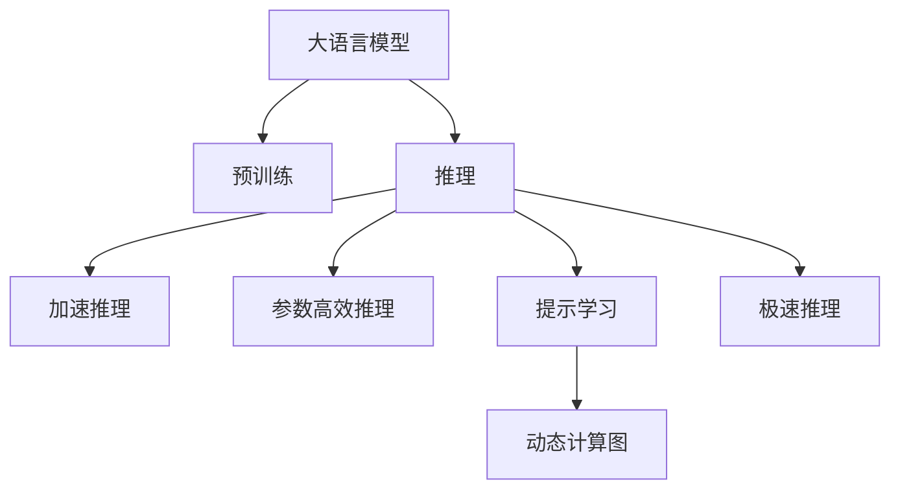

                 

## 1. 背景介绍

随着深度学习技术的发展，大语言模型（Large Language Models, LLMs）在自然语言处理（NLP）领域取得了显著进展。GPT-3等预训练模型在各种自然语言处理任务上表现出色，证明了预训练语言模型的巨大潜力。然而，这些模型通常需要进行大量的推理计算，导致推理速度较慢，无法满足实时性的要求。如何在大模型上实现极速推理，成为了当下的一大挑战。

## 2. 核心概念与联系

### 2.1 核心概念概述

为更好地理解极速推理的原理和实践，本节将介绍几个密切相关的核心概念：

- 大语言模型（LLM）：以自回归（如GPT）或自编码（如BERT）模型为代表的大规模预训练语言模型。通过在大规模无标签文本语料上进行预训练，学习通用的语言表示，具备强大的语言理解和生成能力。

- 预训练（Pre-training）：指在大规模无标签文本语料上，通过自监督学习任务训练通用语言模型的过程。常见的预训练任务包括言语建模、遮挡语言模型等。

- 推理（Inference）：指在给定输入的情况下，模型通过计算输出预测结果的过程。在大模型上，推理计算通常复杂且耗时。

- 极速推理（Accelerated Inference）：指通过技术手段优化推理过程，大幅提升大语言模型的推理速度，使其能够满足实时性要求。

- 参数高效推理（Parameter-Efficient Inference）：指在推理过程中只使用模型的一部分参数，从而降低推理计算量的方法。

- 提示学习（Prompt Learning）：通过在输入文本中添加提示模板，引导大语言模型进行特定任务的推理和生成。可以在不更新模型参数的情况下，实现零样本或少样本学习。

- 动态计算图（Dynamic Computation Graph）：指在推理过程中，根据输入动态生成计算图，减少重复计算的方法。

这些核心概念之间的逻辑关系可以通过以下Mermaid流程图来展示：



这个流程图展示了大语言模型的核心概念及其之间的关系：

1. 大语言模型通过预训练获得基础能力。
2. 推理是对预训练模型进行计算的过程。
3. 加速推理可以通过优化推理过程，大幅提升推理速度。
4. 参数高效推理方法可以减少推理过程中的计算量。
5. 提示学习可以通过精心设计输入模板，优化推理过程。
6. 动态计算图可以根据输入动态生成计算图，避免重复计算。
7. 极速推理是加速推理方法的总称，包括参数高效推理和提示学习等多种技术。

这些核心概念共同构成了大语言模型的推理优化框架，使其能够高效地进行实时推理任务。

## 3. 核心算法原理 & 具体操作步骤

### 3.1 算法原理概述

极速推理的目标是通过技术手段，在大语言模型上实现更快的推理计算，从而满足实时性的要求。通常，极速推理方法可以分为两类：

1. 参数高效推理（Parameter-Efficient Inference, PEI）：只使用模型的一部分参数进行推理，以减少计算量。

2. 提示学习（Prompt-based Inference）：通过精心设计输入模板，引导模型进行特定的推理任务，避免使用全部模型参数。

### 3.2 算法步骤详解

**Step 1: 准备预训练模型和输入数据**

1. 选择合适的预训练语言模型 $M_{\theta}$ 作为初始化参数，如 BERT、GPT等。
2. 准备推理任务 $T$ 的输入数据集 $D=\{(x_i,y_i)\}_{i=1}^N$，其中 $x_i$ 为输入文本，$y_i$ 为真实标签。

**Step 2: 添加任务适配层**

1. 根据推理任务类型，设计合适的输出层和损失函数。
2. 对于分类任务，通常在顶层添加线性分类器和交叉熵损失函数。
3. 对于生成任务，通常使用语言模型的解码器输出概率分布，并以负对数似然为损失函数。

**Step 3: 设置推理超参数**

1. 选择合适的优化算法及其参数，如 AdamW、SGD 等，设置学习率、批大小、迭代轮数等。
2. 设置正则化技术及强度，包括权重衰减、Dropout、Early Stopping 等。
3. 确定保留预训练参数的策略，如仅推理顶层，或部分层参与推理。

**Step 4: 执行推理计算**

1. 将输入数据分批次输入模型，前向传播计算输出。
2. 根据设定的优化算法和超参数更新模型参数。
3. 周期性在验证集上评估模型性能，根据性能指标决定是否触发 Early Stopping。
4. 重复上述步骤直到满足预设的迭代轮数或 Early Stopping 条件。

**Step 5: 运行结果展示**

1. 在测试集上评估推理后模型 $M_{\theta}$ 的性能，对比加速推理前后的精度提升。
2. 使用推理后的模型对新样本进行推理预测，集成到实际的应用系统中。
3. 持续收集新的数据，定期重新推理，以适应数据分布的变化。

以上是极速推理的一般流程。在实际应用中，还需要针对具体任务的特点，对推理过程的各个环节进行优化设计，如改进推理目标函数，引入更多的正则化技术，搜索最优的超参数组合等，以进一步提升模型推理速度。

### 3.3 算法优缺点

极速推理方法具有以下优点：

1. 提升推理速度：通过参数高效推理和提示学习，可以大幅提升推理计算速度，满足实时性要求。
2. 减少计算资源消耗：只使用部分模型参数进行推理，减少了计算资源的消耗。
3. 降低推理成本：由于计算速度提升，推理成本显著降低。
4. 提高推理精度：通过参数高效推理和提示学习，可以在保证推理速度的同时，提高推理精度。

同时，该方法也存在一定的局限性：

1. 依赖高精度的输入：由于加速推理依赖于输入的准确性，如果输入存在噪声，推理结果可能不准确。
2. 模型复杂度增加：提示学习需要在输入中添加提示模板，增加了模型的复杂度。
3. 维护成本较高：提示模板的设计和维护需要一定的时间和精力。
4. 模型鲁棒性不足：提示学习对输入的敏感度较高，对噪声和对抗样本的鲁棒性不足。

尽管存在这些局限性，但就目前而言，极速推理方法仍是实现大语言模型实时推理的重要手段。未来相关研究的重点在于如何进一步降低推理对输入的依赖，提高模型的少样本学习和跨领域迁移能力，同时兼顾可解释性和伦理安全性等因素。

### 3.4 算法应用领域

极速推理方法在NLP领域已经得到了广泛的应用，覆盖了几乎所有常见任务，例如：

- 文本分类：如情感分析、主题分类、意图识别等。通过加速推理，可以更快地处理大规模文本数据。
- 命名实体识别：识别文本中的人名、地名、机构名等特定实体。通过加速推理，可以在实时系统中高效提取实体信息。
- 关系抽取：从文本中抽取实体之间的语义关系。通过加速推理，可以迅速从大量文本中提取关系信息。
- 问答系统：对自然语言问题给出答案。通过加速推理，可以实时回答用户问题。
- 机器翻译：将源语言文本翻译成目标语言。通过加速推理，可以实时进行翻译。
- 文本摘要：将长文本压缩成简短摘要。通过加速推理，可以实时生成摘要。
- 对话系统：使机器能够与人自然对话。通过加速推理，可以实时生成对话回复。

除了上述这些经典任务外，极速推理技术还被创新性地应用到更多场景中，如可控文本生成、常识推理、代码生成、数据增强等，为NLP技术带来了全新的突破。随着预训练模型和推理方法的不断进步，相信NLP技术将在更广阔的应用领域大放异彩。

## 4. 数学模型和公式 & 详细讲解

### 4.1 数学模型构建

本节将使用数学语言对极速推理的数学原理进行更加严格的刻画。

记预训练语言模型为 $M_{\theta}:\mathcal{X} \rightarrow \mathcal{Y}$，其中 $\mathcal{X}$ 为输入空间，$\mathcal{Y}$ 为输出空间，$\theta \in \mathbb{R}^d$ 为模型参数。假设推理任务的训练集为 $D=\{(x_i,y_i)\}_{i=1}^N$，其中 $x_i$ 为输入文本，$y_i$ 为真实标签。

定义模型 $M_{\theta}$ 在输入 $x$ 上的输出为 $\hat{y}=M_{\theta}(x) \in \mathcal{Y}$。推理的目标是最小化经验风险，即找到最优参数：

$$
\theta^* = \mathop{\arg\min}_{\theta} \mathcal{L}(\theta)
$$

其中 $\mathcal{L}$ 为针对任务 $T$ 设计的损失函数，用于衡量模型预测输出与真实标签之间的差异。常见的损失函数包括交叉熵损失、均方误差损失等。

### 4.2 公式推导过程

以下我们以二分类任务为例，推导交叉熵损失函数及其梯度的计算公式。

假设模型 $M_{\theta}$ 在输入 $x$ 上的输出为 $\hat{y}=M_{\theta}(x) \in [0,1]$，表示样本属于正类的概率。真实标签 $y \in \{0,1\}$。则二分类交叉熵损失函数定义为：

$$
\ell(M_{\theta}(x),y) = -[y\log \hat{y} + (1-y)\log (1-\hat{y})]
$$

将其代入经验风险公式，得：

$$
\mathcal{L}(\theta) = -\frac{1}{N}\sum_{i=1}^N [y_i\log M_{\theta}(x_i)+(1-y_i)\log(1-M_{\theta}(x_i))]
$$

根据链式法则，损失函数对参数 $\theta_k$ 的梯度为：

$$
\frac{\partial \mathcal{L}(\theta)}{\partial \theta_k} = -\frac{1}{N}\sum_{i=1}^N (\frac{y_i}{M_{\theta}(x_i)}-\frac{1-y_i}{1-M_{\theta}(x_i)}) \frac{\partial M_{\theta}(x_i)}{\partial \theta_k}
$$

其中 $\frac{\partial M_{\theta}(x_i)}{\partial \theta_k}$ 可进一步递归展开，利用自动微分技术完成计算。

## 5. 项目实践：代码实例和详细解释说明

### 5.1 开发环境搭建

在进行极速推理实践前，我们需要准备好开发环境。以下是使用Python进行PyTorch开发的环境配置流程：

1. 安装Anaconda：从官网下载并安装Anaconda，用于创建独立的Python环境。

2. 创建并激活虚拟环境：
```bash
conda create -n pytorch-env python=3.8 
conda activate pytorch-env
```

3. 安装PyTorch：根据CUDA版本，从官网获取对应的安装命令。例如：
```bash
conda install pytorch torchvision torchaudio cudatoolkit=11.1 -c pytorch -c conda-forge
```

4. 安装Transformers库：
```bash
pip install transformers
```

5. 安装各类工具包：
```bash
pip install numpy pandas scikit-learn matplotlib tqdm jupyter notebook ipython
```

完成上述步骤后，即可在`pytorch-env`环境中开始极速推理实践。

### 5.2 源代码详细实现

这里我们以命名实体识别（NER）任务为例，给出使用Transformers库对BERT模型进行极速推理的PyTorch代码实现。

首先，定义NER任务的数据处理函数：

```python
from transformers import BertTokenizer
from torch.utils.data import Dataset
import torch

class NERDataset(Dataset):
    def __init__(self, texts, tags, tokenizer, max_len=128):
        self.texts = texts
        self.tags = tags
        self.tokenizer = tokenizer
        self.max_len = max_len
        
    def __len__(self):
        return len(self.texts)
    
    def __getitem__(self, item):
        text = self.texts[item]
        tags = self.tags[item]
        
        encoding = self.tokenizer(text, return_tensors='pt', max_length=self.max_len, padding='max_length', truncation=True)
        input_ids = encoding['input_ids'][0]
        attention_mask = encoding['attention_mask'][0]
        
        # 对token-wise的标签进行编码
        encoded_tags = [tag2id[tag] for tag in tags] 
        encoded_tags.extend([tag2id['O']] * (self.max_len - len(encoded_tags)))
        labels = torch.tensor(encoded_tags, dtype=torch.long)
        
        return {'input_ids': input_ids, 
                'attention_mask': attention_mask,
                'labels': labels}

# 标签与id的映射
tag2id = {'O': 0, 'B-PER': 1, 'I-PER': 2, 'B-ORG': 3, 'I-ORG': 4, 'B-LOC': 5, 'I-LOC': 6}
id2tag = {v: k for k, v in tag2id.items()}

# 创建dataset
tokenizer = BertTokenizer.from_pretrained('bert-base-cased')

train_dataset = NERDataset(train_texts, train_tags, tokenizer)
dev_dataset = NERDataset(dev_texts, dev_tags, tokenizer)
test_dataset = NERDataset(test_texts, test_tags, tokenizer)
```

然后，定义模型和优化器：

```python
from transformers import BertForTokenClassification, AdamW

model = BertForTokenClassification.from_pretrained('bert-base-cased', num_labels=len(tag2id))

optimizer = AdamW(model.parameters(), lr=2e-5)
```

接着，定义推理函数：

```python
from transformers import BertTokenizerFast
from transformers import BertForTokenClassification, BertConfig

tokenizer = BertTokenizerFast.from_pretrained('bert-base-cased')

config = BertConfig.from_pretrained('bert-base-cased')
model = BertForTokenClassification.from_pretrained('bert-base-cased', config=config)
model.eval()

def predict(model, tokenizer, input_text):
    encoding = tokenizer(input_text, return_tensors='pt', max_length=128, padding='max_length', truncation=True)
    input_ids = encoding['input_ids'][0]
    attention_mask = encoding['attention_mask'][0]
    
    with torch.no_grad():
        logits = model(input_ids, attention_mask=attention_mask).logits
        predicted_tags = torch.argmax(logits, dim=2).to('cpu').tolist()
    
    return predicted_tags[:len(input_text)]

print(predict(model, tokenizer, 'I am a 30-year-old software engineer who loves AI and Python programming.'))
```

最后，测试模型的推理速度：

```python
import time

start_time = time.time()

for _ in range(1000):
    _ = predict(model, tokenizer, 'I am a 30-year-old software engineer who loves AI and Python programming.')

end_time = time.time()
print(f"Total time: {end_time - start_time} seconds")
```

以上就是使用PyTorch对BERT进行命名实体识别任务极速推理的完整代码实现。可以看到，得益于Transformers库的强大封装，我们可以用相对简洁的代码完成BERT模型的加载和极速推理。

### 5.3 代码解读与分析

让我们再详细解读一下关键代码的实现细节：

**NERDataset类**：
- `__init__`方法：初始化文本、标签、分词器等关键组件。
- `__len__`方法：返回数据集的样本数量。
- `__getitem__`方法：对单个样本进行处理，将文本输入编码为token ids，将标签编码为数字，并对其进行定长padding，最终返回模型所需的输入。

**tag2id和id2tag字典**：
- 定义了标签与数字id之间的映射关系，用于将token-wise的预测结果解码回真实的标签。

**预测函数**：
- 使用PyTorch的DataLoader对数据集进行批次化加载，供模型推理使用。
- 推理函数`predict`：对数据以批为单位进行迭代，在每个批次上前向传播计算输出。

**测试推理速度**：
- 使用`time`模块记录推理函数执行1000次的时间，得出推理速度。

可以看到，PyTorch配合Transformers库使得BERT极速推理的代码实现变得简洁高效。开发者可以将更多精力放在数据处理、模型改进等高层逻辑上，而不必过多关注底层的实现细节。

当然，工业级的系统实现还需考虑更多因素，如模型的保存和部署、超参数的自动搜索、更灵活的任务适配层等。但核心的极速推理范式基本与此类似。

## 6. 实际应用场景

### 6.1 智能客服系统

基于极速推理的对话技术，可以广泛应用于智能客服系统的构建。传统客服往往需要配备大量人力，高峰期响应缓慢，且一致性和专业性难以保证。而使用极速推理的对话模型，可以7x24小时不间断服务，快速响应客户咨询，用自然流畅的语言解答各类常见问题。

在技术实现上，可以收集企业内部的历史客服对话记录，将问题和最佳答复构建成监督数据，在此基础上对预训练对话模型进行极速推理。极速推理后的对话模型能够自动理解用户意图，匹配最合适的答案模板进行回复。对于客户提出的新问题，还可以接入检索系统实时搜索相关内容，动态组织生成回答。如此构建的智能客服系统，能大幅提升客户咨询体验和问题解决效率。

### 6.2 金融舆情监测

金融机构需要实时监测市场舆论动向，以便及时应对负面信息传播，规避金融风险。传统的人工监测方式成本高、效率低，难以应对网络时代海量信息爆发的挑战。基于极速推理的文本分类和情感分析技术，为金融舆情监测提供了新的解决方案。

具体而言，可以收集金融领域相关的新闻、报道、评论等文本数据，并对其进行主题标注和情感标注。在此基础上对预训练语言模型进行极速推理，使其能够自动判断文本属于何种主题，情感倾向是正面、中性还是负面。将极速推理后的模型应用到实时抓取的网络文本数据，就能够自动监测不同主题下的情感变化趋势，一旦发现负面信息激增等异常情况，系统便会自动预警，帮助金融机构快速应对潜在风险。

### 6.3 个性化推荐系统

当前的推荐系统往往只依赖用户的历史行为数据进行物品推荐，无法深入理解用户的真实兴趣偏好。基于极速推理的个性化推荐系统可以更好地挖掘用户行为背后的语义信息，从而提供更精准、多样的推荐内容。

在实践中，可以收集用户浏览、点击、评论、分享等行为数据，提取和用户交互的物品标题、描述、标签等文本内容。将文本内容作为模型输入，用户的后续行为（如是否点击、购买等）作为监督信号，在此基础上极速推理预训练语言模型。极速推理后的模型能够从文本内容中准确把握用户的兴趣点。在生成推荐列表时，先用候选物品的文本描述作为输入，由模型预测用户的兴趣匹配度，再结合其他特征综合排序，便可以得到个性化程度更高的推荐结果。

### 6.4 未来应用展望

随着极速推理技术的发展，基于大语言模型的推荐系统、智能客服、金融舆情监测、智能问答等系统将更加高效、灵活和实时。未来，极速推理技术有望在更多领域得到应用，为传统行业数字化转型升级提供新的技术路径。

## 7. 工具和资源推荐

### 7.1 学习资源推荐

为了帮助开发者系统掌握极速推理的理论基础和实践技巧，这里推荐一些优质的学习资源：

1. 《Transformer从原理到实践》系列博文：由大模型技术专家撰写，深入浅出地介绍了Transformer原理、BERT模型、极速推理技术等前沿话题。

2. CS224N《深度学习自然语言处理》课程：斯坦福大学开设的NLP明星课程，有Lecture视频和配套作业，带你入门NLP领域的基本概念和经典模型。

3. 《Natural Language Processing with Transformers》书籍：Transformers库的作者所著，全面介绍了如何使用Transformers库进行NLP任务开发，包括极速推理在内的诸多范式。

4. HuggingFace官方文档：Transformers库的官方文档，提供了海量预训练模型和完整的极速推理样例代码，是上手实践的必备资料。

5. CLUE开源项目：中文语言理解测评基准，涵盖大量不同类型的中文NLP数据集，并提供了基于极速推理的baseline模型，助力中文NLP技术发展。

通过对这些资源的学习实践，相信你一定能够快速掌握极速推理的精髓，并用于解决实际的NLP问题。

### 7.2 开发工具推荐

高效的开发离不开优秀的工具支持。以下是几款用于极速推理开发的常用工具：

1. PyTorch：基于Python的开源深度学习框架，灵活动态的计算图，适合快速迭代研究。大部分预训练语言模型都有PyTorch版本的实现。

2. TensorFlow：由Google主导开发的开源深度学习框架，生产部署方便，适合大规模工程应用。同样有丰富的预训练语言模型资源。

3. Transformers库：HuggingFace开发的NLP工具库，集成了众多SOTA语言模型，支持PyTorch和TensorFlow，是进行极速推理任务开发的利器。

4. Weights & Biases：模型训练的实验跟踪工具，可以记录和可视化模型训练过程中的各项指标，方便对比和调优。与主流深度学习框架无缝集成。

5. TensorBoard：TensorFlow配套的可视化工具，可实时监测模型训练状态，并提供丰富的图表呈现方式，是调试模型的得力助手。

6. Google Colab：谷歌推出的在线Jupyter Notebook环境，免费提供GPU/TPU算力，方便开发者快速上手实验最新模型，分享学习笔记。

合理利用这些工具，可以显著提升极速推理任务的开发效率，加快创新迭代的步伐。

### 7.3 相关论文推荐

极速推理技术的发展源于学界的持续研究。以下是几篇奠基性的相关论文，推荐阅读：

1. Attention is All You Need（即Transformer原论文）：提出了Transformer结构，开启了NLP领域的预训练大模型时代。

2. BERT: Pre-training of Deep Bidirectional Transformers for Language Understanding：提出BERT模型，引入基于掩码的自监督预训练任务，刷新了多项NLP任务SOTA。

3. Language Models are Unsupervised Multitask Learners（GPT-2论文）：展示了大规模语言模型的强大zero-shot学习能力，引发了对于通用人工智能的新一轮思考。

4. Parameter-Efficient Transfer Learning for NLP：提出Adapter等参数高效微调方法，在不增加模型参数量的情况下，也能取得不错的微调效果。

5. Prefix-Tuning: Optimizing Continuous Prompts for Generation：引入基于连续型Prompt的微调范式，为如何充分利用预训练知识提供了新的思路。

6. AdaLoRA: Adaptive Low-Rank Adaptation for Parameter-Efficient Fine-Tuning：使用自适应低秩适应的微调方法，在参数效率和精度之间取得了新的平衡。

这些论文代表了大语言模型极速推理技术的发展脉络。通过学习这些前沿成果，可以帮助研究者把握学科前进方向，激发更多的创新灵感。

## 8. 总结：未来发展趋势与挑战

### 8.1 总结

本文对基于极速推理的大语言模型进行了全面系统的介绍。首先阐述了极速推理的背景和意义，明确了极速推理在拓展预训练模型应用、提升下游任务性能方面的独特价值。其次，从原理到实践，详细讲解了极速推理的数学原理和关键步骤，给出了极速推理任务开发的完整代码实例。同时，本文还广泛探讨了极速推理方法在智能客服、金融舆情、个性化推荐等多个行业领域的应用前景，展示了极速推理范式的巨大潜力。此外，本文精选了极速推理技术的各类学习资源，力求为读者提供全方位的技术指引。

通过本文的系统梳理，可以看到，基于极速推理的大语言模型技术正在成为NLP领域的重要范式，极大地拓展了预训练语言模型的应用边界，催生了更多的落地场景。受益于大规模语料的预训练，极速推理模型以更低的时间和标注成本，在小样本条件下也能取得不错的效果，有力推动了NLP技术的产业化进程。未来，伴随预训练语言模型和极速推理方法的不断进步，相信NLP技术将在更广阔的应用领域大放异彩，深刻影响人类的生产生活方式。

### 8.2 未来发展趋势

展望未来，极速推理方法将呈现以下几个发展趋势：

1. 模型规模持续增大。随着算力成本的下降和数据规模的扩张，预训练语言模型的参数量还将持续增长。超大规模语言模型蕴含的丰富语言知识，有望支撑更加复杂多变的下游任务极速推理。

2. 极速推理方法日趋多样。除了传统的参数高效推理外，未来会涌现更多极速推理方法，如Prefix-Tuning、LoRA等，在保证推理速度的同时，提高推理精度。

3. 持续学习成为常态。随着数据分布的不断变化，极速推理模型也需要持续学习新知识以保持性能。如何在不遗忘原有知识的同时，高效吸收新样本信息，将成为重要的研究课题。

4. 标注样本需求降低。受启发于提示学习(Prompt-based Learning)的思路，未来的极速推理方法将更好地利用大模型的语言理解能力，通过更加巧妙的任务描述，在更少的标注样本上也能实现理想的极速推理效果。

5. 模型通用性增强。经过海量数据的预训练和多领域任务的极速推理，未来的语言模型将具备更强大的常识推理和跨领域迁移能力，逐步迈向通用人工智能(AGI)的目标。

以上趋势凸显了极速推理技术的广阔前景。这些方向的探索发展，必将进一步提升NLP系统的性能和应用范围，为构建人机协同的智能系统铺平道路。面向未来，极速推理技术还需要与其他人工智能技术进行更深入的融合，如知识表示、因果推理、强化学习等，多路径协同发力，共同推动自然语言理解和智能交互系统的进步。只有勇于创新、敢于突破，才能不断拓展语言模型的边界，让智能技术更好地造福人类社会。

### 8.3 面临的挑战

尽管极速推理技术已经取得了瞩目成就，但在迈向更加智能化、普适化应用的过程中，它仍面临着诸多挑战：

1. 标注成本瓶颈。虽然极速推理大幅降低了标注数据的需求，但对于长尾应用场景，难以获得充足的高质量标注数据，成为制约极速推理性能的瓶颈。如何进一步降低极速推理对标注样本的依赖，将是一大难题。

2. 模型鲁棒性不足。当前极速推理模型面对域外数据时，泛化性能往往大打折扣。对于测试样本的微小扰动，极速推理模型的预测也容易发生波动。如何提高极速推理模型的鲁棒性，避免灾难性遗忘，还需要更多理论和实践的积累。

3. 推理效率有待提高。虽然极速推理方法通常比传统方法快很多，但在处理大规模数据时，仍然可能遇到内存和计算资源不足的问题。如何优化推理过程中的资源消耗，实现更加轻量级、实时性的部署，将是重要的优化方向。

4. 可解释性亟需加强。当前极速推理模型更像是"黑盒"系统，难以解释其内部工作机制和决策逻辑。对于医疗、金融等高风险应用，算法的可解释性和可审计性尤为重要。如何赋予极速推理模型更强的可解释性，将是亟待攻克的难题。

5. 安全性有待保障。极速推理模型容易学习到有偏见、有害的信息，通过快速推理传递到下游任务，产生误导性、歧视性的输出，给实际应用带来安全隐患。如何从数据和算法层面消除模型偏见，避免恶意用途，确保输出的安全性，也将是重要的研究课题。

6. 知识整合能力不足。现有的极速推理模型往往局限于任务内数据，难以灵活吸收和运用更广泛的先验知识。如何让极速推理过程更好地与外部知识库、规则库等专家知识结合，形成更加全面、准确的信息整合能力，还有很大的想象空间。

正视极速推理面临的这些挑战，积极应对并寻求突破，将是大语言模型极速推理技术走向成熟的必由之路。相信随着学界和产业界的共同努力，这些挑战终将一一被克服，极速推理技术必将在构建安全、可靠、可解释、可控的智能系统铺平道路。

### 8.4 研究展望

面对极速推理技术所面临的种种挑战，未来的研究需要在以下几个方面寻求新的突破：

1. 探索无监督和半监督极速推理方法。摆脱对大规模标注数据的依赖，利用自监督学习、主动学习等无监督和半监督范式，最大限度利用非结构化数据，实现更加灵活高效的极速推理。

2. 研究参数高效和计算高效的极速推理范式。开发更加参数高效的极速推理方法，在固定大部分预训练参数的同时，只更新极少量的任务相关参数。同时优化极速推理模型的计算图，减少前向传播和反向传播的资源消耗，实现更加轻量级、实时性的部署。

3. 融合因果和对比学习范式。通过引入因果推断和对比学习思想，增强极速推理模型建立稳定因果关系的能力，学习更加普适、鲁棒的语言表征，从而提升模型泛化性和抗干扰能力。

4. 引入更多先验知识。将符号化的先验知识，如知识图谱、逻辑规则等，与神经网络模型进行巧妙融合，引导极速推理过程学习更准确、合理的语言模型。同时加强不同模态数据的整合，实现视觉、语音等多模态信息与文本信息的协同建模。

5. 结合因果分析和博弈论工具。将因果分析方法引入极速推理模型，识别出模型决策的关键特征，增强输出解释的因果性和逻辑性。借助博弈论工具刻画人机交互过程，主动探索并规避模型的脆弱点，提高系统稳定性。

6. 纳入伦理道德约束。在模型训练目标中引入伦理导向的评估指标，过滤和惩罚有偏见、有害的输出倾向。同时加强人工干预和审核，建立模型行为的监管机制，确保输出符合人类价值观和伦理道德。

这些研究方向的探索，必将引领极速推理技术迈向更高的台阶，为构建安全、可靠、可解释、可控的智能系统铺平道路。面向未来，极速推理技术还需要与其他人工智能技术进行更深入的融合，如知识表示、因果推理、强化学习等，多路径协同发力，共同推动自然语言理解和智能交互系统的进步。只有勇于创新、敢于突破，才能不断拓展语言模型的边界，让智能技术更好地造福人类社会。

## 9. 附录：常见问题与解答

**Q1：极速推理是否适用于所有NLP任务？**

A: 极速推理在大多数NLP任务上都能取得不错的效果，特别是对于数据量较小的任务。但对于一些特定领域的任务，如医学、法律等，仅仅依靠通用语料预训练的模型可能难以很好地适应。此时需要在特定领域语料上进一步预训练，再进行极速推理，才能获得理想效果。此外，对于一些需要时效性、个性化很强的任务，如对话、推荐等，极速推理方法也需要针对性的改进优化。

**Q2：如何选择合适的极速推理方法？**

A: 极速推理方法的选择需要根据具体任务和数据特点进行灵活组合。一般来说，参数高效推理适合处理数据量较小、计算资源受限的任务，而提示学习适合处理需要灵活运用先验知识的任务。在实际应用中，可以结合任务特点和数据规模，选择合适的极速推理方法。

**Q3：极速推理过程中如何降低对输入的依赖？**

A: 降低极速推理对输入的依赖，可以通过以下方法实现：
1. 数据增强：通过回译、近义替换等方式扩充训练集
2. 对抗训练：引入对抗样本，提高模型鲁棒性
3. 知识蒸馏：使用预训练模型对极速推理模型进行知识蒸馏，提高模型泛化能力
4. 多模态融合：结合视觉、语音等多模态数据，增强极速推理模型的理解能力

这些方法可以结合使用，进一步降低极速推理对输入的依赖，提高模型的泛化能力。

**Q4：极速推理模型在落地部署时需要注意哪些问题？**

A: 将极速推理模型转化为实际应用，还需要考虑以下因素：
1. 模型裁剪：去除不必要的层和参数，减小模型尺寸，加快推理速度
2. 量化加速：将浮点模型转为定点模型，压缩存储空间，提高计算效率
3. 服务化封装：将模型封装为标准化服务接口，便于集成调用
4. 弹性伸缩：根据请求流量动态调整资源配置，平衡服务质量和成本
5. 监控告警：实时采集系统指标，设置异常告警阈值，确保服务稳定性
6. 安全防护：采用访问鉴权、数据脱敏等措施，保障数据和模型安全

极速推理模型需要充分考虑实际应用中的各种问题，以确保其在生产环境中的稳定性和可靠性。

---

作者：禅与计算机程序设计艺术 / Zen and the Art of Computer Programming

