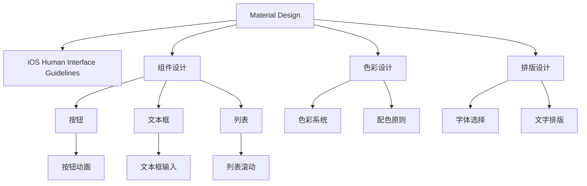

                 

# 移动应用UI/UX设计：Material Design与iOS设计规范

## 1. 背景介绍

### 1.1 问题由来
随着移动设备的普及，用户对移动应用的用户体验（User Experience, UX）要求越来越高。用户界面设计（User Interface, UI）不仅需要美观，还需具备良好的可用性，以确保用户可以高效地完成任务。目前，移动应用界面设计主要有两种主流范式：Google的Material Design（MD）和苹果的iOS设计规范（Human Interface Guidelines）。

Google的Material Design旨在为跨平台应用提供一个统一的UI/UX设计语言，并通过一致的设计元素、动效、布局等，提供一种清晰、交互性强的用户界面设计方案。iOS设计规范则由苹果公司提供，聚焦于其平台上的应用设计，力求创建直观、连贯且易于使用的界面。

### 1.2 问题核心关键点
选择UI/UX设计范式需要考虑以下核心关键点：

- 设计风格：Material Design强调简洁、统一和动态效果，而iOS设计规范则追求简洁、干净、高质量的排版。
- 设计语言：Material Design使用统一的语义元素，如卡片、颜色、排版等，而iOS设计规范则注重利用系统设计语言，如Shadows, Insets等。
- 平台兼容性：Material Design在Android和Web端都能运行，而iOS设计规范仅适用于iOS设备。
- 动效设计：Material Design使用大量动效来增强用户交互，而iOS设计规范则更注重页面间的自然过渡。

## 2. 核心概念与联系

### 2.1 核心概念概述

为更好地理解Material Design与iOS设计规范的设计原则，本节将介绍几个密切相关的核心概念：

- **Material Design (MD)**：由Google设计团队推出的一种全新的UI设计语言，旨在提升移动应用界面的清晰性、交互性和美观性。MD强调使用实态和幻态元素、交互动画和干净的布局。
- **iOS Human Interface Guidelines**：苹果公司推出的官方UI设计指南，覆盖了应用程序设计、图标设计、文本排版、颜色使用、交互设计等。iOS规范强调直观、清晰和一致的布局，采用简约美学和高质量的排版。
- **组件设计**：UI设计中常用的基本元素，如按钮、文本框、列表等。MD和iOS都提供了详细的组件设计规范。
- **色彩设计**：颜色在UI设计中的使用原则，MD和iOS都提供了详细的色彩应用指南。
- **排版设计**：文字和内容的排版原则，MD和iOS在字体选择、字号、行间距、字距等方面有所差异。

这些核心概念之间的逻辑关系可以通过以下Mermaid流程图来展示：



这个流程图展示了大语言模型的核心概念及其之间的关系：

1. Material Design和iOS Human Interface Guidelines是两种UI设计语言。
2. 组件设计、色彩设计和排版设计是UI设计中的关键要素。
3. 组件如按钮、文本框和列表在MD和iOS中设计规范有所不同。
4. 色彩系统和配色原则、字体选择和文字排版是设计中重要的美学原则。

这些概念共同构成了现代UI/UX设计的基石，设计师需掌握并灵活运用这些设计语言和原则。

## 3. 核心算法原理 & 具体操作步骤
### 3.1 算法原理概述

Material Design与iOS设计规范的UI/UX设计主要遵循一致性、导航性和简洁性原则，以确保用户体验的一致性、直观性和高效性。

1. **一致性（Consistency）**：通过统一的设计元素和交互方式，确保用户在应用内体验一致，减少学习成本。
2. **导航性（Navigation）**：提供清晰、高效的导航方式，帮助用户快速访问目标。
3. **简洁性（Clarity）**：通过简洁的视觉元素和布局，降低复杂度，提升可用性。

MD和iOS的设计核心算法原理主要围绕以上三点展开，通过设计模板、布局规范、动效设计等方法实现。

### 3.2 算法步骤详解

Material Design与iOS设计规范的UI/UX设计一般包括以下几个关键步骤：

**Step 1: 设计框架搭建**
- 选择合适的基础布局框架，如MD的Scaffold和iOS的Storyboard。
- 设计应用的主入口，包括导航和布局。

**Step 2: 组件选择与设计**
- 选择合适的UI组件，如按钮、文本框、列表等，并按照规范进行设计。
- 使用统一的组件样式和排版，确保一致性。

**Step 3: 动效设计**
- 根据交互流程设计动效，增强用户感知和反馈。
- 确保动效流畅、自然，提升用户体验。

**Step 4: 色彩与排版**
- 按照规范选择和应用色彩，确保视觉一致性。
- 使用标准排版规则，提升内容可读性和美观度。

**Step 5: 交互设计**
- 设计简洁、直观的交互方式，减少用户操作复杂度。
- 确保交互流畅、响应快速。

**Step 6: 测试与优化**
- 对设计进行多轮测试，收集用户反馈。
- 根据测试结果进行优化，提升用户体验。

### 3.3 算法优缺点

Material Design与iOS设计规范的UI/UX设计方法各有优缺点：

**优点**：
- 设计一致性高，可提高用户体验。
- 提供详细的设计规范，易于学习和应用。
- 注重简洁和高效，提升界面美观和可用性。

**缺点**：
- 设计风格较为固定，难以创新。
- 需要设计师具备一定的规范理解能力。
- 平台兼容性有限，仅适用于对应平台。

### 3.4 算法应用领域

Material Design与iOS设计规范的UI/UX设计方法广泛应用于各种类型的移动应用，包括社交、电商、金融、教育等。

- **社交应用**：如Facebook、微信等，MD和iOS都适用。
- **电商应用**：如Amazon、淘宝等，MD和iOS都适用。
- **金融应用**：如支付宝、银联等，主要采用iOS设计规范。
- **教育应用**：如Khan Academy、Coursera等，主要采用MD。

## 4. 数学模型和公式 & 详细讲解 & 举例说明

### 4.1 数学模型构建

由于UI/UX设计主要依赖于视觉和交互设计，因此数学模型构建相对简单。我们以Material Design为例，介绍如何构建其核心数学模型。

在MD中，组件如按钮、卡片等的基本形状和大小可以用以下数学公式表示：

$$
\text{Card} = \begin{cases}
\text{width} = 288px \\
\text{height} = 150px \\
\text{padding} = 8px \\
\text{border-radius} = 4px
\end{cases}
$$

$$
\text{Button} = \begin{cases}
\text{width} = 44px \\
\text{height} = 44px \\
\text{padding} = 8px \\
\text{border-radius} = 4px \\
\text{elevation} = 4px
\end{cases}
$$

其中，宽度、高度、内边距、圆角和抬升值（elevation）是UI设计中常用的数学参数，决定了组件的视觉样式和交互效果。

### 4.2 公式推导过程

以MD中的按钮组件为例，推导其设计公式。

MD中的按钮组件使用统一的设计语言，其宽度、高度和内边距固定，圆角为4px，抬升值为4px。这些参数通过统计分析得出的标准值，使得按钮在各个设备上都有良好的展示效果。

具体推导过程如下：

1. 按钮宽度和高度固定为44px，是为了保持与MD中其他组件的比例一致。
2. 内边距设置为8px，是为了确保文字和按钮边框之间的空间足够，提升可读性和美观度。
3. 圆角设置为4px，是为了使按钮的边缘更加平滑，提升视觉吸引力。
4. 抬升值为4px，是为了模拟真实世界的阴影效果，增强按钮的立体感。

通过以上公式推导，MD提供了清晰的设计规范，使得设计师可以快速构建符合标准的按钮组件。

### 4.3 案例分析与讲解

我们以Material Design的卡片组件为例，进行详细讲解。

MD的卡片组件是其设计语言的核心元素之一，用于展示内容列表。卡片组件的设计规范包括宽度、高度、内边距、圆角和抬升值等，确保在各种设备上的一致性。

$$
\text{Card} = \begin{cases}
\text{width} = 288px \\
\text{height} = 150px \\
\text{padding} = 8px \\
\text{border-radius} = 4px
\end{cases}
$$

其中，宽度288px、高度150px是标准尺寸，内边距8px是防止内容溢出，圆角4px是为了视觉上平滑，抬升值4px是增强立体感。

通过以上公式，设计师可以快速构建出符合MD标准的卡片组件。

## 5. 项目实践：代码实例和详细解释说明
### 5.1 开发环境搭建

在进行UI/UX设计实践前，我们需要准备好开发环境。以下是使用Flutter进行UI设计的环境配置流程：

1. 安装Flutter SDK：从官网下载并安装Flutter SDK，并配置环境变量。
2. 安装Dart：Flutter使用Dart语言进行开发，从官网下载并安装最新版本的Dart。
3. 安装Android Studio和Xcode：Flutter支持Android和iOS开发，需要安装对应的IDE。
4. 配置Flutter环境：使用`flutter doctor`工具检查Flutter环境，确保所有依赖项都已安装。
5. 创建新项目：使用`flutter create my_app`命令创建新的Flutter项目。

完成上述步骤后，即可在Android Studio或Xcode中开始Flutter项目开发。

### 5.2 源代码详细实现

下面以Flutter为例，展示如何设计一个符合MD规范的UI组件。

首先，定义UI组件的基本属性和样式：

```dart
import 'package:flutter/material.dart';

class MyCard extends StatelessWidget {
  @override
  Widget build(BuildContext context) {
    return Card(
      child: Column(
        children: [
          Text('Card Title', style: TextStyle(fontSize: 24)),
          SizedBox(height: 8),
          Text('Card Content', style: TextStyle(fontSize: 16)),
        ],
      ),
    );
  }
}
```

然后，使用MD的动效设计和色彩系统，为UI组件添加风格：

```dart
class MyCard extends StatelessWidget {
  @override
  Widget build(BuildContext context) {
    return Card(
      child: Column(
        children: [
          Text('Card Title', style: TextStyle(fontSize: 24)),
          SizedBox(height: 8),
          Text('Card Content', style: TextStyle(fontSize: 16)),
        ],
      ),
      elevation: 4, // 抬升值
      color: Colors.blueAccent, // 背景色
      borderRadius: BorderRadius.circular(4), // 圆角
      decoration: BoxDecoration(
        border: Border.all(color: Colors.black, width: 1), // 边框
        boxShadow: [
          BoxShadow(
            color: Colors.black.withOpacity(0.2),
            offset: Offset(0, 4), // 阴影偏移
            blurRadius: 8, // 模糊半径
            spreadRadius: 4, // 扩散半径
          ),
        ],
      ),
    );
  }
}
```

通过以上代码，我们构建了一个符合Material Design标准的卡片组件，并使用了颜色、边框、抬升值和阴影等设计元素。

### 5.3 代码解读与分析

让我们再详细解读一下关键代码的实现细节：

**MyCard类**：
- `@override build`方法：定义组件的构建逻辑。
- `Card`组件：基本UI组件，定义卡片的布局、内容、样式等。
- `elevation`属性：定义卡片的抬升值，增强立体感。
- `color`属性：定义卡片的背景色。
- `borderRadius`属性：定义卡片的圆角。
- `BoxDecoration`类：定义卡片的边框、阴影等装饰效果。

**样式设置**：
- `Text`组件：用于显示文本内容，设置字体大小和样式。
- `SizedBox`组件：用于添加间隔。
- `BoxShadow`类：定义阴影效果，通过偏移、模糊和扩散等参数，增强视觉层次感。

**组件使用**：
- 通过`Column`布局组件，将文本内容按垂直方向排列，形成卡片的上下布局。

可以看到，Flutter提供了丰富的UI组件和样式，使得设计师可以轻松构建符合Material Design标准的UI组件。

当然，工业级的系统实现还需考虑更多因素，如UI组件的可扩展性、适配性等。但核心的设计流程基本与此类似。

## 6. 实际应用场景
### 6.1 社交应用界面设计

在社交应用中，Material Design和iOS设计规范都得到了广泛应用。以微信为例，微信使用了MD的设计语言，创建直观、易用的界面。

在聊天界面，微信使用卡片式布局展示消息，通过统一的设计元素和动效，提升用户阅读体验。通过MD的动效设计，微信可以平滑展示新消息，并通过阴影、抬升值等元素增强界面的层次感。

### 6.2 电商应用界面设计

电商应用如淘宝，主要采用iOS设计规范，通过简洁、高效的界面设计，提升用户体验。

在淘宝首页，通过统一的标准布局和组件，使得用户可以快速浏览商品列表。通过iOS的阴影、圆角等设计元素，提升界面的视觉吸引力。通过统一的色彩系统和排版规则，确保用户界面的一致性。

### 6.3 金融应用界面设计

金融应用如支付宝，主要采用iOS设计规范，通过简洁、高效的界面设计，提升用户体验。

在支付宝首页，通过简洁的布局和清晰的导航，让用户快速访问各项功能。通过统一的字体、排版和色彩系统，确保用户界面的一致性。通过iOS的阴影、圆角等设计元素，提升界面的视觉吸引力。

## 7. 工具和资源推荐
### 7.1 学习资源推荐

为了帮助开发者系统掌握Material Design与iOS设计规范的理论基础和实践技巧，这里推荐一些优质的学习资源：

1. Google Material Design文档：官方文档提供了详尽的设计规范和组件指南，适合系统学习MD。
2. Apple Human Interface Guidelines文档：苹果官方文档，覆盖iOS设计规范的各个方面，适合深入学习iOS设计。
3. Flutter官方文档：Flutter的官方文档提供了丰富的UI组件和样式，适合学习和应用。
4. DART语言教程：DART是Flutter的主要开发语言，了解DART语言基础对于UI开发至关重要。
5. Udacity Material Design课程：Udacity提供的免费课程，系统介绍了MD的设计原则和应用。

通过对这些资源的学习实践，相信你一定能够快速掌握UI/UX设计的精髓，并用于解决实际的UI设计问题。
### 7.2 开发工具推荐

高效的开发离不开优秀的工具支持。以下是几款用于UI设计开发的常用工具：

1. Flutter：谷歌开源的移动UI/UX开发框架，支持Android和iOS平台，提供了丰富的UI组件和动画效果。
2. Sketch：Mac平台上的专业UI设计工具，适合绘制复杂的UI界面。
3. Adobe XD：跨平台UI设计工具，支持Sketch文件导入，适合团队协作和原型设计。
4. Figma：云端UI设计工具，支持实时协作和设计分享，适合团队合作。
5. Adobe Photoshop：专业的图像处理工具，适合进行图像设计。

合理利用这些工具，可以显著提升UI设计开发的效率，加快创新迭代的步伐。

### 7.3 相关论文推荐

UI/UX设计的发展源于学界的持续研究。以下是几篇奠基性的相关论文，推荐阅读：

1. Material Design规范文档：Google设计的官方规范文档，详细介绍了MD的设计原则和应用方法。
2. iOS Human Interface Guidelines文档：苹果设计的官方规范文档，覆盖iOS设计规范的各个方面。
3. Designing With Material Design: A Tool for Enabling Design Systems：Google发表的论文，探讨了如何构建MD设计系统。
4. Designing for iOS：Apple发表的论文，介绍了iOS设计规范的设计原则和应用。

这些论文代表了大语言模型微调技术的发展脉络。通过学习这些前沿成果，可以帮助研究者把握学科前进方向，激发更多的创新灵感。

## 8. 总结：未来发展趋势与挑战

### 8.1 总结

本文对Material Design与iOS设计规范的UI/UX设计进行了全面系统的介绍。首先阐述了两种设计语言的背景和设计原则，明确了设计语言对于提升用户体验的重要性。其次，从原理到实践，详细讲解了MD和iOS的设计核心算法原理和操作步骤，给出了UI设计任务的完整代码实例。同时，本文还广泛探讨了设计规范在各种应用场景中的具体应用，展示了UI/UX设计规范的广阔前景。

通过本文的系统梳理，可以看到，UI/UX设计规范已经成为现代移动应用设计的重要基础，其设计原则和方法正在被广泛应用。未来，伴随UI设计规范的持续演进，UI/UX设计必将进一步提升应用的可用性和美观度，推动移动互联网技术的不断进步。

### 8.2 未来发展趋势

展望未来，UI/UX设计规范将呈现以下几个发展趋势：

1. 设计自动化。随着人工智能技术的发展，UI/UX设计将更加自动化，设计师可以借助工具自动生成设计方案。
2. 设计系统化。通过设计系统化管理，确保不同设计之间的一致性和可用性。
3. 设计本地化。针对不同市场和平台，设计本地化的UI/UX界面，提升用户体验。
4. 设计智能化。利用大数据和机器学习，设计更加智能化的界面，提升用户交互体验。
5. 设计情感化。通过情感化设计，提升用户的情感体验，增强用户粘性。

这些趋势凸显了UI/UX设计的未来发展方向，推动UI/UX设计向更加智能、自动化、本地化和情感化的方向发展。

### 8.3 面临的挑战

尽管UI/UX设计规范已经取得了瞩目成就，但在迈向更加智能化、普适化应用的过程中，它仍面临诸多挑战：

1. 设计复杂度增加。随着设计规范的丰富化，设计师需要掌握更多的设计原则和规范，增加了设计难度。
2. 设计灵活性受限。一些规范可能过于严格，限制了设计师的创作自由。
3. 设计适应性不足。现有规范可能难以适应所有设备和用户群体，需要进行个性化调整。
4. 设计一致性难以保持。不同平台、不同设计师可能存在理解偏差，影响设计一致性。
5. 设计工具效率不高。现有设计工具可能无法满足复杂设计需求，需要开发更高效的工具。

这些挑战需要设计师、开发者和研究者共同努力，不断优化设计规范，提升设计效率，才能使UI/UX设计规范更好地服务于移动应用开发。

### 8.4 研究展望

未来的研究需要在以下几个方面寻求新的突破：

1. 设计自动化工具的开发。开发更智能、高效的设计自动化工具，支持设计师快速生成设计方案。
2. 设计规范的灵活化。在确保设计一致性的基础上，提高设计规范的灵活性和适应性。
3. 设计本地化方法的研究。研究如何根据不同市场和平台，设计本地化的UI/UX界面，提升用户体验。
4. 设计情感化设计的研究。通过情感化设计，提升用户的情感体验，增强用户粘性。
5. 设计规范的机器学习应用。利用机器学习技术，设计更加智能化的UI/UX界面。

这些研究方向的探索，必将引领UI/UX设计规范迈向更高的台阶，为移动应用设计提供更强大的理论支持和工具支持。

## 9. 附录：常见问题与解答

**Q1：Material Design与iOS设计规范是否适用于所有类型的应用？**

A: Material Design与iOS设计规范主要适用于移动应用，但在Web、桌面等平台上也有应用。但具体使用需要结合不同平台的特点进行调整。

**Q2：选择UI/UX设计规范时，应考虑哪些因素？**

A: 选择UI/UX设计规范需要考虑以下因素：
1. 用户群体：不同用户群体对界面设计有不同的期望和需求。
2. 平台类型：不同平台对UI设计规范有不同的要求。
3. 业务需求：不同业务对UI设计的需求不同，需要考虑业务特点。
4. 设计成本：不同的设计规范对设计成本的影响不同，需要综合考虑。

**Q3：如何进行UI/UX设计的本地化？**

A: UI/UX设计的本地化需要考虑以下步骤：
1. 研究本地用户习惯和偏好。
2. 修改设计规范中的元素和布局，适应本地语言和文化。
3. 进行本地测试和反馈，优化设计方案。
4. 定期更新设计规范，保持本地化的适应性。

**Q4：UI/UX设计中如何进行动效设计？**

A: UI/UX设计中的动效设计需要考虑以下步骤：
1. 确定动效的目标和作用。
2. 选择合适的动效元素和交互方式。
3. 设计动效的过渡效果，确保流畅性。
4. 进行用户测试，收集反馈，优化动效设计。

**Q5：UI/UX设计中如何进行色彩设计？**

A: UI/UX设计中的色彩设计需要考虑以下步骤：
1. 确定主色调和配色方案。
2. 选择合适的颜色，确保色彩的一致性和美观度。
3. 应用色彩设计规则，如对比度、饱和度等。
4. 进行用户测试，收集反馈，优化色彩设计。

这些问题的详细解答，可以帮助设计师更好地理解和应用UI/UX设计规范，提升设计水平和用户体验。

---

作者：禅与计算机程序设计艺术 / Zen and the Art of Computer Programming

