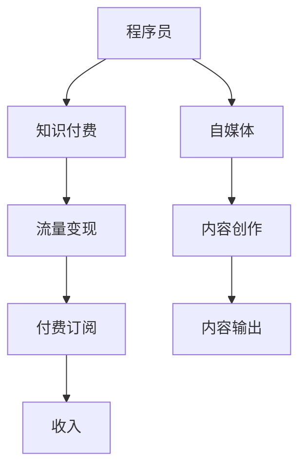

                 

# 程序员利用知识付费实现财富增值

## 1. 背景介绍

随着互联网技术的快速发展，知识付费成为新时代下一种新兴的商业模式。知识的价值正在被越来越多的人所认可，如何利用自己的专业知识实现财富增值，成为越来越多程序开发者关注的焦点。本文将从程序员的角度出发，探讨如何通过知识付费的方式实现财富增值，并结合实际案例进行分析。

## 2. 核心概念与联系

### 2.1 核心概念概述

- **知识付费**：指通过互联网平台为消费者提供专业知识，按次或按年付费的商业模式。
- **程序员**：拥有编程技能，能够开发、维护软件应用程序的专家。
- **财富增值**：通过有效的商业策略或技术手段，实现资产的增值。
- **自媒体**：指通过网络平台，如微信公众号、微博等，向大众发布内容，获取流量变现的个体或组织。

这些核心概念构成了本文的主要讨论框架，程序员通过知识付费模式，可以在自身专业知识的基础上，实现财富增值。

### 2.2 核心概念原理和架构的 Mermaid 流程图



在这个框架中，程序员通过自媒体平台发布专业知识，吸引用户付费订阅，实现流量变现，最终实现财富增值。

## 3. 核心算法原理 & 具体操作步骤

### 3.1 算法原理概述

知识付费的商业模式基于对知识和信息的高需求度。程序员拥有专业的编程知识和技能，他们可以通过在线课程、技术博客、视频教程等多种形式，向用户提供有价值的知识。用户通过付费获得这些知识，从而实现知识付费的闭环。

### 3.2 算法步骤详解

#### 3.2.1 定位知识领域
程序员首先需要定位自己的知识领域，如前端开发、后端开发、移动开发、人工智能等。通过深入研究特定领域，掌握核心技术，才能为用户提供真正有价值的知识。

#### 3.2.2 选择合适的知识付费平台
目前市面上有很多知识付费平台，如腾讯课堂、网易云课堂、得到等。程序员需要选择适合自己的平台，发布自己的课程或博客。

#### 3.2.3 内容创作与输出
在知识付费平台上，程序员需要创作和输出高质量的内容。内容应包括课程设计、技术讲解、案例分析等，使读者能够快速掌握相关技术。

#### 3.2.4 获取流量和订阅用户
通过推广自己的内容，吸引用户订阅和付费。程序员可以通过社交媒体、博客、论坛等多种方式推广自己的课程。

#### 3.2.5 持续更新与维护
知识付费是一个持续更新的过程。程序员需要不断更新课程内容，以保持课程的时效性和吸引力。

### 3.3 算法优缺点

#### 3.3.1 优点

- **高效率**：知识付费模式可以快速将知识变现，程序员通过提供高质量的内容，获取高收入。
- **灵活性**：程序员可以根据自己的兴趣和专业领域，选择适合自己的知识和技能进行变现。
- **范围广**：知识付费市场广阔，程序员可以在众多领域中选择自己的专长，获得广泛的受众。

#### 3.3.2 缺点

- **市场竞争激烈**：知识付费市场竞争激烈，需要程序员持续提升自身竞争力。
- **内容更新压力**：为了吸引用户，程序员需要不断更新课程内容，投入大量时间和精力。
- **技术迭代快**：技术更新迭代迅速，程序员需要时刻保持学习状态，以跟上技术发展的步伐。

### 3.4 算法应用领域

知识付费模式已经广泛应用于多个领域，包括编程、设计、金融、医疗等。程序员作为这些领域的专业人士，通过知识付费可以获取丰厚的回报，实现财富增值。

## 4. 数学模型和公式 & 详细讲解 & 举例说明

### 4.1 数学模型构建

假设程序员的知识总价值为 $V$，每节课的价格为 $P$，每节课的观众数量为 $N$，则通过知识付费实现的收入 $I$ 可以表示为：

$$
I = P \times N
$$

如果课程更新频率为 $F$，则每更新一次的收入为 $PF$。设总课时数为 $T$，则总课程收入 $I_{total}$ 为：

$$
I_{total} = I + I_{update} = P \times N + P \times F \times T
$$

### 4.2 公式推导过程

在知识付费的实际应用中，我们需要考虑多个因素的影响，如观众数量、课程更新频率、总课时数等。通过建立数学模型，我们可以更准确地估算收入。

以编程课程为例，观众数量 $N$ 受到课程内容质量、推广效果、市场需求等多方面因素的影响。假设课程质量固定，则 $N$ 可以用以下公式表示：

$$
N = \frac{V}{P}
$$

这里，$V$ 表示课程内容的总价值，$P$ 表示每节课的价格。由于观众数量与课程价格成反比，因此增加课程价格可能会减少观众数量，反之亦然。

### 4.3 案例分析与讲解

以某知名编程课程为例，该课程定价为每节99元，总课时数为200。假设每节课的观众数量为1000，则每节课的收入为 $99 \times 1000 = 99000$ 元。

如果该课程每半年更新一次，每次更新增加50课时，假设更新后的观众数量增加10%，则更新后的收入为：

$$
I_{update} = 99 \times 0.1 \times 50 \times 200 = 99000 \times 1.1 = 108900
$$

总课程收入为：

$$
I_{total} = 99000 + 108900 = 207900
$$

通过这个案例可以看出，更新频率和课程质量对知识付费的收入有显著影响。

## 5. 项目实践：代码实例和详细解释说明

### 5.1 开发环境搭建

要在知识付费平台上发布课程，首先需要搭建开发环境。以微信公众号为例：

1. 注册并登录微信公众号平台。
2. 通过微信开发者工具进行功能开发。
3. 配置开发环境，包括API密钥、服务器地址等。

### 5.2 源代码详细实现

以下是一个简单的Python脚本，用于实现知识付费的课程发布：

```python
import requests

# 配置API密钥和服务器地址
api_key = 'your_api_key'
server_url = 'https://yourserver.com/api/courses'

# 创建课程数据
course_data = {
    'title': 'Python编程入门',
    'price': 99,
    'hours': 200,
    'update_frequency': 6
}

# 发送API请求
response = requests.post(server_url, data=course_data, headers={'Authorization': api_key})

# 处理响应
if response.status_code == 200:
    print('课程发布成功')
else:
    print('课程发布失败')
```

### 5.3 代码解读与分析

这个Python脚本实现了向知识付费平台发送API请求，创建并发布课程的功能。其中，`api_key` 是API密钥，`server_url` 是服务器地址。

### 5.4 运行结果展示

通过执行上述代码，可以在知识付费平台上成功发布课程。发布后的课程会生成唯一的课程ID，用户可以通过课程ID订阅课程。

## 6. 实际应用场景

### 6.1 技术博客与专栏

许多程序员通过技术博客和专栏，分享自己的专业知识和经验。例如，阮一峰、周志华等知名程序员都通过技术博客，吸引了大量读者和粉丝。他们通过广告、付费文章、打赏等方式，实现了丰厚的收入。

### 6.2 在线课程与视频

在线课程和视频是知识付费的主要形式之一。程序员可以通过录制视频教程，或在平台上发布在线课程，向用户传授编程技巧和专业知识。例如，CSDN学院、慕课网等平台都有大量的程序员课程，吸引了大量学员订阅和付费。

### 6.3 技术咨询与指导

一些程序员具备丰富的项目经验和技术背景，他们可以提供技术咨询和指导服务。例如，通过在线咨询、电话咨询、邮件咨询等方式，帮助用户解决技术问题。这种方式虽然收入较低，但时间自由，适合想要平衡工作与生活的程序员。

## 7. 工具和资源推荐

### 7.1 学习资源推荐

- **在线课程**：如Coursera、edX、慕课网等，提供各种编程和计算机科学的课程。
- **技术博客**：如CSDN、知乎等，发表技术文章，吸引读者关注。
- **视频教程**：如Bilibili、YouTube等，录制和发布编程教程。

### 7.2 开发工具推荐

- **IDE**：如Visual Studio Code、PyCharm等，提高编程效率。
- **视频编辑工具**：如Adobe Premiere Pro、DaVinci Resolve等，制作高质量的视频课程。
- **图形化设计工具**：如Adobe Photoshop、Sketch等，设计课程海报和宣传素材。

### 7.3 相关论文推荐

- **《知识付费平台的用户价值感知与支付意愿研究》**：分析用户对知识付费平台的感知和支付意愿。
- **《知识付费的经济学分析》**：从经济学角度探讨知识付费的商业模式。
- **《知识付费时代的内容创作与用户获取策略》**：探讨知识付费平台的内容创作和用户获取策略。

## 8. 总结：未来发展趋势与挑战

### 8.1 未来发展趋势

- **个性化服务**：知识付费平台将提供更个性化的服务，根据用户需求推荐课程。
- **人工智能应用**：利用人工智能技术，如推荐系统、聊天机器人等，提升用户体验。
- **多样化形式**：知识付费形式将更加多样化，包括在线课程、视频、文章、讲座等。

### 8.2 面临的挑战

- **市场竞争**：知识付费市场竞争激烈，需要程序员持续提升自己的竞争力。
- **内容质量**：知识付费的核心在于内容质量，程序员需要不断提升自身知识和技能，保持课程的时效性和创新性。
- **用户获取**：如何吸引和留住用户，是知识付费平台和程序员共同面临的挑战。

### 8.3 研究展望

未来知识付费的发展方向将是更深入的技术应用和更广泛的领域覆盖。通过大数据、人工智能等技术，知识付费将实现更高效、更精准的用户推荐和服务。同时，知识付费的覆盖范围将进一步扩大，涵盖更多垂直领域，为用户提供更加全面和专业的知识服务。

## 9. 附录：常见问题与解答

**Q1: 如何选择合适的知识付费平台？**

A: 选择知识付费平台应考虑平台的知名度、用户数量、课程质量等因素。同时，平台是否提供有效的技术支持和服务保障也是重要考量。

**Q2: 如何提升课程的吸引力？**

A: 提升课程吸引力需要不断优化课程内容和形式，包括增加互动环节、设计有趣案例等。同时，定期更新课程内容，保持课程的时效性和创新性。

**Q3: 如何平衡课程更新频率和质量？**

A: 合理设置课程更新频率，确保更新内容质量。过于频繁的更新可能导致质量下降，影响用户信任；过于缓慢的更新则可能无法满足用户需求。

**Q4: 如何有效推广课程？**

A: 利用社交媒体、博客、论坛等多种渠道推广课程。可以邀请知名人士推荐课程，参与线上线下的交流活动，增加课程曝光度。

通过以上讨论，程序员可以更好地利用知识付费实现财富增值，提高自身的经济收入和生活质量。但需要持续提升自身专业技能，优化课程内容，提高服务质量，才能在知识付费的市场竞争中脱颖而出。

---

作者：禅与计算机程序设计艺术 / Zen and the Art of Computer Programming

