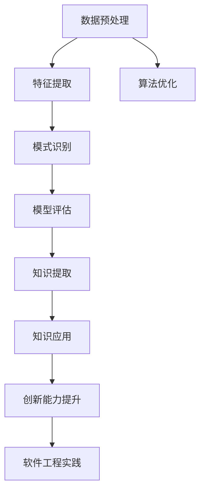

                 

# 程序员利用知识发现引擎提高创新能力的途径

> 关键词：知识发现引擎,创新能力,软件工程,算法优化,数据驱动,实验设计,实践与理论

## 1. 背景介绍

### 1.1 问题由来
在当今高速发展的IT行业中，技术创新能力是企业能否持续发展的关键因素。然而，技术的快速发展也带来了新的挑战：如何在海量数据和复杂任务中挖掘出有用的知识，并将其转化为可行的解决方案，成为每一个软件工程师必须面对的问题。面对这些挑战，知识发现引擎（Knowledge Discovery Engine, KDE）应运而生，通过自动化挖掘数据中的知识模式，帮助程序员在解决实际问题时提供强有力的支撑，从而显著提升其创新能力。

### 1.2 问题核心关键点
知识发现引擎的核心在于如何有效地从数据中提取出有价值的信息，并转化为可操作的知识，以促进技术创新。具体来说，问题核心关键点包括：
- 如何高效地从大量数据中提取关键信息。
- 如何将提取出的知识与具体的技术场景和任务相匹配。
- 如何通过验证和优化，将知识转化为可行的解决方案。
- 如何评估知识发现过程的有效性和创新性。

这些关键点构成了知识发现引擎在提升程序员创新能力方面的主要路径，下面将通过分析、实验设计和实践案例来详细介绍。

## 2. 核心概念与联系

### 2.1 核心概念概述

为了更好地理解知识发现引擎如何帮助程序员提升创新能力，本节将介绍几个关键概念：

- **知识发现引擎 (KDE)**：通过自动化分析大规模数据集，从中发现模式和规律，并提取有用信息的技术。它涵盖了数据预处理、特征提取、模式识别和模型评估等步骤，旨在从原始数据中提取有价值的知识。
- **创新能力**：指程序员在解决问题、设计系统、优化算法等方面提出新颖思路和解决方案的能力。
- **软件工程**：指应用科学原理来开发、维护和更新软件的过程，包括需求分析、设计、编码、测试、维护等多个阶段。
- **算法优化**：通过改进算法设计和调整算法参数，提高算法性能的过程。
- **数据驱动**：利用数据来指导决策和行动，以提高决策的准确性和效率。
- **实验设计**：通过设计有针对性的实验，验证假设、优化模型、评估效果的过程。

这些核心概念之间存在密切联系。知识发现引擎通过数据驱动的方式，结合软件工程的实践，借助算法优化的技术手段，为程序员提供强有力的知识支持，从而提升其创新能力。

### 2.2 核心概念原理和架构的 Mermaid 流程图



这个流程图展示了知识发现引擎从数据到创新的全流程，从数据预处理到知识提取，再到知识应用和创新能力提升，最后融入软件工程实践，形成了一个完整的知识发现和应用循环。

## 3. 核心算法原理 & 具体操作步骤

### 3.1 算法原理概述

知识发现引擎的核心算法原理主要是通过数据挖掘和机器学习等技术，自动分析数据集，发现潜在的模式和规律，从而提取有价值的信息。其核心步骤包括：

1. **数据预处理**：清洗、过滤和转换原始数据，使其适合进行后续分析。
2. **特征提取**：从数据中提取出有意义的特征，以便进行模式识别。
3. **模式识别**：使用机器学习算法，识别数据中的潜在模式和规律。
4. **模型评估**：评估发现的模式的有效性，并优化模型以提高其准确性。
5. **知识提取**：从模型中提取有用信息，转化为具体的知识库。

### 3.2 算法步骤详解

知识发现引擎的具体操作步骤如下：

1. **数据收集与预处理**：
   - 收集相关数据集，包括软件代码、性能测试结果、用户反馈等。
   - 进行数据清洗，去除噪声和无用数据。
   - 转换数据格式，使其适合分析。

2. **特征提取与选择**：
   - 使用统计方法或机器学习算法，从数据中提取特征。
   - 根据特征的重要性，选择最相关的特征。

3. **模式识别**：
   - 应用机器学习算法，如分类、聚类、关联规则等，识别数据中的模式。
   - 使用特征选择算法，优化模型以提高识别精度。

4. **模型评估**：
   - 使用交叉验证等方法，评估模型的性能。
   - 调整模型参数，提高模型的准确性。

5. **知识提取**：
   - 将模型中的有用信息转化为具体的知识库。
   - 根据具体的应用场景，提取合适的知识信息。

### 3.3 算法优缺点

知识发现引擎的优点包括：

- **自动化分析**：通过自动化技术，快速从大量数据中提取有价值的信息。
- **数据驱动决策**：基于实际数据，提供更客观的决策支持。
- **提高创新能力**：提取的知识有助于解决实际问题，提升创新能力。

其缺点则主要包括：

- **数据质量依赖**：知识发现的质量很大程度上取决于数据的完整性和质量。
- **算法复杂度**：复杂的算法可能存在过拟合等问题。
- **解释性不足**：提取的模型可能难以解释其内部的工作机制。

### 3.4 算法应用领域

知识发现引擎在软件工程和算法优化等领域有着广泛的应用，具体包括：

1. **软件质量分析**：通过分析代码质量指标、性能数据等，发现潜在问题，提升软件质量。
2. **系统设计优化**：根据系统需求和使用情况，优化系统设计，提高系统性能。
3. **算法性能评估**：通过实验设计，评估不同算法在特定任务上的性能，指导算法选择。
4. **知识管理与共享**：构建知识库，存储和共享关键信息，促进团队知识共享。
5. **用户行为分析**：分析用户行为数据，优化用户体验，提升用户满意度。

## 4. 数学模型和公式 & 详细讲解 & 举例说明

### 4.1 数学模型构建

知识发现引擎通常使用机器学习模型来识别数据中的模式和规律。以分类模型为例，数学模型构建如下：

假设数据集为 $D=\{(x_i, y_i)\}_{i=1}^N$，其中 $x_i$ 为输入特征，$y_i$ 为对应的标签。分类模型的目标是找到一个映射 $f$，使得 $f(x)$ 预测 $y$ 的准确性最大化。

### 4.2 公式推导过程

以决策树为例，其核心推导过程如下：

1. **信息增益计算**：
   $$
   \text{Gain}(D, A) = \sum_{a \in A} \frac{|D_a|}{|D|} \times \text{Entropy}(D_a)
   $$

2. **选择最优特征**：
   $$
   \text{BestAttribute} = \text{argmax}_{A} \text{Gain}(D, A)
   $$

3. **构建决策树**：
   - 以选择的最优特征 $A$ 为根节点，递归地划分数据集。
   - 根据不同特征值，将数据集划分为子集。

4. **模型评估**：
   - 使用交叉验证等方法，评估模型的准确性。
   - 调整模型参数，提高模型的性能。

### 4.3 案例分析与讲解

以软件质量分析为例，知识发现引擎可以帮助识别代码中的潜在问题。例如，通过分析代码的复杂度、重复代码等指标，发现高复杂度的代码可能导致维护难度增加。知识发现引擎可以将这些知识转化为具体的改进建议，帮助程序员提升代码质量。

## 5. 项目实践：代码实例和详细解释说明

### 5.1 开发环境搭建

在实践中，通常需要使用Python语言，并配合相应的数据处理和机器学习库。以下是开发环境搭建的具体步骤：

1. **安装Python**：下载并安装Python，通常使用3.x版本。
2. **安装相关库**：安装numpy、pandas、scikit-learn等库。
3. **配置环境**：设置Python路径和虚拟环境。

### 5.2 源代码详细实现

以构建一个简单的决策树分类器为例：

```python
from sklearn.datasets import load_iris
from sklearn.model_selection import train_test_split
from sklearn.tree import DecisionTreeClassifier
from sklearn.metrics import accuracy_score

# 加载数据集
iris = load_iris()
X = iris.data
y = iris.target

# 划分数据集
X_train, X_test, y_train, y_test = train_test_split(X, y, test_size=0.2, random_state=42)

# 构建决策树模型
model = DecisionTreeClassifier()
model.fit(X_train, y_train)

# 预测并评估
y_pred = model.predict(X_test)
accuracy = accuracy_score(y_test, y_pred)
print(f"Accuracy: {accuracy:.2f}")
```

### 5.3 代码解读与分析

以上代码实现了决策树分类器的构建、训练和评估。关键步骤如下：

1. **加载数据集**：使用scikit-learn库加载鸢尾花数据集。
2. **划分数据集**：将数据集划分为训练集和测试集。
3. **构建模型**：定义决策树模型，并进行训练。
4. **预测和评估**：使用测试集进行预测，并计算模型准确率。

## 6. 实际应用场景

### 6.1 软件开发质量分析

知识发现引擎在软件开发质量分析中有着广泛应用。通过分析代码的复杂度、重复代码、耦合度等指标，发现潜在的质量问题，帮助程序员改进代码结构，提升软件质量。

### 6.2 系统设计优化

知识发现引擎可以分析系统需求和使用情况，发现性能瓶颈，指导系统设计优化。例如，通过分析系统负载和响应时间，优化数据访问策略，提升系统性能。

### 6.3 算法性能评估

知识发现引擎可以设计实验，评估不同算法在特定任务上的性能。例如，比较不同排序算法的效率，选择最优算法。

### 6.4 未来应用展望

未来，知识发现引擎将在更多的应用场景中发挥重要作用。例如，在医疗领域，通过分析患者数据，发现疾病模式和规律，提供个性化的医疗建议；在金融领域，分析市场数据，预测股票走势，优化投资策略。

## 7. 工具和资源推荐

### 7.1 学习资源推荐

为了帮助开发者系统掌握知识发现引擎的理论基础和实践技巧，这里推荐一些优质的学习资源：

1. 《数据挖掘导论》：介绍数据挖掘的基本概念和常用技术。
2. 《机器学习》：深入讲解机器学习的基本原理和算法。
3. 《Python数据科学手册》：详细介绍Python在数据科学和机器学习中的应用。
4. Coursera《数据科学与机器学习》课程：由斯坦福大学和哥伦比亚大学提供的在线课程，系统讲解数据挖掘和机器学习技术。
5. Kaggle：提供丰富的数据集和机器学习竞赛，帮助开发者实践和提升技能。

通过这些资源的学习实践，相信你一定能够快速掌握知识发现引擎的精髓，并用于解决实际的NLP问题。

### 7.2 开发工具推荐

高效的开发离不开优秀的工具支持。以下是几款用于知识发现引擎开发的常用工具：

1. Python：作为数据科学和机器学习的主流语言，具有丰富的库和框架支持。
2. Jupyter Notebook：交互式编程环境，方便开发者进行代码实验和结果展示。
3. TensorFlow：由Google主导开发的深度学习框架，支持多种机器学习算法。
4. Scikit-learn：Python的机器学习库，提供丰富的数据预处理和模型构建功能。
5. PyTorch：由Facebook开发的深度学习框架，支持动态计算图和高效计算。

合理利用这些工具，可以显著提升知识发现引擎的开发效率，加快创新迭代的步伐。

### 7.3 相关论文推荐

知识发现引擎的研究源于学界的持续探索。以下是几篇奠基性的相关论文，推荐阅读：

1. "ID3: A Program for Inductive Inference"（J. Ross Quinlan）：介绍ID3决策树算法的原理和实现。
2. "The Elements of Statistical Learning"（Tibshirani, Hastie, & Friedman）：深入讲解统计学习的基本概念和常用算法。
3. "The Mining of Massive Datasets"（J. Han & M. Kamber）：介绍数据挖掘的基本技术和应用场景。
4. "Feature Engineering for Effective Algorithms"（G. H. Williams）：介绍特征工程的基本技术和常用方法。

这些论文代表了大规模数据挖掘和机器学习的发展脉络。通过学习这些前沿成果，可以帮助研究者把握学科前进方向，激发更多的创新灵感。

## 8. 总结：未来发展趋势与挑战

### 8.1 研究成果总结

本文对知识发现引擎在提升程序员创新能力方面的作用进行了全面系统的介绍。首先阐述了知识发现引擎在数据驱动和算法优化方面的基本原理和操作步骤，明确了其在软件工程和算法优化中的核心价值。其次，从理论到实践，详细讲解了知识发现引擎的数学模型和算法实现，给出了具体的代码实例和分析。同时，本文还广泛探讨了知识发现引擎在软件开发质量分析、系统设计优化、算法性能评估等实际应用场景中的应用前景，展示了其在技术创新中的强大潜力。最后，本文精选了知识发现引擎的学习资源和工具，力求为开发者提供全方位的技术指引。

### 8.2 未来发展趋势

展望未来，知识发现引擎将在多个领域继续发挥重要作用，并呈现以下发展趋势：

1. **自动化与智能化**：随着深度学习技术的发展，知识发现引擎将更加自动化和智能化，能够处理更复杂的数据类型和结构。
2. **多模态融合**：未来的知识发现引擎将能够处理多种数据类型，如文本、图像、音频等，实现多模态数据的融合分析。
3. **实时化与动态化**：实时数据处理和动态模型优化将使得知识发现引擎更加灵活和高效。
4. **跨领域应用**：知识发现引擎将在更多领域得到应用，如医疗、金融、教育等，提升各行业的智能化水平。

### 8.3 面临的挑战

尽管知识发现引擎已经取得了显著的成果，但在迈向更加智能化、普适化应用的过程中，它仍面临诸多挑战：

1. **数据质量**：数据缺失、噪声和异构性等问题，是知识发现引擎面临的首要挑战。
2. **模型复杂度**：复杂的模型可能导致过拟合和计算效率低下，需要进一步优化。
3. **可解释性**：知识发现引擎的模型和算法往往难以解释其内部的工作机制，影响其可信度。
4. **实时性**：大规模数据集的处理和分析，可能面临计算资源不足的问题。
5. **跨领域应用**：知识发现引擎在跨领域应用中，需要适应不同领域的特征和需求。

### 8.4 研究展望

未来的研究需要在以下几个方面寻求新的突破：

1. **提高数据处理能力**：开发高效的数据清洗和预处理算法，提升数据质量。
2. **优化模型结构**：改进模型算法，提高其泛化能力和计算效率。
3. **增强可解释性**：开发可解释性更强的模型和算法，提升模型的可信度。
4. **提升实时性**：使用分布式计算和实时数据处理技术，提高知识发现引擎的实时性。
5. **适应跨领域应用**：开发跨领域的知识发现引擎，适应不同领域的特征和需求。

这些研究方向的探索，必将引领知识发现引擎技术迈向更高的台阶，为构建安全、可靠、可解释、可控的智能系统铺平道路。面向未来，知识发现引擎需要与其他人工智能技术进行更深入的融合，如自然语言处理、计算机视觉、强化学习等，共同推动人工智能技术的进步。只有勇于创新、敢于突破，才能不断拓展知识发现引擎的边界，让智能技术更好地造福人类社会。

## 9. 附录：常见问题与解答

**Q1: 知识发现引擎如何提升程序员的创新能力？**

A: 知识发现引擎通过自动化挖掘数据中的知识模式，帮助程序员在解决实际问题时提供强有力的支撑，从而显著提升其创新能力。具体来说，知识发现引擎可以帮助程序员：

1. **发现隐藏知识**：通过分析大规模数据集，发现潜在的模式和规律，提取有用信息。
2. **优化算法设计**：通过评估不同算法的性能，选择最优算法，优化算法设计。
3. **改进系统设计**：分析系统需求和使用情况，优化系统设计，提高系统性能。
4. **提升代码质量**：分析代码质量指标，发现潜在的质量问题，提升代码质量。
5. **改善用户体验**：分析用户行为数据，优化用户体验，提升用户满意度。

**Q2: 如何使用知识发现引擎进行软件开发质量分析？**

A: 知识发现引擎可以帮助程序员进行软件开发质量分析，具体步骤如下：

1. **数据收集**：收集软件代码、性能测试结果等数据。
2. **数据预处理**：清洗、过滤和转换原始数据，去除噪声和无用数据。
3. **特征提取**：从数据中提取出有意义的特征，如代码复杂度、重复代码等。
4. **模式识别**：使用机器学习算法，识别数据中的模式，如代码缺陷模式。
5. **模型评估**：使用交叉验证等方法，评估模型的性能。
6. **知识提取**：将模型中的有用信息转化为具体的改进建议，帮助程序员提升代码质量。

**Q3: 知识发现引擎在跨领域应用中面临哪些挑战？**

A: 知识发现引擎在跨领域应用中面临的挑战主要包括：

1. **数据异构性**：不同领域的特征和数据格式可能存在差异，需要针对性地进行数据预处理。
2. **领域知识**：不同领域的知识库和规则库可能不同，需要结合领域知识进行知识发现。
3. **模型泛化能力**：不同领域的模式和规律可能不同，需要开发适应不同领域的模型和算法。
4. **实时性**：跨领域的实时数据处理和分析，可能面临计算资源不足的问题。
5. **可解释性**：跨领域的知识发现过程需要更高的可解释性，以便于理解和信任。

这些挑战需要通过持续的研究和优化来解决，才能使知识发现引擎在跨领域应用中发挥更大的作用。

---

作者：禅与计算机程序设计艺术 / Zen and the Art of Computer Programming

