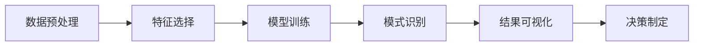

                 

# 程序员利用知识发现引擎提高竞争优势

## 1. 背景介绍

随着人工智能和大数据技术的迅猛发展，知识发现（Knowledge Discovery, KD）和数据挖掘（Data Mining）成为了现代企业和组织提升竞争力的重要手段。知识发现引擎（Knowledge Discovery Engine, KDE）是一种集成多种数据挖掘技术的智能软件系统，它通过自动化分析和挖掘大数据，为决策者提供宝贵的知识和洞察，帮助他们做出更准确、更快速的决策。本文将探讨程序员如何利用知识发现引擎提高其竞争优势，重点讨论KDE的基本原理、核心算法以及具体的应用场景和未来发展趋势。

## 2. 核心概念与联系

### 2.1 核心概念概述

- **知识发现引擎（KDE）**：是一种利用数据挖掘技术，从大规模数据中自动发现有用知识的软件系统。KDE一般包括数据预处理、特征选择、模型训练、模式识别、结果可视化等多个模块，能够有效地挖掘出隐藏在数据背后的有用信息和规律。

- **数据挖掘（DM）**：是从大量数据中提取有价值信息的过程，常用于市场分析、客户行为分析、欺诈检测等领域。数据挖掘涉及统计学、机器学习、模式识别等技术，是知识发现的重要基础。

- **数据预处理**：包括数据清洗、归一化、采样等步骤，是知识发现的基础环节。数据预处理能够去除噪音和异常值，提升数据质量。

- **特征选择**：是知识发现中的关键步骤，旨在从原始数据中选择最具代表性的特征，以便更好地训练模型和提高预测精度。

- **模型训练**：利用训练数据集，选择合适的算法进行模型训练，生成能够捕捉数据特征和规律的模型。

- **模式识别**：是指通过分类、聚类、关联规则等方法，从数据中识别出有意义的规律和模式，为决策提供依据。

- **结果可视化**：将知识发现的结果以图形、图表等形式直观展示，便于决策者理解和应用。

### 2.2 核心概念原理和架构的 Mermaid 流程图(Mermaid 流程节点中不要有括号、逗号等特殊字符)



## 3. 核心算法原理 & 具体操作步骤

### 3.1 算法原理概述

知识发现引擎的核心算法主要包括以下几个部分：

1. **数据预处理**：对原始数据进行清洗、归一化、采样等操作，以提高数据质量和一致性。
2. **特征选择**：从原始数据中提取最具有代表性和区分度的特征，以便更好地训练模型和提高预测精度。
3. **模型训练**：选择合适的算法（如分类、聚类、回归等），对特征集进行训练，生成能够捕捉数据特征和规律的模型。
4. **模式识别**：通过分类、聚类、关联规则等方法，从数据中识别出有意义的规律和模式，为决策提供依据。
5. **结果可视化**：将知识发现的结果以图形、图表等形式直观展示，便于决策者理解和应用。

### 3.2 算法步骤详解

#### 数据预处理

数据预处理的目标是通过一系列数据清洗、归一化和采样操作，提高数据质量和一致性，为后续的特征选择和模型训练打下坚实的基础。数据预处理的具体步骤包括：

1. **数据清洗**：去除缺失值、重复值、异常值等噪音数据，保证数据集的一致性和完整性。
2. **数据归一化**：对数据进行标准化处理，使其在同一个尺度上，便于后续的特征选择和模型训练。
3. **数据采样**：根据业务需求和数据分布，进行随机抽样或分层抽样，减小数据集大小，提高计算效率。

#### 特征选择

特征选择是知识发现中的关键步骤，旨在从原始数据中提取最具有代表性和区分度的特征，以便更好地训练模型和提高预测精度。特征选择的方法包括：

1. **过滤式特征选择**：通过计算特征与目标变量之间的相关性或卡方检验等统计量，筛选出最相关特征。
2. **嵌入式特征选择**：在模型训练过程中，利用正则化项或惩罚项，自动筛选出最优特征。
3. **包裹式特征选择**：通过构建和评估多种模型，选择性能最优的特征子集。

#### 模型训练

模型训练的目的是利用训练数据集，选择合适的算法（如分类、聚类、回归等）进行模型训练，生成能够捕捉数据特征和规律的模型。模型训练的步骤包括：

1. **选择合适的算法**：根据数据类型和业务需求，选择合适的算法（如决策树、支持向量机、神经网络等）。
2. **分割数据集**：将数据集划分为训练集和测试集，用于模型训练和验证。
3. **模型训练**：利用训练集对模型进行训练，调整模型参数，使其能够最好地拟合训练数据。

#### 模式识别

模式识别是指通过分类、聚类、关联规则等方法，从数据中识别出有意义的规律和模式，为决策提供依据。模式识别的步骤包括：

1. **分类**：利用分类算法（如K-means、SVM等）将数据集分成若干个类别，识别出不同类别的数据模式。
2. **聚类**：利用聚类算法（如DBSCAN、GMM等）将数据集分成若干个群组，识别出数据的内在结构和分布规律。
3. **关联规则**：利用关联规则算法（如Apriori、FP-Growth等）挖掘出数据中的频繁项集和关联规则，发现数据之间的隐含关系。

#### 结果可视化

结果可视化是将知识发现的结果以图形、图表等形式直观展示，便于决策者理解和应用。结果可视化的步骤包括：

1. **选择合适的可视化工具**：根据数据类型和业务需求，选择合适的可视化工具（如Tableau、PowerBI等）。
2. **设计可视化方案**：设计可视化方案，包括选择图表类型、设置参数、调整布局等。
3. **生成可视化结果**：利用可视化工具，生成图表、地图、热力图等可视化结果，直观展示数据特征和规律。

### 3.3 算法优缺点

**优点**：

1. **自动化**：知识发现引擎能够自动化地进行数据预处理、特征选择、模型训练和模式识别，大大减少了人工干预和调试工作量。
2. **高效性**：通过并行计算和优化算法，知识发现引擎能够高效地处理大规模数据，提高分析和挖掘的效率。
3. **可解释性**：知识发现引擎能够生成可视化的结果，便于决策者理解和应用，提高了分析的可解释性和透明度。

**缺点**：

1. **依赖数据质量**：知识发现引擎依赖于高质量的数据集，如果数据存在噪音、缺失或异常值，可能会影响分析和挖掘的结果。
2. **算法复杂性**：知识发现引擎涉及多种算法和模型，需要一定的数学和统计学基础，对于非专业人士可能有一定的门槛。
3. **结果解释性**：知识发现引擎生成的结果需要人工解释和验证，才能真正转化为业务价值。

### 3.4 算法应用领域

知识发现引擎在多个领域得到了广泛应用，包括但不限于以下几类：

1. **金融风险管理**：通过分析交易数据，识别出异常交易行为，及时预警潜在的金融风险。
2. **市场营销**：利用客户行为数据，分析客户偏好和购买意愿，制定个性化的营销策略。
3. **供应链管理**：通过分析供应链数据，优化库存管理、预测需求变化，提高供应链的响应速度和效率。
4. **客户关系管理**：利用客户数据，识别出高价值客户，制定差异化的客户管理策略。
5. **医疗诊断**：通过分析医疗数据，识别出疾病的早期预警信号，提高医疗诊断的准确性和及时性。

## 4. 数学模型和公式 & 详细讲解 & 举例说明

### 4.1 数学模型构建

知识发现引擎的数学模型构建通常包括以下几个步骤：

1. **数据表示**：将原始数据转化为向量或矩阵形式，便于后续的数学计算和处理。
2. **特征选择**：通过选择最优特征子集，提高模型的精度和泛化能力。
3. **模型训练**：利用训练数据集，选择合适的算法进行模型训练，生成能够捕捉数据特征和规律的模型。
4. **模式识别**：通过分类、聚类、关联规则等方法，从数据中识别出有意义的规律和模式。

### 4.2 公式推导过程

以下以分类问题为例，推导决策树模型的数学公式和推导过程。

假设数据集为 $\{(x_1, y_1), (x_2, y_2), ..., (x_n, y_n)\}$，其中 $x$ 为输入特征向量，$y$ 为标签。决策树模型的目标是找到一个最优的树结构，使得分类误差最小。

假设当前节点为 $t$，特征为 $A_t$，则决策树模型在节点 $t$ 的分类误差为：

$$
L_t = \frac{1}{N}\sum_{i=1}^N \mathbf{1}(y_i \neq f_t(x_i))
$$

其中 $f_t(x_i)$ 表示在节点 $t$ 下，输入 $x_i$ 的分类结果，$\mathbf{1}(y_i \neq f_t(x_i))$ 表示分类错误的概率。

决策树模型的目标是最小化分类误差，因此需要递归地选择最优特征和划分点，构建决策树。假设当前节点为 $t$，特征为 $A_t$，候选划分点为 $x_{j,t}$，则最优划分点的选择标准为：

$$
A_t = \arg\min_{A_t} \sum_{i=1}^N \sum_{j=1}^{|\mathcal{Y}|} [L_t(A_t) + \frac{\lambda}{|\mathcal{Y}|} |\mathcal{Y} - L_t(A_t)|^2]
$$

其中 $|\mathcal{Y}|$ 为类别数目，$\lambda$ 为正则化系数。

在得到最优划分点后，决策树模型可以递归地进行下一层划分，直至达到叶子节点。最终的决策树模型可以表示为：

$$
f(x) = \begin{cases}
1, & x \in \text{Leaves}(T) \\
\text{Left}(T[x]), & x \in \text{Left}(T[x]) \\
\text{Right}(T[x]), & x \in \text{Right}(T[x])
\end{cases}
$$

其中 $\text{Left}(T[x])$ 和 $\text{Right}(T[x])$ 表示在节点 $T[x]$ 下的左子树和右子树。

### 4.3 案例分析与讲解

#### 案例1：金融欺诈检测

假设某银行想要利用知识发现引擎进行欺诈检测，可以使用决策树模型进行分类。具体步骤如下：

1. **数据预处理**：收集银行交易数据，进行清洗、归一化和采样。
2. **特征选择**：选择与欺诈行为相关的特征（如交易金额、交易时间、IP地址等）。
3. **模型训练**：利用历史交易数据，训练决策树模型，生成能够捕捉欺诈行为的分类器。
4. **模式识别**：通过分类算法，识别出异常交易行为，及时预警潜在的欺诈风险。
5. **结果可视化**：利用可视化工具，生成交易数据的分类结果和欺诈检测的可视化报表。

#### 案例2：零售客户细分

假设某零售企业想要利用知识发现引擎进行客户细分，可以使用聚类算法进行聚类分析。具体步骤如下：

1. **数据预处理**：收集客户购买数据，进行清洗、归一化和采样。
2. **特征选择**：选择与客户购买行为相关的特征（如购买频率、购买金额、购买时间等）。
3. **模型训练**：利用客户购买数据，训练聚类算法（如K-means、DBSCAN等），生成客户细分模型。
4. **模式识别**：通过聚类算法，识别出不同客户群体，制定个性化的营销策略。
5. **结果可视化**：利用可视化工具，生成客户细分结果的可视化报表。

## 5. 项目实践：代码实例和详细解释说明

### 5.1 开发环境搭建

#### 5.1.1 安装Python和相关依赖

1. 安装Python：从官网下载并安装Python，建议使用最新版本的Python 3.x。
2. 安装相关依赖：使用pip安装必要的Python库，如NumPy、Pandas、Scikit-learn、Matplotlib等。

```bash
pip install numpy pandas scikit-learn matplotlib
```

#### 5.1.2 搭建开发环境

1. 创建虚拟环境：
```bash
python -m venv myenv
source myenv/bin/activate
```

2. 安装相关库：
```bash
pip install scikit-learn pandas matplotlib
```

3. 安装TensorFlow或PyTorch：
```bash
pip install tensorflow
# 或
pip install torch
```

### 5.2 源代码详细实现

#### 5.2.1 数据预处理

```python
import numpy as np
import pandas as pd
from sklearn.preprocessing import StandardScaler

# 读取数据集
data = pd.read_csv('data.csv')

# 数据清洗
data = data.dropna()  # 去除缺失值
data = data.drop_duplicates()  # 去除重复值

# 数据归一化
scaler = StandardScaler()
data = scaler.fit_transform(data)

# 数据采样
data = data.sample(n=10000)  # 随机采样10000条数据
```

#### 5.2.2 特征选择

```python
from sklearn.feature_selection import SelectKBest, chi2

# 选择最优特征子集
features = data.columns[1:]  # 去除第一个特征
X = data[features]
y = data['label']

selector = SelectKBest(chi2, k=10)  # 选择10个最相关特征
X_selected = selector.fit_transform(X, y)

# 可视化选择结果
import matplotlib.pyplot as plt

plt.bar(features, selector.scores_)
plt.xticks(features, rotation=90)
plt.title('Feature Importance')
plt.show()
```

#### 5.2.3 模型训练

```python
from sklearn.tree import DecisionTreeClassifier

# 训练决策树模型
model = DecisionTreeClassifier(max_depth=5)
model.fit(X_selected, y)
```

#### 5.2.4 结果可视化

```python
import matplotlib.pyplot as plt

# 生成决策树模型结果
y_pred = model.predict(X_selected)

# 可视化决策树模型
from sklearn.tree import plot_tree

plt.figure(figsize=(10, 8))
plot_tree(model, filled=True)
plt.show()

# 可视化分类结果
plt.figure(figsize=(10, 6))
plt.bar(np.unique(y), np.bincount(y_pred))
plt.title('Classification Results')
plt.show()
```

### 5.3 代码解读与分析

#### 数据预处理

数据预处理是知识发现引擎的重要环节，其主要任务是去除噪音、异常值和缺失值，并对数据进行归一化处理，以便后续的特征选择和模型训练。在本案例中，使用了Python的Pandas库进行数据清洗、归一化和采样操作，并使用Scikit-learn库的StandardScaler进行归一化处理。

#### 特征选择

特征选择是知识发现引擎中的关键步骤，旨在从原始数据中提取最具代表性和区分度的特征。在本案例中，使用了Scikit-learn库的SelectKBest进行特征选择，选择了与分类任务最相关的10个特征。特征选择的结果通过可视化展示，直观展示了每个特征的重要性。

#### 模型训练

模型训练是知识发现引擎的核心环节，其主要任务是选择合适的算法（如决策树、支持向量机、神经网络等），对特征集进行训练，生成能够捕捉数据特征和规律的模型。在本案例中，使用了Scikit-learn库的DecisionTreeClassifier训练决策树模型，并设置了最大深度为5。

#### 结果可视化

结果可视化是将知识发现的结果以图形、图表等形式直观展示，便于决策者理解和应用。在本案例中，使用了Matplotlib库生成决策树模型的可视化结果，并使用Pandas库生成分类结果的条形图。

## 6. 实际应用场景

### 6.1 金融风险管理

在金融风险管理中，知识发现引擎可以通过分析交易数据，识别出异常交易行为，及时预警潜在的金融风险。例如，某银行可以利用知识发现引擎进行欺诈检测，通过分类算法训练模型，识别出异常交易行为，并及时预警潜在的欺诈风险。

### 6.2 市场营销

在市场营销中，知识发现引擎可以通过分析客户行为数据，识别出客户偏好和购买意愿，制定个性化的营销策略。例如，某零售企业可以利用知识发现引擎进行客户细分，通过聚类算法分析客户购买数据，识别出不同客户群体，并制定个性化的营销策略。

### 6.3 供应链管理

在供应链管理中，知识发现引擎可以通过分析供应链数据，优化库存管理、预测需求变化，提高供应链的响应速度和效率。例如，某制造企业可以利用知识发现引擎进行库存优化，通过聚类算法分析库存数据，识别出最优库存水平，并制定库存管理策略。

### 6.4 医疗诊断

在医疗诊断中，知识发现引擎可以通过分析医疗数据，识别出疾病的早期预警信号，提高医疗诊断的准确性和及时性。例如，某医院可以利用知识发现引擎进行疾病预测，通过分类算法训练模型，识别出患者的疾病风险，并及时预警潜在疾病风险。

## 7. 工具和资源推荐

### 7.1 学习资源推荐

1. **《Python数据科学手册》**：介绍了Python在数据科学中的应用，涵盖了数据预处理、特征选择、模型训练等知识。
2. **《机器学习实战》**：讲解了多种机器学习算法和应用，提供了丰富的代码实例和案例分析。
3. **Coursera《机器学习》课程**：由斯坦福大学教授Andrew Ng主讲，涵盖机器学习的理论和实践。
4. **Kaggle竞赛**：提供了大量的数据集和竞赛项目，通过实践学习机器学习和数据挖掘技术。

### 7.2 开发工具推荐

1. **PyCharm**：一个流行的Python IDE，支持Python数据分析和机器学习开发。
2. **Jupyter Notebook**：一个交互式编程环境，支持Python和R语言的数据分析和机器学习开发。
3. **Tableau**：一个数据可视化工具，支持多种数据格式和图表类型。

### 7.3 相关论文推荐

1. **《数据挖掘：概念与技术》**：介绍了数据挖掘的基本概念和算法，适合入门学习。
2. **《机器学习》**：介绍了机器学习的基本理论和算法，适合进阶学习。
3. **《深度学习》**：介绍了深度学习的基本理论和应用，适合深入学习。

## 8. 总结：未来发展趋势与挑战

### 8.1 未来发展趋势

知识发现引擎的未来发展趋势主要包括以下几个方面：

1. **自动化程度提高**：未来知识发现引擎将更加自动化和智能化，能够自动进行数据预处理、特征选择和模型训练，提高分析效率和精度。
2. **多模态融合**：未来知识发现引擎将支持多种数据格式和数据类型，支持多模态数据的融合，提高分析和挖掘的能力。
3. **实时分析**：未来知识发现引擎将支持实时数据流处理，能够实时分析和挖掘数据，提高决策的速度和精度。
4. **智能化决策**：未来知识发现引擎将结合人工智能技术，提供智能化决策支持，提高决策的科学性和可靠性。

### 8.2 面临的挑战

知识发现引擎在实际应用中仍面临一些挑战：

1. **数据质量问题**：数据质量问题仍然是知识发现引擎的主要挑战之一，数据存在噪音、缺失和异常值，可能影响分析和挖掘的结果。
2. **算法复杂性**：知识发现引擎涉及多种算法和模型，需要一定的数学和统计学基础，对于非专业人士可能有一定的门槛。
3. **结果解释性**：知识发现引擎生成的结果需要人工解释和验证，才能真正转化为业务价值。

### 8.3 研究展望

未来知识发现引擎的研究展望主要包括以下几个方面：

1. **自动化和智能化**：通过自动化和智能化技术，提高知识发现引擎的自动化程度和智能化水平。
2. **多模态融合**：支持多种数据格式和数据类型的融合，提高分析和挖掘的能力。
3. **实时分析**：支持实时数据流处理，提高决策的速度和精度。
4. **智能化决策**：结合人工智能技术，提供智能化决策支持，提高决策的科学性和可靠性。

## 9. 附录：常见问题与解答

### 9.1 Q1：如何选择合适的特征进行特征选择？

A: 特征选择的关键是选择与目标变量最相关的特征。常用的特征选择方法包括过滤式、嵌入式和包裹式三种方法。过滤式特征选择基于统计量（如相关系数、卡方检验等）选择最优特征；嵌入式特征选择通过正则化项自动筛选最优特征；包裹式特征选择通过模型训练选择最优特征子集。

### 9.2 Q2：如何提高知识发现引擎的泛化能力？

A: 提高知识发现引擎的泛化能力，可以从以下几个方面入手：增加数据量、调整模型参数、优化正则化系数、采用交叉验证等。

### 9.3 Q3：知识发现引擎是否适用于大规模数据集？

A: 知识发现引擎能够处理大规模数据集，但需要合理选择算法和模型，并进行数据预处理和特征选择，才能保证分析和挖掘的精度和效率。

### 9.4 Q4：如何评估知识发现引擎的效果？

A: 评估知识发现引擎的效果可以从以下几个方面入手：模型精度、泛化能力、可解释性、计算效率等。常用的评估方法包括交叉验证、ROC曲线、混淆矩阵等。

### 9.5 Q5：如何优化知识发现引擎的训练过程？

A: 优化知识发现引擎的训练过程可以从以下几个方面入手：选择合适的算法和模型、调整模型参数、优化正则化系数、采用梯度优化算法等。

**作者：禅与计算机程序设计艺术 / Zen and the Art of Computer Programming**

