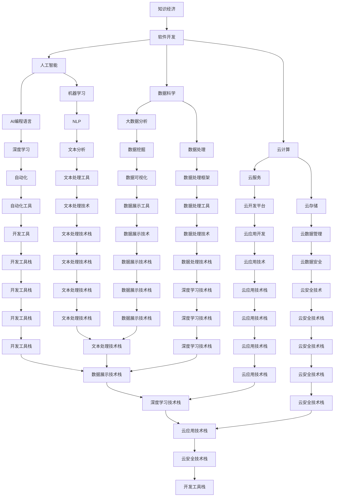

                 

# 程序员在知识经济时代的发展趋势

> 关键词：知识经济,软件开发,人工智能,数据科学,技术栈,编程语言,开发效率,职业生涯,编程文化

## 1. 背景介绍

### 1.1 问题由来

21世纪以来，全球经济结构和增长模式发生了显著变化，以知识密集型产业和服务业为主的知识经济形态逐步崛起，成为推动全球经济增长的主要动力。伴随信息技术、通信技术、大数据等新兴技术的飞速发展，知识经济时代要求从业者具备更高的技术水平和创新能力。

程序员作为软件开发的核心力量，在知识经济时代面临着新的发展机遇和挑战。本文旨在分析程序员在知识经济时代的发展趋势，探讨其面临的新技术挑战、职业发展路径、技能需求和行业生态，为程序员提供指导和建议。

### 1.2 问题核心关键点

- 知识经济时代对技术人才的需求变化。
- 软件开发领域的技术迭代和革新速度加快。
- 人工智能、大数据、云计算等新技术的崛起及其对程序员技能的要求。
- 编程文化和组织文化的变革趋势。
- 程序员职业发展路径的多样性及跨界融合。
- 行业生态的演进和职业生态的动态调整。

这些关键点构成了程序员在知识经济时代发展趋势的核心议题。理解这些议题，有助于程序员把握时代脉搏，提升自身竞争力。

### 1.3 问题研究意义

研究程序员在知识经济时代的发展趋势，对于理解新兴技术对行业的影响、提升程序员的职业素养、推动技术创新和应用普及具有重要意义：

1. 助力技术创新：把握前沿技术发展动态，提升程序员的技术创新能力。
2. 指导职业规划：为程序员提供方向明确的职业发展建议，助其规划职业路径。
3. 推动技术普及：帮助企业更好地利用技术人才，提升整体竞争力。
4. 促进产业升级：通过技术革新和应用，推动产业结构优化升级。
5. 引领文化变革：塑造积极的编程文化，促进团队协作和创新氛围。

## 2. 核心概念与联系

### 2.1 核心概念概述

为了更好地理解程序员在知识经济时代的发展趋势，需要梳理一些关键核心概念：

- **知识经济**：以知识为核心资源，通过信息技术、网络技术、大数据技术等手段，推动知识创造、知识共享和知识应用的经济形态。
- **软件开发**：利用计算机语言和技术工具，设计和实现软件产品的过程。
- **人工智能(AI)**：模拟人类智能行为和认知能力的计算科学和技术。
- **数据科学**：利用数据分析、处理和建模技术，提取数据价值的过程。
- **云计算**：通过互联网提供计算资源、存储资源和应用服务的模式。
- **编程语言**：程序员用来编写程序、实现软件功能的工具。
- **编程文化**：程序员在团队中形成的工作方式、交流方式和文化氛围。
- **技术栈**：为实现特定功能或项目，所采用的技术工具和框架的集合。

这些概念之间的关系可以通过以下Mermaid流程图来展示：



### 2.2 核心概念原理和架构的 Mermaid 流程图

为了更直观地展示这些概念之间的关系，我们利用Mermaid绘制了一个流程图：


## 3. 核心算法原理 & 具体操作步骤

### 3.1 算法原理概述

在知识经济时代，程序员面临的新技术挑战主要集中在人工智能、大数据、云计算等新兴领域。这些技术不仅提升了软件开发的效率和质量，也引入了新的算法和工具。

人工智能领域的算法和工具，如机器学习、深度学习、自然语言处理等，使得软件开发可以从传统的规则化编程转向更加灵活和自动化的开发模式。数据科学和云计算则提供了强大的数据处理和计算能力，进一步加速了软件开发的迭代周期。

### 3.2 算法步骤详解

基于上述背景，程序员在知识经济时代的工作流程可以分为以下几个步骤：

1. **需求分析与理解**：深入理解用户需求，分析用户痛点和业务场景，确定软件开发的目标和范围。
2. **数据收集与预处理**：根据需求分析结果，收集相关数据，并进行清洗、转换和预处理，为后续分析提供数据支持。
3. **技术选型与规划**：根据项目需求，选择合适的技术栈和开发工具，制定详细的设计和实现计划。
4. **模型开发与训练**：应用机器学习或深度学习模型，进行数据挖掘、特征工程和模型训练，优化算法性能。
5. **软件开发与测试**：根据模型结果和设计文档，进行软件开发，并进行单元测试、集成测试和系统测试，保证软件质量。
6. **部署与运维**：将开发好的软件部署到云计算平台，进行持续监控和维护，确保软件稳定运行。
7. **持续迭代与优化**：根据用户反馈和业务变化，不断优化软件功能和性能，进行迭代升级。

### 3.3 算法优缺点

#### 3.3.1 优点

- **自动化和高效性**：人工智能和大数据技术能够自动化处理大量数据，提升软件开发和迭代的速度和效率。
- **灵活性和适应性**：新技术的引入，使得软件开发更加灵活，能够快速适应业务需求的变化。
- **高质量和可靠性**：通过机器学习模型和大数据分析，提升软件质量，减少错误和缺陷。
- **创新性和竞争力**：新技术的应用，增强了软件的创新性和市场竞争力。

#### 3.3.2 缺点

- **学习成本高**：新技术的引入需要程序员不断学习和掌握新知识，提升技能。
- **工具和技术复杂**：新技术的工具和技术栈复杂多样，需要程序员具备较强的技术基础和适应能力。
- **数据安全和隐私**：新技术的应用，涉及大量数据的处理和存储，数据安全和隐私保护成为重要挑战。

### 3.4 算法应用领域

新技术在软件开发中的应用领域非常广泛，包括但不限于以下几个方面：

- **智能客服**：利用自然语言处理技术，开发智能客服系统，提升客户体验和服务效率。
- **金融风控**：应用机器学习和大数据分析，进行风险评估和欺诈检测，保护金融安全。
- **推荐系统**：通过用户行为数据分析，开发个性化推荐系统，提升用户满意度和消费体验。
- **智能制造**：结合物联网和工业大数据，开发智能制造系统，提高生产效率和产品质量。
- **智慧城市**：利用云计算和大数据，开发智慧城市应用，提升城市治理和服务水平。

## 4. 数学模型和公式 & 详细讲解 & 举例说明

### 4.1 数学模型构建

在知识经济时代，程序员的工作涉及到大量的数学模型和算法。以下是一个简化的数学模型构建框架：

**模型框架**：
\[
y=f(x; \theta)
\]

其中，\(x\) 表示输入数据，\(y\) 表示输出结果，\(\theta\) 表示模型参数。

### 4.2 公式推导过程

以线性回归模型为例，其公式推导如下：

**线性回归模型**：
\[
y=\theta_0+\theta_1x_1+\theta_2x_2+\cdots+\theta_nx_n
\]

其中，\(\theta_0,\theta_1,\theta_2,\cdots,\theta_n\) 是模型的参数，\(x_1,x_2,\cdots,x_n\) 是输入特征。

**最小二乘法**：
\[
\theta=(\mathbf{X}^T\mathbf{X})^{-1}\mathbf{X}^T\mathbf{y}
\]

其中，\(\mathbf{X}\) 是输入数据的矩阵，\(\mathbf{y}\) 是输出数据的向量。

### 4.3 案例分析与讲解

以一个电商推荐系统为例，利用用户行为数据和商品特征数据，应用线性回归模型进行推荐。具体步骤如下：

1. **数据收集**：收集用户点击、浏览、购买等行为数据，以及商品的价格、分类、描述等特征数据。
2. **数据预处理**：对数据进行清洗、归一化处理，去除噪声和异常值。
3. **模型训练**：应用线性回归模型，训练出推荐模型，优化模型参数。
4. **推荐实现**：将新用户的行为数据输入模型，输出推荐结果。

## 5. 项目实践：代码实例和详细解释说明

### 5.1 开发环境搭建

在进行项目实践前，需要准备相应的开发环境。以下是一个基于Python的开发环境搭建流程：

1. **安装Python和Anaconda**：
   ```
   # 安装Python 3.7以上版本
   sudo apt-get install python3.7
   # 安装Anaconda
   wget https://repo.anaconda.com/archive/Anaconda3-latest-Linux-x86_64.sh
   bash Anaconda3-latest-Linux-x86_64.sh
   ```

2. **创建虚拟环境**：
   ```
   conda create -n project_env python=3.7
   conda activate project_env
   ```

3. **安装依赖库**：
   ```
   conda install numpy pandas scikit-learn matplotlib jupyter notebook
   ```

4. **编写代码**：
   ```python
   # 导入必要的库
   import numpy as np
   import pandas as pd
   from sklearn.linear_model import LinearRegression

   # 读取数据
   data = pd.read_csv('data.csv')

   # 数据预处理
   X = data[['x1', 'x2', 'x3']]  # 输入特征
   y = data['y']  # 输出结果

   # 模型训练
   model = LinearRegression()
   model.fit(X, y)

   # 模型评估
   y_pred = model.predict(X)

   # 输出结果
   print(y_pred)
   ```

### 5.2 源代码详细实现

以下是一个使用PyTorch进行深度学习的代码示例，并进行了详细的解释说明：

```python
# 导入必要的库
import torch
import torch.nn as nn
import torch.optim as optim
from torch.utils.data import DataLoader
from torchvision import datasets, transforms

# 定义模型
class MyModel(nn.Module):
    def __init__(self):
        super(MyModel, self).__init__()
        self.fc1 = nn.Linear(784, 256)
        self.fc2 = nn.Linear(256, 128)
        self.fc3 = nn.Linear(128, 10)

    def forward(self, x):
        x = x.view(-1, 784)
        x = torch.relu(self.fc1(x))
        x = torch.relu(self.fc2(x))
        x = self.fc3(x)
        return x

# 加载数据
train_dataset = datasets.MNIST(root='./data', train=True, transform=transforms.ToTensor(), download=True)
test_dataset = datasets.MNIST(root='./data', train=False, transform=transforms.ToTensor(), download=True)

# 定义训练函数
def train_epoch(model, optimizer, data_loader, device, loss_fn):
    model.train()
    for batch_idx, (data, target) in enumerate(data_loader):
        data, target = data.to(device), target.to(device)
        optimizer.zero_grad()
        output = model(data)
        loss = loss_fn(output, target)
        loss.backward()
        optimizer.step()

# 定义评估函数
def evaluate(model, data_loader, device, loss_fn):
    model.eval()
    total_loss = 0
    correct = 0
    with torch.no_grad():
        for batch_idx, (data, target) in enumerate(data_loader):
            data, target = data.to(device), target.to(device)
            output = model(data)
            loss = loss_fn(output, target)
            total_loss += loss.item() * data.size(0)
            _, predicted = output.max(1)
            correct += predicted.eq(target).sum().item()
    return total_loss / len(data_loader.dataset), correct / len(data_loader.dataset)

# 训练模型
model = MyModel().to('cuda')
optimizer = optim.Adam(model.parameters(), lr=0.001)
loss_fn = nn.CrossEntropyLoss()
device = torch.device('cuda' if torch.cuda.is_available() else 'cpu')

train_loader = DataLoader(train_dataset, batch_size=64, shuffle=True)
test_loader = DataLoader(test_dataset, batch_size=64, shuffle=False)

for epoch in range(10):
    train_epoch(model, optimizer, train_loader, device, loss_fn)
    train_loss, train_acc = evaluate(model, train_loader, device, loss_fn)
    test_loss, test_acc = evaluate(model, test_loader, device, loss_fn)
    print(f'Epoch {epoch+1}, Train Loss: {train_loss:.4f}, Train Acc: {train_acc:.4f}, Test Loss: {test_loss:.4f}, Test Acc: {test_acc:.4f}')
```

### 5.3 代码解读与分析

在上述代码中，我们使用了PyTorch框架来构建深度学习模型，并进行了详细的解释说明：

1. **模型定义**：定义了一个简单的三层神经网络模型，包括两个全连接层和一个输出层。
2. **数据加载**：使用PyTorch的数据集加载工具，加载MNIST手写数字数据集。
3. **训练函数**：定义了一个训练函数，用于在每个epoch中更新模型参数。
4. **评估函数**：定义了一个评估函数，用于计算模型在测试集上的性能。
5. **模型训练**：在训练函数中，使用Adam优化器更新模型参数，并使用交叉熵损失函数计算损失。
6. **模型评估**：在评估函数中，计算模型在测试集上的损失和准确率。

## 6. 实际应用场景

### 6.1 智能客服

智能客服系统利用自然语言处理技术，通过与用户的交互，自动化处理常见问题，提升客户体验和服务效率。例如，客服机器人可以自动解答用户的常见问题，并根据用户的意图，引导用户解决问题。

### 6.2 金融风控

金融风控系统利用机器学习和大数据分析技术，对用户的行为和交易数据进行分析，预测潜在的风险，进行风险评估和欺诈检测。例如，银行可以利用风控系统，监控用户的账户行为，及时发现异常交易，保护用户的财产安全。

### 6.3 推荐系统

推荐系统利用用户行为数据分析，根据用户的历史行为和兴趣，推荐符合用户需求的商品或内容。例如，电商网站可以利用推荐系统，推荐用户可能感兴趣的商品，提升用户的购买体验和满意度。

### 6.4 智能制造

智能制造系统利用物联网和工业大数据，实现生产过程的自动化和智能化。例如，智能制造系统可以实时监控生产设备的运行状态，预测设备的故障，提高生产效率和产品质量。

### 6.5 智慧城市

智慧城市利用云计算和大数据，实现城市管理和服务功能的自动化和智能化。例如，智慧城市系统可以实时监控交通流量，优化交通信号灯，缓解交通拥堵，提升城市的运行效率。

## 7. 工具和资源推荐

### 7.1 学习资源推荐

为了帮助程序员掌握知识经济时代的新技术，推荐以下学习资源：

1. **《深度学习》课程**：斯坦福大学Andrew Ng教授的在线课程，系统讲解深度学习的基本概念和算法。
2. **《TensorFlow实战》书籍**：详细介绍TensorFlow框架的使用方法和案例，适合实战学习。
3. **《Python机器学习》书籍**：介绍Python在机器学习和数据科学中的应用，适合初学者学习。
4. **Kaggle平台**：一个数据科学竞赛平台，提供大量数据集和机器学习竞赛，适合实战练习。
5. **GitHub**：一个开源代码托管平台，提供大量优秀的代码项目和开发工具，适合学习和借鉴。

### 7.2 开发工具推荐

以下是一些常用的开发工具，推荐给程序员使用：

1. **PyTorch**：一个基于Python的深度学习框架，具有灵活的动态计算图和高效的模型训练能力。
2. **TensorFlow**：一个由Google开发的深度学习框架，支持分布式计算和模型部署。
3. **Jupyter Notebook**：一个交互式的开发环境，适合编写和测试Python代码。
4. **Visual Studio Code**：一个轻量级的开发工具，支持多种编程语言和插件扩展。
5. **Git**：一个版本控制工具，支持多人协作和代码管理。

### 7.3 相关论文推荐

为了帮助程序员深入了解知识经济时代的技术发展，推荐以下几篇论文：

1. **《Deep Learning》书籍**：Ian Goodfellow等著，全面介绍深度学习的基本理论和算法。
2. **《TensorFlow用户手册》**：Google开发，详细介绍TensorFlow框架的使用方法和案例。
3. **《Python机器学习》书籍**：Sebastian Raschka等著，介绍Python在机器学习和数据科学中的应用。
4. **《Big Data with Python》书籍**：Stefanie Molin等著，介绍大数据技术在Python中的应用。
5. **《Cloud Computing with Python》书籍**：Stefanie Molin等著，介绍云计算在Python中的应用。

## 8. 总结：未来发展趋势与挑战

### 8.1 研究成果总结

本文从知识经济时代的背景出发，分析了程序员面临的新技术挑战和职业发展趋势。通过系统介绍知识经济时代的核心概念和核心算法，探讨了程序员在软件开发中的新技术应用和实践方法。同时，通过对实际应用场景的案例分析，展示了知识经济时代的技术优势和应用前景。

### 8.2 未来发展趋势

未来，程序员在知识经济时代的发展将呈现以下几个趋势：

1. **技术栈多样化**：随着新技术的不断涌现，程序员需要掌握多种技术栈，提升跨界融合能力。
2. **知识驱动的开发**：知识驱动的开发模式将逐步取代传统的规则化编程，成为新的主流开发模式。
3. **云计算和边缘计算**：云计算和边缘计算技术将为软件开发提供更强大的计算和存储能力。
4. **智能开发工具**：智能开发工具将提升开发效率和质量，如代码自动补全、智能测试等。
5. **AI辅助开发**：AI技术将辅助程序员进行代码生成、自动测试和错误诊断，提升开发效率。
6. **跨学科合作**：跨学科合作将成为知识经济时代的常态，程序员需要具备跨领域的知识背景。

### 8.3 面临的挑战

尽管知识经济时代为程序员提供了更多的发展机会，但同时也面临一些挑战：

1. **技术更新速度快**：新技术的快速迭代，要求程序员不断学习和适应，提升自身技术水平。
2. **数据安全和隐私保护**：大数据和人工智能技术的应用，带来了数据安全和隐私保护的新挑战。
3. **跨界技能不足**：跨学科合作需要程序员具备多领域的知识背景，但当前跨界技能不足。
4. **模型和算法的复杂性**：新技术的应用，带来了模型和算法的复杂性，要求程序员具备更高的数学和编程能力。

### 8.4 研究展望

未来的研究需要在以下几个方面进行突破：

1. **跨界技能培训**：推动跨学科教育，培养具备多领域知识的程序员。
2. **数据安全和隐私保护**：开发更加安全、可靠的算法和工具，保护数据安全和隐私。
3. **智能开发工具的开发**：开发更加智能、高效的开发工具，提升开发效率和质量。
4. **模型的可解释性和鲁棒性**：研究模型的可解释性和鲁棒性，提升模型的可靠性和安全性。

总之，知识经济时代的到来，为程序员提供了前所未有的发展机遇和挑战。只有不断学习、适应变化，才能在未来的软件开发中保持竞争力，实现职业发展和创新。

## 9. 附录：常见问题与解答

**Q1: 什么是知识经济时代？**

A: 知识经济时代是指以知识密集型产业和服务业为主导的经济形态，知识和创新成为推动经济增长的主要动力。

**Q2: 知识经济时代对程序员有哪些新要求？**

A: 知识经济时代对程序员的新要求包括：
- 掌握多种技术栈，具备跨界融合能力。
- 具备数学和数据科学背景，能够理解和应用机器学习和大数据技术。
- 具备跨学科合作能力，能够与其他领域的专业人员协同工作。

**Q3: 如何应对技术快速迭代带来的挑战？**

A: 应对技术快速迭代带来的挑战，可以采取以下措施：
- 不断学习和培训，提升自身技术水平。
- 关注行业动态，及时掌握新技术和工具。
- 参加开源项目和社区活动，交流经验和技术。

**Q4: 数据安全和隐私保护如何实现？**

A: 数据安全和隐私保护可以通过以下措施实现：
- 采用加密技术，保护数据传输和存储的安全。
- 实施严格的访问控制，限制数据的访问权限。
- 遵守相关法律法规，如GDPR等，保护用户隐私。

**Q5: 智能开发工具如何开发？**

A: 智能开发工具的开发可以采用以下步骤：
- 分析和梳理用户需求，确定工具的功能和设计。
- 选择合适的技术栈和工具，进行工具的实现。
- 进行工具的测试和优化，提升工具的稳定性和可用性。

**Q6: 模型的可解释性和鲁棒性如何研究？**

A: 模型的可解释性和鲁棒性研究可以通过以下措施进行：
- 开发可解释性模型，提升模型的透明性和可理解性。
- 研究模型的鲁棒性，增强模型的稳定性和抗干扰能力。
- 结合人工智能和自然语言处理技术，提升模型的可解释性和鲁棒性。

**Q7: 知识驱动的开发模式如何实现？**

A: 知识驱动的开发模式可以通过以下措施实现：
- 应用机器学习和数据科学技术，获取数据驱动的开发需求。
- 设计知识驱动的模型，辅助开发决策。
- 采用知识驱动的开发工具，提升开发效率和质量。

**Q8: 跨学科合作如何实现？**

A: 跨学科合作可以通过以下措施实现：
- 建立跨学科团队，促进不同领域的专业人员交流合作。
- 开展跨学科项目，推动知识共享和创新。
- 参加学术和行业会议，拓宽视野和联系。

**Q9: 如何实现跨界技能培训？**

A: 实现跨界技能培训可以采用以下措施：
- 设立跨学科课程，涵盖多个领域的知识和技能。
- 开展跨学科实践项目，培养跨领域的实际操作能力。
- 提供跨学科的交流平台，促进不同领域的专业人员交流。

**Q10: 数据安全和隐私保护的重要性体现在哪些方面？**

A: 数据安全和隐私保护的重要性体现在以下几个方面：
- 保护用户隐私，避免个人信息泄露和滥用。
- 维护数据完整性，防止数据被篡改和破坏。
- 保护企业商业机密，防止商业信息泄露。

总之，程序员在知识经济时代面临着新的发展机遇和挑战。通过掌握新技术、提升跨界技能、关注数据安全和隐私保护，能够在新时代中保持竞争力，实现职业发展和创新。

