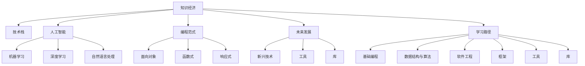

                 

# 程序员在知识经济时代的发展趋势

> 关键词：知识经济, 技术栈, 人工智能, 编程范式, 未来发展, 学习路径

## 1. 背景介绍

在过去几十年里，随着信息技术的迅猛发展，程序员已经从一个普通的职业逐渐转变为推动社会进步和经济增长的关键力量。随着知识经济时代的到来，程序员的地位和作用将更加重要。在知识经济中，知识、技术和信息成为经济增长的主要驱动力，而程序员正是这些要素的创造者和开发者。

在知识经济时代，全球经济结构正在经历深刻的转型，科技公司成为经济增长的主要驱动力。程序员作为这些公司的核心力量，其技能和能力需求也在不断提升。从早期的传统编程到今天的全栈开发、大数据处理、机器学习、区块链和人工智能等，程序员需要具备更加全面和高级的技能。

此外，全球化的发展趋势使得程序员可以在全球范围内寻找机会，不同国家和地区的需求差异也为程序员提供了广阔的职业发展空间。同时，随着开源社区的崛起，程序员能够利用丰富的开源资源来提升自身的技术能力，加速创新步伐。

## 2. 核心概念与联系

### 2.1 核心概念概述

为了更好地理解程序员在知识经济时代的发展趋势，本节将介绍几个密切相关的核心概念：

- **知识经济**：知识成为经济增长的主要驱动力，而非传统的物质资源。知识的获取、传播和应用成为社会发展的核心。
- **技术栈**：指一个软件工程师掌握的所有技术集合，包括编程语言、框架、工具和库等。技术栈的选择决定了程序员的技能层次和职业发展方向。
- **人工智能**：通过算法和计算能力让机器模仿人类的智能行为，包括机器学习、深度学习、自然语言处理等技术。程序员需要掌握这些技术以实现智能系统的开发。
- **编程范式**：编程的思维方式和风格，如面向对象、函数式、响应式等。不同的编程范式适用于不同的应用场景，程序员需要根据实际需求选择合适的范式。
- **未来发展**：程序员需要了解技术发展趋势，掌握新兴技术和工具，以保持竞争力。
- **学习路径**：指程序员需要掌握的技术和知识体系，包括基础编程语言、数据结构与算法、软件工程、框架、工具和库等。

这些核心概念之间存在紧密的联系。技术栈的构建需要基于对未来发展的理解，而未来发展的趋势又依赖于掌握的编程范式和人工智能等技术。同时，学习路径的选择决定了技术栈的广度和深度。

### 2.2 核心概念原理和架构的 Mermaid 流程图



这个流程图展示了核心概念之间的逻辑关系：

1. 知识经济需要依赖技术栈，技术栈的选择又基于人工智能等技术。
2. 编程范式影响技术栈的构建，同时决定了程序员的思维方式。
3. 未来发展方向依赖于编程范式和人工智能技术，而学习路径则决定了程序员的技术广度和深度。
4. 新兴技术、工具和库都是未来发展的重要组成部分，学习路径需要涵盖这些内容。

## 3. 核心算法原理 & 具体操作步骤

### 3.1 算法原理概述

在知识经济时代，程序员需要掌握的核心算法和理论包括但不限于：

- **数据结构和算法**：如数组、链表、栈、队列、树、图、排序、查找等。这些基础算法是所有高级编程技术的基础。
- **软件工程**：包括软件开发流程、版本控制、代码审查、测试驱动开发、持续集成和持续部署等。这些方法论保证了代码的质量和可维护性。
- **人工智能和机器学习**：包括监督学习、非监督学习、强化学习、神经网络、深度学习、自然语言处理、计算机视觉等。这些技术被广泛应用于各个行业，解决实际问题。
- **编程范式**：如面向对象编程、函数式编程、响应式编程等。不同的编程范式适用于不同的应用场景，程序员需要根据实际需求选择合适的范式。
- **云计算和大数据**：包括云平台、容器技术、分布式计算、大数据处理和分析等。这些技术使得大规模应用变得更加高效和便捷。

### 3.2 算法步骤详解

以下是基于知识经济时代核心算法的详细步骤：

1. **基础编程和数据结构与算法**：掌握至少一门编程语言（如Python、Java、C++等），深入理解数据结构和算法的基本原理和实现方法。
2. **软件工程方法**：学习和应用软件开发的基本流程和最佳实践，掌握版本控制工具（如Git）和持续集成/持续部署（CI/CD）系统。
3. **人工智能和机器学习**：选择至少一种AI框架（如TensorFlow、PyTorch等），学习机器学习和深度学习的理论基础和实践应用。
4. **编程范式**：了解不同编程范式的特点和适用场景，根据项目需求选择合适的范式进行编程。
5. **云计算和大数据**：学习云平台（如AWS、Azure、Google Cloud等）和分布式计算框架（如Spark、Hadoop等）的基本概念和应用方法。

### 3.3 算法优缺点

知识经济时代程序员面临的核心算法和理论具有以下优点和缺点：

**优点**：

- **应用广泛**：涵盖多种技术和方法，能够解决实际问题。
- **前沿性**：紧跟技术发展趋势，具备较强的创新能力。
- **实用性强**：能够应用于各种规模的项目，满足不同需求。

**缺点**：

- **学习难度大**：涉及多种技术和方法，需要较长时间的学习和实践。
- **更新速度快**：技术不断演进，需要持续学习和更新知识。
- **复杂度高**：很多技术和方法需要深入理解，使用不当容易导致问题。

### 3.4 算法应用领域

基于核心算法的程序员可以应用于以下多个领域：

- **软件开发**：开发各种类型的应用程序，如Web应用、桌面应用、移动应用等。
- **大数据处理**：处理和分析海量数据，提取有价值的信息和洞察。
- **人工智能**：开发各种智能应用，如机器学习、自然语言处理、计算机视觉等。
- **云计算**：提供云服务，如云存储、云计算、云安全等。
- **区块链**：开发和维护区块链应用，解决去中心化问题。

## 4. 数学模型和公式 & 详细讲解 & 举例说明

### 4.1 数学模型构建

在知识经济时代，程序员需要掌握的数学模型包括但不限于：

- **线性代数**：矩阵运算、向量空间、线性方程组等。
- **概率论和统计学**：概率分布、统计推断、假设检验等。
- **微积分**：导数、积分、微分方程等。
- **信息论**：熵、互信息、KL散度等。
- **优化理论**：梯度下降、牛顿法、拉格朗日乘子法等。

### 4.2 公式推导过程

以机器学习中的梯度下降算法为例，推导其基本原理和实现步骤：

$$
\theta^{t+1} = \theta^t - \alpha \nabla J(\theta)
$$

其中，$\theta$ 为模型参数，$J$ 为损失函数，$\alpha$ 为学习率。

**推导过程**：

1. 定义损失函数 $J(\theta)$ 为预测值与真实值之间的误差。
2. 将损失函数对模型参数 $\theta$ 求导，得到梯度 $\nabla J(\theta)$。
3. 使用梯度下降算法更新模型参数 $\theta$，使其向误差最小化的方向移动。

**代码实现**：

```python
import numpy as np

# 定义损失函数
def loss_func(x, y, theta):
    return np.mean((x - y) ** 2)

# 定义梯度下降函数
def gradient_descent(x, y, theta, alpha=0.01, num_iters=1000):
    for i in range(num_iters):
        grad = 2 * np.dot(x, (x * theta - y))
        theta -= alpha * grad
    return theta

# 测试代码
x = np.array([1, 2, 3, 4, 5])
y = np.array([1, 2, 3, 4, 5])
theta = np.array([0, 0])
theta = gradient_descent(x, y, theta, alpha=0.1, num_iters=1000)
print(theta)
```

### 4.3 案例分析与讲解

**案例**：使用梯度下降算法优化线性回归模型。

假设有一组数据集，其中 $x$ 为输入，$y$ 为输出，模型参数 $\theta = [w, b]$。

1. 定义损失函数 $J(\theta) = \frac{1}{2m} \sum_{i=1}^m (h_\theta(x^{(i)}) - y^{(i)})^2$。
2. 使用梯度下降算法更新模型参数：$\theta_j^{t+1} = \theta_j^t - \alpha \frac{1}{m} \sum_{i=1}^m (h_\theta(x^{(i)}) - y^{(i)})x^{(i)}_j$。
3. 重复上述步骤，直至收敛。

通过以上步骤，可以使用梯度下降算法优化线性回归模型，使其更好地拟合训练数据。

## 5. 项目实践：代码实例和详细解释说明

### 5.1 开发环境搭建

在知识经济时代，开发环境的搭建和配置非常重要。以下是常用的开发环境搭建流程：

1. **安装IDE**：如Visual Studio Code、PyCharm等，作为开发工具。
2. **安装编程语言和框架**：如Python、Java、C++等，以及TensorFlow、PyTorch等框架。
3. **安装云平台和容器**：如AWS、Azure、Google Cloud等，以便进行云服务和容器化部署。
4. **安装大数据处理工具**：如Spark、Hadoop等，以便处理和分析海量数据。

### 5.2 源代码详细实现

以下是一个使用Python进行线性回归的代码实例：

```python
import numpy as np

# 定义数据集
x = np.array([1, 2, 3, 4, 5])
y = np.array([1, 2, 3, 4, 5])

# 定义损失函数
def loss_func(x, y, theta):
    return np.mean((x * theta[0] + theta[1] - y) ** 2)

# 定义梯度下降函数
def gradient_descent(x, y, theta, alpha=0.01, num_iters=1000):
    for i in range(num_iters):
        grad = np.array([2 * np.sum(x * (x * theta[0] + theta[1] - y), np.sum(x)])
        theta -= alpha * grad
    return theta

# 测试代码
theta = np.array([0, 0])
theta = gradient_descent(x, y, theta, alpha=0.1, num_iters=1000)
print(theta)
```

### 5.3 代码解读与分析

**解读**：

1. **定义数据集**：使用NumPy库定义输入 $x$ 和输出 $y$。
2. **定义损失函数**：计算预测值与真实值之间的误差，使用均方误差作为损失函数。
3. **定义梯度下降函数**：使用梯度下降算法更新模型参数 $\theta$，其中 $\theta = [w, b]$。
4. **测试代码**：调用梯度下降函数，使用随机初始化的模型参数进行优化。

**分析**：

1. **模型构建**：使用线性回归模型，其中 $h_\theta(x) = wx + b$。
2. **参数更新**：使用梯度下降算法，逐步更新模型参数 $\theta$，使其误差最小化。
3. **收敛性**：需要设置合适的学习率 $\alpha$ 和迭代次数 $num\_iters$，确保模型收敛。

## 6. 实际应用场景

### 6.1 软件开发

在软件开发领域，程序员需要掌握各种编程语言和框架，以开发不同类型的应用程序。以下是一些实际应用场景：

- **Web应用**：开发基于前端框架（如React、Vue.js）和后端框架（如Django、Flask）的全栈应用。
- **移动应用**：开发iOS和Android应用，使用Swift和Kotlin进行开发。
- **桌面应用**：开发桌面应用，使用Electron、Qt等技术。

### 6.2 大数据处理

在大数据处理领域，程序员需要掌握各种大数据处理工具和技术，以处理和分析海量数据。以下是一些实际应用场景：

- **数据采集**：使用Apache Kafka、Flume等工具，从各种数据源采集数据。
- **数据存储**：使用Hadoop、Hive、Spark等工具，存储和处理大规模数据。
- **数据挖掘**：使用Python的Pandas、NumPy等库，进行数据清洗、特征工程和模型训练。

### 6.3 人工智能

在人工智能领域，程序员需要掌握各种AI框架和技术，以开发智能应用。以下是一些实际应用场景：

- **机器学习**：使用TensorFlow、PyTorch等框架，开发各种机器学习模型，如分类、回归、聚类等。
- **深度学习**：使用Keras、TensorFlow等框架，开发各种深度学习模型，如卷积神经网络、循环神经网络等。
- **自然语言处理**：使用NLTK、SpaCy等库，开发各种NLP应用，如文本分类、情感分析、信息抽取等。

### 6.4 未来应用展望

在知识经济时代，程序员的未来应用前景广阔。以下是一些未来应用展望：

- **自动化和智能化**：使用AI和机器学习技术，实现自动化开发和智能化运维。
- **云计算和大数据**：利用云平台和容器技术，实现弹性计算和分布式处理。
- **区块链和去中心化**：开发和维护去中心化应用，解决传统系统的瓶颈问题。
- **物联网和边缘计算**：开发和维护物联网应用，实现边缘计算和低延迟处理。

## 7. 工具和资源推荐

### 7.1 学习资源推荐

为了帮助程序员系统掌握知识经济时代的技术和理论，以下是一些优质的学习资源：

1. **Coursera和edX**：提供各种计算机科学和数据科学的在线课程，涵盖编程语言、数据结构、算法、机器学习等。
2. **Udacity**：提供多种软件开发和人工智能的纳米学位课程，结合实际项目进行学习。
3. **Kaggle**：提供各种数据科学竞赛和实战项目，提升编程和数据分析能力。
4. **GitHub**：提供丰富的开源项目和代码库，学习开源项目的实现方法。
5. **Stack Overflow**：提供各种技术问答，解决编程中的疑难问题。

### 7.2 开发工具推荐

为了提高程序员的开发效率，以下是一些常用的开发工具：

1. **IDE**：如Visual Studio Code、PyCharm、Eclipse等，提供代码编辑、调试、版本控制等集成功能。
2. **版本控制工具**：如Git、SVN等，实现代码版本管理和协同开发。
3. **云平台**：如AWS、Azure、Google Cloud等，提供云服务和容器化部署。
4. **大数据处理工具**：如Spark、Hadoop、Flink等，提供大规模数据处理和分析。
5. **AI框架**：如TensorFlow、PyTorch、MXNet等，提供各种AI算法的实现。

### 7.3 相关论文推荐

为了了解最新的技术发展趋势，以下是一些相关论文推荐：

1. **NeurIPS和ICML**：人工智能领域的顶级会议，发布最新的研究成果和技术进展。
2. **ACM Transactions on Modeling and Computer Simulation**：高性能计算和分布式系统的经典期刊。
3. **IEEE Transactions on Parallel and Distributed Systems**：分布式计算和并行处理的研究热点。
4. **Journal of Systems and Software**：软件开发和系统工程的重要期刊。

## 8. 总结：未来发展趋势与挑战

### 8.1 研究成果总结

在知识经济时代，程序员需要掌握的知识和技能不断扩展，涵盖数据科学、人工智能、软件工程等多个领域。通过不断学习和实践，程序员能够适应快速变化的技术环境，成为高技能的专业人才。

### 8.2 未来发展趋势

未来，程序员需要掌握以下发展趋势：

1. **云计算和大数据**：利用云平台和容器技术，实现弹性计算和分布式处理。
2. **人工智能和机器学习**：掌握AI和机器学习的理论和技术，开发各种智能应用。
3. **区块链和去中心化**：开发和维护去中心化应用，解决传统系统的瓶颈问题。
4. **物联网和边缘计算**：开发和维护物联网应用，实现边缘计算和低延迟处理。
5. **自动化和智能化**：使用AI和机器学习技术，实现自动化开发和智能化运维。

### 8.3 面临的挑战

在知识经济时代，程序员面临以下挑战：

1. **技术更新速度快**：需要持续学习和更新知识，跟上技术发展的步伐。
2. **应用场景多样**：需要掌握多种技术和工具，适应不同的应用场景。
3. **项目复杂度高**：需要具备较强的系统思维和设计能力，解决复杂的实际问题。
4. **跨领域合作**：需要与其他学科的专家合作，实现跨领域的创新。
5. **伦理和安全问题**：需要关注技术应用的伦理和安全问题，确保技术的正当使用。

### 8.4 研究展望

未来的研究需要在以下方面取得突破：

1. **自动化开发**：开发自动化开发工具，提升编程效率和代码质量。
2. **智能化运维**：开发智能化运维系统，实现自动故障检测和修复。
3. **跨领域融合**：实现跨领域的知识和技术融合，推动技术创新。
4. **伦理和法律**：研究技术应用的伦理和法律问题，确保技术的正当使用。
5. **可持续发展**：推动技术的发展和应用，促进社会的可持续发展。

## 9. 附录：常见问题与解答

**Q1：什么是知识经济？**

A: 知识经济是指以知识、技术和信息为基本生产要素，以知识创新、知识传播和知识应用为主要经济活动的新型经济模式。

**Q2：程序员需要掌握哪些编程语言？**

A: 程序员需要掌握至少一种编程语言，如Python、Java、C++等，以及多种框架和库，如TensorFlow、PyTorch、Flask等。

**Q3：如何在知识经济时代提升编程能力？**

A: 提升编程能力需要不断学习和实践，掌握多种技术和工具，关注最新的技术进展，参与开源项目和竞赛，提升问题解决能力和团队协作能力。

**Q4：如何应对技术更新速度快的挑战？**

A: 需要持续学习和更新知识，关注最新的技术进展，参与技术社区和学术会议，学习新技术和新工具，保持竞争力和创新力。

**Q5：如何实现跨领域的知识和技术融合？**

A: 需要具备系统思维和设计能力，了解其他学科的基本知识和理论，掌握跨领域的编程工具和技术，实现不同领域的知识和技术融合。

**Q6：如何在技术应用中关注伦理和安全问题？**

A: 需要了解相关的法律法规和伦理道德，关注技术应用对社会的影响，参与伦理和安全问题的讨论和解决，确保技术的正当使用。

**Q7：如何在知识经济时代保持竞争力？**

A: 需要持续学习和更新知识，关注最新的技术进展，参与技术社区和学术会议，学习新技术和新工具，提升问题解决能力和团队协作能力，保持竞争力和创新力。

---

作者：禅与计算机程序设计艺术 / Zen and the Art of Computer Programming

