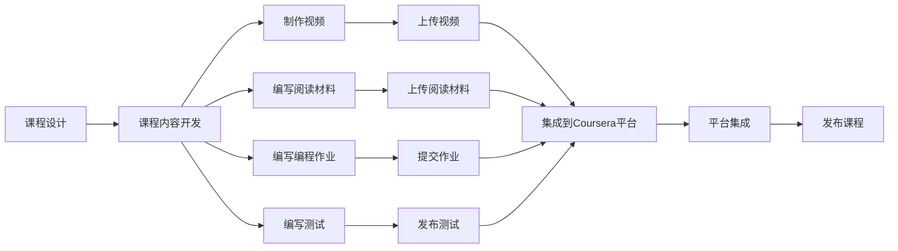

                 

## 1. 背景介绍

近年来，随着在线教育的兴起和技术的进步，越来越多的教育平台开始向专业人士提供证书课程。这些课程不仅能够帮助程序员提升专业技能，还能增加他们在市场上的竞争力。Coursera作为全球领先的在线教育平台之一，提供了丰富的计算机科学和软件工程相关的课程。在本文中，我们将探讨如何利用Coursera发布自己的专业证书课程，并分享一些成功发布课程的关键经验。

## 2. 核心概念与联系

### 2.1 核心概念概述

为了更好地理解如何利用Coursera发布专业证书课程，我们将介绍几个核心概念：

- **Coursera**：全球领先的高质量在线教育平台，提供各种在线课程，包括计算机科学和软件工程等领域的专业课程。
- **专业证书课程**：通过完成特定课程的学习，并满足课程要求，学员可以获得由Coursera颁发的官方专业证书。
- **课程内容**：课程内容通常包括视频讲座、阅读材料、编程作业、测试等，旨在帮助学员掌握相关技能。
- **课程结构**：课程通常被设计成有组织的学习路径，包括讲座、实践任务、评估等环节。
- **平台集成**：课程发布者需要将课程内容上传到Coursera平台，并与平台的各种功能集成，如视频上传、作业提交、评估等。

### 2.2 核心概念原理和架构的 Mermaid 流程图(Mermaid 流程节点中不要有括号、逗号等特殊字符)

这个流程图展示了课程发布的基本流程：首先设计课程内容，然后开发课程内容，包括制作视频、编写阅读材料、编程作业和测试。最后，将课程内容上传到Coursera平台并进行集成，发布课程，完成整个流程。

## 3. 核心算法原理 & 具体操作步骤

### 3.1 算法原理概述

Coursera的专业证书课程发布涉及多个环节，包括课程设计、内容开发、平台集成等。以下是一些关键步骤的算法原理概述：

- **课程设计**：设计课程需考虑学习目标、难度、学习路径等因素。课程应具备清晰的结构，使学员能够按部就班地完成学习。
- **内容开发**：课程内容需包含视频讲座、阅读材料、编程作业、测试等，以多种方式帮助学员掌握相关技能。
- **平台集成**：将课程内容上传到Coursera平台，并进行集成，包括视频上传、作业提交、测试发布等。
- **发布课程**：在完成平台集成后，即可发布课程，课程将自动出现在Coursera的课程列表中，供学员选择学习。

### 3.2 算法步骤详解

以下是Coursera专业证书课程发布的具体操作步骤：

**Step 1: 设计课程结构**
- 确定课程目标和学习内容，制定学习路径。
- 设计课程模块和章节，每个模块或章节应有一个清晰的学习目标。
- 确定课程的难度和深度，根据学员的背景和需求进行适当调整。

**Step 2: 开发课程内容**
- 制作视频讲座，确保讲解清晰、详细，并包含实际编程示例。
- 编写阅读材料，如课程讲义、编程手册等，提供理论支持。
- 设计编程作业，以实际问题为导向，帮助学员巩固所学内容。
- 编写测试，评估学员的学习效果，并提供即时反馈。

**Step 3: 集成课程到Coursera平台**
- 创建Coursera账户，并申请成为Coursera教师。
- 创建课程页面，填写课程信息，包括课程名称、简介、教学团队等。
- 上传视频、阅读材料、编程作业等课程内容。
- 配置测试，确保测试能够顺利发布和评估。
- 设置课程评估方式，如编程作业、测试、论坛讨论等。

**Step 4: 发布课程**
- 完成平台集成后，即可发布课程。
- 在Coursera平台上进行课程推广，吸引学员注册学习。
- 与学员互动，回答问题，提供支持。

### 3.3 算法优缺点

利用Coursera发布专业证书课程有以下优点：

- **覆盖广泛**：Coursera平台覆盖全球，能够吸引来自不同国家和地区的学员。
- **质量保证**：Coursera对课程内容质量有严格要求，确保课程内容的高质量和实用性。
- **认证权威**：完成课程并获得证书后，学员的证书将得到广泛认可。

同时，也有一些缺点需要考虑：

- **时间和精力投入**：课程设计和内容开发需要投入大量时间和精力，尤其是在视频制作和课程评估方面。
- **费用**：发布课程可能需要支付课程平台费用，以及可能的其他成本。
- **技术要求**：课程发布涉及平台集成和内容上传，需要一定的技术能力和经验。

### 3.4 算法应用领域

Coursera的专业证书课程可以应用于多个领域，包括但不限于：

- **软件开发**：涵盖各种编程语言和技术栈，如Python、Java、Web开发等。
- **数据科学**：涉及数据分析、机器学习、数据可视化等。
- **人工智能**：包括深度学习、自然语言处理、计算机视觉等。
- **项目管理**：包括敏捷开发、Scrum、项目管理等。
- **软技能**：如沟通技巧、团队合作、项目管理等。

这些领域的课程发布，能够帮助学员提升专业技能，增强就业竞争力。

## 4. 数学模型和公式 & 详细讲解 & 举例说明

### 4.1 数学模型构建

假设有一门课程，共有$N$个模块，每个模块包含$M$个学时。课程的目标是让学员掌握某项技能，通过$K$个编程作业和$T$个测试进行评估。

### 4.2 公式推导过程

课程的评分公式可以表示为：

$$
Score = \sum_{i=1}^N w_i \cdot (P_i + C_i + J_i)
$$

其中：
- $w_i$ 为模块$i$的权重。
- $P_i$ 为模块$i$中编程作业的平均得分。
- $C_i$ 为模块$i$中课程讨论的平均得分。
- $J_i$ 为模块$i$中测试的平均得分。

### 4.3 案例分析与讲解

以一门Python编程课程为例，课程共分为四个模块，每个模块学时不同。课程要求学员完成五个编程作业，并参加三次测试。课程评分公式可以表示为：

$$
Score = 0.3 \cdot (P_1 + P_2 + P_3 + P_4) + 0.2 \cdot C_1 + 0.5 \cdot (J_1 + J_2 + J_3)
$$

其中，$P_i$ 为模块$i$中编程作业的平均得分，$C_i$ 为模块$i$中课程讨论的平均得分，$J_i$ 为模块$i$中测试的平均得分。

## 5. 项目实践：代码实例和详细解释说明

### 5.1 开发环境搭建

在进行课程发布前，需要准备好开发环境。以下是一些常用的工具和软件：

1. **视频制作**：Adobe Premiere Pro、Final Cut Pro等。
2. **编程作业**：Jupyter Notebook、GitHub等。
3. **测试发布**：Coursera平台本身提供了一些工具，如Coursera Quizzes。
4. **课程管理**：Coursera平台提供了一系列管理工具，用于课程内容上传、评估配置等。

### 5.2 源代码详细实现

下面以一门Python编程课程为例，展示如何发布课程。

**Step 1: 设计课程结构**

假设课程名称为《Python基础》，课程分为四个模块：变量与数据类型、函数与控制结构、面向对象编程、文件与异常处理。

**Step 2: 开发课程内容**

1. **制作视频**
   - 制作第一个视频，讲解变量与数据类型。
   - 上传视频到Coursera平台。

2. **编写阅读材料**
   - 编写课程讲义，详细讲解变量与数据类型。
   - 上传讲义到Coursera平台。

3. **设计编程作业**
   - 设计第一个编程作业，要求学员编写一个计算器程序。
   - 上传作业到Coursera平台。

4. **编写测试**
   - 编写第一个测试，测试学员对变量与数据类型的掌握程度。
   - 发布测试，确保能够顺利进行评估。

**Step 3: 集成课程到Coursera平台**

1. 登录Coursera平台，申请成为教师。
2. 创建课程页面，填写课程信息。
3. 上传视频、阅读材料、编程作业等课程内容。
4. 配置测试，确保测试能够顺利发布和评估。
5. 设置课程评估方式，如编程作业、测试、论坛讨论等。

**Step 4: 发布课程**

1. 完成平台集成后，发布课程。
2. 在Coursera平台上进行课程推广，吸引学员注册学习。
3. 与学员互动，回答问题，提供支持。

### 5.3 代码解读与分析

在实际发布课程的过程中，需要特别注意以下几点：

- **视频制作**：视频需包含清晰的讲解，并尽量保持简洁明了。
- **编程作业**：编程作业需具有实际意义，能够帮助学员巩固所学知识。
- **测试设计**：测试需覆盖课程的主要知识点，并提供详细反馈。

## 6. 实际应用场景

### 6.1 软件开发

在软件开发领域，利用Coursera发布专业证书课程可以吸引更多学员学习编程语言和技术栈，提升其就业竞争力。

### 6.2 数据科学

数据科学领域涉及数据分析、机器学习、数据可视化等，利用Coursera发布相关课程，能够帮助学员掌握最新技术，提升其在数据科学领域的竞争力。

### 6.3 人工智能

人工智能领域包括深度学习、自然语言处理、计算机视觉等，发布相关课程能够帮助学员掌握最新技术，提升其在人工智能领域的竞争力。

### 6.4 未来应用展望

未来，随着技术的不断进步，Coursera等在线教育平台将能够提供更多高质量的课程内容，帮助程序员提升专业技能。同时，随着人工智能和大数据技术的发展，课程内容也将更加多样化和实用化，进一步提升课程的吸引力和实用性。

## 7. 工具和资源推荐

### 7.1 学习资源推荐

- **Coursera平台**：提供大量高质量的课程，覆盖多个技术领域。
- **Coursera官方文档**：提供详细的课程发布指南和技术支持。
- **Coursera教师社区**：与其他教师互动，分享经验和资源。

### 7.2 开发工具推荐

- **视频制作**：Adobe Premiere Pro、Final Cut Pro等。
- **编程作业**：Jupyter Notebook、GitHub等。
- **测试发布**：Coursera Quizzes等。
- **课程管理**：Coursera平台提供的课程管理工具。

### 7.3 相关论文推荐

- **Coursera课程设计**：研究Coursera平台的课程设计和评估方法。
- **在线教育平台**：探讨在线教育平台的发展趋势和未来方向。
- **人工智能教育**：探讨人工智能技术在教育中的应用和前景。

## 8. 总结：未来发展趋势与挑战

### 8.1 研究成果总结

Coursera专业证书课程的发布，能够帮助程序员提升专业技能，增强就业竞争力。通过课程设计和内容开发，发布者可以设计出高质量的课程内容，吸引学员注册学习。

### 8.2 未来发展趋势

未来，随着技术的不断进步，Coursera等在线教育平台将能够提供更多高质量的课程内容，帮助程序员提升专业技能。同时，随着人工智能和大数据技术的发展，课程内容也将更加多样化和实用化，进一步提升课程的吸引力和实用性。

### 8.3 面临的挑战

尽管Coursera平台提供了很多便利，但在课程发布和推广过程中仍面临一些挑战：

- **时间和精力投入**：课程设计和内容开发需要投入大量时间和精力。
- **费用**：发布课程可能需要支付课程平台费用，以及可能的其他成本。
- **技术要求**：课程发布涉及平台集成和内容上传，需要一定的技术能力和经验。

### 8.4 研究展望

未来的研究方向包括：

- **自动化课程设计**：利用人工智能技术，自动化设计课程内容和结构。
- **课程质量评估**：研究课程质量的自动评估方法，提升课程发布的效率和质量。
- **课程内容个性化**：根据学员的学习情况，提供个性化的课程内容和学习路径。

这些研究方向将进一步提升Coursera平台的专业课程发布和推广能力，为程序员提供更优质的学习资源。

## 9. 附录：常见问题与解答

**Q1: Coursera课程发布是否需要编程技能？**

A: 是的，发布课程需要一定的编程技能，如视频制作、编程作业编写、测试发布等。

**Q2: 发布课程的费用是多少？**

A: 发布课程的费用因课程内容和平台要求而异，一般在100美元到500美元之间。

**Q3: 课程发布是否需要视频制作技能？**

A: 是的，课程发布需要制作高质量的视频内容，以吸引学员学习。

**Q4: 如何设计课程评估方式？**

A: 课程评估方式应涵盖编程作业、测试、论坛讨论等，确保全面评估学员的学习效果。

**Q5: 如何提高课程的吸引力？**

A: 课程发布者应注重课程内容的质量，提供实际应用场景，吸引学员注册学习。

总之，利用Coursera发布专业证书课程能够帮助程序员提升专业技能，增强就业竞争力。通过课程设计和内容开发，发布者可以设计出高质量的课程内容，吸引学员注册学习。未来，随着技术的不断进步，Coursera等在线教育平台将能够提供更多高质量的课程内容，帮助程序员提升专业技能。但发布课程仍需投入大量时间和精力，面临一些技术和成本上的挑战，需要发布者具备一定的技术能力和经验。

---

作者：禅与计算机程序设计艺术 / Zen and the Art of Computer Programming

