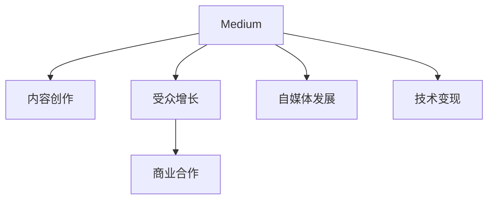

                 

# 程序员如何利用Medium进行知识变现

> 关键词：Medium,知识变现,技术博客,程序员,内容创作,商业合作,受众增长,网络影响力

## 1. 背景介绍

### 1.1 问题由来
在互联网时代，知识的获取和传播变得更加方便快捷，但同时也带来了内容泛滥、质量参差不齐的问题。如何高效地筛选和利用优质的技术信息，成为每个程序员必须面对的挑战。

Medium作为一家全球知名的内容分享平台，以其高水平的技术和内容创作者，吸引了大量的开发者和程序员用户。利用Medium进行知识变现，不仅可以帮助程序员提升个人品牌和影响力，还能带来一定的经济收益。本文将介绍如何利用Medium进行技术博客创作，以及如何通过各种手段将技术知识变现。

### 1.2 问题核心关键点
利用Medium进行知识变现，主要依赖以下几个关键点：

- **内容创作**：高质量、有深度、实用的技术博客内容。
- **受众增长**：吸引和保留大量目标受众，提升内容阅读量和用户粘性。
- **商业合作**：与各类品牌和企业合作，获取广告收入、付费订阅等商业机会。
- **自媒体发展**：打造个人品牌，通过网站、书籍、线下活动等方式进行全方位推广。
- **技术变现**：提供技术咨询、在线课程、书籍撰写等服务，实现知识变现。

## 2. 核心概念与联系

### 2.1 核心概念概述

为更好地理解如何利用Medium进行知识变现，本节将介绍几个密切相关的核心概念：

- **Medium**：全球最大的内容分享平台之一，主要用户为技术爱好者、开发者和内容创作者。Medium平台提供丰富的创作工具和多元化的内容分享方式，是技术知识变现的理想平台。
- **技术博客创作**：通过撰写高质量的技术博客文章，分享个人技术见解和经验，提升个人品牌和影响力。
- **受众增长**：吸引并保持大量的目标受众，提升内容阅读量和用户粘性，是知识变现的基础。
- **商业合作**：与各类品牌和企业合作，获取广告收入、付费订阅等商业机会，实现知识变现。
- **自媒体发展**：通过网站、书籍、线下活动等方式，全方位推广个人品牌和技术知识，拓宽变现渠道。
- **技术变现**：提供技术咨询、在线课程、书籍撰写等服务，将技术知识转化为经济收益。

这些核心概念之间的逻辑关系可以通过以下Mermaid流程图来展示：

这个流程图展示了好利用Medium进行知识变现的几个核心环节：

1. 在Medium平台上创建高质量的内容。
2. 通过各种手段吸引和保持目标受众。
3. 与品牌和企业合作，获得商业机会。
4. 通过多种方式推广个人品牌和技术知识。
5. 提供各类技术服务，实现知识变现。

## 3. 核心算法原理 & 具体操作步骤
### 3.1 算法原理概述

利用Medium进行知识变现，本质上是一个内容创作和商业化的过程。其核心思想是：通过在Medium上发布高质量、有深度的技术博客文章，吸引和保持大量目标受众，进而与品牌和企业合作，实现商业变现。

形式化地，假设我们要在Medium上发布一篇技术博客文章，获得读者阅读量 $R$，与品牌合作获得广告收入 $A$，通过付费订阅获得订阅费 $S$，以及提供技术咨询服务获得服务费 $T$。变现的总收益 $B$ 可以表示为：

$$
B = R \times a + A + S + T
$$

其中 $a$ 为每次阅读量带来的收益系数，可以通过Medium平台的广告分成率来计算。而 $A, S, T$ 为通过商业合作、付费订阅、技术咨询等途径获得的收入。

### 3.2 算法步骤详解

利用Medium进行知识变现的主要操作步骤包括以下几个关键步骤：

**Step 1: 选择合适的写作主题**
- 根据自身兴趣和技术领域，选择具有市场潜力、受众需求高的主题进行创作。
- 可以结合当下技术热点、市场需求，确定具体的写作方向。
- 使用工具如Google Trends、Stack Overflow等，进行市场调研，找到潜在受众感兴趣的领域。

**Step 2: 创作高质量的技术博客内容**
- 确定文章结构，包括引言、正文、总结等部分。
- 利用Markdown、GitHub Pages等工具，快速搭建博客页面，提升创作效率。
- 详细描述技术原理、应用场景、案例分析等，确保内容深度和实用性。
- 添加代码示例、图表、动画等，提升内容的可读性和吸引力。

**Step 3: 发布和推广**
- 利用Medium平台发布文章，选择合适的分类标签，增加曝光率。
- 使用社交媒体、邮件订阅等渠道进行推广，吸引更多的读者关注。
- 与技术社区、论坛、博客等进行合作，互相推广。

**Step 4: 受众互动与维护**
- 积极回复读者的评论和提问，提升用户体验和满意度。
- 定期更新博客内容，保持与受众的互动和粘性。
- 参与社区讨论和话题讨论，提升个人品牌影响力。

**Step 5: 商业合作与变现**
- 与各类品牌和企业合作，获取广告收入、付费订阅等商业机会。
- 提供技术咨询、在线课程、书籍撰写等服务，实现知识变现。
- 开设Medium付费订阅，提供优质内容，提升订阅费收入。

以上是利用Medium进行知识变现的一般流程。在实际应用中，还需要针对具体内容和技术领域，对各个环节进行优化设计，如改进写作技巧、优化推广策略、设计商业模型等，以进一步提升变现效果。

### 3.3 算法优缺点

利用Medium进行知识变现的优势包括：

- **高曝光率**：Medium平台拥有大量活跃用户，可以迅速提升内容的曝光率和阅读量。
- **多样化的变现方式**：除了广告收入外，还可以获取付费订阅、商业合作、技术服务等收入。
- **相对简单**：技术门槛较低，可以通过轻量级的Markdown工具快速创作和发布文章。

同时，也存在一些局限性：

- **竞争激烈**：技术领域竞争激烈，需要不断提升内容质量和创新性，才能脱颖而出。
- **品牌影响有限**：在流量有限的领域， Medium的影响力可能有限，难以获得大量商业机会。
- **变现成本高**：虽然成本相对较低，但需要投入时间和精力进行内容创作和推广。

尽管存在这些局限性，但Medium仍是一个极佳的内容创作和变现平台，尤其适合有一定技术基础的开发者和内容创作者。通过不断优化内容质量和变现策略，可以在Medium上实现稳定且可观的收益。

### 3.4 算法应用领域

利用Medium进行知识变现的方法已经在技术领域得到了广泛的应用，涵盖了以下几个主要领域：

- **技术分享与交流**：通过 Medium 发布技术博客，分享最新的技术进展、项目经验、行业趋势等内容，提升个人品牌和影响力。
- **课程与培训**：开设在线课程或提供技术培训，利用Medium进行宣传和招生，实现知识变现。
- **咨询与顾问**：通过Medium平台发布技术咨询和顾问服务，解决读者在技术实现、项目开发等方面的问题，获取服务费。
- **书籍撰写与出版**：将Medium上的技术博客内容整理成书籍，通过各大出版社或自出版的形式，获得经济收益。
- **品牌推广**：与各类品牌和企业合作，发布商业文章、产品评测、案例分析等内容，提升品牌知名度和市场影响力。

除了上述这些常见领域外，利用Medium进行知识变现还可以拓展到更多方向，如技术产品推广、在线论坛版主、技术自媒体等，为程序员提供更广阔的变现空间。

## 4. 数学模型和公式 & 详细讲解  
### 4.1 数学模型构建

本节将使用数学语言对利用Medium进行知识变现的过程进行更加严格的刻画。

假设我们希望在Medium上发布一篇技术博客，获得阅读量 $R$，与品牌合作获得广告收入 $A$，通过付费订阅获得订阅费 $S$，以及提供技术咨询服务获得服务费 $T$。设每次阅读量带来的收益系数为 $a$，则总收益 $B$ 可以表示为：

$$
B = aR + A + S + T
$$

其中，$a$ 为每次阅读量带来的收益系数，可以通过Medium平台的广告分成率来计算。

### 4.2 公式推导过程

为了进一步简化问题，我们假设每次阅读带来的收益 $a$ 为常数，且广告收入、订阅费、服务费等也为常数。则总收益 $B$ 的计算公式可以简化为：

$$
B = aR + A + S + T
$$

其中，$R$ 为文章的阅读量，$A$ 为广告收入，$S$ 为订阅费，$T$ 为服务费。

在实际应用中，我们可以通过以下步骤来最大化总收益 $B$：

1. 优化文章质量，提升阅读量 $R$。
2. 选择合适的内容发布时机，增加阅读量 $R$。
3. 与品牌合作，获取广告收入 $A$。
4. 提供付费订阅服务，增加订阅费 $S$。
5. 开设技术咨询服务，提供服务费 $T$。

通过以上方法，可以在Medium平台上实现稳定的知识变现。

### 4.3 案例分析与讲解

下面以一个具体的案例来说明如何利用Medium进行知识变现：

**案例背景**：一名经验丰富的程序员，利用Medium发布关于机器学习的技术博客，希望通过知识变现提升个人品牌和收入。

**案例分析**：
1. **选择合适的写作主题**：选择当前热门的机器学习算法、深度学习框架、应用场景等内容进行写作。
2. **创作高质量的技术博客内容**：详细讲解机器学习算法的原理、应用场景、案例分析，并添加代码示例、图表等，提升内容的深度和实用性。
3. **发布和推广**：在Medium平台上发布文章，选择合适的分类标签，使用社交媒体、邮件订阅等渠道进行推广，吸引更多读者关注。
4. **受众互动与维护**：积极回复读者的评论和提问，定期更新博客内容，保持与受众的互动和粘性。
5. **商业合作与变现**：与各类品牌和企业合作，发布商业文章、产品评测等内容，获得广告收入和品牌曝光。同时开设付费订阅服务，提供优质内容，提升订阅费收入。此外，还可以通过提供技术咨询服务、开设在线课程等方式，实现知识变现。

通过以上步骤，该程序员在Medium上获得了稳定的收入和广泛的知名度，不仅提升了个人品牌，还实现了技术知识变现。

## 5. 项目实践：代码实例和详细解释说明
### 5.1 开发环境搭建

在进行知识变现的实践前，我们需要准备好开发环境。以下是使用Medium进行知识变现的环境配置流程：

1. 注册Medium账号，登录Medium网站。
2. 创建新的博客页面，设置博客标题和描述，选择合适的分类标签。
3. 安装Markdown编辑器，如Typora、ZyBlog等，用于编写技术博客。
4. 利用GitHub Pages搭建静态博客网站，便于备份和分享。

完成上述步骤后，即可在Medium上开始知识变现的实践。

### 5.2 源代码详细实现

这里我们以一个具体的技术博客为例，给出在Medium上发布文章的代码实现。

首先，创建新的博客页面：

1. 登录Medium账号，进入博客页面。
2. 点击“New Blog Post”，选择分类标签，输入博客标题和描述。
3. 开始编写博客内容，使用Markdown语法添加标题、段落、代码块等。

然后，进行内容推广：

1. 使用社交媒体平台，如Twitter、LinkedIn等，分享技术博客链接，吸引更多读者关注。
2. 通过邮件订阅列表，向读者发送博客更新通知，提升文章曝光率。
3. 与技术社区、论坛、博客等进行合作，互相推广，增加文章阅读量。

最后，进行商业变现：

1. 开启付费订阅服务，设置订阅价格，提升订阅费收入。
2. 与各类品牌和企业合作，发布商业广告和产品评测，获取广告收入。
3. 提供技术咨询服务，通过Medium平台进行推广，获取服务费收入。

### 5.3 代码解读与分析

让我们再详细解读一下关键代码的实现细节：

**博客页面创建**：
- 利用Medium账号登录，进入博客页面，点击“New Blog Post”。
- 选择分类标签，输入博客标题和描述，开始编写博客内容。

**内容推广**：
- 利用社交媒体平台，如Twitter、LinkedIn等，分享博客链接，吸引更多读者关注。
- 通过邮件订阅列表，向读者发送博客更新通知，提升文章曝光率。
- 与技术社区、论坛、博客等进行合作，互相推广，增加文章阅读量。

**商业变现**：
- 开启付费订阅服务，设置订阅价格，提升订阅费收入。
- 与各类品牌和企业合作，发布商业广告和产品评测，获取广告收入。
- 提供技术咨询服务，通过Medium平台进行推广，获取服务费收入。

在实际操作中，除了上述代码实现外，还需要对内容质量、推广策略、商业模型等进行全面的优化和调整，方能在Medium上实现知识变现。

## 6. 实际应用场景
### 6.1 技术社区与论坛

利用Medium进行知识变现，可以广泛应用于技术社区和论坛的创建与推广。技术社区和论坛是程序员交流技术、分享经验的重要平台，而利用Medium进行知识变现，可以为技术社区和论坛带来更多的读者和商业机会。

在实践中，可以创建新的Medium博客页面，聚焦于特定的技术领域，如前端开发、后端开发、机器学习等。通过撰写高质量的技术博客，分享最新技术进展、项目经验、行业趋势等内容，吸引大量目标受众关注。同时，与技术社区、论坛、博客等进行合作，互相推广，提升文章阅读量和用户粘性。通过这些方法，可以迅速提升技术社区和论坛的影响力，实现知识变现。

### 6.2 在线课程与培训

利用Medium进行知识变现，还可以应用于在线课程和培训的推广。在线课程和培训是程序员获取技能、提升技术的重要途径，而利用Medium进行知识变现，可以为课程和培训带来更多的商业机会。

在实践中，可以创建新的Medium博客页面，聚焦于特定的技术课程或培训项目，详细讲解课程内容、教学方法、案例分析等。通过撰写高质量的技术博客，吸引大量目标受众关注。同时，开设在线课程或提供技术培训，利用Medium进行宣传和招生，实现知识变现。通过这些方法，可以迅速提升在线课程和培训的知名度和市场影响力，实现知识变现。

### 6.3 技术咨询服务与顾问

利用Medium进行知识变现，还可以应用于技术咨询服务与顾问的推广。技术咨询服务与顾问是程序员提供技术支持、解决技术问题的关键途径，而利用Medium进行知识变现，可以为技术咨询服务与顾问带来更多的商业机会。

在实践中，可以创建新的Medium博客页面，聚焦于特定的技术咨询服务或顾问项目，详细讲解技术问题、解决方案、应用场景等。通过撰写高质量的技术博客，吸引大量目标受众关注。同时，提供技术咨询服务或技术顾问服务，利用Medium进行宣传和推广，获取服务费收入。通过这些方法，可以迅速提升技术咨询服务与顾问的市场影响力，实现知识变现。

### 6.4 未来应用展望

随着Medium平台的不断发展，利用Medium进行知识变现的潜力将进一步提升。未来，可以预见更多的应用场景和变现方式，如技术书籍出版、开源软件推广、技术讲座等，为程序员提供更广阔的变现空间。

在智慧医疗、智慧城市、金融科技等新兴领域，利用Medium进行知识变现也将迎来新的机遇。通过撰写高质量的技术博客，分享最新的技术进展、应用场景、行业趋势等内容，可以为这些新兴领域带来更多的读者和商业机会。

## 7. 工具和资源推荐
### 7.1 学习资源推荐

为了帮助开发者系统掌握利用Medium进行知识变现的理论基础和实践技巧，这里推荐一些优质的学习资源：

1. Medium官方博客：Medium平台上的官方博客，介绍了如何通过Medium进行知识变现，分享了大量成功的案例和经验。
2. Medium博客指南：Medium平台上的博客指南，提供了丰富的写作技巧和推广方法，帮助读者提升写作质量和推广效果。
3. Medium收益手册：Medium平台上的收益手册，介绍了如何通过Medium实现知识变现，分享了详细的变现技巧和策略。
4. Medium收益工具：Medium平台上的收益工具，提供了丰富的分析报告和流量统计数据，帮助读者了解流量情况和变现效果。
5. Medium广告指南：Medium平台上的广告指南，介绍了如何通过广告收入进行变现，分享了详细的广告投放策略和效果评估方法。

通过对这些资源的学习实践，相信你一定能够快速掌握利用Medium进行知识变现的精髓，并用于解决实际的商业问题。
###  7.2 开发工具推荐

高效的开发离不开优秀的工具支持。以下是几款用于利用Medium进行知识变现开发的常用工具：

1. Markdown编辑器：如Typora、ZyBlog等，用于快速编写技术博客内容。
2. GitHub Pages：用于搭建静态博客网站，便于备份和分享。
3. Medium分析工具：Medium平台上的收益工具，提供了详细的流量分析和变现数据。
4. 社交媒体管理工具：如Buffer、Hootsuite等，用于管理和推广技术博客内容。
5. 邮件订阅管理工具：如Mailchimp、SendinBlue等，用于管理和推广技术博客内容。

合理利用这些工具，可以显著提升利用Medium进行知识变现的效率，加速创新迭代的步伐。

### 7.3 相关论文推荐

利用Medium进行知识变现的研究源于学界的持续研究。以下是几篇奠基性的相关论文，推荐阅读：

1. Medium博客：《如何通过Medium进行知识变现》：Medium平台上多篇成功案例的分享，介绍了如何通过Medium实现知识变现。
2. Medium收益指南：《Medium收益手册》：Medium平台上的收益手册，详细介绍了如何通过Medium进行变现。
3. Medium广告指南：《Medium广告指南》：Medium平台上的广告指南，分享了详细的广告投放策略和效果评估方法。
4. Medium内容分析：《Medium内容分析工具》：Medium平台上的内容分析工具，提供了详细的流量分析和变现数据。
5. Medium社区互动：《Medium社区互动指南》：Medium平台上的社区互动指南，分享了如何与读者互动和保持粘性。

这些论文代表了大语言模型微调技术的发展脉络。通过学习这些前沿成果，可以帮助研究者把握学科前进方向，激发更多的创新灵感。

## 8. 总结：未来发展趋势与挑战
### 8.1 总结

本文对利用Medium进行知识变现的方法进行了全面系统的介绍。首先阐述了利用Medium进行知识变现的背景和意义，明确了知识变现在提升个人品牌和影响力方面的独特价值。其次，从原理到实践，详细讲解了利用Medium进行内容创作、受众增长、商业合作和变现的数学原理和操作步骤，给出了具体的代码实现和分析。同时，本文还广泛探讨了利用Medium进行知识变现的实际应用场景，展示了其在技术社区、在线课程、咨询服务等领域的应用前景。此外，本文精选了利用Medium进行知识变现的学习资源和开发工具，力求为读者提供全方位的技术指引。

通过本文的系统梳理，可以看到，利用Medium进行知识变现是程序员提升个人品牌和影响力，实现经济收益的重要手段。利用Medium的强大影响力和广泛受众，程序员可以迅速提升技术博客的曝光率和阅读量，从而实现稳定的知识变现。未来，随着Medium平台的不断发展，以及各类工具和资源的不断丰富，利用Medium进行知识变现的潜力将进一步提升，为程序员提供更广阔的变现空间和更多元的变现渠道。

### 8.2 未来发展趋势

展望未来，利用Medium进行知识变现将呈现以下几个发展趋势：

1. **内容质量提升**：随着技术的发展，内容质量和深度将不断提升，吸引更多的读者关注和订阅。
2. **受众增长加速**：利用多种推广手段，提升文章阅读量和用户粘性，吸引更多的受众。
3. **商业合作多样化**：与各类品牌和企业合作，获取更多元化的商业机会，实现更稳定的变现。
4. **变现手段多元化**：除了广告收入、订阅费外，还可以通过技术咨询、在线课程、书籍出版等方式实现变现。
5. **平台多元化**：除了Medium平台外，还可以拓展到其他社交媒体平台、视频平台等，进一步扩大变现渠道。

以上趋势凸显了利用Medium进行知识变现的广阔前景。这些方向的探索发展，必将进一步提升知识变现的效果，为程序员提供更广阔的变现空间和更多元的变现渠道。

### 8.3 面临的挑战

尽管利用Medium进行知识变现已经取得了一定的成效，但在迈向更加智能化、普适化应用的过程中，它仍面临着诸多挑战：

1. **内容质量要求高**：高质量的技术博客内容是吸引读者的关键，需要不断提升内容质量和深度。
2. **受众增长困难**：在竞争激烈的技术领域，吸引和保持大量目标受众，需要不断创新和优化推广策略。
3. **商业合作难度大**：在流量有限的领域， Medium的影响力可能有限，难以获得大量商业机会。
4. **变现成本高**：虽然成本相对较低，但需要投入时间和精力进行内容创作和推广，运营成本较高。
5. **技术门槛高**：需要具备一定的技术能力和内容创作能力，才能撰写高质量的技术博客。

尽管存在这些挑战，但利用Medium进行知识变现的潜力依然巨大。通过不断优化内容质量、推广策略和变现模型，可以在Medium上实现稳定且可观的收益。

### 8.4 研究展望

面对利用Medium进行知识变现所面临的种种挑战，未来的研究需要在以下几个方面寻求新的突破：

1. **内容质量优化**：通过引入AI技术，自动生成高质量的技术博客内容，提升内容创作的效率和质量。
2. **受众增长策略**：利用大数据和机器学习技术，精准定位目标受众，提升推广效果和受众粘性。
3. **商业合作拓展**：探索新的商业合作模式，获取更多元化的商业机会，实现更稳定的变现。
4. **变现手段创新**：引入新的变现手段，如付费问答、虚拟研讨会等，实现知识变现的多样化和多元化。
5. **平台多元化**：拓展到其他社交媒体平台、视频平台等，进一步扩大变现渠道。

这些研究方向的探索，必将引领利用Medium进行知识变现技术迈向更高的台阶，为程序员提供更广阔的变现空间和更多元的变现渠道。只有勇于创新、敢于突破，才能不断拓展知识变现的边界，让知识更好地服务于社会。

## 9. 附录：常见问题与解答

**Q1：如何提升利用Medium进行知识变现的效果？**

A: 提升利用Medium进行知识变现的效果，主要可以从以下几个方面入手：
1. 提升内容质量：详细讲解技术原理、应用场景、案例分析等，确保内容深度和实用性。
2. 优化推广策略：利用社交媒体、邮件订阅等渠道进行推广，吸引更多读者关注。
3. 与品牌合作：与各类品牌和企业合作，获取广告收入和品牌曝光。
4. 提供优质服务：通过技术咨询、在线课程等方式，提供优质服务，提升订阅费收入。
5. 持续创新：不断创新和优化推广策略，提升受众粘性和变现效果。

通过以上方法，可以在Medium上实现稳定的知识变现。

**Q2：如何利用Medium进行技术博客创作？**

A: 利用Medium进行技术博客创作，主要包括以下几个步骤：
1. 选择合适的写作主题，确定文章结构，包括引言、正文、总结等部分。
2. 利用Markdown、GitHub Pages等工具，快速搭建博客页面，提升创作效率。
3. 详细描述技术原理、应用场景、案例分析等，确保内容深度和实用性。
4. 添加代码示例、图表、动画等，提升内容的可读性和吸引力。
5. 积极回复读者的评论和提问，定期更新博客内容，保持与受众的互动和粘性。

通过以上方法，可以在Medium上发布高质量的技术博客，提升个人品牌和影响力。

**Q3：利用Medium进行知识变现的优势和劣势是什么？**

A: 利用Medium进行知识变现的优势包括：
1. 高曝光率：Medium平台拥有大量活跃用户，可以迅速提升内容的曝光率和阅读量。
2. 多样化的变现方式：除了广告收入外，还可以获取付费订阅、商业合作、技术服务等收入。
3. 技术门槛较低：技术门槛较低，可以通过轻量级的Markdown工具快速创作和发布文章。

同时，也存在一些劣势：
1. 竞争激烈：技术领域竞争激烈，需要不断提升内容质量和创新性，才能脱颖而出。
2. 品牌影响有限：在流量有限的领域， Medium的影响力可能有限，难以获得大量商业机会。
3. 变现成本高：虽然成本相对较低，但需要投入时间和精力进行内容创作和推广。

尽管存在这些劣势，但Medium仍是一个极佳的内容创作和变现平台，尤其适合有一定技术基础的开发者和内容创作者。通过不断优化内容质量和变现策略，可以在Medium上实现稳定且可观的收益。

**Q4：如何选择合适的利用Medium进行知识变现的主题？**

A: 选择合适的利用Medium进行知识变现的主题，可以从以下几个方面入手：
1. 根据自身兴趣和技术领域，选择具有市场潜力、受众需求高的主题进行创作。
2. 使用工具如Google Trends、Stack Overflow等，进行市场调研，找到潜在受众感兴趣的领域。
3. 结合当下技术热点、市场需求，确定具体的写作方向。

通过以上方法，可以迅速找到适合利用Medium进行知识变现的主题，提升变现效果。

**Q5：如何提升利用Medium进行知识变现的受众增长效果？**

A: 提升利用Medium进行知识变现的受众增长效果，主要可以从以下几个方面入手：
1. 利用社交媒体平台，如Twitter、LinkedIn等，分享技术博客链接，吸引更多读者关注。
2. 通过邮件订阅列表，向读者发送博客更新通知，提升文章曝光率。
3. 与技术社区、论坛、博客等进行合作，互相推广，增加文章阅读量。
4. 定期更新博客内容，保持与受众的互动和粘性。
5. 积极回复读者的评论和提问，提升用户体验和满意度。

通过以上方法，可以迅速提升利用Medium进行知识变现的受众增长效果，实现稳定的变现。

---

作者：禅与计算机程序设计艺术 / Zen and the Art of Computer Programming

