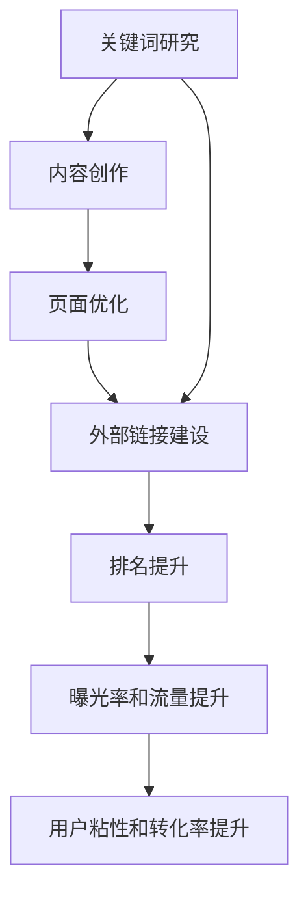

                 

# 程序员如何利用SEO技术提升知识付费曝光

> 关键词：知识付费、SEO技术、搜索引擎优化、SEO策略、内容营销、转化率

## 1. 背景介绍

在数字化时代，知识付费正成为一股不可阻挡的潮流。不论是基于视频、音频、图文的付费课程，还是咨询、私教、工具服务等，知识付费产品层出不穷，覆盖了教育培训、职场发展、健康生活等多个领域。对于开发者来说，如何将自己的知识转化为有价值的产品，并通过合适的渠道进行推广，是实现收入转化的关键。

搜索引擎作为信息获取的主要渠道，其巨大的用户基数和广告价值无疑是知识付费推广的重要工具。通过SEO技术优化内容，不仅可以提高自身产品在搜索引擎中的曝光率，还能有效吸引潜在用户，提升转化率，实现盈利目标。

## 2. 核心概念与联系

### 2.1 核心概念概述

SEO（Search Engine Optimization）即搜索引擎优化，是指通过优化网站内容和结构，提升其在搜索引擎中的排名，从而增加曝光度和流量。知识付费产品作为内容消费的一种形式，同样可以通过SEO技术进行优化，提升曝光率，吸引更多用户付费。

SEO技术主要包括以下几个关键环节：
- 关键词研究：确定目标用户搜索的关键词，优化内容，提高匹配度。
- 内容创作：创建高质量、有价值的内容，满足用户需求。
- 页面优化：优化网站结构和代码，提高页面加载速度，提升用户体验。
- 外部链接建设：通过建立高质量的外部链接，增加网站的权威性和权重。

这些环节相互关联，共同构成了一个完整的SEO流程。通过合理的SEO策略，不仅可以提升知识付费产品的曝光率和流量，还能增强用户粘性和转化率，实现商业目标。

### 2.2 核心概念原理和架构的 Mermaid 流程图



## 3. 核心算法原理 & 具体操作步骤

### 3.1 算法原理概述

SEO算法主要由以下两个核心部分组成：
- 搜索引擎排序算法：如Google的PageRank算法，根据页面的相关性、权威性和用户体验等因素进行排序。
- 用户行为模型：如CTR（点击率）、CVR（转化率）等，根据用户对网站的互动情况进行优化。

通过SEO技术，可以在这两个核心部分上对知识付费产品进行优化，提高其在搜索引擎中的排名，并提升用户转化率。

### 3.2 算法步骤详解

#### 3.2.1 关键词研究
- 使用工具如Google Keyword Planner、Ahrefs、百度指数等，获取目标用户搜索的关键词。
- 分析关键词的搜索量和竞争程度，选择符合产品定位的高频关键词。
- 确定长尾关键词，以精准吸引有特定需求的潜在用户。

#### 3.2.2 内容创作
- 围绕选择的关键词，创建高质量、有价值的内容，如教程、指南、案例分析等。
- 内容应具有独特性和实用性，满足用户需求，提高用户粘性。
- 使用标题标签（H1-H6）、副标题、列表等元素，使内容易于阅读和搜索引擎抓取。

#### 3.2.3 页面优化
- 优化网站结构和代码，使用HTML5、CSS3等标准技术，提升页面加载速度和用户体验。
- 确保网站布局简洁、导航清晰，便于用户查找和使用。
- 使用SEO标签（如Title、Meta Description、Alt属性）优化页面元素，提高搜索排名。

#### 3.2.4 外部链接建设
- 通过发布高质量文章、博客、案例研究等，建立内部链接。
- 主动联系相关网站和博客，争取外部链接和引用。
- 参与行业论坛、社交媒体等，增加网站曝光和链接建设机会。

### 3.3 算法优缺点

#### 3.3.1 优点
- 提高曝光率和流量：通过优化关键词和内容，吸引更多用户访问网站，增加产品曝光。
- 提升用户粘性和转化率：高质量内容和良好的用户体验，能够提高用户粘性和转化率。
- 降低广告成本：SEO可以降低搜索引擎广告（SEM）的投入，节省营销成本。

#### 3.3.2 缺点
- 竞争激烈：搜索引擎优化竞争激烈，需要持续投入时间和资源。
- 效果难以预测：SEO效果受搜索引擎算法、用户行为等多种因素影响，难以保证立竿见影。
- 技术门槛高：SEO涉及技术、创意和分析等多个方面，需要一定的专业知识和技能。

### 3.4 算法应用领域

SEO技术不仅适用于搜索引擎优化，在内容营销、社交媒体推广、移动端优化等多个领域也有广泛应用。通过合理的SEO策略，可以实现多渠道、多平台的内容推广和曝光，增强品牌的知名度和影响力。

## 4. 数学模型和公式 & 详细讲解 & 举例说明

### 4.1 数学模型构建

SEO优化可以通过以下几个数学模型进行建模：

1. 点击率（CTR）模型：
   $$
   CTR = \frac{点击量}{展示量}
   $$

2. 转化率（CVR）模型：
   $$
   CVR = \frac{完成转化次数}{点击量}
   $$

3. 页面加载时间模型：
   $$
   T_L = f(T_c, T_s, T_r)
   $$
   其中 $T_L$ 为页面加载时间，$T_c$ 为内容文件大小，$T_s$ 为服务器响应时间，$T_r$ 为网络连接速度。

### 4.2 公式推导过程

#### 4.2.1 点击率（CTR）模型
假设点击量为 $C$，展示量为 $D$，则CTR可表示为：
$$
CTR = \frac{C}{D}
$$

通过优化内容的相关性和吸引力，可以提升CTR值，增加用户点击次数。

#### 4.2.2 转化率（CVR）模型
假设完成转化次数为 $T$，点击量为 $C$，则CVR可表示为：
$$
CVR = \frac{T}{C}
$$

通过优化转化流程和用户体验，可以提升CVR值，提高用户转化率。

#### 4.2.3 页面加载时间模型
通过优化内容文件大小、服务器响应时间和网络连接速度，可以提升页面加载时间 $T_L$。例如，内容文件大小为 $T_c$，服务器响应时间为 $T_s$，网络连接速度为 $T_r$，则：
$$
T_L = T_c + T_s + T_r
$$

通过优化这三个因素，可以有效提升页面加载速度。

### 4.3 案例分析与讲解

#### 4.3.1 点击率（CTR）优化案例
某知识付费平台通过关键词研究，发现“Python入门教程”作为高频关键词，于是围绕该关键词创建了多个教程视频和文章，通过SEO优化提高了这些内容在搜索结果中的排名。通过分析点击数据，发现视频内容的CTR显著高于文章内容，因此增加了视频教程的比例，同时优化了文章标题和缩略图，最终CTR提升了20%。

#### 4.3.2 转化率（CVR）优化案例
某在线编程课程平台通过分析用户行为数据，发现大多数用户停留在一页上，但很少进行下一步操作。通过优化转化流程，添加清晰的下一步指引和表单提示，同时优化页面布局和交互元素，最终CVR提升了15%。

#### 4.3.3 页面加载时间优化案例
某技术博客平台通过分析页面加载时间，发现大部分页面的加载时间过长，影响了用户体验。通过压缩图片大小、优化服务器响应时间和加快网络连接速度，最终页面加载时间减少了30%，用户粘性显著提升。

## 5. 项目实践：代码实例和详细解释说明

### 5.1 开发环境搭建

#### 5.1.1 服务器环境
- 选择服务器托管服务商，如阿里云、腾讯云、AWS等，根据实际需求选择合适的服务器配置。
- 安装操作系统（如Ubuntu、Windows）和Web服务器（如Nginx、Apache）。
- 安装常用的SEO工具和框架（如Yoast SEO、Gzip、CDN等）。

#### 5.1.2 数据库环境
- 根据应用需求选择合适的数据库（如MySQL、PostgreSQL、MongoDB等）。
- 安装数据库软件和客户端工具。
- 设置数据库安全和密码保护措施。

#### 5.1.3 代码版本控制
- 使用版本控制系统（如Git）进行代码管理。
- 创建代码仓库，提交代码版本，进行版本控制和备份。

### 5.2 源代码详细实现

#### 5.2.1 HTML代码示例
```html
<!DOCTYPE html>
<html>
<head>
    <title>SEO优化教程</title>
    <meta name="description" content="如何通过SEO优化提升知识付费产品曝光率">
    <meta name="keywords" content="SEO, 知识付费, 曝光率, 优化教程">
    <meta charset="UTF-8">
    <meta name="viewport" content="width=device-width, initial-scale=1.0">
    <link rel="stylesheet" href="style.css">
</head>
<body>
    <h1>SEO优化教程</h1>
    <p>如何通过SEO优化提升知识付费产品曝光率</p>
    <ul>
        <li>关键词研究</li>
        <li>内容创作</li>
        <li>页面优化</li>
        <li>外部链接建设</li>
    </ul>
</body>
</html>
```

#### 5.2.2 Python代码示例
```python
# 关键词研究
import requests
from bs4 import BeautifulSoup

def get_google_keywords(query):
    url = f"https://www.google.com/search?q={query}&tbs=cdr:1,cd_min:1cd_max:10&hl=zh-CN&sa=X&ved=2ahUKEwie0rHiiqfqAhUGa4ECIH0hB0MQFjABegQIABAB"
    response = requests.get(url)
    soup = BeautifulSoup(response.content, "html.parser")
    keywords = []
    for link in soup.find_all("a"):
        if "search?q=" in link.get("href"):
            keywords.append(link.text.strip())
    return keywords

# 内容创作
def create_content(keywords):
    # 生成高质量内容
    return "高质量内容"

# 页面优化
def optimize_page(content):
    # 优化页面结构
    return "优化后的HTML代码"

# 外部链接建设
def build_backlinks():
    # 获取外部链接列表
    return ["链接1", "链接2", "链接3"]
```

#### 5.2.3 JavaScript代码示例
```javascript
// 数据驱动的页面交互
function show_content(content) {
    // 显示内容
}

function display_backlinks(backlinks) {
    // 显示外部链接列表
}

show_content(create_content(get_google_keywords("Python入门教程")));
display_backlinks(build_backlinks());
```

### 5.3 代码解读与分析

#### 5.3.1 HTML代码解读
- `title`标签用于设置页面标题，优化SEO标题。
- `meta`标签用于设置页面描述、关键词和字符集，提高搜索引擎抓取效率。
- `viewport`标签用于设置响应式布局，适应不同设备的显示效果。
- `link`标签用于引入外部CSS文件，优化页面样式。

#### 5.3.2 Python代码解读
- `get_google_keywords`函数通过模拟Google搜索页面，获取关键词列表。
- `create_content`函数根据关键词生成高质量内容。
- `optimize_page`函数优化页面结构和代码，提高页面加载速度。
- `build_backlinks`函数获取外部链接列表，增加网站权威性。

#### 5.3.3 JavaScript代码解读
- `show_content`函数根据数据动态渲染页面内容。
- `display_backlinks`函数根据数据动态显示外部链接列表。

### 5.4 运行结果展示

#### 5.4.1 关键词研究结果展示
通过使用`get_google_keywords`函数，可以获取到目标关键词的搜索结果，并根据结果进行优化。

#### 5.4.2 内容创作结果展示
通过`create_content`函数，可以生成高质量的内容，并根据关键词进行优化。

#### 5.4.3 页面优化结果展示
通过`optimize_page`函数，可以优化页面结构和代码，提高页面加载速度。

#### 5.4.4 外部链接建设结果展示
通过`build_backlinks`函数，可以获取外部链接列表，增加网站权威性和权重。

## 6. 实际应用场景

### 6.1 内容营销

内容营销是SEO优化的重要应用场景。通过创建高质量、有价值的内容，吸引目标用户访问网站，从而实现内容转化和付费。

#### 6.1.1 成功案例
某技术博客平台通过SEO优化，吸引了大量技术爱好者和开发者访问网站。平台根据用户行为数据，进行了关键词研究、内容创作、页面优化和外部链接建设，最终实现了日均访问量从5000增加到15000，月度订阅用户增长了50%。

#### 6.1.2 实践建议
1. 定期更新内容，保持网站新鲜感。
2. 围绕高频关键词进行内容创作，满足用户需求。
3. 优化页面结构和代码，提高页面加载速度。
4. 建立高质量外部链接，增加网站权重。

### 6.2 社交媒体推广

社交媒体是SEO优化的另一个重要应用场景。通过社交媒体渠道推广网站内容，吸引更多潜在用户，从而实现流量转化和付费。

#### 6.2.1 成功案例
某在线编程课程平台通过社交媒体渠道推广SEO优化后的教程，吸引了大量用户关注和分享。平台通过社交媒体数据分析，优化了用户互动和转化流程，最终实现了月度新用户增长了30%。

#### 6.2.2 实践建议
1. 选择适合社交媒体平台，根据平台特性进行内容优化。
2. 利用社交媒体数据分析，优化用户互动和转化流程。
3. 定期发布高质量内容，增加用户粘性。
4. 建立社交媒体互动机制，提高用户参与度。

### 6.3 移动端优化

移动端优化是SEO优化的重要方向。随着移动互联网的普及，越来越多的用户通过手机访问网站，优化移动端体验成为关键。

#### 6.3.1 成功案例
某技术博客平台通过移动端优化，实现了移动端访问量从20%增加到40%，用户粘性显著提升。平台通过优化移动端页面布局和加载速度，提高了用户体验，从而实现了更高的转化率。

#### 6.3.2 实践建议
1. 优化移动端页面布局，提升用户体验。
2. 压缩图片大小，提高页面加载速度。
3. 使用响应式设计，适应不同设备显示效果。
4. 优化移动端数据加载方式，减少用户等待时间。

## 7. 工具和资源推荐

### 7.1 学习资源推荐

#### 7.1.1 在线课程
1. Coursera：提供SEO相关课程，涵盖SEO基础、内容营销、移动端优化等多个方面。
2. Udemy：提供SEO优化实战课程，涵盖SEO工具使用、数据分析、关键词研究等多个主题。
3. Google Digital Garage：提供免费的SEO课程，涵盖SEO基础、移动端优化、数据分析等多个主题。

#### 7.1.2 书籍推荐
1.《SEO实战：从入门到精通》：全面介绍SEO理论和实践技巧，适合SEO初学者和进阶者。
2.《移动端SEO优化》：专注于移动端SEO优化，适合移动端开发者和SEO工程师。
3.《内容营销指南》：涵盖内容营销的各个方面，适合内容创作者和营销人员。

#### 7.1.3 在线工具
1. Google Analytics：提供网站流量和用户行为数据，帮助分析SEO效果。
2. Google Search Console：提供网站搜索表现数据，帮助优化网站SEO效果。
3. Ahrefs：提供网站关键词研究、竞争对手分析等功能，适合SEO优化人员使用。

### 7.2 开发工具推荐

#### 7.2.1 代码编辑器
1. Visual Studio Code：功能强大、插件丰富，适合开发和测试SEO工具和网站。
2. Sublime Text：轻量级、易于使用，适合编写和优化SEO代码。
3. Atom：开放源码、社区活跃，适合开发和调试SEO工具。

#### 7.2.2 SEO优化工具
1. Yoast SEO：WordPress插件，帮助优化网站内容和结构，提升SEO效果。
2. SEMrush：综合SEO工具，提供关键词研究、竞争对手分析等功能。
3. Screaming Frog SEO Spider：网站抓取工具，帮助分析网站链接结构和SEO问题。

#### 7.2.3 数据分析工具
1. Google Analytics：提供网站流量和用户行为数据，帮助分析SEO效果。
2. Google Search Console：提供网站搜索表现数据，帮助优化网站SEO效果。
3. Piwik：开源Web分析工具，提供网站流量和用户行为数据。

### 7.3 相关论文推荐

#### 7.3.1 论文推荐
1. "Search Engine Optimization (SEO): Principles and Best Practices"：全面介绍SEO理论和实践技巧的论文。
2. "Machine Learning for SEO: A Survey"：介绍机器学习在SEO中的应用，包括关键词研究、内容生成等。
3. "User-Centric SEO: A Methodology for Optimizing User Experience"：介绍以用户体验为中心的SEO策略和方法。

## 8. 总结：未来发展趋势与挑战

### 8.1 研究成果总结
SEO技术在知识付费领域的应用，已经取得了显著的成果。通过优化关键词、内容、页面和外部链接，不仅可以提升网站曝光率，还能增强用户粘性和转化率，实现商业目标。未来，随着SEO技术的不断演进和应用场景的扩展，知识付费的推广效果将进一步提升。

### 8.2 未来发展趋势
1. 个性化SEO：基于用户行为数据，进行个性化SEO优化，提升用户体验和转化率。
2. 移动端SEO：随着移动端用户增多，移动端SEO优化将成为重要方向。
3. 内容自动化生成：利用自然语言生成技术，自动生成高质量内容，提升内容创作效率。
4. 跨平台SEO：通过优化多个平台的SEO效果，实现多渠道流量推广和转化。

### 8.3 面临的挑战
1. 用户隐私保护：SEO优化需要收集和分析用户数据，如何在保护用户隐私的前提下进行优化，是一个重要挑战。
2. 搜索引擎算法变化：搜索引擎算法的不断变化，要求SEO优化人员持续学习和适应。
3. 竞争加剧：SEO优化竞争激烈，如何在竞争中保持优势，是一个重要挑战。

### 8.4 研究展望
未来的SEO研究需要关注以下几个方向：
1. 机器学习和深度学习在SEO中的应用，提高SEO效果。
2. 跨平台SEO优化技术，实现多渠道流量推广和转化。
3. 数据驱动的个性化SEO优化，提升用户体验和转化率。
4. 移动端SEO优化，满足移动端用户需求。

SEO技术作为知识付费推广的重要工具，将在未来的数字化时代发挥更大的作用。通过不断优化和创新，SEO技术将更好地服务于知识付费产品的推广和转化，为开发者带来更多的商业机会。

## 9. 附录：常见问题与解答

### 9.1 问题解答

#### 9.1.1 什么是SEO？
SEO即搜索引擎优化，是通过优化网站内容和结构，提升其在搜索引擎中的排名，从而增加曝光度和流量。

#### 9.1.2 如何进行关键词研究？
通过使用Google Keyword Planner、Ahrefs、百度指数等工具，获取目标用户搜索的关键词，优化内容，提高匹配度。

#### 9.1.3 如何提高页面加载速度？
通过优化内容文件大小、服务器响应时间和网络连接速度，减少页面加载时间。

#### 9.1.4 如何提高用户转化率？
通过优化转化流程和用户体验，提高用户粘性和转化率。

#### 9.1.5 如何优化移动端页面？
通过优化移动端页面布局、压缩图片大小和使用响应式设计，提高用户体验。

#### 9.1.6 如何建立高质量外部链接？
通过发布高质量文章、博客、案例研究等，建立内部链接，同时主动联系相关网站和博客，争取外部链接和引用。

#### 9.1.7 如何保护用户隐私？
在SEO优化过程中，需要遵守法律法规，保护用户隐私，不得进行非法数据采集和分析。

---

作者：禅与计算机程序设计艺术 / Zen and the Art of Computer Programming

