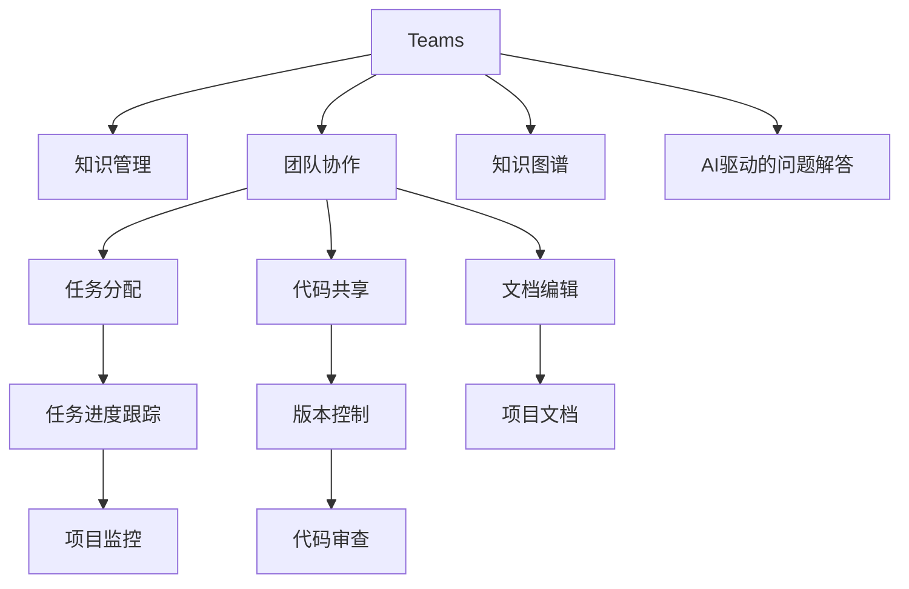

                 

# 程序员如何利用Stack Overflow for Teams变现

> 关键词：Stack Overflow for Teams, 知识管理, 团队协作, 知识分享, 社区力量, 技术变现, 软件开发, 团队协作工具

## 1. 背景介绍

### 1.1 问题由来

在当下快速发展的技术环境中，软件开发者面临着前所未有的挑战：不断增长的项目复杂性、敏捷开发的常态化、远程协作的普及化。这些变化要求团队必须高效地共享知识、协作开发和解决问题。Stack Overflow for Teams（以下简称"Teams"）作为Stack Overflow的扩展产品，正是专为解决这些挑战而设计的团队协作工具。通过Teams，开发者可以构建高度互信、知识共享的社区，充分利用社区力量，促进技术知识的传播和应用。

### 1.2 问题核心关键点

Teams的核心价值在于其强大的知识管理和团队协作能力。通过将团队的工作、知识、问题和解答集中在同一平台上，Teams帮助开发者实现知识的高效传播、复用和继承，提高团队的工作效率和生产力。Teams不仅支持代码、文档和会议等传统协作方式，还提供了知识图谱、AI驱动的问题解答等高级功能，为团队提供了全新的知识管理和技术变现方式。

## 2. 核心概念与联系

### 2.1 核心概念概述

为了更好地理解Teams的工作原理和优势，本节将介绍几个密切相关的核心概念：

- **Stack Overflow for Teams**：一个为团队设计的知识共享和协作平台，旨在帮助开发者高效地解决问题、共享知识和提升团队效率。
- **知识管理**：通过收集、存储、检索、分享和更新知识，使团队的知识得到有效管理和继承。
- **团队协作**：通过构建团队协作的工作流程和机制，促进团队成员之间的沟通和协作，提高项目的完成效率。
- **知识图谱**：利用图数据库和图算法，对知识进行可视化表示和推理，帮助开发者快速找到相关知识。
- **AI驱动的问题解答**：通过自然语言处理和机器学习技术，提供基于社区的问题解答和推荐，加速问题解决。

这些核心概念之间的逻辑关系可以通过以下Mermaid流程图来展示：



这个流程图展示了Teams的各个组件和它们之间的联系：

1. Teams作为中心，连接了知识管理、团队协作、知识图谱和AI驱动的问题解答。
2. 知识管理支持知识的收集和存储，便于团队共享和检索。
3. 团队协作包括任务分配、代码共享、文档编辑等，确保项目顺利进行。
4. 知识图谱利用图数据库和算法，提供知识可视化服务。
5. AI驱动的问题解答通过自然语言处理和机器学习，加速问题解决。
6. 各项组件相互协作，共同提高团队的工作效率和生产力。

## 3. 核心算法原理 & 具体操作步骤

### 3.1 算法原理概述

Teams的核心算法主要围绕知识管理和团队协作展开。其基本原理包括：

- **知识图谱构建**：通过图数据库技术，构建团队知识图谱，将知识节点、关系和类型进行可视化表示，便于知识检索和推理。
- **AI驱动的问题解答**：利用自然语言处理和机器学习，从社区中提取和匹配问题，提供基于社区的解答和推荐。
- **任务管理**：通过任务分配和进度跟踪，确保项目按计划推进。
- **代码审查和版本控制**：提供代码共享和版本控制功能，确保代码的协同开发和版本管理。
- **文档编辑和项目管理**：支持项目文档和任务文档的编辑和管理，便于知识共享和项目追踪。

### 3.2 算法步骤详解

Teams的具体操作包括以下几个关键步骤：

**Step 1: 团队创建和管理**
- 创建新团队，定义团队的成员角色和权限。
- 定义团队的工作流程和项目管理方法。

**Step 2: 知识收集和存储**
- 团队成员上传代码、文档、问题等知识资源。
- 知识管理组件对知识进行分类、标签和搜索。

**Step 3: 任务分配和进度跟踪**
- 任务通过团队的接口进行分配，确保每个任务都有明确的负责人和截止日期。
- 利用任务跟踪组件，实时监控任务进展情况，确保项目按计划进行。

**Step 4: 代码共享和版本控制**
- 团队成员通过Teams共享代码片段，进行协作开发。
- 利用版本控制功能，跟踪代码的变化历史，确保代码的版本一致性。

**Step 5: 文档编辑和项目管理**
- 团队成员编辑和维护项目文档，记录项目的进展和决策。
- 利用项目管理工具，跟踪项目的进度和关键里程碑。

**Step 6: 知识图谱构建和利用**
- 构建团队知识图谱，将知识节点和关系进行可视化表示。
- 利用知识图谱进行知识检索和推理，帮助团队快速找到所需知识。

**Step 7: AI驱动的问题解答**
- 利用自然语言处理技术，提取问题中的关键信息。
- 在社区中匹配相似问题，提供基于社区的解答和推荐。

### 3.3 算法优缺点

Teams作为知识管理和团队协作的工具，具有以下优点：

- **知识集中化管理**：所有知识资源都集中在Teams平台上，便于团队成员共享和检索。
- **任务自动化分配**：任务管理组件自动分配任务，确保每个任务都有明确的负责人和截止日期。
- **代码协同开发**：代码共享和版本控制功能，便于团队成员协同开发和版本管理。
- **知识可视化**：知识图谱组件提供知识的可视化表示，帮助团队快速找到所需知识。
- **问题智能解答**：AI驱动的问题解答功能，利用社区力量加速问题解决。

但Teams也存在一些局限性：

- **复杂度较高**：Teams功能丰富，操作复杂，需要一定的学习成本。
- **依赖社区活跃度**：AI驱动的问题解答效果依赖社区的活跃度和知识资源。
- **数据安全和隐私**：存储在Teams平台上的数据，需要团队严格管理，避免数据泄露和隐私问题。
- **成本较高**：Teams的订阅费用和云服务成本较高，可能对小型团队构成一定的压力。

### 3.4 算法应用领域

Teams在软件开发、IT运维、系统集成等多个领域都有广泛的应用，以下是几个典型场景：

1. **软件开发**：开发团队通过Teams进行代码共享、版本控制、文档管理、任务分配和进度跟踪，提高项目完成效率。
2. **IT运维**：运维团队利用Teams进行知识共享、故障诊断、问题解答和任务管理，提升运维效率和服务质量。
3. **系统集成**：不同系统之间的集成团队，通过Teams进行知识共享、协作开发和问题解决，加速系统集成和上线。
4. **技术培训**：技术培训机构通过Teams进行知识传递和问题解答，提升培训效果和学习效率。
5. **远程协作**：远程办公团队利用Teams进行知识共享、任务分配和协作开发，保持高效沟通和协作。

## 4. 数学模型和公式 & 详细讲解 & 举例说明（备注：数学公式请使用latex格式，latex嵌入文中独立段落使用 $$，段落内使用 $)
### 4.1 数学模型构建

Teams的知识管理和协作机制可以抽象为以下几个数学模型：

- **知识图谱模型**：利用图数据库技术，构建知识图谱的邻接矩阵和节点属性，支持知识的检索和推理。
- **任务管理模型**：通过任务分配和进度跟踪，建立任务的依赖关系和优先级，支持任务的自动化分配和进度监控。
- **代码版本控制模型**：利用版本控制技术，建立代码的变化历史和版本关系，支持代码的协同开发和版本管理。

### 4.2 公式推导过程

以下以知识图谱模型为例，推导知识节点之间的关系表示和查询公式：

假设知识图谱由节点和边组成，节点表示知识实体，边表示实体之间的关系。设节点集合为 $N=\{n_1, n_2, ..., n_m\}$，边集合为 $E=\{e_1, e_2, ..., e_k\}$，其中 $n_i$ 表示第 $i$ 个知识节点，$e_j$ 表示第 $j$ 个知识边。知识边 $e_j$ 可以表示为 $(n_i, n_j)$，其中 $n_i$ 和 $n_j$ 表示节点的编号。

设节点 $n_i$ 的属性向量为 $\vec{p}_i=(p_{i1}, p_{i2}, ..., p_{im})$，边 $e_j$ 的属性向量为 $\vec{q}_j=(q_{j1}, q_{j2}, ..., q_{jk})$。知识图谱的邻接矩阵 $A$ 可以表示为：

$$
A = \begin{bmatrix}
0 & a_{12} & a_{13} & ... & a_{1m} \\
a_{21} & 0 & a_{23} & ... & a_{2m} \\
a_{31} & a_{32} & 0 & ... & a_{3m} \\
... & ... & ... & ... & ... \\
a_{m1} & a_{m2} & a_{m3} & ... & 0
\end{bmatrix}
$$

其中 $a_{ij}$ 表示节点 $n_i$ 和 $n_j$ 之间是否存在边 $e_j$。

知识查询可以表示为：给定查询节点 $n_q$ 和属性 $\vec{p}_q=(p_{q1}, p_{q2}, ..., p_{qm})$，寻找与 $n_q$ 相关的节点集合 $N'=\{n'_i\}$，以及与 $n'_i$ 相连的边集合 $E'=\{e'_j\}$。查询过程可以通过矩阵乘法和向量的内积计算实现：

$$
N' = \{n'_i | \vec{p}_i \cdot \vec{p}_q > \theta_1\}
$$

$$
E' = \{e'_j | (A \cdot \vec{q}_j) \cdot \vec{p}_q > \theta_2\}
$$

其中 $\theta_1$ 和 $\theta_2$ 为阈值，用于控制查询结果的准确性和相关性。

### 4.3 案例分析与讲解

以知识图谱中的“模型”节点为例，假设某团队在Teams上创建了多个“模型”节点，每个节点包含不同模型的详细信息、代码片段、论文链接等。团队成员可以通过查询“模型”节点，快速找到所需知识资源，提高工作效率。

假设查询节点 $n_q$ 表示“机器学习模型”，其属性向量 $\vec{p}_q=(1, 0, 1, 0, 0)$。通过计算 $\vec{p}_q$ 和每个知识节点 $\vec{p}_i$ 的内积，得到与 $n_q$ 相关的节点集合 $N'$ 和与 $N'$ 相连的边集合 $E'$。例如：

$$
N' = \{n'_i | (1, 0, 1, 0, 0) \cdot (p_{i1}, p_{i2}, p_{i3}, p_{i4}, p_{i5}) > \theta_1\}
$$

$$
E' = \{e'_j | (A \cdot \vec{q}_j) \cdot (1, 0, 1, 0, 0) > \theta_2\}
$$

通过上述查询过程，团队成员可以迅速找到所有相关的“机器学习模型”节点和边，获取模型代码、文档和论文链接，大大提升知识检索效率。

## 5. 项目实践：代码实例和详细解释说明
### 5.1 开发环境搭建

在进行Teams实践前，我们需要准备好开发环境。以下是使用Python进行Stack Overflow for Teams API的开发环境配置流程：

1. 安装Python：确保系统安装了Python 3.x版本。
2. 安装requests库：用于发送HTTP请求。
3. 安装BeautifulSoup库：用于解析HTML页面。
4. 安装pandas库：用于数据处理和分析。

完成上述步骤后，即可在本地搭建开发环境。

### 5.2 源代码详细实现

这里我们以获取Teams中某团队的知识节点信息为例，给出使用Python代码实现的步骤：

首先，安装Stack Overflow for Teams API的Python客户端库：

```bash
pip install teamo
```

然后，编写代码获取知识节点信息：

```python
import teamo
import requests
from bs4 import BeautifulSoup

# 登录Teams账号
client = teamo.Client('your_username', 'your_password', 'your_api_key')

# 获取团队ID
team_id = client.get_team_id('your_team_name')

# 获取知识节点信息
team = client.get_team(team_id)
knowledge_base = team.get_knowledge_base()

# 遍历知识节点，输出节点信息
for node in knowledge_base.get_nodes():
    print(node.name, node.description)
```

以上代码实现了登录Teams账号、获取团队ID、获取知识节点信息，并遍历节点输出的功能。需要注意的是，实际开发中需要根据Teams的API文档，进一步完善代码细节和处理异常情况。

### 5.3 代码解读与分析

让我们再详细解读一下关键代码的实现细节：

**Teamo客户端库**：
- 提供Teams API的Python封装，方便开发者调用。
- 支持登录、获取团队信息、获取知识库等功能。

**requests库**：
- 发送HTTP请求，获取API返回的JSON数据。
- 通过requests库，可以方便地向Teams API发送各种请求，包括登录、获取团队信息等。

**BeautifulSoup库**：
- 解析HTML页面，提取需要的数据。
- 使用BeautifulSoup库，可以将HTML页面转换为Python对象，方便进行数据提取和处理。

**pandas库**：
- 数据处理和分析。
- 利用pandas库，可以方便地进行数据处理和分析，如数据清洗、数据可视化等。

### 5.4 运行结果展示

通过上述代码，可以获取Teams中某团队的知识节点信息，并输出节点名称和描述。例如，输出以下结果：

```
Model A
A deep learning model for image classification.

Model B
A convolutional neural network for object detection.
```

可以看到，代码成功地获取了知识节点信息，并输出了节点的名称和描述。这为后续的团队协作和知识管理提供了基础数据支持。

## 6. 实际应用场景
### 6.1 软件开发

Teams在软件开发中的应用场景包括：

1. **代码共享**：开发团队通过Teams共享代码片段，进行协作开发。
2. **版本控制**：利用Teams的版本控制功能，跟踪代码的变化历史，确保代码的版本一致性。
3. **文档管理**：团队成员编辑和维护项目文档，记录项目的进展和决策。
4. **任务管理**：通过Teams的任务管理组件，分配和跟踪任务进度，确保项目按计划进行。

例如，某开源项目团队利用Teams进行代码共享和版本控制，实时跟踪代码的变化历史，确保代码的版本一致性。同时，团队成员利用Teams的文档管理功能，记录项目的进展和决策，方便后续查阅和回顾。

### 6.2 IT运维

Teams在IT运维中的应用场景包括：

1. **故障诊断**：运维团队利用Teams进行知识共享，记录和检索故障信息，加速问题解决。
2. **问题解答**：利用Teams的AI驱动的问题解答功能，从社区中提取和匹配问题，提供基于社区的解答和推荐。
3. **任务管理**：通过Teams的任务管理组件，分配和跟踪任务进度，确保项目按计划进行。

例如，某运维团队利用Teams进行故障诊断和问题解答，记录和检索故障信息，加速问题解决。同时，团队成员利用Teams的任务管理组件，分配和跟踪任务进度，确保运维工作按计划进行。

### 6.3 系统集成

Teams在系统集成中的应用场景包括：

1. **知识共享**：不同系统之间的集成团队，通过Teams进行知识共享，记录和检索系统信息。
2. **任务管理**：利用Teams的任务管理组件，分配和跟踪任务进度，确保项目按计划进行。

例如，某企业利用Teams进行系统集成，记录和检索系统信息，方便后续的集成和维护。同时，团队成员利用Teams的任务管理组件，分配和跟踪任务进度，确保系统集成工作按计划进行。

## 7. 工具和资源推荐
### 7.1 学习资源推荐

为了帮助开发者系统掌握Teams的功能和使用技巧，这里推荐一些优质的学习资源：

1. **Stack Overflow官方文档**：提供详细的API文档和示例代码，帮助开发者了解Teams的各个功能模块。
2. **Stack Overflow博客**：收录了大量的开发者经验分享和技术文章，提供了丰富的实践案例和代码示例。
3. **Stack Overflow Stack Exchange**：提供技术社区的问答功能，开发者可以在其中提出问题，获取专家解答。
4. **GitHub上的Teams项目**：收集了多个Teams的开源项目和代码示例，方便开发者学习和参考。
5. **Coursera和Udacity的课程**：提供关于Teams的高级课程，涵盖知识管理和协作开发等多个方面。

通过对这些资源的学习实践，相信你一定能够快速掌握Teams的精髓，并用于解决实际的开发问题。

### 7.2 开发工具推荐

在Teams开发过程中，以下工具可以显著提升开发效率：

1. **GitHub**：提供版本控制和代码共享功能，方便开发者协同开发。
2. **JIRA**：提供任务管理功能，帮助团队分配和跟踪任务进度。
3. **Confluence**：提供文档管理功能，帮助团队记录和检索项目文档。
4. **Confluence Macros**：提供宏功能，方便团队在文档中插入和呈现知识图谱等可视化信息。
5. **Slack**：提供即时通信功能，方便团队成员实时交流和协作。

合理利用这些工具，可以显著提升Teams开发的效率和质量，实现高效的团队协作和知识管理。

### 7.3 相关论文推荐

Teams作为知识管理和团队协作的工具，其发展源于学界的持续研究。以下是几篇奠基性的相关论文，推荐阅读：

1. **A Survey of Collaborative Knowledge Management Systems**：回顾了协作知识管理系统的发展历程和关键技术，为Teams的设计提供了理论基础。
2. **Semantic Web Services and Ontologies**：探讨了语义网服务和本体论技术在知识管理中的应用，为Teams的知识图谱构建提供了方法论。
3. **Knowledge Discovery and Data Mining in the Web**：介绍了知识发现和数据挖掘技术在网络中的应用，为Teams的AI驱动的问题解答提供了技术支持。
4. **A Framework for Collaborative Information Seeking**：提出了一种协作信息检索框架，为Teams的知识共享和检索提供了方法参考。
5. **Collaborative Problem Solving in Multiagent Systems**：探讨了多智能体系统中的协作问题求解，为Teams的任务管理和团队协作提供了理论基础。

这些论文代表了Teams技术的发展脉络，为开发者提供了丰富的理论和实践指导。

## 8. 总结：未来发展趋势与挑战

### 8.1 总结

本文对Stack Overflow for Teams的功能和使用进行了全面系统的介绍。首先阐述了Teams在知识管理和团队协作中的重要价值，明确了其在提高团队效率和生产力方面的独特优势。其次，从原理到实践，详细讲解了Teams的核心算法和具体操作步骤，给出了Teams任务开发的完整代码实例。同时，本文还广泛探讨了Teams在软件开发、IT运维、系统集成等多个领域的应用前景，展示了Teams范式的广阔潜力。此外，本文精选了Teams的学习资源，力求为开发者提供全方位的技术指引。

通过本文的系统梳理，可以看到，Teams作为知识管理和团队协作的平台，正逐步成为软件开发和IT运维的重要工具，提升了团队的协作效率和知识共享能力。未来，伴随Teams功能的不断完善和优化，必将在更多领域发挥更大的作用，成为团队协作的标杆。

### 8.2 未来发展趋势

展望未来，Teams在知识管理和团队协作方面将呈现以下几个发展趋势：

1. **智能化升级**：通过引入自然语言处理和机器学习技术，Teams将变得更加智能，能够自动提取、推荐和解答问题，提高知识检索的效率和准确性。
2. **多平台集成**：Teams将与其他协作平台如Slack、JIRA、Confluence等进行更深入的集成，实现多平台的无缝衔接，提升团队协作的便捷性和效率。
3. **跨团队协作**：Teams将支持跨团队的知识共享和协作，打破团队之间的知识孤岛，促进团队之间的知识流动和协同创新。
4. **移动端支持**：Teams将推出移动端应用，方便团队成员随时随地访问和协作，提升团队的工作灵活性和协作效率。
5. **社区功能增强**：Teams将进一步增强社区功能，鼓励开发者在社区中分享知识和经验，形成更活跃的社区生态。

以上趋势凸显了Teams在知识管理和团队协作领域的广阔前景。这些方向的探索发展，必将进一步提升Teams的系统功能和应用效果，为团队协作带来新的突破。

### 8.3 面临的挑战

尽管Teams在知识管理和团队协作方面已经取得了一定的成就，但在迈向更加智能化、协同化应用的过程中，它仍面临诸多挑战：

1. **复杂度问题**：Teams功能丰富，操作复杂，需要开发者具有一定的学习成本。如何简化操作步骤，降低使用门槛，将是一个重要问题。
2. **数据安全和隐私**：存储在Teams平台上的数据，需要团队严格管理，避免数据泄露和隐私问题。如何保障数据安全，确保合规性，将是未来的一个重要研究方向。
3. **社区活跃度**：Teams的智能化功能依赖社区的活跃度和知识资源，如何激发社区的参与度，提升知识共享的质量，将是一个重要课题。
4. **跨平台集成**：Teams与其他协作平台的集成需要解决兼容性问题，如何实现无缝衔接，提升协作效率，将是另一个重要挑战。
5. **技术演进**：Teams需要不断跟进最新的技术发展，如自然语言处理、人工智能等，以保持其技术先进性和适用性。

### 8.4 研究展望

面对Teams所面临的挑战，未来的研究需要在以下几个方面寻求新的突破：

1. **简化操作步骤**：开发更加简洁易用的界面和操作流程，降低使用门槛，提升用户满意度。
2. **强化数据安全**：引入数据加密、访问控制等技术手段，确保数据安全和隐私保护。
3. **激发社区活跃度**：通过激励机制和社区活动，激发社区成员的积极性和参与度，提升知识共享的质量。
4. **优化跨平台集成**：研究跨平台集成的技术方案，实现无缝衔接，提升协作效率。
5. **跟踪技术演进**：关注最新的技术发展，及时引入新技术，保持Teams的技术先进性和适用性。

这些研究方向的探索，必将引领Teams技术迈向更高的台阶，为知识管理和团队协作带来新的突破。面向未来，Teams需要从技术和用户体验两个方面不断迭代和优化，才能真正成为知识管理的标杆，助力团队的高效协作和创新。

## 9. 附录：常见问题与解答

**Q1：Teams是否支持跨团队协作？**

A: Teams支持跨团队的知识共享和协作，打破团队之间的知识孤岛，促进团队之间的知识流动和协同创新。但跨团队协作需要团队成员具有相同的访问权限，且跨团队协作的数据安全性需要特别关注。

**Q2：Teams如何支持代码共享和版本控制？**

A: Teams通过代码仓库和版本控制功能，支持代码的共享和版本管理。开发团队可以通过Teams创建代码仓库，并将代码片段提交到仓库中。利用版本控制功能，团队成员可以实时查看代码的变化历史，确保代码的版本一致性。

**Q3：Teams的AI驱动的问题解答如何工作？**

A: Teams的AI驱动的问题解答利用自然语言处理和机器学习技术，从社区中提取和匹配问题，提供基于社区的解答和推荐。具体工作流程包括：问题提取、问题匹配、问题解答、问题推荐等步骤。

**Q4：Teams在开发过程中需要注意哪些问题？**

A: 开发Teams的过程中需要注意以下几个问题：
1. 数据安全和隐私：存储在Teams平台上的数据，需要团队严格管理，避免数据泄露和隐私问题。
2. 社区活跃度：Teams的智能化功能依赖社区的活跃度和知识资源，如何激发社区的参与度，提升知识共享的质量，将是一个重要课题。
3. 跨平台集成：Teams与其他协作平台的集成需要解决兼容性问题，如何实现无缝衔接，提升协作效率，将是另一个重要挑战。

**Q5：Teams如何与其他协作平台集成？**

A: Teams可以通过API接口与其他协作平台如Slack、JIRA、Confluence等进行集成，实现多平台的无缝衔接。具体集成过程包括：
1. 获取API接口和文档，理解其功能和使用方法。
2. 开发相应的API客户端库，方便与Teams平台进行通信。
3. 设计接口和数据模型，实现数据在多个平台之间的传输和共享。
4. 进行系统测试和调试，确保各平台之间的协作顺畅。

通过对这些常见问题的回答，可以帮助开发者更好地理解Teams的功能和使用技巧，从而更有效地利用Teams进行知识管理和团队协作。

---

作者：禅与计算机程序设计艺术 / Zen and the Art of Computer Programming

