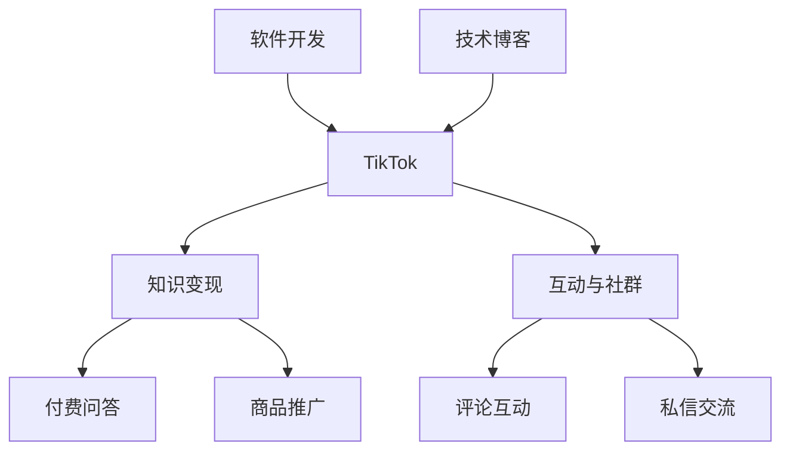

                 

# 程序员如何利用TikTok进行知识变现

> 关键词：TikTok, 知识变现, 技术博客, 软件开发, 编程技巧

## 1. 背景介绍

### 1.1 问题由来
随着移动互联网的迅猛发展，短视频平台成为新一代的互联网内容生态。TikTok作为其中的佼佼者，凭借其高度互动和趣味性，吸引了海量的用户和创作者。对于程序员来说，TikTok不仅是一个展示编程技能、分享知识心得的平台，更是一个机会，可以将自己的专业技能转化为实际的收益。

### 1.2 问题核心关键点
程序员利用TikTok进行知识变现的关键在于两个方面：一是通过短视频内容展示自己的专业知识和技能；二是通过互动和变现功能，将观众转化为付费用户，实现收入增长。具体来说，可以从以下几个方面入手：

- **内容创作**：制作高质量的编程教学、案例分析、技术分享等内容。
- **互动与社群**：通过评论区和私信与观众互动，建立社区，形成品牌效应。
- **变现策略**：利用TikTok提供的付费问答、商品推广等功能，实现知识变现。

### 1.3 问题研究意义
程序员通过TikTok进行知识变现，不仅能够展示个人能力和技术水平，拓宽职业发展路径，还能够帮助更多开发者提升技能，促进编程社区的繁荣。此外，这种变现方式也具有高度的灵活性和自主性，允许创作者根据自身兴趣和市场需求选择内容方向。

## 2. 核心概念与联系

### 2.1 核心概念概述

为了更好地理解程序员如何利用TikTok进行知识变现，我们需要理解几个核心概念：

- **TikTok**：短视频社交平台，用户可以发布短视频、观看和互动。
- **知识变现**：通过提供有价值的内容和服务，获取收入。
- **技术博客**：记录和分享技术心得、案例分析、教程等的博客形式。
- **软件开发**：涵盖软件开发生命周期的各个阶段，包括需求分析、设计、编码、测试等。
- **编程技巧**：指提高编程效率、改善代码质量、优化性能等实用的编程技巧。

这些核心概念共同构成了程序员利用TikTok进行知识变现的基础框架，帮助我们理解整个变现过程。

### 2.2 核心概念原理和架构的 Mermaid 流程图



这个流程图展示了软件开发和编程技巧如何通过技术博客和TikTok转化为知识变现的路径，以及互动与社群在其中的作用。

## 3. 核心算法原理 & 具体操作步骤

### 3.1 算法原理概述

程序员利用TikTok进行知识变现的核心算法原理是基于内容创作的价值传递模型。通过高质量、有价值的内容吸引用户关注，并通过互动和变现功能，将关注转化为实际收益。这一过程可以概括为以下几步：

1. **内容创作**：制作与编程技能、软件开发、技术心得等相关的短视频内容。
2. **用户互动**：通过评论区和私信与观众互动，建立社区，增加用户粘性。
3. **变现功能**：利用TikTok提供的付费问答、商品推广等变现功能，实现收入。

### 3.2 算法步骤详解

以下是利用TikTok进行知识变现的具体操作步骤：

**Step 1: 准备内容**
- 选择编程语言和开发环境，准备工具和资源。
- 设计短视频内容，包括标题、描述、缩略图等。
- 编写脚本，组织内容和演示流程。

**Step 2: 内容发布**
- 使用TikTok账号上传短视频，设置视频标签和话题。
- 根据算法推荐，优化视频发布时间，提高曝光率。
- 定期更新内容，保持活跃度。

**Step 3: 互动与社群建设**
- 积极回复评论和私信，与观众建立互动。
- 创建或加入相关的编程和软件开发社群，参与讨论。
- 举办线上活动，如直播、技术交流会等，增强社区凝聚力。

**Step 4: 变现**
- 开通付费问答功能，通过回答问题获取收入。
- 利用商品推广功能，推广编程书籍、工具软件等产品。
- 考虑建立个人品牌，通过粉丝经济实现长期收益。

**Step 5: 分析与优化**
- 定期分析视频数据和观众反馈，优化内容策略。
- 调整发布时间、标签、互动策略等，提高变现效果。

### 3.3 算法优缺点

利用TikTok进行知识变现具有以下优点：

1. **高度曝光**：短视频平台的高曝光率可以快速吸引大量观众。
2. **互动性强**：与观众的互动可以有效提高用户粘性，形成忠实粉丝。
3. **变现灵活**：TikTok提供的变现功能多样化，适合不同需求。

同时，也存在一些缺点：

1. **内容创作成本高**：制作高质量的短视频需要大量时间和精力。
2. **变现效果不稳定**：观众互动和变现效果受多种因素影响，难以保证持续增长。
3. **竞争激烈**：TikTok平台用户基数大，竞争激烈，内容创作和变现难度较大。

### 3.4 算法应用领域

基于TikTok的知识变现方法，可以应用于多种软件开发和编程技能相关的领域，如：

- **软件开发入门**：通过讲解编程语言基础、开发环境搭建等基础知识，帮助初学者入门。
- **实战案例分析**：展示实际项目中的编程技巧和解决方案，提供可操作的参考。
- **技术心得分享**：分享编程心得、调试技巧、职业发展建议等内容，增加观众的信任感。
- **工具软件推广**：推荐和介绍程序员常用的开发工具和软件，增加产品曝光率。

## 4. 数学模型和公式 & 详细讲解

### 4.1 数学模型构建

利用TikTok进行知识变现的数学模型可以构建为一个基于内容的价值传递模型。假设程序员的编程技能为 $S$，观众的关注度为 $A$，知识变现的收入为 $R$。则该模型可以表示为：

$$
R = f(S, A)
$$

其中，$f$ 为价值传递函数，表示编程技能和观众关注度对变现收入的影响。该函数可以进一步细分为：

$$
R = g(S, A) \times h(A)
$$

其中，$g$ 表示编程技能对变现收入的直接影响，$h$ 表示观众关注度对变现收入的间接影响。

### 4.2 公式推导过程

通过观察和实验，我们可以发现，编程技能 $S$ 和观众关注度 $A$ 对变现收入 $R$ 的影响具有如下规律：

1. **编程技能**：编程技能越高，观众获得的价值越大，变现潜力越高。
2. **观众关注度**：观众关注度越高，与观众的互动越多，变现效果越好。
3. **观众互动**：观众的互动越积极，社区的凝聚力越强，变现效果越好。

因此，我们可以推导出价值传递函数的具体形式：

$$
R = S^{\alpha} \times A^{\beta} \times I^{\gamma}
$$

其中，$\alpha$、$\beta$、$\gamma$ 为模型参数，分别表示编程技能、观众关注度和观众互动对变现收入的影响系数。

### 4.3 案例分析与讲解

假设某程序员在TikTok上分享了Python编程技巧的视频，观众对视频内容反响热烈，互动频繁。根据上述模型，我们可以计算该视频带来的变现收入。如果该程序员的编程技能 $S=8$，观众关注度 $A=2000$，观众互动率 $I=0.1$，则：

$$
R = 8^{0.8} \times 2000^{0.5} \times 0.1^{0.2} \approx 9.35 \times 44.72 \times 0.79 \approx 160
$$

这表示该视频带来的变现收入大约为160元。

## 5. 项目实践：代码实例和详细解释说明

### 5.1 开发环境搭建

在进行TikTok内容创作和变现实践前，我们需要准备好开发环境。以下是TikTok内容创作的开发环境配置流程：

1. **安装Python**：从官网下载并安装Python 3.x版本。
2. **安装TikTok API**：使用Python的TikTok API库，如pytiktok，实现与TikTok平台的交互。
3. **准备数据**：收集编程相关的高质量视频素材和脚本。
4. **配置开发工具**：使用Jupyter Notebook等开发工具，方便代码调试和测试。

### 5.2 源代码详细实现

以下是利用TikTok进行编程技能分享和变现的Python代码实现：

```python
import pytiktok
from pytiktok import Tiktok
import time

# 初始化TikTok账号
tk = Tiktok('your_api_key', 'your_api_secret')

# 创建视频内容
def create_video(title, description, script):
    video = tk.create_video(title, description, script)
    return video['id']

# 发布视频
def publish_video(video_id):
    tk.publish(video_id)
    time.sleep(10)  # 等待视频审核通过

# 获取观众互动数据
def get_interactions(video_id):
    interactions = tk.get_video(video_id)['interactions']
    return interactions['comment_count'], interactions['share_count']

# 分析观众互动效果
def analyze_interactions(video_id):
    comments, shares = get_interactions(video_id)
    print(f"视频 {video_id} 获得了 {comments} 条评论和 {shares} 次分享。")
    # 可以根据互动数据调整内容策略，提高变现效果

# 计算变现收入
def calculate_earnings(video_id):
    video_info = tk.get_video(video_id)
    return video_info['earnings']

# 测试发布视频
video_id = create_video('Python编程技巧', '探索Python编程的秘诀', script)
publish_video(video_id)

# 分析观众互动
analyze_interactions(video_id)

# 计算变现收入
earnings = calculate_earnings(video_id)
print(f"视频 {video_id} 带来了 {earnings} 元的收入。")
```

这段代码展示了TikTok内容创作、发布、互动分析和变现收入计算的全过程。通过Python代码，可以自动实现视频内容的上传、审核、互动数据获取和变现收入计算，大大提升了内容创作的效率。

### 5.3 代码解读与分析

让我们详细解读一下关键代码的实现细节：

**create_video函数**：
- 使用pytiktok库创建视频内容，包括标题、描述和脚本。
- 返回视频ID，用于后续发布和分析。

**publish_video函数**：
- 使用TikTok API发布视频，并等待视频审核通过。
- 使用time模块等待视频审核完成，保证视频质量。

**get_interactions函数**：
- 获取视频互动数据，包括评论和分享数量。
- 返回互动数据，用于后续分析和变现计算。

**analyze_interactions函数**：
- 分析观众互动数据，输出视频获得的评论和分享数量。
- 根据互动数据调整内容策略，优化视频质量。

**calculate_earnings函数**：
- 使用TikTok API获取视频变现收入。
- 返回变现收入，用于评估内容创作的收益。

**测试发布视频**：
- 使用create_video函数创建视频内容，并使用publish_video函数发布。
- 等待视频审核通过，再使用analyze_interactions函数分析互动效果，计算变现收入。

可以看出，TikTok的内容创作和变现过程，通过Python代码实现，可以大大简化操作，提升效率。开发者可以根据实际需求，进一步扩展和优化这些代码，实现更复杂的功能。

## 6. 实际应用场景

### 6.1 软件开发入门

对于刚入门的软件开发人员，TikTok可以作为重要的知识学习平台。通过发布基础知识的教学视频，如Python基础、Java语法、数据库使用等，可以帮助初学者快速入门，提高编程技能。

### 6.2 实战案例分析

在实际项目开发中，程序员可以将自己的编程经验和解决方案通过视频的形式分享。例如，展示如何通过编写高效算法解决复杂问题，或者如何优化代码结构提高性能。这些内容不仅对初学者有帮助，也能吸引有经验的开发者关注，增加社区互动。

### 6.3 技术心得分享

程序员可以利用TikTok分享自己的技术心得、调试技巧、职业发展建议等。例如，分享如何高效使用IDE工具，如何优化代码风格，或者如何在工作中平衡工作和生活等。这些内容不仅能提升观众的技能水平，也能增强观众对内容的信任感。

### 6.4 工具软件推广

程序员可以借助TikTok平台，推广自己或团队开发的软件工具和应用。例如，展示如何使用某开源框架开发高效的应用，或者介绍某商业软件的特点和使用方法。这些推广内容不仅能提升产品的知名度，还能带来实际的销售收益。

## 7. 工具和资源推荐

### 7.1 学习资源推荐

为了帮助程序员系统掌握TikTok内容创作和变现的理论基础和实践技巧，这里推荐一些优质的学习资源：

1. **《TikTok内容创作指南》**：详细介绍了TikTok内容创作和变现的全面知识，涵盖视频创作、互动策略、变现渠道等内容。
2. **《编程视频制作技巧》**：分享了高质量编程视频制作的技巧和方法，如视频剪辑、音频处理、字幕添加等。
3. **《TikTok变现手册》**：提供了详细的TikTok变现指南，包括付费问答、商品推广、粉丝经济等变现方法。
4. **《Python TikTok API使用手册》**：提供了使用Python和TikTok API进行内容创作的详细教程，适合初学者和开发者使用。

通过对这些资源的学习实践，相信你一定能够快速掌握TikTok内容创作的精髓，并用于解决实际的编程问题。

### 7.2 开发工具推荐

TikTok内容创作和变现的开发工具推荐：

1. **Python**：使用Python的TikTok API库，如pytiktok，实现与TikTok平台的交互。
2. **Jupyter Notebook**：使用Jupyter Notebook进行代码调试和测试，方便分享和展示。
3. **VS Code**：使用Visual Studio Code进行代码编写和编辑，支持多种编程语言和调试功能。
4. **GitHub**：使用GitHub进行代码托管和版本控制，方便协作和分享。

合理利用这些工具，可以显著提升TikTok内容创作的效率，加快创新迭代的步伐。

### 7.3 相关论文推荐

TikTok内容创作和变现的研究方向建议阅读以下论文：

1. **《TikTok内容创作与传播研究》**：探讨TikTok内容创作和传播的规律，为高质量内容创作提供指导。
2. **《TikTok变现模式与策略研究》**：分析TikTok平台的变现模式和策略，为变现实践提供参考。
3. **《编程视频内容的交互与分享研究》**：研究编程视频内容的观众互动和分享机制，为内容创作提供数据支持。

这些论文代表了TikTok内容创作和变现技术的发展脉络，对技术学习和实践具有重要参考价值。

## 8. 总结：未来发展趋势与挑战

### 8.1 总结

本文对程序员如何利用TikTok进行知识变现进行了全面系统的介绍。首先阐述了TikTok平台和知识变现的研究背景和意义，明确了TikTok作为程序员展示技能、分享知识的平台价值。其次，从原理到实践，详细讲解了TikTok内容创作和变现的数学模型和操作步骤，给出了代码实现的样例。同时，本文还探讨了TikTok在软件开发、技术分享、工具推广等多个场景的应用，展示了TikTok变现的多样性和灵活性。此外，本文还推荐了相关的学习资源、开发工具和研究论文，为读者提供了全方位的技术指引。

通过本文的系统梳理，可以看到，TikTok作为程序员的知识变现平台，不仅具有高度的曝光率和互动性，还能通过多样化的变现功能实现实际收益。TikTok为程序员提供了一个展示技能、分享知识、结识同行的平台，助力个人职业发展，推动技术社区的繁荣。

### 8.2 未来发展趋势

展望未来，TikTok内容创作和变现技术将呈现以下几个发展趋势：

1. **内容多样化**：随着TikTok平台内容的不断丰富，程序员可以创作更多元化的内容形式，如动画、图像、音频等，提升内容吸引力。
2. **变现方式多样化**：除了付费问答和商品推广，未来的变现方式将更加多样化，如粉丝经济、知识付费等。
3. **社区建设**：程序员可以通过社区建设，形成品牌效应，提升粉丝粘性和社区互动。
4. **内容精准推荐**：利用TikTok的推荐算法，实现内容精准推送，提高内容曝光率和观众互动。
5. **互动和变现一体化**：未来的内容创作和变现将更加紧密结合，实现内容创作和变现的双赢。

以上趋势凸显了TikTok作为程序员知识变现平台的重要性，为创作者提供了更多创新和变现的机会。

### 8.3 面临的挑战

尽管TikTok内容创作和变现技术已经取得了显著成果，但在迈向更加智能化、普适化应用的过程中，仍面临诸多挑战：

1. **内容创作成本高**：高质量内容的创作需要大量时间和精力，难以维持高频次的内容更新。
2. **变现效果不稳定**：观众互动和变现效果受多种因素影响，难以保证持续增长。
3. **竞争激烈**：TikTok平台用户基数大，竞争激烈，内容创作和变现难度较大。
4. **互动数据分析**：如何有效地分析观众互动数据，优化内容策略，提升变现效果，仍需进一步研究。
5. **版权保护**：如何保护原创内容版权，避免盗版和侵权，是TikTok变现过程中需要解决的重要问题。

### 8.4 未来突破

面对TikTok内容创作和变现所面临的挑战，未来的研究需要在以下几个方面寻求新的突破：

1. **内容自动化创作**：开发自动生成内容的技术，如AI辅助视频制作、自动生成字幕等，降低内容创作成本。
2. **多平台变现**：将内容创作和变现扩展到其他平台，如B站、YouTube等，提升变现效率和覆盖面。
3. **互动数据优化**：利用机器学习算法分析观众互动数据，优化内容策略，提升观众粘性和变现效果。
4. **版权保护技术**：开发版权保护技术，如区块链认证、水印技术等，保护原创内容的知识产权。
5. **社区品牌建设**：通过社区建设，形成品牌效应，提升粉丝粘性和社区互动，增强内容变现的效果。

这些研究方向的探索，必将引领TikTok内容创作和变现技术迈向更高的台阶，为程序员提供更多展示技能、分享知识、变现收入的平台和机会。

## 9. 附录：常见问题与解答

**Q1：如何提高TikTok内容的质量和观众互动？**

A: 提高TikTok内容的质量和观众互动可以从以下几个方面入手：
1. **内容创意**：制作新颖、有趣、有价值的内容，吸引观众关注。
2. **互动策略**：积极回复评论和私信，与观众建立互动，增强粉丝粘性。
3. **数据分析**：利用TikTok提供的数据分析工具，了解观众喜好和互动行为，优化内容策略。

**Q2：如何有效地利用TikTok变现功能？**

A: 利用TikTok变现功能可以从以下几个方面入手：
1. **付费问答**：通过回答观众提出的编程问题，获取收入。
2. **商品推广**：推广程序员或团队开发的软件工具和应用，提升产品曝光率和销售量。
3. **粉丝经济**：通过建立社区，与观众互动，增加粉丝粘性，形成长期的品牌效应。

**Q3：TikTok内容创作的成本和收益如何平衡？**

A: TikTok内容创作的成本和收益平衡可以从以下几个方面入手：
1. **内容规模化**：制作规模化内容，降低单次创作成本。
2. **多样化变现**：除了主流的付费问答和商品推广，还可以探索其他变现方式，如知识付费、粉丝打赏等。
3. **互动提升**：通过互动提升观众粘性，增强内容的传播和变现效果。

**Q4：TikTok平台如何保护原创内容版权？**

A: TikTok平台通过以下措施保护原创内容版权：
1. **版权声明**：要求内容创作者在发布内容时声明版权，遵守平台版权政策。
2. **区块链认证**：利用区块链技术，对内容进行唯一标识和认证，防止盗版和侵权。
3. **水印技术**：在视频、音频等原创内容上添加水印，确保内容的原创性。

**Q5：TikTok变现的效果如何评估和优化？**

A: 评估和优化TikTok变现效果可以从以下几个方面入手：
1. **数据监测**：利用TikTok提供的数据监测工具，实时了解变现效果。
2. **观众反馈**：通过观众评论和私信，了解观众需求和反馈，优化内容策略。
3. **互动分析**：分析观众互动数据，识别观众喜好和需求，优化变现方式和内容策略。

总之，利用TikTok进行编程技能和软件开发知识变现，不仅能展示个人技能，还能带来实际的经济收益。程序员可以充分利用TikTok平台的高度曝光和互动性，通过内容创作和变现功能的结合，实现知识和技能的有效传播，拓宽职业发展路径，推动技术社区的繁荣。

---

作者：禅与计算机程序设计艺术 / Zen and the Art of Computer Programming

