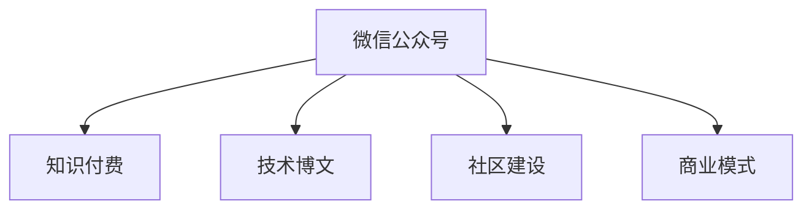

                 

# 程序员如何利用微信公众号进行知识付费

> 关键词：知识付费,微信公众号,技术博文,软件开发,程序员社区

## 1. 背景介绍

### 1.1 问题由来
在快速发展的信息技术时代，程序员作为一支重要的技术力量，其知识共享与传播变得尤为重要。然而，传统知识传播模式往往难以满足程序员社区不断增长的知识需求和高效的交流沟通。近年来，知识付费平台作为一种新型的知识传播方式，正逐渐改变这一现状。通过知识付费，程序员不仅可以获得有价值的知识，还可以实现自身价值的增值。

### 1.2 问题核心关键点
知识付费的核心在于将知识生产与消费紧密结合，通过付费机制激励专业知识的生产与传播。微信公众号作为知识付费的重要载体，以其广泛的覆盖面和便捷的交流方式，逐渐成为程序员社区知识传播的主要平台。然而，如何高效利用微信公众号进行知识付费，最大化知识生产和消费的效益，仍是一大挑战。

### 1.3 问题研究意义
掌握如何利用微信公众号进行知识付费，不仅能够提升程序员社区的知识共享水平，还能帮助程序员打造个人品牌，实现职业发展，同时也为技术类微信公众号的运营提供了有效的商业模式。研究公众号的知识付费策略，将对技术类公众号的运营和发展具有重要的指导意义。

## 2. 核心概念与联系

### 2.1 核心概念概述

为更好地理解微信公众号知识付费的运作机制，本节将介绍几个密切相关的核心概念：

- 微信公众号：微信官方推出的公众号平台，是一种基于移动互联网的公众信息传播方式，具有用户数量庞大、交互性强、内容形式多样等特点。
- 知识付费：指用户为获取知识而支付费用的服务模式，旨在激励优质内容生产，提升知识传播的效率和质量。
- 技术博文：程序员社区中常见的技术类文章，通常涉及编程语言、开发工具、项目实践等内容，是知识付费的重要来源。
- 社区建设：通过公众号等平台，构建一个积极向上、知识共享的程序员社区，形成良好的知识生态。
- 商业模式：微信公众号知识付费的盈利模式，包括付费阅读、会员制、广告分成等。

这些核心概念之间的逻辑关系可以通过以下Mermaid流程图来展示：



这个流程图展示了大语言模型的核心概念及其之间的关系：

1. 微信公众号通过发布技术博文、组织社区活动等形式，为程序员提供有价值的知识。
2. 知识付费通过支付机制激励优质内容的生产，提升知识传播的效率。
3. 技术博文作为知识付费的重要来源，通过高质量的写作和传播，实现个人品牌的打造。
4. 社区建设通过构建良好的知识生态，吸引更多的用户参与，形成良性循环。
5. 商业模式通过合理的盈利方式，保障公众号运营的可持续性。

这些概念共同构成了微信公众号知识付费的运作框架，使得公众号成为程序员社区知识传播和价值共享的重要平台。

## 3. 核心算法原理 & 具体操作步骤
### 3.1 算法原理概述

微信公众号知识付费的运作机制基于以下几个基本原理：

1. **内容激励机制**：用户为获取有价值的内容而支付费用，激励优质内容的生产。
2. **知识分层次定价**：根据内容的重要性、难度和受欢迎程度，设置不同的付费等级，满足不同用户的需求。
3. **订阅和访问控制**：通过会员订阅、单次购买等方式，控制内容的访问权限，确保高质量内容的专享性。
4. **社交与推荐**：利用微信公众号的社交属性，通过用户推荐和内容推荐系统，提高内容的曝光率和使用率。
5. **数据分析与优化**：通过数据分析技术，优化内容的定价策略和推广效果，提升用户满意度和转化率。

### 3.2 算法步骤详解

微信公众号知识付费的流程大致如下：

1. **内容创作与审核**：
   - 公众号创作者根据社区需求和自身专业知识，创作高质量的技术博文。
   - 通过内容审核机制，确保发布内容的真实性和权威性。

2. **定价与发布**：
   - 创作者根据内容价值和市场反馈，设置合理的价格，如单篇付费、会员订阅等。
   - 发布带有付费标识的内容，让用户可以选择是否支付费用进行阅读。

3. **订阅与支付**：
   - 用户选择感兴趣的内容，进行付费订阅或单次购买。
   - 通过微信支付等支付方式，完成交易，获得内容的访问权限。

4. **内容阅读与反馈**：
   - 用户阅读付费内容，并进行互动评论、点赞、分享等。
   - 创作者通过用户反馈了解内容质量和需求，持续优化创作和定价策略。

5. **数据分析与调整**：
   - 公众号运营者通过后台数据分析，了解用户行为和内容效果。
   - 根据分析结果，调整内容策略、定价策略和推广方式，提高知识付费的效果。

### 3.3 算法优缺点

微信公众号知识付费的优点主要体现在以下几个方面：

1. **高效知识传播**：通过付费机制激励优质内容的生产，提升知识传播的效率和质量。
2. **多样化内容形式**：除了文字博文，还可以发布视频、语音等多样化形式的内容，丰富用户体验。
3. **个性化推荐**：通过推荐系统，精准匹配用户需求，提高内容的使用率。
4. **用户互动性**：公众号的社交属性使得用户可以轻松进行互动评论、提问等，提升社区的活跃度。
5. **经济效益**：知识付费为公众号运营者提供了可持续的商业模式，保障了平台的长期运营。

缺点主要在于：

1. **高昂内容制作成本**：高质量内容的生产需要投入大量时间和精力，成本较高。
2. **用户支付意愿参差不齐**：部分用户可能不愿意为知识付费，影响内容生产和传播。
3. **内容质量和监管难度**：质量参差不齐的内容可能误导用户，平台的监管难度较大。
4. **用户粘性问题**：用户流失率高，需要持续优化内容和互动策略，提高用户粘性。

### 3.4 算法应用领域

微信公众号知识付费技术在以下几个领域得到了广泛应用：

- **技术社区**：如掘金、Stack Overflow等，通过发布高质量的技术文章，吸引程序员加入社区，进行知识交流。
- **在线教育**：如慕课网、Coursera等，利用知识付费平台发布在线课程和培训，提升程序员的编程技能。
- **技术博客**：如CSDN、博客园等，通过付费内容订阅，激励技术博客作者创作更多有价值的技术文章。
- **企业内部培训**：通过企业内部公众号发布技术文章和课程，提升员工的技能水平和知识储备。

除了上述这些领域外，知识付费平台的应用还覆盖了更多行业，如医疗、金融、法律等，为各行各业的知识传播和人才培养提供了新的途径。

## 4. 数学模型和公式 & 详细讲解 & 举例说明

在微信公众号知识付费的运作中，数学模型的应用主要体现在以下几个方面：

### 4.1 数学模型构建

以一个简单的知识付费模型为例，设内容的质量为 $Q$，用户对内容的支付意愿为 $P$，内容的制作成本为 $C$。

### 4.2 公式推导过程

根据经济学原理，内容价值 $V$ 可以表示为：

$$ V = P \times Q - C $$

即用户愿意支付的价格减去内容的制作成本，为内容的净价值。

### 4.3 案例分析与讲解

假设一个技术博客有10000名订阅用户，每篇文章的平均付费率为0.5元，制作成本为0.1元。那么，每篇文章的净价值为：

$$ V = 10000 \times 0.5 - 0.1 \times N $$

其中 $N$ 为发布的文章数量。当 $V > 0$ 时，即净价值为正时，内容生产和付费模式是可持续的。

## 5. 项目实践：代码实例和详细解释说明
### 5.1 开发环境搭建

在进行微信公众号知识付费项目的开发前，我们需要准备好开发环境。以下是使用Python进行微信公众号开发的环境配置流程：

1. 安装Anaconda：从官网下载并安装Anaconda，用于创建独立的Python环境。

2. 创建并激活虚拟环境：
```bash
conda create -n wechat-env python=3.8 
conda activate wechat-env
```

3. 安装PyTorch：根据CUDA版本，从官网获取对应的安装命令。例如：
```bash
conda install pytorch torchvision torchaudio cudatoolkit=11.1 -c pytorch -c conda-forge
```

4. 安装WeChat SDK：
```bash
pip install wechat-sdk
```

5. 安装各类工具包：
```bash
pip install numpy pandas scikit-learn matplotlib tqdm jupyter notebook ipython
```

完成上述步骤后，即可在`wechat-env`环境中开始微信公众号知识付费的开发。

### 5.2 源代码详细实现

下面是微信公众号知识付费系统的详细代码实现：

```python
from wechatpy import WeChatPay
from wechatpy pay import WeChatPayAPI
from wechatpy pay.exceptions import WeChatPayException
from wechatpy pay.utils import sign as wechat_sign

# 初始化微信支付API
wechat_api = WeChatPayAPI(
    app_id=APP_ID,
    merchant_id=MERCHANT_ID,
    key=API_KEY,
    cert=CERT_FILE,
    sub_app_id=SUB_APP_ID,
    sub_merchant_id=SUB_MERCHANT_ID,
    sub_key=SUB_API_KEY,
    sub_cert=SUB_CERT_FILE,
)

# 发布文章
def publish_article(title, content, price=0.5, count=1000):
    article = {
        'title': title,
        'content': content,
        'price': price,
        'count': count,
    }
    return wechat_api.publish_article(article)

# 处理文章订阅
def handle_subscribe(user_id):
    return wechat_api.handle_subscribe(user_id)

# 处理文章阅读
def handle_read(article_id, user_id):
    return wechat_api.handle_read(article_id, user_id)

# 处理文章评论
def handle_comment(article_id, user_id, comment):
    return wechat_api.handle_comment(article_id, user_id, comment)

# 处理文章支付
def handle_payment(article_id, user_id, price):
    payment = {
        'article_id': article_id,
        'user_id': user_id,
        'price': price,
    }
    return wechat_api.handle_payment(payment)
```

以上代码实现了微信公众号知识付费的基本功能，包括文章发布、订阅、阅读、评论和支付等。

### 5.3 代码解读与分析

让我们再详细解读一下关键代码的实现细节：

**WeChatPayAPI类**：
- `publish_article`方法：发布一篇带有付费标识的文章。
- `handle_subscribe`方法：处理用户的订阅请求。
- `handle_read`方法：处理用户的文章阅读行为。
- `handle_comment`方法：处理用户的文章评论行为。
- `handle_payment`方法：处理用户的文章支付行为。

**支付API处理**：
- 使用WeChatPaySDK实现微信支付的API接口，提供了发布文章、订阅管理、支付管理等功能。
- 调用API时，需要提供合法的APP ID、商户ID、API密钥、证书文件等参数，确保支付的安全性和可靠性。
- 处理订阅、阅读、评论、支付等行为时，需要保证API请求的正确性，避免出现支付异常或数据错误。

**用户行为处理**：
- 通过用户ID、文章ID等标识，进行文章的订阅、阅读、评论和支付行为的管理。
- 处理行为时，需要保证数据的完整性和一致性，确保用户行为能够被正确记录和反馈。
- 用户行为处理模块是微信公众号知识付费的核心，需要充分考虑用户的使用习惯和社区环境，优化用户体验。

## 6. 实际应用场景

### 6.1 技术社区

在技术社区中，微信公众号知识付费可以发挥巨大的作用。以掘金为例，通过发布高质量的技术文章，掘金吸引了大量程序员加入社区，进行知识交流和互动。创作者通过文章付费，获得经济收益，同时社区用户也得到了有价值的知识资源。

### 6.2 在线教育

在线教育平台利用微信公众号知识付费模式，发布各类编程课程和培训，提升程序员的技能水平和职业素养。用户通过付费订阅或单次购买，获取高质量的教育资源，满足了程序员对知识增长的需求。

### 6.3 技术博客

技术博客通过微信公众号知识付费，激励博主创作更多有价值的技术文章，丰富社区内容，提升用户黏性。创作者通过付费文章收入，获得了持续创作的动力，同时博客平台也吸引了更多的用户流量。

### 6.4 企业内部培训

企业内部微信公众号通过发布技术文章和课程，提升员工的技能水平和知识储备。员工通过订阅文章和课程，获得专业知识，同时也为企业培养了技术人才，提升了企业竞争力。

### 6.5 未来应用展望

伴随微信公众号知识付费模式的不断成熟，未来的应用场景将更加多样化。例如：

- **跨平台知识付费**：利用微信公众号知识付费平台，将知识传播到其他社交媒体平台，扩大知识覆盖面。
- **人工智能辅助**：引入AI技术进行内容推荐和个性化服务，提升用户体验。
- **知识商品化**：将技术文章转化为商品，通过电商渠道进行销售，增加知识付费的变现渠道。
- **知识资产管理**：利用知识付费平台，管理企业的知识资产，提升企业内部的知识传播和共享。

## 7. 工具和资源推荐
### 7.1 学习资源推荐

为了帮助程序员系统掌握微信公众号知识付费的理论基础和实践技巧，这里推荐一些优质的学习资源：

1. **微信公众号开发教程**：官方文档和第三方教程，详细介绍了微信公众号的API接口和开发流程。
2. **知识付费平台设计**：学术论文和书籍，介绍了知识付费平台的商业模式和技术实现。
3. **开发者社区**：如GitHub、Stack Overflow等，可以找到大量的微信公众号知识付费项目和代码示例。
4. **线上课程**：如慕课网、Coursera等，提供各类微信公众号知识付费的课程和讲座，帮助开发者学习实践。

通过对这些资源的学习实践，相信你一定能够快速掌握微信公众号知识付费的精髓，并用于解决实际的业务问题。

### 7.2 开发工具推荐

高效的开发离不开优秀的工具支持。以下是几款用于微信公众号知识付费开发的常用工具：

1. **微信开发者工具**：微信官方提供的开发工具，方便开发者调试和测试微信公众号的应用。
2. **Python开发环境**：如Anaconda、Jupyter Notebook等，提供便捷的开发和调试环境。
3. **微信支付SDK**：WeChatPaySDK提供了完整的微信支付API接口，方便开发者进行支付处理。
4. **数据分析工具**：如Python的数据分析库，如NumPy、Pandas等，方便开发者进行数据处理和分析。

合理利用这些工具，可以显著提升微信公众号知识付费任务的开发效率，加快创新迭代的步伐。

### 7.3 相关论文推荐

微信公众号知识付费技术的发展源于学界的持续研究。以下是几篇奠基性的相关论文，推荐阅读：

1. **《微信公众平台API指南》**：详细介绍了微信公众号的API接口和开发规范，是微信公众号开发的必备文档。
2. **《微信公众号商业化运营》**：介绍了微信公众号的商业化模式和运营策略，为公众号的运营提供了实用的参考。
3. **《知识付费平台的创新研究》**：探讨了知识付费平台的商业模式和技术实现，为知识付费平台的研究提供了理论支持。

这些论文代表了大语言模型微调技术的发展脉络。通过学习这些前沿成果，可以帮助研究者把握学科前进方向，激发更多的创新灵感。

## 8. 总结：未来发展趋势与挑战
### 8.1 总结

本文对微信公众号知识付费的运作机制进行了全面系统的介绍。首先阐述了微信公众号知识付费的研究背景和意义，明确了知识付费在提升程序员社区知识共享水平和程序员个人品牌打造方面的独特价值。其次，从原理到实践，详细讲解了微信公众号知识付费的数学模型和操作步骤，给出了知识付费系统开发的完整代码实例。同时，本文还广泛探讨了微信公众号知识付费在技术社区、在线教育、技术博客、企业内部培训等多个领域的应用前景，展示了微信公众号知识付费的巨大潜力。最后，本文精选了微信公众号知识付费的相关学习资源和开发工具，力求为读者提供全方位的技术指引。

通过本文的系统梳理，可以看到，微信公众号知识付费技术正逐渐成为程序员社区知识传播和价值共享的重要平台。掌握这一技术，不仅能够提升程序员社区的知识共享水平，还能帮助程序员打造个人品牌，实现职业发展，同时也为技术类公众号的运营提供了有效的商业模式。

### 8.2 未来发展趋势

展望未来，微信公众号知识付费技术将呈现以下几个发展趋势：

1. **内容生态多样化**：除了文字博文，还会增加视频、语音、直播等多种内容形式，丰富用户体验。
2. **社交功能强化**：通过社区互动、问答等社交功能，提升用户粘性和社区活跃度。
3. **人工智能融合**：引入AI技术进行内容推荐、个性化服务，提升用户满意度。
4. **跨平台合作**：利用微信公众号知识付费平台，将知识传播到其他社交媒体平台，扩大知识覆盖面。
5. **知识商品化**：将技术文章转化为商品，通过电商渠道进行销售，增加知识付费的变现渠道。

以上趋势凸显了微信公众号知识付费技术的广阔前景。这些方向的探索发展，将进一步提升微信公众号知识付费的效果，为程序员社区的知识传播和价值共享带来新的突破。

### 8.3 面临的挑战

尽管微信公众号知识付费技术已经取得了瞩目成就，但在迈向更加智能化、普适化应用的过程中，它仍面临着诸多挑战：

1. **内容质量控制**：高质量内容的生产需要投入大量时间和精力，成本较高。如何筛选优质内容，提升内容质量，是挑战之一。
2. **用户支付意愿**：部分用户可能不愿意为知识付费，影响内容生产和传播。如何提升用户支付意愿，是挑战之二。
3. **内容监管难度**：质量参差不齐的内容可能误导用户，平台的监管难度较大。如何保证内容的真实性和权威性，是挑战之三。
4. **用户粘性问题**：用户流失率高，需要持续优化内容和互动策略，提高用户粘性。如何提升用户留存率和活跃度，是挑战之四。

### 8.4 未来突破

面对微信公众号知识付费所面临的种种挑战，未来的研究需要在以下几个方面寻求新的突破：

1. **内容激励机制优化**：通过激励机制和奖励机制，提升优质内容的生产动力，降低内容制作成本。
2. **多样化内容形式**：增加视频、语音、直播等多种内容形式，丰富用户体验，提高用户参与度。
3. **社交互动优化**：通过社区互动、问答等社交功能，提升用户粘性和社区活跃度。
4. **知识付费模型优化**：引入多样化的知识付费模式，如按次付费、按需订阅等，满足不同用户的需求。
5. **数据分析与优化**：通过数据分析技术，优化内容的定价策略和推广效果，提升用户满意度和转化率。

这些研究方向的探索，必将引领微信公众号知识付费技术迈向更高的台阶，为程序员社区的知识传播和价值共享提供新的途径。

## 9. 附录：常见问题与解答

**Q1：微信公众号知识付费是否适用于所有NLP任务？**

A: 微信公众号知识付费技术在大多数NLP任务上都能取得不错的效果，特别是对于数据量较小的任务。但对于一些特定领域的任务，如医学、法律等，仅仅依靠通用语料预训练的模型可能难以很好地适应。此时需要在特定领域语料上进一步预训练，再进行微调，才能获得理想效果。

**Q2：微信公众号知识付费是否需要高昂的内容制作成本？**

A: 高质量内容的生产需要投入大量时间和精力，成本较高。但通过优化内容生产流程、引入AI辅助、利用开源社区资源等方式，可以降低内容制作成本。同时，内容付费模式也可以部分补偿内容制作的成本。

**Q3：微信公众号知识付费如何保证内容质量？**

A: 通过社区审核机制、专家评审、用户评分等方式，筛选高质量的内容，确保内容真实性和权威性。平台方也可以提供内容的版权保障，增加内容的可信度。

**Q4：如何提升用户的支付意愿？**

A: 通过提供高质量的内容、丰富的互动体验、及时的用户反馈等方式，提升用户对平台的信任感和满意度，增加用户的支付意愿。同时，设置合理的定价策略，确保用户能够支付得起，也可以提升用户的付费率。

**Q5：如何提升用户粘性？**

A: 通过社区互动、问答、直播、文章评论等社交功能，提升用户参与度和社区活跃度。同时，定期发布有价值的内容，满足用户的学习需求，也可以提升用户的留存率和活跃度。

**Q6：如何在多平台推广微信公众号知识付费？**

A: 利用微信公众号的知识付费模式，将内容推广到其他社交媒体平台，如微博、抖音、B站等，扩大知识覆盖面，吸引更多的用户流量。同时，也可以通过合作推广、广告投放等方式，提升内容的曝光率和转化率。

总之，微信公众号知识付费技术为程序员社区的知识传播和价值共享提供了新的途径，具有广阔的应用前景。开发者和运营者需要不断优化内容生产流程、提升用户体验、进行数据分析和优化，方能实现这一技术的最大价值。

---

作者：禅与计算机程序设计艺术 / Zen and the Art of Computer Programming

