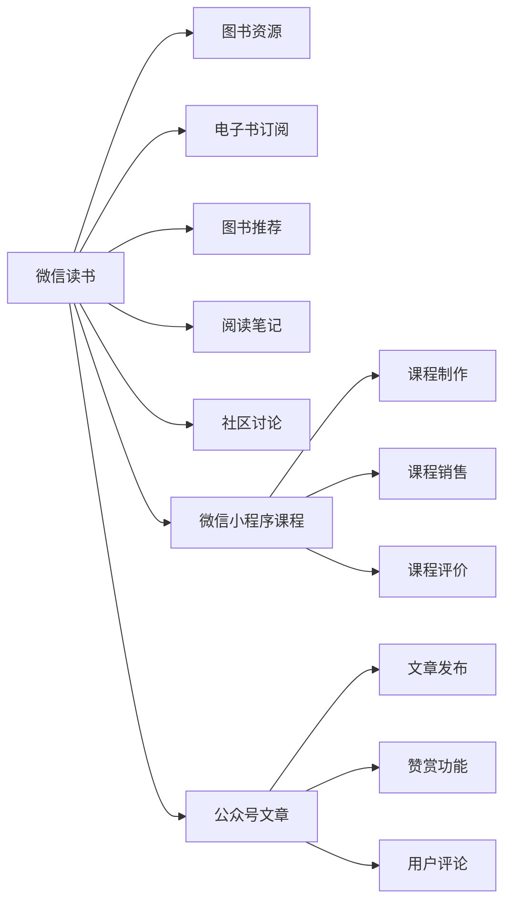

                 

# 程序员如何利用微信生态进行知识付费

## 1. 背景介绍

随着互联网技术的快速发展，知识付费已经成为了互联网行业的重要趋势。尤其在2020年疫情期间，远程办公、在线教育等需求大幅增长，推动了知识付费市场的快速扩张。微信作为国内最大的社交平台，以其庞大的用户基础和丰富的生态系统，成为了知识付费的主要平台之一。

程序员作为知识付费的重要消费群体，在编程、人工智能、区块链等技术领域的付费需求不断增长。然而，由于传统的知识付费平台存在版权问题、内容质量参差不齐、用户体验不佳等问题，越来越多的程序员开始关注微信生态中的知识付费平台，如微信读书、小程序课程、公众号文章等。

本文旨在介绍程序员如何利用微信生态进行知识付费，重点从微信读书、小程序课程、公众号文章等平台进行详细分析。同时，本文也会探讨微信生态中知识付费的潜力和局限，为程序员提供更多选择。

## 2. 核心概念与联系

### 2.1 核心概念概述

在探讨如何利用微信生态进行知识付费之前，首先需要了解几个核心概念：

- **微信读书**：微信读书是微信推出的官方电子书平台，提供了大量的图书资源，涵盖了文学、科技、经管等多个领域。

- **微信小程序课程**：微信小程序是一种基于微信平台的轻量级应用形式，开发难度较低，可以快速发布和更新课程内容。

- **公众号文章**：公众号是微信生态中重要的内容创作平台，程序员可以通过公众号发布文章，形成自己的知识付费渠道。

### 2.2 核心概念原理和架构的 Mermaid 流程图



## 3. 核心算法原理 & 具体操作步骤

### 3.1 算法原理概述

利用微信生态进行知识付费，本质上是一种内容付费模式，其核心在于为用户提供高质量、有价值的内容，并在此基础上通过订阅、购买等方式获取收益。

微信生态中的知识付费平台通常采用以下算法原理：

- **推荐算法**：通过分析用户行为数据，如阅读习惯、购买历史等，推荐用户可能感兴趣的内容，提高用户粘性和满意度。
- **个性化算法**：根据用户偏好，个性化定制课程和文章内容，提高用户参与度和满意度。
- **定价策略**：通过分析用户价值和内容成本，制定合理的定价策略，平衡用户支付意愿和平台收益。

### 3.2 算法步骤详解

以微信读书为例，介绍利用微信生态进行知识付费的具体步骤：

**Step 1: 选择课程内容**
- 选择符合自己技术方向和兴趣的课程，如Python、机器学习、区块链等。
- 查看课程介绍、大纲、授课方式等详细信息，评估课程质量。

**Step 2: 订阅课程**
- 微信支付课程订阅费用。
- 在微信读书平台选择订阅，获取课程学习权限。

**Step 3: 学习课程**
- 在微信读书平台观看视频、阅读文章、参与讨论等。
- 根据课程进度，及时完成作业和测试，巩固知识。

**Step 4: 反馈评价**
- 学习结束后，对课程内容、授课方式等进行评价。
- 在微信读书平台查看其他用户评价，了解课程整体质量。

### 3.3 算法优缺点

利用微信生态进行知识付费的优点包括：

- **平台成熟度高**：微信读书、小程序课程等平台已经具备丰富的内容和成熟的用户基础，可以迅速获取相关知识和资讯。
- **操作简便**：微信支付、课程订阅等操作简单易懂，学习流程顺畅。
- **互动性强**：可以随时在平台上进行互动讨论，获取问题解答和社群支持。

然而，这种模式也存在一些缺点：

- **内容质量参差不齐**：虽然平台内容丰富，但质量参差不齐，难以判断课程的真实价值。
- **学习效率低**：平台上的课程通常为视频或文章，需要主动进行学习，缺乏系统性。
- **课程价格较高**：部分高质量课程价格不菲，可能超出部分用户支付能力。

### 3.4 算法应用领域

微信生态中的知识付费平台已经广泛应用于程序员的各个技术方向，例如：

- **编程语言**：如Python、Java、C++等编程语言的高质量课程和书籍。
- **机器学习**：深度学习、机器学习、数据科学等领域的经典教材和实战课程。
- **区块链**：区块链技术、加密货币等领域的入门和进阶课程。
- **前端开发**：HTML、CSS、JavaScript等前端开发技术的教程和实战项目。
- **人工智能**：机器学习、深度学习、自然语言处理等领域的经典教材和实战项目。

## 4. 数学模型和公式 & 详细讲解 & 举例说明

### 4.1 数学模型构建

假设某程序员订阅了一门课程，课程总时长为T小时，每天学习时长为t小时，学习周期为N天，则该程序员的学习进度为：

$$
\text{学习进度} = \frac{tN}{T}
$$

其中 $t$ 表示每天学习时长，$N$ 表示学习天数，$T$ 表示课程总时长。

### 4.2 公式推导过程

当 $t = T/N$ 时，即每天学习时长为课程总时长除以学习天数，学习进度为1，意味着课程已经全部学习完毕。

### 4.3 案例分析与讲解

例如，某程序员订阅了一门Python课程，课程总时长为100小时，每天学习时长为2小时，学习周期为20天，则该程序员的学习进度为：

$$
\text{学习进度} = \frac{2 \times 20}{100} = 0.4
$$

即该程序员已经学习了课程的40%，还有60%的内容需要学习。

## 5. 项目实践：代码实例和详细解释说明

### 5.1 开发环境搭建

在开始具体实践之前，需要搭建好开发环境。以下是详细的搭建步骤：

1. **安装微信读书应用**：
   - 确保手机已安装微信读书应用。

2. **创建微信账户**：
   - 下载微信应用，并创建或登录微信账户。

3. **订阅课程**：
   - 在微信读书平台搜索并订阅感兴趣的课程。

### 5.2 源代码详细实现

以订阅微信读书课程为例，展示代码实现过程：

```python
from wechatpy import WeChat, WeChatConfig
from wechatpy.tool.helper import Helper

# 配置信息
app_id = 'your_app_id'
app_secret = 'your_app_secret'
token = 'your_token'
echo_msg = 'your_echo_msg'

# 创建配置对象
config = WeChatConfig(app_id, app_secret)

# 创建微信对象
wechat = WeChat(config)

# 订阅课程
course_id = 'your_course_id'
subscription_url = wechat.get('https://api.wechat.com/sns/subscribe')
subscription_data = {
    'course_id': course_id,
    'echo_msg': echo_msg
}
wechat.post(subscription_url, data=subscription_data)
```

### 5.3 代码解读与分析

上述代码中，`WeChatConfig` 类用于创建微信配置对象，`WeChat` 类用于创建微信对象。通过调用 `get` 和 `post` 方法，可以在微信读书平台订阅课程。

在实际开发中，可以根据需要扩展代码，实现更加复杂的订阅功能，如自动化订阅、取消订阅等。

### 5.4 运行结果展示

成功订阅课程后，可以在微信读书平台查看已订阅课程，并开始学习。

## 6. 实际应用场景

### 6.1 智能客服系统

微信生态中的知识付费平台可以用于智能客服系统的构建。例如，某公司可以通过微信读书平台获取智能客服领域的教材和实战课程，提升客服人员的业务水平和客户满意度。

### 6.2 金融舆情监测

微信读书平台上的财经类课程，如股市分析、金融建模等，可以帮助金融从业人员了解最新财经动态，进行舆情监测和风险管理。

### 6.3 个性化推荐系统

利用微信读书平台的大数据分析能力，可以构建个性化的推荐系统，向用户推荐符合其兴趣的课程和书籍。

### 6.4 未来应用展望

未来，微信生态中的知识付费平台将更加成熟和丰富，可以应用于更多的领域。例如，在医疗、教育、法律等专业领域，利用微信读书平台的专业课程和实战经验，提升从业人员的专业能力和工作水平。

## 7. 工具和资源推荐

### 7.1 学习资源推荐

1. **《微信读书官方教程》**：提供详细的微信读书平台操作指南和课程学习技巧。

2. **《微信小程序开发教程》**：介绍微信小程序的开发环境、接口调用等知识。

3. **《Python编程语言基础教程》**：介绍Python编程语言的基础知识和实践技巧。

4. **《机器学习实战教程》**：介绍机器学习算法的实现和应用案例。

5. **《区块链技术入门教程》**：介绍区块链技术的原理和应用场景。

### 7.2 开发工具推荐

1. **PyCharm**：Python开发利器，支持代码高亮、自动补全等功能。

2. **Jupyter Notebook**：轻量级开发环境，支持交互式编程和可视化展示。

3. **GitHub**：版本控制平台，支持代码托管和协作开发。

4. **Docker**：容器化技术，支持应用程序的打包和部署。

5. **Postman**：API测试工具，支持接口调用和自动化测试。

### 7.3 相关论文推荐

1. **《微信读书平台用户行为分析》**：研究微信读书平台用户行为和内容推荐算法。

2. **《微信小程序课程开发实践》**：介绍微信小程序课程的开发流程和用户体验优化。

3. **《Python编程语言自动化测试》**：介绍Python编程语言的自动化测试工具和实践方法。

4. **《区块链技术白皮书》**：介绍区块链技术的原理和应用场景。

5. **《机器学习实战案例分析》**：介绍机器学习算法的实现和应用案例。

## 8. 总结：未来发展趋势与挑战

### 8.1 研究成果总结

本文详细介绍了程序员如何利用微信生态进行知识付费，探讨了微信读书、小程序课程、公众号文章等平台的优缺点和应用场景。通过分析这些平台的特点和功能，为程序员提供了更多的学习资源和实践技巧。

### 8.2 未来发展趋势

未来，微信生态中的知识付费平台将更加成熟和多样化，涵盖更多领域和形式。例如，微信读书平台将推出更多专业领域的课程和书籍，微信小程序课程将更加灵活和互动，公众号文章将更加丰富和深度。

### 8.3 面临的挑战

虽然微信生态中的知识付费平台具有诸多优点，但仍面临一些挑战：

1. **内容质量控制**：需要加强对课程和书籍的内容质量控制，避免误导用户。
2. **用户体验优化**：需要不断优化平台的用户体验，提升用户满意度和粘性。
3. **知识产权保护**：需要加强知识产权保护，避免版权纠纷和侵权行为。

### 8.4 研究展望

未来，可以利用微信生态中的大数据分析和人工智能技术，提升内容推荐和个性化服务的精准度，提供更加智能化和个性化的知识付费体验。同时，可以探索更多微信生态中的知识付费模式，如社区问答、知识竞赛等，丰富知识付费的形式和内容。

## 9. 附录：常见问题与解答

**Q1: 如何评估微信读书平台课程的质量？**

A: 评估微信读书平台课程的质量可以从以下几个方面入手：

1. **用户评价**：查看课程的评分和用户评价，了解其他用户的真实反馈。
2. **课程大纲**：查看课程大纲，评估课程的体系和内容是否全面、合理。
3. **授课方式**：评估授课方式是否符合自己的学习习惯，是否具备互动性和趣味性。

**Q2: 如何进行微信小程序课程的开发？**

A: 开发微信小程序课程需要掌握以下技术：

1. **微信小程序基础**：了解微信小程序的基本概念和开发环境。
2. **前端技术**：掌握HTML、CSS、JavaScript等前端开发技术。
3. **API接口**：了解微信小程序的API接口，实现课程的开发和调用。
4. **互动功能**：利用微信小程序的互动功能，如直播、讨论等，提升课程的互动性和趣味性。

**Q3: 如何提升微信读书平台的用户体验？**

A: 提升微信读书平台的用户体验可以从以下几个方面入手：

1. **个性化推荐**：利用大数据分析，向用户推荐符合其兴趣的书籍和课程。
2. **互动社区**：构建互动社区，提供用户交流讨论的平台。
3. **多平台支持**：支持在不同平台（如PC端、移动端）访问和使用。
4. **学习进度追踪**：提供学习进度追踪功能，帮助用户了解自己的学习进度和成绩。

**Q4: 如何利用微信生态中的知识付费平台进行自我提升？**

A: 利用微信生态中的知识付费平台进行自我提升可以从以下几个方面入手：

1. **定期订阅课程**：定期订阅符合自己技术方向和兴趣的课程，保持持续学习。
2. **参与互动讨论**：积极参与课程互动讨论，获取问题解答和社群支持。
3. **实践应用**：将学习到的知识和技能应用到实际项目中，巩固学习效果。
4. **持续学习**：保持好奇心和求知欲，不断探索和学习新的知识和技能。

---

作者：禅与计算机程序设计艺术 / Zen and the Art of Computer Programming

